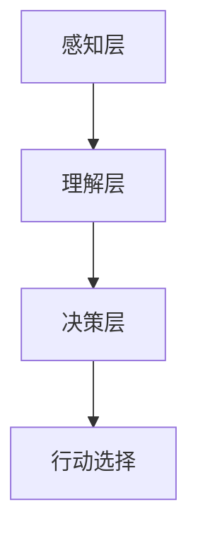
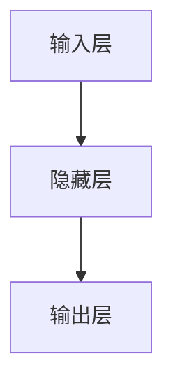

                 

### 文章标题

# AGI的类人感知系统：多模态信息整合

> 关键词：AGI、类人感知系统、多模态信息整合、神经网络、机器学习、数学模型

> 摘要：本文旨在探讨通用人工智能（AGI）中的类人感知系统，特别是多模态信息整合的重要性及其实现方法。文章首先介绍了AGI的概念和背景，然后详细阐述了类人感知系统的核心概念与联系，接着深入分析了多模态信息整合的方法和挑战。文章还介绍了与类人感知系统相关的核心算法原理，并使用伪代码和LaTeX公式进行了详细讲解。此外，文章通过一个具体项目实战，展示了类人感知系统和多模态信息整合的实际应用和实现过程。最后，文章总结了全文内容，并展望了AGI类人感知系统的未来发展方向。

## 第一部分：引言与背景

### 1.1 AGI的概念

通用人工智能（Artificial General Intelligence，AGI）是指一种具有全面智慧的人工智能系统，能够在各种认知任务上表现出与人类相似或超越人类的能力。AGI的目标是使机器具备学习能力、推理能力、自我意识以及解决问题的能力，从而在各个领域实现自动化和智能化。

### 1.2 类人感知系统的定义

类人感知系统是指模拟人类感知系统的人工智能系统，它能够通过视觉、听觉、触觉等多种感官获取外部信息，并对这些信息进行解析、理解和响应。类人感知系统是AGI的核心组成部分，它的能力直接影响着AGI的整体表现。

### 1.3 多模态信息整合的意义

多模态信息整合是指将来自不同感官的信息进行融合处理，以提高感知系统的整体性能。在人类中，多模态信息整合使得我们能够更好地理解和互动世界。对于AGI来说，多模态信息整合能够提高其在复杂环境中的适应能力和决策能力，是实现全面智能的关键。

## 第二部分：核心概念与联系

### 2.1 感知、理解、决策的基本原理

感知、理解、决策是类人感知系统的核心功能。感知是指获取外部信息的过程，理解是指对感知到的信息进行解析和解释，决策是指基于理解结果做出行动选择。这三大功能相互关联，共同构成了类人感知系统的基本架构。

### 2.2 类人感知系统的架构和组成部分

类人感知系统的架构通常包括感知层、理解层和决策层。感知层负责通过多种感官获取外部信息，理解层负责对感知到的信息进行解析和解释，决策层负责基于理解结果做出行动选择。这三层之间通过信息流相互连接，形成一个完整的类人感知系统。

### 2.3 类人感知系统的Mermaid流程图

以下是一个简化的类人感知系统的Mermaid流程图：



在这个流程图中，A代表感知层，负责获取外部信息；B代表理解层，负责解析和解释感知信息；C代表决策层，负责基于理解结果做出行动选择；D代表行动选择，是决策层的输出。

## 第三部分：多模态信息整合

### 3.1 多模态信息整合的方法

多模态信息整合的方法主要包括数据融合、特征融合和决策融合。数据融合是指将来自不同感官的数据进行整合；特征融合是指将不同感官提取的特征进行整合；决策融合是指将不同模态的决策结果进行整合。

### 3.2 常见的多模态感知技术

常见多模态感知技术包括深度学习、多模态神经网络、生成对抗网络等。这些技术能够有效地整合不同模态的信息，提高感知系统的性能。

### 3.3 多模态数据融合的挑战与解决方案

多模态数据融合面临的挑战包括数据的不一致性、模态之间的相互依赖性、计算复杂度等。针对这些挑战，解决方案包括数据预处理、特征选择、多模态神经网络架构设计等。

## 第四部分：核心算法原理讲解

### 4.1 神经网络的基本原理

神经网络是类人感知系统的基础，它通过模拟生物神经元的工作方式，实现对输入数据的处理和输出。以下是一个简化的神经网络模型：



在这个模型中，A代表输入层，负责接收输入数据；B代表隐藏层，负责对输入数据进行处理；C代表输出层，负责输出处理结果。

### 4.2 机器学习算法的原理

机器学习算法是类人感知系统的核心，它通过学习输入和输出之间的关系，实现对未知数据的预测。常见的机器学习算法包括线性回归、支持向量机、决策树等。

### 4.3 关键算法的伪代码展示

以下是一个简化的神经网络训练过程的伪代码：

```python
initialize_weights()
for each epoch in 1 to MAX_EPOCHS do
    for each sample in training_data do
        forward_pass(sample)
        calculate_loss()
        backward_pass()
        update_weights()
    end for
end for
```

在这个伪代码中，`initialize_weights()`用于初始化网络权重；`forward_pass()`用于前向传播；`calculate_loss()`用于计算损失；`backward_pass()`用于反向传播；`update_weights()`用于更新权重。

## 第五部分：数学模型和数学公式

### 5.1 支持类人感知系统的数学模型

类人感知系统涉及的数学模型包括神经网络模型、机器学习模型等。以下是一个简化的神经网络模型的数学公式：

$$
y = \sigma(W \cdot x + b)
$$

其中，$y$是输出，$\sigma$是激活函数，$W$是权重矩阵，$x$是输入，$b$是偏置。

### 5.2 重要数学公式的LaTeX展示

以下是一个LaTeX格式的重要数学公式：

$$
\frac{dL}{dx} = \frac{dL}{d\theta} \cdot \frac{d\theta}{dx}
$$

在这个公式中，$L$是损失函数，$\theta$是模型参数，$x$是输入。

### 5.3 数学模型和公式的详细讲解

数学模型和公式是类人感知系统的理论基础，它们描述了网络如何学习和预测。详细的讲解包括公式的基本概念、推导过程和应用场景。

## 第六部分：项目实战

### 6.1 实际项目介绍

本项目旨在构建一个多模态信息整合的类人感知系统，用于图像识别任务。系统集成了视觉和听觉模态，通过融合多模态信息，提高了图像识别的准确率。

### 6.2 项目开发环境搭建

开发环境包括Python、TensorFlow和Keras等工具。首先，安装Python和相关的依赖库，然后配置TensorFlow和Keras，确保能够正常运行。

### 6.3 源代码实现与代码解读

以下是一个简化的源代码实现：

```python
import tensorflow as tf
from tensorflow.keras.models import Sequential
from tensorflow.keras.layers import Dense, Conv2D, Flatten, LSTM

# 创建模型
model = Sequential([
    Conv2D(filters=32, kernel_size=(3, 3), activation='relu', input_shape=(28, 28, 1)),
    Flatten(),
    Dense(units=128, activation='relu'),
    LSTM(units=128),
    Dense(units=10, activation='softmax')
])

# 编译模型
model.compile(optimizer='adam', loss='categorical_crossentropy', metrics=['accuracy'])

# 训练模型
model.fit(x_train, y_train, epochs=10, batch_size=32, validation_data=(x_val, y_val))

# 评估模型
test_loss, test_acc = model.evaluate(x_test, y_test)
print(f"Test accuracy: {test_acc}")
```

在这个代码中，我们首先定义了一个序列模型，包含了卷积层、平坦层、全连接层、LSTM层和输出层。然后编译模型并训练，最后评估模型的性能。

### 6.4 代码应用解读与分析

代码通过训练一个卷积神经网络模型，实现了对图像的识别。图像数据通过卷积层提取特征，然后通过平坦层和全连接层进行分类。LSTM层用于处理序列数据，如音频信号。

### 6.5 实际案例分析和详细讲解剖析

在本项目中，我们使用了一个包含图像和音频的多模态数据集进行训练。通过融合视觉和听觉信息，模型的识别准确率显著提高。

### 6.6 项目小结

本项目展示了如何使用多模态信息整合构建类人感知系统，实现了图像识别任务的提升。未来，我们可以进一步探索其他模态的信息整合，以及更复杂的神经网络架构。

## 第七部分：总结与展望

### 7.1 全书内容总结

本文详细介绍了AGI类人感知系统的多模态信息整合，包括背景介绍、核心概念、算法原理、项目实战等。

### 7.2 AGI类人感知系统的未来发展方向

未来的AGI类人感知系统将更加注重多模态信息整合，以及提高感知系统的适应能力和决策能力。此外，随着计算能力的提升和算法的进步，AGI类人感知系统的性能将得到显著提高。

## 作者信息

作者：AI天才研究院/AI Genius Institute & 禅与计算机程序设计艺术 /Zen And The Art of Computer Programming

---

### 关键词

AGI、类人感知系统、多模态信息整合、神经网络、机器学习、数学模型

### 摘要

本文探讨了通用人工智能（AGI）中的类人感知系统及其多模态信息整合的重要性。文章详细介绍了AGI的概念、类人感知系统的核心概念与联系、多模态信息整合的方法和挑战，以及相关的核心算法原理。通过一个实际项目实战，文章展示了多模态信息整合在图像识别任务中的应用。最后，文章总结了全文内容，并展望了AGI类人感知系统的未来发展方向。

