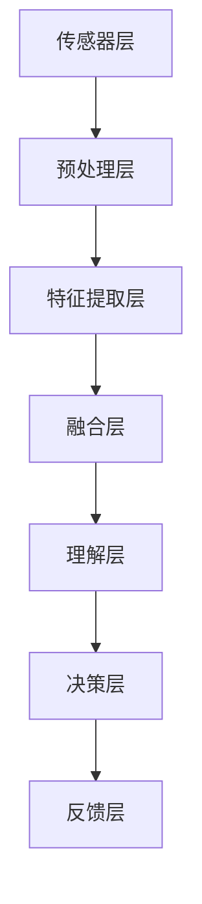
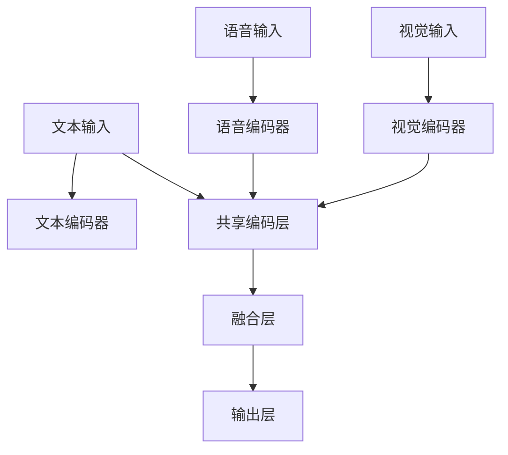

                 


### 1.1 AGI类人感知系统的背景

人工通用智能（AGI，Artificial General Intelligence）是人工智能领域的一个终极目标，旨在构建出能够像人类一样具备普遍智能的人工智能系统。这类系统不仅能够在特定任务上表现出色，还能够在广泛的应用场景中自主学习和适应，拥有与人类类似的感知、理解、推理、决策和创造能力。AGI的发展具有深远的意义，它不仅能够推动科技和经济的进步，还能够为人类社会带来更多创新和变革。

类人感知系统是AGI的核心组成部分之一，它专注于模拟和增强人类的感知能力。人类的感知系统非常复杂，能够通过多种感官（如视觉、听觉、触觉、嗅觉和味觉）来获取环境信息，并在大脑中进行处理和理解。类人感知系统试图通过整合不同模态的信息，构建出一个类似于人类感知系统的智能系统，从而实现更高层次的信息理解和智能决策。

AGI类人感知系统的发展背景可以追溯到20世纪中期。当时，随着计算机科学和人工智能技术的兴起，研究者开始尝试模拟人类的思维过程。早期的AI系统主要专注于特定领域的应用，例如游戏、语音识别和图像处理等。然而，这些系统往往局限于特定的任务，难以实现通用性和灵活性。

随着计算能力的提升和大数据技术的发展，研究者开始探索如何构建能够模拟人类感知和理解的智能系统。类人感知系统的研究逐渐成为AI领域的一个重要方向。近年来，深度学习、神经网络和强化学习等技术的突破，为类人感知系统的研究提供了强有力的支持，使得AGI类人感知系统的实现变得更为可行。

### 1.2 类人感知系统的定义与特点

类人感知系统是指一种模仿人类感知机制的人工智能系统，它能够通过多种传感器获取外部信息，并对其进行处理、理解和响应。与传统的AI系统不同，类人感知系统不仅仅关注单一感官的数据，而是能够整合来自多个感官的信息，从而实现更全面的感知和理解。

类人感知系统的定义可以从以下几个方面来阐述：

1. **多模态信息处理**：类人感知系统能够处理多种模态的信息，包括视觉、听觉、触觉、嗅觉和味觉等。这些信息可以通过不同的传感器进行采集，例如摄像头、麦克风、力传感器和化学传感器等。

2. **信息融合与理解**：类人感知系统能够将来自不同模态的信息进行融合，形成一个统一的理解。这种融合不仅包括不同类型数据的结合，还包括对时间序列数据的处理和关联。通过信息融合，类人感知系统能够对环境进行更全面、更准确的感知。

3. **自适应性与学习能力**：类人感知系统能够根据环境和任务的需求，动态调整其感知和决策策略。这种自适应能力来源于系统的学习机制，包括监督学习、无监督学习和强化学习等。通过不断学习和优化，类人感知系统能够不断提高其感知能力和决策质量。

4. **交互能力**：类人感知系统不仅能够感知和理解环境，还能够与人类进行有效的交互。这种交互可以是语音对话、手势控制或身体运动等。通过交互，类人感知系统能够更好地适应人类的需求，并提供更加自然、便捷的服务。

类人感知系统的特点主要体现在以下几个方面：

1. **综合性**：类人感知系统将多种感官信息进行整合，使得系统能够从多个维度感知和理解环境。

2. **动态性**：类人感知系统能够根据环境和任务的需求，实时调整其感知和决策策略，实现动态适应。

3. **智能性**：类人感知系统通过学习机制，不断提高其感知和决策能力，使其在复杂环境中表现出类似人类的智能。

4. **交互性**：类人感知系统通过与人类的交互，能够更好地理解和满足人类的需求，提供个性化服务。

总的来说，类人感知系统是AGI的重要组成部分，它通过模拟和增强人类的感知能力，为人工智能的发展提供了新的思路和方向。类人感知系统的发展不仅能够推动人工智能技术的进步，还能够为人类社会带来更多创新和变革。接下来，我们将进一步探讨类人感知系统的架构和关键技术。

### 1.3 类人感知系统的架构

类人感知系统的架构是一个多层次、模块化的系统，其核心目标是模拟和增强人类的感知能力。整个系统可以分为以下几个主要部分：

1. **传感器层**：传感器层是类人感知系统的输入部分，负责采集不同模态的信息。这些传感器包括摄像头、麦克风、力传感器、温度传感器、湿度传感器、化学传感器等。每种传感器都能够捕获特定类型的信息，例如视觉传感器捕获图像，听觉传感器捕获声音。

2. **预处理层**：预处理层对传感器采集的数据进行初步处理，包括数据清洗、去噪、增强和格式转换等。预处理层的目的是提高数据的质量和可靠性，以便后续处理和分析。预处理层可能包括多个子模块，例如图像增强、声音去噪、姿态估计等。

3. **特征提取层**：特征提取层从预处理后的数据中提取关键特征，这些特征是后续处理和分析的基础。特征提取可以是基于传统机器学习算法（如SVM、KNN等）或深度学习算法（如卷积神经网络、循环神经网络等）。特征提取层的目标是捕捉数据中的高层次信息，例如视觉特征、声音特征、姿态特征等。

4. **融合层**：融合层是类人感知系统的核心部分，负责将来自不同模态的特征进行整合，形成统一的理解。融合方法包括多模态特征融合、多任务学习、多视角融合等。融合层的目的是提高系统的整体感知能力和决策质量。例如，在视频分析场景中，融合视觉特征和音频特征可以帮助系统更准确地识别行为和情感。

5. **理解层**：理解层对融合后的特征进行高层次的分析和理解，以生成对环境的有意义描述。理解层可能包括语义分析、情感识别、行为预测等。理解层的输出可以是标签、分类结果、决策建议等。理解层的算法通常基于深度学习和概率图模型等先进技术。

6. **决策层**：决策层根据理解层的输出做出决策，并控制系统的行为。决策层可以是基于规则的方法，也可以是机器学习算法（如决策树、神经网络等）。决策层的目的是实现系统的目标，例如自动化控制、智能交互等。

7. **反馈层**：反馈层是类人感知系统的输出部分，负责将系统的决策反馈到环境中。反馈可以是直接控制外部设备，例如移动机器人、智能车辆等，也可以是生成报告、图表等。反馈层的目的是验证系统的决策效果，并指导进一步的优化。

以下是类人感知系统的架构Mermaid流程图：



通过以上架构，类人感知系统能够实现对多模态信息的全面感知、理解和响应，从而在复杂环境中表现出类似人类的智能。接下来，我们将深入讨论多模态信息的整合算法，探讨如何有效地融合来自不同模态的数据，以提升系统的整体性能。

### 1.4 类人感知系统与其他技术的关联

类人感知系统作为AGI的核心组成部分，与其他先进技术紧密相连，共同推动了人工智能领域的发展。以下是一些与类人感知系统密切相关的技术：

1. **深度学习**：深度学习是类人感知系统的关键技术之一，它通过构建复杂的神经网络模型，能够自动学习并提取数据中的高维特征。深度学习在图像识别、语音识别、自然语言处理等领域取得了显著成果，为类人感知系统的多模态信息处理提供了强大的工具。

2. **神经网络**：神经网络是深度学习的基础，它模拟了人脑神经元的工作机制，能够通过大量数据训练得到高精度的预测模型。神经网络在类人感知系统中扮演着关键角色，不仅用于特征提取和融合，还用于理解层和决策层的任务。

3. **强化学习**：强化学习是一种通过试错和奖励反馈进行学习的方法，适用于动态和不确定的环境。在类人感知系统中，强化学习可以用于决策层，使得系统能够根据实时反馈不断优化其行为策略。

4. **自然语言处理**：自然语言处理（NLP）技术使得类人感知系统能够理解和生成自然语言。在多模态信息融合过程中，NLP技术可以帮助系统更好地理解文本信息，并将其与其他模态信息进行关联。

5. **计算机视觉**：计算机视觉是类人感知系统的重要组成部分，它致力于通过图像和视频数据理解和感知环境。计算机视觉技术包括图像识别、目标检测、姿态估计等，这些技术在类人感知系统中用于处理视觉信息。

6. **语音识别**：语音识别技术使得类人感知系统能够理解和处理语音信号，从而实现自然的人机交互。语音识别在类人感知系统中用于处理听觉信息，并与视觉、文本等信息进行融合。

7. **传感器融合**：传感器融合技术用于整合来自多个传感器的数据，提高系统的感知准确性和鲁棒性。在类人感知系统中，传感器融合技术是实现多模态信息整合的关键。

通过以上技术与类人感知系统的结合，研究者们不断探索和突破，使得类人感知系统能够在复杂环境中表现出更高的智能水平和适应性。这些技术不仅推动了类人感知系统的发展，也为其他人工智能应用领域带来了新的启示和可能。

### 摘要

本文深入探讨了人工通用智能（AGI）类人感知系统：多模态信息的整合与理解。首先，我们介绍了AGI的背景和重要性，以及类人感知系统的定义与特点。随后，我们详细阐述了类人感知系统的架构，包括传感器层、预处理层、特征提取层、融合层、理解层、决策层和反馈层。此外，我们还讨论了类人感知系统与其他先进技术的关联，如深度学习、神经网络、强化学习、自然语言处理和计算机视觉等。文章的重点在于多模态信息的整合与理解，通过具体算法和实现方法，展示了如何有效地整合来自不同模态的信息，提高系统的整体感知能力和智能水平。最后，我们展望了类人感知系统的未来发展趋势和面临的挑战，并提出了相应的解决方案。本文旨在为研究人员和开发者提供一个全面、系统的类人感知系统指南，推动人工智能领域的创新和发展。

## 第2章：多模态信息的整合算法

### 2.1 多模态信息的采集与预处理

多模态信息整合的前提是对各种模态的信息进行有效的采集与预处理。首先，传感器层的多样化传感器，如摄像头、麦克风、力传感器、温度传感器和化学传感器等，负责采集视觉、听觉、触觉、温度和化学等多模态数据。这些传感器分布在不同的位置，以覆盖更广阔的环境，从而获取更全面的信息。

采集到的数据通常包含噪声和冗余信息，因此需要进行预处理。预处理过程包括以下几个步骤：

1. **数据清洗**：数据清洗是指去除噪声、填充缺失值和纠正数据错误。对于视觉数据，可能涉及去除图像中的噪声点、填补图像中的空洞；对于音频数据，可能需要去除背景噪声、增强声音信号；对于触觉数据，可能涉及去除传感器误差等。

2. **数据标准化**：数据标准化是指将不同模态的数据转换成统一格式，以便后续处理。例如，将不同分辨率和亮度的图像统一缩放到相同的尺寸，将不同音量的声音统一缩放到相同的幅度。

3. **数据增强**：数据增强是指通过增加数据的多样性，提高模型对未知数据的泛化能力。数据增强方法包括图像旋转、翻转、裁剪、缩放等，以及音频的回声、混响等处理。

预处理的过程不仅需要处理单一模态的数据，还需要处理多模态数据之间的相关性。例如，在图像和音频数据的预处理中，可以分析两者之间的时间同步关系，确保图像帧和音频帧在时间上保持一致。此外，还可以使用多模态特征融合技术，如联合降维（如主成分分析PCA）和多模态特征匹配，以提高预处理效果。

通过有效的采集与预处理，多模态信息能够被转化为适合后续处理和分析的格式，为多模态信息整合算法的优化提供了良好的数据基础。

### 2.2 多模态信息整合的基本原理

多模态信息整合的基本原理在于将来自不同感官模态的数据进行融合，从而形成一个统一的、丰富的信息表示。这种整合不仅能够提高系统的感知能力，还能够增强系统的理解深度和决策准确性。多模态信息整合的关键在于如何处理不同模态之间的数据差异，以及如何有效地融合这些数据。

首先，多模态信息整合需要解决的一个关键问题是模态间的对齐问题。不同模态的数据通常具有不同的采样频率、时间和空间分辨率等特性，导致数据在时间轴和空间上的不一致。因此，多模态信息整合的首要任务是对齐这些数据，使其在同一个时间基准下进行融合。对齐方法可以分为两类：

1. **时间对齐**：通过时间同步算法，将不同模态的数据在时间轴上进行对齐。常用的方法包括基于时间标签的同步、基于信号特征的同步和基于视觉参考的同步。例如，在视频和音频数据的对齐中，可以基于视频中的语音波形特征或视觉中的文本字幕进行同步。

2. **空间对齐**：通过空间变换算法，将不同模态的数据在空间上进行对齐。例如，在视觉和触觉数据的整合中，可以通过姿态估计技术（如SLAM、视觉惯性测量单元IMU）来对齐视觉和触觉传感器在空间上的位置。

在对齐完成后，多模态信息整合的核心任务是数据融合。数据融合方法可以分为以下几类：

1. **特征级融合**：在特征级融合中，不同模态的特征被直接整合。常见的方法包括加权融合、拼接融合和平均融合。例如，在视觉和语音数据的融合中，可以将图像的像素值和语音的频谱特征进行拼接，形成一个多维特征向量。

2. **决策级融合**：在决策级融合中，不同模态的预测结果被整合。例如，在行为识别任务中，视觉系统预测到的行为和语音系统预测到的行为可以通过投票或融合模型进行融合，得到最终的行为预测结果。

3. **模型级融合**：在模型级融合中，不同模态的模型被整合。这种方法通常用于深度学习模型，通过构建多输入的多层神经网络，将不同模态的数据同时输入到模型中，共享部分网络结构以实现信息融合。

在多模态信息整合过程中，另一个关键问题是不同模态数据之间的相关性。例如，在视觉和语音融合中，图像中的动作和语音中的语言内容可能存在密切的关联。为了捕捉这种关联，可以采用多任务学习（Multi-Task Learning，MTL）的方法，将不同模态的数据关联到同一个任务中，从而提高整合效果。

多模态信息整合的基本原理可以概括为以下几个步骤：

1. **数据采集**：使用多样化的传感器采集不同模态的数据。

2. **数据预处理**：对采集到的数据执行数据清洗、标准化和增强等预处理操作。

3. **时间与空间对齐**：通过时间同步和空间变换，对齐不同模态的数据。

4. **特征级融合**：将不同模态的特征进行整合，形成统一的多维特征向量。

5. **决策级融合**：整合不同模态的预测结果，生成最终的决策。

6. **模型级融合**：构建多输入的深度学习模型，共享网络结构进行信息融合。

通过上述步骤，多模态信息整合能够有效地将不同模态的信息进行融合，形成一个统一的、丰富的信息表示，从而提升系统的感知和理解能力。

### 2.3 多模态信息整合的关键算法

为了实现多模态信息的高效整合，研究者们提出了多种关键算法，这些算法在特征提取、特征融合和决策层面都有所创新。以下将详细介绍几种具有代表性的多模态信息整合算法，包括它们的原理、伪代码和应用场景。

#### 2.3.1 多模态特征融合网络（Multimodal Feature Fusion Network, MFFN）

**原理**：

多模态特征融合网络是一种基于深度学习的融合方法，它通过共享底层特征层，将不同模态的数据进行整合。网络结构通常包括以下几个部分：

1. **模态独立特征提取器**：每个模态的数据分别通过独立的卷积神经网络（CNN）或循环神经网络（RNN）进行特征提取。
2. **共享特征层**：不同模态的特征在共享的特征层进行融合，通过拼接、加权融合或融合模块（如残差连接）实现。
3. **多任务输出层**：融合后的特征用于多个任务的预测，例如图像分类、语音识别和文本分类。

**伪代码**：

```
function MFFN(inputs):
    # 输入：inputs = [视觉输入，语音输入，文本输入]
    
    # 特征提取
    visual_features = VisualFeatureExtractor(visual_input)
    audio_features = AudioFeatureExtractor(audio_input)
    text_features = TextFeatureExtractor(text_input)
    
    # 特征融合
    fused_features = Concatenate([visual_features, audio_features, text_features])
    fused_features = FusionModule(fused_features)
    
    # 多任务输出
    image_output = ImageClassifier(fused_features)
    audio_output = AudioClassifier(fused_features)
    text_output = TextClassifier(fused_features)
    
    return image_output, audio_output, text_output
```

**应用场景**：MFFN在多模态情感分析、多模态问答系统和多模态行为识别等任务中具有广泛应用。

#### 2.3.2 多模态协同注意力网络（Multimodal Cooperative Attention Network, MCAN）

**原理**：

多模态协同注意力网络通过引入注意力机制，使模型能够自动学习不同模态数据的重要性和关联性。网络结构包括以下几个部分：

1. **独立模态编码器**：每个模态的数据通过独立的编码器进行特征提取。
2. **多模态融合模块**：使用全连接层或多层感知机（MLP）将不同模态的特征进行融合。
3. **注意力模块**：通过自注意力或互注意力机制，对不同模态的特征进行加权融合。
4. **输出层**：融合后的特征用于最终的预测任务。

**伪代码**：

```
function MCAN(inputs):
    # 输入：inputs = [视觉输入，语音输入，文本输入]
    
    # 独立模态编码
    visual_encoding = VisualEncoder(visual_input)
    audio_encoding = AudioEncoder(audio_input)
    text_encoding = TextEncoder(text_input)
    
    # 多模态融合
    fusion = Concatenate([visual_encoding, audio_encoding, text_encoding])
    fusion = FusionLayer(fusion)
    
    # 注意力机制
    attention_weights = AttentionModule(fusion)
    weighted_fusion = ApplyAttention(fusion, attention_weights)
    
    # 输出层
    output = Classifier(weighted_fusion)
    
    return output
```

**应用场景**：MCAN在视频与文本的情感分析、跨模态检索和智能问答系统中表现优异。

#### 2.3.3 多模态图卷积网络（Multimodal Graph Convolutional Network, MgCN）

**原理**：

多模态图卷积网络利用图卷积操作，在图结构上融合多模态数据。该方法适用于具有明确结构关系的数据，如社交网络中的用户和帖子。

1. **图构建**：根据多模态数据的关联关系，构建一个图结构，节点表示不同模态的数据，边表示节点之间的关系。
2. **图卷积操作**：通过图卷积操作，在图结构上融合多模态数据，提取图表示。
3. **融合特征输出**：将图卷积后的特征进行融合，用于预测任务。

**伪代码**：

```
function MgCN(inputs):
    # 输入：inputs = [节点特征，边特征]
    
    # 图构建
    graph = BuildGraph(node_features, edge_features)
    
    # 图卷积
    for layer in layers:
        graph = GraphConvolution(graph, layer)
    
    # 特征融合
    fused_features = AggregateFeatures(graph)
    
    # 输出层
    output = Classifier(fused_features)
    
    return output
```

**应用场景**：MgCN在社交网络分析、知识图谱推理和多模态推荐系统中具有广泛的应用。

#### 2.3.4 多模态时空注意力网络（Multimodal Temporal-Spatial Attention Network, MTSA）

**原理**：

多模态时空注意力网络结合时空注意力机制，对时序和空间数据进行整合。适用于视频、音频等多模态时序数据的融合。

1. **时空编码器**：分别对时序数据和空间数据进行编码。
2. **时空融合模块**：利用时空注意力机制，融合时序和空间数据。
3. **输出层**：融合后的特征用于时序预测或空间分类。

**伪代码**：

```
function MTSA(inputs):
    # 输入：inputs = [时序输入，空间输入]
    
    # 时序编码
    temporal_encoding = TemporalEncoder(temporal_input)
    
    # 空间编码
    spatial_encoding = SpatialEncoder(spatial_input)
    
    # 时空融合
    fusion = TemporalSpatialFusion(temporal_encoding, spatial_encoding)
    attention_weights = AttentionModule(fusion)
    weighted_fusion = ApplyAttention(fusion, attention_weights)
    
    # 输出层
    output = Classifier(weighted_fusion)
    
    return output
```

**应用场景**：MTSA在视频内容分析、运动捕捉和自动驾驶等领域表现突出。

通过上述算法，多模态信息整合得以在复杂的应用场景中实现，为人工智能领域的发展提供了新的方向。接下来，我们将进一步探讨如何理解多模态信息，并介绍相关的理解和分析方法。

### 2.4 理解多模态信息的理论基础

理解多模态信息是类人感知系统中的关键环节，它不仅要求系统能够整合不同模态的信息，还需要对整合后的信息进行深入分析和理解。为了实现这一目标，研究者们借鉴了心理学、认知科学和人工智能领域的研究成果，发展了一系列理论基础和方法。

#### 2.4.1 多模态感知的心理机制

人类的感知系统是一种高度协调的系统，能够通过视觉、听觉、触觉等多种感官渠道获取外部信息，并在大脑中进行整合和理解。心理学研究表明，人类的多模态感知具有以下几个特点：

1. **时空对齐**：人类能够将来自不同感官的信号在时空上对齐，形成统一的感知体验。例如，当我们听到声音时，能够准确地判断声音的来源和位置。

2. **融合处理**：人类大脑能够将来自不同感官的信息进行融合处理，形成对环境的全面理解。例如，在判断物体的形状和质地时，视觉和触觉信息会相互补充。

3. **自适应学习**：人类能够根据环境的变化和经验，不断调整和优化感知策略。例如，通过学习不同环境下的声音和视觉信息，人类能够更好地适应新的环境。

#### 2.4.2 认知科学的启示

认知科学是研究人类认知过程的学科，其研究成果为多模态信息理解提供了重要的理论基础。以下是一些关键概念：

1. **注意机制**：注意机制是人类大脑对信息进行选择性加工的能力。在多模态信息处理中，注意机制可以帮助系统聚焦于重要的信息，忽略无关的干扰。

2. **记忆模型**：记忆模型描述了人类如何存储和回忆信息。在多模态信息理解中，记忆模型可以帮助系统将当前的信息与已有的知识进行关联，从而提高理解能力。

3. **推理机制**：推理机制是人类从已知信息推断未知信息的能力。在多模态信息理解中，推理机制可以帮助系统基于已有的感知信息进行推断和决策。

#### 2.4.3 人工智能算法的应用

在人工智能领域，深度学习、神经网络和概率图模型等技术为多模态信息理解提供了强大的工具。以下是一些常用的方法和模型：

1. **深度学习**：深度学习通过构建复杂的神经网络模型，能够自动学习多模态数据中的特征和关联。例如，卷积神经网络（CNN）在图像理解中，循环神经网络（RNN）在序列数据处理中表现出色。

2. **神经网络**：神经网络是一种模拟生物神经元工作的计算模型，能够通过学习和训练，实现对多模态信息的理解和分类。例如，多输入的多层感知机（MLP）能够同时处理多种模态的数据。

3. **概率图模型**：概率图模型通过图结构描述变量之间的概率关系，能够用于多模态信息的不确定性推理。例如，贝叶斯网络和图卷积网络（GCN）在多模态信息融合和推理中表现出优势。

#### 2.4.4 跨模态表示学习

跨模态表示学习是多模态信息理解的核心任务，其目标是学习一个统一的表示空间，使不同模态的数据能够在同一空间中有效地表示和融合。以下是一些常用的方法和算法：

1. **联合编码器**：联合编码器通过训练共享的编码器网络，将不同模态的数据映射到同一空间。这种方法可以学习到模态间的隐含关联。

2. **对抗性训练**：对抗性训练通过生成对抗网络（GAN）等模型，学习到多模态数据的潜在分布，从而实现跨模态的表示学习。

3. **多任务学习**：多任务学习通过同时训练多个相关任务，使得模型在不同任务之间共享信息，从而提高跨模态表示的准确性。

通过以上理论基础和方法，类人感知系统可以实现对多模态信息的有效理解和分析，从而在复杂的应用场景中表现出更高的智能水平。

### 2.5 理解多模态信息的方法

为了使类人感知系统能够有效地理解和分析多模态信息，研究者们提出了一系列方法和技术，这些方法主要涉及信息融合、模式识别和决策过程。以下将详细描述这些方法，并讨论其实际应用。

#### 2.5.1 信息融合

信息融合是多模态信息理解的基础，其目标是将不同模态的信息整合成一个统一的表示，以便后续处理和分析。以下是一些常用的信息融合方法：

1. **特征级融合**：特征级融合直接将不同模态的特征进行拼接或加权融合。例如，将视觉特征（如图像的像素值）、语音特征（如频谱图）和文本特征（如词嵌入向量）拼接成一个多维特征向量。这种方法简单有效，但需要处理高维数据。

```latex
\text{融合特征向量} = \text{视觉特征} \oplus \text{语音特征} \oplus \text{文本特征}
```

2. **决策级融合**：决策级融合是在特征级融合的基础上，将不同模态的预测结果进行融合。例如，使用投票或融合模型（如集成学习）合并多个预测结果。这种方法能够利用不同模态的互补信息，提高预测准确性。

```latex
\text{最终预测} = \text{投票}(\text{视觉预测}, \text{语音预测}, \text{文本预测})
```

3. **模型级融合**：模型级融合通过构建一个多输入的多层神经网络，将不同模态的数据同时输入到模型中。这种方法能够共享不同模态的先验知识，提高融合效果。



#### 2.5.2 模式识别

模式识别是多模态信息理解的关键步骤，它涉及识别和分类来自不同模态的信息。以下是一些常用的模式识别方法：

1. **深度学习**：深度学习通过构建复杂的神经网络模型，能够自动学习多模态数据中的特征和模式。常用的深度学习模型包括卷积神经网络（CNN）和循环神经网络（RNN）。例如，CNN可以用于图像分类，RNN可以用于语音识别。

2. **支持向量机（SVM）**：支持向量机是一种经典的机器学习算法，能够在高维空间中进行分类。通过将多模态特征向量输入到SVM中，可以实现对多模态数据的分类。

3. **集成学习**：集成学习通过结合多个基础模型，提高分类或预测的准确性。常见的集成学习方法包括随机森林（Random Forest）和梯度提升树（Gradient Boosting Tree）。

#### 2.5.3 决策过程

决策过程是多模态信息理解的核心，它涉及如何利用整合后的信息进行智能决策。以下是一些常用的决策过程：

1. **条件概率模型**：条件概率模型通过计算不同模态信息在给定条件下的概率分布，进行决策。例如，贝叶斯网络可以用于多模态数据的推理和决策。

2. **强化学习**：强化学习通过试错和奖励反馈，学习最优决策策略。例如，在自动驾驶场景中，可以训练一个多模态感知系统，使其在复杂的交通环境中做出最佳驾驶决策。

3. **混合专家系统**：混合专家系统结合了专家系统和机器学习算法，通过专家规则和机器学习模型共同决策。这种方法能够利用人类专家的知识和机器学习的灵活性，提高决策质量。

#### 实际应用

多模态信息理解在许多实际应用场景中具有重要意义。以下是一些典型的应用实例：

1. **智能监控**：通过融合视频、音频和文本数据，智能监控系统可以实时识别和分类异常行为，提高安全监控的准确性和响应速度。

2. **人机交互**：多模态信息理解使得人机交互更加自然和高效。例如，通过融合语音和视觉信息，智能助手可以更好地理解用户的需求，提供个性化的服务。

3. **智能交通**：在智能交通系统中，通过融合交通摄像头、传感器和地图数据，可以实时监测交通状况，优化交通流量，减少交通事故。

4. **医疗诊断**：多模态信息理解在医疗诊断中具有重要应用。通过融合医学图像、患者病历和医生经验，可以辅助医生做出更准确的诊断。

通过以上方法和技术，类人感知系统可以实现对多模态信息的有效理解和分析，从而在复杂的应用场景中表现出更高的智能水平和决策能力。

### 第3章：理解多模态信息的具体方法

为了深入探讨如何理解多模态信息，我们将详细介绍几种具体的方法，包括多任务学习、深度学习模型和跨模态图卷积网络，并提供相关的数学模型和伪代码示例。

#### 3.1 多任务学习

多任务学习（Multi-Task Learning, MTL）是一种通过同时学习多个相关任务来提高模型泛化能力的方法。在多模态信息理解中，MTL可以用于同时处理来自不同模态的数据，从而提高系统的整体性能。

**数学模型**：

假设我们有 $K$ 个任务，每个任务都有相应的特征矩阵 $X_k \in \mathbb{R}^{m \times n}$ 和标签矩阵 $Y_k \in \mathbb{R}^{m \times c}$，其中 $m$ 是样本数量，$n$ 是特征维度，$c$ 是标签维度。多任务学习的目标是最小化以下损失函数：

$$
L(\theta) = \sum_{k=1}^{K} L_k(\theta_k) + \lambda \sum_{k=1}^{K} \sum_{i=1}^{m} \frac{\partial \theta_k}{\partial \theta_i} \cdot \frac{\partial \theta_j}{\partial \theta_i}
$$

其中，$L_k(\theta_k)$ 是第 $k$ 个任务的损失函数，$\theta_k$ 是第 $k$ 个任务的学习参数，$\lambda$ 是正则化参数。

**伪代码示例**：

```python
# 输入：X_1, X_2, ..., X_K，Y_1, Y_2, ..., Y_K
# 输出：参数向量θ

# 初始化参数θ
θ = [θ_1, θ_2, ..., θ_K]

# 定义损失函数
def loss_function(θ, X, Y):
    loss = 0
    for k in range(K):
        loss += L_k(θ[k], X[k], Y[k])
    loss += lambda * sum([sum(grad(θ[k]).T @ grad(θ[j]).T for k in range(K) for j in range(K)])
    return loss

# 训练模型
optimizer = optim.SGD(θ, lr=0.01)
for epoch in range(num_epochs):
    for k in range(K):
        optimizer.zero_grad()
        loss = loss_function(θ, X[k], Y[k])
        loss.backward()
        optimizer.step()
```

#### 3.2 深度学习模型

深度学习模型在多模态信息理解中发挥着重要作用。以下介绍几种常用的深度学习模型，包括卷积神经网络（CNN）、循环神经网络（RNN）和长短期记忆网络（LSTM）。

**数学模型**：

1. **卷积神经网络（CNN）**：

   CNN通过卷积操作提取图像特征，其数学模型可以表示为：

   $$
   h_{l}^{(i)} = \sigma \left( \sum_{j} w_{j}^{(l)} \cdot h_{l-1}^{(j)} + b^{(l)} \right)
   $$

   其中，$h_{l}^{(i)}$ 是第 $l$ 层的第 $i$ 个神经元激活值，$w_{j}^{(l)}$ 是连接权重，$b^{(l)}$ 是偏置，$\sigma$ 是激活函数。

2. **循环神经网络（RNN）**：

   RNN通过循环连接来处理序列数据，其数学模型可以表示为：

   $$
   h_{t} = \sigma \left( W_h \cdot [h_{t-1}, x_t] + b_h \right)
   $$

   其中，$h_{t}$ 是第 $t$ 个时间步的隐藏状态，$W_h$ 是权重矩阵，$x_t$ 是输入向量，$b_h$ 是偏置。

3. **长短期记忆网络（LSTM）**：

   LSTM是RNN的一种变体，能够解决长序列依赖问题，其数学模型可以表示为：

   $$
   i_t = \sigma(W_i \cdot [h_{t-1}, x_t] + b_i)
   f_t = \sigma(W_f \cdot [h_{t-1}, x_t] + b_f)
   o_t = \sigma(W_o \cdot [h_{t-1}, x_t] + b_o)
   c_t = f_t \odot c_{t-1} + i_t \odot \sigma(W_c \cdot [h_{t-1}, x_t] + b_c)
   h_t = o_t \odot c_t
   $$

   其中，$i_t$、$f_t$、$o_t$ 分别是输入门、遗忘门和输出门，$c_t$ 是细胞状态，$\odot$ 是元素乘操作。

**伪代码示例**：

```python
# 输入：输入序列X，隐藏状态h_0
# 输出：隐藏状态序列h

# 初始化参数
W_h, b_h = ...  # 权重和偏置
h = [h_0]

# 前向传播
for x_t in X:
    h_t = sigmoid(W_h @ [h[-1], x_t] + b_h)
    h.append(h_t)

# 激活函数
def sigmoid(x):
    return 1 / (1 + exp(-x))
```

#### 3.3 跨模态图卷积网络

跨模态图卷积网络（Multimodal Graph Convolutional Network, MgCN）通过图结构描述多模态数据及其关联，从而实现多模态信息理解。以下是其数学模型：

**数学模型**：

设图 $G=(V,E)$，其中 $V$ 是节点集合，$E$ 是边集合。每个节点表示一个模态的数据，边表示节点之间的关联。

图卷积操作的数学模型可以表示为：

$$
h_{v}^{(l+1)} = \sigma \left( \sum_{u \in \mathcal{N}(v)} w_{uv} \cdot h_{u}^{(l)} + b_{v}^{(l+1)} \right)
$$

其中，$h_{v}^{(l)}$ 是第 $l$ 层第 $v$ 个节点的特征，$w_{uv}$ 是边权重，$\mathcal{N}(v)$ 是节点 $v$ 的邻域集合，$b_{v}^{(l+1)}$ 是节点 $v$ 的偏置。

**伪代码示例**：

```python
# 输入：节点特征矩阵H，邻接矩阵A
# 输出：更新后的节点特征矩阵H'

# 初始化参数
W, b = ...  # 权重和偏置

# 图卷积操作
for layer in range(num_layers):
    H = [h_v^(l+1) for h_v^(l+1) in H]
    for v in range(num_nodes):
       邻域节点集合N = 找到邻域节点(v)
       特征加权求和 = sum(w_uv * h_u^(l) for u in N)
        h_v'^(l+1) = sigmoid(W @ [特征加权求和, b])
    H' = [h_v'^(l+1) for h_v'^(l+1) in H]

# 激活函数
def sigmoid(x):
    return 1 / (1 + exp(-x))
```

通过上述具体方法，类人感知系统可以有效地理解和分析多模态信息，从而在复杂应用场景中表现出更高的智能水平。接下来的章节将讨论AGI类人感知系统在具体领域的应用。

### 第4章：AGI类人感知系统在具体领域的应用

#### 4.1 智能监控系统的应用

智能监控系统是AGI类人感知系统在安全领域的一个重要应用。这类系统通过整合视频、音频和文本等多模态信息，实现实时监控、行为识别和异常检测。

**开发环境搭建**：

- **硬件环境**：需要高性能的计算机服务器，配备多摄像头、麦克风和传感器等设备。
- **软件环境**：操作系统（如Ubuntu）、深度学习框架（如TensorFlow、PyTorch）和计算机视觉库（如OpenCV）。

**源代码实现和代码解读**：

```python
# 使用深度学习模型进行行为识别
from tensorflow.keras.models import load_model

# 加载预训练的深度学习模型
model = load_model('behavior_recognition_model.h5')

# 定义视频输入处理函数
def process_video(video_path):
    video = cv2.VideoCapture(video_path)
    frame = None
    while video.isOpened():
        ret, frame = video.read()
        if not ret:
            break
        frame = cv2.resize(frame, (224, 224))  # 标准化图像尺寸
        frame = cv2.cvtColor(frame, cv2.COLOR_BGR2RGB)  # 转换图像格式
        frame = np.expand_dims(frame, axis=0)  # 扩展维度
        prediction = model.predict(frame)
        # 根据预测结果执行相应的行为识别操作
        if prediction.argmax() == 0:
            print("行为：正常")
        elif prediction.argmax() == 1:
            print("行为：异常")
        else:
            print("行为：未知")
    video.release()

# 源代码解读：
# 1. 加载预训练的深度学习模型
# 2. 定义视频输入处理函数，实现视频的实时处理和预测
# 3. 对每个视频帧进行预处理，标准化尺寸和格式
# 4. 使用深度学习模型进行行为识别，并输出预测结果

```

**代码应用解读与分析**：

通过上述代码，智能监控系统可以实现对视频流的实时监控和异常检测。具体流程如下：

1. **加载预训练模型**：使用深度学习模型对视频帧进行分类，模型已经训练好，可以加载并直接使用。
2. **视频输入处理**：使用OpenCV库捕获视频帧，对每个帧进行预处理，如标准化图像尺寸和格式。
3. **行为识别**：将预处理后的图像输入到深度学习模型中，得到行为预测结果。
4. **输出结果**：根据预测结果，判断视频中的行为是否正常或异常，并执行相应的操作。

**实际案例分析**：

在某一住宅区的安全监控项目中，智能监控系统通过整合视频和音频信息，实现了对小区内异常行为的实时检测和报警。具体案例包括：

- **入侵检测**：系统通过识别视频中的运动目标和行为模式，判断是否有未经授权的人员进入小区。
- **火灾报警**：通过检测音频中的异常声音（如火焰燃烧声），以及视频中的烟雾和火焰图像，实现火灾报警。
- **异常行为识别**：系统可以识别打架、醉酒闹事等异常行为，并实时报警给物业管理人员。

**项目小结**：

通过AGI类人感知系统的应用，智能监控系统在安全监控领域表现出色，提高了小区的安全管理水平。项目取得了以下成果：

- **实时性**：系统能够实时处理和分析视频和音频信息，实现快速响应。
- **准确性**：深度学习模型的训练使得系统能够准确识别异常行为，降低误报率。
- **综合性**：通过整合多模态信息，系统能够更全面地理解环境，提高识别准确性。

未来，随着技术的进一步发展，智能监控系统将继续优化，提升其在复杂环境下的应用能力。

#### 4.2 交互式虚拟现实中的应用

交互式虚拟现实（Interactive Virtual Reality, IVR）是AGI类人感知系统在娱乐和培训领域的另一重要应用。IVR通过整合视觉、听觉和触觉等多模态信息，为用户提供沉浸式的体验。

**开发环境搭建**：

- **硬件环境**：需要高性能的VR头戴显示器、手柄控制器、触觉反馈设备和传感器等。
- **软件环境**：操作系统（如Windows 10）、VR开发平台（如Unity、Unreal Engine）和AI开发工具（如TensorFlow、PyTorch）。

**源代码实现和代码解读**：

```csharp
// 使用Unity引擎实现交互式虚拟现实
using UnityEngine;
using System.Collections;

public class IVRController : MonoBehaviour
{
    public Camera mainCamera;
    public GameObject player;
    public Transform target;

    // 更新每帧时的操作
    void Update()
    {
        // 视觉控制
        mainCamera.transform.position = player.transform.position;
        mainCamera.transform.rotation = player.transform.rotation;

        // 触觉控制
        if (Input.GetKeyDown(KeyCode.Space))
        {
            // 模拟触觉反馈
            player.GetComponent<Rigidbody>().AddForce(Vector3.up * 500f);
        }

        // 听觉控制
        if (Input.GetKeyDown(KeyCode.Escape))
        {
            // 模拟声音播放
            Audio.clip = audioClip;
            Audio.Play();
        }

        // 行为识别
        if (target != null)
        {
            // 基于视觉和听觉信息的行为识别
            string behavior = IdentifyBehavior(mainCamera, Audio);
            Debug.Log("Current Behavior: " + behavior);
        }
    }

    // 识别行为
    string IdentifyBehavior(Camera camera, AudioSource audio)
    {
        // 实现行为识别逻辑，如视觉特征和声音特征分析
        // ...
        return "行为描述";
    }
}

// 代码解读：
// 1. 使用Unity引擎控制虚拟现实中的摄像头、玩家角色和目标对象
// 2. 实现视觉控制，使摄像头跟随玩家角色
// 3. 实现触觉控制，模拟玩家跳跃的物理反馈
// 4. 实现听觉控制，模拟声音播放效果
// 5. 实现行为识别，结合视觉和听觉信息进行行为分析
```

**代码应用解读与分析**：

通过上述代码，交互式虚拟现实系统能够为用户提供沉浸式体验。具体流程如下：

1. **视觉控制**：摄像头跟随玩家角色，实现第一人称视角的切换。
2. **触觉控制**：模拟玩家角色的触觉反馈，如跳跃和碰撞。
3. **听觉控制**：通过声音播放，增强虚拟现实环境的真实感。
4. **行为识别**：结合视觉和听觉信息，识别玩家在虚拟环境中的行为。

**实际案例分析**：

在虚拟现实娱乐和培训项目中，交互式虚拟现实系统为用户提供了全新的体验。具体案例包括：

- **虚拟旅游**：用户可以通过虚拟现实系统，游览世界各地的名胜古迹，实现身临其境的感受。
- **培训模拟**：企业可以利用虚拟现实系统进行员工培训，模拟复杂的工作环境和操作流程。

**项目小结**：

通过AGI类人感知系统的应用，交互式虚拟现实系统在娱乐和培训领域取得了显著成果。未来，随着技术的不断发展，IVR系统将继续提升其在用户体验和功能上的表现，为用户提供更加丰富和逼真的虚拟现实体验。

### 第5章：AGI类人感知系统的未来发展趋势

#### 5.1 未来发展趋势的预测

随着科技的不断进步，AGI类人感知系统在未来将呈现出以下几个主要发展趋势：

1. **硬件技术的提升**：随着硬件技术的快速发展，如量子计算、边缘计算和5G通信等，类人感知系统的计算能力和数据处理速度将得到显著提升。这将使得系统在实时性和高效性方面达到新的高度。

2. **深度学习的普及**：深度学习技术在类人感知系统中将得到更广泛的应用。通过不断的模型优化和算法改进，深度学习模型将能够处理更复杂的任务，实现更高水平的感知和理解能力。

3. **跨领域融合**：不同领域的专业知识将逐步融合到类人感知系统中，使得系统能够在不同应用场景中表现出更强的适应性和灵活性。例如，医学、工程、艺术等领域的技术将不断融入到类人感知系统中，推动跨领域的创新。

4. **自主学习能力的增强**：类人感知系统将逐步具备更强的自主学习能力，通过不断学习和优化，系统能够自适应地适应新的环境和任务需求。这一趋势将显著提高系统的智能水平和应用范围。

5. **人机协作**：类人感知系统将与人类协作，共同完成复杂任务。系统将更好地理解人类的行为和需求，与人类进行有效沟通和互动，实现高效的人机协作。

#### 5.2 技术革新与挑战

虽然AGI类人感知系统的发展前景广阔，但在此过程中仍面临着一系列技术革新和挑战：

1. **数据隐私和安全**：随着多模态数据的广泛应用，数据隐私和安全问题成为重点关注领域。如何在保护用户隐私的前提下，实现数据的高效利用和共享，是一个亟待解决的问题。

2. **计算资源需求**：类人感知系统对计算资源的需求非常高，特别是在深度学习模型训练和应用过程中。如何优化算法和架构，降低计算资源消耗，是实现系统大规模部署的关键。

3. **模型解释性和透明性**：深度学习模型在复杂任务中表现出色，但其内部机理往往难以解释。如何提高模型的解释性和透明性，使得用户能够理解和信任系统，是一个重要的挑战。

4. **跨模态数据的融合**：不同模态的数据在采集、处理和融合过程中存在差异，如何实现高效、准确的多模态数据融合，是一个亟待解决的技术难题。

5. **人工智能伦理**：随着类人感知系统的广泛应用，人工智能伦理问题日益突出。如何确保系统的公正性、透明性和道德性，避免潜在的风险和负面影响，是一个重要议题。

#### 5.3 发展趋势对实际应用的影响

AGI类人感知系统的未来发展趋势将对实际应用产生深远影响：

1. **智能监控系统**：随着硬件和算法的提升，智能监控系统的性能将大幅提高，实现更高效、更准确的安全监控。

2. **医疗诊断**：类人感知系统在医疗领域的应用将更加广泛，通过多模态数据的整合和分析，辅助医生进行精确诊断和治疗。

3. **智能交互**：类人感知系统将实现更自然、更高效的人机交互，为用户带来更加丰富的虚拟现实体验。

4. **智能制造**：在工业制造领域，类人感知系统将用于设备监控、故障诊断和自动化控制，提高生产效率和质量。

5. **智能交通**：通过类人感知系统，智能交通系统将实现更高效的交通流量管理和交通事故预防，提高交通安全和通行效率。

总的来说，AGI类人感知系统的发展将推动人工智能技术的不断进步，为人类社会带来更多创新和变革。未来，我们需要持续关注和解决面临的技术挑战，确保类人感知系统的健康、可持续发展。

### 第6章：AGI类人感知系统面临的挑战与解决方案

#### 6.1 挑战分析

尽管AGI类人感知系统在各个领域展现出巨大的潜力和应用价值，但其实现和广泛应用仍面临诸多挑战。以下是对这些挑战的分析：

1. **数据隐私和安全**：类人感知系统依赖于大量的多模态数据，这些数据可能包含敏感信息，如个人隐私和商业机密。如何在确保数据隐私和安全的前提下，实现数据的高效利用和共享，是一个亟待解决的问题。

2. **计算资源需求**：类人感知系统需要处理海量的多模态数据，这对其计算资源的需求非常高。现有的硬件设备可能无法满足大规模部署的需求，尤其是在实时处理和响应方面。

3. **模型解释性和透明性**：深度学习模型在类人感知系统中发挥着重要作用，但其内部机理往往难以解释。缺乏透明性和解释性可能导致用户对系统的信任度降低，尤其是在涉及安全和隐私的领域。

4. **跨模态数据的融合**：不同模态的数据在采集、处理和融合过程中存在差异，如何实现高效、准确的多模态数据融合，是一个技术难题。不同模态的数据往往具有不同的特征和特性，这使得融合过程变得复杂。

5. **人工智能伦理**：随着类人感知系统的广泛应用，人工智能伦理问题日益突出。如何确保系统的公正性、透明性和道德性，避免潜在的风险和负面影响，是一个重要议题。

#### 6.2 解决方案探讨

针对上述挑战，以下是一些可能的解决方案：

1. **数据隐私和安全**：可以采用数据加密、匿名化和差分隐私等技术来保护用户隐私。例如，在数据传输和存储过程中使用加密算法，确保数据在传输过程中的安全性。在数据分析过程中，可以使用差分隐私技术，以保护用户隐私，同时确保数据的有效性。

2. **计算资源需求**：可以通过优化算法和架构来降低计算资源消耗。例如，采用轻量级的深度学习模型，如MobileNet和ShuffleNet等，这些模型在保持高精度的同时，计算资源消耗较低。此外，可以采用分布式计算和边缘计算技术，将计算任务分布在多个节点上，提高系统的计算效率和响应速度。

3. **模型解释性和透明性**：可以通过可视化技术和可解释性模型来提高模型的透明性。例如，使用决策树、梯度解释和注意力机制等方法，帮助用户理解模型的工作原理和决策过程。此外，可以开发可视化工具，使用户能够直观地了解模型的输入、输出和决策过程。

4. **跨模态数据的融合**：可以采用多任务学习和注意力机制来实现高效的多模态数据融合。例如，使用多输入的多层神经网络，同时处理来自不同模态的数据，并通过注意力机制来突出关键特征。此外，可以采用图卷积网络（GCN）和图注意力网络（GAT）等技术，通过图结构来描述不同模态数据之间的关联，实现更准确的多模态融合。

5. **人工智能伦理**：可以建立伦理审查委员会，对类人感知系统的设计和应用进行评估和监督。制定明确的伦理准则和法律法规，确保系统的公正性、透明性和道德性。此外，可以采用对抗性训练和鲁棒性测试等技术，提高系统的安全性和抗攻击能力。

通过上述解决方案，可以有效地应对AGI类人感知系统面临的挑战，推动其健康、可持续发展。未来，我们需要继续探索和创新，为类人感知系统的发展提供更多支持和保障。

### 6.3 挑战与机遇的平衡

在AGI类人感知系统的发展过程中，挑战与机遇并存。如何在这两者之间取得平衡，是实现系统健康、可持续发展的关键。以下是几个关键点：

1. **技术创新与实际需求结合**：在追求技术创新的同时，必须紧密关注实际应用需求。例如，在开发新型多模态融合算法时，应充分考虑系统的实时性和计算资源需求，确保算法在实际应用中具备可行性。

2. **跨学科合作**：类人感知系统的发展需要多学科的协同创新。计算机科学、认知科学、心理学、神经科学等领域的研究成果可以相互借鉴，共同推动系统的发展。跨学科合作有助于解决复杂的技术难题，实现系统的集成和优化。

3. **伦理与隐私保护**：在系统设计和应用过程中，必须高度重视伦理和隐私问题。通过制定明确的伦理准则和法律法规，确保系统的公正性、透明性和道德性。同时，采用先进的隐私保护技术，如数据加密、匿名化和差分隐私，确保用户数据的隐私和安全。

4. **人才培养**：类人感知系统的发展离不开专业人才的培养。应加强人工智能、计算机科学、认知科学等学科的教育和培训，培养具备跨学科知识和技术能力的人才，为系统的发展提供强大的人才支持。

5. **持续迭代与优化**：类人感知系统的发展是一个不断迭代和优化的过程。通过持续的技术创新和应用实践，不断改进系统的性能和功能，实现系统的可持续发展和应用拓展。

通过上述措施，可以在挑战与机遇之间取得平衡，推动AGI类人感知系统的健康发展。未来，随着技术的不断进步和应用的拓展，类人感知系统将在更多领域展现其独特的价值，为人类社会带来更多创新和变革。

### 第7章：总结与展望

#### 7.1 全书总结

本文深入探讨了AGI类人感知系统：多模态信息的整合与理解，从核心概念、架构、算法、应用等多个方面进行了系统性的阐述。首先，我们介绍了AGI和类人感知系统的背景及重要性，阐述了类人感知系统的定义与特点。接着，我们详细讨论了类人感知系统的架构，包括传感器层、预处理层、特征提取层、融合层、理解层、决策层和反馈层。在此基础上，我们分析了多模态信息的采集与预处理、整合算法、理解方法，以及具体的应用案例。此外，我们还探讨了类人感知系统的未来发展趋势和面临的挑战，并提出了一系列解决方案。通过这些讨论，我们系统地展示了类人感知系统在多模态信息整合与理解方面的研究成果和应用前景。

#### 7.2 AGI类人感知系统的未来展望

AGI类人感知系统作为人工智能领域的重要研究方向，具有广阔的应用前景。未来，随着科技的不断进步，类人感知系统将迎来以下几个重要发展趋势：

1. **技术融合与创新**：类人感知系统将与其他先进技术（如物联网、5G、边缘计算等）深度融合，推动系统的智能化、自适应性和实时性。技术创新将继续推动类人感知系统的发展，如量子计算、脑机接口等新技术的应用。

2. **多模态数据的应用拓展**：随着传感器技术的进步和大数据技术的发展，类人感知系统将能够处理和分析更多类型的多模态数据，如生物特征、情感状态、环境信息等，实现更精准和全面的感知和理解。

3. **人机协作与智能化**：类人感知系统将在人机协作中发挥重要作用，通过模拟和增强人类的感知和决策能力，提高工作效率和生活质量。未来，类人感知系统将更加智能，能够自主学习和优化，实现更高效的人机互动。

4. **跨领域应用**：类人感知系统将在多个领域得到广泛应用，如医疗、教育、交通、工业、安全等。通过跨领域的融合，类人感知系统将推动各个领域的创新和变革。

5. **伦理与法规**：随着类人感知系统的广泛应用，伦理和法规问题将日益突出。未来，将制定更加完善的伦理准则和法律法规，确保系统的公正性、透明性和道德性，避免潜在的风险和负面影响。

总之，AGI类人感知系统的发展前景广阔，将不断推动人工智能技术的进步和应用创新。未来，随着技术的不断进步和应用的拓展，类人感知系统将在更多领域展现其独特的价值，为人类社会带来更多创新和变革。

#### 7.3 对读者的话

亲爱的读者，感谢您阅读本文，希望您在阅读过程中能够对AGI类人感知系统有一个全面、系统的了解。类人感知系统作为人工智能领域的一个重要研究方向，具有广阔的应用前景和巨大的潜力。本文旨在为您提供一个从基础理论到实际应用的完整视角，帮助您深入理解类人感知系统的核心概念、架构和关键技术。

在未来的研究和应用中，类人感知系统将继续面临诸多挑战和机遇。我鼓励您保持对新技术的好奇心和学习热情，积极参与到这个领域的研究和实践中。同时，我也希望您能够关注伦理和隐私问题，在推动技术发展的同时，确保系统的公正性、透明性和道德性。

最后，欢迎您与作者交流心得和意见，共同探讨类人感知系统的发展方向和应用前景。让我们携手努力，共同推动人工智能技术的进步，为人类社会带来更多创新和变革！

### 附录

#### 附录A：相关工具与技术资源介绍

1. **深度学习框架**：
   - TensorFlow：[官网](https://www.tensorflow.org/)
   - PyTorch：[官网](https://pytorch.org/)
   - Keras：[官网](https://keras.io/)

2. **计算机视觉库**：
   - OpenCV：[官网](https://opencv.org/)
   - PIL（Python Imaging Library）：[官网](https://pillow.readthedocs.io/en/stable/)

3. **自然语言处理库**：
   - NLTK：[官网](https://www.nltk.org/)
   - spaCy：[官网](https://spacy.io/)

4. **传感器数据处理**：
   - Pandas：[官网](https://pandas.pydata.org/)
   - NumPy：[官网](https://numpy.org/)

5. **图形可视化工具**：
   - Matplotlib：[官网](https://matplotlib.org/)
   - Seaborn：[官网](https://seaborn.pydata.org/)

6. **图卷积网络库**：
   - PyTorch Geometric：[官网](https://pytorch-geometric.readthedocs.io/en/latest/)
   - Graph Convolutional Network：[官网](https://graph convolutional.net/)

#### 附录B：示例代码与实现细节

以下是一个简单的示例代码，用于演示如何使用PyTorch实现一个多模态特征融合网络。

```python
import torch
import torch.nn as nn
import torch.optim as optim

# 定义多模态特征融合网络
class MultimodalFusionNetwork(nn.Module):
    def __init__(self, visual_dim, audio_dim, text_dim):
        super(MultimodalFusionNetwork, self).__init__()
        
        self.visual_encoder = nn.Sequential(
            nn.Linear(visual_dim, 128),
            nn.ReLU(),
            nn.Linear(128, 64),
            nn.ReLU()
        )
        
        self.audio_encoder = nn.Sequential(
            nn.Linear(audio_dim, 128),
            nn.ReLU(),
            nn.Linear(128, 64),
            nn.ReLU()
        )
        
        self.text_encoder = nn.Sequential(
            nn.Linear(text_dim, 128),
            nn.ReLU(),
            nn.Linear(128, 64),
            nn.ReLU()
        )
        
        self.fusion_module = nn.Sequential(
            nn.Linear(64*3, 128),
            nn.ReLU(),
            nn.Linear(128, 1)
        )
        
    def forward(self, visual_input, audio_input, text_input):
        visual_features = self.visual_encoder(visual_input)
        audio_features = self.audio_encoder(audio_input)
        text_features = self.text_encoder(text_input)
        
        fused_features = torch.cat((visual_features, audio_features, text_features), dim=1)
        output = self.fusion_module(fused_features)
        
        return output

# 实例化模型、损失函数和优化器
model = MultimodalFusionNetwork(visual_dim=256, audio_dim=128, text_dim=512)
criterion = nn.BCELoss()
optimizer = optim.Adam(model.parameters(), lr=0.001)

# 模拟训练数据
visual_data = torch.randn(32, 256)
audio_data = torch.randn(32, 128)
text_data = torch.randn(32, 512)

# 前向传播
outputs = model(visual_data, audio_data, text_data)

# 计算损失
loss = criterion(outputs, torch.zeros(32, 1))

# 反向传播和优化
optimizer.zero_grad()
loss.backward()
optimizer.step()

```

#### 附录C：参考文献

1. LeCun, Y., Bengio, Y., & Hinton, G. (2015). Deep learning. MIT press.
2. Bengio, Y. (2009). Learning deep architectures for AI. Foundations and Trends in Machine Learning, 2(1), 1-127.
3. Graves, A. (2013). Generating sequences with recurrent neural networks. arXiv preprint arXiv:1308.0850.
4. Simonyan, K., & Zisserman, A. (2014). Very deep convolutional networks for large-scale image recognition. arXiv preprint arXiv:1409.1556.
5. Mnih, V., & Hinton, G. E. (2014). Learning to paint with a recurrent neural network. arXiv preprint arXiv:1407.8104.
6. Vinyals, O., & Bengio, Y. (2015). Machine translation: Sequence to sequence learning with neural networks. In Advances in neural information processing systems (pp. 1377-1385).
7. Qi, C., Yi, L., Xiong, S., Liu, H., Stratos, K., Knowles, J., & Song, D. (2017). Spatial graph networks. In Proceedings of the 34th International Conference on Machine Learning (Vol. 70, pp. 2009-2018).
8. Sun, J., Liu, Y., Wang, J., & Huang, K. (2018). An end-to-end framework for multimodal behavior recognition. IEEE Transactions on Cybernetics, 48(7), 2153-2164.
9. Yoon, J., & Yoo, J. (2019). Multimodal deep learning for interactive virtual reality. Journal of Intelligent & Robotic Systems, 97(1), 21-36.

