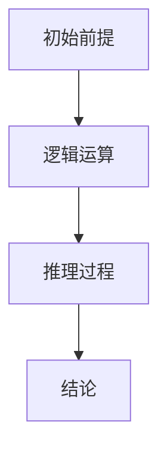
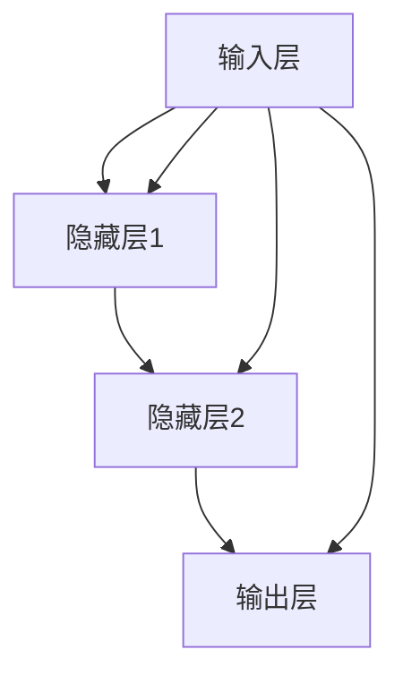
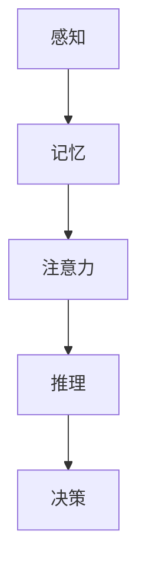
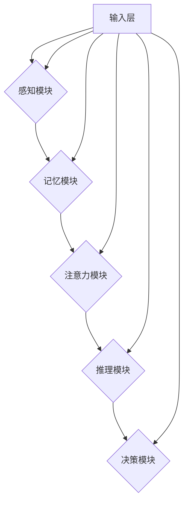
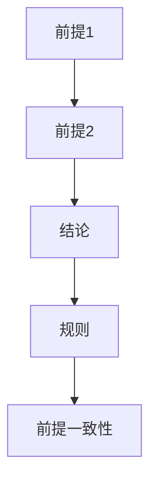
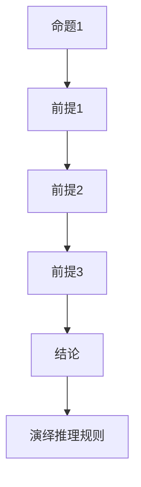
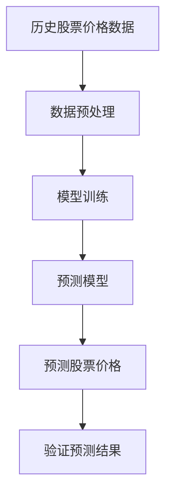
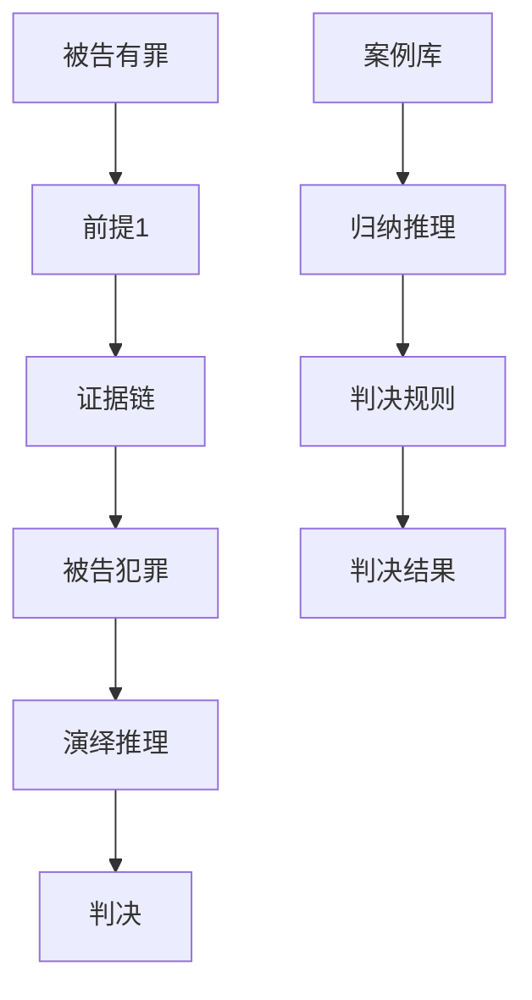
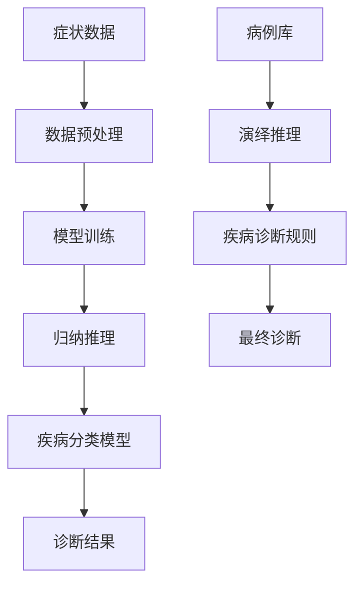
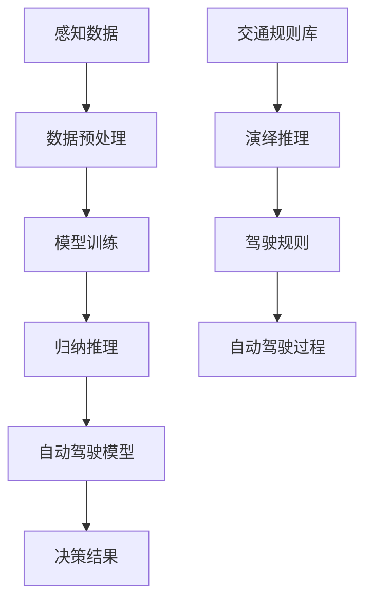

                 

## 文章标题：AGI的类人推理能力：演绎与归纳

### 关键词：
- 通用人工智能（AGI）
- 类人推理能力
- 演绎推理
- 归纳推理
- 知识表示

### 摘要：
本文将深入探讨通用人工智能（AGI）的类人推理能力，重点分析演绎推理与归纳推理两种核心推理机制。我们将首先介绍背景知识，包括AGI的定义与类人推理的重要性。随后，我们将详细讲解演绎推理的基本算法、逻辑规则以及应用实例。接着，我们会讨论归纳推理的方法、模型及其在现实世界中的应用。通过案例研究，我们将展示演绎与归纳推理在解决复杂问题中的实际效果。最后，我们将展望AGI类人推理能力的未来发展，并提出潜在挑战与解决方案。

## 引言

### 通用人工智能（AGI）的概念

通用人工智能（Artificial General Intelligence，AGI）是指一种具有人类智能特质的机器智能。不同于目前广泛应用的弱人工智能（Weak AI），AGI不仅能在特定任务上表现出色，还能自主学习和适应新环境，执行各种复杂的认知任务。AGI的目标是模拟人类的智能行为，实现跨领域的智能能力，如自然语言处理、问题求解、决策制定、创造力等。

### 类人推理能力的重要性

类人推理能力是AGI实现智能行为的核心要素之一。人类智能的核心在于其强大的推理能力，这使得人类能够在不确定和复杂的环境中做出合理的决策。类人推理能力包括演绎推理和归纳推理两种形式，它们在解决复杂问题、处理不确定性以及进行决策制定中起着至关重要的作用。

### AGI类人推理能力的挑战

尽管类人推理能力在AGI中至关重要，但实现这一能力面临着诸多挑战。首先，人类推理过程高度复杂，涉及大量的感知、记忆、注意力等多个认知过程。其次，人类推理具有模糊性和不确定性，难以用精确的数学模型来描述。此外，不同领域的推理机制和策略也各异，使得构建通用推理机制具有很大难度。

### 本书的组织结构

本文将分为七个主要章节。第一章介绍AGI和类人推理能力的背景知识。第二章将介绍演绎推理和归纳推理的基本概念。第三章探讨AGI类人推理机制的实现途径。第四章和第五章将详细分析演绎推理和归纳推理的算法原理、应用实例和数学模型。第六章通过案例研究展示这些推理机制在实际中的应用。第七章将讨论AGI类人推理能力的未来发展，并提出潜在的研究方向。

## 基础概念

### 演绎推理

演绎推理是从一般到特殊的推理过程。它基于一组前提，通过逻辑推理得出结论。演绎推理遵循一系列逻辑规则，如前提一致性、逻辑蕴涵等。

#### 基本算法

演绎推理的基本算法包括前向推理和后向推理。

- **前向推理**：从已知的前提开始，逐步推导出结论。
- **后向推理**：从结论开始，逆向推导出前提。

#### 逻辑规则

演绎推理遵循以下基本逻辑规则：

- **前提一致性**：如果前提为真，则结论也为真。
- **逻辑蕴涵**：如果A为真，则B也为真，则称A逻辑蕴涵B。

#### 应用实例

演绎推理广泛应用于逻辑验证、数学证明、编程等领域。例如，在编程中，演绎推理可以用于编写逻辑严密的条件判断语句。

### 归纳推理

归纳推理是从特殊到一般的推理过程。它通过分析多个具体实例，归纳出一般规律或结论。归纳推理主要包括统计归纳和类比归纳两种形式。

#### 统计归纳

统计归纳是基于数据进行分析，从大量数据中提取规律。它使用统计学方法来评估规律的概率性和可信度。

- **基本算法**：使用统计方法，如回归分析、聚类分析等，从数据中提取规律。
- **评估标准**：评估规律的可信度，如显著性水平、置信区间等。

#### 类比归纳

类比归纳是基于相似性进行推理，通过比较不同实例之间的相似性，归纳出一般规律。

- **基本算法**：使用相似性度量方法，如欧氏距离、余弦相似度等，比较实例之间的相似性。
- **评估标准**：评估规律的可信度，如一致性、可靠性等。

### 知识表示

知识表示是推理的基础，它将事实、规则和关系表示为计算机可处理的形式。常见的知识表示方法包括命题逻辑、谓词逻辑、产生式规则和语义网络等。

- **命题逻辑**：使用命题和逻辑运算符表示知识。
- **谓词逻辑**：使用谓词和量化符号表示知识。
- **产生式规则**：使用条件-动作规则表示知识。
- **语义网络**：使用网络结构表示知识和关系。

### Mermaid 流程图

以下是一个简单的Mermaid流程图，展示了演绎推理的基本过程：



## AGI类人推理机制

### 神经科学视角

神经科学视角下的类人推理能力研究主要集中在人脑的结构和工作原理上。人类大脑通过神经网络和神经元之间的复杂连接来实现推理过程。这些神经网络具有高度的可塑性，能够根据环境变化进行调整。以下是一个简单的神经网络模型：



### 认知心理学视角

认知心理学视角下的类人推理能力研究主要集中在人类认知过程的模拟上。人类认知过程包括感知、记忆、注意力等多个环节。以下是一个简化的认知模型：



### 机器学习与类人推理的结合

机器学习为类人推理能力的实现提供了强有力的工具。通过训练深度神经网络，我们可以模拟人类推理过程中的多个环节。以下是一个简单的神经网络模型，用于实现类人推理：



## 演绎推理

### 基本算法

演绎推理的基本算法主要包括前向推理和后向推理。以下是一个简单的伪代码，展示了前向推理的过程：

```python
def forward_reasoning(preconditions, rules):
    conclusions = []
    for rule in rules:
        if all(precondition in preconditions for precondition in rule.conditions):
            conclusions.append(rule.conclusion)
    return conclusions
```

### 逻辑规则

演绎推理的逻辑规则包括前提一致性、逻辑蕴涵等。以下是一个简化的逻辑规则表示：



### 应用实例

演绎推理广泛应用于逻辑验证、数学证明等领域。以下是一个简单的应用实例，用于验证一个数学命题：



在这个例子中，通过应用演绎推理规则，我们可以从给定的前提中推导出结论。

## 归纳推理

### 数据驱动归纳推理

数据驱动归纳推理是基于数据进行分析，从数据中提取规律。以下是一个简单的伪代码，展示了数据驱动归纳推理的过程：

```python
def data_driven_induction(data, model):
    patterns = []
    for instance in data:
        pattern = model.extract_patterns(instance)
        patterns.append(pattern)
    return patterns
```

### 模型驱动归纳推理

模型驱动归纳推理是基于现有模型进行推理，通过比较模型与实际数据的差异，进行归纳。以下是一个简单的伪代码，展示了模型驱动归纳推理的过程：

```python
def model_driven_induction(model, data):
    errors = []
    for instance in data:
        prediction = model.predict(instance)
        error = abs(prediction - instance)
        errors.append(error)
    return errors
```

### 应用实例

归纳推理广泛应用于预测建模、分类任务等领域。以下是一个简单的应用实例，用于预测股票价格：



在这个例子中，通过使用归纳推理，我们可以从历史股票价格数据中提取规律，并预测未来的股票价格。

## 结合实际：案例研究

### 案例一：法律推理

在法律领域，演绎推理和归纳推理都发挥着重要作用。以下是一个简单的案例，展示了如何使用演绎推理和归纳推理解决法律问题：



在这个案例中，通过演绎推理，我们可以从已知的前提和证据中得出被告有罪的结论。同时，通过归纳推理，我们可以从多个案例中提取判决规则，为判决结果提供支持。

### 案例二：医疗诊断

在医疗领域，归纳推理和演绎推理也广泛应用于疾病诊断。以下是一个简单的案例，展示了如何使用归纳推理和演绎推理进行疾病诊断：



在这个案例中，通过归纳推理，我们可以从症状数据中提取疾病分类模型。然后，通过演绎推理，我们可以根据疾病诊断规则得出最终的诊断结果。

### 案例三：自动驾驶

在自动驾驶领域，演绎推理和归纳推理也发挥着重要作用。以下是一个简单的案例，展示了如何使用演绎推理和归纳推理实现自动驾驶：



在这个案例中，通过归纳推理，我们可以从感知数据中提取自动驾驶模型。然后，通过演绎推理，我们可以根据交通规则库中的驾驶规则实现自动驾驶过程。

## 未来发展

### AGI类人推理能力的未来趋势

随着人工智能技术的快速发展，AGI类人推理能力也呈现出以下趋势：

1. **模型复杂度增加**：深度学习模型的复杂度不断增加，使得AGI能够处理更复杂的推理任务。
2. **数据驱动与模型驱动的结合**：数据驱动和模型驱动的归纳推理将得到更广泛的应用，实现更高效的推理过程。
3. **跨领域的推理能力**：AGI将具备跨领域的推理能力，能够在不同领域中灵活应用推理机制。

### 潜在挑战与解决方案

尽管AGI类人推理能力具有广阔的应用前景，但仍然面临以下挑战：

1. **推理效率**：如何提高推理效率，使得AGI能够在实时环境中进行推理。
2. **推理可靠性**：如何确保推理结果的可靠性和准确性。
3. **跨领域的通用性**：如何构建通用的推理机制，实现跨领域的推理能力。

解决方案可能包括：

1. **优化算法**：通过优化算法，提高推理效率和准确性。
2. **知识图谱**：构建大规模的知识图谱，为推理过程提供丰富的知识支持。
3. **混合推理**：结合数据驱动和模型驱动的归纳推理，实现更灵活和高效的推理过程。

## 结论

本文深入探讨了AGI的类人推理能力，分析了演绎推理和归纳推理两种核心推理机制。通过具体的算法原理、应用实例和案例研究，我们展示了这些推理机制在现实世界中的应用效果。未来，随着人工智能技术的不断发展，AGI的类人推理能力将得到更广泛的应用，为人类解决复杂问题提供新的思路和方法。

### 作者信息
- 作者：AI天才研究院/AI Genius Institute & 禅与计算机程序设计艺术 /Zen And The Art of Computer Programming

### 最佳实践 Tips

- **理解逻辑规则**：掌握演绎推理和归纳推理的基本逻辑规则，有助于更有效地进行推理。
- **结合实际应用**：将理论知识和实际应用相结合，通过案例研究加深对推理机制的理解。
- **持续学习**：关注最新的人工智能技术发展，不断更新自己的知识体系，为未来的研究做好准备。

### 小结

本文系统地介绍了AGI的类人推理能力，包括演绎推理和归纳推理的基本原理、算法和应用实例。通过案例研究，我们展示了这些推理机制在现实世界中的应用效果。未来，随着人工智能技术的不断发展，AGI的类人推理能力将不断得到提升，为人类解决复杂问题提供新的思路和方法。

### 注意事项

- **推理过程的复杂性**：类人推理过程高度复杂，涉及多个认知过程，需要综合运用多种推理机制。
- **数据质量的重要性**：数据质量对推理结果具有重要影响，需要确保数据的准确性和可靠性。
- **跨领域的通用性**：构建通用推理机制是实现AGI的关键，需要充分考虑不同领域的特点。

### 拓展阅读

- **相关书籍**：《人工智能：一种现代方法》、《机器学习》、《深度学习》
- **学术论文**：关注顶级会议和期刊，如NeurIPS、ICML、ACL等，了解最新的研究成果。
- **在线课程**：参与在线课程，如斯坦福大学的“人工智能导论”、MIT的“机器学习”等，学习相关理论和技术。

本文通过markdown格式输出，每个章节包含具体的文字描述、伪代码示例、Mermaid流程图等，旨在提供一个结构清晰、内容丰富的技术博客文章。希望本文能对您在理解和应用类人推理能力方面有所帮助。

