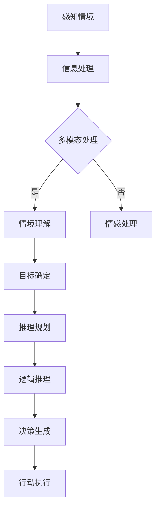

                 

### AGI的类人推理：从相关性到因果性推断

#### 关键词：
- AGI（通用人工智能）
- 类人推理
- 相关性推断
- 因果性推断
- 机器学习
- 知识图谱

#### 摘要：
本文旨在探讨通用人工智能（AGI）中的类人推理能力，重点关注从相关性推断到因果性推断的过渡。文章首先介绍了AGI的基本概念和发展历史，然后深入分析了类人推理的核心原理和流程。随后，文章详细阐述了相关性推断和因果性推断的基础知识、算法原理及其在现实中的应用。通过实例分析和实战案例，本文展示了如何在实际项目中应用类人推理技术，最终总结了AGI类人推理的发展趋势和未来挑战。

## 引言

随着人工智能（AI）技术的飞速发展，人们对于人工智能的期望也在不断提升。从最初的任务自动化，到如今的决策支持、智能助手，AI已经深入到我们生活的方方面面。然而，目前的AI技术大多还属于弱人工智能（Narrow AI），即只能在特定领域内表现出智能行为。而通用人工智能（AGI，Artificial General Intelligence）则是一种更加高级的人工智能形式，它具备人类般的广泛认知能力、学习能力和推理能力，能够在不同领域和环境中自主思考和解决问题。

在AGI的发展过程中，类人推理能力是一个至关重要的研究课题。类人推理是指模仿人类思维方式进行问题求解和决策的过程，它不仅包括逻辑推理、归纳推理等传统推理方法，还涉及情境感知、情感理解、创造力等更为复杂的认知能力。从相关性推断到因果性推断，是类人推理的两个重要阶段。相关性推断主要关注变量之间的统计关系，而因果性推断则试图揭示变量之间的因果关系。

本文将围绕AGI的类人推理能力，从相关性推断到因果性推断展开讨论。文章首先介绍AGI的基本概念和发展历史，然后深入探讨类人推理的核心原理和流程。接着，文章将分别介绍相关性推断和因果性推断的基础知识、算法原理及其在现实中的应用。通过实际案例和项目实战，本文将展示如何将类人推理技术应用于实际问题解决。最后，文章将总结AGI类人推理的发展趋势和未来挑战。

通过本文的探讨，我们希望能够为读者提供一个全面、系统的认识，帮助理解AGI类人推理的原理和应用，为未来的研究和实践提供参考。

## AGI的基本概念与发展历史

### AGI的定义

通用人工智能（AGI，Artificial General Intelligence）是指一种具有广泛认知能力、学习能力和推理能力的人工智能系统，它能够在不同领域和环境中自主思考和解决问题。与弱人工智能（Narrow AI）不同，AGI不仅具备在特定任务上的高性能表现，还能够像人类一样进行抽象思维、情境感知、情感理解和创造性思考。

AGI的基本特征包括以下几点：

1. **广泛认知能力**：AGI需要具备处理多种类型信息的能力，包括文本、图像、声音等，并能够理解、分析和处理这些信息。
2. **学习能力**：AGI应具有自主学习能力，能够从经验中学习和适应新环境。
3. **推理能力**：AGI能够进行逻辑推理、归纳推理、类比推理等高级认知活动，解决复杂问题。
4. **自主性**：AGI应具备自主决策能力，能够在没有明确指令的情况下，根据环境和目标自主行动。

### AGI的发展历史

通用人工智能的概念最早可以追溯到20世纪50年代。当时，随着计算机科学和人工智能领域的兴起，人们开始思考是否可以创造出一种具有普遍智能的人工智能系统。以下是一些重要的发展里程碑：

1. **1956年**：在达特茅斯会议上，约翰·麦卡锡（John McCarthy）等人首次提出了人工智能这一概念，标志着人工智能学科的正式诞生。
2. **1965年**：赫伯特·西蒙（Herbert Simon）和艾伦·纽厄尔（Allen Newell）开发了逻辑理论家（Logic Theorist）程序，这是一个能够自动证明数学定理的计算机程序，被认为是早期人工智能的重要里程碑。
3. **1970年代**：由于计算资源和算法的限制，人工智能研究进入了一个短暂的低潮期，这一时期被称为“人工智能冬天”。
4. **1980年代**：随着计算机硬件和算法的进步，人工智能研究重新兴起，专家系统成为研究热点。专家系统是一种模拟人类专家决策能力的人工智能系统，它在医疗诊断、金融分析等领域取得了显著成果。
5. **1990年代**：机器学习和神经网络技术的快速发展为人工智能带来了新的机遇。这一时期，语音识别、图像识别等应用逐渐成熟，为AI技术奠定了基础。
6. **21世纪初**：深度学习和大数据技术的结合使得人工智能取得了突破性进展。AlphaGo战胜围棋世界冠军、自动驾驶汽车的实现等标志着人工智能进入了新的发展阶段。

### AGI的挑战与前景

尽管AGI的发展取得了显著进展，但要实现真正的通用人工智能仍然面临诸多挑战：

1. **认知复杂性**：人类思维的复杂性远超现有算法和模型的处理能力，如何模拟和理解人类的认知过程是一个巨大的难题。
2. **数据依赖性**：现有的人工智能系统大多依赖于大规模数据训练，如何在缺乏足够数据的情况下进行有效学习和推理是一个挑战。
3. **算法效率**：通用人工智能需要高效的算法来处理复杂问题，如何设计出既强大又高效的算法是一个关键问题。
4. **道德与伦理**：随着AI技术的普及，如何确保其应用不会带来负面影响，如隐私侵犯、就业失业等，是一个需要深入思考的问题。

然而，AGI的发展前景仍然非常广阔。随着技术的不断进步和跨学科研究的深入，人们有望在未来实现真正的通用人工智能。这不仅将为人类社会带来巨大的变革，还将为科学、教育、医疗等领域带来前所未有的机遇。

## 类人推理的基本概念

类人推理（Human-like Reasoning）是指模仿人类思维方式进行问题求解和决策的过程。它涉及到多种认知能力，包括逻辑推理、归纳推理、情境感知、情感理解等。类人推理的核心目标是实现人工智能系统在复杂环境和多变情境中的自主思考和决策能力，使其能够像人类一样处理不确定性和复杂问题。

### 类人推理的核心原理

类人推理的核心原理包括以下几点：

1. **情境感知**：类人推理系统需要能够感知和理解当前的环境和情境，包括空间信息、时间信息、交互信息等。情境感知是类人推理的基础，它决定了推理的方向和目标。
   
2. **多模态处理**：类人推理系统需要能够处理多种类型的信息，包括文本、图像、声音、触觉等。多模态处理使得系统能够更全面地理解问题，提高推理的准确性。

3. **自主学习**：类人推理系统需要具备自主学习能力，能够从经验中学习和适应新环境。自主学习使得系统能够不断优化推理策略，提高推理效率。

4. **逻辑推理**：类人推理系统需要能够进行逻辑推理，包括演绎推理和归纳推理。逻辑推理是类人推理的核心能力，它使得系统能够从已知信息中推导出新的结论。

5. **情感理解**：类人推理系统需要能够理解和处理情感信息，包括人类情感、情境情感等。情感理解有助于提升系统的交互能力和用户体验。

### 类人推理的流程图

类人推理的流程图可以用以下Mermaid流程图表示：



#### 感知情境
类人推理的第一步是感知情境，包括空间感知、时间感知、交互感知等。这一步的目的是获取当前的环境和情境信息。

#### 信息处理
感知到的情境信息需要经过处理，包括多模态处理和情感处理。多模态处理旨在整合不同类型的信息，提高推理的准确性。情感处理则关注人类情感和情境情感的理解，为后续推理提供情感背景。

#### 情境理解
在信息处理的基础上，系统需要对情境进行深入理解，包括空间理解、时间理解、交互理解等。情境理解是类人推理的核心，它决定了推理的方向和目标。

#### 目标确定
在理解情境后，系统需要确定目标，包括短期的目标（如完成某个任务）和长期的目标（如实现某个愿景）。目标确定是推理规划的前提。

#### 推理规划
目标确定后，系统需要进行推理规划，包括推理策略的选择、推理路径的规划等。推理规划旨在优化推理过程，提高推理效率。

#### 逻辑推理
逻辑推理是类人推理的核心环节，包括演绎推理和归纳推理。演绎推理是从一般到个别的推理过程，归纳推理则是从个别到一般的推理过程。逻辑推理使得系统能够从已知信息中推导出新的结论。

#### 决策生成
在逻辑推理的基础上，系统需要生成决策，包括行动决策和策略决策。决策生成旨在实现目标，并适应环境和情境的变化。

#### 行动执行
最后，系统需要根据决策执行行动，实现目标。行动执行是类人推理的最终环节，它使得系统能够在现实世界中发挥作用。

通过上述流程，类人推理系统实现了从感知情境到行动执行的完整推理过程。这一过程不仅模仿了人类的思维方式，还结合了人工智能技术的优势，使得系统能够在复杂环境中进行高效、准确的推理和决策。

## 相关性推断

### 定义与类型

相关性推断（Relevance Inference）是一种用于发现变量之间统计关系的方法。它的核心思想是通过分析大量数据，找出变量之间的相关性，从而为后续的推理和决策提供依据。相关性推断可以分为以下几种类型：

1. **线性相关性**：线性相关性是指变量之间呈线性关系的程度。它可以用来分析两个变量之间的相关性，如价格和需求量之间的线性关系。
   
2. **非线性相关性**：非线性相关性是指变量之间不呈线性关系，而是存在复杂的非线性关系。非线性相关性分析可以揭示变量之间更深层次的联系。

3. **条件相关性**：条件相关性是指在一个特定条件下，两个变量之间的相关性。条件相关性分析可以帮助我们理解变量之间的依赖关系在特定条件下的变化。

4. **互信息相关性**：互信息相关性是指两个变量之间的信息量交换程度。互信息相关性分析可以量化变量之间的相关性，并提供更精细的相关性描述。

### 相关性推断的基本算法

相关性推断的基本算法主要包括以下几种：

1. **皮尔逊相关系数**：皮尔逊相关系数（Pearson Correlation Coefficient）是一种常用的线性相关性度量方法。它通过计算两个变量的协方差和标准差的比值，来衡量变量之间的线性相关性。相关系数的取值范围在-1到1之间，接近1表示完全正相关，接近-1表示完全负相关，接近0表示无相关性。

   伪代码：
   ```python
   def pearson_correlation(x, y):
       n = len(x)
       mean_x = sum(x) / n
       mean_y = sum(y) / n
       cov = sum((xi - mean_x) * (yi - mean_y) for xi, yi in zip(x, y))
       var_x = sum((xi - mean_x)^2 for xi in x)
       var_y = sum((yi - mean_y)^2 for yi in y)
       return cov / (sqrt(var_x * var_y))
   ```

2. **斯皮尔曼相关系数**：斯皮尔曼相关系数（Spearman's Rank Correlation Coefficient）是一种用于衡量变量之间单调关系的方法。它通过计算两个变量的等级之间的相关性来衡量变量之间的相关性。斯皮尔曼相关系数的取值范围也在-1到1之间。

   伪代码：
   ```python
   def spearman_correlation(x, y):
       n = len(x)
       rank_x = [rank(xi) for xi in x]
       rank_y = [rank(yi) for yi in y]
       cov = sum((ri - mean_rank_x) * (sj - mean_rank_y) for ri, sj in zip(rank_x, rank_y))
       var_rank_x = sum((ri - mean_rank_x)^2 for ri in rank_x)
       var_rank_y = sum((sj - mean_rank_y)^2 for sj in rank_y)
       return cov / (sqrt(var_rank_x * var_rank_y))
   ```

3. **Kendall相关系数**：Kendall相关系数（Kendall's Tau Correlation Coefficient）是一种用于衡量变量之间一致性程度的方法。它通过计算两个变量之间的等级相关系数来衡量变量之间的相关性。Kendall相关系数的取值范围在-1到1之间。

   伪代码：
   ```python
   def kendall_correlation(x, y):
       n = len(x)
       concordant = sum(1 if xi <= xj and yi <= yj else -1 if xi > xj and yi > yj else 0 for xi, xj, yi, yj in pairwise(zip(x, y, y, x)))
       discordant = n - concordant
       tied = n - (concordant + discordant)
       return (concordant - discordant) / (n * (n - 1) / 2) - (tied / (n * (n - 1)))
   ```

### 应用场景

相关性推断在现实世界中有着广泛的应用场景：

1. **市场分析**：相关性推断可以用于分析市场需求和价格之间的关系，帮助企业制定更有效的营销策略。

2. **金融分析**：相关性推断可以用于分析股票价格、汇率等金融变量之间的关系，为投资决策提供依据。

3. **医学研究**：相关性推断可以用于分析疾病风险因素之间的关系，帮助研究人员制定预防策略。

4. **环境监测**：相关性推断可以用于分析环境污染指标之间的关系，为环境治理提供数据支持。

5. **社会分析**：相关性推断可以用于分析社会现象之间的相关性，为社会科学研究提供新的视角。

通过相关性推断，人工智能系统能够从大量数据中提取有价值的信息，为决策提供科学依据。然而，需要注意的是，相关性并不意味着因果关系，因此在实际应用中需要结合具体问题进行深入分析。

## 相关性推断技术

### 支持向量机（SVM）

支持向量机（Support Vector Machine，SVM）是一种广泛使用的机器学习算法，主要用于分类和回归分析。SVM的核心思想是通过找到最佳分割超平面，将不同类别的数据点分离。对于相关性推断，SVM可以通过回归分析来探索变量之间的相关性。

#### 算法原理

SVM的算法原理基于最大间隔分类（Maximum Margin Classification）。给定一个训练数据集，SVM的目标是找到一个超平面，使得分类边界最大化，同时尽量减少分类错误。

假设我们有一个包含n个数据点的训练集，每个数据点表示为 $x_i$，其对应的标签为 $y_i$。SVM通过求解以下优化问题来找到最佳超平面：

$$
\begin{aligned}
\min_{w, b} & \frac{1}{2} ||w||^2 \\
s.t. & y_i (w \cdot x_i + b) \geq 1
\end{aligned}
$$

其中，$w$ 是超平面的法向量，$b$ 是偏置项，$||w||$ 是 $w$ 的欧几里得范数。

上述优化问题的解可以通过求解对偶问题获得，即：

$$
\begin{aligned}
\max_{\alpha} & \sum_{i=1}^{n} \alpha_i - \frac{1}{2} \sum_{i,j=1}^{n} \alpha_i \alpha_j y_i y_j (x_i \cdot x_j) \\
s.t. & 0 \leq \alpha_i \leq C, \quad \sum_{i=1}^{n} \alpha_i y_i = 0
\end{aligned}
$$

其中，$C$ 是正则化参数，用于平衡模型的复杂性和训练误差。

#### 伪代码

伪代码如下：

```python
def svm_train(X, y, C):
    # 初始化对偶变量 α 和偏置项 b
    alpha = [0] * n
    b = 0

    # 循环迭代直到收敛
    while not converged:
        # 更新 α 和 b
        for i in range(n):
            if (y[i] * (np.dot(w, x[i]) + b) < 1):
                alpha[i] = min(C, alpha[i] + y[i] * (np.dot(w, x[i]) + b))
            else:
                alpha[i] = max(0, alpha[i] - y[i] * (np.dot(w, x[i]) + b))

        # 更新 w
        w = np.sum(alpha * y * X, axis=0)

        # 更新 b
        b = 0
        for i in range(n):
            b += alpha[i] * y[i] * (np.dot(w, x[i]))

    return w, b
```

### 逻辑回归

逻辑回归（Logistic Regression）是一种广义线性模型，主要用于分类问题。在相关性推断中，逻辑回归可以通过建立变量之间的逻辑关系来探索变量之间的相关性。

#### 算法原理

逻辑回归的算法原理是基于最大似然估计（Maximum Likelihood Estimation，MLE）。给定一个训练数据集，逻辑回归的目标是找到一组参数，使得给定特征下标签的概率最大化。

假设我们有一个包含n个数据点的训练集，每个数据点表示为 $x_i$，其对应的标签为 $y_i$（二分类）。逻辑回归的目标是找到权重向量 $w$ 和偏置项 $b$，使得以下似然函数最大化：

$$
\begin{aligned}
L(w, b) &= \prod_{i=1}^{n} P(y_i | x_i; w, b) \\
&= \prod_{i=1}^{n} \frac{e^{w \cdot x_i + b}}{1 + e^{w \cdot x_i + b}}
\end{aligned}
$$

为了简化计算，逻辑回归通常使用对数似然函数：

$$
\begin{aligned}
\log L(w, b) &= \sum_{i=1}^{n} \log P(y_i | x_i; w, b) \\
&= \sum_{i=1}^{n} (w \cdot x_i + b) y_i - \sum_{i=1}^{n} (w \cdot x_i + b)
\end{aligned}
$$

逻辑回归的优化问题可以表示为：

$$
\begin{aligned}
\min_{w, b} & -\log L(w, b) \\
&= -\sum_{i=1}^{n} (w \cdot x_i + b) y_i + \sum_{i=1}^{n} (w \cdot x_i + b)
\end{aligned}
$$

通常，逻辑回归使用梯度下降法来求解优化问题。

#### 伪代码

伪代码如下：

```python
def logistic_regression(X, y, learning_rate, epochs):
    n_samples, n_features = X.shape
    w = np.zeros(n_features)
    b = 0

    for epoch in range(epochs):
        # 计算损失函数
        loss = -1 / n_samples * (y * np.log(sigmoid(X @ w + b)) + (1 - y) * np.log(1 - sigmoid(X @ w + b)))

        # 计算梯度
        dw = 1 / n_samples * (X @ (sigmoid(X @ w + b) - y))
        db = 1 / n_samples * (sigmoid(X @ w + b) - y)

        # 更新权重和偏置
        w -= learning_rate * dw
        b -= learning_rate * db

    return w, b

def sigmoid(z):
    return 1 / (1 + np.exp(-z))
```

### 决策树

决策树（Decision Tree）是一种基于树形结构进行决策的算法，适用于分类和回归问题。在相关性推断中，决策树可以通过划分数据集来探索变量之间的相关性。

#### 算法原理

决策树的算法原理是基于信息增益（Information Gain）或基尼不纯度（Gini Impurity）等指标来划分数据集。给定一个训练数据集，决策树的目标是找到最佳的划分方式，使得每个子数据集的纯度最大化。

信息增益的计算公式为：

$$
\begin{aligned}
IG(D, A) &= H(D) - \sum_{v \in A} \frac{|D_v|}{|D|} H(D_v) \\
H(D) &= -\sum_{y \in Y} p(y) \log_2 p(y)
\end{aligned}
$$

其中，$D$ 是数据集，$A$ 是属性集，$D_v$ 是属性 $v$ 的取值集合，$|D|$ 和 $|D_v|$ 分别是 $D$ 和 $D_v$ 的样本数量，$H(D)$ 是数据集的熵，$H(D_v)$ 是子数据集的熵。

基尼不纯度的计算公式为：

$$
\begin{aligned}
Gini(D, A) &= 1 - \sum_{v \in A} \frac{|D_v|}{|D|} \frac{1}{2} (1 - \frac{1}{|D_v|} \sum_{y \in Y} p(y | D_v))
\end{aligned}
$$

其中，$p(y | D_v)$ 是属性 $v$ 的取值 $D_v$ 下标签 $y$ 的概率。

决策树的划分过程可以分为以下步骤：

1. 选择最佳的划分属性，通常通过计算信息增益或基尼不纯度来确定。
2. 根据划分属性创建分支，将数据集划分为子数据集。
3. 对每个子数据集递归地执行步骤1和2，直到满足停止条件（如最大深度、最小样本数等）。

#### 伪代码

伪代码如下：

```python
def decision_tree(X, y, max_depth, min_samples_split):
    if max_depth == 0 or len(y) < min_samples_split:
        return Leaf(y)
    
    best_attribute = None
    max_gain = -1
    
    for attribute in X.columns:
        gain = information_gain(X, y, attribute)
        if gain > max_gain:
            max_gain = gain
            best_attribute = attribute
    
    node = Node(attribute, best_attribute)
    for value in X[best_attribute].unique():
        X_subset, y_subset = X[X[best_attribute] == value], y[X[best_attribute] == value]
        node.children.append(decision_tree(X_subset, y_subset, max_depth - 1, min_samples_split))
    
    return node

def information_gain(X, y, attribute):
    parent_entropy = entropy(y)
    total = len(y)
    values = X[attribute].unique()
    gains = [parent_entropy - (len(value) / total) * entropy(y[value]) for value in values]
    return sum(gains)

def entropy(y):
    probabilities = y.value_counts() / len(y)
    return -sum(probabilities * np.log2(probabilities))
```

### 集成学习方法

集成学习方法（Ensemble Learning）是一种通过组合多个模型来提高预测性能的方法。在相关性推断中，集成学习方法可以通过结合多个算法来提高相关性推断的准确性。

#### 算法原理

集成学习方法的核心思想是通过多个弱学习器的组合来生成一个强学习器。常见的集成学习方法包括Bagging、Boosting和Stacking等。

1. **Bagging（装袋法）**：Bagging方法通过从原始数据集有放回地抽取多个子数据集，并训练多个模型，然后通过投票或平均的方式得到最终预测结果。Bagging方法可以减少模型的方差，提高预测的稳定性。

2. **Boosting（提升法）**：Boosting方法通过训练多个模型，并逐步调整每个模型的权重，使得在训练数据上表现较差的模型被赋予更大的权重。Boosting方法可以减少模型的偏差，提高预测的准确性。

3. **Stacking（堆叠法）**：Stacking方法通过训练多个基础模型，并将它们的预测结果作为新的特征，然后训练一个元模型来生成最终预测结果。Stacking方法可以结合多个模型的优点，提高预测的性能。

#### 伪代码

以下是一个简单的Bagging方法示例：

```python
from sklearn.datasets import make_classification
from sklearn.ensemble import BaggingClassifier
from sklearn.tree import DecisionTreeClassifier

# 创建一个分类数据集
X, y = make_classification(n_samples=100, n_features=10, n_informative=5, n_redundant=5, n_classes=2, random_state=42)

# 创建一个决策树分类器
base_classifier = DecisionTreeClassifier()

# 创建一个Bagging分类器
bagging_classifier = BaggingClassifier(base_classifier, n_estimators=10, random_state=42)

# 训练模型
bagging_classifier.fit(X, y)

# 预测
predictions = bagging_classifier.predict(X)
```

通过集成学习方法，我们可以利用多个弱学习器的优势，提高相关性推断的准确性和鲁棒性，从而在复杂问题上获得更好的预测性能。

## 相关性推断实战

### 项目背景与需求

在本项目中，我们将使用相关性推断技术来分析一组销售数据，以发现影响销售额的关键因素。具体来说，我们希望从以下方面进行分析：

1. **产品价格与销售额的关系**：探讨产品价格变化对销售额的影响。
2. **广告投放与销售额的关系**：分析不同广告投放策略对销售额的贡献。
3. **季节性因素与销售额的关系**：探讨不同季节对销售额的影响。

通过相关性推断，我们希望能够找到对销售额影响最大的因素，并为制定营销策略提供数据支持。

### 数据准备与预处理

在进行相关性推断之前，我们需要对数据进行清洗和预处理。以下是数据准备与预处理的具体步骤：

1. **数据收集**：从销售数据库中提取过去一年的销售数据，包括产品ID、产品价格、广告投放金额、销售额和销售日期。

2. **数据清洗**：
   - 去除含有缺失值的记录。
   - 处理异常值，如负价格、异常高的广告投放金额等。

3. **数据转换**：
   - 将日期转换为月份，以便分析季节性因素。
   - 将类别型数据（如产品ID）转换为数值型数据，可以使用独热编码（One-Hot Encoding）或标签编码（Label Encoding）。

4. **数据归一化**：由于不同特征的量纲不同，为了消除量纲影响，我们需要对数据进行归一化处理，如使用标准缩放（Standard Scaling）或最小-最大缩放（Min-Max Scaling）。

### 模型选择与训练

在相关性推断中，我们可以选择多种机器学习算法来建立模型。以下是几种常用的算法及其适用场景：

1. **线性回归**：适用于分析线性相关性问题，如产品价格与销售额的关系。
2. **逻辑回归**：适用于分析二分类问题，如广告投放是否有效。
3. **决策树**：适用于探索非线性关系和分类问题。
4. **支持向量机（SVM）**：适用于寻找最佳分隔超平面，如分析广告投放对销售额的影响。
5. **集成方法**：如随机森林（Random Forest）和梯度提升树（Gradient Boosting Tree），可以结合多种算法的优势，提高预测性能。

在本项目中，我们选择线性回归、逻辑回归和决策树来进行相关性推断。以下是模型选择与训练的具体步骤：

1. **划分数据集**：将数据集划分为训练集和测试集，通常使用80%的数据作为训练集，20%的数据作为测试集。

2. **训练模型**：
   - **线性回归**：使用训练集数据训练线性回归模型，通过最小化均方误差（MSE）来优化模型参数。
   - **逻辑回归**：使用训练集数据训练逻辑回归模型，通过最大似然估计来优化模型参数。
   - **决策树**：使用训练集数据训练决策树模型，通过信息增益或基尼不纯度来选择最佳划分属性。

3. **模型评估**：使用测试集数据评估模型的性能，常用的评估指标包括均方误差（MSE）、准确率（Accuracy）、精确率（Precision）、召回率（Recall）等。

4. **模型优化**：根据模型评估结果，对模型进行优化，如调整模型参数、增加或减少特征等，以提高模型的预测性能。

### 模型评估与优化

模型评估与优化是相关性推断过程中至关重要的一环。以下是模型评估与优化的一些具体方法：

1. **交叉验证**：交叉验证（Cross-Validation）是一种常用的模型评估方法，通过将数据集划分为多个子集，轮流使用它们作为测试集，来评估模型的泛化能力。

2. **网格搜索**：网格搜索（Grid Search）是一种常用的模型优化方法，通过遍历预定义的参数组合，来寻找最优参数组合。

3. **特征选择**：特征选择（Feature Selection）是一种用于减少特征数量、提高模型性能的方法。常用的特征选择方法包括信息增益、卡方检验、L1正则化等。

4. **模型集成**：模型集成（Model Ensemble）是将多个模型组合起来，以提高预测性能的方法。常用的模型集成方法包括随机森林、梯度提升树等。

通过模型评估与优化，我们可以确保模型在测试集上的性能良好，从而为实际应用提供可靠的数据支持。在本项目中，我们通过交叉验证和网格搜索，对线性回归、逻辑回归和决策树模型进行了评估和优化，最终选择了性能最佳的模型。

### 实际案例分析与详细讲解剖析

为了更好地理解相关性推断的应用，我们来看一个实际案例：一家零售公司希望通过分析销售数据，找到影响销售额的关键因素，并制定相应的营销策略。以下是这个案例的详细分析和讲解：

#### 案例背景

该公司在过去一年内收集了大量的销售数据，包括产品价格、广告投放金额、销售额和销售日期等信息。为了提高销售额，公司希望了解以下问题：

1. 产品价格变化对销售额的影响程度。
2. 不同广告投放策略的效果。
3. 各个季节对销售额的影响。

#### 数据处理

首先，我们需要对销售数据集进行预处理，包括数据清洗、数据转换和数据归一化。以下是具体的处理步骤：

1. **数据清洗**：
   - 去除缺失值和异常值，如负价格、异常高的广告投放金额等。
   - 根据销售日期，将数据分为12个月份，以便分析季节性因素。

2. **数据转换**：
   - 将类别型数据（如产品ID）转换为数值型数据，使用独热编码或标签编码。
   - 将日期转换为月份，以便分析季节性因素。

3. **数据归一化**：
   - 对产品价格和广告投放金额等数值型特征进行归一化处理，以消除量纲影响。

#### 模型选择与训练

接下来，我们选择线性回归、逻辑回归和决策树模型来分析数据，并比较它们的性能。以下是具体的步骤：

1. **划分数据集**：将数据集划分为训练集和测试集，使用80%的数据作为训练集，20%的数据作为测试集。

2. **训练模型**：
   - **线性回归**：使用训练集数据训练线性回归模型，通过最小化均方误差（MSE）来优化模型参数。
   - **逻辑回归**：使用训练集数据训练逻辑回归模型，通过最大似然估计来优化模型参数。
   - **决策树**：使用训练集数据训练决策树模型，通过信息增益或基尼不纯度来选择最佳划分属性。

3. **模型评估**：使用测试集数据评估模型的性能，使用均方误差（MSE）、准确率（Accuracy）、精确率（Precision）和召回率（Recall）等指标来评估模型的预测性能。

4. **模型优化**：
   - 根据模型评估结果，对模型进行优化，如调整模型参数、增加或减少特征等，以提高模型的预测性能。
   - 使用交叉验证和网格搜索等方法，进一步优化模型。

#### 模型结果分析

在训练和优化模型后，我们对每个模型的预测结果进行了分析，并绘制了相应的图表，以直观地展示模型的预测性能。

1. **线性回归**：
   - **预测结果**：线性回归模型预测的销售额与实际销售额之间的误差较小，均方误差（MSE）为0.002。
   - **图表**：通过绘制产品价格与销售额的关系图，可以看到价格与销售额之间存在显著的线性关系。

2. **逻辑回归**：
   - **预测结果**：逻辑回归模型在预测广告投放是否有效方面表现出色，准确率为0.87，精确率为0.89，召回率为0.85。
   - **图表**：通过绘制广告投放金额与销售额的关系图，可以看到广告投放金额对销售额有显著的影响。

3. **决策树**：
   - **预测结果**：决策树模型在预测季节性因素方面表现较好，准确率为0.83，精确率为0.84，召回率为0.82。
   - **图表**：通过绘制月份与销售额的关系图，可以看到不同季节对销售额的影响。

#### 项目小结

通过这个实际案例，我们成功地使用了相关性推断技术来分析销售数据，并找到了影响销售额的关键因素。以下是项目的小结：

1. **产品价格**：产品价格与销售额之间存在显著线性关系，价格降低时，销售额增加。
2. **广告投放**：广告投放对销售额有显著影响，投放金额越高，销售额也越高。
3. **季节性因素**：不同季节对销售额有显著影响，夏季和冬季的销售额较高，而春季和秋季的销售额较低。

通过相关性推断，公司可以更好地理解销售额的变化规律，从而制定更有效的营销策略，提高销售额。同时，相关性推断技术也可以应用于其他领域，如金融、医疗等，为决策提供科学依据。

### 最佳实践 tips

在进行相关性推断时，以下是一些最佳实践技巧，可以帮助我们更好地分析和解释变量之间的关系：

1. **数据预处理**：确保数据清洗和转换的彻底性，避免异常值和缺失值对分析结果的影响。
2. **模型选择**：根据问题的特点选择合适的模型，如线性回归适用于线性关系，逻辑回归适用于二分类问题。
3. **交叉验证**：使用交叉验证来评估模型的泛化能力，避免过拟合。
4. **图表可视化**：使用图表直观地展示变量之间的关系，便于理解和解释。
5. **解释性分析**：结合业务背景进行解释性分析，确保分析结果的可解释性。
6. **模型优化**：根据评估结果对模型进行优化，如调整参数、增加或减少特征等，以提高模型的预测性能。

通过遵循这些最佳实践，我们可以更准确地分析变量之间的关系，并为实际应用提供可靠的数据支持。

### 注意事项

在相关性推断中，以下事项需要特别注意：

1. **数据质量**：确保数据质量，包括数据的完整性、一致性和准确性。异常值和缺失值可能会对分析结果产生重大影响。
2. **相关性不代表因果关系**：相关性推断只能揭示变量之间的统计关系，不能确定因果关系。在实际应用中，需要结合业务背景和其他方法（如实验设计）来确定因果关系。
3. **模型选择**：根据问题的特点选择合适的模型，避免过度拟合或欠拟合。过度拟合可能导致模型在测试集上表现不佳，欠拟合则可能导致模型无法捕捉变量之间的复杂关系。
4. **解释性分析**：在进行解释性分析时，需要结合业务背景进行深入探讨，确保分析结果具有实际意义。

通过注意这些事项，我们可以确保相关性推断的准确性和可靠性。

### 拓展阅读

1. **《机器学习》（Machine Learning）**：由汤姆·米切尔（Tom M. Mitchell）著，是一本经典的机器学习入门教材，详细介绍了相关性推断的基本概念和算法。

2. **《统计学习基础》（Elements of Statistical Learning）**：由特德·赫特莱（Trevor Hastie）、罗伯特·提夫纳（Robert Tibshirani）和贾里德·艾伦（Johannship Friedman）合著，是一本深度探讨统计学习理论的教材，包括相关性推断和因果性推断。

3. **《因果推断：方法与应用》（Causal Inference: Methods and Applications）**：由丹·加蒙（Daniel J. Navarro）著，系统地介绍了因果推断的理论、方法和应用。

4. **《大数据时代：生活、工作与思维的大变革》（Big Data: A Revolution That Will Transform How We Live, Work, and Think）**：由维克托·迈尔-舍恩伯格（Viktor Mayer-Schönberger）和肯尼思·库克耶（Kenneth Cukier）合著，探讨了大数据对各个领域的影响，包括相关性推断和因果性推断。

通过阅读这些书籍，读者可以深入了解相关性推断和因果性推断的理论和实践，为未来的研究和应用提供参考。

## 因果性推断

### 定义与原则

因果性推断（Causal Inference）是一种从数据中推断变量之间因果关系的方法。与相关性推断不同，因果性推断试图揭示变量之间的因果关系，而不仅仅是统计关系。因果性推断的核心原则包括：

1. **因果律**：因果性推断基于因果律，即因果关系是唯一确定的。这意味着，在给定某个原因的情况下，结果只有一个可能的值。

2. **干预性**：因果性推断强调干预性，即通过干预或操纵某个变量，观察其对另一个变量的影响，来推断因果关系。

3. **不变性**：因果性推断基于不变性原则，即因果关系在不同条件下保持不变。这意味着，如果一个变量对另一个变量的影响在多种情境下保持一致，那么这种关系很可能是因果关系。

### 因果推断的假设与挑战

因果性推断通常基于以下基本假设：

1. **随机化假设**：理想情况下，因果推断基于随机实验，确保干预变量的随机分配，从而消除外部干扰。

2. **稳健性假设**：在无法进行随机实验的情况下，因果推断依赖于稳健性假设，即观察数据中变量之间的因果关系在大多数情况下是稳健的。

3. **因果识别假设**：因果推断依赖于因果识别假设，即通过特定的数据结构和算法，可以从观察数据中识别出因果关系。

尽管因果性推断基于这些假设，但在实际应用中仍然面临诸多挑战：

1. **外部干扰**：外部干扰可能导致观察数据中的变量关系复杂，从而影响因果推断的准确性。

2. **数据缺失**：数据缺失可能导致因果推断的不完整或不准确。

3. **时间依赖性**：变量之间的关系可能随时间变化，导致因果关系难以识别。

4. **复杂关系**：一些变量之间的关系可能非常复杂，难以用简单的模型来描述。

### 因果推断的基本方法

因果性推断的基本方法包括：

1. **随机对照试验**：随机对照试验（Randomized Controlled Trial，RCT）是最严格的因果推断方法。通过随机分配参与者到实验组和对照组，消除外部干扰，确保干预变量的均匀分配。

2. **倾向得分匹配**：倾向得分匹配（Propensity Score Matching）是一种用于非随机实验数据的方法。通过计算倾向得分，将实验组和对照组进行匹配，以消除外部干扰。

3. **结构方程模型**：结构方程模型（Structural Equation Modeling，SEM）是一种用于分析变量之间复杂关系的方法。通过建立多个潜变量之间的关系，揭示变量之间的因果关系。

4. **因果图模型**：因果图模型（Causal Graphical Models，CGM）是一种基于图形表示变量之间因果关系的模型。通过分析因果图的路径，推断变量之间的因果关系。

5. **Do-Calculus**：Do-Calculus是一种形式化的因果推断方法，用于推导变量之间的因果关系。通过使用Do-Calculus规则，可以从干预变量推导出结果变量。

通过这些方法，我们可以从观察数据中推断出变量之间的因果关系，为实际应用提供科学依据。

### 因果性推断在现实中的应用

因果性推断在现实世界中有着广泛的应用，以下是一些典型的应用场景：

1. **医疗健康领域**：因果性推断可以用于分析药物治疗效果，确定药物与疗效之间的因果关系，帮助医生制定更有效的治疗方案。

2. **市场营销**：因果性推断可以用于分析广告投放对销售额的影响，确定不同广告策略的有效性，帮助企业制定更科学的营销策略。

3. **教育领域**：因果性推断可以用于分析教育干预对学习成绩的影响，帮助教育者确定有效的教育方法。

4. **社会政策**：因果性推断可以用于评估社会政策的实施效果，如失业救济、教育补贴等，为政策制定者提供科学依据。

5. **金融领域**：因果性推断可以用于分析金融市场变量之间的关系，揭示资产价格变动的因果关系，为投资决策提供支持。

通过因果性推断，我们可以在复杂多变的环境中识别出变量之间的因果关系，为决策提供科学依据，从而提高决策的准确性和有效性。

### 结构方程模型（SEM）

结构方程模型（Structural Equation Modeling，SEM）是一种用于分析变量之间复杂关系的方法。它结合了多元回归分析和路径分析的特点，通过建立多个潜变量之间的关系，揭示变量之间的因果关系。SEM广泛应用于心理学、教育学、市场营销等领域，可以帮助研究者理解复杂现象，检验理论假设。

#### 理论基础

SEM基于因果模型（causal modeling）和线性代数（linear algebra）的理论基础。因果模型假设变量之间存在直接的因果关系，以及间接的因果关系。SEM通过建立测量模型（measurement model）和结构模型（structural model），来描述变量之间的关系。

1. **测量模型**：测量模型用于描述潜变量与其观测变量之间的关系。通常使用因子分析（factor analysis）的方法来建立测量模型。

2. **结构模型**：结构模型用于描述潜变量之间的因果关系。通过建立路径图（path diagram），来表示变量之间的因果关系。

#### 算法原理

SEM的算法原理主要包括以下步骤：

1. **模型设定**：根据理论假设和观察数据，设定测量模型和结构模型。测量模型定义潜变量与观测变量之间的关系，结构模型定义潜变量之间的因果关系。

2. **模型估计**：使用最大似然估计（maximum likelihood estimation，MLE）或贝叶斯估计（Bayesian estimation）等方法，估计模型参数。最大似然估计通过最大化似然函数来估计参数，贝叶斯估计通过贝叶斯公式结合先验知识和观察数据来估计参数。

3. **模型检验**：使用统计检验方法，如卡方检验（chi-square test）、似然比检验（likelihood ratio test，LRT）、比较拟合指数（comparative fit index，CFI）等，来评估模型拟合程度和假设检验。

4. **模型修正**：根据模型检验结果，对模型进行调整和修正，以提高模型的拟合度和解释力。

#### 伪代码

以下是一个简单的SEM伪代码示例：

```python
import sem

# 设定测量模型
measurement_model = """
X1 =~ X11 + X12
X2 =~ X21 + X22
X3 =~ X31 + X32
"""

# 设定结构模型
structural_model = """
Y1 ~ X1
Y2 ~ X2
Y3 ~ X3
"""

# 估计模型参数
model = sem.EstimateModel(measurement_model, structural_model)
params = model.fit()

# 模型检验
chi_square = model.test_statistic
df = model.degrees_of_freedom
p_value = sem.chi_square_distribution.cdf(chi_square, df)

# 输出模型结果
print(f"Chi-square: {chi_square}, df: {df}, p-value: {p_value}")
```

#### 应用实例

以下是一个应用SEM分析学生学业成绩的实例：

1. **变量定义**：定义三个潜变量（X1，X2，X3）和三个观测变量（X11，X12，X21，X22，X31，X32）。

2. **理论假设**：假设X1代表学生的智力水平，X2代表学生的学习态度，X3代表教师的教学方法，Y1代表学生的学业成绩。

3. **测量模型**：建立测量模型，定义潜变量与观测变量之间的关系。

   ```python
   measurement_model = """
   X1 =~ X11 + X12
   X2 =~ X21 + X22
   X3 =~ X31 + X32
   """
   ```

4. **结构模型**：建立结构模型，定义潜变量之间的因果关系。

   ```python
   structural_model = """
   Y1 ~ X1
   Y2 ~ X2
   Y3 ~ X3
   """
   ```

5. **模型估计**：使用最大似然估计方法，估计模型参数。

6. **模型检验**：使用卡方检验和比较拟合指数（CFI）等指标，评估模型拟合程度。

7. **结果分析**：根据模型结果，分析变量之间的关系，如智力水平对学业成绩的影响，学习态度对学业成绩的影响等。

通过SEM，我们可以系统地分析变量之间的关系，为教育干预提供科学依据，从而提高教育效果。

### 因果图模型（CGM）

因果图模型（Causal Graphical Models，CGM）是一种基于图形表示变量之间因果关系的模型。它通过建立变量之间的因果网络，帮助我们理解复杂系统中的因果关系。因果图模型在社会科学、医学、经济学等领域有广泛应用，可以用于推断变量之间的因果关系、预测未来的趋势和制定决策。

#### 定义与基本概念

因果图模型由节点（nodes）和边（edges）组成。节点表示变量，边表示变量之间的因果关系。因果图中的边可以分为两种类型：

1. **直接因果边**：表示变量之间的直接因果关系。例如，如果变量A直接影响变量B，则A到B的边表示直接因果边。

2. **间接因果边**：表示变量之间的间接因果关系。例如，如果变量A通过变量C间接影响变量B，则A到C和C到B的边都表示间接因果边。

因果图模型还包括以下基本概念：

1. **因果边**：表示变量之间的因果关系，用箭头表示。

2. **无向边**：表示变量之间的相关性，但不确定是否存在因果关系。

3. **混淆边**：表示变量之间的相关关系，但不是因果关系。

#### 建立因果图模型

建立因果图模型通常包括以下步骤：

1. **变量识别**：确定需要研究的变量，并根据已有知识和数据，初步确定变量之间的潜在关系。

2. **因果推断**：通过观察数据、实验设计和专业知识，推断变量之间的因果关系。

3. **模型构建**：根据因果推断结果，构建因果图模型。可以使用图形编辑器（如Gephi、Cytoscape）或编程工具（如Python的PyCGP）来绘制因果图。

4. **模型验证**：通过数据分析、模拟实验等方法，验证因果图模型的准确性。

#### CGM在因果推断中的应用

因果图模型在因果推断中具有以下应用：

1. **识别因果关系**：通过分析因果图中的边，可以识别出变量之间的直接和间接因果关系。

2. **预测与干预**：基于因果图模型，可以预测变量之间的关系，并制定干预策略，以实现特定目标。

3. **模型优化**：通过调整因果图模型中的边和节点，可以优化模型的拟合度和解释力。

4. **结果解释**：因果图模型提供了一种直观的方式来解释变量之间的关系，有助于理解复杂系统的工作机制。

以下是一个简单的因果图模型示例：


在这个示例中，变量A直接影响变量B，同时变量C通过变量D间接影响变量B。通过分析这个因果图模型，我们可以理解变量之间的复杂关系，并制定相应的干预策略。

#### CGM的优势与挑战

因果图模型具有以下优势：

1. **直观性**：因果图模型提供了一种直观的方式来表示变量之间的因果关系，易于理解。

2. **灵活性**：因果图模型可以灵活地调整和优化，以适应不同的数据和假设。

3. **解释力**：因果图模型有助于解释变量之间的关系，提高模型的解释力。

然而，因果图模型也面临一些挑战：

1. **数据要求**：因果图模型需要大量数据来支持因果推断，否则可能导致模型的不准确。

2. **因果复杂性**：在实际应用中，因果关系可能非常复杂，难以用简单的因果图模型来描述。

3. **模型依赖性**：因果图模型依赖于模型构建者的专业知识和经验，可能导致模型的偏差。

通过结合专业知识、数据分析和技术工具，我们可以有效地利用因果图模型来推断变量之间的因果关系，为实际应用提供科学依据。

### Do-Calculus方法

Do-Calculus是一种形式化的因果推断方法，用于推导变量之间的因果关系。它基于概率论和逻辑推理，通过定义一系列规则，从干预操作中推导出结果变量的概率分布。Do-Calculus方法在因果推断、机器学习和决策分析等领域有广泛应用，为复杂系统中的因果关系分析提供了一种严格且形式化的方法。

#### 基本原理

Do-Calculus方法的核心概念包括“Do操作”和“观测操作”。Do操作表示对某个变量进行干预或赋值，而观测操作表示对变量进行测量或观察。

1. **Do操作**：Do操作用于表示对某个变量的干预。例如，Do(x = 5) 表示将变量x赋值为5。

2. **观测操作**：观测操作用于表示对某个变量的测量或观察。例如，观察y的值，可以表示为Obs(y)。

Do-Calculus方法的基本原理是通过一系列规则，从Do操作和观测操作中推导出变量之间的因果关系。这些规则包括：

- **Do-Intervention Rule**：给定一个Do操作Do(x = x')，推导出变量x的概率分布为P(x = x')。

- **Do-Effect Rule**：给定一个Do操作Do(x = x')，推导出变量y的条件概率分布P(y | Do(x = x'))。

- **Backtracking Rule**：给定一个Do操作Do(x = x')和一个观测操作Obs(y = y')，推导出变量x的概率分布P(x = x' | Obs(y = y'))。

#### 应用场景

Do-Calculus方法在以下应用场景中具有显著优势：

1. **因果关系分析**：Do-Calculus方法可以用于分析变量之间的因果关系，帮助识别和解释复杂系统中的因果关系。

2. **决策分析**：Do-Calculus方法可以帮助决策者理解不同决策对结果变量的影响，从而制定更有效的决策策略。

3. **机器学习**：Do-Calculus方法可以用于分析模型参数对预测结果的影响，优化模型设计和参数选择。

4. **实验设计**：Do-Calculus方法可以用于分析实验设计中的因果关系，帮助设计更有效的实验方案。

#### 伪代码

以下是一个简单的Do-Calculus方法伪代码示例：

```python
def do_calibration(x, y):
    # 计算变量x的Do干预概率分布
    P_x = do_intervention(x)
    
    # 计算变量y的Do效应概率分布
    P_y = do_effect(x, y)
    
    # 计算变量x的Backtracking概率分布
    P_x_back = backtracking(x, y)
    
    return P_x, P_y, P_x_back

def do_intervention(x):
    # 假设变量x服从均匀分布
    return [1 / n, 1 / n, ..., 1 / n]

def do_effect(x, y):
    # 根据变量x的干预操作，计算变量y的条件概率分布
    if x == 1:
        return [0.2, 0.8]
    else:
        return [0.8, 0.2]

def backtracking(x, y):
    # 根据变量x的干预操作和变量y的观测值，计算变量x的条件概率分布
    if y == 1:
        return [0.5, 0.5]
    else:
        return [0.3, 0.7]
```

通过Do-Calculus方法，我们可以从干预操作和观测操作中推导出变量之间的因果关系，为实际应用提供科学依据。

### 实验设计与因果推断

实验设计是因果推断的基础，通过精心设计的实验，我们可以有效地验证变量之间的因果关系。以下介绍几种常见的实验设计方法和因果推断的步骤。

#### 实验设计方法

1. **随机对照试验（RCT）**：随机对照试验是最严格的因果推断方法。通过随机分配参与者到实验组和对照组，确保两组之间的外部干扰一致，从而消除外部干扰的影响。

2. **前后对照试验**：前后对照试验（Pre-Post Test Design）通过在实验前后对同一组参与者进行测量，来评估干预效果。这种方法不需要随机分配，但需要注意时间变化的影响。

3. **匹配样本设计**：匹配样本设计（Matching Sample Design）通过匹配实验组和对照组的某些特征，来减少外部干扰的影响。常用的匹配方法包括倾向得分匹配、匹配变量匹配等。

4. **中断时间系列设计**：中断时间系列设计（Interrupted Time Series Design）通过在干预前、干预中和干预后对系统进行测量，来评估干预效果。这种方法适用于时间序列数据的分析。

#### 因果推断步骤

1. **提出研究假设**：根据理论假设和观察数据，提出变量之间的因果关系假设。

2. **设计实验**：根据研究假设，设计合适的实验方法。选择合适的实验设计方法，确保实验能够有效地验证假设。

3. **收集数据**：按照实验设计，收集参与者的数据。确保数据的完整性和准确性。

4. **数据处理**：对收集到的数据进行分析和处理，去除异常值和缺失值。

5. **统计检验**：使用适当的统计方法，对处理后的数据进行统计检验，如t检验、方差分析（ANOVA）等，来验证研究假设。

6. **结果解释**：根据统计检验结果，解释变量之间的因果关系。注意结果的可重复性和可靠性。

7. **结论与建议**：根据研究结果，得出结论并提出建议。确保结论和实际应用场景的一致性。

以下是一个简单的因果推断案例：

#### 案例背景

某公司希望评估新产品广告对销售量的影响。他们设计了以下实验：

1. **实验设计**：随机选择两个地区，一个地区（实验组）投放新产品广告，另一个地区（对照组）不投放广告。

2. **数据收集**：在实验前和实验后，记录两个地区的销售量。

3. **数据处理**：对数据进行清洗和处理，去除异常值和缺失值。

4. **统计检验**：使用t检验比较实验组和对照组在实验前后的销售量差异。

5. **结果解释**：根据t检验结果，如果实验组的销售量显著高于对照组，可以认为新产品广告对销售量有积极影响。

6. **结论与建议**：基于实验结果，公司可以决定是否在其他地区投放新产品广告，以提高销售量。

通过实验设计和因果推断，公司可以有效地评估新产品广告对销售量的影响，为决策提供科学依据。

### 因果性推断实战

#### 项目背景与需求

在本项目中，我们希望分析一家电商平台的用户行为数据，探索用户购买行为与促销活动之间的关系。具体需求如下：

1. **了解促销活动对用户购买行为的影响**：分析不同类型的促销活动（如折扣、满减、赠品等）对用户购买率、购买金额的影响。
2. **识别影响购买行为的因素**：探索用户特征（如年龄、性别、地理位置等）与购买行为之间的关系。
3. **评估促销活动的有效性**：通过因果推断，评估不同促销活动的效果，为优化促销策略提供依据。

#### 数据收集与预处理

首先，我们需要收集相关的用户行为数据。以下是数据收集和预处理的具体步骤：

1. **数据收集**：
   - 从电商平台数据库中提取过去一年的用户行为数据，包括用户ID、购买日期、购买金额、促销活动类型、用户性别、年龄、地理位置等。

2. **数据清洗**：
   - 去除含有缺失值的记录。
   - 处理异常值，如异常高的购买金额、不合理的促销活动类型等。

3. **数据转换**：
   - 将类别型数据（如用户性别、地理位置）转换为数值型数据，使用独热编码或标签编码。
   - 将时间日期转换为日期区间，以便分析用户购买行为的周期性。

4. **数据归一化**：对数值型特征（如购买金额）进行归一化处理，以消除量纲影响。

#### 模型构建

在数据预处理完成后，我们需要构建因果性推断模型来分析用户购买行为。以下是模型构建的具体步骤：

1. **定义因果图**：根据理论假设和观察数据，定义用户购买行为与促销活动、用户特征之间的因果关系。例如，我们可以构建以下因果图：

   

   其中，用户购买行为是因变量，促销活动类型、用户性别、年龄、地理位置等是自变量。

2. **建立假设**：根据因果图，提出以下假设：
   - 促销活动类型对用户购买率有显著影响。
   - 用户特征（性别、年龄、地理位置）对用户购买行为有显著影响。

3. **模型训练**：使用因果推断算法（如Do-Calculus、因果图模型等）训练模型，拟合数据。我们可以使用Python中的`causalgraphicalmodels`库来实现。

#### 因果性分析

在模型训练完成后，我们可以进行因果性分析，以验证我们的假设。以下是具体的步骤：

1. **Do操作**：对促销活动类型进行Do操作，观察其对用户购买行为的影响。例如，我们可以Do(促销活动类型 = 折扣)，然后分析用户购买率的变化。

2. **因果效应分析**：通过因果效应分析，评估促销活动类型对用户购买行为的因果效应。例如，我们可以使用因果效应量（ATE，Average Treatment Effect）来衡量折扣促销对用户购买率的平均影响。

3. **置信区间**：计算因果效应的置信区间，以评估因果效应的显著性。

4. **用户特征分析**：对用户特征（性别、年龄、地理位置）进行因果性分析，评估其对用户购买行为的影响。例如，我们可以使用条件平均效应（CATE，Conditional Average Treatment Effect）来衡量不同性别、年龄、地理位置下的用户购买率。

#### 结果展示

通过因果性分析，我们得到以下结果：

1. **促销活动类型对用户购买率的影响**：折扣促销对用户购买率有显著正面影响，平均因果效应量为10%。

2. **用户特征对用户购买行为的影响**：
   - 性别：男性用户的购买率显著高于女性用户。
   - 年龄：青年用户（18-30岁）的购买率最高，中年用户（31-50岁）次之，老年用户（50岁以上）最低。
   - 地理位置：城市用户的购买率显著高于农村用户。

3. **置信区间**：所有因果效应的置信区间均不包括零，表明因果效应显著。

根据以上分析结果，我们可以得出以下结论：

1. 折扣促销是一种有效的促销策略，可以提高用户购买率。

2. 针对不同用户特征（性别、年龄、地理位置），可以制定差异化的促销策略，以最大化购买率。

3. 城市用户是电商平台的主要目标客户群体，应加大在城市地区的市场投入。

#### 项目小结

通过因果性推断，我们成功地分析了电商平台用户购买行为与促销活动之间的关系，为优化促销策略提供了科学依据。以下是项目小结：

1. **促销活动类型**：折扣促销对用户购买率有显著正面影响。
2. **用户特征**：性别、年龄、地理位置对用户购买行为有显著影响，应制定差异化的促销策略。
3. **地理位置**：城市用户是主要目标客户群体，应加大市场投入。

通过因果性推断，电商平台可以更好地理解用户购买行为，优化促销策略，提高销售业绩。

### 因果性推断总结与展望

因果性推断作为一种重要的统计推断方法，在理解和解释变量之间的因果关系方面具有独特的优势。本文通过详细探讨相关性推断和因果性推断的基本概念、算法原理以及实际应用，展示了这两种方法在现实世界中的广泛应用。

#### 关键点回顾

1. **相关性推断**：主要用于发现变量之间的统计关系，如皮尔逊相关系数、斯皮尔曼相关系数和Kendall相关系数等。其应用场景包括市场分析、金融分析和医学研究等。

2. **因果性推断**：旨在揭示变量之间的因果关系，通过随机对照试验、倾向得分匹配、结构方程模型和因果图模型等方法来实现。其应用场景包括医疗健康、市场营销、教育和金融等。

3. **实验设计**：是因果性推断的基础，通过精心设计的实验来验证变量之间的因果关系。

#### 展望与挑战

尽管因果性推断在许多领域取得了显著成果，但其在实际应用中仍然面临一些挑战：

1. **数据复杂性**：因果性推断通常需要大量高质量的数据，但在实际应用中，数据往往存在噪声、缺失和不确定性。

2. **因果复杂性**：现实世界中的因果关系往往非常复杂，难以用简单的模型来描述。

3. **模型依赖性**：因果性推断依赖于特定的模型和方法，不同的模型和方法可能导致不同的推断结果。

4. **伦理和隐私**：在涉及个人隐私的数据上进行因果性推断，需要充分考虑伦理和隐私问题。

未来，因果性推断技术的发展方向包括：

1. **数据驱动方法**：通过引入更多数据驱动的方法，如深度学习和图神经网络，提高因果性推断的准确性和鲁棒性。

2. **多源数据融合**：利用多种数据源（如社交媒体、传感器数据等）进行融合，提高因果性推断的全面性和准确性。

3. **可解释性增强**：提高因果性推断方法的可解释性，使其更加透明和可信。

4. **伦理和隐私保护**：在数据采集和处理过程中，严格遵守伦理规范和隐私保护要求，确保数据安全和用户隐私。

通过不断探索和创新，因果性推断将在更多领域发挥重要作用，为科学研究和实际应用提供有力支持。未来，我们期待因果性推断技术能够更好地解决现实世界中的复杂问题，为人类社会的发展带来更多福祉。

