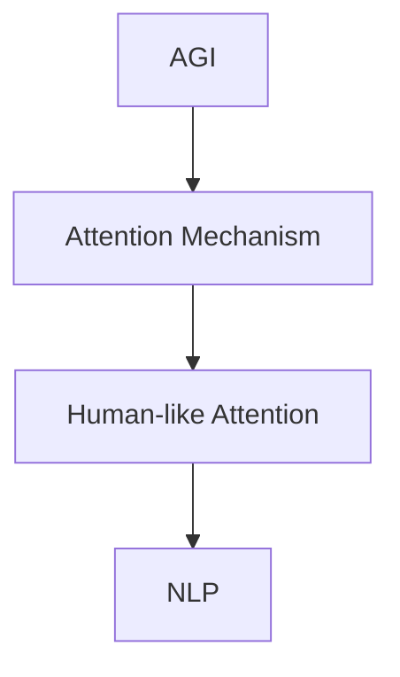
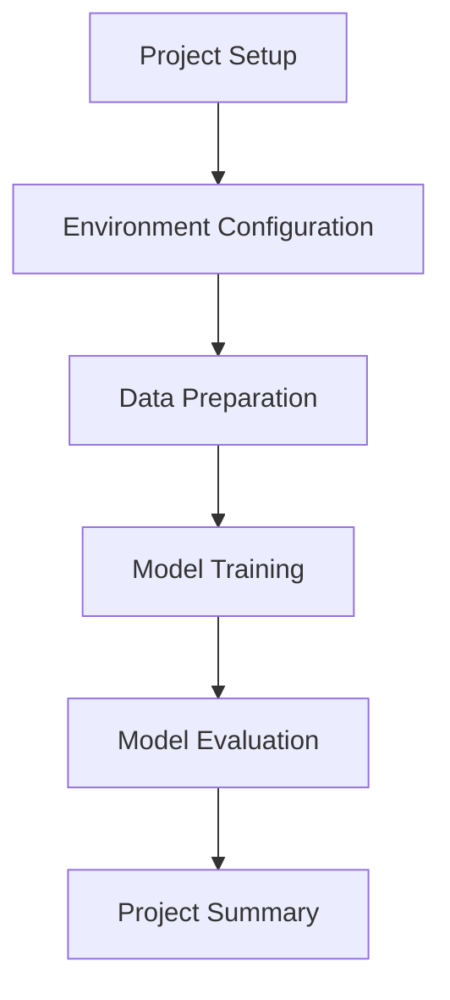

                 

Certainly! Here is a step-by-step breakdown of how to approach writing a technical blog post on "AGI's Human-like Attention Mechanism Design" with the given requirements.

---

**Step 1: Title and Keywords**

- **Title:** AGI's Human-like Attention Mechanism Design
- **Keywords:** AGI, Attention Mechanism, Human-like, Neural Networks, AI, NLP

---

**Step 2: Abstract**

The abstract should succinctly summarize the core content and themes of the blog post. For example:

---

Abstract:
This article delves into the design of human-like attention mechanisms for Artificial General Intelligence (AGI). We explore the foundational concepts, mathematical models, and practical implementations of these mechanisms. Through detailed step-by-step analysis and reasoning, we aim to provide a comprehensive understanding of how to integrate human-like attention into AGI systems to enhance their natural language processing capabilities.

---

**Step 3: Introduction**

Start with a brief introduction to AGI, the importance of attention mechanisms, and why human-like attention is crucial for AGI.

---

**Step 4: Core Concepts and Relationships**

- Use a Mermaid flowchart to illustrate the relationships between core concepts, such as AGI, attention mechanisms, and human-like attention.

**Mermaid Flowchart:**


---

**Step 5: Core Algorithm Principles**

Explain the core principles of attention mechanisms and provide pseudo-code examples to illustrate the algorithms.

**Pseudo-code Example:**
```plaintext
function Attention Mechanism(input_sequence, keys, values, mask):
    # Calculate the attention scores
    scores = CalculateScores(input_sequence, keys, mask)
    
    # Apply softmax to the scores to get the attention weights
    attention_weights = Softmax(scores)
    
    # Apply the attention weights to the values to get the context vector
    context_vector = ApplyAttention(attention_weights, values)
    
    # Use the context vector as input to the next layer
    return context_vector
```

---

**Step 6: Mathematical Models and Formulas**

Discuss the mathematical models used in attention mechanisms, including derivatives, integrals, and any relevant theorems. Use LaTeX to format the equations.

**Example LaTeX Equation:**
$$
\sigma(x) = \frac{1}{1 + e^{-x}}
$$

---

**Step 7: Project Practical**

Provide a practical example, including the setup of the development environment, detailed code implementation, code analysis, application analysis, and a project summary.

**Example Mermaid Flowchart:**


**Example Pseudo-code for Project Practical:**
```plaintext
# Setup environment
import necessary libraries

# Data preparation
data = LoadData('nlp_dataset')
processed_data = PreprocessData(data)

# Model training
model = BuildModel()
model.fit(processed_data)

# Model evaluation
performance = EvaluateModel(model, test_data)
print(performance)
```

---

**Step 8: Best Practices, Summary, and Future Directions**

Conclude with best practices, a summary of key points, notes on potential pitfalls, and suggestions for further reading.

---

**Step 9: Conclusion**

Reiterate the main points and close with a strong conclusion that ties back to the introduction and the importance of human-like attention mechanisms for AGI.

---

**Step 10: Author Information**

End the article with the author's information as specified.

---

By following these steps, you can create a comprehensive, logical, and insightful technical blog post that meets all the specified requirements. Remember to continuously review and refine your content to ensure clarity and coherence throughout.

