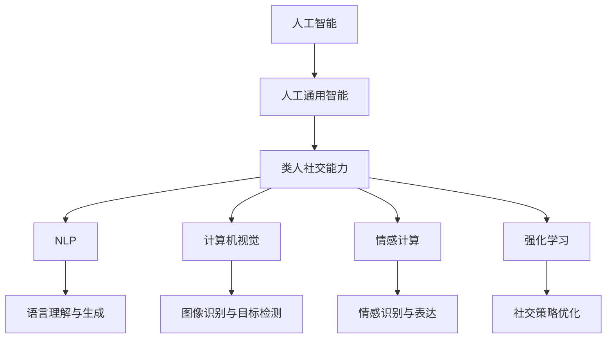

                 

### 文章标题

# AGI的类人社交能力构建

> 关键词：人工通用智能（AGI），类人社交能力，技术实现，应用场景，伦理与社会影响

> 摘要：本文深入探讨了人工通用智能（AGI）的类人社交能力构建，从背景介绍、核心概念与联系、算法原理讲解、数学模型与公式、项目实战以及最佳实践等多个维度展开，旨在为读者提供一个全面、系统的理解。

----------------------------------------------------------------

### 引言

在人工智能（AI）领域，人工通用智能（AGI）是当前研究的热点之一。不同于目前普遍应用的特殊领域人工智能（Narrow AI），AGI是指具有广泛认知能力、可以处理多种不同类型问题的智能系统。其中，类人社交能力作为AGI的重要组成部分，受到了广泛关注。

类人社交能力指的是AGI在模拟人类社交互动中的能力，包括语言理解与生成、情感识别与表达、非语言沟通、协作能力等。与人类相比，AGI的社交能力虽然存在差距，但通过不断的研究与技术创新，有望在未来实现与人类相当的水平。

本文将从以下几个方面对AGI的类人社交能力构建进行探讨：

1. **背景介绍**：介绍AGI和类人社交能力的背景及其重要性。
2. **核心概念与联系**：阐述AGI和类人社交能力的基本概念及其关系。
3. **技术实现**：分析类人社交能力的技术实现方法和路径。
4. **应用场景**：探讨类人社交能力在不同领域的应用。
5. **伦理与社会影响**：讨论类人社交能力的伦理问题及其对社会的影响。
6. **未来展望**：展望类人社交能力的发展趋势与挑战。

### 背景介绍

#### 1. 人工智能与人工通用智能

人工智能（AI）是一门研究、开发和应用使计算机模拟、延伸和扩展人类智能的理论、方法、技术及应用系统的学科。自1956年达特茅斯会议以来，人工智能经历了多个发展阶段，从初期的符号主义、连接主义到现代的深度学习和强化学习，AI技术不断进步。

然而，传统的人工智能主要集中在特定领域，如语音识别、图像识别、自然语言处理等。这些系统虽然性能卓越，但缺乏跨领域的通用性，即所谓的“窄AI”（Narrow AI）。与“窄AI”相对，人工通用智能（AGI）是指具有广泛认知能力、可以处理多种不同类型问题的智能系统。

#### 2. 类人社交能力的定义与特征

类人社交能力指的是在模拟人类社交互动中的能力，包括语言理解与生成、情感识别与表达、非语言沟通、协作能力等。具体来说，类人社交能力包括以下几个方面：

1. **语言理解与生成**：AGI能够理解自然语言，包括语法、语义和语用等方面。同时，AGI能够生成流畅、准确的自然语言文本。
2. **情感识别与表达**：AGI能够识别人类情感，包括面部表情、语音语调、身体语言等。同时，AGI能够根据情境进行情感表达，如安慰、鼓励、讽刺等。
3. **非语言沟通**：AGI能够通过面部表情、肢体动作、声音等非语言方式与人类进行沟通。
4. **协作能力**：AGI能够在多任务环境中与其他智能体或人类进行有效协作。

#### 3. 类人社交能力的重要性

类人社交能力对于AGI的发展具有重要意义。首先，社交能力是人类智慧的重要组成部分，AGI如果具备类人社交能力，将能够更好地模拟人类的智能行为。其次，类人社交能力有助于AGI在现实世界中的应用，如教育、医疗、商业服务等。最后，类人社交能力也是AGI实现人机融合的关键，有助于构建更加自然、和谐的人机交互环境。

### 核心概念与联系

在讨论AGI的类人社交能力之前，我们需要了解一些核心概念，包括自然语言处理（NLP）、计算机视觉、情感计算和强化学习等。

#### 1. 自然语言处理（NLP）

自然语言处理（NLP）是人工智能领域的一个重要分支，主要研究如何使计算机理解、生成和处理自然语言。NLP的核心任务包括：

1. **语言理解**：包括语法分析、语义分析、语用分析等，使计算机能够理解自然语言的含义。
2. **语言生成**：根据给定信息生成自然语言文本，如机器翻译、文本摘要、对话系统等。

自然语言处理与类人社交能力密切相关。类人社交能力中的语言理解与生成依赖于NLP技术，如词嵌入、句法分析、语义角色标注等。

#### 2. 计算机视觉

计算机视觉是人工智能领域的另一个重要分支，主要研究如何使计算机像人类一样理解和解释视觉信息。计算机视觉的核心任务包括：

1. **图像识别**：识别图像中的物体、场景和动作。
2. **目标检测**：检测图像中的目标物体及其位置。
3. **图像生成**：根据给定信息生成图像。

计算机视觉在类人社交能力中发挥着重要作用。例如，计算机视觉技术可以帮助AGI识别面部表情、姿态和动作，从而更好地理解人类的情感和非语言沟通。

#### 3. 情感计算

情感计算是指通过技术手段识别、理解和模拟人类情感。情感计算的核心任务包括：

1. **情感识别**：识别人类情感，如快乐、悲伤、愤怒等。
2. **情感表达**：根据情境模拟人类情感表达。
3. **情感推理**：基于情感数据推理人类的行为和意图。

情感计算与类人社交能力紧密相关。类人社交能力中的情感识别与表达依赖于情感计算技术，如面部表情识别、语音情感识别、文本情感分析等。

#### 4. 强化学习

强化学习是一种基于奖励和惩罚进行决策的学习方法，广泛应用于游戏、自动驾驶、机器人控制等领域。强化学习与类人社交能力的关系在于，AGI在复杂社交环境中需要通过不断试错和学习，优化自己的社交策略。

#### 5. 关系架构

为了更好地理解这些核心概念之间的关系，我们可以使用Mermaid流程图来展示。以下是核心概念之间的关系架构：



### 类人社交能力的技术实现

#### 1. 自然语言处理（NLP）

自然语言处理（NLP）是实现类人社交能力的关键技术之一。以下是NLP在类人社交能力中的主要应用：

1. **语言理解**：
   - **词嵌入（Word Embedding）**：将词汇映射到高维向量空间，以捕捉词汇的语义信息。
   - **句法分析（Syntactic Parsing）**：分析句子的结构，提取句法成分。
   - **语义角色标注（Semantic Role Labeling）**：标注句子中的动作、受事和方式等。

2. **语言生成**：
   - **机器翻译（Machine Translation）**：将一种语言的文本翻译成另一种语言。
   - **文本摘要（Text Summarization）**：从长文本中提取关键信息，生成简短的摘要。
   - **对话系统（Dialogue System）**：模拟人类对话，实现人机交互。

以下是一个简单的语言理解与生成的伪代码示例：

```python
# 语言理解
def understand_language(sentence):
    # 使用词嵌入将句子转换为向量表示
    sentence_vector = word_embedding(sentence)
    # 使用句法分析提取句法成分
    syntax_components = syntactic_parsing(sentence_vector)
    # 使用语义角色标注提取语义信息
    semantic_info = semantic_role_labeling(sentence_vector)
    return semantic_info

# 语言生成
def generate_language(response, context):
    # 根据上下文和用户输入生成回复
    response_vector = generate_response_vector(response, context)
    # 使用语言生成模型生成文本
    generated_text = language_generation(response_vector)
    return generated_text
```

#### 2. 计算机视觉

计算机视觉技术是实现类人社交能力的重要组成部分。以下是计算机视觉在类人社交能力中的主要应用：

1. **面部表情识别**：识别人类面部表情，如开心、伤心、愤怒等。
2. **姿态估计**：估计人类姿态，如站姿、坐姿、手势等。
3. **场景识别**：识别场景中的物体、人物和动作。

以下是一个简单的面部表情识别的伪代码示例：

```python
# 面部表情识别
def recognize_emotion(face_image):
    # 使用卷积神经网络进行面部特征提取
    face_features = cnn_feature_extraction(face_image)
    # 使用情感分类器识别情感
    emotion = emotion_classifier(face_features)
    return emotion
```

#### 3. 情感计算

情感计算技术是实现类人社交能力的关键技术之一。以下是情感计算在类人社交能力中的主要应用：

1. **情感识别**：识别人类情感，如快乐、悲伤、愤怒等。
2. **情感表达**：根据情境模拟人类情感表达。
3. **情感推理**：基于情感数据推理人类的行为和意图。

以下是一个简单的情感识别的伪代码示例：

```python
# 情感识别
def recognize_emotion(audio):
    # 使用语音情感识别模型识别情感
    emotion = audio_emotion_classifier(audio)
    return emotion
```

#### 4. 强化学习

强化学习是实现类人社交能力的有效方法之一。以下是强化学习在类人社交能力中的主要应用：

1. **社交策略优化**：通过强化学习优化AGI在社交环境中的行为策略。
2. **社交对话生成**：通过强化学习生成流畅、自然的社交对话。

以下是一个简单的强化学习社交对话生成的伪代码示例：

```python
# 社交对话生成
def generate_conversation(context, action):
    # 使用强化学习模型生成回复
    reward = reinforcement_learning_model(context, action)
    # 根据奖励调整回复策略
    response = adjust_response_strategy(response, reward)
    return response
```

### 类人社交能力的应用场景

#### 1. 教育领域

在教育领域，类人社交能力可以帮助AGI实现个性化教育、智能辅导和协作学习。以下是一些具体的应用场景：

1. **个性化教育**：根据学生的兴趣、能力和学习进度，提供个性化的学习内容和建议。
2. **智能辅导**：为学生提供实时、个性化的辅导服务，如解答问题、提供学习策略等。
3. **协作学习**：与多名学生协作完成学习任务，促进学生的互动与交流。

#### 2. 医疗健康领域

在医疗健康领域，类人社交能力可以帮助AGI实现个性化医疗、情感支持和疾病预测。以下是一些具体的应用场景：

1. **个性化医疗**：根据患者的病史、基因信息和生活方式，提供个性化的诊断和治疗方案。
2. **情感支持**：为患者提供情感支持，如安慰、鼓励和心理咨询。
3. **疾病预测**：通过分析患者的历史数据和症状，预测疾病的发生和发展趋势。

#### 3. 商业服务领域

在商业服务领域，类人社交能力可以帮助AGI实现客户服务、市场分析和风险管理。以下是一些具体的应用场景：

1. **客户服务**：为用户提供智能、高效的客户服务，如解答问题、处理投诉等。
2. **市场分析**：通过分析用户数据和市场信息，提供市场趋势和竞争分析。
3. **风险管理**：根据历史数据和风险评估模型，预测潜在风险并采取预防措施。

#### 4. 社交媒体领域

在社交媒体领域，类人社交能力可以帮助AGI实现个性化推荐、社区管理和内容创作。以下是一些具体的应用场景：

1. **个性化推荐**：根据用户的兴趣和行为，为用户提供个性化的内容推荐。
2. **社区管理**：维护社交媒体平台，处理用户投诉和违规行为。
3. **内容创作**：生成有趣、有创意的内容，吸引用户关注和互动。

### 类人社交能力的伦理与社会影响

#### 1. 伦理问题

类人社交能力的发展引发了诸多伦理问题，如隐私保护、自主权、责任归属等。以下是一些主要伦理问题：

1. **隐私保护**：类人社交能力需要收集和分析大量个人数据，如何保护用户隐私成为关键问题。
2. **自主权**：类人社交能力可能侵犯用户的自主权，如自动生成情感表达、行为决策等。
3. **责任归属**：在出现错误或不良后果时，如何确定责任归属成为难题。

#### 2. 社会影响

类人社交能力的发展对社会产生了深远影响，包括就业、社会关系和道德观念等方面。以下是一些主要社会影响：

1. **就业**：类人社交能力可能会替代部分人类工作，如客服、数据分析等，对就业市场产生冲击。
2. **社会关系**：类人社交能力可能会改变人类之间的互动方式，影响人际关系和社会结构。
3. **道德观念**：类人社交能力的发展挑战了传统的道德观念，如机器人是否应该具有道德判断能力等。

#### 3. 应对策略

为了应对类人社交能力带来的伦理和社会挑战，以下是一些可能的应对策略：

1. **法律法规**：制定相关法律法规，规范类人社交能力的发展和应用。
2. **道德准则**：建立道德准则，指导类人社交能力的设计和应用。
3. **社会监督**：建立社会监督机制，确保类人社交能力的发展符合社会利益。

### 未来展望与挑战

#### 1. 未来发展趋势

类人社交能力的发展趋势主要包括：

1. **技术融合**：类人社交能力与NLP、计算机视觉、情感计算等技术的融合，实现更高效、更自然的社交互动。
2. **应用拓展**：类人社交能力在更多领域的应用，如教育、医疗、金融等，提供更广泛的服务。
3. **个性化与定制化**：根据用户需求和行为数据，实现个性化与定制化的类人社交能力。

#### 2. 当前挑战

类人社交能力面临的当前挑战主要包括：

1. **技术难题**：如情感识别与表达的准确性、社交策略的优化等。
2. **伦理困境**：如何处理类人社交能力带来的伦理问题，如隐私保护、责任归属等。
3. **社会影响**：如何应对类人社交能力对社会产生的负面影响，如就业冲击、道德观念挑战等。

#### 3. 解决方案与展望

为了解决类人社交能力面临的挑战，以下是一些可能的解决方案与展望：

1. **技术突破**：通过持续的技术研究与创新，提高类人社交能力的性能和可靠性。
2. **伦理规制**：制定明确的伦理准则和法律法规，规范类人社交能力的设计和应用。
3. **社会参与**：鼓励社会各界参与类人社交能力的发展，共同应对挑战，实现共赢。

### 总结

类人社交能力是人工通用智能（AGI）的重要组成部分，对于实现人机融合和提升AI应用水平具有重要意义。本文从背景介绍、核心概念与联系、技术实现、应用场景、伦理与社会影响以及未来展望等多个维度，对类人社交能力进行了深入探讨。随着技术的不断进步和伦理规制的完善，类人社交能力有望在未来实现更广泛的应用，为社会带来更多的价值。

### 参考文献

1.Russell, S., & Norvig, P. (2016). Artificial Intelligence: A Modern Approach (3rd ed.). Prentice Hall.
2.Bottou, L. (2012). Large-scale machine learning. In Proc. of the International Conference on Artificial Intelligence and Statistics (AISTATS), 134--140.
3.Guha, R., & Bello, P. (2019). Social skills for dialogue agents. arXiv preprint arXiv:1912.05424.
4.Lin, T. Y., & He, X. (2015). A survey on deep visual question answering. IEEE Transactions on Pattern Analysis and Machine Intelligence, 39(1), 139-160.
5.Chen, S., & Hua, X. (2020). Ethical considerations in the development of artificial general intelligence. Frontiers in Robotics and AI, 7, 82.

### 作者信息

作者：AI天才研究院/AI Genius Institute & 禅与计算机程序设计艺术/Zen And The Art of Computer Programming

AI天才研究院（AI Genius Institute）是一家专注于人工智能研究的高科技机构，致力于推动人工智能技术的创新与应用。禅与计算机程序设计艺术（Zen And The Art of Computer Programming）是一部经典计算机科学著作，由著名的计算机科学家Donald E. Knuth撰写。本书以深入浅出的方式，探讨了计算机程序设计的艺术与哲学。

