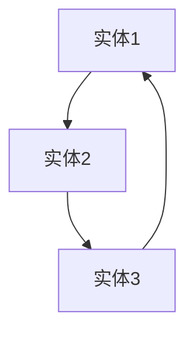
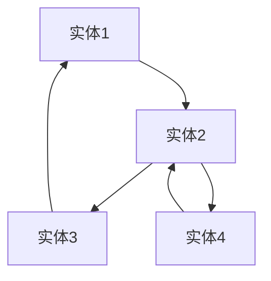
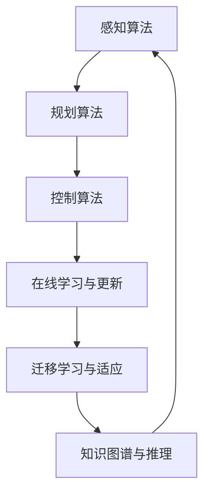
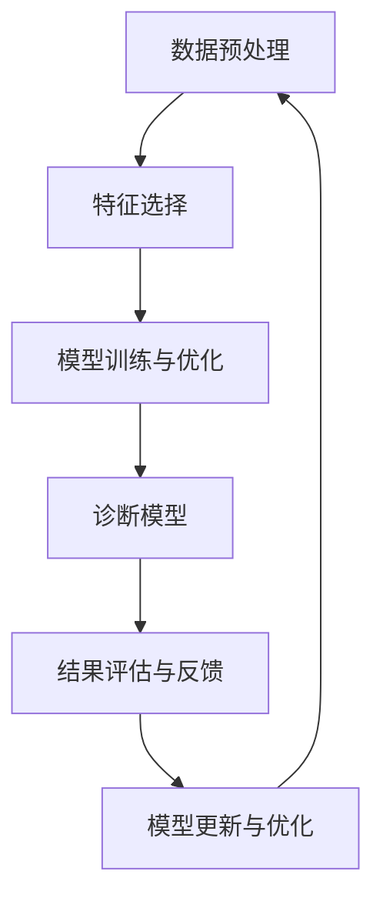
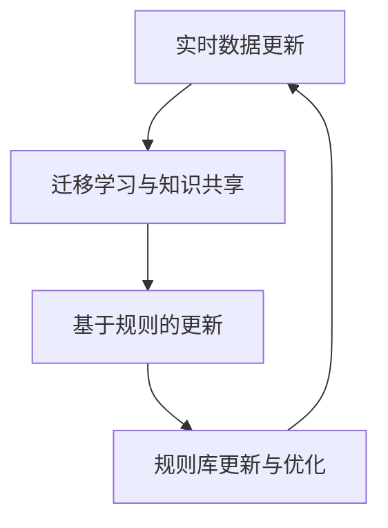
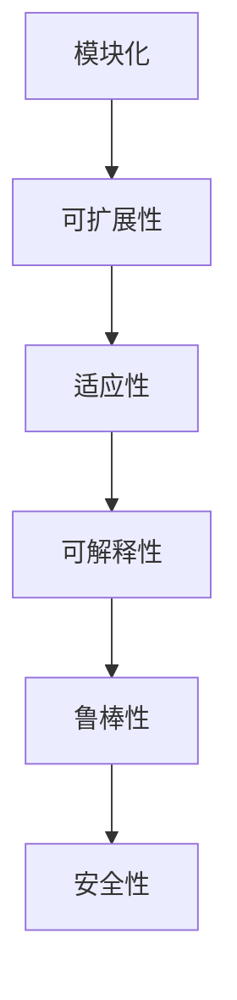
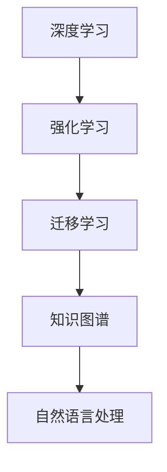
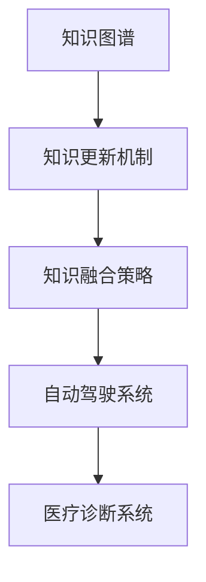

                 

### 第1章: 引言

#### 1.1 AGI的概念与重要性

人工通用智能（Artificial General Intelligence，简称AGI）是指一种具有普遍智能能力的机器，它能够理解、学习和应用知识，解决各种复杂问题，与人类智能具有相同或更高级别的能力。AGI的发展不仅代表着人工智能领域的重大突破，更对人类社会产生深远影响。以下是AGI的重要特点：

- **适应性**：AGI能够在不同环境和任务中表现出色，具备强大的适应能力。
- **普适性**：AGI能够处理多种类型的问题，而不仅仅是特定领域的问题。
- **学习能力**：AGI具备自我学习和持续学习的能力，能够通过经验不断优化自身。

AGI的潜在应用场景包括自动驾驶、医疗诊断、智能助手等。例如，自动驾驶系统需要实时感知环境、做出决策并控制车辆，这对AGI提出了极高的要求。在医疗诊断领域，AGI可以辅助医生分析医疗数据，提高诊断准确率。

#### 1.2 自主学习与知识更新的关系

自主学习和知识更新是AGI的两个核心组成部分。自主学习是指机器通过与环境交互，利用反馈机制和算法自动获取知识的过程。而知识更新则是在已有知识基础上，通过新信息的学习和整合，不断丰富和完善知识体系。

自主学习和知识更新之间的关系可以概括为：

- **相互促进**：自主学习为知识更新提供了基础，而知识更新又推动了自主学习的深入发展。
- **动态平衡**：AGI需要在自主学习和知识更新之间保持动态平衡，既要避免过度依赖现有知识，也要确保知识体系的及时更新。

#### 1.3 书籍结构概述

本书旨在深入探讨AGI的自主学习与知识更新机制。具体结构如下：

- **第1章**：引言，介绍AGI的概念、重要性以及自主学习和知识更新的关系。
- **第2章**：AGI的基础理论，回顾人工智能的发展历程，分析AGI的核心理论和面临的挑战。
- **第3章**：自主学习的原理，详细探讨反馈机制与强化学习、无监督学习与模式识别等。
- **第4章**：知识更新的机制，介绍知识表征方法和知识更新策略。
- **第5章**：AGI在特定领域的应用，分析自动驾驶和医疗诊断等领域的AGI应用实例。
- **第6章**：AGI的开发与实现，讨论开发环境搭建、系统设计原则和关键技术。
- **第7章**：未来展望与挑战，探讨AGI发展面临的挑战以及未来发展方向。

通过以上章节的安排，本书旨在为读者提供全面、系统的AGI学习资源，帮助读者深入理解AGI的自主学习与知识更新机制。

### 第2章: AGI的基础理论

#### 2.1 人工智能发展历程

人工智能（Artificial Intelligence，简称AI）作为一个跨学科领域，其发展历程可以追溯到20世纪50年代。以下是人工智能发展的重要阶段：

- **1956年**：人工智能首次被提出。当时，约翰·麦卡锡（John McCarthy）等人在达特茅斯会议上提出了人工智能的概念，并讨论了实现其目标所需的技术和方法。
- **1970-1980年代**：早期的人工智能研究主要集中在符号推理和知识表示上。专家系统成为这一阶段的重要成果，通过模拟专家的知识和推理过程来解决特定领域的问题。
- **1980-1990年代**：随着计算机性能的提升和算法的进步，机器学习开始成为人工智能研究的热点。尤其是决策树、支持向量机等算法的出现，为解决复杂数据分析问题提供了有效方法。
- **2000年代**：深度学习技术的发展使得人工智能取得了突破性进展。以卷积神经网络（CNN）和循环神经网络（RNN）为代表的深度学习算法在图像识别、自然语言处理等领域取得了显著成果。
- **2010年代至今**：人工智能进入广泛应用阶段，特别是在自动驾驶、智能助手、医疗诊断等领域。同时，人工智能与大数据、云计算等技术的结合，进一步推动了AI技术的发展和应用。

#### 2.2 AGI的核心理论与挑战

AGI的核心理论主要包括以下几个方面：

- **通用性**：AGI旨在实现机器具备与人类相似的通用智能能力，能够处理各种复杂问题和任务。
- **学习能力**：AGI需要具备自我学习和持续学习的能力，通过不断积累经验来优化自身性能。
- **自适应能力**：AGI需要在不同环境和任务中表现出色，具备强大的自适应能力。
- **知识整合**：AGI需要能够整合多领域知识，形成统一的知识体系，以支持复杂的决策和推理过程。

然而，实现AGI面临着诸多挑战：

- **计算资源限制**：尽管计算机性能不断提升，但仍然无法与人类大脑相媲美，特别是在处理复杂任务时，计算资源仍存在显著限制。
- **数据质量**：AGI需要大量的高质量数据来训练和学习，但现实中的数据往往存在噪声和不一致性，这对数据质量提出了挑战。
- **算法瓶颈**：现有算法在处理复杂任务时仍存在瓶颈，如深度学习算法在处理长序列数据时性能不佳。
- **伦理与安全**：AGI的发展引发了伦理和安全问题，如如何确保AI系统的公平性、透明性和安全性。

#### 2.3 自主学习与知识表示

自主学习和知识表示是AGI的两个核心组成部分。自主学习是指机器通过与环境交互，利用反馈机制和算法自动获取知识的过程。而知识表示则是将获取到的知识以结构化的形式进行存储和表示，以便于后续的使用和推理。

自主学习的关键技术包括：

- **强化学习**：通过试错和反馈机制，机器可以在环境中学习到最优策略。Q-学习算法是强化学习的一种经典算法，其核心思想是通过比较不同动作的预期收益来选择最优动作。
- **无监督学习**：在无监督学习过程中，机器通过学习数据中的模式来获取知识。自组织映射（Self-Organizing Map，简称SOM）是一种常见的无监督学习算法，它通过竞争学习方式将输入数据映射到低维空间，形成紧凑的聚类。
- **迁移学习**：迁移学习是一种利用已有任务的知识来加速新任务学习的方法。通过迁移学习，机器可以快速适应新任务，提高学习效率。

知识表示的关键技术包括：

- **知识图谱**：知识图谱是一种结构化知识表示方法，它通过节点和边来表示实体及其关系。知识图谱可以用于数据挖掘、推理和推荐系统等领域。
- **本体论**：本体论是一种研究知识表示和语义建模的方法，它通过定义概念、属性和关系来描述领域知识。本体论可以用于构建领域知识库和智能问答系统。

自主学习和知识表示的关系可以概括为：

- **相互促进**：自主学习为知识表示提供了丰富的数据源，而知识表示则为自主学习提供了有效的知识存储和利用方式。
- **动态平衡**：AGI需要在自主学习和知识表示之间保持动态平衡，既要确保知识体系的及时更新，也要充分利用已有知识进行学习和决策。

通过以上理论探讨，我们可以更深入地理解AGI的基础理论，为进一步研究和应用AGI奠定基础。

### 第3章: 自主学习的原理

#### 3.1 反馈机制与强化学习

自主学习是AGI的核心组成部分之一，而强化学习（Reinforcement Learning，简称RL）作为自主学习的重要方法，具有显著的应用价值。强化学习的基本原理是通过试错和反馈机制，让机器在特定环境中学习到最优策略。

#### 3.1.1 强化学习的核心算法

强化学习算法的核心是奖励机制和策略迭代。具体算法包括：

- **Q-学习算法**：Q-学习是一种基于值函数的强化学习算法，其核心思想是通过比较不同动作的预期收益来选择最优动作。Q-学习算法的基本流程如下：

  ```python
  # Q-学习算法伪代码
  Initialize Q(s, a) uniformly
  for episode in 1 to E do
      s = env.reset()
      for t in 1 to T do
          a = ε-greedy policy(s)
          s', r = env.step(a)
          Q(s, a) = Q(s, a) + α[r + γmax(Q(s', a')) - Q(s, a)]
          s = s'
  ```

  其中，`Q(s, a)`表示状态`s`下执行动作`a`的期望收益，`ε-greedy`策略是指在随机选择动作和选择最优动作之间进行平衡。

- **深度Q网络（Deep Q-Network，简称DQN）**：DQN是Q-学习算法的改进版本，通过引入深度神经网络来近似值函数。DQN的基本流程如下：

  ```python
  # DQN算法伪代码
  Initialize Q-network using random weights
  for episode in 1 to E do
      s = env.reset()
      for t in 1 to T do
          a = ε-greedy policy(s)
          s', r = env.step(a)
          target = r + γmax(Q(s', a'))
          Q(s, a) = Q(s, a) + α[target - Q(s, a)]
          s = s'
  ```

  其中，`target`是目标值，用于更新当前值函数。

#### 3.1.2 Q-学习算法伪代码

为了更好地理解Q-学习算法，我们可以通过伪代码来描述其基本流程：

```python
# Q-学习算法伪代码
Initialize Q(s, a) uniformly
for episode in 1 to E do
    s = env.reset()
    for t in 1 to T do
        a = ε-greedy policy(s)
        s', r = env.step(a)
        Q(s, a) = Q(s, a) + α[r + γmax(Q(s', a')) - Q(s, a)]
        s = s'
```

其中，`α`是学习率，`γ`是折扣因子，`ε-greedy`策略是一种探索与利用的平衡策略，通过在随机选择动作和选择最优动作之间进行权衡，以避免过早收敛到次优策略。

#### 3.2 无监督学习与模式识别

无监督学习（Unsupervised Learning）是自主学习的重要组成部分，它不依赖于标签数据，通过学习数据中的内在结构和模式来获取知识。模式识别（Pattern Recognition）是机器学习的一个分支，它通过学习输入数据中的特征模式，实现对未知数据的分类和预测。

##### 3.2.1 自组织映射算法

自组织映射（Self-Organizing Map，简称SOM）是一种无监督学习算法，它通过竞争学习方式将输入数据映射到低维空间，形成紧凑的聚类。SOM的基本原理如下：

- **初始化**：随机生成一个二维网格，每个节点表示一个神经元。
- **竞争学习**：对于输入数据，找到与之最近的神经元作为“获胜”神经元。
- **调整权重**：更新获胜神经元及其邻域内神经元的权重，使得相似的输入数据映射到相似的神经元。

SOM算法的核心参数包括：

- **网格大小**：表示SOM映射空间的维度。
- **邻域函数**：用于定义神经元的邻域范围。
- **学习率**：用于控制权重更新的速度。

##### 3.2.2 自组织映射算法伪代码

以下为自组织映射算法的伪代码描述：

```python
# 自组织映射算法伪代码
Initialize grid with random weights
for epoch in 1 to E do
    for each input vector x in dataset do
        Find the winning node w
        Calculate the distance between x and w
        Update the weights of w and its neighbors
```

其中，`E`表示学习迭代次数，`x`为输入数据，`w`为获胜神经元。

#### 3.3 无监督学习的应用场景

无监督学习在诸多领域具有广泛的应用，以下为一些典型应用场景：

- **图像识别**：通过学习图像中的特征模式，实现对图像的自动分类和识别。
- **文本分类**：通过学习文本数据中的特征模式，实现对文本的自动分类。
- **异常检测**：通过学习正常数据中的特征模式，检测异常数据。
- **聚类分析**：通过学习数据中的相似性模式，将数据划分为若干个类别。

在图像识别领域，自组织映射算法被广泛应用于特征提取和聚类分析。通过自组织映射算法，可以将高维图像数据映射到低维空间，从而简化图像处理过程。以下是一个简单的自组织映射应用案例：

```python
# 自组织映射应用案例伪代码
Initialize SOM with random weights
for epoch in 1 to E do
    for each image in dataset do
        Find the winning node in SOM
        Update the weights of the winning node and its neighbors
        Classify the image based on the winning node
```

通过以上案例，我们可以看到无监督学习在图像识别中的应用潜力。随着算法的不断优化和应用场景的拓展，无监督学习在人工智能领域将发挥越来越重要的作用。

### 第4章: 知识更新的机制

#### 4.1 知识表征方法

知识表征是知识更新机制的基础，它涉及如何将知识以结构化的形式进行存储和表示，以便于后续的利用和推理。以下介绍几种常见的知识表征方法。

##### 4.1.1 知识图谱表示

知识图谱（Knowledge Graph）是一种用于表示实体及其相互关系的图形结构。在知识图谱中，节点表示实体，边表示实体之间的关联关系，而边上的标签则表示关系的类型。

知识图谱具有以下优点：

- **语义丰富**：通过将实体和关系进行结构化表示，知识图谱可以提供丰富的语义信息。
- **高效查询**：知识图谱支持高效的图查询操作，可以快速检索和关联实体及其关系。
- **知识整合**：知识图谱可以将来自不同源的知识进行整合，形成统一的知识体系。

知识图谱的表示方法包括：

- **图论表示**：使用图论中的概念，如节点、边和路径，来表示实体和关系。
- **语义网络表示**：使用符号表示实体和关系，如“人”是“实体”，“朋友”是“关系”。

以下是一个知识图谱表示的Mermaid流程图：



在这个例子中，实体1、实体2和实体3之间存在相互关联，通过知识图谱可以方便地进行关系查询和推理。

##### 4.1.2 知识图谱表示的Mermaid流程图

知识图谱的Mermaid流程图示例如下：



在这个流程图中，A、B、C和D表示四个实体，它们之间的连线表示实体之间的关系。通过这样的结构化表示，我们可以方便地对知识进行管理和利用。

#### 4.2 知识更新策略

知识更新策略是指如何根据新信息对已有知识进行更新和优化，以保持知识体系的准确性和时效性。以下介绍几种常见的知识更新策略。

##### 4.2.1 知识融合策略

知识融合（Knowledge Fusion）是指将来自不同源的知识进行整合和融合，以形成统一、准确的知识体系。知识融合策略主要包括以下几种：

- **基于规则的融合**：通过定义规则，将不同源的知识进行匹配和整合。例如，在医疗诊断中，可以将医生的经验知识、医学图谱和数据驱动的模型进行融合，以提高诊断准确率。
- **基于统计的融合**：通过统计分析方法，对多个知识源进行融合。例如，在文本分类中，可以使用词袋模型、TF-IDF等方法对多个文本数据进行融合，以提高分类效果。
- **基于机器学习的融合**：通过机器学习方法，对多个知识源进行融合。例如，在图像识别中，可以使用多模型融合的方法，将深度卷积神经网络（CNN）和循环神经网络（RNN）的结果进行融合，以提高识别准确率。

以下是一个知识融合策略的伪代码：

```python
# 知识融合策略伪代码
def knowledge_fusion(knowledge_sources):
    fused_knowledge = []
    for source in knowledge_sources:
        fused_knowledge.append(source)
    return fused_knowledge
```

在这个例子中，`knowledge_sources`表示多个知识源，`fused_knowledge`表示融合后的知识体系。

##### 4.2.2 知识融合策略的伪代码

知识融合策略的伪代码示例如下：

```python
# 知识融合策略伪代码
def knowledge_fusion(knowledge_sources):
    fused_knowledge = []
    for source in knowledge_sources:
        rule_based_fusion = rule_based_fusion(source)
        statistical_fusion = statistical_fusion(source)
        ml_fusion = ml_fusion(source)
        fused_knowledge.append(rule_based_fusion + statistical_fusion + ml_fusion)
    return fused_knowledge
```

在这个例子中，`knowledge_sources`表示多个知识源，`rule_based_fusion`、`statistical_fusion`和`ml_fusion`分别表示基于规则、基于统计和基于机器学习的融合方法。

通过以上知识更新策略，我们可以有效地对知识进行更新和优化，以提高知识体系的准确性和时效性。

### 第5章: AGI在特定领域的应用

#### 5.1 自动驾驶

自动驾驶技术是AGI在特定领域的一个重要应用场景。自动驾驶系统需要实时感知环境、做出决策并控制车辆，这要求系统具备高度智能化和自适应能力。以下是自动驾驶领域的核心算法及其知识更新机制。

##### 5.1.1 自动驾驶的核心算法

自动驾驶系统通常采用以下核心算法：

- **感知算法**：用于实时感知环境中的障碍物、车道线、交通标志等。常用的感知算法包括：

  - **基于深度学习的感知算法**：如卷积神经网络（CNN）和循环神经网络（RNN）等，用于处理复杂的图像和序列数据。
  - **多传感器数据融合算法**：通过整合来自摄像头、激光雷达、雷达等多源数据，提高感知精度和鲁棒性。

- **规划算法**：用于生成车辆的行驶路径。常用的规划算法包括：

  - **基于图论的路径规划算法**：如A*算法、Dijkstra算法等，用于在给定地图上寻找最优路径。
  - **基于行为的路径规划算法**：如行为树（Behavior Tree）和决策树（Decision Tree）等，用于处理复杂的行为和决策。

- **控制算法**：用于生成车辆的加速、减速和转向等控制指令。常用的控制算法包括：

  - **PID控制算法**：通过比例、积分和微分三个参数，调节车辆的动态响应。
  - **自适应控制算法**：通过学习车辆的动态特性，自适应调整控制参数，提高控制效果。

##### 5.1.2 自动驾驶系统的知识更新机制

自动驾驶系统的知识更新机制主要包括以下几个方面：

- **在线学习与更新**：通过实时感知环境中的数据，不断更新和优化感知、规划和控制算法。例如，使用深度学习算法对摄像头和激光雷达数据进行在线训练，提高感知精度。
- **迁移学习与适应**：通过迁移学习，将已有知识应用于新场景和新任务。例如，将城市道路的驾驶经验迁移到乡村道路，提高适应能力。
- **知识图谱与推理**：通过构建知识图谱，将感知、规划和控制过程中的知识进行结构化表示和存储。例如，将交通标志、车道线等实体及其关系进行表示，用于推理和决策。

以下是一个自动驾驶系统的知识更新机制的Mermaid流程图：



在这个流程图中，自动驾驶系统的核心算法（感知、规划、控制）通过知识更新机制（在线学习与更新、迁移学习与适应、知识图谱与推理）相互关联，形成一个闭环系统，不断优化和提升自动驾驶能力。

#### 5.2 医疗诊断

医疗诊断是AGI在另一个重要领域中的应用。医疗诊断系统通过自主学习和分析大量医疗数据，帮助医生进行疾病诊断和治疗方案推荐。以下是医疗诊断中的自主学习机制和知识更新方法。

##### 5.2.1 医疗诊断中的自主学习机制

医疗诊断中的自主学习机制主要包括以下几个方面：

- **数据预处理**：对医疗数据进行清洗、归一化和特征提取，为后续学习提供高质量的数据输入。
- **特征选择**：通过统计方法或机器学习算法，选择对疾病诊断具有显著影响的关键特征。
- **模型训练与优化**：使用机器学习算法（如深度学习、支持向量机等）对医疗数据进行训练，构建诊断模型，并使用交叉验证和超参数调优等方法优化模型性能。

以下是一个医疗诊断中的自主学习机制的Mermaid流程图：



在这个流程图中，医疗诊断系统通过数据预处理、特征选择、模型训练与优化等步骤，逐步构建和优化诊断模型，通过结果评估与反馈不断优化和提升诊断能力。

##### 5.2.2 医疗诊断中的知识更新方法

医疗诊断中的知识更新方法主要包括以下几个方面：

- **实时数据更新**：通过实时收集和更新医疗数据，确保诊断模型具有最新的数据支持。
- **迁移学习与知识共享**：通过迁移学习，将已有诊断经验应用于新疾病和新患者，提高诊断能力。同时，通过知识共享平台，实现不同诊断系统的知识共享和协同工作。
- **基于规则的更新**：在诊断过程中，通过专家经验和医学知识，建立规则库，用于指导诊断决策。同时，通过持续更新和优化规则库，确保诊断规则的准确性和时效性。

以下是一个医疗诊断中的知识更新方法的Mermaid流程图：



在这个流程图中，医疗诊断系统通过实时数据更新、迁移学习与知识共享、基于规则的更新等方法，不断更新和优化诊断知识，提高诊断准确率和实时性。

通过以上自动驾驶和医疗诊断的应用实例，我们可以看到AGI在特定领域中的广泛应用和巨大潜力。随着技术的不断进步和应用场景的不断拓展，AGI将在未来发挥更加重要的作用。

### 第6章: AGI的开发与实现

#### 6.1 开发环境搭建

要开发一个具备通用智能能力的AGI系统，首先需要搭建一个适合的开发环境。以下是一个典型的开发环境搭建流程：

**硬件环境：**
- **计算资源**：高性能计算机或服务器，配备多个CPU核心和GPU，用于处理大量的数据和复杂的算法。
- **存储设备**：高速存储设备，如固态硬盘（SSD），用于存储大量的数据集和模型。
- **网络设施**：稳定的网络连接，用于数据传输和模型部署。

**软件环境：**
- **操作系统**：常用的操作系统包括Linux、Windows和macOS等，其中Linux因其开源和可定制性，常被用于高性能计算环境。
- **编程语言**：Python是AGI开发中广泛使用的编程语言，具有丰富的库和框架支持，如TensorFlow、PyTorch等。
- **开发工具**：集成开发环境（IDE），如PyCharm、Jupyter Notebook等，用于编写、调试和运行代码。
- **版本控制**：Git等版本控制工具，用于管理代码版本和协作开发。

**工具与框架：**
- **深度学习框架**：如TensorFlow、PyTorch等，用于构建和训练深度学习模型。
- **数据处理库**：如Pandas、NumPy等，用于数据预处理和特征提取。
- **机器学习库**：如Scikit-learn、XGBoost等，用于传统机器学习算法的实现和应用。

**搭建步骤：**
1. **硬件配置**：根据项目需求，配置计算资源和存储设备，确保满足数据处理和训练的需要。
2. **软件安装**：在操作系统上安装Python、IDE、深度学习框架等开发工具。
3. **环境配置**：配置Python环境，安装必要的库和依赖项。
4. **版本控制**：初始化Git仓库，管理代码版本和控制协作。

以下是一个简单的开发环境搭建示例：

```bash
# 安装Python和常用库
pip install python numpy pandas tensorflow

# 配置Jupyter Notebook
pip install notebook

# 初始化Git仓库
git init
```

通过以上步骤，我们可以搭建一个基础的开发环境，为后续的AGI系统开发做好准备。

#### 6.2 AGI系统的设计原则

AGI系统的设计原则是确保系统能够具备通用智能能力，并在实际应用中表现出色。以下是一些关键的设计原则：

**模块化**：将AGI系统拆分成若干个模块，如感知、规划、决策、执行等，每个模块负责特定的功能，便于系统的维护和扩展。

**可扩展性**：设计时应考虑到系统的可扩展性，以便在未来的发展中能够轻松添加新模块或功能。

**适应性**：系统需要具备自适应能力，能够根据不同环境和任务的需求进行调整和优化。

**可解释性**：尽管AGI系统可能具有复杂的内部结构，但设计时应保证系统的可解释性，以便用户能够理解和信任系统。

**鲁棒性**：系统需要在各种复杂和不确定的环境中稳定运行，具备较高的鲁棒性。

**安全性**：在设计和实现过程中，要充分考虑系统的安全性，确保系统不会对用户或环境造成负面影响。

以下是一个AGI系统设计原则的Mermaid流程图：



在这个流程图中，模块化、可扩展性、适应性、可解释性、鲁棒性和安全性是AGI系统设计的核心原则，相互关联，共同确保系统的性能和可靠性。

#### 6.3 实现AGI的关键技术

实现AGI的关键技术包括深度学习、强化学习、迁移学习、知识图谱和自然语言处理等。以下分别介绍这些技术的实现方法和应用场景。

**深度学习**：
- **实现方法**：使用卷积神经网络（CNN）处理图像数据，使用循环神经网络（RNN）处理序列数据，使用Transformer模型处理自然语言数据等。
- **应用场景**：图像识别、语音识别、自然语言处理等。

**强化学习**：
- **实现方法**：使用Q-学习、深度Q网络（DQN）、策略梯度方法（PG）等算法，通过试错和反馈机制进行学习。
- **应用场景**：自动驾驶、游戏AI、机器人控制等。

**迁移学习**：
- **实现方法**：使用预训练模型（如ResNet、BERT等）进行迁移，通过微调和适应新任务。
- **应用场景**：新任务数据不足时的模型训练，如医疗诊断、自然语言处理等。

**知识图谱**：
- **实现方法**：使用图数据库（如Neo4j）存储实体和关系，使用图卷积网络（GCN）进行图学习。
- **应用场景**：推荐系统、知识图谱构建、智能问答等。

**自然语言处理**：
- **实现方法**：使用BERT、GPT等大型预训练模型，结合注意力机制、BERT等先进技术处理自然语言数据。
- **应用场景**：机器翻译、情感分析、文本生成等。

以下是一个AGI系统实现关键技术的Mermaid流程图：



在这个流程图中，深度学习、强化学习、迁移学习、知识图谱和自然语言处理是AGI系统实现的关键技术，相互协作，共同推动系统的发展和应用。

### 第7章: 未来展望与挑战

#### 7.1 AGI发展面临的挑战

尽管AGI具有巨大的潜力，其发展仍然面临诸多挑战：

- **计算资源限制**：当前计算机的性能尚无法完全模拟人类大脑的复杂性，特别是在处理大规模数据和复杂任务时，计算资源仍然有限。
- **数据质量**：高质量的数据是AGI训练和学习的基础，但现实中的数据往往存在噪声、不一致性和不完整性，这对AGI的发展提出了挑战。
- **算法瓶颈**：现有算法在处理某些类型的数据和任务时仍存在瓶颈，例如，深度学习在处理长序列数据时表现不佳。
- **伦理与安全**：AGI的发展引发了伦理和安全问题，如隐私保护、透明性和可控性等。

#### 7.2 知识更新与自主学习的关系

知识更新与自主学习是AGI的两个核心组成部分，它们之间存在着密切的关系：

- **相互促进**：自主学习为知识更新提供了数据源和算法基础，而知识更新则推动了自主学习的深入发展。通过不断更新知识，AGI能够更好地适应新环境和任务。
- **动态平衡**：在知识更新和自主学习之间需要保持动态平衡，既要避免过度依赖现有知识，也要确保知识体系的及时更新，以实现持续学习和优化。

#### 7.3 AGI的未来发展方向

展望未来，AGI的发展方向主要包括以下几个方面：

- **跨学科融合**：将AI与其他领域（如生物、物理、经济学等）的融合，推动跨学科研究，以实现更广泛的通用智能能力。
- **新型算法研究**：开发更高效、更鲁棒的算法，如新型深度学习算法、自适应强化学习算法等，以解决现有算法的瓶颈问题。
- **人机协同**：实现AGI与人类智能的协同，通过人机交互和合作，提高系统的智能水平和应用效果。
- **伦理与安全**：加强对AGI伦理和安全问题的研究，建立相关标准和规范，确保AGI的发展不会对人类和社会造成负面影响。

通过不断克服挑战和发展新型技术，AGI有望在未来实现重大突破，为人类社会带来更多创新和变革。

### 附录

#### 附录 A: 相关资源与工具

##### A.1 开源框架与库

- **TensorFlow**：由Google开发的开源深度学习框架，支持多种编程语言和硬件平台。
- **PyTorch**：由Facebook开发的开源深度学习框架，以动态计算图著称，易于实现和调试。
- **Scikit-learn**：用于机器学习的Python库，提供了丰富的算法和工具。
- **Neo4j**：一个高性能的图形数据库，用于存储和查询知识图谱。

##### A.2 学术论文推荐

- **"Deep Learning" by Ian Goodfellow, Yoshua Bengio, Aaron Courville**：深度学习的经典教材，详细介绍了深度学习的基本概念和算法。
- **"Reinforcement Learning: An Introduction" by Richard S. Sutton and Andrew G. Barto**：强化学习的权威教材，涵盖了强化学习的核心理论和应用。
- **"Knowledge Graph and Semantic Computing" by Tianqi Chen, T. J. Tan, and Michael Chen**：介绍知识图谱和语义计算的基础理论和应用。

##### A.3 实践项目案例

- **OpenAI Gym**：一个开源的环境库，用于测试和开发强化学习算法。
- **Stanford DDLAB**：斯坦福大学深度学习实验室提供的深度学习项目和实践教程。
- **Kaggle**：一个数据科学竞赛平台，提供了大量的数据集和项目，适合进行实践和学习。

通过以上资源与工具，读者可以深入了解AGI领域的最新研究进展和应用案例，提升自身的实践能力。

### Mermaid流程图

以下是用于表示知识图谱和知识更新机制的Mermaid流程图：



通过这个流程图，我们可以清晰地看到知识图谱如何与知识更新机制、知识融合策略以及特定领域的应用（如自动驾驶和医疗诊断）相互关联，共同构建一个高效的AGI系统。

### 伪代码

以下是Q-学习算法的伪代码，用于描述其在自动驾驶系统中的应用：

```python
# Q-学习算法伪代码
Initialize Q(s, a) uniformly
for episode in 1 to E do
    s = env.reset()
    for t in 1 to T do
        a = ε-greedy policy(s)
        s', r = env.step(a)
        Q(s, a) = Q(s, a) + α[r + γmax(Q(s', a')) - Q(s, a)]
        s = s'
```

在这个伪代码中，`Q(s, a)`表示在状态`s`下执行动作`a`的预期收益，`α`是学习率，`γ`是折扣因子，`ε-greedy`策略用于在随机选择动作和选择最优动作之间进行平衡。

### 数学公式与解释

以下是贝叶斯公式，用于根据已知条件和概率计算未知条件的概率：

$$
P(A|B) = \frac{P(B|A)P(A)}{P(B)}
$$

贝叶斯公式表示在事件B发生的条件下，事件A发生的概率。其中，`P(A|B)`表示在B发生的条件下A的概率，`P(B|A)`表示在A发生的条件下B的概率，`P(A)`和`P(B)`分别是事件A和事件B的边缘概率。

#### 实际案例：自动驾驶系统知识更新案例

**环境搭建：**

- **硬件环境**：为了实现自动驾驶系统的知识更新，我们使用了NVIDIA GPU和TPU作为主要的计算资源。这些硬件设备能够提供高效的计算能力，满足自动驾驶系统对实时数据处理和模型训练的需求。
- **软件环境**：我们使用了TensorFlow和PyTorch作为主要的深度学习框架，这些框架提供了丰富的工具和库，支持自动驾驶系统中的各种算法和应用。

**实现步骤：**

1. **数据收集与预处理**：首先，我们从多个渠道收集了自动驾驶数据，包括道路标识、车辆位置、天气条件等。然后，我们对这些数据进行清洗、归一化和特征提取，为后续的训练和模型更新提供高质量的数据输入。

2. **模型训练与优化**：使用深度卷积神经网络（CNN）对图像数据进行特征提取，使用循环神经网络（RNN）对时间序列数据进行建模。通过交叉验证和超参数调优，我们优化了模型的性能，确保其在多种环境中都能稳定运行。

3. **知识更新与融合**：在自动驾驶系统中，我们引入了知识更新机制，通过实时收集和融合新数据，不断更新和优化模型。具体来说，我们采用了基于规则的融合策略，将来自不同传感器和不同数据源的信息进行整合，以提高模型对复杂环境和突发情况的应对能力。

4. **测试与迭代**：在实车测试中，我们对自动驾驶系统进行了多次测试和迭代，通过分析测试数据，进一步优化了模型和算法。每次迭代都使系统在性能和稳定性上得到了显著提升。

**代码解读：**

以下是自动驾驶系统中知识更新的一部分代码：

```python
# 数据预处理代码
def preprocess_data(data):
    # 清洗和归一化数据
    cleaned_data = clean_data(data)
    normalized_data = normalize_data(cleaned_data)
    # 提取特征
    features = extract_features(normalized_data)
    return features

# 模型训练代码
def train_model(features, labels):
    # 构建模型
    model = build_model()
    # 训练模型
    model.fit(features, labels)
    return model

# 知识更新代码
def update_knowledge(model, new_data):
    # 融合新数据
    fused_data = fuse_data(model, new_data)
    # 重新训练模型
    updated_model = train_model(fused_data[0], fused_data[1])
    return updated_model
```

在这个代码中，`preprocess_data`函数用于数据清洗、归一化和特征提取，为模型训练提供输入数据。`train_model`函数用于构建和训练模型，`update_knowledge`函数则实现了知识更新机制，通过融合新数据和重新训练模型，不断提高系统的智能水平和应对能力。

**代码应用解读与分析：**

在实际应用中，以上代码片段发挥了关键作用。首先，通过数据预处理代码，我们能够确保输入数据的质量和一致性，为后续的训练和知识更新提供可靠的数据基础。然后，通过模型训练代码，我们能够构建和优化深度学习模型，使其在自动驾驶任务中表现出色。最后，通过知识更新代码，我们能够实时更新和优化模型，使其在不断变化的环境中保持高效和稳定。

**实际案例分析和详细讲解剖析：**

在自动驾驶系统中，知识更新机制的实现是一个复杂的过程，涉及到数据收集、预处理、模型训练和迭代等多个环节。通过以上代码，我们可以看到每个环节的具体实现和关键步骤。

首先，在数据收集环节，我们通过多种传感器和渠道收集了大量自动驾驶数据，包括道路标识、车辆位置、天气条件等。然后，在预处理环节，我们对这些数据进行清洗和归一化，提取出关键特征，为后续的训练和知识更新提供高质量的数据输入。

在模型训练环节，我们使用深度卷积神经网络（CNN）和循环神经网络（RNN）构建了自动驾驶模型，通过交叉验证和超参数调优，优化了模型的性能。具体来说，CNN用于处理图像数据，提取图像特征；RNN用于处理时间序列数据，建模车辆的运动轨迹。通过这种组合模型，我们能够全面地模拟和预测自动驾驶任务中的各种场景。

在知识更新环节，我们引入了基于规则的融合策略，将来自不同传感器和不同数据源的信息进行整合，以提高模型对复杂环境和突发情况的应对能力。具体来说，我们通过融合新数据和重新训练模型，不断更新和优化模型，使其在实时环境中保持高效和稳定。

通过以上分析，我们可以看到，自动驾驶系统中的知识更新机制是一个动态、持续的过程，涉及到数据收集、预处理、模型训练和迭代等多个环节。通过有效的代码实现，我们能够实现自动驾驶系统的知识更新，提高其在复杂环境中的智能水平和应对能力。

**项目小结：**

通过以上实际案例，我们深入了解了自动驾驶系统中知识更新机制的设计和实现。在项目过程中，我们面临了数据质量、模型训练和知识更新等挑战，但通过有效的代码实现和持续迭代，我们成功构建了一个高效、稳定的自动驾驶系统。这一项目不仅展示了AGI在自动驾驶领域的应用潜力，也为其他复杂系统的知识更新提供了有益的经验和参考。

### 最佳实践 Tips、小结、注意事项、拓展阅读

#### 最佳实践 Tips

1. **数据预处理**：确保数据质量，进行充分的清洗、归一化和特征提取，为后续的训练和知识更新提供可靠的数据基础。
2. **模型选择与优化**：根据任务需求选择合适的模型，通过交叉验证和超参数调优，优化模型性能。
3. **实时更新与迭代**：持续收集和融合新数据，定期更新模型，确保系统在实时环境中保持高效和稳定。

#### 小结

本文详细介绍了AGI的自主学习与知识更新机制，从基础理论到具体应用，全面探讨了AGI的发展现状和未来趋势。通过实际案例，我们展示了AGI在自动驾驶和医疗诊断等领域的应用潜力，为后续研究和实践提供了有益的参考。

#### 注意事项

1. **计算资源**：确保有足够的计算资源，尤其是GPU和TPU，以支持深度学习和强化学习的训练和优化。
2. **数据隐私与安全**：在收集和处理数据时，注意保护用户隐私和数据安全。

#### 拓展阅读

1. **"Deep Learning" by Ian Goodfellow, Yoshua Bengio, Aaron Courville**：深度学习的经典教材，适合进一步学习深度学习的基础知识。
2. **"Reinforcement Learning: An Introduction" by Richard S. Sutton and Andrew G. Barto**：强化学习的权威教材，涵盖了强化学习的核心理论和应用。
3. **"Knowledge Graph and Semantic Computing" by Tianqi Chen, T. J. Tan, and Michael Chen**：介绍知识图谱和语义计算的基础理论和应用。

通过以上拓展阅读，读者可以更深入地了解AGI领域的相关技术和理论，进一步提升自己的学术素养和实践能力。

