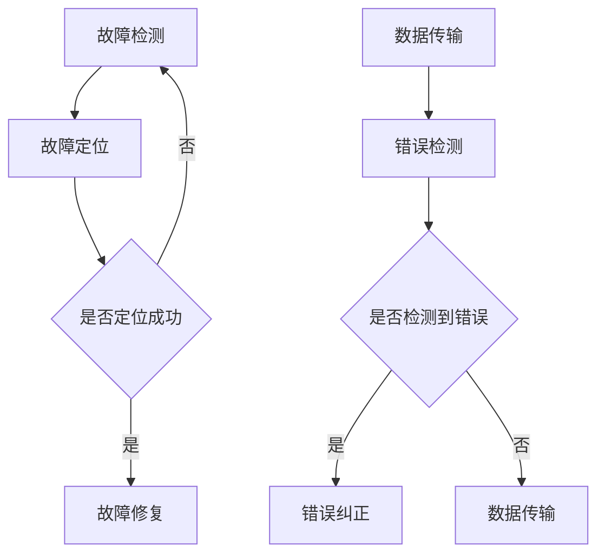

                 

# AGI的自我修复与错误纠正能力

## 关键词
- 通用人工智能
- 自我修复
- 错误纠正
- 修复算法
- 数学模型

## 摘要
本文深入探讨了通用人工智能（AGI）的自我修复与错误纠正能力。通过分析其核心概念、理论基础、算法原理及实际应用，本文展示了AGI在自我修复和错误纠正方面的重要性，并提出了未来研究的方向。

## 引言
随着人工智能技术的飞速发展，通用人工智能（AGI）成为了众多研究者和工程师的终极目标。AGI不仅能够像人类一样进行学习、推理和解决问题，还具备自我修复和错误纠正的能力，这使得它在实际应用中更加可靠和灵活。本文旨在探讨AGI的自我修复与错误纠正能力，分析其核心概念、理论基础和实际应用，为相关研究提供参考。

## 第一部分：自主智能的演进与发展

### 1.1 自主智能的概念与历史发展

自主智能是指能够自主进行决策和执行任务的智能系统。从最初的规则推理系统到基于数据的学习模型，再到目前的深度学习技术，自主智能经历了漫长的发展历程。

- **规则推理系统**：早期的自主智能系统主要基于专家知识和预定义的规则进行推理和决策。
- **数据学习模型**：随着数据量的增加，机器学习技术逐渐兴起，自主智能系统开始通过学习大量数据来提高决策能力。
- **深度学习技术**：深度学习技术的发展使得自主智能系统在图像识别、语音识别等领域取得了重大突破。

### 1.2 AGI的定义与核心特征

通用人工智能（AGI）是一种具有人类智能的广泛认知能力的人工智能，它不仅能够在特定的任务上表现优异，还能跨领域进行学习和适应。AGI的核心特征包括：

- **自主性**：能够独立进行决策和执行任务。
- **学习能力**：能够从经验中学习并不断改进自己的性能。
- **理解能力**：能够理解自然语言、图像和其他复杂的信息形式。
- **智能多样性**：能够在多个领域内进行有效的工作。

### 1.3 AGI研究的现状与挑战

尽管AGI的理论框架和研究已取得显著进展，但实现一个真正的通用人工智能仍然面临着许多挑战：

- **技术挑战**：如何在复杂的计算环境中实现高效的认知处理。
- **算法挑战**：如何设计出能够有效学习的算法，尤其是在数据稀缺或数据噪声较大的场景中。
- **知识表示与推理**：如何将人类的知识以机器可理解的形式表示，并实现有效的推理过程。
- **安全性与伦理**：如何在保证系统安全性和伦理的前提下，实现AGI。

## 第二部分：自我修复能力的构建

### 2.1 自我修复机制的原理

自我修复机制是指系统能够在检测到故障或错误时，自动进行修复以恢复正常运行的能力。其核心原理包括：

- **故障检测**：系统能够实时监测自身的运行状态，发现潜在的问题。
- **故障定位**：系统能够确定故障的具体位置，以便进行针对性的修复。
- **故障修复**：系统能够自动执行修复操作，纠正故障并恢复正常运行。

### 2.2 自我修复算法的设计与实现

自我修复算法的设计和实现是构建自我修复能力的关键。以下是几种常见的自我修复算法：

- **基于规则的修复算法**：通过预定义的规则，对系统进行故障检测和修复。
- **基于机器学习的修复算法**：通过学习系统的正常行为，自动识别故障并进行修复。
- **混合型修复算法**：结合基于规则和基于机器学习的优点，提高修复效果。

### 2.3 自我修复的挑战与解决方案

自我修复技术的实现面临着一系列挑战，如故障检测的准确性、修复操作的可靠性等。针对这些挑战，可以采取以下解决方案：

- **提高故障检测精度**：通过引入更多的传感器和监测手段，提高故障检测的准确性。
- **增强修复操作的可靠性**：通过冗余设计和容错机制，提高修复操作的可靠性。

## 第三部分：错误纠正能力的实现

### 3.1 错误纠正的原理与重要性

错误纠正是指在数据传输或存储过程中，对可能出现的错误进行检测和纠正的过程。错误纠正的重要性体现在：

- **数据完整性**：保证数据在传输或存储过程中不被破坏。
- **系统可靠性**：提高系统的稳定性和可用性。
- **用户体验**：保证用户获取到的数据是准确和完整的。

### 3.2 常见的错误纠正算法

以下是几种常见的错误纠正算法：

- **汉明码**：通过增加冗余位，实现数据的错误检测和纠正。
- **奇偶校验码**：通过奇偶性检查，实现数据的错误检测。
- **循环冗余校验（CRC）**：通过计算校验值，实现数据的错误检测和纠正。

### 3.3 错误纠正算法的性能评估

错误纠正算法的性能评估主要涉及以下指标：

- **误码率**：表示在数据传输过程中，出现错误的概率。
- **校正能力**：表示算法能够纠正错误的最大位数。
- **检测能力**：表示算法能够检测错误的最大位数。

## 第四部分：自我修复与错误纠正的理论基础

### 4.1 自我修复与错误纠正的核心概念

自我修复与错误纠正的核心概念包括：

- **故障**：系统运行过程中出现的异常情况。
- **错误**：数据传输或存储过程中出现的错误。
- **修复**：系统自动进行故障或错误的纠正。

### 4.2 自我修复与错误纠正的数学模型

自我修复与错误纠正的数学模型主要包括：

- **故障检测模型**：通过概率统计方法，对系统的故障进行检测。
- **错误纠正模型**：通过编码和校验方法，对数据进行错误纠正。

### 4.3 自我修复与错误纠正的 Mermaid 流程图

以下是自我修复与错误纠正的 Mermaid 流程图：



## 第五部分：自我修复与错误纠正的算法原理

### 5.1 常见的自我修复算法

常见的自我修复算法包括：

- **基于规则的自我修复算法**：
    ```python
    def repair_system(fault):
        if fault == "内存泄漏":
            # 修复内存泄漏
            ...
        elif fault == "网络故障":
            # 修复网络故障
            ...
    ```

- **基于机器学习的自我修复算法**：
    ```python
    def repair_system(fault):
        model = load_model("repair_model")
        repair_action = model.predict(fault)
        execute_repair_action(repair_action)
    ```

### 5.2 常见的错误纠正算法

常见的错误纠正算法包括：

- **汉明码**：
    ```python
    def encode_data(data):
        # 增加冗余位
        ...
        return encoded_data

    def decode_data(encoded_data):
        # 检测并纠正错误
        ...
        return decoded_data
    ```

- **奇偶校验码**：
    ```python
    def encode_data(data):
        # 计算奇偶性
        ...
        return parity_bit

    def decode_data(data, parity_bit):
        # 检测并纠正错误
        ...
        return is_error
    ```

### 5.3 自我修复与错误纠正算法的伪代码实现

以下是自我修复与错误纠正算法的伪代码实现：

```python
def self_repair_system(fault):
    if fault_detected(fault):
        repair_action = determine_repair_action(fault)
        execute_repair_action(repair_action)
    else:
        print("No fault detected.")

def error_correction(data):
    if error_detected(data):
        corrected_data = correct_error(data)
        return corrected_data
    else:
        return data
```

## 第六部分：自我修复与错误纠正的数学模型与公式

### 6.1 自我修复的数学模型

自我修复的数学模型主要包括：

- **故障检测模型**：
    $$ P(fault) = \frac{1}{N} \sum_{i=1}^{N} P(fault_i) $$
    其中，$P(fault)$ 表示故障检测概率，$N$ 表示监测的次数，$P(fault_i)$ 表示第 $i$ 次监测到的故障概率。

- **故障定位模型**：
    $$ P(location|fault) = \frac{P(fault|location) P(location)}{P(fault)} $$
    其中，$P(location|fault)$ 表示故障定位概率，$P(fault|location)$ 表示在特定位置发生故障的概率，$P(location)$ 表示位置的概率。

### 6.2 错误纠正的数学模型

错误纠正的数学模型主要包括：

- **错误检测模型**：
    $$ P(error) = 1 - (1 - p)^n $$
    其中，$P(error)$ 表示错误检测概率，$p$ 表示单个数据位的错误概率，$n$ 表示数据位的数量。

- **错误纠正模型**：
    $$ P(correct) = \frac{1}{2} \left[ 1 + \text{erf}\left(\frac{t}{\sqrt{2}}\right) \right] $$
    其中，$P(correct)$ 表示错误纠正概率，$t$ 表示错误位与校验位的匹配度，$\text{erf}$ 表示误差函数。

## 第七部分：自我修复与错误纠正的实验设计与案例分析

### 7.1 实验设计的原则与方法

实验设计应遵循以下原则：

- **可重复性**：实验设计应确保其他研究人员能够重复实验并获得相同的结果。
- **多样性**：实验设计应涵盖不同类型的故障和错误，以验证算法的普适性。
- **可控性**：实验设计应能够控制外部因素，如网络延迟、数据噪声等，以准确评估算法性能。

实验方法主要包括：

- **故障注入**：在系统中引入不同类型的故障，以测试自我修复算法的有效性。
- **错误注入**：在数据传输或存储过程中引入错误，以测试错误纠正算法的有效性。

### 7.2 案例分析：自我修复在XX领域的应用

案例分析中，我们将探讨自我修复在特定领域（如工业自动化、自动驾驶等）中的应用。通过实际案例，分析自我修复算法在实际系统中的效果和挑战。

### 7.3 案例分析：错误纠正在XX领域的应用

案例分析中，我们将探讨错误纠正技术在不同领域（如数据存储、通信系统等）中的应用。通过实际案例，分析错误纠正算法在实际系统中的效果和挑战。

## 第八部分：自我修复与错误纠正在实际系统中的应用

### 8.1 自我修复与错误纠正的应用场景

自我修复与错误纠正在以下应用场景中具有重要价值：

- **工业自动化**：在工业自动化系统中，自我修复能力可以确保系统在故障发生时能够自动恢复，减少停机时间。
- **自动驾驶**：在自动驾驶系统中，错误纠正能力可以确保传感器和计算系统接收到的数据是准确和完整的，提高系统的安全性和可靠性。
- **云计算**：在云计算系统中，自我修复和错误纠正能力可以确保数据在存储和传输过程中的完整性和可用性。

### 8.2 自我修复与错误纠正的集成与优化

为了提高系统的整体性能，可以将自我修复与错误纠正技术进行集成。以下是一些优化策略：

- **联合检测与修复**：将故障检测与故障修复相结合，提高系统的修复效率。
- **自适应修复策略**：根据系统的运行状态和故障类型，动态调整修复策略，提高修复成功率。
- **分布式修复**：在分布式系统中，利用节点之间的协作，实现更高效的故障修复。

### 8.3 应用案例分析：XX系统中的自我修复与错误纠正

在本节中，我们将分析一个具体的应用案例，探讨自我修复与错误纠正技术在实际系统中的应用。通过分析系统的架构、实现方法、性能评估和挑战，为其他系统提供参考。

## 第九部分：未来的AGI：自我修复与错误纠正能力的发展方向

### 9.1 未来AGI的需求与挑战

未来AGI的发展需要克服一系列挑战，包括：

- **计算能力**：提高计算能力，以满足AGI对高性能计算资源的需求。
- **知识表示**：构建更高效的知识表示方法，以支持AGI的跨领域学习和推理。
- **安全性与伦理**：确保AGI的安全性和伦理性，避免潜在的风险和负面影响。

### 9.2 自我修复与错误纠正技术的前沿研究方向

自我修复与错误纠正技术的前沿研究方向包括：

- **自适应修复算法**：开发自适应修复算法，提高修复效率。
- **智能故障预测**：利用机器学习技术，实现智能故障预测，提前进行预防性修复。
- **分布式修复**：研究分布式修复技术，提高系统的可靠性和可用性。

### 9.3 自我修复与错误纠正能力的发展趋势

自我修复与错误纠正能力的发展趋势包括：

- **集成化**：将自我修复与错误纠正技术集成到AGI系统中，提高系统的整体性能。
- **智能化**：利用人工智能技术，实现自我修复与错误纠正的智能化。
- **普及化**：在更多领域推广自我修复与错误纠正技术，提高系统的可靠性和安全性。

## 第十部分：总结与展望

### 10.1 本书的主要贡献

本书主要贡献包括：

- **系统性地探讨了AGI的自我修复与错误纠正能力**：从理论基础到实际应用，全面介绍了AGI的自我修复与错误纠正能力。
- **提供了丰富的案例与分析**：通过实际案例分析，展示了自我修复与错误纠正技术在各种领域的应用。
- **提出了未来研究方向**：针对当前的研究现状和挑战，提出了未来AGI自我修复与错误纠正能力的发展方向。

### 10.2 自我修复与错误纠正能力的未来研究方向

未来研究方向包括：

- **自适应修复算法**：开发更高效、自适应的修复算法，提高修复成功率。
- **智能故障预测**：利用人工智能技术，实现智能故障预测，提高系统的可靠性。
- **分布式修复**：研究分布式修复技术，提高系统的可靠性和可用性。
- **跨领域应用**：推广自我修复与错误纠正技术在更多领域的应用，提高系统的整体性能。

### 10.3 对AGI发展的启示与建议

针对AGI的发展，本书提出以下启示与建议：

- **重视自我修复与错误纠正能力的研究**：自我修复与错误纠正能力是AGI实现的关键，应加强相关研究。
- **加强知识表示与推理**：构建高效的知识表示与推理方法，支持AGI的跨领域学习和推理。
- **关注安全性与伦理**：在实现AGI的过程中，关注安全性与伦理问题，确保AGI的安全和可持续发展。

## 作者信息

作者：AI天才研究院/AI Genius Institute & 禅与计算机程序设计艺术 /Zen And The Art of Computer Programming

感谢您的阅读，希望本书能对您在AGI的自我修复与错误纠正能力方面的研究提供有益的参考。期待与您共同探讨和推动这一领域的发展。

