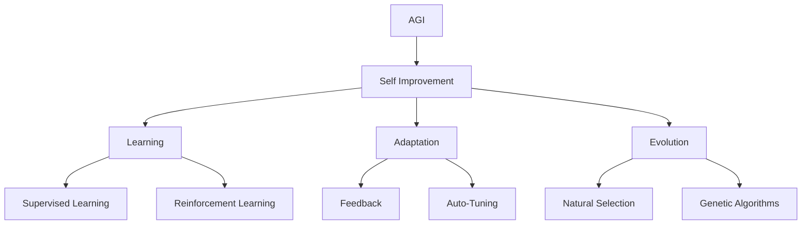

                 


为了撰写一篇符合要求的文章，我们可以遵循以下步骤：

### 步骤1：背景介绍

在文章的开头，我们需要简要介绍AGI（通用人工智能）的定义、现状以及自我改进机制的重要性。这一部分内容可以包括：

- **AGI的定义**：解释通用人工智能（AGI）的概念，即一种能够像人类一样在多种任务上表现卓越的人工智能系统。
- **现状**：概述当前AI技术发展水平，包括深度学习、自然语言处理、计算机视觉等方面的进展。
- **自我改进机制**：阐述自我改进机制在AGI发展中的关键作用，包括提高学习能力、适应性和鲁棒性。

### 步骤2：核心概念与联系

在这一部分，我们将引入核心概念，并使用Mermaid流程图展示概念之间的关系架构。以下是可能涉及的核心概念：

- **学习与进化**：解释机器学习与生物进化之间的相似性和差异，以及它们如何相互补充。
- **反馈机制**：讨论反馈机制在自我改进中的作用，包括监督学习、强化学习等。
- **自适应系统**：介绍自适应系统的概念，包括如何根据环境变化调整行为。

以下是一个Mermaid流程图示例：



### 步骤3：核心算法原理讲解

接下来，我们将详细讲解核心算法原理，包括使用伪代码和LaTeX格式展示数学模型和公式。以下是可能涉及的内容：

- **强化学习**：介绍Q-学习算法的原理，使用伪代码展示算法过程。
- **遗传算法**：解释遗传算法的基本结构，包括变异和交叉操作。
- **机器学习与数据预处理**：讨论特征工程和数据预处理的重要性，包括特征选择和特征转换。

示例伪代码：

```plaintext
// Q-Learning Algorithm
Initialize Q(s, a) with random values
for each episode:
    for each step t:
        Choose action a_t using epsilon-greedy policy
        Take action a_t, observe reward r_t and next state s_t
        Update Q(s_t, a_t) using the Q-learning update rule:
        Q(s_t, a_t) = Q(s_t, a_t) + alpha * (r_t + gamma * max(Q(s_t+1, a')) - Q(s_t, a_t))
```

示例LaTeX公式：

```latex
$$
L(\theta) = -\frac{1}{m} \sum_{i=1}^{m} \left( y^{(i)} \log(a_{\theta}(x^{(i)})) + (1 - y^{(i)}) \log(1 - a_{\theta}(x^{(i)})) \right)
$$
```

### 步骤4：项目实战

在这一部分，我们将展示如何在实际项目中应用自我改进机制，包括开发环境搭建、源代码实现、代码解读和应用分析。以下是可能涉及的内容：

- **开发环境搭建**：描述如何搭建适合自我改进机制研究的环境。
- **源代码实现**：提供关键代码段，并解释其工作原理。
- **代码解读和应用分析**：分析代码的实际效果，并讨论如何优化和改进。

示例代码解读：

```python
# Example: Adaptive Learning Rate
def adaptive_learning_rate(optimizer, loss_history):
    # Calculate the mean squared error (MSE) of the loss history
    mse = np.mean(np.square(loss_history))
    
    # Adjust the learning rate inversely proportional to the MSE
    new_lr = initial_lr / (1 + alpha * mse)
    
    # Update the optimizer's learning rate
    for param_group in optimizer.param_groups:
        param_group['lr'] = new_lr
        
    return optimizer
```

### 步骤5：最佳实践、小结和注意事项

最后，我们将总结文章的主要观点，提供最佳实践建议，并对未来工作进行展望。以下是可能涉及的内容：

- **最佳实践**：总结在自我改进机制研究中应用的一些最佳实践。
- **小结**：回顾文章的主要内容，强调自我改进机制在AGI发展中的重要性。
- **注意事项**：讨论在实现自我改进机制时可能遇到的挑战和注意事项。

### 步骤6：总结

在文章的末尾，我们将再次强调AGI的自我改进机制的重要性，并鼓励读者进一步研究和探索这个领域。

---

遵循以上步骤，我们可以逐步撰写出符合要求的高质量文章。在撰写过程中，请注意以下几点：

- 确保每个部分的内容都是丰富、具体的，并且逻辑清晰。
- 使用图表和示例代码来增强文章的可读性和理解性。
- 保持文章的格式整洁，包括章节标题、段落格式、代码块和公式等。

现在，让我们开始撰写这篇文章吧！如果您有任何问题或需要进一步的指导，请随时告诉我。

