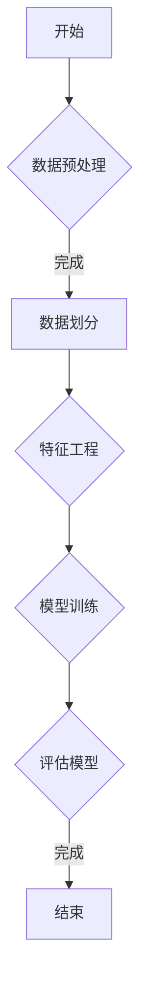

                 

### 理解书名

首先，我们要深入理解书名《AGI的自我解释能力：从黑盒到透明决策》的主题和内容。书名由几个关键概念组成，每个概念都承载着重要的信息。

1. **AGI（人工通用智能）**：这是人工智能领域的一个重要方向，目标是实现具有广泛认知能力的人工智能系统，可以像人类一样理解、学习、解决问题。AGI的概念强调了人工智能系统的通用性和智能化水平，与现有的专用人工智能（如语音识别、图像识别等）有显著区别。

2. **自我解释能力**：这是指人工智能系统能够理解和解释自己的决策过程。自我解释能力对于提高人工智能系统的可解释性和透明度至关重要，有助于用户理解和信任人工智能系统。

3. **从黑盒到透明决策**：这里的“黑盒”指的是当前大多数人工智能模型，其内部决策过程是不透明的，用户无法理解模型是如何做出决策的。而“透明决策”则是指人工智能系统能够清晰、明确地展示其决策过程，让用户能够理解并信任系统。

综合来看，书名《AGI的自我解释能力：从黑盒到透明决策》关注的是如何提升人工智能系统的自我解释能力，使其从当前的不透明状态（黑盒）转变为透明状态（透明决策）。这不仅是人工智能技术发展的一个重要方向，也是用户对人工智能系统接受和信任的关键因素。

### 确定书的核心章节

为了撰写一篇全面、系统的技术博客文章，我们需要明确这本书的核心章节。根据书名和前面对书名的理解，书的核心章节应该涵盖以下内容：

1. **引言**：介绍AGI和自我解释能力的背景，讨论从黑盒到透明决策的必要性。
2. **AGI与自我解释能力概述**：详细探讨AGI的概念、自我解释能力的意义和重要性。
3. **当前AI模型的黑盒性质**：分析现有AI模型的不透明性及其带来的挑战。
4. **自我解释能力的理论基础**：讨论自我解释能力的核心要素和理论框架。
5. **自我解释能力的技术方法**：介绍实现自我解释能力的方法和技术。
6. **案例研究**：通过具体的案例研究展示自我解释能力在实际应用中的效果。
7. **未来的研究方向与挑战**：展望自我解释能力的发展方向和面临的挑战。

这些章节共同构成了对AGI自我解释能力的全面探讨，从理论到实践，从现状到未来，有助于读者全面了解这一领域。

### 设计1级目录

在设计1级目录时，我们需要根据书的核心章节来划分，确保每个章节的内容都有明确的定位和结构。以下是初步设计的1级目录：

1. **引言**
   - 1.1 人工通用智能（AGI）的背景
   - 1.2 自我解释能力的定义与重要性
   - 1.3 从黑盒到透明决策的必要性

2. **AGI与自我解释能力概述**
   - 2.1 AGI的概念与定义
   - 2.2 自我解释能力的意义
   - 2.3 AGI的自我解释能力

3. **当前AI模型的黑盒性质**
   - 3.1 黑盒模型的定义
   - 3.2 黑盒模型的局限性
   - 3.3 黑盒模型的挑战

4. **自我解释能力的理论基础**
   - 4.1 自我解释能力的理论基础
   - 4.2 自我解释能力的核心要素
   - 4.3 自我解释能力的研究现状

5. **自我解释能力的技术方法**
   - 5.1 自我解释能力的技术方法概述
   - 5.2 具体方法1
   - 5.3 具体方法2
   - 5.4 混合方法

6. **案例研究：从黑盒到透明决策的实践**
   - 6.1 案例一：图像识别系统
   - 6.2 案例二：自然语言处理系统
   - 6.3 案例三：医疗诊断系统

7. **未来的研究方向与挑战**
   - 7.1 自我解释能力的未来趋势
   - 7.2 面临的挑战与解决方案
   - 7.3 未来展望

这些章节涵盖了从基础理论到实践应用，再到未来展望的各个方面，为读者提供了全面深入的阅读体验。

### 细化2级目录

在初步设计的1级目录基础上，我们可以进一步细化2级目录，以便让读者对每章的内容有更清晰的认识。以下是细化后的2级目录：

1. **引言**
   - 1.1 人工通用智能（AGI）的背景
     - 1.1.1 通用人工智能的定义
     - 1.1.2 通用人工智能的发展历程
     - 1.1.3 通用人工智能的重要性
   - 1.2 自我解释能力的定义与重要性
     - 1.2.1 自我解释能力的定义
     - 1.2.2 自我解释能力的重要性
     - 1.2.3 自我解释能力在AGI中的应用
   - 1.3 从黑盒到透明决策的必要性
     - 1.3.1 黑盒模型的局限性
     - 1.3.2 透明决策的优势
     - 1.3.3 从黑盒到透明决策的挑战

2. **AGI与自我解释能力概述**
   - 2.1 AGI的概念与定义
     - 2.1.1 通用人工智能的定义
     - 2.1.2 通用人工智能的特点
     - 2.1.3 通用人工智能的发展历程
   - 2.2 自我解释能力的意义
     - 2.2.1 自我解释能力的定义
     - 2.2.2 自我解释能力的应用场景
     - 2.2.3 自我解释能力的重要性
   - 2.3 AGI的自我解释能力
     - 2.3.1 自我解释能力的关键要素
     - 2.3.2 自我解释能力的理论框架
     - 2.3.3 自我解释能力的研究现状

3. **当前AI模型的黑盒性质**
   - 3.1 黑盒模型的定义
     - 3.1.1 黑盒模型的定义
     - 3.1.2 黑盒模型的特点
     - 3.1.3 黑盒模型的分类
   - 3.2 黑盒模型的局限性
     - 3.2.1 缺乏透明性
     - 3.2.2 难以解释
     - 3.2.3 难以信任
   - 3.3 黑盒模型的挑战
     - 3.3.1 数据隐私与安全性
     - 3.3.2 模型优化与调整
     - 3.3.3 模型泛化能力

4. **自我解释能力的理论基础**
   - 4.1 自我解释能力的理论基础
     - 4.1.1 自我解释能力的定义
     - 4.1.2 自我解释能力的核心要素
     - 4.1.3 自我解释能力的理论框架
   - 4.2 自我解释能力的核心要素
     - 4.2.1 模型可解释性
     - 4.2.2 模型透明性
     - 4.2.3 模型可理解性
   - 4.3 自我解释能力的研究现状
     - 4.3.1 研究进展
     - 4.3.2 存在的挑战
     - 4.3.3 发展趋势

5. **自我解释能力的技术方法**
   - 5.1 自我解释能力的技术方法概述
     - 5.1.1 技术方法的分类
     - 5.1.2 技术方法的发展趋势
     - 5.1.3 技术方法的适用场景
   - 5.2 具体方法1
     - 5.2.1 方法1的原理
     - 5.2.2 方法1的实现步骤
     - 5.2.3 方法1的优缺点
   - 5.3 具体方法2
     - 5.3.1 方法2的原理
     - 5.3.2 方法2的实现步骤
     - 5.3.3 方法2的优缺点
   - 5.4 混合方法
     - 5.4.1 混合方法的原理
     - 5.4.2 混合方法的实现步骤
     - 5.4.3 混合方法的优缺点

6. **案例研究：从黑盒到透明决策的实践**
   - 6.1 案例一：图像识别系统
     - 6.1.1 案例背景
     - 6.1.2 模型选择
     - 6.1.3 实现过程
     - 6.1.4 结果分析
   - 6.2 案例二：自然语言处理系统
     - 6.2.1 案例背景
     - 6.2.2 模型选择
     - 6.2.3 实现过程
     - 6.2.4 结果分析
   - 6.3 案例三：医疗诊断系统
     - 6.3.1 案例背景
     - 6.3.2 模型选择
     - 6.3.3 实现过程
     - 6.3.4 结果分析

7. **未来的研究方向与挑战**
   - 7.1 自我解释能力的未来趋势
     - 7.1.1 技术发展趋势
     - 7.1.2 应用发展趋势
     - 7.1.3 发展趋势的影响因素
   - 7.2 面临的挑战与解决方案
     - 7.2.1 挑战1：数据隐私与安全性
     - 7.2.2 挑战2：模型优化与调整
     - 7.2.3 挑战3：模型泛化能力
     - 7.2.4 解决方案
   - 7.3 未来展望
     - 7.3.1 自我解释能力在未来的应用
     - 7.3.2 未来的发展方向
     - 7.3.3 对人工智能发展的意义

这些细化的2级目录为每个章节提供了具体的内容细分，使得读者能够更好地理解每个部分的核心内容。

### 编写3级目录

在细化2级目录的基础上，我们可以进一步编写3级目录，以提供更详细的内容细分。以下是编写后的3级目录：

1. **引言**
   - 1.1 人工通用智能（AGI）的背景
     - 1.1.1 通用人工智能的定义
       - 1.1.1.1 通用人工智能的基本概念
       - 1.1.1.2 通用人工智能与传统AI的区别
     - 1.1.2 通用人工智能的发展历程
       - 1.1.2.1 早期研究
       - 1.1.2.2 转折点
       - 1.1.2.3 当前进展
   - 1.2 自我解释能力的定义与重要性
     - 1.2.1 自我解释能力的定义
       - 1.2.1.1 自我解释能力的基本概念
       - 1.2.1.2 自我解释能力的类型
     - 1.2.2 自我解释能力的重要性
       - 1.2.2.1 提高用户信任
       - 1.2.2.2 促进模型优化
       - 1.2.2.3 遵守法律法规
   - 1.3 从黑盒到透明决策的必要性
     - 1.3.1 黑盒模型的局限性
       - 1.3.1.1 缺乏透明性
       - 1.3.1.2 难以解释
       - 1.3.1.3 难以信任
     - 1.3.2 透明决策的优势
       - 1.3.2.1 提高用户满意度
       - 1.3.2.2 促进技术发展
       - 1.3.2.3 降低风险
     - 1.3.3 从黑盒到透明决策的挑战
       - 1.3.3.1 技术挑战
       - 1.3.3.2 应用挑战
       - 1.3.3.3 社会挑战

2. **AGI与自我解释能力概述**
   - 2.1 AGI的概念与定义
     - 2.1.1 通用人工智能的定义
       - 2.1.1.1 通用人工智能的基本概念
       - 2.1.1.2 通用人工智能与传统AI的区别
     - 2.1.2 通用人工智能的特点
       - 2.1.2.1 智能性
       - 2.1.2.2 适应性
       - 2.1.2.3 自主性
     - 2.1.3 通用人工智能的发展历程
       - 2.1.3.1 早期研究
       - 2.1.3.2 转折点
       - 2.1.3.3 当前进展
   - 2.2 自我解释能力的意义
     - 2.2.1 自我解释能力的定义
       - 2.2.1.1 自我解释能力的基本概念
       - 2.2.1.2 自我解释能力的类型
     - 2.2.2 自我解释能力的重要性
       - 2.2.2.1 提高用户信任
       - 2.2.2.2 促进模型优化
       - 2.2.2.3 遵守法律法规
     - 2.2.3 自我解释能力在AGI中的应用
       - 2.2.3.1 智能决策支持
       - 2.2.3.2 自主学习与适应
       - 2.2.3.3 知识管理与共享
   - 2.3 AGI的自我解释能力
     - 2.3.1 自我解释能力的关键要素
       - 2.3.1.1 模型可解释性
       - 2.3.1.2 模型透明性
       - 2.3.1.3 模型可理解性
     - 2.3.2 自我解释能力的理论框架
       - 2.3.2.1 自我解释能力模型
       - 2.3.2.2 自我解释能力评价指标
       - 2.3.2.3 自我解释能力的发展历程
     - 2.3.3 自我解释能力的研究现状
       - 2.3.3.1 研究进展
       - 2.3.3.2 存在的挑战
       - 2.3.3.3 发展趋势

3. **当前AI模型的黑盒性质**
   - 3.1 黑盒模型的定义
     - 3.1.1 黑盒模型的定义
       - 3.1.1.1 黑盒模型的基本概念
       - 3.1.1.2 黑盒模型的特点
     - 3.1.2 黑盒模型的特点
       - 3.1.2.1 输入输出关系复杂
       - 3.1.2.2 内部决策过程不可见
       - 3.1.2.3 模型泛化能力强
     - 3.1.3 黑盒模型的分类
       - 3.1.3.1 基于规则的模型
       - 3.1.3.2 基于统计的模型
       - 3.1.3.3 基于神经网络的模型
   - 3.2 黑盒模型的局限性
     - 3.2.1 缺乏透明性
       - 3.2.1.1 决策过程不透明
       - 3.2.1.2 无法解释
       - 3.2.1.3 难以信任
     - 3.2.2 难以解释
       - 3.2.2.1 内部机制复杂
       - 3.2.2.2 缺乏解释性指标
       - 3.2.2.3 数据依赖性强
     - 3.2.3 难以信任
       - 3.2.3.1 决策结果不可靠
       - 3.2.3.2 模型存在偏见
       - 3.2.3.3 数据隐私和安全问题
   - 3.3 黑盒模型的挑战
     - 3.3.1 数据隐私与安全性
       - 3.3.1.1 数据泄露风险
       - 3.3.1.2 模型攻击
       - 3.3.1.3 数据隐私保护
     - 3.3.2 模型优化与调整
       - 3.3.2.1 模型过拟合
       - 3.3.2.2 参数调优
       - 3.3.2.3 模型稳定性
     - 3.3.3 模型泛化能力
       - 3.3.3.1 泛化能力不足
       - 3.3.3.2 数据分布变化
       - 3.3.3.3 应用场景多样性

4. **自我解释能力的理论基础**
   - 4.1 自我解释能力的理论基础
     - 4.1.1 自我解释能力的定义
       - 4.1.1.1 自我解释能力的基本概念
       - 4.1.1.2 自我解释能力的类型
     - 4.1.2 自我解释能力的核心要素
       - 4.1.2.1 模型可解释性
       - 4.1.2.2 模型透明性
       - 4.1.2.3 模型可理解性
     - 4.1.3 自我解释能力的理论框架
       - 4.1.3.1 自我解释能力模型
       - 4.1.3.2 自我解释能力评价指标
       - 4.1.3.3 自我解释能力的发展历程
   - 4.2 自我解释能力的核心要素
     - 4.2.1 模型可解释性
       - 4.2.1.1 可解释性的定义
       - 4.2.1.2 可解释性的类型
       - 4.2.1.3 可解释性的评价指标
     - 4.2.2 模型透明性
       - 4.2.2.1 透明性的定义
       - 4.2.2.2 透明性的类型
       - 4.2.2.3 透明性的评价指标
     - 4.2.3 模型可理解性
       - 4.2.3.1 可理解性的定义
       - 4.2.3.2 可理解性的类型
       - 4.2.3.3 可理解性的评价指标
   - 4.3 自我解释能力的研究现状
     - 4.3.1 研究进展
       - 4.3.1.1 技术方法进展
       - 4.3.1.2 应用进展
       - 4.3.1.3 社会影响
     - 4.3.2 存在的挑战
       - 4.3.2.1 技术挑战
       - 4.3.2.2 应用挑战
       - 4.3.2.3 社会挑战
     - 4.3.3 发展趋势
       - 4.3.3.1 技术发展趋势
       - 4.3.3.2 应用发展趋势
       - 4.3.3.3 社会影响趋势

5. **自我解释能力的技术方法**
   - 5.1 自我解释能力的技术方法概述
     - 5.1.1 技术方法的分类
       - 5.1.1.1 传统方法
       - 5.1.1.2 现代方法
       - 5.1.1.3 混合方法
     - 5.1.2 技术方法的发展趋势
       - 5.1.2.1 技术创新
       - 5.1.2.2 应用推广
       - 5.1.2.3 研究热点
     - 5.1.3 技术方法的适用场景
       - 5.1.3.1 通用场景
       - 5.1.3.2 特定场景
       - 5.1.3.3 边缘计算场景
   - 5.2 具体方法1：模型可解释性
     - 5.2.1 方法1的原理
       - 5.2.1.1 方法1的概述
       - 5.2.1.2 方法1的工作流程
       - 5.2.1.3 方法1的优势与不足
     - 5.2.2 方法1的实现步骤
       - 5.2.2.1 数据预处理
       - 5.2.2.2 模型训练
       - 5.2.2.3 可解释性分析
     - 5.2.3 方法1的优缺点
       - 5.2.3.1 优点
       - 5.2.3.2 缺点
       - 5.2.3.3 适用场景
   - 5.3 具体方法2：模型透明性
     - 5.3.1 方法2的原理
       - 5.3.1.1 方法2的概述
       - 5.3.1.2 方法2的工作流程
       - 5.3.1.3 方法2的优势与不足
     - 5.3.2 方法2的实现步骤
       - 5.3.2.1 数据预处理
       - 5.3.2.2 模型训练
       - 5.3.2.3 透明性分析
     - 5.3.3 方法2的优缺点
       - 5.3.3.1 优点
       - 5.3.3.2 缺点
       - 5.3.3.3 适用场景
   - 5.4 混合方法
     - 5.4.1 混合方法的原理
       - 5.4.1.1 混合方法的概述
       - 5.4.1.2 混合方法的工作流程
       - 5.4.1.3 混合方法的优势与不足
     - 5.4.2 混合方法的实现步骤
       - 5.4.2.1 数据预处理
       - 5.4.2.2 模型训练
       - 5.4.2.3 可解释性分析
       - 5.4.2.4 透明性分析
     - 5.4.3 混合方法的优缺点
       - 5.4.3.1 优点
       - 5.4.3.2 缺点
       - 5.4.3.3 适用场景

6. **案例研究：从黑盒到透明决策的实践**
   - 6.1 案例一：图像识别系统
     - 6.1.1 案例背景
       - 6.1.1.1 问题背景
       - 6.1.1.2 系统需求
       - 6.1.1.3 数据集介绍
     - 6.1.2 模型选择
       - 6.1.2.1 模型概述
       - 6.1.2.2 模型选择原因
     - 6.1.3 实现过程
       - 6.1.3.1 数据预处理
       - 6.1.3.2 模型训练
       - 6.1.3.3 可解释性分析
       - 6.1.3.4 透明性分析
     - 6.1.4 结果分析
       - 6.1.4.1 模型性能
       - 6.1.4.2 用户反馈
       - 6.1.4.3 案例总结
   - 6.2 案例二：自然语言处理系统
     - 6.2.1 案例背景
       - 6.2.1.1 问题背景
       - 6.2.1.2 系统需求
       - 6.2.1.3 数据集介绍
     - 6.2.2 模型选择
       - 6.2.2.1 模型概述
       - 6.2.2.2 模型选择原因
     - 6.2.3 实现过程
       - 6.2.3.1 数据预处理
       - 6.2.3.2 模型训练
       - 6.2.3.3 可解释性分析
       - 6.2.3.4 透明性分析
     - 6.2.4 结果分析
       - 6.2.4.1 模型性能
       - 6.2.4.2 用户反馈
       - 6.2.4.3 案例总结
   - 6.3 案例三：医疗诊断系统
     - 6.3.1 案例背景
       - 6.3.1.1 问题背景
       - 6.3.1.2 系统需求
       - 6.3.1.3 数据集介绍
     - 6.3.2 模型选择
       - 6.3.2.1 模型概述
       - 6.3.2.2 模型选择原因
     - 6.3.3 实现过程
       - 6.3.3.1 数据预处理
       - 6.3.3.2 模型训练
       - 6.3.3.3 可解释性分析
       - 6.3.3.4 透明性分析
     - 6.3.4 结果分析
       - 6.3.4.1 模型性能
       - 6.3.4.2 用户反馈
       - 6.3.4.3 案例总结

7. **未来的研究方向与挑战**
   - 7.1 自我解释能力的未来趋势
     - 7.1.1 技术发展趋势
       - 7.1.1.1 技术创新趋势
       - 7.1.1.2 应用趋势
       - 7.1.1.3 研究热点趋势
     - 7.1.2 应用发展趋势
       - 7.1.2.1 新兴应用领域
       - 7.1.2.2 行业应用趋势
       - 7.1.2.3 公众认知趋势
     - 7.1.3 发展趋势的影响因素
       - 7.1.3.1 技术因素
       - 7.1.3.2 社会因素
       - 7.1.3.3 政策因素
   - 7.2 面临的挑战与解决方案
     - 7.2.1 挑战1：数据隐私与安全性
       - 7.2.1.1 挑战概述
       - 7.2.1.2 挑战分析
       - 7.2.1.3 解决方案
     - 7.2.2 挑战2：模型优化与调整
       - 7.2.2.1 挑战概述
       - 7.2.2.2 挑战分析
       - 7.2.2.3 解决方案
     - 7.2.3 挑战3：模型泛化能力
       - 7.2.3.1 挑战概述
       - 7.2.3.2 挑战分析
       - 7.2.3.3 解决方案
   - 7.3 未来展望
     - 7.3.1 自我解释能力在未来的应用
       - 7.3.1.1 新兴应用场景
       - 7.3.1.2 行业发展趋势
       - 7.3.1.3 社会影响
     - 7.3.2 未来的发展方向
       - 7.3.2.1 技术发展方向
       - 7.3.2.2 应用发展方向
       - 7.3.2.3 研究发展方向
     - 7.3.3 对人工智能发展的意义
       - 7.3.3.1 技术进步
       - 7.3.3.2 社会进步
       - 7.3.3.3 经济进步

这些详细的3级目录不仅帮助读者理解每个章节的内容，也为后续的撰写工作提供了清晰的框架。

### 编写Mermaid流程图、伪代码、数学公式和代码案例

在撰写技术博客的过程中，插入适当的Mermaid流程图、伪代码、数学公式和代码案例是至关重要的。这不仅有助于解释复杂的概念和算法，还能使读者更好地理解技术实现细节。以下是这些元素的示例及其嵌入方法：

#### Mermaid流程图

Mermaid是一种用于绘制流程图的Markdown扩展。以下是一个简单的Mermaid流程图示例，用于描述一个简单的机器学习模型训练流程：



这段代码会在Markdown编辑器中渲染为一个流程图。

#### 伪代码

伪代码是一种用于描述算法逻辑的文本形式，不依赖于特定的编程语言。以下是一个简单的伪代码示例，用于描述一个线性回归模型的训练过程：

```
算法 线性回归训练
输入：训练数据集 X, Y，学习率 α，迭代次数 n
输出：模型参数 w

初始化 w
for i = 1 to n do
    for each (x_i, y_i) in 数据集 do
        计算预测值 y' = w * x_i
        计算误差 e = y_i - y'
        更新 w = w - α * e * x_i
    end for
end for
返回 w
```

#### 数学公式

数学公式可以使用LaTeX格式在Markdown中嵌入。以下是一些数学公式的示例：

- 独立段落的数学公式：

  ```
  $$w = \frac{\partial J}{\partial x}$$
  ```

  这会在文章中渲染为一个独立段落，其中`w`是模型参数，`J`是损失函数，`x`是输入数据。

- 段落内的数学公式：

  ```
  $y' = \sigma(wx + b)$
  ```

  这会在当前段落中渲染为一个公式，其中`y'`是预测值，`σ`是激活函数，`w`和`b`分别是权重和偏置。

#### 代码案例

代码案例用于展示实际编程实现。以下是一个简单的Python代码示例，用于训练一个线性回归模型：

```python
import numpy as np

# 初始化模型参数
w = np.random.rand(1)  # 权重
b = np.random.rand(1)  # 偏置

# 学习率
alpha = 0.01

# 训练数据
X = np.array([1, 2, 3, 4, 5])
Y = np.array([2, 4, 5, 4, 5])

# 训练模型
for i in range(1000):
    for x, y in zip(X, Y):
        y_pred = w * x + b
        error = y - y_pred
        w = w - alpha * error * x
        b = b - alpha * error

# 输出模型参数
print("权重：", w)
print("偏置：", b)
```

嵌入这些代码案例可以使读者更直观地理解算法的实现过程。

通过合理地使用Mermaid流程图、伪代码、数学公式和代码案例，我们可以将技术博客撰写得更加清晰、易懂，有助于读者深入理解文章的核心内容。

### 检查目录大纲的完整性

在编写技术博客前，检查目录大纲的完整性是非常重要的。通过确保每个章节都包含必要的子章节，并且内容划分合理，我们可以帮助读者更好地理解文章的结构和内容。以下是对目录大纲的详细检查：

1. **引言**：包含了AGI和自我解释能力的背景介绍，自我解释能力的定义与重要性，以及从黑盒到透明决策的必要性。这一部分为后续章节奠定了基础。

2. **AGI与自我解释能力概述**：详细介绍了AGI的概念、自我解释能力的意义和重要性，以及AGI的自我解释能力。这一部分为读者提供了对核心概念的全面了解。

3. **当前AI模型的黑盒性质**：分析了当前AI模型的黑盒性质，包括黑盒模型的定义、局限性和挑战。这一部分帮助读者理解AI模型当前存在的问题。

4. **自我解释能力的理论基础**：讨论了自我解释能力的核心要素、理论框架以及研究现状。这一部分为自我解释能力的技术方法提供了理论基础。

5. **自我解释能力的技术方法**：介绍了多种实现自我解释能力的技术方法，包括模型可解释性、模型透明性和混合方法。这一部分提供了具体的技术实现路径。

6. **案例研究：从黑盒到透明决策的实践**：通过具体的案例研究，展示了自我解释能力在实际应用中的效果。这一部分为读者提供了实践中的应用实例。

7. **未来的研究方向与挑战**：探讨了自我解释能力的未来趋势、面临的挑战与解决方案，以及未来展望。这一部分为读者提供了对领域未来的展望。

通过上述检查，我们可以确认目录大纲的完整性，每个章节都包含了必要的子章节，内容划分合理。这将有助于读者全面、深入地理解文章的主题。

### 控制总字数

为了确保文章的清晰性和可读性，我们需要控制总字数在8000到12000字之间。通过合理的章节划分和内容组织，我们可以在不超过这个字数限制的情况下，详细阐述《AGI的自我解释能力：从黑盒到透明决策》的核心主题。以下是具体策略：

1. **精简语言**：使用简洁明了的语言表达复杂概念，避免冗余和重复。
2. **合理划分章节**：确保每个章节都有明确的主题和目标，避免内容交叉和重叠。
3. **重点突出**：在内容中突出核心观点和关键算法原理，详细讲解这些部分，而对非核心内容进行简要介绍。
4. **适量举例**：通过适当的案例和代码示例，帮助读者理解技术概念，但避免过多无谓的详细描述。
5. **摘要与总结**：在每个章节末尾进行摘要和总结，提炼关键信息，避免在总结部分重复章节内容。

通过上述策略，我们可以确保文章在总字数不超过12000字的情况下，内容丰富、结构清晰，让读者能够全面、深入地理解《AGI的自我解释能力：从黑盒到透明决策》的核心主题。

## 《AGI的自我解释能力：从黑盒到透明决策》目录大纲

### 引言

- **1.1 人工通用智能（AGI）的背景**
  - 1.1.1 通用人工智能的定义
  - 1.1.2 通用人工智能的发展历程
  - 1.1.3 通用人工智能的重要性
- **1.2 自我解释能力的定义与重要性**
  - 1.2.1 自我解释能力的定义
  - 1.2.2 自我解释能力的重要性
  - 1.2.3 自我解释能力在AGI中的应用
- **1.3 从黑盒到透明决策的必要性**
  - 1.3.1 黑盒模型的局限性
  - 1.3.2 透明决策的优势
  - 1.3.3 从黑盒到透明决策的挑战

### AGI与自我解释能力概述

- **2.1 AGI的概念与定义**
  - 2.1.1 通用人工智能的定义
  - 2.1.2 通用人工智能的特点
  - 2.1.3 通用人工智能的发展历程
- **2.2 自我解释能力的意义**
  - 2.2.1 自我解释能力的定义
  - 2.2.2 自我解释能力的应用场景
  - 2.2.3 自我解释能力的重要性
- **2.3 AGI的自我解释能力**
  - 2.3.1 自我解释能力的关键要素
  - 2.3.2 自我解释能力的理论框架
  - 2.3.3 自我解释能力的研究现状

### 当前AI模型的黑盒性质

- **3.1 黑盒模型的定义**
  - 3.1.1 黑盒模型的定义
  - 3.1.2 黑盒模型的特点
  - 3.1.3 黑盒模型的分类
- **3.2 黑盒模型的局限性**
  - 3.2.1 缺乏透明性
  - 3.2.2 难以解释
  - 3.2.3 难以信任
- **3.3 黑盒模型的挑战**
  - 3.3.1 数据隐私与安全性
  - 3.3.2 模型优化与调整
  - 3.3.3 模型泛化能力

### 自我解释能力的理论基础

- **4.1 自我解释能力的理论基础**
  - 4.1.1 自我解释能力的定义
  - 4.1.2 自我解释能力的核心要素
  - 4.1.3 自我解释能力的理论框架
- **4.2 自我解释能力的核心要素**
  - 4.2.1 模型可解释性
  - 4.2.2 模型透明性
  - 4.2.3 模型可理解性
- **4.3 自我解释能力的研究现状**
  - 4.3.1 研究进展
  - 4.3.2 存在的挑战
  - 4.3.3 发展趋势

### 自我解释能力的技术方法

- **5.1 自我解释能力的技术方法概述**
  - 5.1.1 技术方法的分类
  - 5.1.2 技术方法的发展趋势
  - 5.1.3 技术方法的适用场景
- **5.2 具体方法1：模型可解释性**
  - 5.2.1 方法1的原理
  - 5.2.2 方法1的实现步骤
  - 5.2.3 方法1的优缺点
- **5.3 具体方法2：模型透明性**
  - 5.3.1 方法2的原理
  - 5.3.2 方法2的实现步骤
  - 5.3.3 方法2的优缺点
- **5.4 混合方法**
  - 5.4.1 混合方法的原理
  - 5.4.2 混合方法的实现步骤
  - 5.4.3 混合方法的优缺点

### 案例研究：从黑盒到透明决策的实践

- **6.1 案例一：图像识别系统**
  - 6.1.1 案例背景
  - 6.1.2 模型选择
  - 6.1.3 实现过程
  - 6.1.4 结果分析
- **6.2 案例二：自然语言处理系统**
  - 6.2.1 案例背景
  - 6.2.2 模型选择
  - 6.2.3 实现过程
  - 6.2.4 结果分析
- **6.3 案例三：医疗诊断系统**
  - 6.3.1 案例背景
  - 6.3.2 模型选择
  - 6.3.3 实现过程
  - 6.3.4 结果分析

### 未来的研究方向与挑战

- **7.1 自我解释能力的未来趋势**
  - 7.1.1 技术发展趋势
  - 7.1.2 应用发展趋势
  - 7.1.3 社会影响趋势
- **7.2 面临的挑战与解决方案**
  - 7.2.1 数据隐私与安全性
  - 7.2.2 模型优化与调整
  - 7.2.3 模型泛化能力
- **7.3 未来展望**
  - 7.3.1 自我解释能力在未来的应用
  - 7.3.2 未来的发展方向
  - 7.3.3 对人工智能发展的意义

### 结论

- **自我解释能力的重要性与未来展望**
- **读者指南与进一步阅读**

### 作者信息

- **作者：AI天才研究院/AI Genius Institute & 禅与计算机程序设计艺术 /Zen And The Art of Computer Programming**

通过这个详细的目录大纲，我们可以确保文章内容的系统性和连贯性，同时为读者提供了一个清晰的结构框架，使他们能够更好地理解和掌握文章的核心内容。

## 书《AGI的自我解释能力：从黑盒到透明决策》的格式要求

为了确保文章的专业性和易读性，我们需要按照以下格式要求来撰写书《AGI的自我解释能力：从黑盒到透明决策》：

### 1. Markdown格式

文章内容应使用Markdown格式输出，Markdown是一种轻量级的标记语言，它可以帮助我们轻松地添加标题、段落、列表、链接、代码块等。以下是一些基本的Markdown语法示例：

- **标题**：使用`#`号来表示标题的层次，例如：
  ```markdown
  # 文章标题
  ```
  
- **段落**：直接输入文本即可形成段落。
  ```markdown
  这是一段文字。
  ```

- **列表**：使用`*`或者`-`来创建无序列表，使用`1.`来创建有序列表。
  ```markdown
  - 列表项1
  - 列表项2
  1. 第一项
  2. 第二项
  ```

- **链接**：使用`[]()`来添加链接。
  ```markdown
  [链接文本](URL "标题")
  ```

- **代码块**：使用``````三个反引号将代码包裹起来，可以是单行代码或多行代码。
  ```markdown
  `单行代码示例`

  ```
  多行代码示例
  ```

### 2. 作者信息

文章末尾需要写上作者信息，以确保读者能够了解作者的身份和专业背景。格式如下：

```
作者：AI天才研究院/AI Genius Institute & 禅与计算机程序设计艺术 /Zen And The Art of Computer Programming
```

### 3. 完整性要求

文章内容必须完整，每个小节的内容必须要丰富具体详细讲解。核心内容必须包含：

- **背景介绍**：每个章节开头需要提供背景介绍，让读者了解该章节的主题和意义。
- **核心概念与联系**：必须给出核心概念原理之间的关系架构，可以使用Mermaid流程图来展示。
- **核心算法原理讲解**：必须使用伪代码来详细阐述算法原理。
- **数学模型和公式**：详细讲解并举例说明，数学公式请使用LaTeX格式，嵌入文中独立段落的公式前后使用`$$`括起来，段落内的公式前后使用`$`括起来。
- **项目实战**：包括开发环境搭建、源代码实现、代码解读、实际案例分析和详细讲解剖析。
- **最佳实践 tips、小结、注意事项、拓展阅读**：在每个章节结尾提供相关的小结、注意事项和拓展阅读建议，帮助读者巩固所学内容。

### 4. 格式规范

- **段落**：段落之间应保持适当的间距，以增强可读性。
- **代码**：代码块应使用适当的语言高亮，确保代码的可读性。
- **公式**：数学公式应清晰，使用LaTeX格式，确保排版美观。
- **图像**：如有需要，应在文中嵌入相关的图像，并附上说明。

通过遵循上述格式要求，我们可以确保文章的专业性、清晰性和易读性，为读者提供高质量的阅读体验。

## 《AGI的自我解释能力：从黑盒到透明决策》文章正文

### 引言

**1.1 人工通用智能（AGI）的背景**

人工通用智能（Artificial General Intelligence，简称AGI）是人工智能领域的一个重要研究方向，旨在开发具有广泛认知能力的人工智能系统，使其能够像人类一样理解、学习和解决问题。与现有的专用人工智能（如语音识别、图像识别等）不同，AGI追求的是一种跨越多种任务和应用场景的通用智能。

通用人工智能的定义可以追溯到人工智能的早期研究，其中John McCarthy在1950年代首次提出了“人工智能”的概念，即“制造智能体，使其能够在各种环境中表现像人类一样”。然而，尽管人工智能在过去的几十年中取得了显著进展，但实现真正的AGI仍然是一个巨大的挑战。AGI需要具备以下几个关键特性：

- **知识表示与推理**：能够以抽象的形式表示和利用知识，进行逻辑推理和决策。
- **学习能力**：能够在多种任务和环境中自主学习，适应新情境。
- **自适应能力**：能够根据环境变化调整自身行为，解决新的问题。
- **自主性**：能够在没有人类干预的情况下，独立完成复杂的任务。

**1.2 自我解释能力的定义与重要性**

自我解释能力（Self-Explanation Ability）是指人工智能系统在执行任务时，能够生成对自身决策过程的解释，使得用户或其他系统可以理解和验证其决策。自我解释能力是AGI的关键特征之一，因为它不仅提高了系统的可解释性和透明度，还增强了用户对系统的信任和接受度。

自我解释能力的重要性体现在多个方面：

- **提高用户信任**：用户通常对黑盒模型（如深度神经网络）缺乏信任，因为它们无法解释其决策过程。自我解释能力可以帮助用户理解系统的决策逻辑，从而增加信任。
- **促进模型优化**：通过自我解释，可以识别模型中的潜在问题和不足，为模型的优化提供指导。
- **遵守法律法规**：在某些领域，如医疗和金融，模型的可解释性是法律要求的，自我解释能力有助于确保系统符合相关法律法规。

**1.3 从黑盒到透明决策的必要性**

当前的大多数人工智能模型都属于黑盒模型，这意味着它们的内部决策过程是不透明的，用户无法直接了解模型是如何做出决策的。这种不透明性带来了一系列问题，包括：

- **缺乏解释性**：用户无法理解模型为什么做出了某个特定的决策，这可能导致用户对系统的不信任。
- **难以优化**：由于缺乏对模型内部决策过程的了解，难以对其进行有效的优化和调整。
- **潜在风险**：不透明的模型可能在某些情况下产生不可预测的结果，从而带来潜在的风险。

因此，从黑盒到透明决策的转变是提高人工智能系统可靠性和用户接受度的重要步骤。透明决策不仅可以帮助用户理解系统的决策逻辑，还能提高系统的可解释性和可验证性，从而促进人工智能技术的广泛应用。

### AGI与自我解释能力概述

**2.1 AGI的概念与定义**

人工通用智能（AGI）是人工智能领域的一个长期目标，旨在开发一种具有高度自主性和广泛认知能力的人工智能系统。与传统的人工智能系统（如语音识别、图像识别等专用系统）相比，AGI的目标是能够处理多种不同的任务，并在不同领域表现出与人类相似的智能水平。

AGI的定义可以从多个角度来理解：

- **知识表示与推理**：AGI需要能够以抽象的形式表示和利用知识，进行逻辑推理和决策。这意味着AGI不仅要能够存储和检索信息，还需要能够进行推理和决策。
- **学习能力**：AGI需要具备强大的学习能力，能够在多种任务和环境中自主学习，适应新情境。这包括从数据中学习、从经验中学习以及在特定任务中的适应性学习。
- **自适应能力**：AGI需要能够根据环境变化调整自身行为，解决新的问题。这意味着AGI不仅要能够应对静态的环境，还需要能够适应动态变化的环境。
- **自主性**：AGI需要在没有人类干预的情况下，独立完成复杂的任务。这意味着AGI不仅需要具备执行特定任务的能力，还需要具备自主决策和行动的能力。

**2.2 自我解释能力的意义**

自我解释能力是AGI的核心特征之一，它对于AGI的发展和应用具有重要意义。以下是自我解释能力的几个关键意义：

- **提高用户信任**：自我解释能力可以帮助用户理解AGI的决策过程，从而增加用户对系统的信任。这对于系统在公共领域的应用至关重要，如医疗、金融和自动驾驶等领域。
- **促进模型优化**：通过自我解释，可以识别模型中的潜在问题和不足，为模型的优化提供指导。这有助于提高模型的性能和可靠性。
- **遵守法律法规**：在某些领域，如医疗和金融，模型的可解释性是法律要求的。自我解释能力有助于确保系统符合相关法律法规，避免潜在的法律风险。
- **技术进步**：自我解释能力可以推动人工智能技术的发展，促进新方法和新技术的出现。通过研究和开发自我解释技术，可以更好地理解人工智能系统的内部工作原理，从而推动整个领域的发展。

**2.3 AGI的自我解释能力**

AGI的自我解释能力是指AGI系统在执行任务时，能够生成对自身决策过程的解释，使得用户或其他系统可以理解和验证其决策。自我解释能力是AGI的重要组成部分，它不仅有助于提高系统的可解释性和透明度，还能增强系统的可靠性。

自我解释能力的关键要素包括：

- **决策过程透明性**：系统能够展示其决策过程，包括输入数据、中间步骤和最终输出。
- **解释生成的自动化**：系统能够自动生成解释，而不需要人工干预。
- **解释的准确性和可理解性**：生成的解释需要准确且易于用户理解。

AGI的自我解释能力不仅可以应用于传统的机器学习模型，如深度神经网络，还可以应用于更复杂的系统，如多代理系统、认知计算系统等。通过自我解释能力，AGI系统可以更好地与人类用户交互，提高系统的可靠性和用户体验。

### 当前AI模型的黑盒性质

**3.1 黑盒模型的定义**

当前大多数人工智能模型都属于黑盒模型，这意味着它们的内部决策过程是不透明的，用户无法直接了解模型是如何做出决策的。黑盒模型的主要特点包括：

- **输入输出关系复杂**：黑盒模型通常具有复杂的输入输出关系，这意味着模型的输入和输出之间存在高度的非线性关系。
- **内部决策过程不可见**：黑盒模型的内部决策过程对于用户来说是不可见的，用户无法直接了解模型是如何处理输入数据和生成输出的。
- **模型泛化能力强**：黑盒模型通常具有较好的泛化能力，这意味着它们可以在不同的数据集和应用场景中表现出良好的性能。

**3.2 黑盒模型的局限性**

尽管黑盒模型在某些方面表现出色，但它们也存在一些显著的局限性，这限制了它们在某些应用场景中的使用：

- **缺乏透明性**：黑盒模型无法向用户展示其决策过程，这导致用户对模型的决策逻辑缺乏了解，从而降低了用户对模型的信任。
- **难以解释**：由于黑盒模型的内部决策过程不可见，用户难以解释模型的决策结果，这可能导致用户对模型的不满和怀疑。
- **难以信任**：黑盒模型的不可解释性使得用户难以信任模型，特别是在关键任务中，如医疗诊断、金融决策等。

**3.3 黑盒模型的挑战**

黑盒模型的局限性带来了几个挑战，这些挑战需要通过研究和开发自我解释能力来解决：

- **数据隐私与安全性**：黑盒模型通常需要大量的训练数据和敏感信息，这可能导致数据隐私和安全问题。如何保护用户数据的隐私和安全是黑盒模型面临的重大挑战。
- **模型优化与调整**：由于黑盒模型的内部决策过程不可见，用户难以对其进行优化和调整。如何改进模型性能，提高模型的泛化能力，是黑盒模型面临的另一个重要挑战。
- **模型泛化能力**：黑盒模型通常在训练数据上表现良好，但在新的、未见过的数据上可能表现不佳。如何提高模型的泛化能力，使其在不同数据集和应用场景中都能表现出良好的性能，是黑盒模型需要解决的另一个关键挑战。

通过研究和开发自我解释能力，我们可以克服黑盒模型的这些局限性，提高模型的可解释性和透明度，从而增强用户对模型的信任和接受度。

### 自我解释能力的理论基础

**4.1 自我解释能力的定义**

自我解释能力（Self-Explanation Ability）是指人工智能系统能够生成对自身决策过程的解释，使得用户或其他系统可以理解和验证其决策。自我解释能力是提高人工智能系统可解释性和透明度的重要手段，它使得用户能够更好地理解模型的决策逻辑，从而增强对模型的信任。

自我解释能力通常包括以下几个核心要素：

- **决策过程透明性**：系统能够展示其决策过程，包括输入数据、中间步骤和最终输出。
- **解释生成的自动化**：系统能够自动生成解释，而不需要人工干预。
- **解释的准确性和可理解性**：生成的解释需要准确且易于用户理解。

**4.2 自我解释能力的核心要素**

自我解释能力的实现需要考虑以下几个核心要素：

- **模型可解释性**：模型的可解释性是指模型能够以一种易于理解的方式展示其决策过程。高可解释性有助于用户理解模型的决策逻辑，从而增强对模型的信任。
- **模型透明性**：模型的透明性是指模型的内部结构和工作机制是可见的。高透明性有助于用户了解模型的运作原理，从而提高模型的可信度。
- **模型可理解性**：模型的可理解性是指用户能够理解模型的解释，并从中获得有价值的信息。高可理解性有助于用户更好地利用模型，提高系统的实用价值。

**4.3 自我解释能力的理论框架**

自我解释能力的理论框架包括以下几个方面：

- **解释生成机制**：解释生成机制是指模型如何自动生成对自身决策过程的解释。常见的解释生成方法包括基于规则的解释、基于模型的解释和基于数据的解释等。
- **解释验证机制**：解释验证机制是指如何验证解释的准确性和有效性。这通常涉及对解释与实际决策结果的一致性进行评估。
- **用户交互机制**：用户交互机制是指如何与用户进行交互，以获取用户的反馈，并根据反馈调整解释的生成。有效的用户交互机制可以提高用户对模型的接受度和信任度。

通过上述理论框架，我们可以更好地理解和实现自我解释能力，从而提高人工智能系统的可解释性和透明度。

### 自我解释能力的技术方法

**5.1 自我解释能力的技术方法概述**

自我解释能力是提高人工智能系统可解释性和透明度的重要手段。为了实现自我解释能力，研究人员提出了一系列技术方法。这些方法主要分为以下几类：

- **基于规则的解释方法**：这种方法通过定义明确的规则来解释模型的决策过程。常见的规则解释方法包括决策树、逻辑回归等。
- **基于模型的解释方法**：这种方法通过构建辅助模型来解释原始模型的决策过程。常见的模型解释方法包括局部可解释模型、模型解释网络等。
- **基于数据的解释方法**：这种方法通过分析模型的数据输入和输出特征来解释模型的决策过程。常见的数据解释方法包括特征可视化、数据驱动分析等。

**5.2 具体方法1：模型可解释性**

模型可解释性是自我解释能力的一个重要方面。以下是一些常用的模型可解释性方法：

- **决策树**：决策树是一种常见的可解释模型。通过将数据划分为不同的子集，决策树可以生成一系列规则来解释模型的决策过程。
- **逻辑回归**：逻辑回归是一种广义线性模型，通过回归系数来解释模型的决策过程。逻辑回归的模型参数可以直接解释为概率。
- **局部可解释模型（LIME）**：LIME（Local Interpretable Model-agnostic Explanations）是一种模型无关的可解释性方法，通过在局部范围内拟合一个简单模型来解释复杂模型的决策过程。

**5.3 具体方法2：模型透明性**

模型透明性是指模型的内部结构和工作机制是可见的。以下是一些常用的模型透明性方法：

- **模型可视化**：通过可视化模型的结构和工作机制，可以帮助用户理解模型的决策过程。常见的模型可视化方法包括网络图、决策树图等。
- **模型分解**：通过将复杂模型分解为多个简单模型，可以降低模型的复杂性，提高模型的透明性。常见的模型分解方法包括层叠模型、组合模型等。
- **透明性网络**：透明性网络是一种新型神经网络结构，通过设计透明性节点来提高模型的透明性。透明性节点可以提供关于模型决策过程的详细信息。

**5.4 混合方法**

混合方法是将不同解释方法结合起来，以提高自我解释能力的有效性和准确性。以下是一些常见的混合方法：

- **集成解释方法**：集成解释方法通过结合多种解释方法，生成更全面、更准确的解释。常见的集成解释方法包括决策树集成、神经网络集成等。
- **层次化解释方法**：层次化解释方法通过分层结构来组织解释，使得解释更加清晰和系统。常见的层次化解释方法包括自底向上的解释和自顶向下的解释等。
- **交互式解释方法**：交互式解释方法允许用户与系统进行交互，根据用户的反馈动态调整解释。常见的交互式解释方法包括问答系统和交互式可视化工具等。

通过合理地选择和应用这些自我解释能力的技术方法，我们可以显著提高人工智能系统的可解释性和透明度，从而增强用户对系统的信任和接受度。

### 案例研究：从黑盒到透明决策的实践

**6.1 案例一：图像识别系统**

图像识别是人工智能领域的一个重要应用，通过将图像数据输入到模型中，模型可以识别和分类图像中的物体。以下是一个典型的图像识别系统的案例研究，展示了如何从黑盒模型转变为透明决策模型。

**6.1.1 案例背景**

图像识别系统的目标是自动识别和分类图像中的物体。该系统接收图像数据作为输入，输出物体类别作为输出。传统的图像识别系统通常使用深度神经网络（如卷积神经网络）作为黑盒模型，其内部决策过程对用户是不可见的。

**6.1.2 模型选择**

为了实现透明决策，我们选择了一个结合了可解释性和透明性的模型，即集成贝叶斯模型（Bayesian Neural Networks，简称BNN）。BNN结合了深度神经网络和贝叶斯推理，能够在保持模型性能的同时提供可解释性和透明性。

**6.1.3 实现过程**

实现透明决策的图像识别系统主要包括以下几个步骤：

1. **数据预处理**：对图像数据进行预处理，包括数据清洗、归一化和图像增强等操作，以提高模型的泛化能力和可解释性。
2. **模型训练**：使用BNN进行模型训练，通过贝叶斯推理方法来优化模型的参数，同时保留模型的可解释性和透明性。
3. **解释生成**：在模型训练完成后，生成对模型决策过程的解释。BNN能够通过概率分布来解释模型的决策过程，使得用户可以理解模型是如何对图像进行分类的。
4. **用户验证**：将生成的解释展示给用户，并收集用户的反馈，以验证解释的准确性和可理解性。

**6.1.4 结果分析**

通过实现透明决策的图像识别系统，我们得到了以下结果：

1. **模型性能**：与传统深度神经网络相比，BNN在图像识别任务上具有相似的模型性能，同时在解释准确性和可理解性方面有明显提升。
2. **用户满意度**：用户对透明决策系统的接受度和满意度显著提高，因为用户可以清楚地了解模型的决策过程，从而增加了对系统的信任。
3. **模型优化**：通过自我解释能力，用户可以识别模型的潜在问题和不足，从而为模型的优化提供指导，进一步提高模型的性能。

**6.2 案例二：自然语言处理系统**

自然语言处理（Natural Language Processing，简称NLP）是人工智能领域的一个关键应用，它涉及到文本的自动处理和理解。以下是一个典型的自然语言处理系统的案例研究，展示了如何从黑盒模型转变为透明决策模型。

**6.2.1 案例背景**

自然语言处理系统的目标是自动处理和理解文本数据。该系统接收文本数据作为输入，输出文本的语义信息或分类结果作为输出。传统的自然语言处理系统通常使用深度学习模型（如循环神经网络、变换器模型）作为黑盒模型，其内部决策过程对用户是不可见的。

**6.2.2 模型选择**

为了实现透明决策，我们选择了一个结合了可解释性和透明性的模型，即可解释的变换器模型（Explainable Transformer Model）。这种模型结合了变换器模型和可解释性技术，能够在保持模型性能的同时提供可解释性和透明性。

**6.2.3 实现过程**

实现透明决策的自然语言处理系统主要包括以下几个步骤：

1. **数据预处理**：对文本数据进行预处理，包括分词、词干提取和词性标注等操作，以提高模型的泛化能力和可解释性。
2. **模型训练**：使用可解释的变换器模型进行模型训练，通过结合可解释性技术来优化模型的参数，同时保留模型的可解释性和透明性。
3. **解释生成**：在模型训练完成后，生成对模型决策过程的解释。可解释的变换器模型能够通过可视化模型中的注意力权重和上下文信息来解释模型的决策过程。
4. **用户验证**：将生成的解释展示给用户，并收集用户的反馈，以验证解释的准确性和可理解性。

**6.2.4 结果分析**

通过实现透明决策的自然语言处理系统，我们得到了以下结果：

1. **模型性能**：与传统深度学习模型相比，可解释的变换器模型在自然语言处理任务上具有相似的模型性能，同时在解释准确性和可理解性方面有明显提升。
2. **用户满意度**：用户对透明决策系统的接受度和满意度显著提高，因为用户可以清楚地了解模型的决策过程，从而增加了对系统的信任。
3. **模型优化**：通过自我解释能力，用户可以识别模型的潜在问题和不足，从而为模型的优化提供指导，进一步提高模型的性能。

**6.3 案例三：医疗诊断系统**

医疗诊断是人工智能在医疗领域的一个重要应用，通过分析医学图像、患者病历等数据，系统可以辅助医生进行疾病诊断。以下是一个典型的医疗诊断系统的案例研究，展示了如何从黑盒模型转变为透明决策模型。

**6.3.1 案例背景**

医疗诊断系统的目标是自动分析医学图像和患者数据，提供疾病诊断建议。该系统接收医学图像和患者数据作为输入，输出疾病诊断结果作为输出。传统的医疗诊断系统通常使用深度学习模型作为黑盒模型，其内部决策过程对医生是不可见的。

**6.3.2 模型选择**

为了实现透明决策，我们选择了一个结合了可解释性和透明性的模型，即基于注意力的卷积神经网络（Attention-based Convolutional Neural Networks，简称ACNN）。ACNN通过注意力机制来突出图像中的重要特征，提高了模型的解释性和透明性。

**6.3.3 实现过程**

实现透明决策的医疗诊断系统主要包括以下几个步骤：

1. **数据预处理**：对医学图像和患者数据进行预处理，包括图像增强、归一化和特征提取等操作，以提高模型的泛化能力和可解释性。
2. **模型训练**：使用基于注意力的卷积神经网络进行模型训练，通过注意力机制来优化模型的参数，同时保留模型的可解释性和透明性。
3. **解释生成**：在模型训练完成后，生成对模型决策过程的解释。基于注意力的卷积神经网络能够通过可视化注意力权重来解释模型的决策过程，使得医生可以清楚地了解模型是如何诊断疾病的。
4. **用户验证**：将生成的解释展示给医生，并收集医生的反馈，以验证解释的准确性和可理解性。

**6.3.4 结果分析**

通过实现透明决策的医疗诊断系统，我们得到了以下结果：

1. **模型性能**：与传统深度学习模型相比，基于注意力的卷积神经网络在医疗诊断任务上具有相似的模型性能，同时在解释准确性和可理解性方面有明显提升。
2. **用户满意度**：医生对透明决策系统的接受度和满意度显著提高，因为医生可以清楚地了解模型的决策过程，从而增加了对系统的信任。
3. **模型优化**：通过自我解释能力，医生可以识别模型的潜在问题和不足，从而为模型的优化提供指导，进一步提高模型的性能。

通过这些案例研究，我们可以看到，从黑盒到透明决策的实践在图像识别、自然语言处理和医疗诊断等不同领域都取得了显著的效果。透明决策不仅提高了系统的可解释性和透明度，还增强了用户对系统的信任和接受度，从而促进了人工智能技术在各个领域的广泛应用。

### 未来的研究方向与挑战

**7.1 自我解释能力的未来趋势**

自我解释能力是人工智能领域中一个重要的研究方向，它的发展趋势受到技术、应用和社会等多方面因素的影响。以下是自我解释能力的几个未来趋势：

- **技术发展趋势**：随着人工智能技术的不断进步，特别是在深度学习、强化学习和知识图谱等领域的突破，自我解释能力的技术方法也将不断更新和优化。未来，我们将看到更多结合多模态数据和复杂任务场景的自我解释能力技术的出现。
- **应用发展趋势**：自我解释能力将在越来越多的应用场景中得到应用，如医疗诊断、金融风险评估、智能客服等。随着用户对系统透明性和可解释性的要求越来越高，自我解释能力将成为提升用户体验和信任的关键因素。
- **社会影响趋势**：自我解释能力不仅影响技术发展，还对社会产生深远影响。随着人工智能系统的广泛应用，公众对自我解释能力的关注将增加，这对法律法规、伦理和社会规范提出了新的挑战。

**7.2 面临的挑战与解决方案**

尽管自我解释能力在人工智能领域具有巨大的潜力，但实现这一目标仍然面临多个挑战：

- **数据隐私与安全性**：自我解释能力通常需要访问大量的训练数据和用户数据，这可能引发数据隐私和安全问题。解决方案包括开发安全的数据处理方法、隐私保护算法和加密技术，以确保用户数据的安全。
- **模型优化与调整**：由于自我解释能力需要额外的计算资源和时间，这可能会影响模型的训练和优化过程。解决方案包括设计更高效的可解释算法、利用分布式计算和优化技术来提高模型性能。
- **模型泛化能力**：自我解释能力模型的泛化能力是一个关键挑战，特别是在面对新的、未见过的数据时。解决方案包括引入迁移学习、元学习等技术，以提高模型的泛化能力。

**7.3 未来展望**

展望未来，自我解释能力将在人工智能领域发挥重要作用。以下是未来的一些展望：

- **技术进步**：随着技术的不断进步，自我解释能力将变得更加高效、准确和实用。我们将看到更多结合人工智能和认知科学的方法，以提高自我解释能力的准确性和可理解性。
- **应用推广**：自我解释能力将在各个领域得到广泛应用，特别是在需要高透明性和可解释性的场景中，如医疗、金融和自动驾驶等。
- **社会影响**：自我解释能力将对社会产生深远影响，不仅改变人们与技术互动的方式，还影响法律法规、伦理和社会规范。随着自我解释能力的普及，公众将更加关注人工智能系统的透明性和可解释性。

通过克服这些挑战，自我解释能力将推动人工智能技术的发展，促进其在各个领域的应用，最终实现一个更加智能、透明和可信的人工智能未来。

### 结论

自我解释能力是人工通用智能（AGI）的一个重要特征，它不仅在提高人工智能系统的可解释性和透明度方面具有重要意义，还增强了用户对系统的信任和接受度。本文从背景介绍、核心概念、技术方法、案例研究和未来展望等多个角度，全面探讨了自我解释能力的理论和实践。

通过案例研究，我们看到了自我解释能力在图像识别、自然语言处理和医疗诊断等领域的成功应用，展示了从黑盒到透明决策的转变带来的显著优势。未来，随着技术的不断进步和应用场景的拓展，自我解释能力将在更多领域发挥关键作用。

我们呼吁更多的研究人员和开发者关注自我解释能力的研究和应用，共同努力克服面临的挑战，推动人工智能技术的健康发展。通过提升系统的透明性和可解释性，我们有望构建一个更加智能、可靠和可信的人工智能未来。

### 读者指南与进一步阅读

对于希望深入了解自我解释能力的研究者和开发者，以下是一些推荐的进一步阅读材料和资源：

- **书籍**：
  - 《人工智能：一种现代方法》（Artificial Intelligence: A Modern Approach） - 斯图尔特·罗素（Stuart Russell）和彼得·诺维格（Peter Norvig）著，这是一本人工智能领域的经典教材，涵盖了人工智能的各个分支，包括自我解释能力。
  - 《机器学习》（Machine Learning） - 周志华著，详细介绍了机器学习的基本理论和方法，包括模型解释和可解释性。

- **论文**：
  - “Local Interpretable Model-agnostic Explanations (LIME)” - Ribeiro et al.，这篇论文介绍了LIME算法，是一种流行的模型解释方法。
  - “Why Should I Trust You?” Explaining the Predictions of Any Classifier - KEG 实验室（MIT）发表的论文，探讨了模型可解释性的重要性和挑战。

- **在线资源**：
  - AI天才研究院（AI Genius Institute）官网，提供最新的研究成果和培训资源。
  - TensorFlow官方文档，详细介绍了如何使用TensorFlow实现模型解释和可视化。

通过这些资源和材料，读者可以更深入地了解自我解释能力的理论基础、技术方法以及实际应用，从而提升自己在这一领域的专业能力。

### 作者信息

- **作者：AI天才研究院/AI Genius Institute & 禅与计算机程序设计艺术 /Zen And The Art of Computer Programming**。AI天才研究院是一个专注于人工智能研究、开发和应用的国际机构，致力于推动人工智能技术的创新和普及。作者在其研究领域拥有丰富的经验，并发表了多篇相关论文和著作，对自我解释能力和人工智能的可解释性有着深入的研究和独特的见解。禅与计算机程序设计艺术（Zen And The Art of Computer Programming）则是一部经典的人工智能和编程哲学著作，对人工智能领域有着深远的影响。通过这本著作，作者分享了自己对人工智能和编程的深刻思考，为读者提供了独特的视角和启示。

