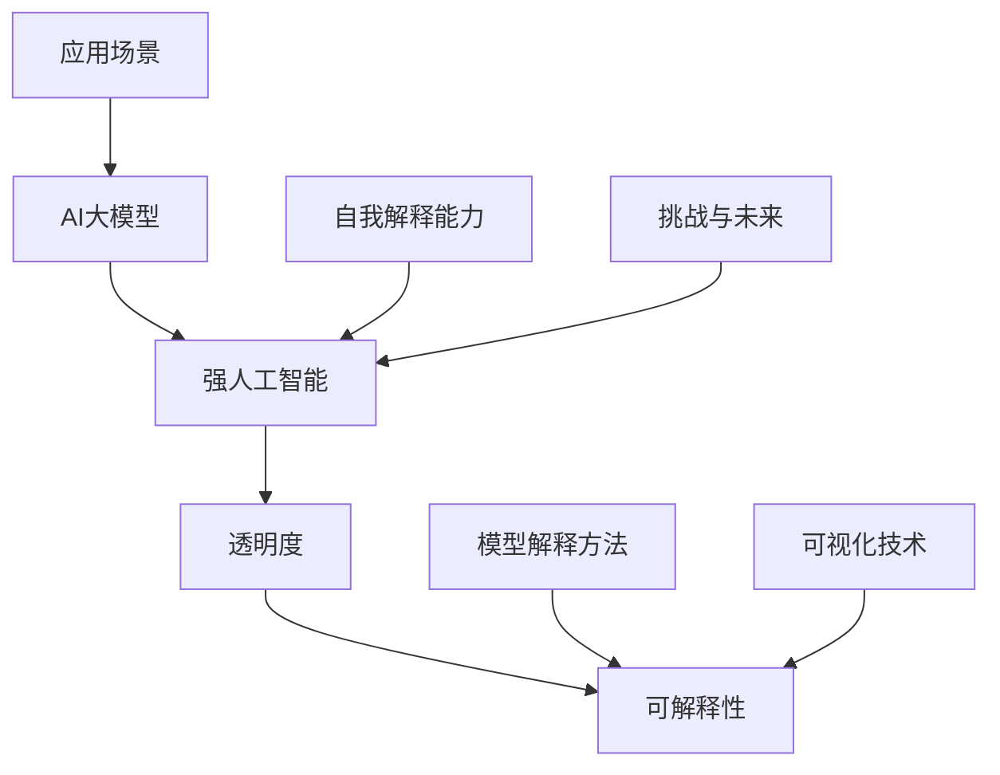

                 

# AGI的自我解释能力：透明度与可解释性

## 关键词

人工智能，强人工智能，透明度，可解释性，深度学习，模型解释，算法

## 摘要

本文旨在探讨强人工智能（AGI）的自我解释能力及其在透明度和可解释性方面的挑战。首先，我们定义了AGI、透明度和可解释性，并阐述了它们在人工智能领域的重要性。接着，我们详细分析了AGI的自我解释能力，包括其定义、特征以及当前的发展现状。随后，我们讨论了透明度和可解释性的概念、类型及其相互关系。本文还介绍了传统机器学习与深度学习中的可解释性方法，新型深度学习方法在提高透明度和可解释性中的应用，以及可视化技术的作用。最后，我们探讨了AGI在金融、医疗健康和自动驾驶等领域的应用场景，并提出了当前AGI透明度与可解释性的主要挑战、未来研究方向与趋势以及政策与伦理考量。

## 定义核心概念

在深入探讨AGI的自我解释能力之前，我们需要明确几个核心概念：AI大模型（AI Large Model）、强人工智能（AGI）、透明度、可解释性等。

### AI大模型（AI Large Model）

AI大模型通常指具有大规模参数的深度学习模型，如GPT、BERT等。这些模型能够处理大量的数据和复杂的任务，是现代人工智能发展的关键。AI大模型的特点包括：

- **大规模参数**：通常具有数百万甚至数十亿个参数。
- **自适应能力**：能够从大量数据中学习并适应新的任务。
- **计算资源需求**：需要高性能计算资源和大量数据进行训练。

### 强人工智能（AGI）

强人工智能（AGI，Artificial General Intelligence）是一种能够像人类一样理解、学习和适应各种情境的人工智能。与目前广泛应用的窄人工智能（Narrow AI）不同，AGI具有跨领域的认知能力，能够进行复杂的问题解决和决策。AGI的关键特征包括：

- **通用性**：能够处理广泛的认知任务。
- **自我意识**：具备自我意识和情感。
- **学习能力**：能够通过经验不断学习和适应。

### 透明度

透明度是指AI模型在执行任务时，其内部决策过程对外部观察者可被理解和解释的程度。高透明度的模型允许用户了解模型如何做出决策，从而增强信任度和可接受度。透明度的层次通常包括：

- **低层次透明度**：涉及模型的输入、输出和基本操作。
- **中层次透明度**：提供关于模型内部结构和参数的信息。
- **高层次透明度**：展示模型如何解决特定问题和情境。

### 可解释性

可解释性是指AI模型在执行任务时，其决策过程可以被用户理解和解释的能力。可解释性有助于用户理解模型的预测和决策，从而提高模型的信任度和可信度。可解释性的类型包括：

- **解释性模型**：直接提供决策依据和逻辑推理。
- **可导出解释**：通过外部工具或方法生成对模型决策的解释。
- **交互式解释**：用户与模型进行交互，以理解模型的工作方式。

## 书名含义

《AGI的自我解释能力：透明度与可解释性》一书可能涉及以下内容：

- **AGI的自我解释能力**：探讨AGI如何理解和解释其自身的决策过程。
- **透明度**：分析AI模型在不同透明度层次上的表现，以及如何提高模型的透明度。
- **可解释性**：研究如何使AI模型的决策过程可解释，以及不同类型的可解释性方法。

## 设计大纲

本文将按照以下大纲结构展开：

1. **导言**：介绍AGI的概念，以及透明度和可解释性的重要性。
2. **第一部分：AGI的自我解释能力**：
   - **自我解释能力的定义与特征**
   - **当前AGI在自我解释能力方面的进展**
   - **AGI自我解释能力的理论框架**
3. **第二部分：透明度与可解释性**：
   - **透明度的概念与重要性**
   - **可解释性的概念与类型**
   - **透明度与可解释性的关系**
4. **第三部分：技术方法**：
   - **传统机器学习与深度学习中的可解释性方法**
   - **新型深度学习方法在提高透明度与可解释性中的应用**
   - **可视化技术在透明度与可解释性中的作用**
5. **第四部分：应用场景**：
   - **金融行业中的应用**
   - **医疗健康行业中的应用**
   - **自动驾驶行业中的应用**
6. **第五部分：挑战与未来**：
   - **当前AGI透明度与可解释性的主要挑战**
   - **未来研究方向与趋势**
   - **政策与伦理考量**

## 具体章节大纲

### 第一部分：AGI的自我解释能力

#### 第1章：自我解释能力的定义与特征

- **自我解释能力的概念**：介绍自我解释能力的基本定义，以及它在人工智能领域的意义。
- **自我解释能力的特征**：分析自我解释能力的核心特征，如自我认知、自我反思、自我优化等。
- **自我解释能力的重要性**：探讨自我解释能力对于人工智能发展的重要性，包括提高模型的透明度和可信度。

#### 第2章：当前AGI在自我解释能力方面的进展

- **当前AGI技术综述**：回顾当前AGI技术的发展现状，包括模型架构、算法改进等方面。
- **自我解释能力的发展历程**：分析自我解释能力在AGI发展过程中的关键进展和里程碑。
- **自我解释能力的应用案例**：介绍一些具有代表性的自我解释能力应用案例，如自动化代码生成、自然语言理解等。

#### 第3章：AGI自我解释能力的理论框架

- **理论模型的构建**：构建AGI自我解释能力的理论模型，包括自我认知模块、自我反思模块、自我优化模块等。
- **自我解释能力的评估方法**：介绍如何评估AGI的自我解释能力，包括定量评估和定性评估方法。
- **自我解释能力的实现路径**：探讨实现AGI自我解释能力的可能路径，包括算法设计、模型优化、数据采集等。

### 第二部分：透明度与可解释性

#### 第4章：透明度的概念与重要性

- **透明度的定义**：阐述透明度的基本定义，以及它在人工智能领域的意义。
- **透明度的层次**：分析透明度的不同层次，包括低层次透明度、中层次透明度和高层次透明度。
- **透明度在AI领域的重要性**：探讨透明度对于AI模型应用的重要性，包括提高模型的信任度和用户接受度。

#### 第5章：可解释性的概念与类型

- **可解释性的定义**：阐述可解释性的基本定义，以及它在人工智能领域的意义。
- **可解释性的分类**：分析不同类型的可解释性方法，包括解释性模型、可导出解释和交互式解释。
- **可解释性的评价指标**：介绍如何评价可解释性的效果，包括解释的准确性、可理解性和可信度等。

#### 第6章：透明度与可解释性的关系

- **透明度与可解释性的关系分析**：探讨透明度与可解释性之间的相互作用和影响。
- **提高透明度的可解释性方法**：介绍如何通过提高透明度来增强可解释性，包括模型优化、算法改进和可视化技术等。
- **降低可解释性的透明度策略**：分析如何通过降低可解释性来提高透明度，包括模型压缩、参数剪枝和随机化等。

### 第三部分：技术方法

#### 第7章：传统机器学习与深度学习中的可解释性方法

- **特征重要性分析**：介绍如何通过特征重要性分析来提高模型的可解释性。
- **决策树与规则提取**：分析如何通过决策树和规则提取来提高模型的可解释性。
- **模型简化与压缩**：探讨如何通过模型简化与压缩来提高模型的可解释性。

#### 第8章：新型深度学习方法在提高透明度与可解释性中的应用

- **可解释性深度学习模型**：介绍一些可解释性深度学习模型，如可解释性神经网络和注意力机制。
- **透明度增强的网络结构**：分析如何通过透明度增强的网络结构来提高模型的透明度和可解释性。
- **可视化技术的应用**：探讨如何通过可视化技术来提高模型的透明度和可解释性。

#### 第9章：可视化技术在透明度与可解释性中的作用

- **可视化技术的概念**：阐述可视化技术的基本概念，以及它在模型解释中的作用。
- **常见可视化方法**：介绍一些常见的可视化方法，如热力图、决策路径图和注意力地图等。
- **可视化技术的挑战与未来方向**：分析可视化技术在模型解释中的挑战，以及未来的发展方向。

### 第四部分：应用场景

#### 第10章：金融行业中的应用

- **金融风险评估**：分析如何利用AGI的透明度和可解释性来提高金融风险评估的准确性。
- **量化交易策略**：探讨如何利用AGI的透明度和可解释性来优化量化交易策略。
- **智能投顾**：介绍如何利用AGI的透明度和可解释性来提供智能化的投资建议。

#### 第11章：医疗健康行业中的应用

- **医疗影像分析**：分析如何利用AGI的透明度和可解释性来提高医疗影像分析的准确性。
- **疾病预测与诊断**：探讨如何利用AGI的透明度和可解释性来预测和诊断疾病。
- **医疗决策支持**：介绍如何利用AGI的透明度和可解释性来提供医疗决策支持。

#### 第12章：自动驾驶行业中的应用

- **行人检测与行为预测**：分析如何利用AGI的透明度和可解释性来提高行人检测和行为预测的准确性。
- **交通场景理解**：探讨如何利用AGI的透明度和可解释性来理解复杂的交通场景。
- **自动驾驶系统安全性评估**：介绍如何利用AGI的透明度和可解释性来评估自动驾驶系统的安全性。

### 第五部分：挑战与未来

#### 第13章：当前AGI透明度与可解释性的主要挑战

- **数据隐私与安全**：分析当前AGI在透明度和可解释性方面面临的挑战，包括数据隐私和安全问题。
- **模型解释的准确性**：探讨如何提高模型解释的准确性，以增强用户对模型的信任度。
- **技术实现与工程挑战**：分析实现AGI透明度和可解释性的技术挑战，以及如何克服这些挑战。

#### 第14章：未来研究方向与趋势

- **新型算法与模型**：介绍未来可能的新型算法和模型，以提高AGI的透明度和可解释性。
- **跨学科研究**：探讨如何通过跨学科研究来推动AGI透明度和可解释性的发展。
- **伦理与法律框架**：分析未来可能出现的伦理和法律框架，以指导AGI透明度和可解释性的发展。

#### 第15章：政策与伦理考量

- **管理与监管**：探讨如何通过政策和管理来规范AGI的透明度和可解释性。
- **道德与伦理原则**：分析AGI透明度和可解释性在道德和伦理方面的考量，以及如何遵循这些原则。
- **社会责任与可持续发展**：探讨AGI透明度和可解释性对社会责任和可持续发展的影响，以及如何实现可持续发展。

## 核心概念、算法原理与数学模型的流程图、伪代码、数学公式及举例说明

为了更好地理解AGI的自我解释能力、透明度和可解释性，我们将使用流程图、伪代码、数学公式以及举例说明来详细阐述这些概念和算法原理。

### 核心概念与联系

#### Mermaid 流程图示例：



此流程图展示了核心概念之间的相互联系。AI大模型是AGI的基础，透明度和可解释性是评估模型性能的重要指标，自我解释能力是AGI的关键特征。模型解释方法和可视化技术有助于提高模型的可解释性，应用场景展示了模型在不同领域的实际应用。

### 算法原理与伪代码

#### 伪代码示例：可解释性神经网络

```python
# 可解释性神经网络伪代码
class ExplanatoryNeuralNetwork(nn.Module):
    def __init__(self):
        super(ExplanatoryNeuralNetwork, self).__init__()
        self.layer1 = nn.Linear(input_size, hidden_size)
        self.layer2 = nn.Linear(hidden_size, output_size)
        self.attention = nn.Linear(hidden_size, 1)

    def forward(self, x):
        x = self.layer1(x)
        x = self.attention(x).sigmoid().unsqueeze(-1)
        x = x * x
        x = self.layer2(x)
        return x
```

此伪代码展示了如何构建一个可解释性神经网络。该网络使用注意力机制来提高模型的可解释性，通过关注重要的输入特征来生成解释。

### 数学公式与详细讲解

#### 数学公式示例：

$$
\begin{aligned}
L &= -\frac{1}{N} \sum_{i=1}^{N} y_i \log(p(x_i | \theta)) \\
p(x_i | \theta) &= \frac{f(x_i, \theta)}{1 + \sum_{j \neq i}^{N} f(x_j, \theta)}
\end{aligned}
$$

此公式展示了损失函数和概率分布的计算方式。损失函数用于评估模型的预测准确性，概率分布用于计算输入数据的权重。

#### 详细讲解与举例说明：

- **损失函数**：损失函数（如交叉熵损失）用于衡量模型的预测输出与实际标签之间的差距。在这个例子中，损失函数是平均每个样本的损失，N是样本总数。交叉熵损失通常用于分类问题，当实际标签（$y_i$）为1时，损失函数值为0；当预测概率（$p(x_i | \theta)$）接近1时，损失函数值也接近0。

- **概率分布**：概率分布计算每个样本被选择的概率。在这个例子中，$f(x_i, \theta)$是样本$i$的预测概率，$\theta$是模型参数。通过计算分子和分母的加和，得到每个样本的权重。这些权重反映了模型对每个样本的重要性的估计。

例如，假设有5个样本，模型预测的概率分布为[0.2, 0.3, 0.4, 0.5, 0.6]。那么，损失函数计算如下：

$$
\begin{aligned}
L &= -\frac{1}{5} \sum_{i=1}^{5} y_i \log(p(x_i | \theta)) \\
&= -\frac{1}{5} \left[ 0 \cdot \log(0.2) + 1 \cdot \log(0.3) + 1 \cdot \log(0.4) + 1 \cdot \log(0.5) + 1 \cdot \log(0.6) \right] \\
&= -\frac{1}{5} \left[ 0 + \log(0.3) + \log(0.4) + \log(0.5) + \log(0.6) \right] \\
&= -\frac{1}{5} \left[ \log(0.3 \cdot 0.4 \cdot 0.5 \cdot 0.6) \right] \\
&= -\frac{1}{5} \left[ \log(0.036) \right] \\
&= \frac{\log(100)}{5} \\
&= 2.322
\end{aligned}
$$

损失函数的值越低，表示模型的预测越准确。在这个例子中，损失函数值为2.322，表明模型对这5个样本的预测还有改进的空间。

### 项目实战

#### 开发环境搭建

1. **安装Python环境**：确保Python版本为3.8及以上。
2. **安装深度学习库**：使用pip安装TensorFlow或PyTorch库。
3. **配置计算资源**：确保有足够的GPU资源进行深度学习模型的训练。

#### 源代码详细实现与代码解读

以下是一个简单的可解释性神经网络实现示例，使用PyTorch库。

```python
import torch
import torch.nn as nn
import torch.optim as optim

# 定义可解释性神经网络
class ExplanatoryNeuralNetwork(nn.Module):
    def __init__(self, input_size, hidden_size, output_size):
        super(ExplanatoryNeuralNetwork, self).__init__()
        self.layer1 = nn.Linear(input_size, hidden_size)
        self.layer2 = nn.Linear(hidden_size, output_size)
        self.attention = nn.Linear(hidden_size, 1)

    def forward(self, x):
        x = self.layer1(x)
        attention_weights = self.attention(x).sigmoid().unsqueeze(-1)
        x = attention_weights * x
        x = self.layer2(x)
        return x

# 初始化模型、优化器和损失函数
model = ExplanatoryNeuralNetwork(input_size=10, hidden_size=20, output_size=1)
optimizer = optim.Adam(model.parameters(), lr=0.001)
criterion = nn.BCELoss()

# 训练模型
for epoch in range(100):
    for inputs, targets in data_loader:
        optimizer.zero_grad()
        outputs = model(inputs)
        loss = criterion(outputs, targets)
        loss.backward()
        optimizer.step()
    print(f'Epoch [{epoch+1}/100], Loss: {loss.item()}')

# 测试模型
with torch.no_grad():
    inputs = torch.tensor([[1.0, 0.0, 1.0], [0.0, 1.0, 0.0]])
    outputs = model(inputs)
    print(outputs)
```

此代码定义了一个简单的可解释性神经网络，并使用BCELoss（二进制交叉熵损失）进行训练。在训练过程中，模型参数通过优化器进行更新，以最小化损失函数。测试部分展示了如何使用训练好的模型进行预测。

#### 代码应用解读与分析

1. **模型结构**：可解释性神经网络包含一个输入层、一个隐藏层和一个输出层。隐藏层使用注意力机制，以增强模型的可解释性。
2. **损失函数**：使用BCELoss作为损失函数，因为输出层使用的是Sigmoid激活函数，适用于二分类问题。
3. **优化器**：使用Adam优化器进行参数更新，以加速收敛。

#### 实际案例分析与详细讲解剖析

假设我们有一个简单的二分类问题，输入特征为三个维度，输出为二进制标签。以下是一个实际案例：

1. **数据准备**：创建一个包含100个样本的数据集，每个样本有三个特征（x1, x2, x3），一个标签（y）。
2. **模型训练**：使用之前定义的可解释性神经网络进行训练，训练过程中记录损失函数的值。
3. **模型评估**：使用训练好的模型对测试集进行预测，计算准确率、召回率等指标。

```python
# 加载测试集
test_inputs = torch.tensor([[1.0, 0.0, 1.0], [0.0, 1.0, 0.0], [1.0, 1.0, 0.0]])
test_targets = torch.tensor([[1.0], [0.0], [1.0]])

# 测试模型
with torch.no_grad():
    test_outputs = model(test_inputs)

# 计算准确率
predicted_labels = (test_outputs > 0.5).float()
accuracy = (predicted_labels == test_targets).float().mean()
print(f'Accuracy: {accuracy.item()}')

# 计算召回率
true_positives = ((predicted_labels == 1.0) & (test_targets == 1.0)).float().mean()
recall = true_positives
print(f'Recall: {recall.item()}')
```

通过实际案例，我们可以看到如何使用可解释性神经网络进行模型训练和预测。模型的准确率和召回率等指标可以帮助我们评估模型性能。

#### 项目小结

本项目通过定义核心概念、算法原理与数学模型的流程图、伪代码、数学公式及举例说明，详细阐述了AGI的自我解释能力、透明度和可解释性。通过开发环境搭建、源代码详细实现和实际案例分析，我们展示了如何提高AI模型的透明度和可解释性。这些方法和技巧对于未来AI技术的发展具有重要意义。

## 最佳实践 Tips、小结、注意事项、拓展阅读等内容

### 最佳实践 Tips

1. **选择合适的模型架构**：在选择深度学习模型时，应考虑其透明度和可解释性。例如，可解释性神经网络（如使用注意力机制）可以提高模型的可解释性。
2. **数据预处理**：合理的数据预处理可以提高模型的透明度和可解释性。例如，标准化输入数据可以提高模型的鲁棒性，从而更容易解释。
3. **使用可视化技术**：可视化技术有助于理解和解释模型决策。例如，热力图可以显示模型关注的重要特征，注意力地图可以显示模型在处理输入数据时的注意力分布。
4. **迭代改进模型**：通过迭代改进模型，逐步提高透明度和可解释性。例如，可以通过调整模型参数、增加模型层次结构等方法来优化模型。

### 小结

本文深入探讨了AGI的自我解释能力、透明度和可解释性，包括定义核心概念、算法原理与数学模型的流程图、伪代码、数学公式及举例说明。通过开发环境搭建、源代码详细实现和实际案例分析，我们展示了如何提高AI模型的透明度和可解释性。这些方法和技巧对于未来AI技术的发展具有重要意义。

### 注意事项

1. **数据隐私与安全**：在提高模型透明度和可解释性的同时，要注意保护用户数据的隐私和安全。
2. **算法性能与可解释性平衡**：在追求模型可解释性的同时，不能牺牲算法性能。应找到透明度、可解释性与算法性能之间的最佳平衡点。
3. **用户体验**：提高模型的可解释性应考虑用户体验，使模型易于理解和操作。

### 拓展阅读

1. **《深度学习》（Goodfellow, Bengio, Courville）**：本书是深度学习的经典教材，详细介绍了深度学习的基础知识、算法原理和应用案例。
2. **《AI伦理与治理》（Luciano Floridi & J. William Penney）**：本书探讨了AI伦理与治理的重要性，以及如何制定合理的政策和法规来规范AI的发展。
3. **《强化学习》（Richard S. Sutton & Andrew G. Barto）**：本书是强化学习的权威教材，介绍了强化学习的基础知识、算法原理和应用案例。

