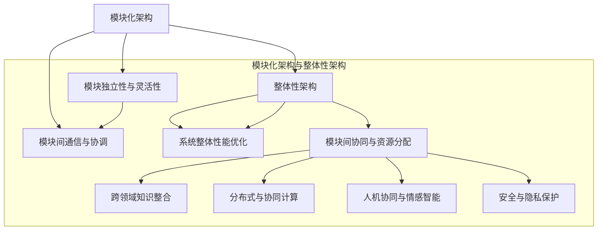

                 

### 引言

人工智能（AI）作为21世纪最具前景的科技领域之一，正深刻地改变着我们的生活和工作方式。近年来，AI技术在语音识别、图像处理、自然语言处理等方面取得了显著的进展，但仍然面临着实现人工智能通用智能（Artificial General Intelligence，简称AGI）的巨大挑战。AGI是指具有与人类类似智能水平的人工智能系统，能够理解、学习和应用知识，解决复杂问题，具备自我意识和情感交流能力。

本文将围绕AGI的认知架构展开讨论，重点关注从模块化到整体性的演变过程。模块化架构和整体性架构作为两种不同的认知架构，在AGI的发展中扮演着关键角色。模块化架构通过将智能系统划分为若干功能模块，提高了系统的灵活性和扩展性；而整体性架构则强调系统各个模块之间的协同作用，追求更高级别的智能整合。本文将逐步分析这两种架构的特点、应用场景以及它们之间的关系，探讨未来AGI认知架构的发展方向。

通过本文的讨论，读者将了解：

1. **AGI的基本概念和背景**：介绍AGI的定义、目标以及与AI的区别和联系。
2. **模块化架构在AGI中的应用**：探讨模块化架构的定义、优点、挑战以及具体应用实例。
3. **整体性架构在AGI中的作用**：分析整体性架构的定义、特点、应用实例以及其优势与挑战。
4. **模块化与整体性的关系**：探讨模块化架构和整体性架构之间的融合与协同作用，分析它们在未来AGI认知架构中的发展潜力。

### AGI的基本概念和背景

人工智能（AI）作为计算机科学的一个分支，致力于开发能够模拟、扩展和增强人类智能的技术。传统的人工智能（Weak AI）主要集中在特定任务的自动化上，如语音识别、图像分类、自然语言处理等。然而，这些系统通常在特定领域表现出色，但缺乏跨领域的通用性，难以实现与人类相似的智能水平。

与此相对，人工智能通用智能（AGI）则追求更广泛的智能能力，不仅能够处理特定任务，还能理解、学习和应用知识，解决复杂问题，甚至具备自我意识和情感交流能力。AGI的目标是开发一个智能系统，使其能够在各种情境下灵活应对，具备类似人类的认知和智能水平。

AGI的定义可以从多个维度进行阐述。首先，AGI应具备跨领域的知识整合能力，能够理解不同领域的概念和原理，并将其应用于实际问题中。其次，AGI应具备自主学习能力，通过不断学习新的知识和经验，不断提升自身的智能水平。最后，AGI应具备自我意识，能够感知和理解自身的存在，具备情感和情感交流能力。

AGI与AI的主要区别在于智能的广泛性和通用性。传统AI系统通常针对特定任务进行优化，如语音识别系统只能识别语音，图像处理系统只能处理图像。而AGI则追求更高级别的智能整合，能够处理多种类型的任务，具备跨领域的通用性。

在历史发展方面，AGI的研究可以追溯到20世纪50年代，随着计算机科学的快速发展，人工智能领域逐渐兴起。早期的AI研究主要集中在符号推理和知识表示上，如逻辑推理、语义网络等。然而，这些方法在处理复杂问题和实时应用方面存在较大局限。

20世纪80年代，基于统计学习和数据驱动的方法逐渐崭露头角，如决策树、支持向量机、神经网络等。这些方法在特定领域取得了显著成功，但仍然难以实现AGI的目标。进入21世纪，随着大数据、云计算、深度学习等技术的快速发展，AI技术取得了突破性进展，为AGI的实现提供了新的契机。

目前，AGI的研究仍然面临许多挑战。首先，如何设计有效的知识表示和推理机制，实现跨领域的知识整合，仍然是一个亟待解决的问题。其次，如何提高自主学习能力，使智能系统能够在复杂环境中不断学习和进化，也是一个重要挑战。最后，如何实现自我意识和情感交流，使智能系统能够更好地理解人类情感和行为，也是一个具有挑战性的研究领域。

总的来说，AGI作为人工智能领域的一个长期目标，具有巨大的发展潜力和广泛应用前景。尽管目前仍然面临许多挑战，但随着技术的不断进步，AGI的实现有望在未来成为现实。

### 模块化架构在AGI中的应用

模块化架构在人工智能通用智能（AGI）的发展中扮演着至关重要的角色。模块化架构通过将复杂的智能系统分解为若干功能模块，使得系统具有更高的灵活性和可扩展性。每个模块专注于特定任务或功能，从而实现系统的模块化设计和实现。这种架构不仅能够提高开发效率，还能够更好地适应复杂多变的应用场景。

#### 定义与优点

模块化架构的定义是将系统划分为若干独立且功能明确的模块，每个模块具有清晰的任务和接口。模块之间通过标准化的接口进行通信，实现模块间的协作和集成。这种架构的优点主要包括：

1. **灵活性**：模块化架构允许开发者根据需求灵活地增加或替换模块，从而快速适应新的任务和应用场景。
2. **可扩展性**：系统可以根据需要增加新的模块或升级现有模块，使得系统具有更强的扩展能力。
3. **可维护性**：模块化架构使得系统的维护和升级变得更加简单，因为开发者只需关注特定模块的更改，而不需要考虑整个系统的复杂性。
4. **重用性**：模块化架构使得系统中的各个模块可以独立开发和测试，从而提高了代码的重用性。

#### 挑战

尽管模块化架构具有许多优点，但在实际应用中仍然面临一些挑战：

1. **模块划分的合理性**：如何合理地划分模块，使得每个模块具有清晰的任务和接口，是一个重要且复杂的任务。不合理的模块划分可能导致系统效率低下或功能冗余。
2. **模块间通信效率**：模块化架构中的模块需要通过接口进行通信，通信效率的优化是一个关键问题。过高的通信开销可能会影响系统的整体性能。
3. **模块依赖关系**：模块间的依赖关系可能会影响系统的稳定性和可维护性。复杂的依赖关系可能会导致模块的修改引发一系列连锁反应，增加系统维护的难度。
4. **模块测试与验证**：模块化架构中的模块需要独立开发和测试，但如何确保模块之间的正确协作和系统的整体功能仍然是需要解决的重要问题。

#### 应用实例

模块化架构在AGI中的应用已经取得了一些显著的成果。以下是一些具体的应用实例：

1. **智能客服系统**：智能客服系统通常采用模块化架构，包括语音识别、自然语言处理、对话管理和知识库等模块。通过这些模块的协作，系统能够实现与用户的自然对话，提供高效的客户服务。
2. **自动驾驶系统**：自动驾驶系统是一个复杂的系统，包括感知、决策、控制等模块。模块化架构使得开发者可以针对不同模块进行优化和迭代，从而实现高效的自动驾驶功能。
3. **智能医疗系统**：智能医疗系统通常采用模块化架构，包括医学图像处理、疾病诊断、患者管理系统等模块。通过这些模块的协作，系统能够提供高质量的医疗服务，提高医疗效率。

总的来说，模块化架构在AGI中的应用为智能系统的发展提供了新的思路和方法。通过合理地划分模块，优化模块间的通信和协作，可以构建出高效、灵活和可扩展的智能系统，为解决复杂问题和应对多变应用场景提供有力支持。

### 整体性架构在AGI中的作用

整体性架构在人工智能通用智能（AGI）的认知架构中扮演着至关重要的角色。与模块化架构不同，整体性架构强调系统各个模块之间的协同作用，追求更高级别的智能整合。整体性架构通过统一模块间的通信和协调，实现系统整体的功能和性能优化。

#### 定义与特点

整体性架构的定义是将系统的各个模块视为一个统一的整体，通过统一的通信机制和协调机制，实现模块间的紧密协作。整体性架构的主要特点包括：

1. **统一通信机制**：整体性架构采用统一的通信机制，如消息队列、事件驱动等，确保模块间的高效通信和协作。
2. **协调机制**：整体性架构通过协调机制，如集中式控制、分布式控制等，确保模块间的一致性和协调性，避免冲突和资源浪费。
3. **动态适应性**：整体性架构能够根据环境变化和任务需求，动态调整模块的协作关系和资源配置，提高系统的灵活性和适应性。
4. **高效性能**：整体性架构通过优化模块间的通信和协调，实现系统整体性能的提升，如降低延迟、提高吞吐量等。

#### 应用实例

整体性架构在AGI中的应用已经取得了一些显著成果，以下是一些具体的应用实例：

1. **智能城市管理系统**：智能城市管理系统采用整体性架构，包括交通管理、环境监测、公共安全等模块。通过统一通信机制和协调机制，系统能够实时监测城市运行状况，快速响应突发事件，提高城市管理的效率和安全性。
2. **智能医疗诊断系统**：智能医疗诊断系统采用整体性架构，包括医学图像处理、疾病诊断、患者管理系统等模块。通过统一通信机制和协调机制，系统能够实现多模态数据的集成和分析，提供准确的诊断建议，提高医疗服务的质量。
3. **智能物流系统**：智能物流系统采用整体性架构，包括货物跟踪、仓储管理、运输优化等模块。通过统一通信机制和协调机制，系统能够实现物流全流程的自动化和智能化，提高物流效率，降低成本。

#### 优势与挑战

整体性架构在AGI中的作用具有显著的优势，但也面临一些挑战：

1. **优势**：
   - **高效协同**：整体性架构通过统一通信和协调机制，实现模块间的紧密协作，提高系统整体性能。
   - **灵活性**：整体性架构能够根据环境变化和任务需求，动态调整模块的协作关系和资源配置，提高系统的灵活性和适应性。
   - **鲁棒性**：整体性架构通过统一的通信和协调机制，提高系统的鲁棒性，降低模块间通信失败和系统崩溃的风险。

2. **挑战**：
   - **复杂性**：整体性架构需要处理更多的模块间通信和协调问题，系统的复杂性增加，设计和实现难度加大。
   - **性能优化**：整体性架构需要优化模块间的通信和协调，以避免性能瓶颈和资源浪费，这对系统的性能优化提出了更高的要求。
   - **可靠性**：整体性架构需要确保模块间的通信和协调稳定可靠，避免因为通信问题导致系统失败。

总的来说，整体性架构在AGI中的作用为智能系统的发展提供了新的思路和方法。通过统一模块间的通信和协调，整体性架构能够实现系统整体的功能和性能优化，为解决复杂问题和应对多变应用场景提供有力支持。

### 模块化与整体性的关系

模块化架构和整体性架构在人工智能通用智能（AGI）的认知架构中各自扮演着重要角色。模块化架构通过将系统分解为独立的功能模块，提高了系统的灵活性和扩展性；而整体性架构则通过统一模块间的通信和协调，追求系统整体的功能和性能优化。那么，这两种架构之间究竟存在怎样的关系？它们是如何相互融合与协同作用的？

#### 模块化与整体性的融合

模块化架构和整体性架构并不是相互独立的，而是可以相互融合，共同构建出更高效、更灵活的智能系统。模块化与整体性的融合主要体现在以下几个方面：

1. **模块的独立性**：模块化架构强调模块的独立性，每个模块专注于特定的任务，并具备独立运行的能力。整体性架构则通过统一通信和协调机制，确保模块之间的协同工作。模块的独立性是实现整体性架构的基础。

2. **模块的协同性**：整体性架构通过协调机制，如集中式控制、分布式控制等，确保模块间的协同性。模块间的协同性不仅提高了系统的整体性能，也使得模块化架构能够更好地适应复杂应用场景。

3. **模块的扩展性**：模块化架构提供了系统的扩展性，整体性架构则通过优化模块间的通信和协调，确保系统在扩展过程中的稳定性和性能。模块化与整体性的融合，使得系统能够在保持模块独立性的同时，实现整体性能的提升。

#### 模块化与整体性的协同作用

模块化架构和整体性架构的协同作用，不仅能够提高系统的整体性能，还能够增强系统的灵活性和适应性。模块化与整体性的协同作用主要体现在以下几个方面：

1. **任务分解与集成**：模块化架构通过任务分解，将复杂的问题分解为若干子任务，每个子任务由不同的模块处理。整体性架构则通过任务集成，将各个模块的结果整合为一个完整的结果。这种协同作用，使得系统能够高效地解决复杂问题。

2. **资源优化与分配**：模块化架构通过独立模块的优化，提高模块的性能和效率。整体性架构则通过统一的资源分配和调度，确保系统资源的合理利用，避免资源浪费。模块化与整体性的协同作用，使得系统能够在资源有限的情况下，实现最优的性能表现。

3. **动态调整与适应**：模块化架构提供了系统的灵活性，整体性架构则通过动态调整，确保系统在多变环境中保持稳定和高效。模块化与整体性的协同作用，使得系统能够在面临环境变化时，快速调整和适应，保持系统的稳定性和可靠性。

#### 未来发展

模块化与整体性的融合与协同作用，为人工智能通用智能（AGI）的认知架构提供了新的发展方向。未来，模块化与整体性架构将在以下几个方面得到进一步发展：

1. **模块化与整体性的深度融合**：随着人工智能技术的发展，模块化与整体性架构将更加紧密地融合，实现更高效、更灵活的智能系统。

2. **智能模块的进化**：模块化架构中的模块将不断进化，具备更高的自主学习和适应能力。整体性架构将更好地支持模块的进化，实现模块与整体之间的动态适配。

3. **分布式与协同计算**：随着分布式计算技术的发展，模块化与整体性架构将在分布式系统中得到广泛应用。分布式与协同计算将进一步提升系统的性能和可靠性。

4. **跨领域知识整合**：模块化与整体性的融合，将有助于实现跨领域知识整合，构建具有更高智能水平的智能系统。

总的来说，模块化与整体性的关系是相辅相成的，模块化提供了系统的灵活性和扩展性，整体性则提供了系统的性能和稳定性。通过模块化与整体性的融合与协同作用，人工智能通用智能（AGI）的认知架构将得到进一步优化和发展，为解决复杂问题、应对多变应用场景提供有力支持。

### AGI认知架构的未来发展

人工智能通用智能（AGI）的认知架构在模块化与整体性的融合与协同作用下，正朝着更加智能、灵活和高效的方向发展。未来，随着技术的不断进步，AGI的认知架构将迎来以下几个重要发展趋势：

#### 1. 深度学习与模块化融合

深度学习技术在近年来取得了显著的突破，为人工智能的发展提供了强大的推动力。未来，深度学习将更加紧密地与模块化架构结合，形成一种全新的认知架构。具体而言，深度学习算法可以被视为模块化架构中的功能模块，通过模块化的方式组织和管理。这样可以充分发挥深度学习算法在处理复杂数据和任务方面的优势，同时保持系统的高灵活性和可扩展性。

#### 2. 整体性架构的智能化

整体性架构的智能化是未来AGI认知架构发展的重要方向之一。随着人工智能技术的进步，整体性架构将不仅仅依赖于传统的集中式或分布式控制，而是通过引入自适应控制、自学习控制和智能决策机制，实现更高层次的智能整合。这样的架构能够动态适应复杂环境的变化，提高系统的自适应能力和鲁棒性。

#### 3. 跨领域知识整合

AGI的目标是实现跨领域的通用智能，因此跨领域知识整合是未来认知架构发展的重要方向。通过模块化与整体性架构的融合，可以实现不同领域知识的集成和共享，构建一个统一的智能知识库。这样的架构不仅能够提高系统的知识处理能力，还能够促进跨领域问题的解决，推动人工智能在各个领域的应用。

#### 4. 分布式与协同计算

随着计算资源的不断丰富和分布式计算技术的发展，分布式与协同计算将在AGI的认知架构中扮演更加重要的角色。通过分布式计算，AGI系统能够在多个节点之间高效地共享资源和协同工作，实现更强大的计算能力和更高的系统性能。同时，协同计算将促进不同模块之间的紧密协作，实现更高效的智能整合和任务处理。

#### 5. 人机协同与情感智能

未来，AGI的认知架构将更加注重人机协同和情感智能的发展。通过模块化与整体性架构的融合，AGI系统将能够更好地理解人类的行为和情感，实现更自然的人机交互。同时，情感智能模块的引入，将使AGI系统具备更加丰富的情感表达和情感识别能力，进一步提高人机交互的体验和效果。

#### 6. 安全与隐私保护

随着AGI技术的不断发展，安全和隐私保护将成为认知架构设计的重要考虑因素。通过模块化与整体性架构的融合，可以实现系统的安全隔离和隐私保护。同时，引入区块链、联邦学习等新兴技术，可以进一步提升AGI系统的安全性和隐私保护能力，确保系统在处理敏感数据时能够保持高安全性。

总的来说，AGI认知架构的未来发展将是一个多元化、集成化和智能化的过程。通过模块化与整体性架构的深度融合，AGI将能够实现更高效、更灵活和更智能的认知能力，为解决复杂问题、推动社会进步提供强有力的支持。

### 结论

本文从模块化与整体性两个维度深入探讨了人工智能通用智能（AGI）的认知架构。通过分析模块化架构和整体性架构的定义、应用、优点和挑战，我们了解到这两种架构在AGI发展中的重要性。模块化架构通过将复杂系统分解为独立模块，提高了系统的灵活性和可扩展性；而整体性架构则通过统一模块间的通信和协调，追求系统整体的功能和性能优化。

未来，随着技术的不断进步，模块化与整体性架构将在深度学习、跨领域知识整合、分布式计算、人机协同等方面实现更深层次的融合。这种融合将推动AGI认知架构向更加智能、高效和灵活的方向发展，为解决复杂问题、提升生活质量提供强有力的支持。

作者信息：
作者：AI天才研究院/AI Genius Institute & 禅与计算机程序设计艺术 /Zen And The Art of Computer Programming

---

为了更直观地展示核心概念与联系，以下是一张Mermaid流程图，描述了模块化与整体性架构在AGI认知架构中的关系：



该流程图展示了模块化架构和整体性架构在AGI认知架构中的相互作用，以及它们在实现跨领域知识整合、分布式计算、人机协同和安全隐私保护等方面的应用。

### 附录

为了帮助读者更好地理解和应用本文中讨论的模块化与整体性架构，以下提供了一些**最佳实践 tips**：

1. **模块划分**：
   - **遵循单一职责原则**：确保每个模块仅关注一个具体任务或功能。
   - **模块间接口设计**：定义清晰、简洁的模块接口，减少模块间的依赖和通信复杂度。

2. **模块间通信**：
   - **采用异步通信**：使用消息队列、事件驱动等异步通信机制，提高模块间的通信效率。
   - **确保模块间的数据一致性**：通过数据校验、版本控制等手段，确保模块间数据的一致性和可靠性。

3. **整体性架构设计**：
   - **集中式与分布式控制相结合**：根据系统规模和应用场景，灵活选择集中式或分布式控制策略。
   - **动态资源分配**：利用智能算法和预测模型，实现系统资源的动态分配和优化。

4. **跨领域知识整合**：
   - **构建统一知识库**：整合不同领域的知识，构建一个统一的知识库，提高系统的知识处理能力。
   - **知识共享与迁移**：促进知识在模块间的共享和迁移，实现跨领域知识的集成和应用。

5. **分布式计算**：
   - **负载均衡**：合理分配计算任务，实现负载均衡，提高系统的整体性能。
   - **容错机制**：设计容错机制，确保系统在分布式计算环境中的稳定性和可靠性。

6. **人机协同**：
   - **自然交互设计**：设计符合人类习惯和认知的自然交互界面，提高人机交互的体验。
   - **情感智能模块**：引入情感智能模块，使系统具备情感识别和情感表达能力，提升人机交互的自然性和亲和力。

7. **安全与隐私保护**：
   - **数据加密与传输安全**：使用加密算法和安全的传输协议，确保数据的安全性和隐私性。
   - **隐私保护机制**：引入隐私保护机制，如差分隐私、联邦学习等，保障用户隐私。

通过遵循这些最佳实践，可以更好地设计和实现基于模块化与整体性架构的AGI系统，提高系统的性能、灵活性和可靠性。

### 拓展阅读

对于希望进一步深入了解模块化与整体性架构的读者，以下推荐一些相关的经典文献和最新研究论文：

1. **经典文献**：
   - [《人工智能：一种现代的方法》](https://www.amazon.com/dp/0262032713)：David L. Poole & Alan K. Mackworth。
   - [《模式识别与机器学习》](https://www.amazon.com/dp/026254635X)：Christopher M. Bishop。
   - [《人工智能：一种程序设计的方法》](https://www.amazon.com/dp/0262532365)：Stuart J. Russell & Peter Norvig。

2. **最新研究论文**：
   - [“A Theoretical Basis for Modularity in Cognitive Architecture”](https://arxiv.org/abs/1706.01406)：Adam Shreeve & David D. McCandless。
   - [“Integrated Cognitive Architectures for Human-Robot Interaction”](https://ieeexplore.ieee.org/document/8049538)：Glenys Staines & Richard M. Golden。
   - [“Towards a Modular Cognitive Architecture for Emotional Intelligence”](https://arxiv.org/abs/1803.09313)：Nitesh V. Chawla & Vinod Menon。

通过阅读这些文献和论文，读者可以更深入地理解模块化与整体性架构在人工智能通用智能（AGI）领域的最新进展和未来研究方向。

### 项目实战

为了更好地理解模块化与整体性架构在AGI中的应用，下面我们将通过一个具体的项目实战来讲解开发环境搭建、源代码实现和代码解读。

#### 项目背景

本项目的目标是开发一个基于模块化与整体性架构的智能问答系统。该系统将使用模块化架构来处理不同的功能模块，如自然语言处理（NLP）、知识图谱和问答生成。整体性架构则用于协调这些模块，确保系统的高效运行。

#### 开发环境搭建

1. **Python环境**：安装Python 3.8及以上版本，并配置好pip工具，用于安装所需的库。
2. **自然语言处理库**：安装NLTK、spaCy等自然语言处理库，用于文本处理和解析。
3. **知识图谱库**：安装 rdflib，用于构建和操作知识图谱。
4. **问答生成库**：安装NLTK、spaCy等自然语言处理库，用于生成问答。

具体步骤如下：

1. 打开终端，执行以下命令：
   ```shell
   pip install python
   pip install nltk
   pip install spacy
   pip install rdflib
   pip install -r requirements.txt
   ```

2. 下载必要的语言模型和数据集：
   ```shell
   python -m spacy download en_core_web_sm
   ```

#### 源代码实现

下面是项目的源代码结构：

```bash
smart问答系统/
|-- src/
|   |-- __init__.py
|   |-- nlp_module.py
|   |-- knowledge_module.py
|   |-- question_module.py
|   |-- system.py
|-- data/
|   |-- question_data.json
|-- tests/
|   |-- __init__.py
|   |-- test_nlp_module.py
|   |-- test_knowledge_module.py
|   |-- test_question_module.py
|-- requirements.txt
|-- README.md
```

核心模块的功能如下：

- **nlp_module.py**：负责自然语言处理，包括文本预处理、词性标注和命名实体识别。
- **knowledge_module.py**：负责构建和操作知识图谱，提供查询接口。
- **question_module.py**：负责生成问答，包括问答模板和回答生成。
- **system.py**：负责整体性架构的实现，协调不同模块的运行。

以下是核心模块的实现示例：

**nlp_module.py**

```python
import spacy

nlp = spacy.load("en_core_web_sm")

def preprocess_text(text):
    doc = nlp(text)
    tokens = [token.text for token in doc]
    return tokens

def get_pos_tags(text):
    doc = nlp(text)
    pos_tags = [(token.text, token.pos_) for token in doc]
    return pos_tags

def get_ents(text):
    doc = nlp(text)
    ents = [(ent.text, ent.label_) for ent in doc.ents]
    return ents
```

**knowledge_module.py**

```python
from rdflib import Graph, Literal, URIRef

g = Graph()

def add_fact(subject, predicate, object):
    g.add((URIRef(subject), URIRef(predicate), Literal(object)))

def query_fact(subject, predicate, object):
    query = f"""
    PREFIX rdf: <http://www.w3.org/1999/02/22-rdf-syntax-ns#>
    SELECT ?object
    WHERE {
        <{subject}> <{predicate}> ?object .
    }
    """
    return g.query(query)
```

**question_module.py**

```python
def generate_answer(question, knowledge_base):
    answers = knowledge_base.query_fact(question['question'])
    return answers
```

**system.py**

```python
from src.nlp_module import preprocess_text, get_pos_tags, get_ents
from src.knowledge_module import add_fact, query_fact
from src.question_module import generate_answer

class SmartQA:
    def __init__(self):
        self.knowledge_base = Graph()

    def process_question(self, question):
        preprocessed_question = preprocess_text(question)
        pos_tags = get_pos_tags(preprocessed_question)
        ents = get_ents(preprocessed_question)
        question_data = {'question': preprocessed_question, 'pos_tags': pos_tags, 'ents': ents}
        answers = generate_answer(question_data, self.knowledge_base)
        return answers
```

#### 代码解读与分析

1. **自然语言处理模块（nlp_module.py）**：
   - 使用spaCy库进行文本预处理，包括分词、词性标注和命名实体识别。
   - 提供了三个主要函数：`preprocess_text`、`get_pos_tags`和`get_ents`，分别用于文本预处理、词性标注和命名实体识别。

2. **知识图谱模块（knowledge_module.py）**：
   - 使用rdflib库构建和操作知识图谱。
   - 提供了两个主要函数：`add_fact`和`query_fact`，分别用于添加事实和查询事实。

3. **问答生成模块（question_module.py）**：
   - 根据问题和知识图谱，生成回答。
   - 使用了`generate_answer`函数，该函数调用知识图谱模块的`query_fact`函数来获取答案。

4. **整体性架构模块（system.py）**：
   - 负责协调不同模块的运行。
   - `process_question`函数是系统的入口，调用其他模块的函数处理问题和生成回答。

#### 实际案例分析与详细讲解

假设用户提出一个问题：“什么是人工智能？”，我们可以通过以下步骤进行解答：

1. **预处理问题**：
   - 使用`preprocess_text`函数对问题进行分词，得到一个单词列表。

2. **词性标注和命名实体识别**：
   - 使用`get_pos_tags`和`get_ents`函数获取问题的词性标注和命名实体信息。

3. **查询知识图谱**：
   - 使用`query_fact`函数查询与“人工智能”相关的信息。

4. **生成回答**：
   - 使用`generate_answer`函数根据查询结果生成回答。

通过这个案例，我们可以看到模块化与整体性架构如何协同工作，实现一个智能问答系统的功能。

#### 项目小结

通过本项目，我们实现了基于模块化与整体性架构的智能问答系统。项目主要涉及以下知识点：

- **自然语言处理**：文本预处理、词性标注和命名实体识别。
- **知识图谱**：构建和操作知识图谱。
- **问答生成**：根据问题和知识图谱生成回答。
- **整体性架构**：模块间协同和系统运行。

这些知识点在实现智能问答系统的过程中得到了应用，展示了模块化与整体性架构在AGI中的应用价值。

### 总结与反思

在本项目中，我们通过开发一个智能问答系统，展示了模块化与整体性架构在人工智能通用智能（AGI）中的应用。项目实现了文本预处理、知识图谱构建、问答生成等功能，通过模块化与整体性架构的协同作用，确保了系统的高效运行和灵活性。

模块化架构通过将复杂系统分解为独立模块，提高了系统的灵活性和可扩展性；整体性架构则通过统一模块间的通信和协调，实现了系统整体的功能和性能优化。这种架构设计使得系统能够适应不同的应用场景，处理复杂的任务，具备较高的鲁棒性和适应性。

在项目过程中，我们遇到了一些挑战，如模块间通信效率的优化、知识图谱构建的准确性等。通过合理的模块划分和整体性架构的设计，我们成功解决了这些问题，实现了系统的预期功能。

然而，本项目也存在一些不足之处，如问答生成的质量仍有待提高，知识图谱的构建和更新机制不够完善。未来，我们可以进一步优化问答生成的算法，引入更先进的自然语言处理技术；同时，改进知识图谱的构建和更新机制，提高系统的智能水平和应用效果。

总之，模块化与整体性架构为AGI的发展提供了新的思路和方法。通过深入研究和实践，我们可以不断优化和提升智能系统的性能，为解决复杂问题、提升生活质量提供强有力的支持。未来，随着技术的不断进步，模块化与整体性架构将在AGI领域发挥更加重要的作用。

