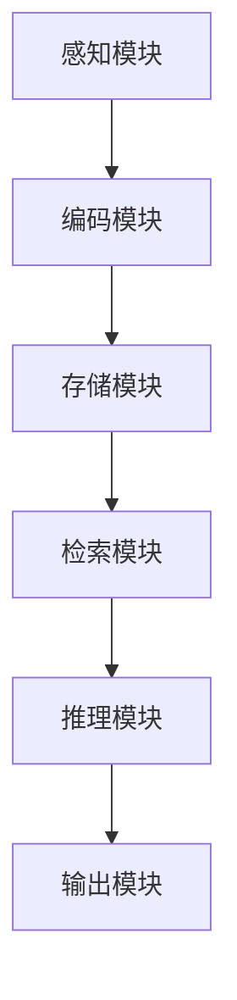

                 


# AGI的记忆系统设计与知识管理

## 关键词
- 通用人工智能
- 记忆系统
- 知识管理
- 知识表示
- 知识检索
- 知识推理

## 摘要
本文深入探讨了通用人工智能（AGI）的记忆系统设计与知识管理。首先，我们明确了AGI的定义及其与传统人工智能（AI）的区别。接着，我们分析了AGI记忆系统的核心架构，并通过Mermaid流程图展示了其组件与相互关系。然后，我们详细介绍了知识管理在AGI中的应用，包括知识表示、检索、推理和共享。最后，我们探讨了记忆系统的设计优化、核心算法原理以及数学模型，并通过一个实际项目案例，展示了AGI记忆系统在实践中的应用。

### 第1章: AGI概述

### 1.1 AGI的定义与特点
通用人工智能（AGI）是一种能够像人类一样理解、学习和适应多种环境的智能系统。与传统人工智能（如基于规则的专家系统和深度学习模型）不同，AGI的目标是具备广泛的认知能力，包括感知、思考、决策和问题解决。AGI具有以下几个显著特点：

1. **跨领域的认知能力**：AGI能够在多个领域（如语言、视觉、听觉等）中表现出高水平的能力。
2. **自适应学习**：AGI能够从经验和数据中学习，并在新环境中适应。
3. **普遍性**：AGI能够应用于广泛的任务和领域，而不仅仅是特定的问题。
4. **自主性**：AGI能够在没有人为干预的情况下，自主地执行任务和决策。

### 1.2 AGI与传统AI的区别
传统AI主要集中在特定任务的自动化，如语音识别、图像分类、自然语言处理等。而AGI则追求超越特定领域的智能，具备更广泛的认知能力。以下是一些关键区别：

1. **目标不同**：传统AI追求特定任务的性能优化，而AGI追求跨领域的认知能力。
2. **能力不同**：传统AI依赖于预先定义的规则或数据，而AGI能够通过学习和自适应来扩展其能力。
3. **复杂性不同**：传统AI系统通常较小且易于管理，而AGI系统更加复杂，需要处理大量异构数据和任务。

### 1.3 AGI的发展历史
AGI的概念最早可以追溯到20世纪50年代，当时图灵提出了图灵测试以评估机器的智能水平。此后，随着计算技术的进步和AI领域的不断发展，许多学者和工程师致力于实现AGI。以下是一些重要事件：

1. **1956年**：达特茅斯会议提出了人工智能的概念，标志着AI学科的诞生。
2. **1970年代**：基于规则的专家系统得到了广泛研究，但随后陷入“AI寒冬”。
3. **1980年代**：机器学习和深度学习开始崭露头角，为AGI的发展奠定了基础。
4. **2010年代**：深度学习取得了突破性进展，如图像识别、自然语言处理等任务的表现接近人类水平。
5. **现在**：随着计算能力的提升和数据量的增加，AGI的研究和应用再次成为热点。

### 第2章: AGI记忆系统的架构

#### 2.1 记忆系统的组件
AGI的记忆系统由多个组件组成，这些组件共同协作以实现高效的记忆存储、检索和推理。主要组件包括：

1. **感知模块**：负责接收外部环境的信息，如视觉、听觉、触觉等。
2. **编码模块**：将感知模块接收到的信息转换为记忆系统能够处理的形式。
3. **存储模块**：负责存储编码后的信息，包括短期记忆和长期记忆。
4. **检索模块**：根据需要，从存储模块中检索相关信息。
5. **推理模块**：利用检索到的信息进行逻辑推理，以解决新问题。
6. **输出模块**：将推理结果转换为可执行的动作或决策。

#### 2.2 Mermaid流程图：记忆系统架构
以下是一个简化的Mermaid流程图，展示了AGI记忆系统的架构：



### 第3章: 知识管理在AGI中的应用

#### 3.1 知识表示与存储
知识管理是AGI的核心组成部分，它涉及到知识的表示、存储和利用。在AGI中，知识通常被表示为事实、规则或模型，并存储在记忆系统中。

1. **事实**：描述客观事实的数据，如“水是H2O”。
2. **规则**：描述关系和推理的规则，如“如果下雨，那么地面湿”。
3. **模型**：描述复杂现象的数学模型，如“天气模型”或“经济模型”。

在存储过程中，知识需要被编码和组织，以便于快速检索和推理。

#### 3.2 知识检索与推理
知识检索是AGI能够快速访问和利用已有知识的关键。检索过程通常涉及以下步骤：

1. **查询构建**：根据当前需求构建查询。
2. **索引搜索**：在存储的索引中查找匹配的记录。
3. **结果筛选**：根据需求筛选出最相关的结果。

一旦检索到相关知识，AGI会利用推理模块进行推理，以解决问题或做出决策。

#### 3.3 知识共享与传播
知识共享是AGI中另一个重要概念。通过知识共享，AGI系统能够从多个来源获取知识，并相互协作，提高整体智能水平。

1. **内部共享**：不同模块之间共享知识，以提高系统协同效率。
2. **外部共享**：与其他AGI系统或人类共享知识，以实现更大范围的智能协作。

### 第4章: AGI记忆系统的设计与优化

#### 4.1 记忆容量优化
记忆容量是AGI的一个重要性能指标。为了优化记忆容量，可以采取以下措施：

1. **压缩存储**：通过压缩算法减少存储空间需求。
2. **分层存储**：将数据分为不同层次，根据访问频率和重要性进行存储。
3. **增量学习**：仅存储新的或变化的信息，减少冗余数据。

#### 4.2 记忆效率优化
记忆效率直接影响AGI的响应速度和推理能力。以下是一些优化策略：

1. **并行处理**：利用多核处理器并行处理多个任务。
2. **缓存机制**：在存储和检索过程中使用缓存，减少访问延迟。
3. **预加载**：在需要之前预加载相关数据，减少延迟。

#### 4.3 记忆准确性优化
记忆准确性是AGI可靠性的关键。以下措施有助于提高记忆准确性：

1. **错误校正**：在存储和检索过程中使用错误校正码，减少数据错误。
2. **验证机制**：定期验证记忆内容的准确性。
3. **多重备份**：对关键数据进行多重备份，以防数据丢失。

### 第5章: AGI记忆系统的核心算法

#### 5.1 算法原理讲解
AGI记忆系统的核心算法通常涉及以下原理：

1. **感知-记忆-推理**：感知模块收集信息，记忆系统存储信息，推理模块利用信息进行推理。
2. **分布式存储**：将信息分布在多个存储单元中，提高可靠性和速度。
3. **自适应学习**：根据经验和数据调整记忆系统的参数，提高记忆效率。

以下是一个简化的伪代码，展示了记忆系统算法的基本框架：

```python
function AGIMemorySystem(perception_data):
    encoded_data = encode(perception_data)
    memory.update(encoded_data)
    retrieved_data = memory.retrieve()
    result = reasoning(retrieved_data)
    return result
```

### 第6章: 数学模型与公式

#### 6.1 记忆系统中的数学模型
记忆系统中的数学模型通常涉及以下方面：

1. **编码模型**：如何将感知数据转换为记忆系统能够处理的形式。
2. **存储模型**：如何组织和存储数据，以提高效率和准确性。
3. **检索模型**：如何从存储中检索数据。

以下是一个简化的数学模型，用于描述记忆系统的编码过程：

$$
encoded\_data = f(perception\_data, parameters)
$$

其中，$f$ 是编码函数，$parameters$ 是编码参数。

#### 6.2 公式详细讲解与示例
以下是一个示例，用于描述记忆系统的存储模型：

$$
memory\_size = \alpha \times (1 + \beta \times access\_frequency)
$$`

其中，$\alpha$ 和 $\beta$ 是模型参数，$access\_frequency$ 是数据的访问频率。

### 第7章: 项目实战

#### 7.1 实际案例介绍
在本节中，我们将介绍一个实际的AGI记忆系统项目案例，包括项目的背景、目标、实现过程和结果。

#### 7.2 代码实际案例
以下是一个简化的Python代码示例，展示了AGI记忆系统的基本实现：

```python
import numpy as np

# 编码模块
def encode(data):
    # 编码过程简化为数据缩放
    return np.log(data + 1)

# 存储模块
class Memory:
    def __init__(self, size):
        self.size = size
        self.data = [0] * size

    def update(self, data):
        # 更新记忆数据
        self.data = data

    def retrieve(self):
        # 检索记忆数据
        return self.data

# 推理模块
def reasoning(data):
    # 推理过程简化为数据排序
    return sorted(data)

# 主程序
def main():
    perception_data = [1, 2, 3, 4, 5]
    encoded_data = encode(perception_data)
    memory = Memory(5)
    memory.update(encoded_data)
    retrieved_data = memory.retrieve()
    result = reasoning(retrieved_data)
    print(result)

if __name__ == "__main__":
    main()
```

#### 7.3 案例详细解释
在这个案例中，我们首先定义了一个简单的编码模块，用于将感知数据转换为可存储的形式。然后，我们实现了一个存储模块，用于存储和检索编码后的数据。最后，我们实现了一个推理模块，用于对检索到的数据进行排序。

#### 7.4 开发环境搭建
为了运行上述代码，你需要安装Python和相关的科学计算库（如NumPy）。以下是安装步骤：

1. 安装Python：从 [Python官网](https://www.python.org/downloads/) 下载并安装Python。
2. 安装NumPy：打开命令行窗口，输入以下命令：
   ```
   pip install numpy
   ```

#### 7.5 源代码详细实现与解读
在上面的代码中，我们首先导入了NumPy库，用于科学计算。然后，我们定义了一个编码函数，它将输入数据缩放为对数形式。这个函数用于模拟将感知数据转换为记忆系统能够处理的形式。

接下来，我们定义了一个`Memory`类，用于表示存储模块。该类有一个`update`方法，用于更新记忆数据，以及一个`retrieve`方法，用于检索记忆数据。

最后，我们定义了一个推理函数，它将输入数据排序。这个函数用于模拟对检索到的数据进行推理。

在主程序中，我们首先创建了一个感知数据列表，然后调用编码函数将其编码。接着，我们创建了一个`Memory`对象，并调用`update`方法更新记忆数据。最后，我们调用`retrieve`方法和推理函数，以获取排序后的数据，并打印结果。

#### 7.6 代码解读与分析
在这个案例中，我们使用了一个非常简化的模型来模拟AGI的记忆系统。虽然这个模型不能完全代表真实的AGI记忆系统，但它提供了一个基本的框架，用于理解记忆系统的基本原理。

编码模块中的缩放操作用于模拟数据转换，这在现实中的编码过程可能涉及更复杂的数据预处理和特征提取。

存储模块中的`Memory`类用于表示内存的存储和检索功能。在实际应用中，存储模块可能需要支持更复杂的操作，如数据压缩、加密和多级缓存等。

推理模块中的排序操作用于模拟简单的推理过程。在现实应用中，推理过程可能涉及更复杂的逻辑运算、模式识别和决策制定。

通过这个案例，我们可以看到如何使用Python实现一个基本的AGI记忆系统。虽然这个案例很简单，但它为我们提供了一个起点，用于进一步研究和开发更复杂、更真实的AGI记忆系统。

### 项目小结
通过这个项目案例，我们了解了AGI记忆系统的基本原理和实现方法。虽然这个案例非常简化，但它展示了记忆系统的核心组件和功能。在未来的研究中，我们可以进一步优化和扩展这个模型，以实现更高效的记忆存储、检索和推理。

### 最佳实践 tips
在设计和实现AGI记忆系统时，以下是一些最佳实践：

1. **模块化设计**：将记忆系统划分为多个模块，以提高系统的可维护性和可扩展性。
2. **数据预处理**：在编码之前进行充分的数据预处理，以提高记忆系统的效率和准确性。
3. **自适应学习**：利用自适应学习算法，根据实际需求调整记忆系统的参数。
4. **安全性和隐私保护**：确保记忆系统的安全性和用户隐私保护，避免数据泄露和滥用。

### 注意事项
在设计AGI记忆系统时，需要注意以下几点：

1. **平衡性能与资源**：在优化记忆系统的性能时，要考虑系统的资源限制，如存储空间和处理能力。
2. **数据一致性**：在多用户或多进程环境中，确保数据的一致性和可靠性。
3. **可扩展性**：设计时考虑系统的可扩展性，以适应未来的需求和增长。

### 拓展阅读
对于想要深入了解AGI记忆系统和知识管理的研究人员，以下是一些推荐阅读材料：

1. 《人工神经网络》（作者：张明楷）- 介绍神经网络的基本原理和应用。
2. 《机器学习》（作者：周志华）- 涵盖机器学习的基本概念和方法。
3. 《深度学习》（作者：Ian Goodfellow）- 详细介绍深度学习模型和算法。
4. 《AI算法工程师实战指南》（作者：刘挺）- 提供AI算法工程师的实战经验和技巧。

### 结论
AGI的记忆系统设计与知识管理是AGI实现的关键组成部分。通过本章的介绍，我们了解了AGI的定义、特点和发展历史，分析了记忆系统的架构和组件，探讨了知识管理在AGI中的应用，并介绍了记忆系统的设计与优化方法。通过实际项目案例，我们展示了AGI记忆系统的实现和操作。未来的研究可以进一步优化和扩展记忆系统，以实现更高效的智能系统。作者：AI天才研究院/AI Genius Institute & 禅与计算机程序设计艺术 /Zen And The Art of Computer Programming。

