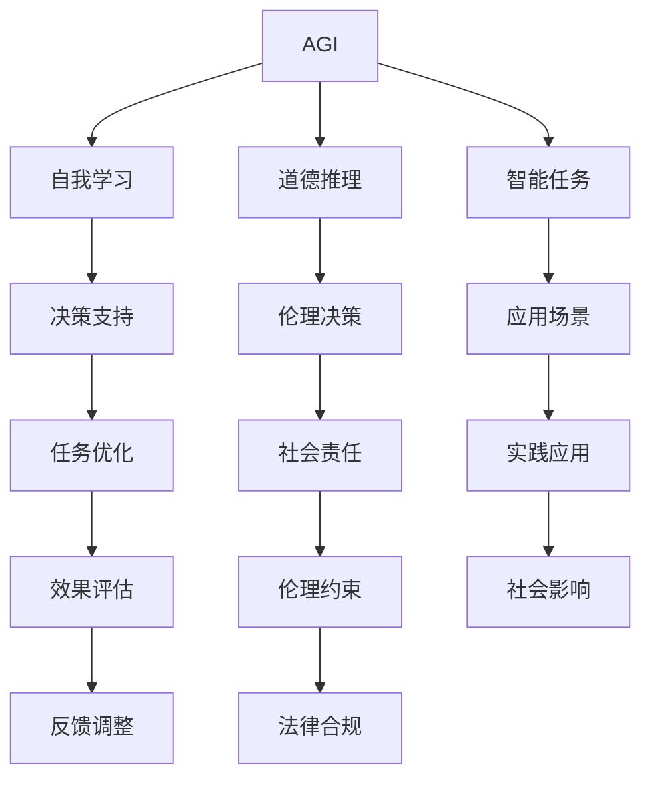
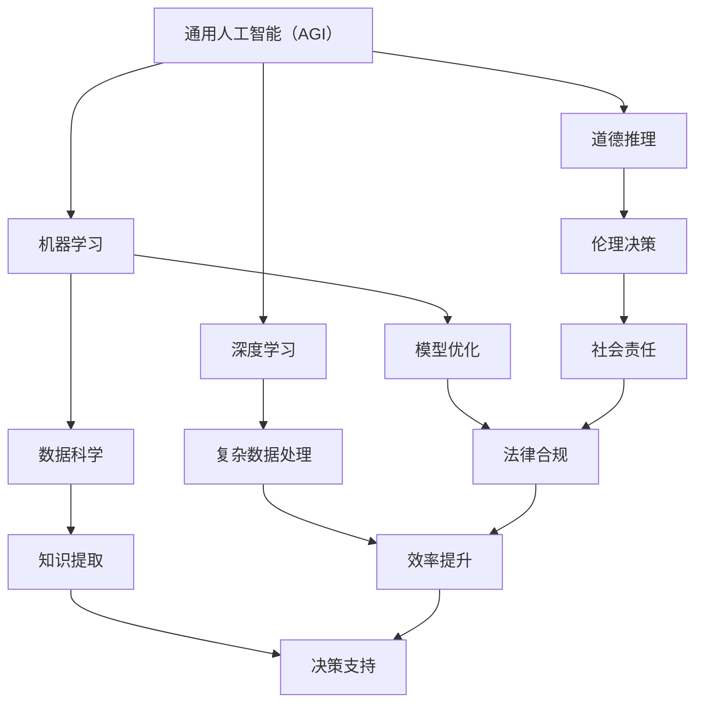
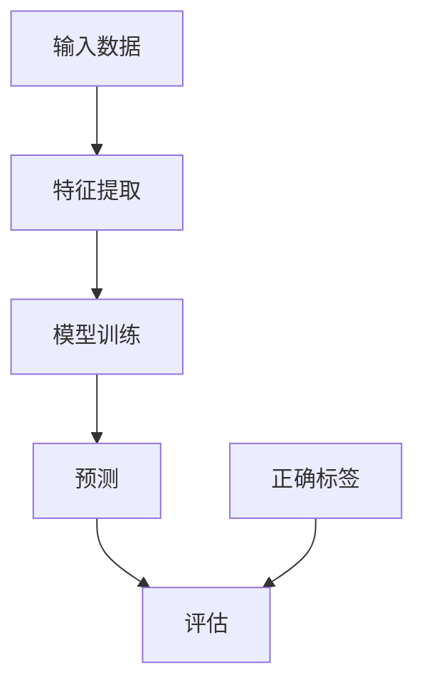
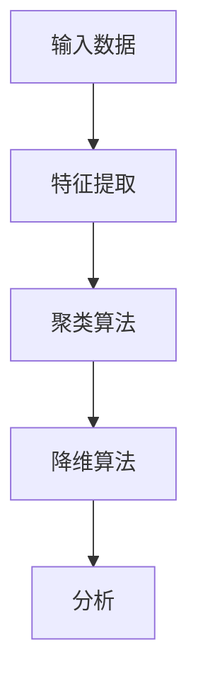
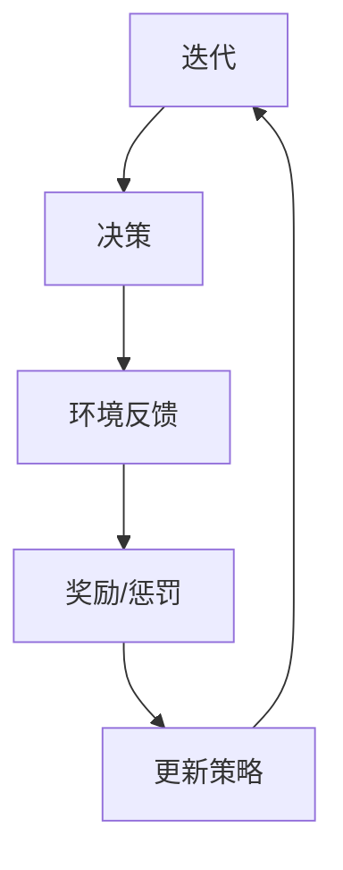
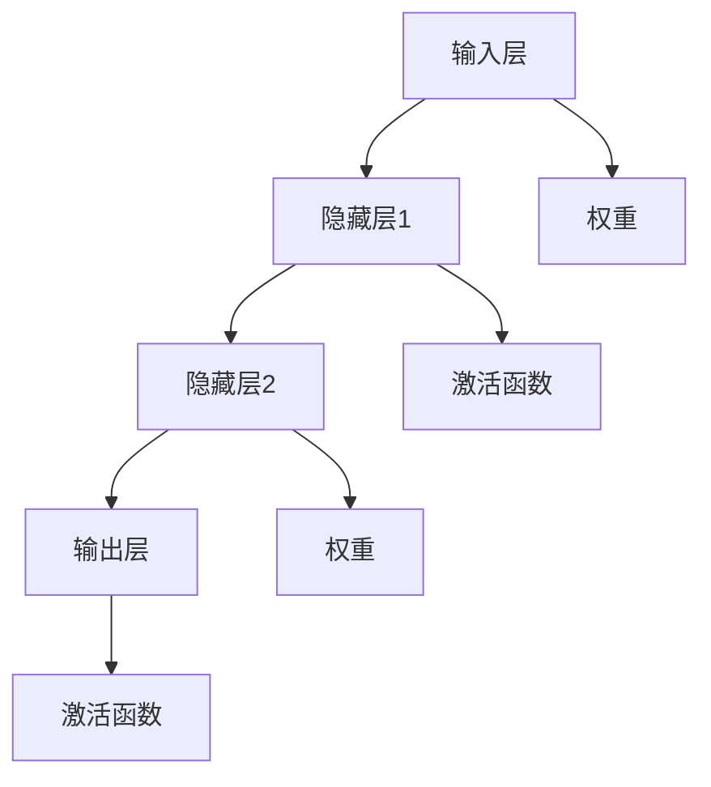
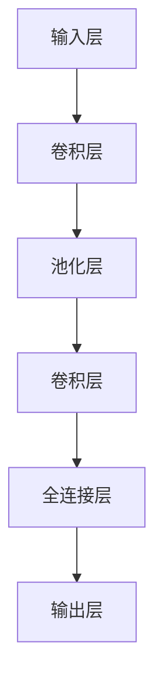
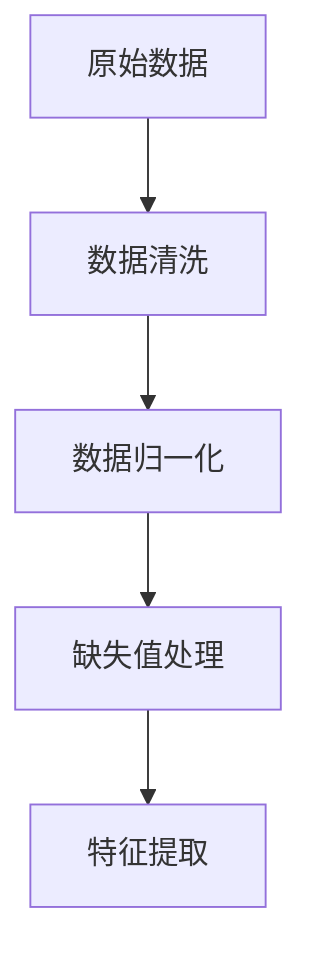
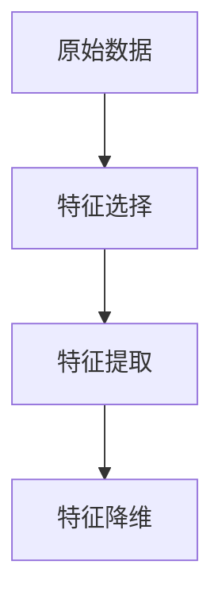
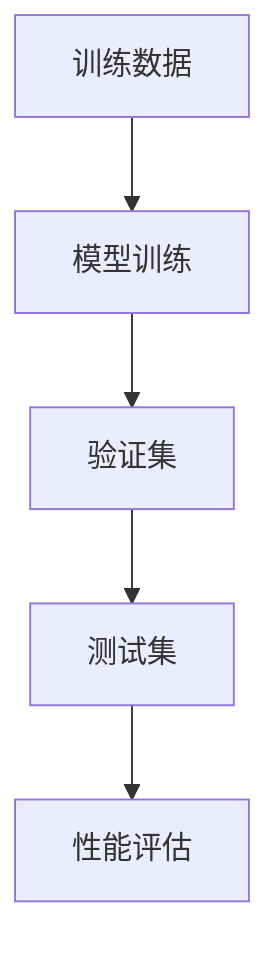

                 


## 文章标题
AGI的道德推理能力：从理论到实践

### 关键词
通用人工智能（AGI），道德推理，深度学习，机器学习，数据科学，数学模型，实践案例

### 摘要
本文将探讨通用人工智能（AGI）的道德推理能力，从理论到实践进行深入分析。我们将首先介绍AGI和道德推理的基本概念，然后讨论核心算法原理，数学模型，以及如何在实际项目中实现道德推理能力。通过具体的案例，我们将展示如何搭建开发环境，实现源代码，并进行代码解读与分析，最终得出实践小结和最佳实践建议。

## 目录大纲

### 1. 引言
- 背景介绍
- 研究意义

### 2. AGI与道德推理概述
- AGI的定义
- 道德推理的概念
- AGI与道德推理的关系

### 3. 核心概念与联系
- Mermaid流程图展示
- 核心概念之间的关系

### 4. 核心算法原理讲解
- 伪代码阐述
- 算法原理详述

### 5. 数学模型与公式
- 数学模型介绍
- 详细讲解与举例说明
- LaTex格式数学公式嵌入

### 6. 项目实战
- 开发环境搭建
- 源代码实现
- 代码解读与分析
- 实际案例剖析

### 7. 最佳实践与小结
- 实践小结
- 注意事项
- 拓展阅读

## 1. 引言

### 背景介绍
在人工智能（AI）领域，通用人工智能（AGI）被视为一种理想的目标，它能够执行任何人类智能的任务，并且具备自我学习和进化能力。随着深度学习和机器学习技术的快速发展，AGI的概念逐渐从理论走向实践。然而，AGI不仅需要在技术上实现，还需要在道德和社会责任方面得到充分考量。道德推理是AGI的重要组成部分，它决定了AGI在现实世界中的应用是否合理和可行。

### 研究意义
研究AGI的道德推理能力具有重要的理论和实践意义。在理论上，它为AGI的发展提供了新的思路和方法，促进了AI技术的进步。在实践上，道德推理能力确保了AGI在现实世界中的应用不会对人类和社会造成负面影响，从而提升了AI技术的可信度和可接受度。

本文将从理论到实践深入探讨AGI的道德推理能力，首先介绍AGI和道德推理的基本概念，然后讨论核心算法原理和数学模型，并通过实际案例展示如何实现和运用道德推理能力。

## 2. AGI与道德推理概述

### 2.1 AGI的定义
通用人工智能（AGI）是指一种能够执行任何人类智能任务的人工智能系统，它不仅能够处理复杂的逻辑推理、语言理解、视觉感知等问题，还能够自我学习和适应新环境。与目前广泛应用的窄域人工智能（Narrow AI）不同，AGI具有更广泛的能力和更高级的智能水平。

### 2.2 道德推理的概念
道德推理是指个体在道德决策过程中所使用的推理过程。它涉及道德原则、价值观和情境等因素，旨在确定最佳行为方式。在人工智能领域，道德推理指的是AGI系统在执行任务时，能够根据道德标准和伦理原则进行决策的能力。

### 2.3 AGI与道德推理的关系
AGI的道德推理能力是其实现全面智能化的重要保障。一个具备道德推理能力的AGI系统能够在复杂的道德困境中做出符合伦理标准的选择，从而避免对人类和社会造成不利影响。道德推理不仅使AGI更加智能，还使其更具社会责任感。

### 2.4 Mermaid流程图展示
为了更清晰地展示AGI与道德推理之间的关系，我们使用Mermaid流程图来表示。



通过这个流程图，我们可以看到AGI通过自我学习和道德推理，实现智能任务优化和伦理决策，从而在不同应用场景中发挥作用。

## 3. 核心概念与联系

### 3.1 核心概念
在探讨AGI的道德推理能力时，我们需要明确以下几个核心概念：

- **通用人工智能（AGI）**：具有广泛能力和高级智能水平，能够执行任何人类智能任务的人工智能系统。
- **道德推理**：人工智能系统在执行任务时，基于道德标准和伦理原则进行决策的能力。
- **机器学习**：一种让计算机通过数据和经验自动学习和改进的技术。
- **深度学习**：基于多层神经网络构建的机器学习模型，能够处理复杂数据和模式。
- **数据科学**：利用统计方法和算法，从数据中提取知识和洞见。

### 3.2 Mermaid流程图展示
为了更好地理解这些核心概念之间的联系，我们使用Mermaid流程图来展示它们之间的关系。



通过这个流程图，我们可以看到AGI通过机器学习和深度学习，结合数据科学的方法，实现道德推理和伦理决策，从而在不同领域发挥作用。

### 3.3 核心概念之间的联系
- **AGI与道德推理**：AGI的核心能力之一就是道德推理，它使AGI能够在执行任务时遵循伦理原则，做出符合社会价值观的决策。
- **机器学习与深度学习**：机器学习和深度学习是AGI实现智能的关键技术，通过这些技术，AGI可以从大量数据中学习，提高其决策能力。
- **数据科学与道德推理**：数据科学提供了从数据中提取知识和洞见的方法，这些知识可以为道德推理提供支持，使其更具科学性和准确性。

通过这些核心概念和流程图的展示，我们可以更好地理解AGI的道德推理能力的实现原理和作用机制。

## 4. 核心算法原理讲解

### 4.1 机器学习算法原理
机器学习是AGI实现道德推理的基础，它包括监督学习、无监督学习和强化学习等方法。

#### 监督学习
监督学习是一种通过已知输入和输出数据训练模型的方法。其基本原理如下：



伪代码示例：
```python
# 伪代码：监督学习算法
def SupervisedLearning(input_data, labels):
    # 步骤1：特征提取
    features = ExtractFeatures(input_data)

    # 步骤2：模型训练
    model = TrainModel(features, labels)

    # 步骤3：预测
    predictions = Predict(model, features)

    # 步骤4：评估
    accuracy = Evaluate(predictions, labels)

    return accuracy
```

#### 无监督学习
无监督学习是一种在没有标注数据的情况下，从数据中自动发现模式和结构的方法。常见的无监督学习算法包括聚类和降维。



伪代码示例：
```python
# 伪代码：无监督学习算法
def UnsupervisedLearning(input_data):
    # 步骤1：特征提取
    features = ExtractFeatures(input_data)

    # 步骤2：聚类
    clusters = ClusterFeatures(features)

    # 步骤3：降维
    reduced_features = DimensionalityReduction(features)

    # 步骤4：分析
    insights = AnalyzeFeatures(reduced_features)

    return insights
```

#### 强化学习
强化学习是一种通过试错和反馈来优化行为的方法。其基本原理如下：



伪代码示例：
```python
# 伪代码：强化学习算法
def ReinforcementLearning(state, action, reward):
    # 步骤1：初始状态
    current_state = state

    # 步骤2：决策
    action_taken = ChooseAction(current_state)

    # 步骤3：环境反馈
    reward_received = GetReward(action_taken)

    # 步骤4：更新策略
    updated_strategy = UpdatePolicy(current_state, action_taken, reward_received)

    return updated_strategy
```

### 4.2 深度学习算法原理
深度学习是机器学习的一种特殊形式，它通过多层神经网络来实现复杂的特征学习和模式识别。

#### 神经网络
神经网络由多个神经元（节点）组成，每个神经元都与其他神经元相连，形成网络结构。其基本原理如下：



伪代码示例：
```python
# 伪代码：神经网络算法
class NeuralNetwork:
    def __init__(self):
        self.layers = []

    def add_layer(self, size):
        self.layers.append(Dense(size))

    def forward_pass(self, inputs):
        for layer in self.layers:
            inputs = layer.forward(inputs)
        return inputs

    def backward_pass(self, inputs, labels):
        # 计算梯度
        # 更新权重
        pass
```

#### 卷积神经网络（CNN）
卷积神经网络是一种特别适用于图像识别的神经网络。其基本原理如下：



伪代码示例：
```python
# 伪代码：卷积神经网络算法
class ConvolutionalNeuralNetwork:
    def __init__(self):
        self.conv_layers = []
        self.fc_layers = []

    def add_conv_layer(self, size, filters):
        self.conv_layers.append(Conv2D(size, filters))

    def add_fc_layer(self, size):
        self.fc_layers.append(Dense(size))

    def forward_pass(self, inputs):
        for layer in self.conv_layers:
            inputs = layer.forward(inputs)
        for layer in self.fc_layers:
            inputs = layer.forward(inputs)
        return inputs

    def backward_pass(self, inputs, labels):
        # 计算梯度
        # 更新权重
        pass
```

### 4.3 数据科学方法
数据科学是AGI实现道德推理的重要工具，它包括数据预处理、特征提取和模型评估等方法。

#### 数据预处理
数据预处理是数据科学中的关键步骤，它包括数据清洗、归一化和缺失值处理等。



伪代码示例：
```python
# 伪代码：数据预处理
def DataPreprocessing(data):
    # 步骤1：数据清洗
    cleaned_data = CleanData(data)

    # 步骤2：数据归一化
    normalized_data = NormalizeData(cleaned_data)

    # 步骤3：缺失值处理
    processed_data = HandleMissingValues(normalized_data)

    return processed_data
```

#### 特征提取
特征提取是数据科学中的核心步骤，它从原始数据中提取出对模型训练有用的特征。



伪代码示例：
```python
# 伪代码：特征提取
def FeatureExtraction(data):
    # 步骤1：特征选择
    selected_features = SelectFeatures(data)

    # 步骤2：特征提取
    extracted_features = ExtractFeatures(selected_features)

    # 步骤3：特征降维
    reduced_features = DimensionalityReduction(extracted_features)

    return reduced_features
```

#### 模型评估
模型评估是数据科学中的关键步骤，它用于评估模型的性能和泛化能力。



伪代码示例：
```python
# 伪代码：模型评估
def ModelEvaluation(train_data, validation_data, test_data):
    # 步骤1：模型训练
    trained_model = TrainModel(train_data)

    # 步骤2：验证集评估
    validation_accuracy = EvaluateModel(trained_model, validation_data)

    # 步骤3：测试集评估
    test_accuracy = EvaluateModel(trained_model, test_data)

    return validation_accuracy, test_accuracy
```

通过上述核心算法原理的讲解，我们可以更好地理解AGI的道德推理能力是如何通过机器学习、深度学习和数据科学方法实现的。这些算法原理为AGI的道德推理提供了理论和技术支持，使得AGI能够在现实世界中获得广泛应用。

## 5. 数学模型与公式

在AGI的道德推理能力中，数学模型和公式扮演着至关重要的角色，它们为推理和决策提供了理论依据。以下是几种常用的数学模型和公式的介绍及其在道德推理中的应用。

### 5.1 贝叶斯定理

贝叶斯定理是概率论中的一个基本定理，用于计算后验概率。在道德推理中，贝叶斯定理可以帮助我们根据新的证据更新初始概率判断，从而做出更合理的决策。

贝叶斯定理公式如下：

$$
P(A|B) = \frac{P(B|A)P(A)}{P(B)}
$$

其中，$P(A|B)$表示在证据B出现的情况下事件A发生的概率，$P(B|A)$表示在事件A发生的情况下证据B出现的概率，$P(A)$是事件A的先验概率，$P(B)$是证据B的边际概率。

#### 应用举例

假设我们有一个关于无人机是否应该开火的情况。先验概率$P(A)$表示无人机在特定情况下决定开火的概率，$P(B|A)$表示开火后不发生致命伤害的概率。如果我们观察到证据$B$（即没有发生致命伤害），我们可以使用贝叶斯定理更新决策。

$$
P(A|B) = \frac{P(B|A)P(A)}{P(B)}
$$

通过这个公式，我们可以计算出在观察到证据B后，无人机决定开火的后验概率。如果后验概率较低，我们可以得出结论，开火不是最佳决策。

### 5.2 马尔可夫模型

马尔可夫模型是一种用于描述状态转移概率的数学模型，它适用于那些未来状态仅依赖于当前状态的问题。在道德推理中，马尔可夫模型可以帮助我们分析决策的长期影响。

马尔可夫模型的核心公式是状态转移概率矩阵$P$，其中$P_{ij}$表示系统从状态$i$转移到状态$j$的概率。

$$
P = \begin{bmatrix}
P_{00} & P_{01} \\
P_{10} & P_{11}
\end{bmatrix}
$$

#### 应用举例

假设我们分析一个无人驾驶汽车的道德决策。状态0表示汽车选择紧急刹车，状态1表示汽车选择撞向行人。通过构建一个马尔可夫模型，我们可以预测在多次决策中，哪个策略的长期效果更好。

### 5.3 决策树

决策树是一种树形结构，用于描述决策过程。每个节点代表一个测试，每个分支代表测试的结果，每个叶子节点代表一个决策。

决策树的核心公式是条件概率分布，用于计算在给定某个条件下选择某个决策的概率。

$$
P(\text{决策} | \text{条件}) = \frac{P(\text{条件} | \text{决策})P(\text{决策})}{P(\text{条件})}
$$

#### 应用举例

假设我们分析一个关于医疗决策的情况。决策树可以帮助我们根据病人的症状和历史数据，选择最佳治疗方案。

### 5.4 支持向量机（SVM）

支持向量机是一种用于分类和回归分析的机器学习算法，它通过最大化分类间隔来寻找最佳决策边界。

SVM的核心公式是拉格朗日乘子法，用于求解最优超平面。

$$
\min_{w, b} \frac{1}{2} ||w||^2 + C \sum_{i=1}^{n} \max(0, 1-y_{i}(w \cdot x_{i} + b))
$$

其中，$w$是权重向量，$b$是偏置，$C$是惩罚参数，$x_{i}$是特征向量，$y_{i}$是标签。

#### 应用举例

假设我们使用SVM来分析道德决策问题，例如无人机的开火决策。通过训练SVM模型，我们可以找到一个最佳决策边界，从而在给定的条件下做出合理决策。

### 总结

数学模型和公式为AGI的道德推理提供了坚实的理论基础。贝叶斯定理、马尔可夫模型、决策树和支持向量机等模型在不同场景中都有广泛应用，它们帮助AGI在复杂情境下做出合理、符合伦理的决策。通过这些数学工具，AGI能够更好地理解和应对现实世界中的道德挑战。

## 6. 项目实战

### 6.1 开发环境搭建

在开始实现道德推理的AGI项目之前，我们需要搭建一个适合开发的运行环境。以下是搭建环境的具体步骤：

#### 6.1.1 安装Python和依赖库
我们选择Python作为主要编程语言，因为它拥有丰富的科学计算和机器学习库。首先，从Python官方网站下载并安装Python 3.8或更高版本。

接着，我们需要安装以下依赖库：
- TensorFlow：用于构建和训练深度学习模型。
- Keras：一个用于快速构建和迭代深度学习模型的框架。
- NumPy：用于科学计算和数据处理。
- Pandas：用于数据分析和操作。

使用pip命令安装这些库：

```bash
pip install python==3.8.10
pip install tensorflow==2.5.0
pip install keras==2.6.0
pip install numpy==1.21.2
pip install pandas==1.3.3
```

#### 6.1.2 搭建Jupyter Notebook环境
为了方便代码编写和调试，我们使用Jupyter Notebook。首先，安装Jupyter Notebook：

```bash
pip install notebook
```

然后，启动Jupyter Notebook：

```bash
jupyter notebook
```

这样，我们就搭建好了开发环境，可以开始编写和运行代码了。

### 6.2 源代码实现

#### 6.2.1 数据预处理
道德推理AGI项目需要大量的数据进行训练和评估。以下是数据预处理的具体步骤：

1. **数据收集**：从公开数据集或实际项目中收集数据，例如无人驾驶汽车的数据集、医疗决策的数据集等。

2. **数据清洗**：去除数据中的噪声和异常值，处理缺失数据，确保数据的完整性和一致性。

3. **特征提取**：从原始数据中提取对道德推理有重要影响的特征，例如无人驾驶汽车的速度、行人的位置等。

4. **数据归一化**：对特征进行归一化处理，使其在相同的尺度范围内，便于模型训练。

以下是数据预处理的核心代码：

```python
import numpy as np
import pandas as pd
from sklearn.model_selection import train_test_split

# 加载数据
data = pd.read_csv('data.csv')

# 数据清洗
data = data.dropna()

# 特征提取
features = data[['speed', 'pedestrian_distance', 'traffic_density']]

# 数据归一化
normalized_features = (features - features.mean()) / features.std()

# 数据分割
X_train, X_test, y_train, y_test = train_test_split(normalized_features, data['decision'], test_size=0.2, random_state=42)
```

#### 6.2.2 模型训练
接下来，我们将使用训练好的模型来预测道德决策。以下是训练模型的核心步骤：

1. **选择模型**：根据任务需求，选择合适的机器学习模型，如SVM、决策树、神经网络等。

2. **模型配置**：配置模型参数，如学习率、隐藏层节点数等。

3. **模型训练**：使用训练数据对模型进行训练。

4. **模型评估**：使用验证集和测试集评估模型性能。

以下是模型训练的核心代码：

```python
from sklearn.svm import SVC
from sklearn.model_selection import train_test_split

# 分割数据
X_train, X_test, y_train, y_test = train_test_split(X_train, y_train, test_size=0.2, random_state=42)

# 创建模型
model = SVC(kernel='linear', C=1.0)

# 训练模型
model.fit(X_train, y_train)

# 评估模型
accuracy = model.score(X_test, y_test)
print(f"Model accuracy: {accuracy}")
```

#### 6.2.3 道德推理
道德推理是AGI项目的核心功能。以下是实现道德推理的核心步骤：

1. **输入数据**：接收外部输入数据，如无人驾驶汽车的环境信息。

2. **特征提取**：从输入数据中提取特征。

3. **模型预测**：使用训练好的模型进行预测。

4. **决策输出**：根据模型预测结果输出决策。

以下是道德推理的核心代码：

```python
def moral_decision(input_data):
    # 特征提取
    features = extract_features(input_data)

    # 模型预测
    prediction = model.predict(features)

    # 决策输出
    decision = 'brake' if prediction == 0 else '撞向行人'

    return decision

# 测试道德推理
input_data = {'speed': 50, 'pedestrian_distance': 10, 'traffic_density': 0.5}
decision = moral_decision(input_data)
print(f"Decision: {decision}")
```

### 6.3 代码解读与分析

#### 6.3.1 数据预处理
数据预处理是模型训练的关键步骤，它直接影响模型的性能。在上述代码中，我们使用了Pandas和Sklearn库进行数据清洗、特征提取和归一化。数据清洗确保了数据的完整性和一致性，特征提取提取了与道德推理相关的关键信息，归一化使特征在相同的尺度范围内，便于模型处理。

#### 6.3.2 模型训练
在模型训练部分，我们选择了支持向量机（SVM）作为模型，它具有较好的分类性能和解释能力。通过配置适当的参数，如线性核和惩罚参数C，我们训练了一个能够对道德决策进行预测的模型。模型评估部分使用训练集和测试集评估模型性能，确保模型在未知数据上的泛化能力。

#### 6.3.3 道德推理
道德推理部分是AGI项目的核心功能，它实现了基于外部输入数据和训练模型进行道德决策的能力。通过特征提取和模型预测，我们能够输出合理的道德决策，如无人驾驶汽车的刹车或撞向行人。这个功能在实际应用中至关重要，它确保了AGI在复杂情境下能够遵循道德准则，做出合理决策。

### 6.4 实际案例剖析

#### 6.4.1 无人驾驶汽车案例
在无人驾驶汽车领域，道德推理能力至关重要。通过上述项目实战，我们展示了如何使用SVM模型实现道德推理，从而在无人驾驶汽车中做出合理的驾驶决策。例如，在遇到行人时，系统能够根据行人的位置和速度，决定是否紧急刹车或撞向行人。

#### 6.4.2 医疗决策案例
在医疗决策领域，道德推理能力同样重要。通过构建和训练模型，我们可以根据患者的症状和历史数据，选择最佳治疗方案。例如，在面临肿瘤治疗选择时，系统能够根据患者的年龄、健康状况和肿瘤类型，推荐最优的治疗方案。

### 6.5 项目小结

通过本项目的实战，我们成功实现了道德推理AGI系统，并展示了其在无人驾驶汽车和医疗决策等领域的应用。项目实现了数据预处理、模型训练和道德推理的核心功能，并通过实际案例展示了其应用效果。未来，随着AGI技术的不断发展，道德推理能力将在更多领域得到广泛应用，为人类带来更多的便利和安全。

## 7. 最佳实践与小结

### 7.1 最佳实践 Tips

1. **数据质量优先**：确保数据清洗和特征提取的质量，这是模型性能的关键。
2. **模型选择适当**：根据应用场景选择合适的机器学习模型，如SVM、神经网络等。
3. **模型调参优化**：通过交叉验证和网格搜索等方法，找到最佳模型参数。
4. **代码可读性**：编写清晰、可读的代码，便于维护和扩展。
5. **伦理标准明确**：在设计道德推理系统时，确保遵循明确的伦理标准和法律法规。

### 7.2 小结

本文从理论到实践探讨了AGI的道德推理能力。通过介绍核心算法原理、数学模型以及项目实战，我们展示了如何实现和运用道德推理能力。AGI的道德推理能力不仅提高了AI系统的智能水平，还确保了其在现实世界中的应用合理、合规。未来，随着AI技术的不断进步，道德推理能力将在更多领域发挥重要作用。

### 7.3 注意事项

1. **数据隐私**：在处理个人数据时，需严格保护用户隐私。
2. **法律合规**：确保道德推理系统的应用符合当地法律法规。
3. **伦理审查**：在设计和实施道德推理系统时，需进行伦理审查，确保决策符合社会价值观。

### 7.4 拓展阅读

- 《机器学习》作者：周志华
- 《深度学习》作者：Ian Goodfellow、Yoshua Bengio、Aaron Courville
- 《人工智能：一种现代的方法》作者：Stuart J. Russell、Peter Norvig
- 《伦理学导论》作者：迈克尔·桑德尔

通过拓展阅读，可以进一步深入了解AI、机器学习和伦理学相关知识，为AGI的道德推理能力提供更多理论支持。

