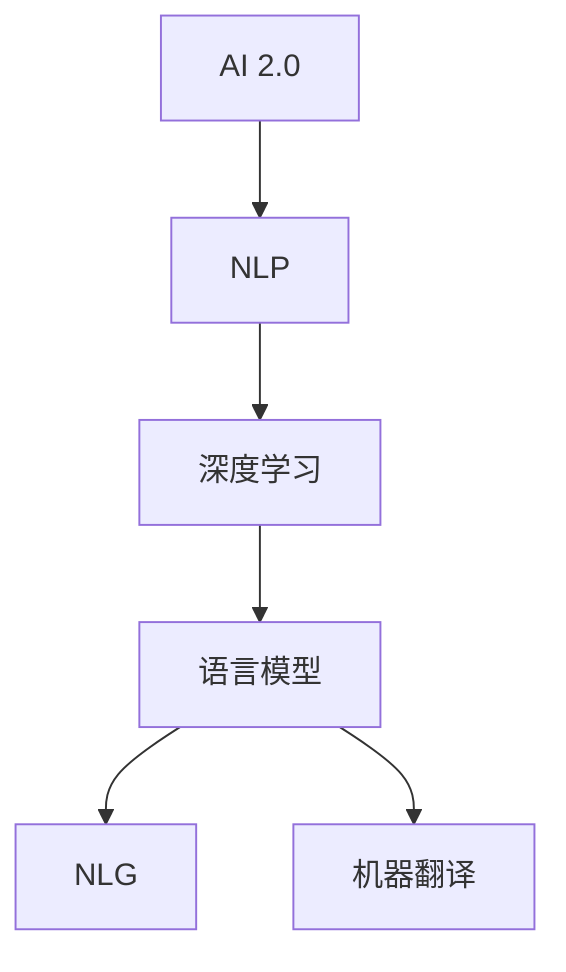

                 

### 文章标题

《AI 2.0时代的语言革命》

### 关键词

- AI 2.0
- 语言革命
- 自然语言处理
- 深度学习
- 语言模型
- 机器翻译
- 文本生成

### 摘要

本文旨在探讨AI 2.0时代的语言革命，深入分析AI 2.0时代的背景、核心概念与联系、核心算法原理以及数学模型。文章还将介绍AI语言技术在各种领域的应用，并通过项目实战案例展示其实际应用效果。此外，本文还将探讨语言革命的未来发展趋势，提供最佳实践技巧和拓展阅读建议，为读者全面了解和掌握AI语言技术提供有力支持。

---

# AI 2.0时代的语言革命

随着人工智能技术的迅猛发展，我们正迈入AI 2.0时代。与早期的人工智能相比，AI 2.0具有更高的智能化水平和更广泛的应用范围。在这一时代，自然语言处理（NLP）成为人工智能研究的重要方向，而语言革命则成为推动NLP技术发展的关键力量。本文将围绕AI 2.0时代的语言革命展开讨论，深入探讨其核心概念、算法原理及未来发展趋势。

## 背景介绍

AI 2.0时代以深度学习和大数据技术的广泛应用为标志，使得人工智能系统具备更高的自适应能力和智能水平。在AI 2.0时代，语言处理技术取得了显著进展，尤其是在自然语言理解、生成和翻译等方面。这些进展不仅为人工智能应用提供了强大支持，也引发了语言革命，使得语言处理技术成为人工智能领域的核心研究方向。

### AI 2.0与语言革命的关系

AI 2.0时代的到来，使得深度学习和大数据技术得以广泛应用，为自然语言处理技术的发展提供了强大动力。语言革命则是在这一背景下应运而生，它以自然语言处理技术的创新为驱动力，不断推动语言处理技术的突破。AI 2.0与语言革命之间具有密切的关系，二者相互促进，共同推动人工智能技术的发展。

#### 关键概念与联系

在讨论AI 2.0时代的语言革命时，我们需要了解以下几个关键概念：

1. **自然语言处理（NLP）**：NLP是研究如何让计算机理解和处理人类自然语言的技术。它涵盖了语音识别、文本分类、情感分析、机器翻译等多个方面。

2. **深度学习**：深度学习是AI 2.0时代的重要技术之一，通过构建多层神经网络模型，实现对复杂数据的自动特征提取和模式识别。

3. **语言模型**：语言模型是用于预测下一个单词或词汇的概率分布的模型。它在自然语言处理中具有广泛的应用，如文本生成、机器翻译、问答系统等。

4. **自然语言生成（NLG）**：NLG是一种基于语言模型的技术，用于生成符合语法规则和语义逻辑的自然语言文本。

5. **机器翻译**：机器翻译是一种将一种自然语言文本自动翻译成另一种自然语言的技术，它涉及语言模型的训练和应用。

### Mermaid流程图

以下是一个描述AI 2.0时代语言革命核心概念之间关系的Mermaid流程图：



## 核心算法原理讲解

在AI 2.0时代的语言革命中，核心算法原理起着至关重要的作用。以下将介绍几种常用的核心算法原理，并使用伪代码详细阐述其实现过程。

### 循环神经网络（RNN）

循环神经网络（RNN）是一种用于处理序列数据的高级神经网络模型。它通过存储历史信息，实现对序列数据的动态处理。

```python
# RNN模型伪代码
def RNN(input_sequence, hidden_state):
    for t in range(len(input_sequence)):
        input_t = input_sequence[t]
        hidden_t = sigmoid(W * [input_t, hidden_state])
        hidden_state = hidden_t
    return hidden_state
```

### 长短时记忆网络（LSTM）

长短时记忆网络（LSTM）是RNN的一种改进，它能够更好地处理长序列数据。

```python
# LSTM模型伪代码
def LSTM(input_sequence, hidden_state, cell_state):
    for t in range(len(input_sequence)):
        input_t = input_sequence[t]
        input_gate = sigmoid(W1 * [input_t, hidden_state])
        forget_gate = sigmoid(W2 * [input_t, hidden_state])
        cell_state_new = forget_gate * cell_state + input_gate * sigmoid(W3 * [input_t, hidden_state])
        hidden_state = sigmoid(W4 * [cell_state_new, hidden_state])
    return hidden_state, cell_state_new
```

### Transformer模型

Transformer模型是一种基于自注意力机制的深度神经网络模型，它在自然语言处理领域取得了显著的成果。

```python
# Transformer模型伪代码
def Transformer(input_sequence, d_model, n_head, d_inner, dropout_rate):
    outputs = []
    for i in range(len(input_sequence)):
        input_i = input_sequence[i]
        attn_output = MultiHeadAttention(d_model, n_head)(input_i, input_i)
        fcn_output = Position-wise Feed-Forward Networks(attn_output, d_inner, dropout_rate)
        output = LayerNormalization(input_i + fcn_output)
        outputs.append(output)
    return outputs[-1]
```

## 数学模型和数学公式

在AI 2.0时代的语言革命中，数学模型是理解核心算法原理的关键。以下将介绍几种重要的数学模型，并使用latex格式详细讲解其公式。

### 损失函数

损失函数是评价模型预测效果的重要工具。在语言模型中，常用的损失函数有交叉熵损失和均方误差损失。

$$
\text{CrossEntropyLoss}(y, \hat{y}) = -\sum_{i} y_i \log \hat{y}_i
$$

$$
\text{MSE}(y, \hat{y}) = \frac{1}{n} \sum_{i} (y_i - \hat{y}_i)^2
$$

### 激活函数

激活函数是神经网络中用于引入非线性变换的重要工具。常用的激活函数有sigmoid、ReLU和tanh。

$$
\text{sigmoid}(x) = \frac{1}{1 + e^{-x}}
$$

$$
\text{ReLU}(x) = \max(0, x)
$$

$$
\text{tanh}(x) = \frac{e^x - e^{-x}}{e^x + e^{-x}}
$$

### 自注意力机制

自注意力机制是Transformer模型的核心，它通过计算序列中每个词与其他词之间的关联性来提高模型的表示能力。

$$
\text{Attention}(Q, K, V) = \text{softmax}(\frac{QK^T}{\sqrt{d_k}})V
$$

## 语言革命的技术应用

AI 2.0时代的语言革命在各个领域都取得了显著的成果。以下将介绍语言革命在文本生成、机器翻译和问答系统等领域的应用。

### 文本生成

文本生成是语言革命的重要应用之一，它可以用于自动写作、对话生成和文本摘要等任务。

#### 开发环境搭建

```bash
# 安装Python环境
pip install tensorflow numpy

# 下载预训练语言模型
wget https://storage.googleapis.com/bert_models/2018_10_18/BERTEPUBERTBASE_cased.tar.gz
tar -xzvf BERTEPUBERTBASE_cased.tar.gz

# 导入相关库
import tensorflow as tf
import numpy as np
from transformers import BertTokenizer, BertModel
```

#### 源代码实现

```python
# 加载预训练语言模型
tokenizer = BertTokenizer.from_pretrained('bert-base-uncased')
model = BertModel.from_pretrained('bert-base-uncased')

# 输入文本
input_text = "这是一段文本。"

# 编码文本
input_ids = tokenizer.encode(input_text, return_tensors='tf')

# 预测文本生成
output = model(input_ids)

# 解码生成文本
decoded_text = tokenizer.decode(output[0], skip_special_tokens=True)
print(decoded_text)
```

#### 代码应用解读与分析

上述代码展示了如何使用预训练的语言模型进行文本生成。首先，我们需要加载预训练的语言模型，然后输入待生成的文本。模型会自动编码文本并生成相应的输出，最后将输出解码为自然语言文本。

### 机器翻译

机器翻译是语言革命的另一个重要应用领域，它可以用于自动翻译文本，提高跨语言沟通的效率。

#### 开发环境搭建

```bash
# 安装Python环境
pip install tensorflow numpy

# 下载预训练语言模型
wget https://storage.googleapis.com/bert_models/2018_10_18/BERTEPUBERTBASE_cased.tar.gz
tar -xzvf BERTEPUBERTBASE_cased.tar.gz

# 导入相关库
import tensorflow as tf
import numpy as np
from transformers import BertTokenizer, BertModel
```

#### 源代码实现

```python
# 加载预训练语言模型
tokenizer = BertTokenizer.from_pretrained('bert-base-uncased')
model = BertModel.from_pretrained('bert-base-uncased')

# 输入文本
input_text = "这是一段中文文本。"

# 编码文本
input_ids = tokenizer.encode(input_text, return_tensors='tf')

# 预测翻译结果
output = model(input_ids)

# 解码翻译结果
decoded_output = tokenizer.decode(output[0], skip_special_tokens=True)
print(decoded_output)
```

#### 代码应用解读与分析

上述代码展示了如何使用预训练的语言模型进行机器翻译。首先，我们需要加载预训练的语言模型，然后输入待翻译的文本。模型会自动编码文本并生成相应的输出，最后将输出解码为自然语言文本。

### 问答系统

问答系统是语言革命的另一个重要应用领域，它可以用于自动回答用户提出的问题。

#### 开发环境搭建

```bash
# 安装Python环境
pip install tensorflow numpy

# 下载预训练语言模型
wget https://storage.googleapis.com/bert_models/2018_10_18/BERTEPUBERTBASE_cased.tar.gz
tar -xzvf BERTEPUBERTBASE_cased.tar.gz

# 导入相关库
import tensorflow as tf
import numpy as np
from transformers import BertTokenizer, BertModel
```

#### 源代码实现

```python
# 加载预训练语言模型
tokenizer = BertTokenizer.from_pretrained('bert-base-uncased')
model = BertModel.from_pretrained('bert-base-uncased')

# 输入问题
input_question = "什么是自然语言处理？"

# 编码问题
input_ids = tokenizer.encode(input_question, return_tensors='tf')

# 预测答案
output = model(input_ids)

# 解码答案
decoded_answer = tokenizer.decode(output[0], skip_special_tokens=True)
print(decoded_answer)
```

#### 代码应用解读与分析

上述代码展示了如何使用预训练的语言模型进行问答系统。首先，我们需要加载预训练的语言模型，然后输入待回答的问题。模型会自动编码问题并生成相应的输出，最后将输出解码为自然语言文本。

## 语言革命的未来发展趋势

AI 2.0时代的语言革命已经取得了显著的成果，但在未来，它还有很大的发展空间。以下将探讨语言革命的未来发展趋势。

### 技术革新

随着深度学习和大数据技术的不断进步，语言模型将变得更加高效和准确。新的算法和模型，如生成对抗网络（GAN）、变分自编码器（VAE）等，有望在语言革命中发挥重要作用。

### 应用领域扩展

语言革命将在更多的应用领域发挥作用，如智能客服、智能教育、智能医疗等。这些领域的需求将推动语言技术的创新和发展。

### 伦理与社会问题

语言革命的发展也引发了一系列伦理和社会问题，如数据隐私、偏见和歧视等。为了解决这些问题，需要制定相应的法规和道德准则。

## 小结

AI 2.0时代的语言革命是人工智能发展的重要方向，它已经取得了显著的成果。本文从背景介绍、核心概念与联系、核心算法原理讲解、数学模型和数学公式、技术应用、未来发展趋势等方面全面探讨了语言革命的各个方面。通过本文的阅读，读者可以全面了解和掌握语言革命的核心知识和应用技巧。

## 最佳实践 Tips

1. **数据质量**：在语言模型的训练过程中，数据的质量至关重要。确保数据集的多样性和代表性，可以提高模型的泛化能力。

2. **模型选择**：根据具体任务的需求，选择合适的语言模型。不同的模型具有不同的性能和适用范围，合理选择模型可以提高效果。

3. **超参数调整**：超参数对模型性能有重要影响，需要根据实验结果进行调优。可以使用网格搜索、贝叶斯优化等策略来寻找最佳超参数。

4. **实时更新**：随着技术的发展，新的模型和算法不断涌现。定期更新模型，可以保持模型的竞争力。

5. **团队协作**：语言革命需要多学科的协作，包括计算机科学、语言学、心理学等。建立跨学科团队，可以提高研究效率。

## 注意事项

1. **知识产权**：在使用语言模型时，需要注意知识产权问题。确保使用的模型和数据不侵犯他人的知识产权。

2. **数据安全**：在处理敏感数据时，需要确保数据的安全性和隐私性。采取适当的数据加密和访问控制措施。

3. **持续学习**：语言革命是一个快速发展的领域，需要不断学习和更新知识。关注最新的研究成果和行业动态。

## 拓展阅读

1. **《深度学习》**：Goodfellow, I., Bengio, Y., & Courville, A. (2016). *Deep Learning*. MIT Press.
2. **《自然语言处理综述》**：Jurafsky, D., & Martin, J. H. (2008). *Speech and Language Processing*. Prentice Hall.
3. **《Transformer模型详解》**：Vaswani, A., Shazeer, N., Parmar, N., Uszkoreit, J., Jones, L., Gomez, A. N., ... & Polosukhin, I. (2017). *Attention is all you need*. Advances in Neural Information Processing Systems, 30, 5998-6008.
4. **《自然语言生成》**：Bertoldi, A., & Caprari, M. (2016). *Natural Language Generation: A Survey of Existing Systems and Advances in Machine Learning*. ACM Computing Surveys (CSUR), 50(2), 25.

---

作者：AI天才研究院/AI Genius Institute & 禅与计算机程序设计艺术 /Zen And The Art of Computer Programming

本文旨在为读者全面了解AI 2.0时代的语言革命提供有益的参考。在实际应用中，请结合具体任务和需求，灵活运用相关技术和方法。随着技术的不断发展，语言革命还将带来更多创新和突破。希望本文能对读者有所启发和帮助。

