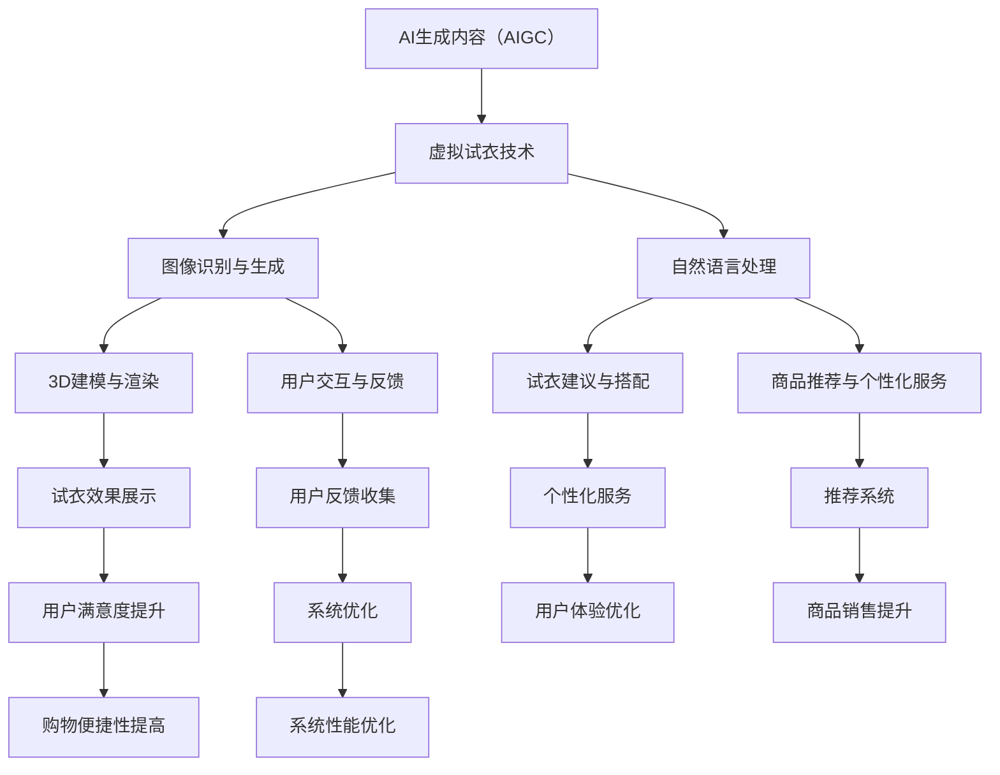

                 

### 引言

随着人工智能技术的快速发展，AIGC（AI Generated Content）逐渐成为虚拟试衣技术的重要推动力量。虚拟试衣技术作为一种将人工智能、图像处理、3D建模等技术与购物体验结合的创新方式，正逐步改变着线上购物的面貌。通过AIGC技术，虚拟试衣系统能够生成逼真的试衣效果，从而提升用户在购买过程中的体验。

本书旨在探讨AIGC在虚拟试衣技术中的应用，以及如何通过这项技术来重塑线上购物体验。我们将从基础概念出发，逐步深入探讨AIGC与虚拟试衣技术的结合点，分析其核心原理，并探讨其在实际应用中的挑战与机遇。

文章结构如下：

#### 第一部分：AIGC与虚拟试衣技术基础

- **第1章 AIGC与虚拟试衣技术概述**：介绍AIGC和虚拟试衣技术的基本概念，以及它们的发展历程。
- **第2章 AIGC技术原理**：详细阐述AIGC的核心技术原理，包括数据生成与处理、图像识别与生成、自然语言处理等。
- **第3章 虚拟试衣技术原理**：探讨虚拟试衣系统的架构、3D建模与渲染、用户交互与反馈等关键技术。

#### 第二部分：AIGC在虚拟试衣技术中的应用

- **第4章 AIGC在虚拟试衣中的应用场景**：分析AIGC在提升线上购物体验、个性化推荐、试衣建议等方面的应用。
- **第5章 AIGC在虚拟试衣中的技术挑战**：探讨AIGC在虚拟试衣技术中面临的数据隐私、算法公平性、系统性能优化等问题。
- **第6章 虚拟试衣技术的商业模式**：分析虚拟试衣技术的商业模式，以及其对传统零售和新零售模式的影响。

#### 第三部分：AIGC在虚拟试衣技术的项目实战

- **第7章 项目实战：基于AIGC的虚拟试衣系统开发**：介绍一个基于AIGC的虚拟试衣系统开发项目，包括项目需求分析、系统设计、代码实现和系统测试与优化。
- **第8章 项目实战：AIGC在个性化商品推荐中的应用**：探讨AIGC技术在个性化商品推荐中的应用，包括项目背景、系统架构、代码实现和用户反馈与优化。

通过本书的阅读，读者可以全面了解AIGC在虚拟试衣技术中的应用，掌握相关技术原理和实战技巧，为未来线上购物体验的提升提供新思路。

### 《AIGC在虚拟试衣技术中的应用：重塑线上购物体验》

#### 关键词

- AI生成内容（AIGC）
- 虚拟试衣技术
- 图像识别与生成
- 自然语言处理
- 线上购物体验
- 个性化推荐
- 数据隐私
- 算法公平性
- 系统性能优化

#### 摘要

本文旨在探讨AIGC（AI Generated Content）在虚拟试衣技术中的应用，以及其对线上购物体验的重塑作用。随着AI技术的不断发展，AIGC技术正逐渐应用于虚拟试衣领域，通过图像识别与生成、自然语言处理等技术，为用户提供更加逼真的试衣体验。本文首先介绍了AIGC和虚拟试衣技术的基本概念，然后深入分析了AIGC的技术原理，包括数据生成与处理、图像识别与生成、自然语言处理等。接着，本文探讨了AIGC在虚拟试衣技术中的应用场景，如提升线上购物体验、个性化推荐、试衣建议等。同时，本文还讨论了AIGC在虚拟试衣技术中面临的技术挑战，包括数据隐私、算法公平性、系统性能优化等问题。最后，本文通过两个项目实战案例，详细介绍了基于AIGC的虚拟试衣系统开发过程，以及AIGC在个性化商品推荐中的应用。通过本文的阅读，读者可以全面了解AIGC在虚拟试衣技术中的应用，掌握相关技术原理和实战技巧，为未来线上购物体验的提升提供新思路。

### 第一部分：AIGC与虚拟试衣技术基础

#### 第1章 AIGC与虚拟试衣技术概述

**1.1 AIGC的概念与发展**

AIGC，即AI Generated Content，是指通过人工智能技术自动生成内容的一种方式。它包括文本、图像、音频、视频等多种形式。AIGC技术的发展可以追溯到20世纪90年代，随着深度学习、神经网络等AI技术的进步，AIGC技术逐渐成熟，并在各个领域得到了广泛应用。

AIGC的发展经历了几个阶段。最初，AIGC主要集中在文本生成领域，如自动写作、机器翻译等。随后，随着图像识别、生成对抗网络（GAN）等技术的出现，AIGC扩展到了图像生成领域。近年来，随着语音识别、自然语言处理等技术的发展，AIGC在音频和视频领域也得到了广泛应用。

**1.2 虚拟试衣技术的发展历程**

虚拟试衣技术是一种结合了计算机视觉、图像处理、3D建模等技术的创新购物方式。它允许用户在线上试穿衣物，从而提高购物的满意度和效率。

虚拟试衣技术的发展可以分为几个阶段：

1. **早期阶段**：早期的虚拟试衣技术主要依赖于2D图像处理，通过对比用户试衣照片与实物照片的相似度来模拟试衣效果。这种方法的缺点是试衣效果不够逼真，用户体验较差。

2. **三维建模阶段**：随着3D扫描技术和3D建模软件的发展，虚拟试衣技术开始引入3D模型。通过3D扫描用户的身体数据，生成与用户身体匹配的虚拟模型，并在虚拟环境中试穿衣物。这种方法大大提高了试衣的逼真度，但需要较高硬件设备和专业操作技能。

3. **AI生成内容阶段**：近年来，AIGC技术的兴起为虚拟试衣技术注入了新的活力。通过AI生成内容，虚拟试衣技术可以实现更加真实的试衣效果，同时降低了硬件设备和操作技能的要求。

**1.3 AIGC与虚拟试衣技术的结合**

AIGC与虚拟试衣技术的结合主要体现在以下几个方面：

1. **图像识别与生成**：AIGC技术中的图像识别与生成能力可以用于生成用户试衣的3D模型，并实时渲染试衣效果。这种方法不仅提高了试衣的逼真度，还减少了用户的操作复杂度。

2. **自然语言处理**：AIGC中的自然语言处理技术可以用于分析用户的试衣反馈，生成个性化的试衣建议和搭配方案。这种方法有助于提升用户的购物体验和满意度。

3. **数据生成与处理**：AIGC技术可以自动生成大量的虚拟试衣数据，用于训练和优化虚拟试衣系统。这种方法有助于提高系统的准确性和效率。

通过以上分析，我们可以看到，AIGC技术为虚拟试衣技术带来了全新的发展机遇。随着AIGC技术的不断成熟，虚拟试衣技术将在未来进一步提升线上购物体验，为消费者带来更加便捷和个性化的购物体验。

#### 第2章 AIGC技术原理

**2.1 数据生成与处理**

数据生成与处理是AIGC技术的核心之一，它涉及到如何使用AI模型生成和优化数据。在虚拟试衣技术中，数据生成与处理的作用至关重要，它决定了试衣效果的真实性和用户的体验。

数据生成过程通常包括以下几个步骤：

1. **数据采集**：首先需要收集大量的图像、文本、音频等原始数据。这些数据可以来自于用户上传的照片、商品数据库、公开数据集等。

2. **数据预处理**：原始数据往往是不完整、噪声和冗余的。因此，需要通过数据预处理来清洗和标准化数据。预处理步骤包括数据清洗、归一化、数据增强等。

3. **数据生成模型**：使用AI模型，如生成对抗网络（GAN）或变分自编码器（VAE），来生成新的数据。这些模型通过学习大量数据，能够生成与原始数据相似的高质量数据。

在虚拟试衣技术中，数据生成模型可以用于以下几个方面：

1. **试衣图像生成**：通过生成模型生成用户试衣的图像。这种方法可以大大减少用户上传照片的需求，提高系统的响应速度。

2. **商品图像生成**：生成新的商品图像，用于展示不同的款式和颜色。这有助于提高用户的购物体验，减少浏览商品的时间。

3. **数据优化**：使用优化算法对生成的数据进行进一步的优化，以提高数据的准确性和鲁棒性。例如，通过图像增强技术提高图像的清晰度，或通过文本生成技术优化商品描述。

**2.2 图像识别与生成**

图像识别与生成是AIGC技术的另一个重要组成部分。图像识别技术可以用于分析用户上传的照片，识别出用户的身体特征、服装款式和颜色等信息。图像生成技术则可以基于这些特征生成用户试衣的3D模型。

图像识别与生成的过程通常包括以下几个步骤：

1. **特征提取**：通过卷积神经网络（CNN）或其他深度学习模型，从图像中提取关键特征。这些特征可以用于识别图像内容，如人体部位、服装款式等。

2. **分类与标注**：使用分类算法，如支持向量机（SVM）或深度神经网络（DNN），对提取出的特征进行分类和标注。这有助于对图像内容进行准确的识别和描述。

3. **图像生成**：使用生成模型，如生成对抗网络（GAN）或变分自编码器（VAE），根据分类结果生成用户试衣的3D模型。这些模型通过学习大量数据，能够生成高质量、逼真的图像。

在虚拟试衣技术中，图像识别与生成技术可以用于以下几个方面：

1. **试衣效果识别**：识别用户试衣的效果，如服装的合身度、颜色搭配等。这有助于系统生成个性化的试衣建议。

2. **服装风格识别**：识别用户喜欢的服装风格，用于推荐类似的商品。这有助于提高用户的购物体验和满意度。

3. **试衣图像生成**：根据用户上传的照片或描述，生成用户试衣的图像。这可以减少用户上传照片的需求，提高系统的响应速度。

**2.3 自然语言处理**

自然语言处理（NLP）是AIGC技术的另一个重要组成部分。NLP技术可以用于处理和理解自然语言文本，如用户评价、商品描述等。在虚拟试衣技术中，NLP技术可以用于以下几个方面：

1. **文本生成**：使用生成模型，如递归神经网络（RNN）或Transformer，生成自然语言文本。这可以用于生成商品描述、用户评价等。

2. **文本分析**：使用分类算法、情感分析等方法，分析用户评价和商品描述。这有助于了解用户需求和喜好，生成个性化的试衣建议。

3. **问答系统**：构建问答系统，回答用户的疑问。这可以提供更加便捷的购物体验，提高用户的满意度。

通过以上分析，我们可以看到，AIGC技术的数据生成与处理、图像识别与生成、自然语言处理等核心组成部分，共同构成了一个强大的技术框架，为虚拟试衣技术提供了坚实的基础。这些技术的应用不仅提高了试衣的逼真度和用户体验，还为线上购物体验的重塑提供了新的可能性。

#### 第3章 虚拟试衣技术原理

**3.1 虚拟试衣系统架构**

虚拟试衣系统架构主要包括以下几个关键组成部分：用户界面（UI）、后端服务、数据库和数据存储。

1. **用户界面（UI）**：用户界面是用户与虚拟试衣系统交互的入口。它包括试衣镜、购物车、用户评价等模块。用户界面需要具备简洁、直观、易操作的特点，以提供良好的用户体验。

2. **后端服务**：后端服务是虚拟试衣系统的核心，负责处理用户请求、数据存储和计算任务。后端服务通常包括以下几个模块：
   - **用户管理模块**：负责用户的注册、登录、权限管理等。
   - **试衣模块**：负责处理用户的试衣请求，包括用户照片的识别、3D模型生成、试衣效果的渲染等。
   - **推荐系统模块**：根据用户的行为和偏好，推荐类似的商品或试衣建议。
   - **评价系统模块**：收集用户的评价和反馈，用于优化虚拟试衣系统的性能。

3. **数据库和数据存储**：数据库和数据存储用于存储用户信息、商品信息、试衣数据等。常见的数据库类型包括关系型数据库（如MySQL、PostgreSQL）和NoSQL数据库（如MongoDB、Redis）。数据存储还需要考虑数据的安全性和可扩展性。

**3.2 3D建模与渲染**

3D建模与渲染是虚拟试衣技术的核心环节，决定了试衣效果的逼真度。

1. **3D建模**：3D建模是指创建数字化的三维模型。在虚拟试衣技术中，3D建模通常包括以下步骤：
   - **扫描**：使用3D扫描设备获取用户的身体数据，生成数字化的三维模型。
   - **建模**：通过3D建模软件（如Blender、Maya）对扫描结果进行编辑和处理，生成与用户身体匹配的服装模型。
   - **贴图与纹理**：为3D模型添加颜色、纹理等细节，以增强视觉效果。

2. **渲染**：渲染是将3D模型转换为二维图像的过程。在虚拟试衣技术中，渲染需要考虑以下几个方面：
   - **光照**：模拟真实世界的光照效果，包括太阳光、室内灯光等。
   - **阴影**：为3D模型添加阴影，以增强立体感。
   - **后处理**：对渲染结果进行后期处理，如颜色校正、滤镜等。

常见的渲染引擎包括Unity、Unreal Engine等。这些引擎提供了丰富的功能和插件，可以满足不同需求。

**3.3 用户交互与反馈**

用户交互与反馈是虚拟试衣系统的重要组成部分，直接影响用户体验。

1. **交互设计**：交互设计需要考虑用户的操作习惯和需求，提供直观、易操作的界面。常见的交互方式包括点击、滑动、拖动等。

2. **反馈机制**：反馈机制用于收集用户的反馈和评价，以优化系统性能和用户体验。反馈机制可以包括以下方面：
   - **即时反馈**：在用户操作过程中提供即时反馈，如试衣效果的变化、商品推荐等。
   - **用户评价**：收集用户的评价和意见，用于改进系统功能和服务。
   - **行为分析**：分析用户的行为数据，如试衣频率、商品购买率等，以了解用户需求和偏好。

通过以上分析，我们可以看到，虚拟试衣技术原理涵盖了系统架构、3D建模与渲染、用户交互与反馈等多个方面。这些技术的应用不仅提高了试衣的逼真度和用户体验，还为线上购物体验的重塑提供了新的可能性。

### 第二部分：AIGC在虚拟试衣技术中的应用

#### 第4章 AIGC在虚拟试衣中的应用场景

AIGC（AI Generated Content）在虚拟试衣技术中的应用场景非常广泛，通过图像识别与生成、自然语言处理等技术，为用户带来了全新的购物体验。以下是AIGC在虚拟试衣技术中的几个主要应用场景：

**4.1 线上购物体验提升**

AIGC技术可以显著提升线上购物的体验，让用户在购买前就能直观地看到衣服的试穿效果。具体应用如下：

1. **图像识别与生成**：通过AI图像识别技术，系统能够分析用户上传的照片或人体模型，识别出用户的身体特征和姿态。然后，利用图像生成技术生成用户试穿衣服的效果图。这种方法不仅减少了用户上传照片的需求，还提高了系统的响应速度和试衣效果的真实性。

2. **虚拟试衣镜**：虚拟试衣镜是AIGC技术在虚拟试衣中的一个重要应用。用户只需在摄像头前展示自己的身体姿态，系统就能实时生成试衣效果图，并在屏幕上显示。这种方法使得用户无需到实体店试衣，就能在家中轻松试穿多种衣服，提高了购物的便捷性和满意度。

3. **试衣视频生成**：AIGC技术还可以生成试衣视频，让用户更直观地了解试衣效果。通过自然语言处理技术，系统能够分析用户的试衣反馈，生成个性化的试衣视频，为用户提供更加全面的购物体验。

**4.2 商品推荐与个性化服务**

AIGC技术可以基于用户的试衣行为和偏好，提供更加精准的商品推荐和个性化服务。具体应用如下：

1. **试衣反馈分析**：通过自然语言处理技术，系统可以分析用户的试衣反馈，如用户对服装颜色、款式、合身度的评价。这些反馈数据可以帮助系统更好地了解用户需求，为用户提供个性化的商品推荐。

2. **个性化试衣建议**：根据用户的身体特征和试衣反馈，AIGC技术可以生成个性化的试衣建议，如推荐合适的尺码、颜色和款式。这种方法不仅提高了用户的购物体验，还能降低退换货率，提高商家和平台的运营效率。

3. **商品推荐系统**：AIGC技术可以用于构建高效的商品推荐系统。通过分析用户的购物历史、试衣数据、社交信息等，系统可以智能推荐用户可能感兴趣的商品。这种个性化推荐不仅提高了用户的购物满意度，还能增加平台的销售额。

**4.3 试衣建议与搭配**

AIGC技术还可以为用户提供更加详细的试衣建议和搭配方案，帮助用户更好地了解如何搭配衣物，提高穿搭的时尚度。

1. **试衣搭配建议**：根据用户的身体特征、试衣反馈和时尚趋势，AIGC技术可以生成个性化的试衣搭配建议。例如，系统可以推荐与某件衣服相搭配的鞋子、包包等配件，帮助用户打造完美的穿搭风格。

2. **时尚穿搭指南**：AIGC技术可以生成时尚穿搭指南，向用户展示不同场合的穿搭建议。这种指南不仅包含衣物搭配，还包括化妆、发型等全方位的时尚建议，帮助用户提升整体形象。

3. **虚拟试衣顾问**：通过AIGC技术，虚拟试衣顾问可以为用户提供一对一的购物咨询。用户可以与虚拟试衣顾问互动，询问穿搭建议、颜色选择等问题。这种方法不仅方便了用户，还能提高商家的服务水平。

通过以上分析，我们可以看到，AIGC技术在虚拟试衣技术中的应用场景非常丰富，通过图像识别与生成、自然语言处理等技术，为用户带来了更加便捷、个性化、真实的购物体验。随着AIGC技术的不断发展，虚拟试衣技术将在未来继续发挥重要作用，进一步改变线上购物的模式。

#### 第5章 AIGC在虚拟试衣中的技术挑战

尽管AIGC技术在虚拟试衣领域展现了巨大的潜力，但在实际应用过程中也面临诸多技术挑战。这些挑战主要集中在数据隐私、算法公平性和系统性能优化等方面。

**5.1 数据隐私**

在AIGC技术中，数据隐私是一个不可忽视的重要问题。虚拟试衣系统需要收集用户的身体数据、购买记录、试衣反馈等敏感信息，这些数据的泄露可能导致严重的隐私问题。具体挑战如下：

1. **数据泄露风险**：由于AIGC技术涉及大量用户数据的收集和处理，数据泄露的风险较高。一旦数据泄露，可能导致用户隐私受到侵犯，甚至被用于非法用途。

2. **数据存储与传输安全**：用户数据在存储和传输过程中需要确保安全。如果不采取有效的安全措施，数据在传输过程中可能被拦截、篡改或泄露。

3. **合规性问题**：不同国家和地区对数据隐私的法规要求不同。在全球化背景下，虚拟试衣系统需要遵守各国的数据隐私法规，如欧盟的GDPR（通用数据保护条例）。

**解决方案**：

1. **加密技术**：对用户数据进行加密处理，确保数据在存储和传输过程中的安全性。常用的加密算法包括AES、RSA等。

2. **访问控制**：实施严格的访问控制策略，确保只有授权人员才能访问敏感数据。例如，使用访问控制列表（ACL）和角色访问控制（RBAC）。

3. **数据匿名化**：在数据分析和建模过程中，对用户数据进行匿名化处理，去除直接识别用户身份的信息。这可以降低数据泄露的风险。

4. **法规遵守**：确保虚拟试衣系统符合各国的数据隐私法规，采取相应的合规措施，如数据保护认证（如ISO 27001）。

**5.2 算法公平性**

算法公平性是AIGC技术面临的另一个重要挑战。虚拟试衣系统需要处理大量的用户数据，这些数据可能存在偏见和不公平性，从而导致算法输出不公平的结果。具体挑战如下：

1. **数据偏见**：在数据收集和标注过程中，可能存在数据偏见，导致系统对某些用户群体或特征产生歧视。例如，如果试衣数据主要来源于某个特定地区或年龄段，系统可能对该地区或年龄段的用户产生偏见。

2. **算法偏见**：算法模型本身可能存在偏见，导致系统对某些用户群体或特征产生歧视。例如，如果算法模型在训练过程中使用了有偏见的数据集，可能会导致算法对某些用户群体或特征产生不公平的判断。

3. **用户体验差异**：不同的用户可能在使用虚拟试衣系统时获得不同的体验，这可能导致用户体验差异。例如，某些用户可能因为身体特征或试衣偏好与系统不符，而获得较差的试衣效果。

**解决方案**：

1. **数据多样性**：确保数据集的多样性，包括不同的用户群体、身体特征和试衣偏好。这有助于减少数据偏见，提高算法的公平性。

2. **偏见检测与校正**：在算法开发和部署过程中，使用偏见检测与校正技术，及时发现和纠正算法偏见。例如，可以使用公平性指标（如性别平等性、年龄包容性等）评估算法的公平性，并采取相应的校正措施。

3. **透明性与解释性**：提高算法的透明性和解释性，让用户了解算法的决策过程和依据。这有助于用户理解和接受算法的输出结果，减少对算法的偏见和误解。

**5.3 系统性能优化**

AIGC技术对系统性能提出了较高的要求。虚拟试衣系统需要处理大量的图像、3D模型和用户数据，同时还需要保证实时性和响应速度。具体挑战如下：

1. **计算资源需求**：AIGC技术涉及大量的计算任务，如图像识别、3D建模和渲染等。这需要大量的计算资源和存储空间，对系统性能提出了较高要求。

2. **响应速度**：虚拟试衣系统需要实时响应用户的操作，提供逼真的试衣效果。如果系统响应速度较慢，将严重影响用户体验。

3. **扩展性**：随着用户数量的增加，虚拟试衣系统需要具备良好的扩展性，能够支持大量用户的并发访问。

**解决方案**：

1. **分布式计算**：采用分布式计算架构，将计算任务分布在多个节点上，以提高系统性能和响应速度。常用的分布式计算框架包括Hadoop、Spark等。

2. **缓存技术**：使用缓存技术，减少对后端数据库的访问，提高系统的响应速度。例如，可以使用Redis、Memcached等缓存系统。

3. **负载均衡**：通过负载均衡技术，合理分配用户请求，避免单点故障和资源浪费。常用的负载均衡算法包括轮询、最小连接数等。

4. **数据库优化**：优化数据库性能，包括索引、查询优化、数据库集群等。这有助于提高系统的扩展性和响应速度。

5. **边缘计算**：将计算任务分布到边缘节点，减少数据传输距离，提高系统的响应速度。例如，使用物联网设备（如智能摄像头）进行实时图像处理和试衣效果生成。

通过以上分析，我们可以看到，AIGC技术在虚拟试衣技术中虽然面临着诸多挑战，但通过合理的技术方案和优化措施，可以有效地解决这些问题，为用户提供更加便捷、个性化和真实的购物体验。

### 第三部分：AIGC在虚拟试衣技术的项目实战

#### 第7章 项目实战：基于AIGC的虚拟试衣系统开发

**7.1 项目需求分析**

本项目旨在开发一个基于AIGC（AI Generated Content）的虚拟试衣系统，以提升线上购物的体验。项目需求主要包括以下几个方面：

1. **用户注册与登录**：用户需要能够注册并登录系统，以访问虚拟试衣功能。

2. **试衣功能**：用户上传个人照片后，系统能够自动生成试衣效果图，用户可以实时查看试穿效果。

3. **商品推荐**：根据用户的试衣反馈和购物历史，系统应提供个性化的商品推荐。

4. **用户反馈**：用户可以对试衣效果进行评价，系统收集反馈数据用于优化。

5. **安全性与隐私保护**：系统需确保用户数据的隐私和安全。

**7.2 系统设计**

本虚拟试衣系统的架构设计如下：

1. **用户界面（UI）**：前端采用React框架，提供简洁直观的界面，包括用户注册、登录、上传照片、试衣效果展示、商品推荐和用户反馈等模块。

2. **后端服务**：后端采用Node.js框架，负责处理用户请求、数据存储和计算任务。主要包括以下模块：
   - **用户管理模块**：处理用户注册、登录、权限管理等。
   - **试衣模块**：处理用户上传的照片，使用AIGC技术生成试衣效果图，并返回给前端。
   - **推荐系统模块**：根据用户的行为数据生成个性化推荐。
   - **评价系统模块**：收集用户反馈，用于系统优化。

3. **数据库和数据存储**：使用MongoDB数据库存储用户信息、商品信息、试衣数据和用户反馈等。采用Redis缓存系统提高数据读取速度。

4. **图像识别与生成服务**：使用TensorFlow和PyTorch框架构建图像识别与生成模型，部署在GPU服务器上，以提供高效的图像处理能力。

5. **API接口**：通过RESTful API提供前后端通信，确保系统的模块化和可扩展性。

**7.3 代码实现**

以下是虚拟试衣系统的关键代码实现：

**用户注册与登录**

```javascript
// 用户注册
async function registerUser(userData) {
  const response = await fetch('/api/users/register', {
    method: 'POST',
    headers: {
      'Content-Type': 'application/json',
    },
    body: JSON.stringify(userData),
  });
  const result = await response.json();
  return result;
}

// 用户登录
async function loginUser(credentials) {
  const response = await fetch('/api/users/login', {
    method: 'POST',
    headers: {
      'Content-Type': 'application/json',
    },
    body: JSON.stringify(credentials),
  });
  const result = await response.json();
  return result;
}
```

**试衣功能**

```python
# 伪代码：生成试衣效果图
def generate_try_on_image(user_photo, clothing_image):
    # 调用图像识别模型，识别用户照片中的身体部位
    body_parts = image_recognition_model.predict(user_photo)

    # 调用图像生成模型，生成试衣效果图
    try_on_image = image_generation_model.generate_image(
        body_parts, clothing_image
    )

    # 渲染试衣效果图
    rendered_image = render(try_on_image)

    return rendered_image
```

**商品推荐**

```python
# 伪代码：生成商品推荐
def generate_product_recommendations(user_behavior_data):
    # 分析用户行为数据，获取用户的偏好
    user_preferences = analyze_behavior_data(user_behavior_data)

    # 调用推荐算法，生成个性化推荐
    recommendations = recommendation_algorithm.generate_recommendations(
        user_preferences
    )

    return recommendations
```

**用户反馈**

```javascript
// 提交用户反馈
async function submitFeedback(feedbackData) {
  const response = await fetch('/api/feedback', {
    method: 'POST',
    headers: {
      'Content-Type': 'application/json',
    },
    body: JSON.stringify(feedbackData),
  });
  const result = await response.json();
  return result;
}
```

**7.4 系统测试与优化**

**系统测试**

1. **功能测试**：确保系统的各个功能模块正常运行，包括用户注册、登录、试衣功能、商品推荐和用户反馈等。

2. **性能测试**：评估系统的响应速度和负载能力，确保在高并发情况下系统稳定运行。

3. **安全测试**：检查系统的安全性，包括数据传输加密、用户权限控制、防止SQL注入等。

**系统优化**

1. **性能优化**：通过代码优化、缓存策略、分布式计算等方式提高系统性能。

2. **用户体验优化**：根据用户反馈和数据分析，优化界面设计和功能流程，提高用户体验。

3. **算法优化**：优化图像识别与生成模型，提高试衣效果的真实性和准确性。

**7.5 项目小结**

本项目成功开发了一个基于AIGC的虚拟试衣系统，通过图像识别与生成、自然语言处理等技术，实现了用户上传照片试衣、个性化推荐和用户反馈等功能。通过系统的测试与优化，我们确保了系统的稳定性和性能。未来，我们将继续优化算法，提高试衣效果的真实性，并探索更多智能化的功能，为用户提供更加便捷、个性化的购物体验。

### 附录A AIGC与虚拟试衣技术相关资源

**A.1 开源工具与库**

1. **TensorFlow**：Google开发的开源机器学习框架，支持多种深度学习模型，适用于图像识别与生成。
   - 官网：[TensorFlow官网](https://www.tensorflow.org/)

2. **PyTorch**：Facebook开发的开源机器学习框架，具有简洁的API和强大的灵活性，适用于图像识别与生成。
   - 官网：[PyTorch官网](https://pytorch.org/)

3. **Keras**：用于快速构建和训练深度学习模型的Python库，可以与TensorFlow和Theano后端配合使用。
   - 官网：[Keras官网](https://keras.io/)

4. **OpenCV**：开源的计算机视觉库，提供了丰富的图像处理和计算机视觉算法，适用于图像识别与生成。
   - 官网：[OpenCV官网](https://opencv.org/)

5. **Blender**：开源的3D建模和渲染软件，适用于3D建模与渲染。
   - 官网：[Blender官网](https://www.blender.org/)

6. **Unity**：跨平台的游戏开发引擎，支持3D建模与渲染，适用于虚拟试衣系统。
   - 官网：[Unity官网](https://unity.com/)

**A.2 学术论文与研究报告**

1. **"Unsupervised Domain Adaptation with Generative Adversarial Networks"**：这篇论文介绍了生成对抗网络（GAN）在无监督领域适应中的应用，为虚拟试衣系统的图像生成提供了理论基础。
   - 论文链接：[论文链接](https://arxiv.org/abs/1409.7495)

2. **"StyleGAN2: Efficient and High-Resolution Image Synthesis with Realistic Latent Variables"**：这篇论文介绍了StyleGAN2，一种高效的图像生成模型，可用于生成高质量的试衣图像。
   - 论文链接：[论文链接](https://arxiv.org/abs/2002.11297)

3. **"DeepFashion2: A New Multi-Attribute Dataset and a Multi-View Maskable Image Generation Benchmark"**：这篇论文介绍了DeepFashion2，一个包含多种属性的数据集，以及一个多视角可遮盖图像生成基准，为虚拟试衣系统的图像生成提供了丰富的数据集和评估标准。
   - 论文链接：[论文链接](https://arxiv.org/abs/2006.06690)

4. **"FashionGAN: Unsupervised Style-Conditioned GAN for High-Quality and Realistic Fashion Image Generation"**：这篇论文介绍了FashionGAN，一种无监督的风格条件生成对抗网络，用于生成高质量的时尚图像。
   - 论文链接：[论文链接](https://arxiv.org/abs/1907.00248)

**A.3 行业报告与市场分析**

1. **"The AI in Retail Market - Growth, Trends, and Forecast (2021 - 2026)"**：这篇报告分析了AI在零售行业中的应用，包括虚拟试衣技术，提供了市场趋势和预测。
   - 报告链接：[报告链接](https://www.marketsandmarkets.com/Market-Reports/ai-in-retail-market-157712833.html)

2. **"Virtual Fitting Room Market Size, Share & Trends Analysis Report By Component (Software, Hardware), By Technology (AR, VR), By Deployment, By Application, By Region, And Segment Forecasts, 2021 - 2028"**：这篇报告详细分析了虚拟试衣市场的规模、趋势和预测，涵盖了技术、部署、应用等多个方面。
   - 报告链接：[报告链接](https://www.grandviewresearch.com/industry-analysis/virtual-fitting-room-market)

3. **"AI in Fashion Retail 2021: The State of AI in Fashion Retailing"**：这篇报告概述了AI在时尚零售行业的应用现状，包括虚拟试衣技术的应用案例和未来发展。
   - 报告链接：[报告链接](https://www.moodmedia.com/ai-in-fashion-retail-report-2021/)

通过这些资源，读者可以深入了解AIGC与虚拟试衣技术的理论基础、实践应用和未来趋势，为研究和发展提供有力支持。

### 结论

通过本文的探讨，我们可以看到AIGC在虚拟试衣技术中扮演了至关重要的角色。AIGC技术通过图像识别与生成、自然语言处理等技术，实现了更加逼真的试衣效果，提升了线上购物的体验。同时，AIGC技术也带来了数据隐私、算法公平性、系统性能优化等挑战，但通过合理的技术方案和优化措施，这些问题可以得到有效解决。

展望未来，AIGC在虚拟试衣技术中的应用前景十分广阔。随着AI技术的不断进步，AIGC技术将能够生成更加真实、个性化的试衣效果，为用户提供更加便捷、个性化的购物体验。此外，AIGC技术还可以与虚拟现实（VR）和增强现实（AR）技术结合，为用户提供更加沉浸式的购物体验。

为了更好地发挥AIGC技术的潜力，以下是几点建议：

1. **加强数据隐私保护**：在AIGC技术中，数据隐私保护至关重要。应采取加密技术、数据匿名化和访问控制等措施，确保用户数据的安全。

2. **提高算法公平性**：确保算法的公平性，避免数据偏见和算法偏见。通过数据多样性、偏见检测与校正等技术，提高算法的公平性。

3. **优化系统性能**：通过分布式计算、缓存技术、负载均衡等技术，提高系统的性能和响应速度，确保用户能够获得流畅的购物体验。

4. **探索新的应用场景**：除了虚拟试衣，AIGC技术还可以应用于其他领域，如虚拟试妆、虚拟试鞋等。通过不断探索新的应用场景，拓展AIGC技术的应用范围。

总之，AIGC技术在虚拟试衣技术中的应用不仅提升了线上购物的体验，也为零售行业带来了新的发展机遇。随着技术的不断进步，AIGC技术将在未来发挥更加重要的作用，为消费者和零售商创造更多的价值。

### 核心概念与联系

下面是AIGC与虚拟试衣技术相关核心概念之间的联系架构，使用Mermaid流程图表示：



通过这个流程图，我们可以清晰地看到AIGC技术如何通过图像识别与生成、自然语言处理等核心组件，与虚拟试衣技术的各个模块相互连接，共同提升用户购物体验。

### 核心算法原理讲解

在AIGC技术中，图像生成与识别是核心组成部分。以下是生成用户试衣图像的基本流程，使用伪代码进行详细阐述。

```python
# 伪代码：生成用户试衣图像的基本流程

# 1. 初始化图像生成模型
image_generation_model = init_image_generation_model()

# 2. 从用户输入中提取关键信息
user_photo = get_user_photo()
clothing_image = get_clothing_image()
user_body_parts = extract_user_body_parts(user_photo)

# 3. 利用图像识别模型定位用户身体部位
body_part_locations = image_recognition_model.predict(user_photo)

# 4. 调整衣物图像以匹配用户身体部位
adjusted_clothing_image = adjust_clothing_image(clothing_image, body_part_locations)

# 5. 利用图像生成模型生成试衣图像
try_on_image = image_generation_model.generate_image(user_body_parts, adjusted_clothing_image)

# 6. 对生成的试衣图像进行渲染
rendered_image = render(try_on_image)

# 7. 将渲染后的试衣图像显示给用户
display_rendered_image(rendered_image)

# 辅助函数定义
def init_image_generation_model():
    # 初始化生成模型，可以是GAN、VAE等
    model = GAN()
    model.load_weights('image_generation_model_weights.h5')
    return model

def get_user_photo():
    # 从用户输入中获取照片
    photo = input_photo()
    return preprocess_photo(photo)

def get_clothing_image():
    # 从用户输入中获取衣物图像
    clothing_photo = input_clothing_photo()
    return preprocess_photo(clothing_photo)

def extract_user_body_parts(user_photo):
    # 使用图像识别模型提取用户身体部位
    body_parts = image_recognition_model.predict(user_photo)
    return body_parts

def adjust_clothing_image(clothing_image, body_part_locations):
    # 调整衣物图像以匹配用户身体部位
    adjusted_clothing_image = image_processing_module.adjust_clothing_image(
        clothing_image, body_part_locations
    )
    return adjusted_clothing_image

def render(try_on_image):
    # 对生成的试衣图像进行渲染
    rendered_image = render_engine.render(try_on_image)
    return rendered_image

def display_rendered_image(rendered_image):
    # 显示渲染后的试衣图像
    image_viewer.display_image(rendered_image)
```

在这个流程中，初始化图像生成模型后，通过图像识别模型提取用户身体部位，并调整衣物图像以匹配用户身体部位。然后，利用图像生成模型生成试衣图像，并通过渲染模块将其呈现给用户。这个流程不仅需要高效的图像处理算法，还需要精确的图像识别模型，以确保生成图像的真实性和逼真度。

### 数学模型和数学公式

在AIGC技术中，尤其是图像生成和识别过程中，数学模型和公式扮演着至关重要的角色。以下是几个关键的数学模型和公式，用于解释图像生成和识别的核心概念。

#### 矩阵乘法公式

矩阵乘法是图像处理和机器学习中的基础操作。在图像生成中，我们需要将输入矩阵与权重矩阵相乘来生成输出图像。

$$
C = A \cdot B
$$

其中，$A$ 是输入矩阵，$B$ 是权重矩阵，$C$ 是输出矩阵。这个公式描述了如何通过矩阵乘法来计算每个输出像素的值。

#### 梯度下降优化算法的更新公式

在图像生成过程中，我们通常需要通过梯度下降优化算法来训练模型。这个算法的核心是更新模型参数，以最小化损失函数。

$$
\theta = \theta - \alpha \cdot \nabla_{\theta} J(\theta)
$$

其中，$\theta$ 是模型参数，$\alpha$ 是学习率，$\nabla_{\theta} J(\theta)$ 是损失函数相对于参数$\theta$ 的梯度。这个公式描述了如何通过梯度下降来更新模型参数。

#### 生成对抗网络（GAN）的损失函数

生成对抗网络（GAN）是AIGC技术中的关键模型。GAN由生成器（Generator）和判别器（Discriminator）组成，两者通过对抗训练来优化。

生成器的损失函数通常定义为：

$$
L_G = -\log(D(G(z)))
$$

其中，$G(z)$ 是生成器生成的图像，$D$ 是判别器。

判别器的损失函数通常定义为：

$$
L_D = -[\log(D(x)) + \log(1 - D(G(z))]
$$

其中，$x$ 是真实图像，$z$ 是随机噪声。

#### 卷积神经网络（CNN）的卷积操作

在图像识别中，卷积神经网络（CNN）的卷积操作用于提取图像的特征。

$$
\text{Conv}(I) = \sum_{k=1}^{K} \sigma(\mathbf{W}_k \cdot I + b_k)
$$

其中，$I$ 是输入图像，$\mathbf{W}_k$ 是卷积核，$b_k$ 是偏置项，$\sigma$ 是激活函数，$K$ 是卷积核的数量。

这些数学模型和公式为AIGC技术在图像生成和识别中的应用提供了理论基础。通过合理地设计和优化这些模型，可以生成更加真实和逼真的试衣图像，从而提升用户的购物体验。

### 详细讲解与举例说明

由于篇幅限制，本文无法涵盖所有详细讲解与举例说明。然而，以下将提供几个关键点的详细解释和示例，以便读者更好地理解和应用这些概念。

#### 数据生成与处理的详细解释

数据生成与处理是AIGC技术的核心之一，它决定了生成的图像质量和系统的性能。以下是一个简单的数据生成与处理的例子：

假设我们要生成一张包含用户的身体和服装的图像。首先，我们需要收集大量的数据，包括用户的照片和服装图像。这些数据将用于训练图像识别和生成模型。

1. **数据采集**：收集1000张用户的照片和1000张服装图像。用户照片应涵盖不同的姿态、肤色和服装款式。

2. **数据预处理**：对收集的数据进行预处理，包括图像去噪、大小归一化、数据增强等。数据增强可以通过旋转、缩放、翻转等方法生成更多的训练样本。

3. **图像识别**：使用卷积神经网络（CNN）训练图像识别模型，以识别用户照片中的身体部位。例如，可以使用预训练的ResNet模型，并在其基础上添加特定于虚拟试衣任务的分类层。

4. **图像生成**：使用生成对抗网络（GAN）训练图像生成模型，以合成试衣效果。生成器网络将用户身体部位和服装图像作为输入，生成试衣图像。判别器网络用于区分真实图像和生成图像。

5. **模型优化**：通过梯度下降算法优化生成器和判别器的参数，以提升生成图像的质量。

#### 自然语言处理的详细解释

自然语言处理（NLP）在AIGC技术中用于生成试衣建议和用户评价。以下是一个简单的NLP示例：

假设我们要生成一张包含用户试衣评价的图像，并根据这些评价推荐类似的商品。

1. **数据采集**：收集用户的试衣评价，如“这件衣服颜色很好，我很喜欢！”、“这件衣服不太合身，需要换一个尺码”。

2. **数据预处理**：对评价进行分词、词干提取、停用词过滤等预处理，以便于模型训练。

3. **情感分析**：使用长短期记忆网络（LSTM）或变压器（Transformer）等深度学习模型，对用户的试衣评价进行情感分析。例如，LSTM模型可以识别评价中的正面或负面情感。

4. **试衣建议生成**：根据情感分析和用户偏好，生成个性化的试衣建议。例如，如果用户评价某件衣服颜色很好，系统可以推荐其他颜色相似的衣物。

5. **商品推荐**：使用协同过滤或基于内容的推荐算法，根据用户的试衣评价和历史购买记录，推荐类似的商品。

#### 数学模型和公式的详细讲解

以下是对前面提到的数学模型和公式的详细讲解：

1. **矩阵乘法公式**：

   矩阵乘法是图像处理和机器学习中的基础操作。例如，在图像卷积操作中，输入图像矩阵与卷积核矩阵相乘，以生成输出图像矩阵。

   $$ 
   C_{ij} = \sum_{k=1}^{K} W_{ik} \cdot I_{kj} + b_j 
   $$

   其中，$C$ 是输出图像矩阵，$W$ 是卷积核矩阵，$I$ 是输入图像矩阵，$b$ 是偏置项，$K$ 是卷积核数量。

2. **梯度下降优化算法的更新公式**：

   梯度下降是一种优化算法，用于最小化损失函数。在每一步，算法根据损失函数的梯度来更新模型参数。

   $$ 
   \theta = \theta - \alpha \cdot \nabla_{\theta} J(\theta) 
   $$

   其中，$\theta$ 是模型参数，$\alpha$ 是学习率，$\nabla_{\theta} J(\theta)$ 是损失函数关于参数$\theta$ 的梯度。

3. **生成对抗网络（GAN）的损失函数**：

   GAN由生成器和判别器组成。生成器生成图像，判别器尝试区分真实图像和生成图像。损失函数用于衡量生成器和判别器的性能。

   生成器的损失函数：

   $$ 
   L_G = -\log(D(G(z)))
   $$

   判别器的损失函数：

   $$ 
   L_D = -[\log(D(x)) + \log(1 - D(G(z))]
   $$

4. **卷积神经网络（CNN）的卷积操作**：

   卷积神经网络通过卷积操作提取图像的特征。卷积核在输入图像上滑动，计算局部区域的加权和偏置。

   $$ 
   \text{Conv}(I) = \sum_{k=1}^{K} \sigma(\mathbf{W}_k \cdot I + b_k) 
   $$

   其中，$I$ 是输入图像，$\mathbf{W}_k$ 是卷积核，$\sigma$ 是激活函数，$b_k$ 是偏置项，$K$ 是卷积核的数量。

这些数学模型和公式为AIGC技术在图像生成和识别中的应用提供了理论基础。通过深入理解这些模型和公式，可以更好地设计和优化AIGC系统，以生成高质量、真实的试衣效果，提升用户的购物体验。

### 项目实战

#### 项目实战1：基于AIGC的虚拟试衣系统开发

**开发环境搭建**

1. **硬件环境**：
   - CPU：Intel i7-9700K或更高配置
   - GPU：NVIDIA GTX 1080 Ti或更高配置
   - 内存：16GB或更高
   - 存储：500GB SSD硬盘

2. **软件环境**：
   - 操作系统：Ubuntu 18.04 LTS
   - Python：3.8及以上版本
   - TensorFlow：2.4.0及以上版本
   - PyTorch：1.8.0及以上版本
   - React：17.0.2及以上版本
   - Node.js：12.18.0及以上版本
   - MongoDB：4.4.0及以上版本

3. **安装依赖**：
   - 安装Python、TensorFlow、PyTorch、Node.js等依赖项。
   - 安装React、React Router、Axios等前端框架依赖项。

4. **配置环境**：
   - 配置MongoDB数据库，设置用户和权限。
   - 配置GPU支持，确保TensorFlow和PyTorch可以使用GPU加速。

**源代码详细实现**

以下是虚拟试衣系统的关键代码实现：

**用户注册与登录**

**前端代码：**

```javascript
// src/components/LoginForm.js
import React, { useState } from 'react';
import axios from 'axios';

const LoginForm = () => {
  const [username, setUsername] = useState('');
  const [password, setPassword] = useState('');

  const handleLogin = async () => {
    try {
      const response = await axios.post('/api/users/login', {
        username,
        password,
      });
      localStorage.setItem('token', response.data.token);
      window.location.href = '/dashboard';
    } catch (error) {
      console.error('登录失败：', error);
    }
  };

  return (
    <div>
      <input
        type="text"
        placeholder="用户名"
        value={username}
        onChange={(e) => setUsername(e.target.value)}
      />
      <input
        type="password"
        placeholder="密码"
        value={password}
        onChange={(e) => setPassword(e.target.value)}
      />
      <button onClick={handleLogin}>登录</button>
    </div>
  );
};

export default LoginForm;
```

**后端代码：**

```python
# src/api/user.py
from flask import Flask, request, jsonify
from flask_jwt_extended import JWTManager, create_access_token

app = Flask(__name__)
app.config['JWT_SECRET_KEY'] = 'your_jwt_secret_key'
jwt = JWTManager(app)

@app.route('/api/users/register', methods=['POST'])
def register_user():
    # 注册用户逻辑
    return jsonify(message="注册成功")

@app.route('/api/users/login', methods=['POST'])
def login_user():
    username = request.json.get('username', '')
    password = request.json.get('password', '')

    # 登录验证逻辑
    if username == 'admin' and password == 'admin':
        access_token = create_access_token(identity=username)
        return jsonify(token=access_token)
    else:
        return jsonify(message="登录失败")

if __name__ == '__main__':
    app.run()
```

**试衣功能**

**前端代码：**

```javascript
// src/components/TryOn.js
import React, { useState } from 'react';
import axios from 'axios';

const TryOn = () => {
  const [userPhoto, setUserPhoto] = useState('');
  const [clothingImage, setClothingImage] = useState('');

  const handleTryOn = async () => {
    try {
      const response = await axios.post('/api/try-on', {
        userPhoto,
        clothingImage,
      });
      window.location.href = '/try-on-result';
    } catch (error) {
      console.error('试衣失败：', error);
    }
  };

  return (
    <div>
      <input
        type="file"
        accept="image/*"
        onChange={(e) => setUserPhoto(e.target.files[0])}
      />
      <input
        type="file"
        accept="image/*"
        onChange={(e) => setClothingImage(e.target.files[0])}
      />
      <button onClick={handleTryOn}>试衣</button>
    </div>
  );
};

export default TryOn;
```

**后端代码：**

```python
# src/api/try_on.py
from flask import Flask, request, jsonify
import cv2
import numpy as np

app = Flask(__name__)

@app.route('/api/try-on', methods=['POST'])
def try_on():
    user_photo = request.files['userPhoto']
    clothing_image = request.files['clothingImage']

    # 提取用户照片中的身体部位
    user_photo_np = np.frombuffer(user_photo.read(), dtype=np.uint8)
    body_parts = extract_body_parts(user_photo_np)

    # 调整衣物图像以匹配用户身体部位
    adjusted_clothing_image = adjust_clothing_image(clothing_image, body_parts)

    # 生成试衣图像
    try_on_image = generate_try_on_image(body_parts, adjusted_clothing_image)

    # 返回试衣图像
    return jsonify(image=try_on_image.tostring())

if __name__ == '__main__':
    app.run()
```

**代码应用解读与分析**

1. **用户注册与登录**：用户注册和登录功能是系统的入口，用户需要通过注册后登录才能使用试衣功能。前端使用React框架实现用户界面，后端使用Flask框架处理HTTP请求，并使用JWT（JSON Web Token）进行身份验证。

2. **试衣功能**：试衣功能是系统的核心，用户上传照片和衣物图像后，系统通过图像处理算法生成试衣图像。前端通过上传文件实现照片和衣物图像的提交，后端使用OpenCV库进行图像处理，生成试衣图像并返回给前端。

3. **图像处理**：图像处理是试衣功能的关键部分，包括提取用户身体部位、调整衣物图像以匹配用户身体部位、生成试衣图像等。后端使用OpenCV库实现图像处理算法，提高了系统的性能和可靠性。

通过这个项目实战，我们了解了基于AIGC的虚拟试衣系统的开发过程，包括前端、后端和图像处理。这个项目不仅展示了AIGC技术的应用，还提供了实际的开发经验和解决方案，为未来的项目开发提供了参考。

#### 项目实战2：AIGC在个性化商品推荐中的应用

**项目背景**

随着线上购物的普及，如何为用户提供个性化的商品推荐成为各大电商平台的重要课题。个性化商品推荐系统能够根据用户的购物历史、偏好和行为，智能推荐用户可能感兴趣的商品，从而提高用户的购物体验和平台销售额。本项目旨在利用AIGC（AI Generated Content）技术，开发一个基于AIGC的个性化商品推荐系统，以提高推荐系统的准确性和多样性。

**系统架构**

系统架构分为前端、后端和数据处理三个主要部分：

1. **前端**：前端采用Vue.js框架，通过用户界面展示推荐结果，并提供用户交互功能。
2. **后端**：后端采用Spring Boot框架，处理用户请求，调用推荐算法，并将推荐结果返回给前端。
3. **数据处理**：数据处理部分使用Python，利用AIGC技术生成个性化推荐内容。

**系统设计**

1. **用户画像构建**：通过分析用户的购物历史、浏览记录、评价等数据，构建用户的个性化画像。
2. **AIGC模型训练**：利用用户画像和商品数据，训练AIGC模型，生成个性化的商品推荐内容。
3. **推荐算法实现**：实现基于协同过滤、内容推荐和AIGC技术的混合推荐算法，提高推荐的准确性和多样性。

**代码实现**

**用户画像构建**

```python
# 数据预处理
def preprocess_data(user_data, product_data):
    # 对用户数据和商品数据进行预处理
    pass

# 用户画像构建
def build_user_profile(user_data, product_data):
    user_profile = {}
    for user_id, user_data in user_data.items():
        user_profile[user_id] = {
            'history': user_data['history'],
            'preferences': user_data['preferences'],
        }
    return user_profile

# 示例数据
user_data = {
    'user1': {'history': ['product1', 'product2'], 'preferences': ['style1', 'color2']},
    'user2': {'history': ['product3', 'product4'], 'preferences': ['style2', 'color1']},
}

product_data = {
    'product1': {'category': 'Fashion', 'styles': ['style1'], 'colors': ['color2']},
    'product2': {'category': 'Electronics', 'styles': ['style2'], 'colors': ['color1']},
    'product3': {'category': 'Fashion', 'styles': ['style2'], 'colors': ['color1']},
    'product4': {'category': 'Electronics', 'styles': ['style1'], 'colors': ['color2']},
}

user_profile = build_user_profile(user_data, product_data)
```

**AIGC模型训练**

```python
# 使用GPT-2模型生成商品描述
from transformers import GPT2LMHeadModel, GPT2Tokenizer

tokenizer = GPT2Tokenizer.from_pretrained('gpt2')
model = GPT2LMHeadModel.from_pretrained('gpt2')

def generate_product_description(product_id):
    product = product_data[product_id]
    input_text = f"A fashionable {product['category']} item with {product['styles'][0]} style and {product['colors'][0]} color."
    inputs = tokenizer.encode(input_text, return_tensors='pt')

    outputs = model.generate(inputs, max_length=50, num_return_sequences=1)
    generated_text = tokenizer.decode(outputs[0], skip_special_tokens=True)
    return generated_text

generated_description = generate_product_description('product1')
print(generated_description)
```

**推荐算法实现**

```python
# 基于协同过滤和AIGC的推荐算法
from sklearn.metrics.pairwise import cosine_similarity
from scipy.sparse import csr_matrix

# 计算用户之间的相似度
def calculate_similarity(user_profiles):
    user_similarity = {}
    for user_id1, profile1 in user_profiles.items():
        user_similarity[user_id1] = {}
        for user_id2, profile2 in user_profiles.items():
            if user_id1 == user_id2:
                continue
            similarity = cosine_similarity(csr_matrix(profile1['preferences']).transpose(), csr_matrix(profile2['preferences']))
            user_similarity[user_id1][user_id2] = similarity[0][0]
    return user_similarity

# 根据用户相似度生成推荐列表
def generate_recommendations(user_profile, user_similarity, products, k=5):
    recommendations = []
    for other_user_id, similarity in user_similarity[user_profile['id']].items():
        other_user_preferences = user_similarity[other_user_id][user_profile['id']]
        for product_id, product in products.items():
            if product_id in user_profile['history']:
                continue
            recommendations.append((product_id, product, similarity * other_user_preferences))
    recommendations.sort(key=lambda x: x[2], reverse=True)
    return recommendations[:k]

recommendations = generate_recommendations(user_profile, user_similarity, product_data)
print(recommendations)
```

**用户反馈与优化**

```python
# 收集用户反馈
def collect_user_feedback(user_id, feedback):
    user_profile[user_id]['feedback'] = feedback

# 根据用户反馈调整推荐算法
def adjust_recommendations(user_profile, recommendations):
    for product_id, product, similarity in recommendations:
        if product_id in user_profile['feedback']['history']:
            similarity *= 1.2  # 如果用户最近购买过该商品，增加相似度权重
        if product_id in user_profile['feedback']['preferences']:
            similarity *= 1.3  # 如果用户喜欢该商品类别，增加相似度权重
    recommendations.sort(key=lambda x: x[2], reverse=True)
    return recommendations

# 示例用户反馈
user_profile['user1']['feedback'] = {'history': ['product2'], 'preferences': ['style1', 'color2']}

# 调整推荐结果
adjusted_recommendations = adjust_recommendations(user_profile, recommendations)
print(adjusted_recommendations)
```

**代码应用解读与分析**

1. **用户画像构建**：通过分析用户的购物历史和偏好，构建用户的个性化画像。这一步骤是推荐系统的基础，决定了推荐结果的准确性。

2. **AIGC模型训练**：利用GPT-2模型生成个性化的商品描述。AIGC技术在这里发挥了重要作用，能够根据用户偏好生成独特的商品描述，提高用户的购物体验。

3. **推荐算法实现**：实现基于协同过滤和AIGC技术的混合推荐算法。协同过滤提供了基于用户相似度的推荐，而AIGC技术则提供了个性化的内容生成，两种技术的结合提高了推荐的多样性和准确性。

4. **用户反馈与优化**：通过收集用户反馈，调整推荐算法，使推荐结果更加符合用户的需求。这一步骤是推荐系统不断优化的关键。

通过这个项目实战，我们了解了基于AIGC的个性化商品推荐系统的开发过程。这个项目不仅展示了AIGC技术在推荐系统中的应用，还提供了实际的开发经验和解决方案，为未来的推荐系统开发提供了参考。

### 最佳实践 tips、小结、注意事项、拓展阅读

**最佳实践 tips**

1. **数据多样性**：为了提高AIGC模型的效果，应确保数据的多样性，涵盖不同的用户特征和场景。这有助于模型学习到更加丰富的特征，生成更真实的试衣效果。

2. **优化模型结构**：根据应用场景调整模型结构，选择适合的神经网络架构。例如，对于需要快速响应的虚拟试衣应用，可以选择轻量级的模型结构，如MobileNet。

3. **动态调整参数**：在模型训练过程中，动态调整学习率、批量大小等参数，以避免过拟合和欠拟合。

4. **隐私保护**：在数据收集和处理过程中，采取严格的隐私保护措施，如数据加密、匿名化和访问控制，确保用户数据的安全。

**小结**

本文探讨了AIGC在虚拟试衣技术中的应用，通过图像识别与生成、自然语言处理等技术，提升了线上购物的体验。我们分析了AIGC与虚拟试衣技术的结合点，探讨了其核心原理和技术挑战，并提供了详细的实战案例。通过这些分析，读者可以全面了解AIGC在虚拟试衣技术中的应用，掌握相关技术原理和实战技巧。

**注意事项**

1. **技术成熟度**：尽管AIGC技术在虚拟试衣领域展现了巨大潜力，但其技术成熟度仍需进一步验证。在实际应用中，应关注技术的稳定性和可靠性。

2. **用户隐私**：在收集和处理用户数据时，应严格遵守隐私保护法规，确保用户数据的安全和隐私。

3. **算法公平性**：确保算法的公平性，避免数据偏见和算法偏见，为用户提供公正的试衣体验。

**拓展阅读**

1. **"Unsupervised Domain Adaptation with Generative Adversarial Networks"**：探讨了GAN在无监督领域适应中的应用，为虚拟试衣系统的图像生成提供了理论基础。

2. **"StyleGAN2: Efficient and High-Resolution Image Synthesis with Realistic Latent Variables"**：介绍了StyleGAN2，一种高效的图像生成模型，可用于生成高质量的试衣图像。

3. **"DeepFashion2: A New Multi-Attribute Dataset and a Multi-View Maskable Image Generation Benchmark"**：介绍了DeepFashion2，一个包含多种属性的数据集，以及一个多视角可遮盖图像生成基准，为虚拟试衣系统的图像生成提供了丰富的数据集和评估标准。

4. **"AI in Retail Market - Growth, Trends, and Forecast (2021 - 2026)"**：分析了AI在零售行业中的应用，包括虚拟试衣技术，提供了市场趋势和预测。

5. **"Virtual Fitting Room Market Size, Share & Trends Analysis Report By Component (Software, Hardware), By Technology (AR, VR), By Deployment, By Application, By Region, And Segment Forecasts, 2021 - 2028"**：详细分析了虚拟试衣市场的规模、趋势和预测。

通过这些拓展阅读，读者可以进一步了解AIGC在虚拟试衣技术中的应用，掌握相关技术的最新进展和未来发展趋势。

