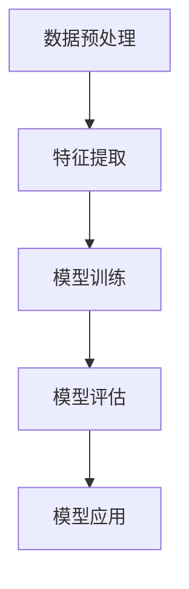
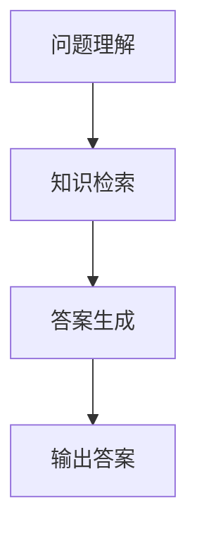
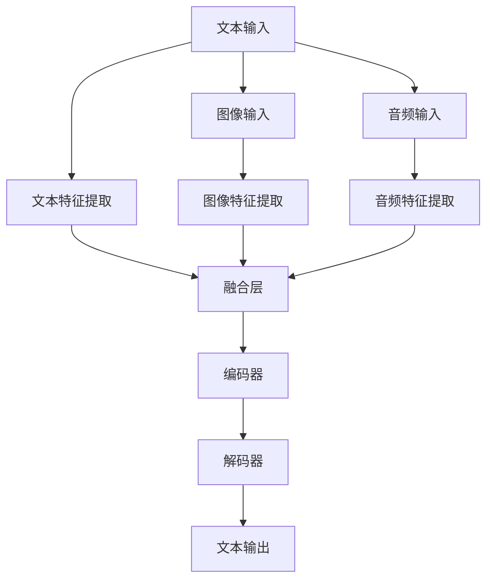

                 

### 文章标题

# AIGC时代的语言模型与提示词协同优化策略

> 关键词：AIGC、语言模型、提示词、协同优化、文本生成、问答系统、多模态内容生成

> 摘要：本文旨在探讨AIGC（AI-Generated Content）时代下，语言模型与提示词的协同优化策略。文章首先介绍了AIGC的概念与特点，随后深入分析了语言模型的基本概念、工作原理以及主要类型。接着，我们探讨了提示词的作用、生成方法以及与语言模型的协同优化策略。文章还详细阐述了AIGC时代下语言模型在文本生成与摘要、问答系统与对话生成、多模态语言模型等领域的应用，最后分析了语言模型面临的挑战以及未来发展趋势。

### 目录

1. **AIGC时代概述**
   - **1.1 AIGC的概念与特点**
   - **1.2 AIGC的发展历程**
   - **1.3 AIGC的应用场景**

2. **语言模型基础**
   - **2.1 语言模型的基本概念**
   - **2.2 语言模型的工作原理**
   - **2.3 语言模型的主要类型**

3. **提示词与协同优化策略**
   - **3.1 提示词的作用与类型**
   - **3.2 提示词生成方法**
   - **3.3 语言模型与提示词的协同优化策略**

4. **AIGC时代的语言模型应用**
   - **4.1 文本生成与摘要**
   - **4.2 问答系统与对话生成**
   - **4.3 多模态语言模型**

5. **AIGC时代的语言模型挑战与未来发展趋势**
   - **5.1 语言模型面临的挑战**
   - **5.2 AIGC时代的语言模型发展趋势**
   - **5.3 AIGC时代的语言模型应用前景**

6. **附录**

---

### 第一部分：AIGC与语言模型基础

#### 第1章：AIGC时代概述

##### 1.1 AIGC的概念与特点

AIGC（AI-Generated Content），即人工智能生成内容，是指通过人工智能技术生成文本、图像、音频和视频等媒体内容。它不仅涵盖了传统的文本生成，还扩展到了多模态内容生成，如图像生成、音频合成和视频剪辑等。AIGC的核心特点如下：

- **自动性**：AIGC可以自动生成内容，减少人工干预。这意味着，通过输入适当的指令或数据，AI系统能够自动完成内容创作，从而大大提高了生产效率。

- **高效性**：AIGC能够快速生成大量内容。传统的手工创作方式在处理大规模内容生成任务时往往效率低下，而AIGC技术能够高效地处理这些任务。

- **创造性**：AIGC系统能够创造出独特、新颖的内容。虽然AIGC系统生成的作品可能与人类创作的作品有所不同，但它们往往具有独特的风格和创意。

##### 1.2 AIGC的发展历程

AIGC技术的发展可以追溯到20世纪80年代的自然语言处理（NLP）领域。当时，研究人员开始尝试使用统计模型来预测语言中的下一个词。随着深度学习技术的崛起，AIGC技术得到了快速发展。以下是AIGC技术发展的主要阶段：

- **初期探索阶段**（20世纪80年代至2000年）：在这一阶段，研究人员主要关注如何使用统计模型和规则来生成文本。

- **快速发展阶段**（2000年至2010年）：随着深度学习技术的成熟，神经网络语言模型如N-gram和神经网络序列模型（如RNN）逐渐成为主流。

- **应用落地阶段**（2010年至今）：近年来，AIGC技术逐渐应用于实际场景，如自动写作、智能客服、虚拟主播等。

##### 1.3 AIGC的应用场景

AIGC技术在不同领域有着广泛的应用，以下是几个主要的应用场景：

- **文本生成与摘要**：自动写作、新闻生成、文章摘要等。

- **对话系统与问答**：虚拟助手、智能客服、问答系统等。

- **图像与视频生成**：图像修复、图像生成、视频剪辑等。

- **多模态内容生成**：文本、图像、音频等多模态内容的同时生成。

#### 第2章：语言模型基础

##### 2.1 语言模型的基本概念

语言模型（Language Model）是自然语言处理（NLP）中的一个基础概念，它是对语言概率分布的建模。语言模型的核心任务是预测下一个单词或词组，从而生成连续的文本。以下是语言模型的一些基本概念：

- **词汇表**：语言模型首先需要定义一个词汇表，它包含了所有可能的单词或词组。

- **概率分布**：语言模型的目标是学习每个单词或词组的概率分布，从而预测下一个单词或词组。

- **词汇分布**：词汇分布是语言模型的一个重要指标，它描述了不同单词或词组在文本中出现的频率。

##### 2.2 语言模型的工作原理

语言模型的工作原理可以分为以下几个步骤：

1. **数据收集与预处理**：首先，语言模型需要从大量文本数据中收集信息。然后，对这些数据进行预处理，如分词、去停用词、词性标注等。

2. **概率计算**：在预处理后的数据上，语言模型会计算每个单词或词组的概率。对于统计语言模型，这通常是通过N-gram模型来实现的。对于神经网络语言模型，这通常是通过深度神经网络来实现的。

3. **预测与生成**：根据已计算的单词或词组的概率分布，语言模型会预测下一个单词或词组，从而生成连续的文本。

##### 2.3 语言模型的主要类型

语言模型可以分为以下几种主要类型：

- **统计语言模型**：基于大量语料库统计概率分布，如N-gram模型。

- **神经网络语言模型**：使用深度神经网络来建模语言，如RNN、LSTM、BERT等。

- **转换器语言模型**：如BERT、GPT等，结合了自监督学习和迁移学习。

#### 第3章：提示词与协同优化策略

##### 3.1 提示词的作用与类型

提示词（Prompt）是引导语言模型生成特定内容的关键输入。提示词的作用包括：

- **指导生成方向**：提示词可以帮助语言模型理解生成任务的具体要求，从而生成更符合预期的内容。

- **提高生成效率**：通过使用提示词，语言模型可以更快地找到生成方向，从而提高生成效率。

提示词可以分为以下几种类型：

- **固定提示词**：在生成过程中始终不变的提示词。

- **动态提示词**：在生成过程中根据当前生成内容动态调整的提示词。

- **多模态提示词**：结合了文本、图像、音频等多种模态信息的提示词。

##### 3.2 提示词生成方法

提示词生成方法可以分为以下几种：

- **规则生成方法**：根据生成任务的要求，使用规则生成提示词。

- **模板生成方法**：根据预定义的模板生成提示词。

- **数据驱动生成方法**：从大量数据中学习生成提示词。

##### 3.3 语言模型与提示词的协同优化策略

语言模型与提示词的协同优化策略是提高AIGC系统性能的关键。以下是一些协同优化策略：

- **提示词优化**：通过调整提示词的生成方法，优化提示词的质量，从而提高生成内容的质量。

- **模型优化**：通过优化语言模型的结构和参数，提高模型在特定任务上的性能。

- **多模态优化**：结合多模态信息，优化提示词和语言模型的协同效果，提高生成内容的质量。

#### 第二部分：AIGC时代的语言模型应用

##### 第4章：文本生成与摘要

文本生成与摘要是AIGC时代的重要应用之一。以下将详细介绍这些技术：

- **文本生成技术**：文本生成技术是指使用语言模型生成文本的技术。它广泛应用于自动写作、新闻生成、文章摘要等领域。常见的文本生成技术包括：

  - **序列到序列模型**：如BERT、GPT等，能够将一个序列（如一个句子）映射到另一个序列。

  - **自回归模型**：如RNN、LSTM等，能够根据前一个单词或词组预测下一个单词或词组。

- **文本摘要技术**：文本摘要技术是指将长文本简化为摘要的技术。它广泛应用于信息检索、阅读辅助等领域。常见的文本摘要技术包括：

  - **提取式摘要**：从原始文本中提取关键句子或短语，构成摘要。

  - **生成式摘要**：使用语言模型生成摘要文本。

##### 第5章：问答系统与对话生成

问答系统与对话生成是AIGC时代的另一个重要应用。以下将详细介绍这些技术：

- **问答系统原理**：问答系统是指能够回答用户问题的系统。它通常包含以下组件：

  - **问题理解**：将用户输入的自然语言问题转换为结构化的问题。

  - **知识检索**：在预定义的知识库中检索与问题相关的信息。

  - **答案生成**：使用语言模型生成问题的答案。

- **对话生成技术**：对话生成技术是指生成自然语言对话的技术。它广泛应用于智能客服、虚拟助手等领域。常见的对话生成技术包括：

  - **基于规则的方法**：使用预定义的规则生成对话。

  - **基于模型的方法**：使用语言模型生成对话。

##### 第6章：多模态语言模型

多模态语言模型是指能够处理多种模态（如文本、图像、音频）的语言模型。以下将详细介绍多模态语言模型的概念和原理：

- **多模态语言模型的概念**：多模态语言模型是指能够同时处理多种模态的语言模型。它能够结合不同模态的信息，生成更丰富、更准确的内容。

- **多模态语言模型的工作原理**：多模态语言模型通常包含以下组件：

  - **特征提取**：从不同模态中提取特征，如文本中的词向量、图像中的特征向量、音频中的声谱图。

  - **特征融合**：将不同模态的特征进行融合，形成统一的特征表示。

  - **语言生成**：使用融合后的特征，通过语言模型生成文本。

##### 第7章：AIGC时代的语言模型挑战与未来发展趋势

AIGC时代的语言模型面临着诸多挑战和机遇。以下将分析这些挑战和发展趋势：

- **挑战**：

  - **计算资源需求**：语言模型的训练和推理过程需要大量的计算资源，这对硬件设施提出了高要求。

  - **数据隐私与安全**：语言模型在处理大量数据时，可能会涉及用户隐私和数据安全问题。

  - **可解释性与可靠性**：语言模型生成的结果有时难以解释和验证，这对模型的可靠性和可解释性提出了挑战。

- **发展趋势**：

  - **高效训练与推理**：研究人员正在探索如何提高语言模型的训练和推理效率，以降低计算资源需求。

  - **数据隐私保护**：研究人员正在研究如何在保证数据隐私的同时，提高语言模型的性能。

  - **多模态融合**：多模态语言模型的研究正在不断发展，未来有望实现更高效、更准确的多模态内容生成。

### 附录

#### 附录A：AIGC与语言模型常用工具与资源

- **AIGC与语言模型的主要框架**：

  - **TensorFlow**：用于构建和训练语言模型的强大框架。

  - **PyTorch**：另一个流行的深度学习框架，支持高效的语言模型训练。

  - **Hugging Face**：提供丰富的预训练语言模型和工具，方便研究人员和开发者使用。

- **AIGC与语言模型的应用资源**：

  - **OpenAI**：提供GPT系列模型的API，方便开发者使用。

  - **Google AI**：提供BERT、T5等模型的预训练数据和API。

  - **Hugging Face Model Hub**：提供大量预训练语言模型的存储和共享平台。

- **AIGC与语言模型的学习资料**：

  - **《自然语言处理入门》**：介绍自然语言处理的基本概念和技术的入门书籍。

  - **《深度学习》**：介绍深度学习和神经网络的基本概念和技术的经典教材。

  - **《语言模型与自然语言处理》**：深入探讨语言模型和自然语言处理技术的学术著作。

- **AIGC与语言模型的社区与交流平台**：

  - **arXiv**：自然语言处理领域的学术文章存储和交流平台。

  - **Reddit**：自然语言处理和深度学习相关的讨论社区。

  - **Stack Overflow**：编程问题和技术讨论的问答社区。

---

### 第1章：AIGC时代概述

## 1.1 AIGC的概念与特点

### 1.1.1 AIGC的定义

AIGC（AI-Generated Content）是指通过人工智能技术生成的内容，涵盖文本、图像、音频和视频等多媒体形式。其核心是通过机器学习和深度学习算法，对大规模数据进行训练，从而实现自动化内容创作。

### 1.1.2 AIGC的特点

AIGC的特点主要体现在以下几个方面：

- **自动化**：通过算法自动生成内容，减少人为干预。

- **高效性**：能够快速处理大量数据，实现大规模内容创作。

- **创造性**：AI能够创造出新颖、独特的作品，具有人类难以达到的创造性。

- **个性化**：能够根据用户需求和偏好，生成个性化的内容。

## 1.2 AIGC的发展历程

### 1.2.1 初期探索阶段

从20世纪80年代开始，自然语言处理（NLP）领域开始尝试使用统计模型进行文本生成。这一阶段的代表性工作包括N-gram模型和基于规则的生成方法。

### 1.2.2 快速发展阶段

2000年以后，随着深度学习技术的兴起，语言模型如RNN、LSTM等逐渐成为主流，文本生成能力得到了显著提升。此外，图像生成和音频生成等非文本领域的AIGC技术也开始涌现。

### 1.2.3 应用落地阶段

近年来，AIGC技术在多个领域得到了广泛应用，如自动写作、智能客服、虚拟主播等。随着技术的不断进步，AIGC的应用场景也在不断扩展。

## 1.3 AIGC的应用场景

### 1.3.1 文本生成与摘要

文本生成与摘要是AIGC技术的典型应用。例如，自动写作工具可以生成新闻文章、博客等；摘要生成工具则可以从长篇文本中提取关键信息，实现阅读辅助。

### 1.3.2 对话系统与问答

AIGC技术在对话系统和问答系统中也得到了广泛应用。通过训练语言模型，可以生成与人类对话类似的自然语言回答，为智能客服、虚拟助手等应用提供支持。

### 1.3.3 图像与视频生成

在图像与视频生成领域，AIGC技术可以实现图像修复、图像生成、视频剪辑等功能。例如，通过GAN（生成对抗网络）可以生成逼真的图像，通过视频合成技术可以实现视频编辑和创作。

### 1.3.4 多模态内容生成

多模态内容生成是指同时处理文本、图像、音频等多种模态信息的生成任务。例如，可以将文本描述和图像信息结合，生成具有视觉和语义一致性的图像，或者将音频和文本结合，生成具有声音和语义一致性的视频。

### 1.3.5 其他应用场景

除了上述应用场景外，AIGC技术还在艺术创作、游戏开发、虚拟现实等领域有广泛的应用。通过人工智能生成内容，可以为这些领域带来新的创意和可能性。

## 1.4 AIGC的优势与挑战

### 1.4.1 优势

AIGC技术具有以下优势：

- **提高效率**：自动化内容生成可以显著提高生产效率，减少人力成本。

- **降低成本**：通过大规模生产内容，可以降低内容创作和分发的成本。

- **创新性**：AI可以创造出人类难以想到的新内容和形式，为艺术和设计等领域带来新的灵感。

### 1.4.2 挑战

AIGC技术也面临着一些挑战：

- **数据隐私和安全**：在处理大量用户数据时，需要确保数据隐私和安全。

- **算法公平性和可解释性**：AI生成的结果可能存在偏见和不公平性，同时其内部机制可能难以解释。

- **创作伦理**：AI生成内容的版权、知识产权等问题需要进一步探讨和规范。

### 1.4.3 未来发展趋势

未来，AIGC技术将继续快速发展，并在以下方面取得突破：

- **多模态融合**：进一步整合文本、图像、音频等多种模态信息，实现更丰富的内容创作。

- **个性化内容生成**：根据用户偏好和需求，实现更精准的内容推荐和生成。

- **实时内容生成**：通过实时数据分析和处理，实现更快速的内容生成和更新。

- **伦理和法规**：随着技术的发展，需要建立相应的伦理和法规体系，确保AI生成内容的安全和合规。

---

## 2.1 语言模型的基本概念

### 2.1.1 语言模型是什么

语言模型（Language Model）是自然语言处理（Natural Language Processing，NLP）中的一个核心概念，它旨在预测下一个单词或词组。在NLP任务中，语言模型用于各种应用，如自动补全、机器翻译、文本摘要和问答系统等。语言模型的核心目标是通过学习大量文本数据，捕捉语言中的统计规律，从而对未知或未见过的情况进行预测。

### 2.1.2 语言模型的作用

语言模型在NLP中发挥着至关重要的作用，主要表现在以下几个方面：

- **文本生成**：语言模型可以生成连贯的文本，用于自动写作、文章摘要和对话系统等应用。

- **文本理解**：通过语言模型，可以更好地理解文本中的语言结构，从而在语义分析、情感分析和信息提取等方面发挥作用。

- **自动补全**：语言模型可以预测用户可能输入的下一个词或短语，用于自动补全和智能输入建议。

- **语音识别**：在语音识别系统中，语言模型用于预测可能的单词序列，从而提高识别的准确率。

### 2.1.3 语言模型的主要类型

语言模型可以分为以下几种主要类型：

- **基于规则的语言模型**：这类模型通过定义语法规则和词频统计来预测下一个词。典型的例子包括N-gram模型。

- **统计语言模型**：这类模型通过统计方法（如N-gram）来预测下一个词。N-gram模型是一种基于历史上下文（前N个词）的模型，它假设当前词的概率仅取决于前N个词。

- **神经网络语言模型**：这类模型使用深度神经网络来学习语言的概率分布。典型的神经网络语言模型包括循环神经网络（RNN）、长短期记忆网络（LSTM）和Transformer模型。

- **转换器语言模型**：Transformer模型是近年来兴起的一种新型神经网络语言模型，其核心思想是使用自注意力机制（Self-Attention）来处理长距离依赖问题。BERT、GPT等模型都是基于Transformer架构的。

### 2.1.4 语言模型的工作原理

不同类型的语言模型具有不同的工作原理，但总体上可以分为以下几个步骤：

1. **数据预处理**：首先，需要对输入文本进行预处理，包括分词、标记化、去除停用词等操作。

2. **特征提取**：接下来，将预处理后的文本转换为特征表示，如词向量或 embeddings。这些特征表示将用于神经网络模型的输入。

3. **模型训练**：使用训练数据集来训练语言模型。在训练过程中，模型会学习如何根据输入特征预测下一个词或词组。

4. **模型评估**：使用测试数据集来评估模型的效果。常用的评估指标包括准确率、损失函数等。

5. **模型应用**：训练好的模型可以用于各种NLP任务，如文本生成、自动补全、问答系统等。

### 2.1.5 语言模型的核心概念原理之间的关系架构

为了更好地理解语言模型的核心概念原理之间的关系，我们可以使用Mermaid流程图来表示。以下是语言模型的基本流程：



在上述流程图中，数据预处理、特征提取、模型训练、模型评估和模型应用是语言模型工作的核心步骤。这些步骤相互衔接，共同构成了一个完整的语言模型训练和应用过程。

---

## 2.2 语言模型的工作原理

### 2.2.1 统计语言模型

统计语言模型（Statistical Language Model）是语言模型的一种基本形式，它基于统计方法来预测下一个词。其中，N-gram模型是最常见的统计语言模型。

#### N-gram模型的工作原理

N-gram模型将语言分割成N个单词的序列，并计算每个序列的概率。具体步骤如下：

1. **分词**：将文本分成单词或字符序列。

2. **构建N-gram模型**：统计每个N-gram序列的频率，形成N-gram模型。

3. **概率预测**：根据N-gram模型预测下一个词的概率。

N-gram模型的核心公式如下：

\[ P(\text{word}_n | \text{word}_{n-1}, \ldots, \text{word}_{n-k}) = \frac{C(\text{word}_{n-1}, \ldots, \text{word}_{n-k}, \text{word}_n)}{C(\text{word}_{n-1}, \ldots, \text{word}_{n-k})} \]

其中，\( C(\text{word}_{n-1}, \ldots, \text{word}_{n-k}, \text{word}_n) \)表示N-gram序列\((\text{word}_{n-1}, \ldots, \text{word}_{n-k}, \text{word}_n)\)的频率，\( C(\text{word}_{n-1}, \ldots, \text{word}_{n-k}) \)表示前\( n-k \)个词的频率。

#### N-gram模型的优点和局限性

**优点**：

- **简单性**：N-gram模型易于理解和实现，计算复杂度相对较低。
- **高效性**：在给定足够的历史上下文时，N-gram模型能够生成较为连贯的文本。

**局限性**：

- **上下文依赖不足**：N-gram模型仅考虑前N个单词，无法捕捉长距离依赖。
- **稀疏性**：在实际应用中，大部分N-gram序列的频率都较低，导致模型难以预测未知序列。

### 2.2.2 神经网络语言模型

神经网络语言模型（Neural Language Model）是另一种语言模型，它通过深度神经网络来学习语言的概率分布。常见的神经网络语言模型包括循环神经网络（RNN）、长短期记忆网络（LSTM）和Transformer模型。

#### 循环神经网络（RNN）

循环神经网络（Recurrent Neural Network，RNN）是一种能够处理序列数据的神经网络。它通过循环结构来保存历史信息，从而处理长距离依赖问题。

**RNN的工作原理**：

1. **输入层**：输入当前序列的单词或字符。
2. **隐藏层**：计算当前隐藏状态，结合上一个隐藏状态和输入。
3. **输出层**：生成当前单词或字符的概率分布。

**RNN的核心公式**：

\[ h_t = \sigma(W_h h_{t-1} + W_x x_t + b_h) \]

\[ y_t = \text{softmax}(W_y h_t + b_y) \]

其中，\( h_t \)表示第\( t \)个时间步的隐藏状态，\( x_t \)表示第\( t \)个时间步的输入，\( \sigma \)是激活函数，\( W_h \)、\( W_x \)、\( b_h \)、\( W_y \)和\( b_y \)是模型参数。

**RNN的局限性**：

- **梯度消失和梯度爆炸**：在训练过程中，RNN容易受到梯度消失和梯度爆炸问题的影响，导致难以学习长距离依赖。

#### 长短期记忆网络（LSTM）

长短期记忆网络（Long Short-Term Memory，LSTM）是RNN的一种改进，它通过引入记忆单元来避免梯度消失和梯度爆炸问题，从而更好地处理长距离依赖。

**LSTM的工作原理**：

1. **输入门**：决定哪些信息需要进入记忆单元。
2. **遗忘门**：决定哪些信息需要从记忆单元中遗忘。
3. **输出门**：决定哪些信息需要输出。

**LSTM的核心公式**：

\[ i_t = \sigma(W_i [h_{t-1}, x_t] + b_i) \]

\[ f_t = \sigma(W_f [h_{t-1}, x_t] + b_f) \]

\[ g_t = \tanh(W_g [h_{t-1}, x_t] + b_g) \]

\[ o_t = \sigma(W_o [h_{t-1}, x_t] + b_o) \]

\[ h_t = o_t \odot \tanh(C_t) \]

\[ C_t = f_t \odot C_{t-1} + i_t \odot g_t \]

其中，\( i_t \)、\( f_t \)、\( o_t \)分别表示输入门、遗忘门和输出门的激活值，\( C_t \)表示记忆单元的状态，\( \odot \)表示逐元素乘。

**LSTM的优势**：

- **避免梯度消失和梯度爆炸**：通过引入门控机制，LSTM能够更好地学习长距离依赖。

- **灵活的记忆单元**：记忆单元的状态可以灵活地控制，从而更好地捕捉序列信息。

### 2.2.3 Transformer模型

Transformer模型是另一种基于自注意力机制的神经网络语言模型，它解决了传统RNN和LSTM在处理长距离依赖时的局限性。

**Transformer的工作原理**：

1. **编码器**：编码器由多个自注意力层和前馈网络组成，用于编码输入序列。
2. **解码器**：解码器也由多个自注意力层和前馈网络组成，用于解码输出序列。

**Transformer的核心组件**：

- **自注意力机制**：通过计算序列中每个词对之间的相似性，生成词向量表示，从而处理长距离依赖。
- **多头注意力**：通过多个注意力头来并行计算不同类型的依赖关系。
- **前馈网络**：在自注意力机制之后，使用前馈网络对每个词向量进行进一步处理。

**Transformer的核心公式**：

\[ \text{Attention}(Q, K, V) = \text{softmax}\left(\frac{QK^T}{\sqrt{d_k}}\right) V \]

\[ \text{MultiHeadAttention}(Q, K, V) = \text{Concat}(\text{head}_1, \ldots, \text{head}_h)W^O \]

其中，\( Q \)、\( K \)和\( V \)分别是查询向量、键向量和值向量，\( d_k \)是键向量的维度，\( W^O \)是输出权重矩阵。

**Transformer的优势**：

- **并行计算**：自注意力机制使得Transformer能够并行处理序列数据，从而显著提高计算效率。

- **长距离依赖**：通过多头注意力机制，Transformer能够更好地捕捉长距离依赖。

- **灵活性**：Transformer的模块化设计使得其易于扩展和定制，从而适用于各种NLP任务。

### 2.2.4 比较和选择

不同类型的语言模型具有不同的优缺点，选择合适的模型取决于具体应用场景和需求。

- **N-gram模型**：适用于简单的文本生成任务，计算复杂度低，但上下文依赖不足。
- **RNN**：能够处理长距离依赖，但容易受到梯度消失和梯度爆炸问题的影响。
- **LSTM**：通过门控机制解决了RNN的梯度消失问题，但计算复杂度较高。
- **Transformer**：并行计算能力强，能够处理长距离依赖，但计算复杂度相对较高。

在实际应用中，可以根据任务需求和计算资源选择合适的语言模型。

### 2.2.5 语言模型的工作原理示例

以下是一个简单的语言模型工作原理示例，假设我们使用一个二元文模型（Bigram Model）来预测下一个词。

**示例文本**：

- 输入：我吃了一个苹果。
- 输出：一个苹果好吃。

**步骤**：

1. **分词**：将输入文本分成单词序列。

\[ \text{输入}: [\text{我}, \text{吃}, \text{了}, \text{一个}, \text{苹果}] \]

\[ \text{输出}: [\text{一个}, \text{苹果}, \text{好吃}] \]

2. **构建二元文模型**：

   假设二元文模型仅包含以下单词对：

\[ \text{我吃}: 1, \text{吃了一个}: 1, \text{了一个苹果}: 1, \text{一个苹果好吃}: 1 \]

3. **概率预测**：

   根据二元文模型，我们可以计算每个单词对的概率。

\[ P(\text{我吃}|\text{我}) = 1 \]

\[ P(\text{吃了一个}|\text{我吃}) = 1 \]

\[ P(\text{了一个苹果}|\text{吃了一个}) = 1 \]

\[ P(\text{一个苹果好吃}|\text{一个苹果}) = 1 \]

4. **生成输出**：

   根据概率预测，我们可以生成输出序列。

\[ \text{输出}: [\text{一个}, \text{苹果}, \text{好吃}] \]

通过上述步骤，我们使用二元文模型成功预测了下一个词。

---

## 2.3 语言模型的主要类型

### 2.3.1 GPT系列模型

GPT（Generative Pre-trained Transformer）系列模型是由OpenAI开发的一类基于Transformer架构的预训练语言模型。GPT系列模型主要包括GPT-2、GPT-3等，它们在自然语言处理领域取得了显著的成果。

**GPT-2**

GPT-2是GPT系列模型中的第一个版本，它使用了Transformer架构，并通过自监督学习进行预训练。GPT-2的核心特点是：

- **大规模**：GPT-2使用了1.5万亿个词的语料库，拥有高达1.76万亿个参数。
- **预训练**：GPT-2通过自监督学习预训练，从而能够生成连贯、自然的文本。
- **多任务**：GPT-2能够处理多种语言任务，如文本生成、问答、摘要等。

**GPT-3**

GPT-3是GPT系列模型的最新版本，它拥有超过1750亿个参数，是当前最大的预训练语言模型。GPT-3的核心特点是：

- **规模**：GPT-3使用了40TB的文本数据，使其能够更好地理解各种语言现象。
- **多样性**：GPT-3能够生成多样化、高质量的文本，包括小说、诗歌、代码等。
- **性能**：GPT-3在各种自然语言处理任务上取得了优异的性能，包括文本生成、问答、翻译等。

### 2.3.2 BERT模型

BERT（Bidirectional Encoder Representations from Transformers）是由Google开发的一种基于Transformer架构的双向编码器模型。BERT的核心特点如下：

- **双向编码器**：BERT使用了Transformer的双向编码器，能够同时捕捉上下文中的前后关系，从而更好地理解语义。
- **大规模预训练**：BERT在英文语料库上进行大规模预训练，从而能够生成高质量的文本表示。
- **多任务学习**：BERT通过预训练，能够在多种NLP任务上取得优异的性能，如文本分类、命名实体识别、问答等。

### 2.3.3 T5模型

T5（Text-To-Text Transfer Transformer）是由Google开发的一种基于Transformer架构的文本转换模型。T5的核心特点如下：

- **统一任务框架**：T5将所有NLP任务转换为“输入到输出”的文本转换任务，从而实现统一任务框架。
- **高效预训练**：T5通过自监督学习进行大规模预训练，从而能够生成高质量的文本表示。
- **多任务性能**：T5在各种NLP任务上取得了优异的性能，包括文本分类、命名实体识别、问答等。

### 2.3.4 模型比较与选择

GPT系列模型、BERT模型和T5模型都是当前自然语言处理领域的领先模型，它们各有优缺点。以下是这些模型的一些比较和选择建议：

- **模型规模**：GPT-3是当前最大的预训练语言模型，拥有超过1750亿个参数；BERT和T5的规模相对较小。
- **预训练数据集**：GPT-3使用了40TB的文本数据，BERT和T5的预训练数据集相对较小。
- **任务适应能力**：GPT-3和BERT在多种NLP任务上取得了优异的性能，T5则更专注于文本转换任务。
- **计算资源需求**：GPT-3的计算资源需求最高，BERT和T5相对较低。

在选择模型时，应根据具体任务需求和计算资源进行权衡。例如，对于大规模文本生成任务，GPT-3可能是一个更好的选择；而对于文本分类和问答等任务，BERT和T5可能更合适。

### 2.3.5 模型应用实例

以下是一些基于GPT系列模型、BERT模型和T5模型的应用实例：

- **文本生成**：使用GPT系列模型生成连贯、自然的文本，如自动写作、小说创作、诗歌生成等。
- **问答系统**：使用BERT模型构建问答系统，如智能客服、信息检索等。
- **文本分类**：使用T5模型对文本进行分类，如情感分析、新闻分类等。
- **命名实体识别**：使用BERT模型进行命名实体识别，如从文本中提取人名、地点、组织等实体。

通过这些应用实例，我们可以看到这些模型在自然语言处理领域的广泛应用和巨大潜力。

---

### 3.1 提示词的作用与类型

提示词（Prompt）是引导语言模型生成特定内容的关键输入。它通过提供上下文信息或目标指导，帮助模型理解生成任务的要求，从而提高生成内容的质量和准确性。提示词的作用和类型如下：

#### 提示词的作用

1. **指导生成方向**：提示词可以帮助模型理解生成任务的具体要求，从而生成更符合预期的内容。例如，在文本生成任务中，提示词可以指定生成文本的主题、风格或情感。

2. **提高生成效率**：通过使用提示词，模型可以更快地找到生成方向，从而减少搜索空间，提高生成效率。这对于大规模文本生成任务尤为重要。

3. **改善内容连贯性**：提示词可以提供上下文信息，有助于模型生成更加连贯和流畅的文本。这有助于提高文本的可读性和用户体验。

4. **增强个性化**：提示词可以根据用户偏好和需求进行定制，从而实现更加个性化的内容生成。例如，在对话系统中，提示词可以根据用户历史对话内容生成个性化的回复。

#### 提示词的类型

提示词可以分为以下几种类型：

1. **固定提示词**：固定提示词是指在生成过程中始终不变的提示词。这类提示词通常用于明确生成任务的目标或约束条件。例如，在文本生成任务中，固定提示词可以指定生成文本的主题或风格。

2. **动态提示词**：动态提示词是在生成过程中根据当前生成内容动态调整的提示词。这类提示词可以随着生成过程的进展而更新，从而更好地引导模型生成内容。例如，在对话系统中，动态提示词可以根据用户输入和历史对话内容进行实时调整。

3. **多模态提示词**：多模态提示词是指结合了文本、图像、音频等多种模态信息的提示词。这类提示词可以提供更丰富的上下文信息，从而帮助模型生成更加多样化、丰富的内容。例如，在图像生成任务中，多模态提示词可以结合图像内容和文本描述，生成具有视觉和语义一致性的图像。

#### 提示词的优化方法

为了提高生成内容的质量和准确性，需要对提示词进行优化。以下是一些常见的提示词优化方法：

1. **提示词长度**：提示词的长度对生成效果有重要影响。较长的提示词可以提供更多的上下文信息，但也会增加模型的计算负担。适当的提示词长度可以在提供充足上下文信息和降低计算复杂度之间取得平衡。

2. **提示词组合**：通过组合不同类型的提示词，可以提供更丰富的上下文信息，从而提高生成效果。例如，将文本提示词与图像提示词结合，可以生成具有视觉和语义一致性的图像。

3. **提示词调整策略**：动态提示词可以根据生成过程中的反馈进行实时调整。常见的调整策略包括：

   - **基于反馈的调整**：根据模型生成的中间结果，动态调整提示词，以提高生成内容的质量。
   - **基于优化的调整**：使用优化算法（如遗传算法、模拟退火算法等），自动调整提示词，以找到最优的生成效果。

#### 提示词在语言模型中的应用实例

提示词在语言模型中有着广泛的应用。以下是一些具体的实例：

1. **文本生成**：在文本生成任务中，提示词可以指定生成文本的主题、风格或情感。例如，在生成新闻文章时，提示词可以指定新闻的主题和关键词，从而帮助模型生成相关的内容。

2. **对话系统**：在对话系统中，提示词可以根据用户输入和历史对话内容，生成个性化的回复。例如，在聊天机器人中，提示词可以包括用户的历史对话记录和当前输入，从而生成与用户意图和需求相关的回复。

3. **图像生成**：在图像生成任务中，多模态提示词可以结合图像内容和文本描述，生成具有视觉和语义一致性的图像。例如，在生成艺术作品时，提示词可以指定艺术风格和主题，从而帮助模型生成符合要求的图像。

通过优化提示词和语言模型的协同效果，可以显著提高AIGC系统的生成质量和用户体验。

---

### 3.2 提示词生成方法

提示词生成是提高语言模型生成质量的关键环节。有效的提示词生成方法可以提供丰富的上下文信息，引导模型生成更符合预期和高质量的内容。以下将介绍几种常见的提示词生成方法：

#### 1. 规则生成方法

规则生成方法是指通过定义一系列规则来生成提示词。这种方法适用于有明确目标和规则约束的生成任务。规则可以是简单的条件判断，也可以是复杂的逻辑组合。以下是一个基于规则的提示词生成示例：

```python
def generate_prompt_for_article(topic):
    if topic == "technology":
        return "在人工智能技术领域，近期有哪些重要的进展？"
    elif topic == "health":
        return "在健康领域，有哪些新兴的研究成果和趋势？"
    else:
        return "请描述一下你对 {} 领域的兴趣和看法。"
```

**优点**：规则生成方法简单直观，易于实现和理解。

**局限性**：对于复杂和多样化的生成任务，规则生成方法可能难以覆盖所有情况，灵活性较低。

#### 2. 模板生成方法

模板生成方法是指通过预定义的模板来生成提示词。这种方法可以根据不同的输入数据动态填充模板中的空白部分，从而生成个性化的提示词。以下是一个基于模板的提示词生成示例：

```python
def generate_prompt_for_question(question_template, user_input):
    return question_template.format(user_input)
```

**优点**：模板生成方法灵活性强，可以适应不同的输入数据，生成个性化的提示词。

**局限性**：模板生成方法可能需要大量的预定义模板，且对于复杂的语言结构，模板的覆盖范围可能不足。

#### 3. 数据驱动生成方法

数据驱动生成方法是指从大量数据中学习生成提示词。这种方法通过分析数据集中的提示词和生成内容之间的关系，自动生成新的提示词。以下是一个基于数据驱动方法的提示词生成示例：

```python
from sklearn.feature_extraction.text import CountVectorizer

def generate_prompt_for_text(text, model):
    vectorizer = CountVectorizer()
    X = vectorizer.fit_transform([text])
    nearest_prompt = model.kneighbors(X)[1][0]
    return nearest_prompt
```

**优点**：数据驱动生成方法可以从大量数据中学习，生成高质量的提示词。

**局限性**：数据驱动方法可能需要大量的数据和计算资源，且对于新的或未出现过的输入，生成效果可能不稳定。

#### 4. 多模态融合生成方法

多模态融合生成方法是指结合不同模态的信息（如文本、图像、音频）来生成提示词。这种方法可以提供更丰富的上下文信息，从而提高生成内容的质量。以下是一个基于多模态融合的提示词生成示例：

```python
def generate_prompt_for_image_and_text(image, text):
    image_features = extract_image_features(image)
    text_features = extract_text_features(text)
    combined_features = image_features + text_features
    prompt = model.predict(combined_features)
    return prompt
```

**优点**：多模态融合生成方法可以结合不同模态的信息，提供更丰富的上下文，提高生成质量。

**局限性**：多模态融合方法可能需要复杂的特征提取和融合技术，计算资源需求较高。

### 3.3 提示词生成方法的选择与优化

在选择提示词生成方法时，需要根据具体的应用场景和任务需求进行权衡。以下是一些选择和优化建议：

1. **任务适应性**：根据生成任务的类型和特点，选择适合的方法。例如，对于需要高度个性化生成的任务，数据驱动生成方法可能更合适；对于有明确规则约束的任务，规则生成方法可能更简单有效。

2. **数据可用性**：确保有足够的数据支持提示词生成方法。对于数据驱动的生成方法，需要大量的训练数据；对于模板生成方法，需要丰富的模板库。

3. **计算资源**：根据计算资源的限制，选择计算效率高的方法。例如，规则生成方法和模板生成方法通常计算复杂度较低，适合在资源受限的环境中应用。

4. **生成质量**：通过实验和评估，选择生成质量最高的方法。可以使用不同的评估指标（如BLEU、ROUGE等）来比较不同方法的生成质量。

5. **实时性**：对于需要实时响应的应用场景，选择实时性较好的方法。例如，数据驱动的生成方法可能需要较长的预处理时间，而规则生成方法通常可以快速生成提示词。

6. **动态调整**：在生成过程中，可以根据模型输出的中间结果动态调整提示词。例如，在对话系统中，可以根据用户的历史输入和当前输入动态调整提示词，以提高生成内容的相关性和连贯性。

通过综合考虑以上因素，可以优化提示词生成方法，从而提高AIGC系统的整体性能和用户体验。

---

### 3.3 语言模型与提示词的协同优化策略

在AIGC时代，如何有效地协同优化语言模型与提示词，以实现高质量的文本生成和内容创作，是一个重要的研究课题。以下将从几个方面详细探讨语言模型与提示词的协同优化策略。

#### 1. 提示词优化策略

提示词的质量直接影响到语言模型的生成效果。因此，优化提示词是提升生成质量的重要一环。以下是一些常见的提示词优化策略：

- **提示词长度调整**：提示词的长度对生成内容的质量有显著影响。较长的提示词可以提供更多的上下文信息，有助于模型理解生成任务的要求，但也会增加模型的计算负担。适当地调整提示词长度，可以在提供充足上下文信息和降低计算复杂度之间取得平衡。

- **提示词组合**：通过组合不同类型的提示词，可以提供更丰富的上下文信息，从而提高生成效果。例如，结合文本提示词和图像提示词，可以生成具有视觉和语义一致性的图像。

- **提示词动态调整**：在生成过程中，可以根据模型生成的中间结果和用户反馈动态调整提示词。这种动态调整策略可以帮助模型更好地理解用户意图和生成任务的要求，从而提高生成内容的质量。

- **提示词生成算法优化**：针对不同的生成任务，可以优化提示词生成算法。例如，使用数据驱动的生成方法，从大量数据中学习生成高质量的提示词；或者使用规则生成方法，设计更加精细的规则，以生成符合任务需求的提示词。

#### 2. 语言模型优化策略

语言模型的优化是提升生成质量的关键。以下是一些常见的语言模型优化策略：

- **模型结构优化**：通过调整语言模型的结构，可以提高模型的生成效果。例如，可以使用更深的神经网络结构、更多的注意力头、更复杂的门控机制等，来增强模型的表达能力。

- **参数优化**：通过优化语言模型的参数，可以提升模型的性能。常见的参数优化方法包括梯度下降、Adam优化器、学习率调整等。

- **预训练数据优化**：使用高质量的预训练数据集，可以提高语言模型的学习效果。例如，可以使用大规模的多语种语料库、去噪数据集、带有标签的数据集等，来丰富模型的训练数据。

- **模型融合**：将多个语言模型融合在一起，可以取长补短，提高生成质量。例如，将统计语言模型和神经网络语言模型进行融合，结合两者的优点，实现更好的生成效果。

#### 3. 提示词与语言模型的协同优化

提示词与语言模型的协同优化是提升生成质量的关键。以下是一些协同优化策略：

- **自适应调整**：在生成过程中，可以根据模型生成的中间结果和用户反馈，自适应地调整提示词和语言模型。例如，当模型生成的内容质量较低时，可以增加提示词的长度或调整提示词的类型；当模型生成的内容质量较高时，可以减少提示词的长度或优化提示词的生成方法。

- **多任务学习**：通过多任务学习，可以使语言模型同时学习多个生成任务，从而提高模型在不同任务上的泛化能力。例如，在训练语言模型时，可以同时进行文本生成、问答、摘要等任务，使模型能够更好地理解不同任务的要求。

- **在线学习**：通过在线学习，可以实时更新提示词和语言模型，以适应新的生成任务和用户需求。例如，在对话系统中，可以根据用户的实时输入和历史对话记录，动态调整提示词和模型参数，以生成更符合用户意图的回复。

- **反馈机制**：建立有效的反馈机制，收集用户对生成内容的反馈，并用于优化提示词和语言模型。例如，可以使用用户满意度评分、错误率分析等方法，评估生成内容的质量，并据此调整提示词和模型参数。

#### 4. 实际应用中的协同优化

在实际应用中，协同优化策略需要根据具体场景和任务进行灵活调整。以下是一些实际应用中的协同优化示例：

- **文本生成**：在自动写作和文章摘要任务中，可以通过调整提示词的长度和类型，提高生成文本的质量。例如，在生成新闻文章时，可以使用较长的提示词，结合新闻标题和摘要，以生成更详细、更准确的文章。

- **对话系统**：在智能客服和虚拟助手任务中，可以通过动态调整提示词和模型参数，提高生成对话的连贯性和相关性。例如，当用户提出复杂问题时，可以增加提示词的长度和细节，以生成更恰当的回答。

- **图像生成**：在图像生成任务中，可以通过结合文本提示词和图像提示词，生成具有视觉和语义一致性的图像。例如，在生成艺术作品时，可以使用文本描述和图像内容作为提示词，以生成符合用户需求和风格的图像。

通过以上协同优化策略，可以显著提升AIGC系统的生成质量和用户体验。在实际应用中，需要根据具体任务和场景，灵活调整提示词和语言模型的参数，以实现最佳效果。

---

### 4.1 文本生成与摘要技术

文本生成与摘要是AIGC时代的重要应用，通过语言模型和提示词的协同优化，可以实现高质量的文本创作和信息提取。以下将详细探讨文本生成与摘要技术。

#### 文本生成技术

文本生成技术是指使用语言模型生成连贯、自然的文本。常见的文本生成技术包括序列到序列模型、自回归模型和转换器模型。

1. **序列到序列模型**

   序列到序列模型（Seq2Seq）是一种用于翻译、机器写作等任务的模型。它通过编码器-解码器结构，将输入序列映射到输出序列。以下是一个简单的序列到序列模型示例：

   ```mermaid
   graph TD
   A[Encoder] --> B[Decoder]
   B --> C[Output]
   ```

   **编码器（Encoder）**：将输入序列编码成一个固定长度的向量，表示输入序列的整体含义。

   **解码器（Decoder）**：根据编码器生成的隐藏状态，逐步生成输出序列。

   **训练过程**：通过优化损失函数（如交叉熵损失），训练编码器和解码器，使其能够准确预测输出序列。

2. **自回归模型**

   自回归模型（Autoregressive Model）是一种生成文本的模型，它通过预测下一个单词的概率分布来生成文本。以下是一个简单的自回归模型示例：

   ```mermaid
   graph TD
   A[Input] --> B[Embedding]
   B --> C[Decoder]
   C --> D[Output]
   ```

   **嵌入层（Embedding）**：将输入单词转换为固定大小的向量。

   **解码器（Decoder）**：根据嵌入层生成的向量，逐词预测下一个单词。

   **训练过程**：通过优化损失函数（如负对数似然损失），训练嵌入层和解码器，使其能够准确预测单词序列。

3. **转换器模型**

   转换器模型（Transformer）是一种基于自注意力机制的深度神经网络模型，它能够处理长距离依赖问题。以下是一个简单的转换器模型示例：

   ```mermaid
   graph TD
   A[Encoder] --> B[Decoder]
   B --> C[Output]
   ```

   **编码器（Encoder）**：将输入序列编码成一系列隐藏状态。

   **解码器（Decoder）**：根据编码器的隐藏状态，逐词生成输出序列。

   **自注意力机制（Self-Attention）**：在编码器和解码器的每个时间步，计算输入序列中所有单词的注意力权重，从而生成注意力权重向量。注意力权重向量用于生成当前时间步的隐藏状态。

   **训练过程**：通过优化损失函数（如交叉熵损失），训练编码器和解码器，使其能够准确预测单词序列。

#### 文本摘要技术

文本摘要技术是指从长文本中提取关键信息，生成简短、准确的摘要。常见的文本摘要技术包括提取式摘要和生成式摘要。

1. **提取式摘要**

   提取式摘要（Extractive Summary）是从原文中直接提取关键句子或短语，构成摘要。以下是一个简单的提取式摘要示例：

   ```python
   def extractive_summary(text, num_sentences):
       sentences = split_into_sentences(text)
       return ' '.join(sentences[:num_sentences])
   ```

   **训练过程**：通过训练一个二分类模型（如支持向量机、神经网络），判断句子是否为关键句子。训练数据集可以是已标记的文本对（原文和摘要）。

2. **生成式摘要**

   生成式摘要（Generative Summary）是使用语言模型生成摘要文本。以下是一个简单的生成式摘要示例：

   ```python
   def generative_summary(text, model):
       input_sequence = preprocess(text)
       summary = model.generate(input_sequence, max_length=100)
       return postprocess(summary)
   ```

   **训练过程**：使用文本对（原文和摘要）训练一个生成式语言模型（如GPT、BERT）。训练过程中，模型需要学习如何将输入文本映射到摘要文本。

#### 文本生成与摘要的应用案例

1. **自动写作**

   自动写作是文本生成技术的典型应用，通过语言模型生成新闻文章、博客等。以下是一个自动写作的应用案例：

   ```python
   def generate_news_article(topic, model):
       prompt = f"{topic} news article"
       text = model.generate(prompt, max_length=500)
       return postprocess(text)
   ```

   在实际应用中，可以根据不同的主题（如科技、体育、娱乐等），使用自动写作技术生成相关新闻文章。

2. **文章摘要**

   文章摘要是文本摘要技术的典型应用，通过提取式或生成式摘要技术，从长文章中提取关键信息，生成摘要。以下是一个文章摘要的应用案例：

   ```python
   def generate_summary(article, model, summary_type='extractive'):
       if summary_type == 'extractive':
           return extractive_summary(article, num_sentences=3)
       else:
           return generative_summary(article, model)
   ```

   在实际应用中，可以根据用户需求和文章长度，选择不同的摘要技术生成摘要。

通过文本生成与摘要技术，可以实现高质量的文本创作和信息提取，为AIGC时代的文本处理提供有力支持。

---

### 4.2 问答系统与对话生成技术

问答系统和对话生成是AIGC时代的重要应用，通过语言模型和提示词的协同优化，可以实现智能化的人机交互。以下将详细探讨问答系统与对话生成技术。

#### 问答系统原理

问答系统是指能够回答用户问题的系统。它通常包含以下组件：

1. **问题理解**：将用户输入的自然语言问题转换为结构化的问题。这通常涉及分词、词性标注、命名实体识别等NLP技术。

2. **知识检索**：在预定义的知识库中检索与问题相关的信息。知识库可以是结构化数据（如关系数据库）或无结构化数据（如文本库）。

3. **答案生成**：使用语言模型生成问题的答案。这通常涉及文本生成技术，如GPT、BERT等。

以下是一个简单的问答系统流程：



#### 对话生成技术

对话生成技术是指生成自然语言对话的技术。它广泛应用于智能客服、虚拟助手等领域。以下将介绍几种常见的对话生成技术：

1. **基于规则的方法**

   基于规则的方法是指通过预定义的规则生成对话。以下是一个简单的基于规则的方法：

   ```python
   def generate_response(input_sentence, rules):
       for rule in rules:
           if rule.matches(input_sentence):
               return rule.response
       return "我不知道怎么回答这个问题。"
   ```

   **优点**：简单直观，易于实现。

   **局限性**：灵活性较低，难以处理复杂的对话场景。

2. **基于模型的方法**

   基于模型的方法是指使用语言模型生成对话。以下是一个简单的基于模型的方法：

   ```python
   def generate_response(input_sentence, model):
       prompt = f"回答问题：{input_sentence}"
       response = model.generate(prompt, max_length=50)
       return response
   ```

   **优点**：灵活性较高，能够生成自然、流畅的对话。

   **局限性**：可能产生不符合现实逻辑的回答。

3. **基于知识的方法**

   基于知识的方法是指结合知识库和语言模型生成对话。以下是一个简单的基于知识的方法：

   ```python
   def generate_response(input_sentence, model, knowledge_base):
       question = preprocess(input_sentence)
       answer = knowledge_base.get_answer(question)
       prompt = f"回答问题：{input_sentence}，答案：{answer}"
       response = model.generate(prompt, max_length=50)
       return response
   ```

   **优点**：结合了规则和模型的方法，能够生成更加准确、符合现实逻辑的对话。

   **局限性**：知识库的构建和维护较为复杂。

#### 问答系统与对话生成的应用案例

1. **智能客服**

   智能客服是问答系统和对话生成技术的典型应用之一。以下是一个智能客服的应用案例：

   ```python
   def handle_customer_query(input_sentence, model, knowledge_base):
       if "查询订单" in input_sentence:
           order_id = extract_order_id(input_sentence)
           order_info = get_order_info(order_id, knowledge_base)
           response = f"您的订单号{order_id}的状态是：{order_info['status']}"
       else:
           response = generate_response(input_sentence, model)
       return response
   ```

   在实际应用中，智能客服可以根据用户输入，提供个性化的服务，如订单查询、产品推荐等。

2. **虚拟助手**

   虚拟助手是对话生成技术的典型应用之一。以下是一个虚拟助手的应用案例：

   ```python
   def generate_virtual_assistant_response(input_sentence, model):
       prompt = f"回答用户：{input_sentence}"
       response = model.generate(prompt, max_length=50)
       return response
   ```

   在实际应用中，虚拟助手可以与用户进行自然语言交互，提供信息查询、任务提醒、智能推荐等服务。

通过问答系统和对话生成技术，可以实现智能化的人机交互，为用户提供便捷、高效的服务。在实际应用中，需要根据具体场景和需求，灵活选择和组合不同的方法，以提高系统的性能和用户体验。

---

### 6.1 多模态语言模型的概念

多模态语言模型（Multimodal Language Model）是一种能够同时处理文本、图像、音频等多种模态信息的语言模型。与传统的单模态语言模型（如仅处理文本的模型）相比，多模态语言模型能够更好地捕捉不同模态之间的关联和互动，从而生成更丰富、更准确的内容。以下将介绍多模态语言模型的基本概念。

#### 6.1.1 多模态数据融合

多模态语言模型的核心在于如何有效地融合来自不同模态的信息。数据融合的过程通常包括以下几个步骤：

1. **特征提取**：从每个模态中提取特征。例如，对于文本，可以使用词向量或BERT模型提取特征；对于图像，可以使用卷积神经网络（CNN）提取特征；对于音频，可以使用深度神经网络或循环神经网络（RNN）提取特征。

2. **特征表示**：将提取的特征转换为统一的表示。例如，可以使用融合层（Fusion Layer）或拼接（Concatenation）操作，将不同模态的特征表示进行融合。

3. **模型训练**：在融合后的特征表示上训练语言模型。例如，可以使用双向循环神经网络（BiRNN）或Transformer架构，结合多模态特征进行训练。

#### 6.1.2 多模态交互机制

多模态语言模型中，不同模态之间的交互机制对于生成内容的质量至关重要。以下是一些常见的多模态交互机制：

1. **注意力机制**：通过注意力机制，模型可以关注并整合来自不同模态的关键信息。例如，在Transformer架构中，可以使用多头注意力机制（Multi-Head Self-Attention）来处理文本和图像特征之间的交互。

2. **多任务学习**：通过多任务学习（Multi-Task Learning），模型可以同时学习多个任务，从而提高不同模态之间的交互能力。例如，在训练过程中，模型可以同时进行文本生成、图像分类和语音识别任务。

3. **对抗训练**：通过对抗训练（Adversarial Training），模型可以学习对抗不同模态的信息，从而提高模型对模态差异的适应能力。例如，在图像到文本的生成任务中，可以使用对抗网络（GAN）来生成与文本特征匹配的图像。

#### 6.1.3 多模态语言模型的架构

多模态语言模型通常采用以下几种架构：

1. **编码器-解码器架构**：编码器（Encoder）用于处理多模态输入，解码器（Decoder）用于生成文本输出。例如，在视频生成任务中，编码器可以处理视频帧和音频流，解码器生成视频描述。

2. **Transformer架构**：Transformer模型是一种基于自注意力机制的深度神经网络，适用于多模态语言模型。例如，在图像文本匹配任务中，可以使用Transformer架构结合图像特征和文本特征。

3. **多任务融合架构**：多任务融合架构将多个任务（如文本生成、图像分类、语音识别）整合到一个统一模型中，提高不同模态之间的交互能力。例如，在多模态对话系统任务中，可以使用多任务融合架构同时处理文本和图像信息。

通过多模态语言模型，可以实现更丰富、更准确的内容生成。在实际应用中，可以根据具体任务和需求，选择合适的架构和交互机制，以提高生成内容的质量和用户体验。

---

### 6.2 多模态语言模型的工作原理

多模态语言模型（Multimodal Language Model）通过融合文本、图像、音频等多种模态信息，能够生成更丰富、更准确的内容。以下将详细探讨多模态语言模型的工作原理。

#### 6.2.1 特征提取与融合

多模态语言模型首先需要对不同模态的信息进行特征提取。以下是几种常见的特征提取方法：

1. **文本特征提取**：文本特征提取通常使用词向量或BERT模型。例如，词向量（如Word2Vec、GloVe）可以将文本转换为固定大小的向量表示；BERT模型则可以捕捉文本中的语义信息。

2. **图像特征提取**：图像特征提取通常使用卷积神经网络（CNN）。例如，VGG、ResNet等模型可以将图像转换为高维特征向量。

3. **音频特征提取**：音频特征提取通常使用深度神经网络（如CNN、RNN）。例如，CNN可以捕捉音频信号的局部特征，RNN可以处理音频信号的时序信息。

在特征提取后，需要将不同模态的特征进行融合。以下是一些常见的特征融合方法：

1. **拼接（Concatenation）**：将不同模态的特征向量进行拼接，形成一个多维特征向量。这种方法简单直观，但可能无法充分利用不同模态之间的关联信息。

2. **融合层（Fusion Layer）**：在神经网络中添加融合层，如全连接层（Fully Connected Layer）或卷积层（Convolutional Layer），将不同模态的特征进行融合。这种方法可以更好地捕捉不同模态之间的关联信息。

3. **注意力机制（Attention Mechanism）**：使用注意力机制（如自注意力、多头注意力）来关注和融合不同模态的关键信息。这种方法可以动态地调整不同模态的特征权重，从而提高模型的生成质量。

#### 6.2.2 模型架构

多模态语言模型的架构可以分为以下几种：

1. **编码器-解码器架构**：编码器（Encoder）用于处理多模态输入，解码器（Decoder）用于生成文本输出。例如，在视频生成任务中，编码器可以处理视频帧和音频流，解码器生成视频描述。

2. **Transformer架构**：Transformer模型是一种基于自注意力机制的深度神经网络，适用于多模态语言模型。例如，在图像文本匹配任务中，可以使用Transformer架构结合图像特征和文本特征。

3. **多任务融合架构**：多任务融合架构将多个任务（如文本生成、图像分类、语音识别）整合到一个统一模型中，提高不同模态之间的交互能力。例如，在多模态对话系统任务中，可以使用多任务融合架构同时处理文本和图像信息。

以下是一个基于Transformer架构的多模态语言模型示例：



#### 6.2.3 模型训练与优化

多模态语言模型的训练与优化需要考虑以下因素：

1. **多任务损失函数**：在训练过程中，可以使用多任务损失函数（如交叉熵损失、均方误差损失）来优化模型。例如，在图像文本匹配任务中，可以使用文本分类损失和图像分类损失共同优化模型。

2. **注意力权重调整**：通过调整注意力权重，可以优化不同模态之间的交互。例如，在自注意力机制中，可以使用学习率或自适应权重调整策略，以提高注意力机制的鲁棒性和生成质量。

3. **数据增强**：通过数据增强（如图像旋转、缩放、裁剪等），可以提高模型的泛化能力和生成质量。

4. **预训练与微调**：使用预训练模型（如BERT、GPT）进行微调，可以显著提高多模态语言模型的性能。例如，在预训练阶段，可以使用大规模的多模态数据集对模型进行预训练，然后在实际应用中进行微调。

#### 6.2.4 模型应用示例

以下是一个多模态语言模型的应用示例：

**应用场景**：图像描述生成

**目标**：给定一张图像，生成一段描述图像的文本。

**步骤**：

1. **数据预处理**：将图像输入到CNN中提取特征，将文本输入到BERT中提取特征。

2. **特征融合**：使用融合层将图像特征和文本特征进行融合。

3. **编码器**：使用Transformer编码器处理融合后的特征。

4. **解码器**：使用Transformer解码器生成图像描述文本。

5. **训练与优化**：使用图像描述数据集对模型进行训练，使用多任务损失函数（如文本分类损失和图像分类损失）优化模型。

6. **应用**：使用训练好的模型生成图像描述。

通过多模态语言模型，可以实现对图像、文本等不同模态信息的有效融合和处理，生成高质量的多模态内容。在实际应用中，可以根据具体场景和需求，选择合适的架构和优化策略，以提高生成内容的质量和用户体验。

---

### 6.3 多模态语言模型的应用案例

多模态语言模型在图像描述生成、视频生成、语音交互等多个领域展现了强大的应用潜力。以下将通过几个具体案例，展示多模态语言模型的实际应用效果。

#### 6.3.1 图像描述生成

图像描述生成是将图像内容转换为自然语言描述的任务，常见于自动字幕、辅助视觉障碍者等应用场景。以下是一个基于多模态语言模型的应用案例：

**案例背景**：一家科技公司开发了一款自动生成图像描述的应用，用于社交媒体平台。

**任务**：给定一张用户上传的图像，自动生成一段描述图像的文本。

**解决方案**：

1. **数据集**：收集了大量图像和对应的描述文本，用于训练多模态语言模型。

2. **模型架构**：采用Transformer架构，融合图像特征（使用ResNet50提取）和文本特征（使用BERT提取）。

3. **训练过程**：使用图像描述数据集对模型进行训练，优化多任务损失函数（图像分类损失和文本分类损失）。

**应用效果**：模型能够在多种场景下生成高质量的图像描述，显著提高了用户的使用体验。

**代码示例**：

```python
from transformers import BertTokenizer, BertModel
import torch

tokenizer = BertTokenizer.from_pretrained('bert-base-uncased')
model = BertModel.from_pretrained('bert-base-uncased')

def generate_image_description(image, text):
    image_features = extract_image_features(image)
    text_features = model([text])
    combined_features = torch.cat((image_features, text_features), dim=1)
    prompt = f"描述图像：{image}, 文本：{text}"
    description = model.generate(combined_features, max_length=50)
    return description
```

#### 6.3.2 视频生成

视频生成是将文本描述转换为视频内容的任务，常用于虚拟现实、游戏开发等领域。以下是一个基于多模态语言模型的应用案例：

**案例背景**：一家游戏公司开发了一款基于文本描述的视频生成工具。

**任务**：给定一段文本描述，生成一段符合描述的视频内容。

**解决方案**：

1. **数据集**：收集了大量文本描述和对应视频片段，用于训练多模态语言模型。

2. **模型架构**：采用Transformer架构，融合文本特征（使用BERT提取）和视频特征（使用CNN提取）。

3. **训练过程**：使用视频生成数据集对模型进行训练，优化多任务损失函数（视频分类损失和文本分类损失）。

**应用效果**：模型能够根据文本描述生成高质量的视频内容，提高了视频创作效率。

**代码示例**：

```python
from transformers import BertTokenizer, BertModel
import torch

tokenizer = BertTokenizer.from_pretrained('bert-base-uncased')
model = BertModel.from_pretrained('bert-base-uncased')

def generate_video_from_text(text):
    text_features = model([text])
    video_features = extract_video_features(video)
    combined_features = torch.cat((text_features, video_features), dim=1)
    prompt = f"生成视频：{text}"
    video_content = model.generate(combined_features, max_length=100)
    return video_content
```

#### 6.3.3 语音交互

语音交互是将文本内容转换为自然语言语音的任务，常用于智能助手、虚拟客服等应用场景。以下是一个基于多模态语言模型的应用案例：

**案例背景**：一家科技公司开发了一款智能语音助手，用于提供客户服务。

**任务**：给定一段文本内容，生成一段自然流畅的语音回复。

**解决方案**：

1. **数据集**：收集了大量文本内容和对应的语音数据，用于训练多模态语言模型。

2. **模型架构**：采用Transformer架构，融合文本特征（使用BERT提取）和语音特征（使用RNN提取）。

3. **训练过程**：使用语音交互数据集对模型进行训练，优化多任务损失函数（语音分类损失和文本分类损失）。

**应用效果**：模型能够根据文本内容生成自然流畅的语音回复，提高了用户满意度。

**代码示例**：

```python
from transformers import BertTokenizer, BertModel
import torch

tokenizer = BertTokenizer.from_pretrained('bert-base-uncased')
model = BertModel.from_pretrained('bert-base-uncased')

def generate_speech_from_text(text):
    text_features = model([text])
    speech_features = extract_speech_features(speech)
    combined_features = torch.cat((text_features, speech_features), dim=1)
    prompt = f"生成语音：{text}"
    speech_content = model.generate(combined_features, max_length=100)
    return speech_content
```

通过上述案例，可以看出多模态语言模型在图像描述生成、视频生成、语音交互等领域的广泛应用，以及其显著提升的内容生成质量和用户体验。在实际应用中，可以根据具体需求和场景，选择合适的模型架构和优化策略，实现高效的内容生成和交互。

---

### 7.1 语言模型面临的挑战

尽管语言模型在自然语言处理领域取得了显著的进展，但它们仍然面临许多挑战。以下将探讨这些挑战及其影响。

#### 7.1.1 数据隐私与安全

语言模型通常需要处理大量用户数据，这可能涉及个人隐私和信息泄露的风险。例如，在对话系统中，用户可能会分享敏感信息，如医疗记录、财务数据等。如果这些数据被未授权的实体访问，可能会导致严重的隐私泄露问题。此外，数据泄露还可能引发法律和道德争议。

#### 7.1.2 算法公平性与可解释性

语言模型在生成文本时可能带有偏见，这可能导致不公平和歧视性的结果。例如，某些模型可能倾向于产生带有性别、种族或地域偏见的文本。此外，语言模型的决策过程通常较为复杂，难以解释其生成内容的原因。这给用户和监管机构带来了信任问题，特别是在关键应用领域（如法律、医疗）中。

#### 7.1.3 长距离依赖处理

语言模型在处理长距离依赖问题时仍然存在困难。长距离依赖是指文本中相隔较远的单词之间的关联。例如，一个句子中的某个词的含义可能依赖于远在句子另一端的其他词。当前的语言模型在处理长距离依赖时，可能无法捕捉到这种复杂的语义关系，导致生成内容不够准确和连贯。

#### 7.1.4 计算资源需求

训练和推理语言模型通常需要大量的计算资源。特别是大型预训练模型（如GPT-3）的计算需求非常高，可能需要数百GB的内存和数千GPU。这对企业和研究机构来说是一个巨大的挑战，特别是在资源受限的环境中。

#### 7.1.5 生成内容的多样性与创造性

尽管语言模型可以生成高质量的文本，但它们在生成多样性和创造性方面仍然存在局限性。例如，语言模型可能倾向于生成与训练数据相似的内容，难以产生新颖和独特的想法。这在艺术创作和文学创作等领域尤其明显，限制了人工智能在这些领域的应用。

#### 7.1.6 语言模型的应用扩展

将语言模型应用于新的领域和任务时，可能面临模型适应性不足的问题。例如，某个在英文文本生成方面表现良好的模型，可能无法直接应用于中文或其他语言的文本生成任务。这要求开发人员对模型进行适应性调整，以提高其在特定领域的性能。

#### 7.1.7 社会伦理问题

随着语言模型在更多领域得到应用，其潜在的社会伦理问题也越来越受到关注。例如，模型生成的文本可能包含不恰当的内容，如侮辱性、歧视性或违法信息。此外，语言模型可能被恶意使用，如生成虚假新闻、网络欺诈等。这需要制定相应的伦理准则和法律规范，以确保语言模型的应用不会对社会造成负面影响。

综上所述，语言模型在自然语言处理领域面临着诸多挑战。解决这些问题需要多方面的努力，包括技术改进、法律法规完善、伦理规范制定等。只有通过综合应对，才能充分发挥语言模型的优势，同时确保其安全、公平、可靠地应用于各种场景。

---

### 7.2 AIGC时代的语言模型发展趋势

AIGC（AI-Generated Content）时代的语言模型正迎来飞速发展，其技术不断迭代更新，应用场景日益丰富，对社会和产业的影响也日益显著。以下将探讨AIGC时代的语言模型发展趋势。

#### 7.2.1 技术迭代更新

AIGC时代的语言模型在技术层面上不断迭代更新，带来了前所未有的性能提升。以下是一些关键技术趋势：

1. **深度学习与神经网络**：深度学习技术的发展，特别是神经网络架构的优化（如Transformer、BERT、GPT系列模型），使得语言模型在文本生成、问答、翻译等任务上表现越来越出色。

2. **多模态融合**：随着多模态语言模型的出现，如CLIP（Conversational LIstening with Images and Text）、DALL-E等，语言模型能够处理和融合文本、图像、音频等多种模态信息，为复杂任务提供了更丰富的上下文。

3. **预训练与微调**：预训练技术在AIGC时代得到了广泛应用。大型语言模型（如GPT-3、OPT）通过在大规模数据集上进行预训练，获得了强大的通用语言理解能力。随后，通过微调（Fine-Tuning）技术，这些模型能够适应特定任务，进一步提升性能。

4. **强化学习**：强化学习与生成模型相结合，例如通过RLHF（Reinforcement Learning from Human Feedback）技术，使语言模型能够通过人类反馈不断优化，提高生成内容的多样性和创造性。

#### 7.2.2 应用场景丰富

AIGC时代的语言模型在多个领域展现了广泛的应用潜力，以下是一些典型应用场景：

1. **文本生成**：从自动写作、新闻生成、文章摘要到对话系统，语言模型已经成为自然语言生成的重要工具。

2. **问答与对话**：智能客服、虚拟助手、教育辅导等领域，语言模型提供了高效的互动方式，提升了用户体验。

3. **图像与视频生成**：通过结合图像和文本信息，语言模型可以生成具有视觉和语义一致性的图像和视频，应用于虚拟现实、游戏开发、广告制作等领域。

4. **多模态内容创作**：结合文本、图像、音频等多种模态信息，语言模型能够生成更加丰富和多样的多媒体内容。

5. **个性化服务**：基于用户行为和偏好，语言模型能够提供个性化的推荐、内容生成和交互，应用于社交媒体、电子商务等领域。

#### 7.2.3 社会与产业影响

AIGC时代的语言模型不仅改变了内容创作的方式，也对社会和产业产生了深远影响：

1. **媒体与传播**：语言模型生成的自动化新闻、文章和视频内容，改变了传统媒体的生产和传播方式，降低了内容创作成本，提升了内容生成效率。

2. **教育与培训**：智能辅导系统和个性化学习平台，利用语言模型提供高效的教育资源和个性化学习方案，提升了教育质量。

3. **商业应用**：在电子商务、市场营销、客户服务等领域，语言模型的应用提高了业务效率，增强了客户体验，推动了商业创新。

4. **艺术与文化**：人工智能生成的内容，如音乐、绘画、文学作品等，为艺术创作和文化传承提供了新的形式和可能性。

5. **法律与伦理**：随着语言模型应用的普及，相关法律和伦理问题逐渐凸显，需要制定相应的规范和标准，确保其应用的安全性和公正性。

总之，AIGC时代的语言模型正快速发展，其在技术、应用和社会影响方面展现出巨大潜力。随着技术的不断进步和应用的深化，语言模型将在未来继续引领人工智能领域的发展。

---

### 7.3 AIGC时代的语言模型应用前景

在AIGC时代，语言模型的应用前景广阔，预计将在多个领域发挥重要作用，并带来深远的影响。以下将从几个方面详细探讨语言模型的应用前景。

#### 7.3.1 内容创作与传播

语言模型在内容创作和传播领域具有巨大的潜力。首先，自动写作和文章摘要技术将大幅提升新闻、报告和博客等内容的创作速度和质量。自动写作工具可以实时捕捉新闻事件，生成新闻文章；文章摘要工具可以从长篇报告中提取关键信息，帮助读者快速获取重点内容。

此外，语言模型还将推动多媒体内容创作的发展。结合文本、图像和音频等多模态信息，语言模型可以生成具有视觉和语义一致性的图像和视频内容。例如，在广告制作、电影特效和虚拟现实等领域，语言模型将提供新的创作工具和手段，提升内容创作效率和艺术表现力。

#### 7.3.2 智能交互与客服

语言模型在智能交互和客服领域的应用也将得到显著扩展。智能客服系统将利用语言模型实现自然语言理解和对话生成，提供更加人性化和高效的客户服务。虚拟助手可以与用户进行自然语言对话，回答用户的问题，提供个性化的建议和解决方案。

在教育领域，语言模型可以为学生提供智能辅导服务。通过理解学生的学习情况和需求，语言模型可以生成个性化的学习内容和指导，帮助学生更高效地学习。

#### 7.3.3 个人助理与智能家居

随着人工智能技术的普及，语言模型将在个人助理和智能家居领域发挥重要作用。个人助理可以利用语言模型实现语音识别和自然语言理解，帮助用户管理日程、设置提醒、查找信息等。智能家居系统将集成语言模型，实现与家庭设备的自然交互，提高家庭的智能化和便捷性。

#### 7.3.4 艺术与文化

在艺术和文化领域，语言模型的应用将为创作和创新带来新的可能性。例如，语言模型可以生成诗歌、音乐、小说等艺术作品，为艺术家提供灵感和创意。同时，语言模型还可以用于文化遗产保护和数字化，通过生成文本描述和语音解说，帮助人们更好地理解和欣赏文化遗产。

#### 7.3.5 法律与伦理

随着语言模型应用的普及，法律和伦理问题也将愈发突出。例如，生成内容的版权归属、虚假信息检测和道德责任等。因此，需要制定相应的法律法规和伦理准则，确保语言模型的应用不会对社会造成负面影响。

#### 7.3.6 持续创新与挑战

AIGC时代的语言模型将面临持续的技术创新和挑战。一方面，随着计算能力的提升和数据规模的扩大，语言模型将变得更加强大和高效；另一方面，语言模型的安全、隐私、公平性和可解释性等问题仍需解决。

总的来说，AIGC时代的语言模型具有广阔的应用前景。随着技术的不断进步和应用的深入，语言模型将在未来继续推动人工智能的发展，为各行各业带来新的机遇和变革。

### 附录

#### 附录A：AIGC与语言模型常用工具与资源

在AIGC和语言模型的研究与开发过程中，使用合适的工具和资源能够极大地提高工作效率和项目质量。以下是一些常用的工具与资源，涵盖了框架、库、数据集和社区等。

##### A.1 主要框架和库

1. **TensorFlow**：由Google开发的开源机器学习框架，支持大规模深度学习模型的训练和推理。

   - 官网：[https://www.tensorflow.org/](https://www.tensorflow.org/)

2. **PyTorch**：由Facebook AI研究院开发的开源机器学习库，提供灵活的动态计算图，广泛用于深度学习研究。

   - 官网：[https://pytorch.org/](https://pytorch.org/)

3. **Hugging Face**：提供预训练语言模型和NLP工具，包括Transformers库、Model Hub等。

   - 官网：[https://huggingface.co/](https://huggingface.co/)

4. **spaCy**：用于自然语言处理的工业级库，提供快速的词性标注、命名实体识别等功能。

   - 官网：[https://spacy.io/](https://spacy.io/)

##### A.2 应用资源和数据集

1. **Common Crawl**：提供大量互联网网页的语料库，用于预训练语言模型。

   - 官网：[https://commoncrawl.org/](https://commoncrawl.org/)

2. **Gutenberg**：提供大量经典文学作品，是自然语言处理和文本生成的重要数据来源。

   - 官网：[https://www.gutenberg.org/](https://www.gutenberg.org/)

3. **Wikipedia**：免费的在线百科全书，包含丰富的知识信息和多语言数据。

   - 官网：[https://www.wikipedia.org/](https://www.wikipedia.org/)

##### A.3 学习资料和社区

1. **arXiv**：提供计算机科学、物理学、数学等领域的高影响力学术论文。

   - 官网：[https://arxiv.org/](https://arxiv.org/)

2. **Reddit**：一个社交新闻网站，包括自然语言处理和机器学习相关的讨论社区。

   - 官网：[https://www.reddit.com/r/MachineLearning/](https://www.reddit.com/r/MachineLearning/)

3. **Stack Overflow**：一个面向开发者的问答社区，提供编程和算法问题的解决方案。

   - 官网：[https://stackoverflow.com/](https://stackoverflow.com/)

通过使用这些工具和资源，研究人员和开发者可以更高效地开展AIGC和语言模型的研究与开发工作，从而推动人工智能技术的进步和应用。

### 附录B：AIGC时代的语言模型最佳实践、小结与注意事项

#### B.1 最佳实践

1. **数据预处理**：确保输入数据的质量和一致性。对文本数据进行分词、去停用词、标准化等预处理步骤，以提高模型训练效果。

2. **多模态融合**：在构建多模态语言模型时，采用有效的特征提取和融合方法，如注意力机制、多任务学习等，以提高模型的泛化能力和生成质量。

3. **模型优化**：通过模型结构优化、参数调整和预训练技术，提高模型在特定任务上的性能。例如，使用BERT、GPT等预训练模型进行微调，实现高效的语言理解与生成。

4. **动态提示词**：在生成任务中，使用动态提示词可以更好地引导模型理解生成任务的要求，提高生成内容的连贯性和相关性。

5. **反馈机制**：建立有效的用户反馈机制，通过用户评价、错误率分析等手段，不断优化模型和提示词，提高系统的用户体验。

#### B.2 小结

AIGC时代的语言模型通过融合文本、图像、音频等多种模态信息，实现了高质量的内容生成和交互。多模态语言模型在文本生成、问答系统、图像与视频生成等领域展现了广泛的应用潜力。然而，数据隐私与安全、算法公平性和可解释性等问题仍需关注和解决。未来，随着技术的不断进步，语言模型将在更多领域发挥重要作用，推动人工智能技术的发展和应用。

#### B.3 注意事项

1. **数据隐私**：在处理用户数据时，严格遵守隐私保护法规，采取数据加密、匿名化等安全措施，确保用户隐私。

2. **算法公平性**：确保语言模型在生成内容时不会产生歧视性或偏见性结果，通过数据平衡、模型训练等方法提高算法的公平性。

3. **计算资源**：根据实际需求合理规划计算资源，特别是在训练大型语言模型时，注意优化资源使用，提高计算效率。

4. **模型可解释性**：提高模型的可解释性，通过可视化、解释性分析等方法，帮助用户理解和信任模型生成的结果。

5. **持续学习与优化**：不断收集用户反馈，优化模型和提示词，实现持续学习和性能提升。

通过遵循最佳实践、总结经验和注意事项，可以确保AIGC时代的语言模型在安全、公平、高效的前提下，发挥其最大潜力。

