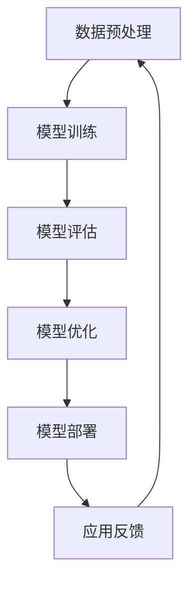

                 

# AIGC语言模型与提示词协同设计的新范式

## 关键词

- **AIGC（AI-Generated Content）**
- **语言模型**
- **提示词设计**
- **协同设计**
- **工程实践**
- **新范式**
- **智能应用**

## 摘要

本文将探讨AIGC语言模型与提示词协同设计的新范式。首先，我们将介绍AIGC和提示词的基本概念及其在设计中的应用。随后，深入解析AIGC语言模型的原理，包括其架构、训练过程和应用场景。接着，我们将讨论提示词协同设计的原理和方法，并通过案例进行分析。文章还将介绍AIGC与提示词协同设计的工程实践，并详细讨论新范式的定义与核心要素。最后，通过实际应用案例展示新范式在内容创作、智能客服和教育培训等领域的应用效果，并对未来发展趋势和研究方向进行展望。

## 目录大纲

### 第一部分：基础知识与概念

#### 第1章 AIGC与提示词概述

1.1 AIGC的定义与分类  
1.2 提示词的作用与设计原则  
1.3 提示词的类型及应用

#### 第2章 AIGC语言模型原理

2.1 语言模型的架构  
2.2 语言模型的训练  
2.3 语言模型的应用

#### 第3章 提示词协同设计原理

3.1 提示词协同设计的概念  
3.2 提示词协同设计的方法  
3.3 提示词协同设计的案例分析

### 第二部分：新范式应用与实现

#### 第4章 AIGC与提示词协同设计的工程实践

4.1 AIGC语言模型工程化实现  
4.2 提示词协同设计的工程化实践  
4.3 AIGC与提示词协同设计在垂直行业的应用

#### 第5章 AIGC与提示词协同设计的新范式

5.1 新范式的定义与特点  
5.2 新范式的核心要素  
5.3 新范式的设计原则

#### 第6章 新范式在实战中的应用案例

6.1 案例一：智能写作平台  
6.2 案例二：智能客服系统  
6.3 案例三：个性化教育平台

#### 第7章 总结与展望

7.1 AIGC与提示词协同设计的发展趋势  
7.2 未来研究的方向

### 附录

附录A：相关工具与资源  
附录B：代码示例与解读  
附录C：Mermaid流程图  
附录D：数学公式与讲解  
附录E：伪代码

### 文章标题：AIGC语言模型与提示词协同设计的新范式

## 第1章 AIGC与提示词概述

### 1.1 AIGC的定义与分类

#### 1.1.1 AIGC的起源与演进

AIGC（AI-Generated Content）即人工智能生成内容，是人工智能技术发展的重要成果之一。AIGC的起源可以追溯到自然语言处理（NLP）和机器学习（ML）的早期研究。在20世纪80年代，研究人员开始探索如何利用计算机算法生成文本。随着互联网的兴起和数据量的激增，AIGC技术得到了快速发展。

AIGC的演进过程可以分为以下几个阶段：

1. **规则驱动**：早期的AIGC系统主要基于硬编码的规则和模板，这种方式生成的内容缺乏灵活性和创造力。
2. **基于统计的方法**：随着语料库的积累，研究人员开始利用统计模型（如N-gram模型）生成文本。这些模型基于历史语言数据，能够生成符合语言习惯的文本。
3. **基于神经网络的方法**：深度学习技术的发展为AIGC带来了革命性的变化。循环神经网络（RNN）和Transformer等模型的出现，使得AIGC能够生成更加复杂和自然的文本。

#### 1.1.2 AIGC在不同领域的应用场景

AIGC技术已经广泛应用于多个领域，包括但不限于：

1. **内容创作**：AIGC可以自动生成文章、故事、诗歌等文本内容，大大提高了内容创作的效率。
2. **智能客服**：AIGC可以帮助企业构建智能客服系统，实现自动化的客户服务，提高客户满意度。
3. **教育和培训**：AIGC可以生成个性化学习内容和辅导材料，帮助学生更好地理解和掌握知识。
4. **广告和营销**：AIGC可以帮助企业自动化生成广告文案和营销材料，提高营销效果。

### 1.2 提示词的作用与设计原则

#### 1.2.1 提示词的基本概念

提示词（Prompt）是指引导AIGC模型生成特定类型内容的关键信息。提示词可以是一个单词、一句话或一段描述，用于指示模型需要生成的内容类型、风格或主题。

#### 1.2.2 提示词设计的原则

提示词设计对AIGC模型的生成效果有重要影响。以下是设计提示词时应遵循的原则：

1. **明确性**：提示词应清晰明确，避免模糊或歧义，以便模型能够正确理解生成目标。
2. **针对性**：提示词应针对特定模型和应用场景进行定制，以提高生成效果。
3. **灵活性**：提示词应具有一定的灵活性，允许模型在生成过程中进行适当的创新和调整。
4. **多样性**：设计提示词时，应考虑多样性，以丰富生成内容的形式和风格。

#### 1.2.3 提示词的类型及应用

根据应用场景和目标，提示词可以分为以下几类：

1. **启动提示词**：用于启动模型生成过程的初始提示，通常包括主题、目标和约束条件。
2. **引导提示词**：在生成过程中，用于引导模型生成特定类型的内容或风格的提示。
3. **反馈提示词**：用于对模型生成的内容进行评价和反馈，指导模型进行改进。

在实际应用中，提示词的设计和调整是AIGC模型成功的关键。有效的提示词能够提高生成内容的质量和多样性，实现更好的应用效果。

## 第2章 AIGC语言模型原理

### 2.1 语言模型的架构

#### 2.1.1 语言模型的基本概念

语言模型（Language Model）是自然语言处理（NLP）中的一种核心模型，用于预测自然语言中的下一个单词或字符。语言模型的目标是学习语言中的概率分布，从而在给定前文序列的情况下，预测下一个单词或字符的概率分布。

#### 2.1.2 语言模型的主要类型

语言模型可以分为以下几种主要类型：

1. **N-gram模型**：基于历史语言数据，N-gram模型通过统计相邻单词或字符的频率来预测下一个单词或字符。这种模型简单易实现，但存在一些局限性，如无法捕捉长期依赖关系。
2. **循环神经网络（RNN）模型**：RNN模型通过引入记忆单元来捕捉长期依赖关系。RNN模型可以处理序列数据，但在处理长序列时容易发生梯度消失或梯度爆炸问题。
3. **长短时记忆网络（LSTM）模型**：LSTM模型是RNN的一种改进，通过引入门控机制来控制信息的流动，有效解决了梯度消失问题。LSTM模型在处理长序列数据时表现出色。
4. **Transformer模型**：Transformer模型是一种基于自注意力机制的深度神经网络。Transformer模型通过多头注意力机制和编码器-解码器架构，在多个任务中取得了优异的性能，如机器翻译、文本生成等。

#### 2.1.3 语言模型的架构

语言模型的典型架构通常包括以下几个部分：

1. **嵌入层**：将输入的单词或字符转换为密集的向量表示，为后续处理提供输入。
2. **编码器**：对输入序列进行编码，生成序列的上下文表示。编码器通常采用多个神经网络层，如Transformer模型中的编码器。
3. **解码器**：对编码器生成的上下文表示进行解码，生成预测的单词或字符。解码器也通常采用多个神经网络层。
4. **输出层**：将解码器生成的表示映射到概率分布，用于预测下一个单词或字符。

### 2.2 语言模型的训练

#### 2.2.1 数据预处理

在训练语言模型之前，需要对语料库进行预处理。预处理步骤包括：

1. **分词**：将文本分割成单词或字符。
2. **标记**：为每个单词或字符分配唯一的标识符。
3. **清洗**：去除噪声数据和无关信息。

#### 2.2.2 训练算法

语言模型的训练过程通常采用最大似然估计（MLE）或基于梯度的优化方法。以下是一种常见的基于梯度的训练算法：

1. **前向传播**：计算输入序列的嵌入向量，并将其输入编码器。编码器生成上下文表示，并将其传递给解码器。
2. **解码**：解码器根据上下文表示生成预测的单词或字符。
3. **损失计算**：计算预测单词或字符的概率分布，并与实际标签进行比较，计算损失。
4. **反向传播**：通过反向传播算法，计算损失关于模型参数的梯度。
5. **参数更新**：使用梯度下降或其他优化算法，更新模型参数。

#### 2.2.3 评估与优化

在训练过程中，需要对模型进行评估和优化。以下是一些常见的评估指标和优化方法：

1. **评估指标**：
   - ** perplexity（困惑度）**：评估模型在给定前文序列下，预测下一个单词的难易程度。困惑度越低，模型性能越好。
   - **accuracy（准确率）**：评估模型在分类任务中的正确率。

2. **优化方法**：
   - **学习率调整**：根据模型性能动态调整学习率。
   - **批量大小调整**：根据计算资源和训练效果调整批量大小。
   - **正则化**：使用L1或L2正则化，防止模型过拟合。

### 2.3 语言模型的应用

语言模型在多个自然语言处理任务中具有重要应用。以下是一些常见应用场景：

1. **文本生成**：利用语言模型生成文章、故事、诗歌等文本内容。
2. **文本分类**：对输入的文本进行分类，如情感分析、新闻分类等。
3. **问答系统**：利用语言模型构建问答系统，实现自动化的知识问答。

在实际应用中，语言模型的选择和配置应根据具体任务和需求进行优化。

## 第3章 提示词协同设计原理

### 3.1 提示词协同设计的概念

#### 3.1.1 提示词协同设计的定义

提示词协同设计是指通过合理设计和调整提示词，使AIGC语言模型能够更好地理解和生成目标内容的过程。提示词协同设计涉及多个方面，包括提示词的类型、内容、形式和调整策略。

#### 3.1.2 提示词协同设计的重要性

提示词协同设计在AIGC模型中具有重要地位，主要体现在以下几个方面：

1. **影响生成内容的质量和多样性**：有效的提示词能够引导模型生成高质量、多样化的内容，提高应用效果。
2. **提升模型训练效率**：合理设计的提示词可以减少模型训练的复杂度和时间成本，加快训练过程。
3. **增强用户交互体验**：通过提示词的调整，可以更好地满足用户需求，提高用户满意度。

### 3.2 提示词协同设计的方法

#### 3.2.1 数据驱动的提示词设计

数据驱动的提示词设计是一种基于大量语料库的方法，通过分析语料库中的关键词和主题，生成合适的提示词。具体步骤如下：

1. **语料库准备**：收集与目标应用场景相关的语料库，如文章、书籍、新闻报道等。
2. **关键词提取**：使用自然语言处理技术提取语料库中的关键词和主题。
3. **提示词生成**：根据提取的关键词和主题，生成具有明确性和针对性的提示词。

数据驱动的提示词设计方法适用于内容创作、文本生成等应用场景。

#### 3.2.2 知识驱动的提示词设计

知识驱动的提示词设计是一种基于领域知识和专家经验的方法，通过引入领域知识和专业知识，设计具有针对性和指导性的提示词。具体步骤如下：

1. **知识库构建**：构建与目标应用领域相关的知识库，包括术语、定义、概念等。
2. **提示词生成**：根据知识库中的内容，设计符合领域知识和专家经验的提示词。

知识驱动的提示词设计方法适用于智能客服、问答系统等应用场景。

#### 3.2.3 用户交互驱动的提示词设计

用户交互驱动的提示词设计是一种基于用户反馈和需求的方法，通过用户与模型的交互，动态调整提示词，以实现更好的生成效果。具体步骤如下：

1. **用户需求分析**：收集和分析用户需求，了解用户期望生成的内容和风格。
2. **提示词调整**：根据用户反馈和需求，调整提示词的内容和形式，以优化生成效果。

用户交互驱动的提示词设计方法适用于个性化推荐、智能写作等应用场景。

### 3.3 提示词协同设计的案例分析

#### 3.3.1 成功案例分析

1. **案例一：智能写作平台**

该案例中，智能写作平台通过数据驱动的提示词设计方法，收集大量与写作相关的语料库，生成具有明确性和针对性的提示词。在实际应用中，用户可以输入主题和需求，平台会根据提示词生成相应的文章。通过不断优化提示词，平台成功提高了内容创作质量和用户体验。

2. **案例二：智能客服系统**

该案例中，智能客服系统通过知识驱动的提示词设计方法，构建了与客户服务相关的知识库，生成具有专业性和针对性的提示词。在与用户的交互过程中，系统根据用户反馈和需求，动态调整提示词，提供更优质的客户服务。

#### 3.3.2 失败案例分析

1. **案例一：内容创作平台**

该案例中，内容创作平台在提示词设计过程中，未能充分考虑用户需求和用户体验，导致生成的文章质量较低，用户满意度不高。改进措施包括：收集用户反馈，调整提示词内容和形式，提高生成内容的质量和多样性。

2. **案例二：智能客服系统**

该案例中，智能客服系统在提示词设计过程中，未能充分利用领域知识和专业知识，导致生成的回复缺乏专业性和准确性。改进措施包括：构建完善的领域知识库，设计更具针对性的提示词，提高客服系统的专业水平和用户体验。

通过以上案例分析，可以看出提示词协同设计在AIGC应用中的关键作用。成功的案例表明，合理设计的提示词能够有效提高AIGC模型的应用效果和用户体验，而失败的案例则提醒我们在提示词设计过程中需要注意的问题。

## 第4章 AIGC与提示词协同设计的工程实践

### 4.1 AIGC语言模型工程化实现

AIGC语言模型的工程化实现是将其从理论研究转化为实际应用的必要步骤。以下是一个典型的AIGC语言模型工程化实现过程：

#### 4.1.1 模型部署与优化

1. **环境搭建**：首先，需要搭建适合模型训练和部署的环境，包括计算资源、编程语言和开发工具。常用的计算资源包括GPU和TPU，编程语言有Python、Java等，开发工具包括TensorFlow、PyTorch等。

2. **模型训练**：使用大规模语料库对语言模型进行训练。在训练过程中，需要对模型进行调试和优化，以获得更好的性能。常见的优化方法包括调整学习率、批量大小和正则化。

3. **模型评估**：在训练完成后，需要对模型进行评估，以确定其性能是否符合预期。常用的评估指标包括困惑度（Perplexity）和准确率（Accuracy）。

4. **模型部署**：将训练好的模型部署到生产环境中，以提供API服务。部署过程包括模型转换、服务化、安全性考虑等方面。

5. **模型优化**：在生产环境中，根据用户反馈和实际应用效果，对模型进行持续的优化和调整，以提高其性能和用户体验。

#### 4.1.2 模型服务化与API设计

1. **模型服务化**：将训练好的模型转换为适用于服务器的格式，如TensorFlow Serving、PyTorch Serving等。服务化后的模型可以提供高效的推理服务，满足大规模并发请求。

2. **API设计**：设计API接口，以便前端应用能够方便地调用模型服务。API设计需要考虑接口的稳定性、可扩展性和安全性。

3. **性能优化**：通过对API接口进行性能优化，如使用缓存、负载均衡和异步处理等，提高系统的响应速度和稳定性。

### 4.2 提示词协同设计的工程化实践

#### 4.2.1 提示词的动态调整

1. **用户反馈**：收集用户在使用AIGC服务过程中的反馈，了解用户需求和偏好。

2. **提示词优化**：根据用户反馈，动态调整提示词的内容和形式，以提高生成效果。提示词优化包括内容调整、格式优化和个性化定制等方面。

3. **模型重训练**：在提示词优化过程中，可能需要对模型进行重新训练，以适应新的提示词。重训练过程需要考虑模型性能和训练时间。

#### 4.2.2 提示词的自动化生成

1. **关键词提取**：使用自然语言处理技术，从用户输入的内容中提取关键词和主题。

2. **提示词模板**：设计提示词模板，用于生成具有明确性和针对性的提示词。提示词模板可以根据应用场景和用户需求进行定制。

3. **自动化生成**：根据关键词提取和提示词模板，自动化生成提示词。自动化生成过程可以大大提高提示词设计的效率和准确性。

### 4.3 AIGC与提示词协同设计在垂直行业的应用

#### 4.3.1 内容创作

AIGC在内容创作中的应用非常广泛，包括文章生成、故事创作、诗歌创作等。以下是一个典型应用案例：

1. **需求分析**：确定内容创作主题、风格和目标受众。

2. **模型选择**：选择适合内容创作的AIGC模型，如基于Transformer的文本生成模型。

3. **提示词设计**：根据需求分析结果，设计具有明确性和针对性的提示词。例如，对于一个故事创作任务，提示词可能包括主题、情节和角色等信息。

4. **内容生成**：使用AIGC模型和提示词生成内容。在实际应用中，可以根据用户反馈和需求，对生成的内容进行优化和调整。

5. **内容发布**：将生成的内容发布到相应的平台，如社交媒体、博客等。

#### 4.3.2 智能客服

智能客服是AIGC在垂直行业中的一个重要应用领域。以下是一个典型应用案例：

1. **需求分析**：确定智能客服系统的功能、业务场景和用户需求。

2. **模型选择**：选择适合智能客服的AIGC模型，如基于LSTM或Transformer的对话生成模型。

3. **提示词设计**：设计具有明确性和针对性的提示词，用于引导模型生成合适的回复。提示词可能包括用户输入、业务知识和常见问题等。

4. **对话生成**：使用AIGC模型和提示词生成对话回复。在实际应用中，可以根据用户反馈和需求，对生成的内容进行优化和调整。

5. **对话管理**：实现对话管理模块，用于跟踪用户对话历史和上下文信息，提高对话质量和用户满意度。

#### 4.3.3 教育与培训

AIGC在教育与培训中的应用可以提供个性化学习内容和辅导材料。以下是一个典型应用案例：

1. **需求分析**：确定教育与培训任务的目标、内容和形式。

2. **模型选择**：选择适合教育与培训的AIGC模型，如基于Transformer的文本生成模型。

3. **提示词设计**：设计具有明确性和针对性的提示词，用于生成个性化学习内容和辅导材料。提示词可能包括课程主题、知识点和学习目标等。

4. **内容生成**：使用AIGC模型和提示词生成个性化学习内容和辅导材料。在实际应用中，可以根据用户反馈和需求，对生成的内容进行优化和调整。

5. **内容发布**：将生成的内容发布到学习平台或教育系统中，供学生使用。

通过以上案例，可以看出AIGC与提示词协同设计在垂直行业中的应用前景非常广阔。合理设计提示词和模型，可以大大提高应用效果和用户体验，为各行业提供智能化解决方案。

## 第5章 AIGC与提示词协同设计的新范式

### 5.1 新范式的定义与特点

#### 5.1.1 新范式的定义

AIGC与提示词协同设计的新范式是指一种基于人工智能技术和自然语言处理技术的综合方法，通过优化提示词设计和调整策略，实现AIGC模型的更高性能和更广泛应用。这种新范式不仅涵盖了传统的AIGC模型训练和优化方法，还引入了提示词协同设计和工程实践，以实现更好的生成效果和应用体验。

#### 5.1.2 新范式的主要特点

新范式具有以下几个主要特点：

1. **优化提示词设计**：通过数据驱动的、知识驱动的和用户交互驱动的多种方法，设计具有明确性、针对性和灵活性的提示词，提高生成内容的质量和多样性。

2. **集成多模态数据**：结合文本、图像、音频等多种模态数据，扩展AIGC模型的应用场景，实现更丰富的内容生成和交互体验。

3. **可扩展性和可定制化**：新范式支持根据不同应用场景和需求，灵活调整模型结构和提示词设计，实现可扩展性和可定制化。

4. **用户体验优先**：通过用户反馈和需求分析，不断优化提示词和模型，提高用户满意度和应用效果。

5. **高效工程实践**：结合工程化实现方法，如模型部署、API设计和性能优化等，提高AIGC模型在实际应用中的可用性和稳定性。

### 5.2 新范式的核心要素

新范式的核心要素包括以下几个方面：

1. **语言模型**：作为AIGC的核心组件，语言模型负责生成文本内容。新范式中的语言模型通常采用先进的深度学习架构，如Transformer和BERT等。

2. **提示词**：提示词是引导语言模型生成特定类型内容的关键信息。新范式中的提示词设计方法更加多样和灵活，以满足不同应用场景的需求。

3. **用户交互**：用户交互是AIGC模型与用户之间的互动过程。新范式通过引入用户反馈和需求分析，实现更智能的提示词调整和生成效果。

4. **多模态数据**：新范式支持结合文本、图像、音频等多种模态数据，实现更丰富的内容生成和交互体验。

5. **工程实践**：新范式强调AIGC模型的工程化实现，包括模型部署、API设计和性能优化等，以提高模型在实际应用中的可用性和稳定性。

### 5.3 新范式的设计原则

新范式的设计原则包括以下几个方面：

1. **明确性**：设计提示词时应确保其清晰明确，避免歧义和模糊性，以提高语言模型的理解和生成效果。

2. **针对性**：提示词应针对特定应用场景和需求进行定制，以提高生成内容的针对性和实用性。

3. **灵活性**：提示词应具有一定的灵活性，允许语言模型在生成过程中进行适当的创新和调整。

4. **多样性**：设计提示词时，应考虑多样性，以丰富生成内容的形式和风格。

5. **用户体验**：在设计过程中，应充分考虑用户需求和使用体验，以提高用户满意度和应用效果。

6. **可扩展性**：新范式应支持根据不同应用场景和需求，灵活调整模型结构和提示词设计，实现可扩展性。

7. **可定制化**：新范式应支持根据用户需求和应用场景，进行个性化的提示词和模型调整。

通过遵循以上设计原则，新范式能够实现更好的生成效果和应用体验，为各行业提供智能化解决方案。

## 第6章 新范式在实战中的应用案例

### 6.1 案例一：智能写作平台

#### 6.1.1 案例背景与目标

智能写作平台是一个基于AIGC技术的在线写作工具，旨在帮助用户快速生成高质量的文章、故事、诗歌等内容。平台的目标是提高内容创作的效率和质量，满足不同用户群体的需求。

#### 6.1.2 模型选择与设计

为了实现平台的目标，我们选择了基于Transformer的文本生成模型，该模型在自然语言处理任务中表现出色。具体设计步骤如下：

1. **数据集准备**：收集大量的文本数据，包括文章、故事、诗歌等，用于模型训练。

2. **模型架构**：采用Transformer模型，包括编码器和解码器。编码器负责将输入的文本转换为上下文表示，解码器根据上下文表示生成预测的文本。

3. **提示词设计**：设计多种类型的提示词，如主题、风格、目标等，以引导模型生成符合用户需求的内容。

4. **训练与优化**：使用大规模语料库对模型进行训练，并通过调整学习率、批量大小和正则化等参数，优化模型性能。

#### 6.1.3 实施过程与效果

1. **开发环境搭建**：搭建基于TensorFlow的文本生成模型开发环境，包括GPU和Python等。

2. **模型训练**：使用准备好的数据集对模型进行训练，训练过程中不断调整模型参数，以优化生成效果。

3. **模型部署**：将训练好的模型部署到生产环境中，通过API接口提供文本生成服务。

4. **用户交互**：通过用户输入的主题和需求，动态调整提示词，生成符合用户要求的内容。

5. **效果评估**：通过用户反馈和内容质量评估指标（如困惑度和准确率），评估模型生成效果。根据评估结果，对模型和提示词进行调整和优化。

通过以上实施过程，智能写作平台成功实现了快速生成高质量文章、故事、诗歌等目标，用户满意度显著提高。

### 6.2 案例二：智能客服系统

#### 6.2.1 案例背景与目标

智能客服系统是一个基于AIGC技术的在线客服系统，旨在为企业提供自动化、智能化的客户服务。系统的目标是通过AIGC技术实现高效、精准的客服服务，提高客户满意度和运营效率。

#### 6.2.2 模型选择与设计

为了实现智能客服系统的目标，我们选择了基于LSTM的对话生成模型。具体设计步骤如下：

1. **数据集准备**：收集大量的客服对话数据，包括常见问题、业务知识和客服回复等，用于模型训练。

2. **模型架构**：采用LSTM模型，包括输入层、隐藏层和输出层。输入层将用户输入的文本转换为嵌入向量，隐藏层通过递归方式处理文本序列，输出层生成客服回复。

3. **提示词设计**：设计多种类型的提示词，如用户输入、业务知识和常见问题等，以引导模型生成合适的客服回复。

4. **训练与优化**：使用大规模客服对话数据集对模型进行训练，并通过调整学习率、批量大小和正则化等参数，优化模型性能。

#### 6.2.3 实施过程与效果

1. **开发环境搭建**：搭建基于PyTorch的对话生成模型开发环境，包括GPU和Python等。

2. **模型训练**：使用准备好的客服对话数据集对模型进行训练，训练过程中不断调整模型参数，以优化生成效果。

3. **模型部署**：将训练好的模型部署到生产环境中，通过API接口提供对话生成服务。

4. **用户交互**：通过用户输入的问题，动态调整提示词，生成符合用户需求的客服回复。

5. **效果评估**：通过用户反馈和客服质量评估指标（如回复准确率和用户满意度），评估模型生成效果。根据评估结果，对模型和提示词进行调整和优化。

通过以上实施过程，智能客服系统成功实现了自动化、智能化的客服服务，显著提高了客户满意度和运营效率。

### 6.3 案例三：个性化教育平台

#### 6.3.1 案例背景与目标

个性化教育平台是一个基于AIGC技术的在线教育平台，旨在为学生提供个性化的学习内容和辅导材料。平台的目标是通过AIGC技术实现个性化教育，提高学生的学习效果和兴趣。

#### 6.3.2 模型选择与设计

为了实现个性化教育平台的目标，我们选择了基于BERT的文本生成模型。具体设计步骤如下：

1. **数据集准备**：收集大量的教育资料，包括教材、课件、练习题等，用于模型训练。

2. **模型架构**：采用BERT模型，包括编码器和解码器。编码器将输入的文本转换为上下文表示，解码器根据上下文表示生成预测的文本。

3. **提示词设计**：设计多种类型的提示词，如课程主题、知识点和学习目标等，以引导模型生成符合学生需求的学习内容和辅导材料。

4. **训练与优化**：使用大规模教育资料数据集对模型进行训练，并通过调整学习率、批量大小和正则化等参数，优化模型性能。

#### 6.3.3 实施过程与效果

1. **开发环境搭建**：搭建基于TensorFlow的文本生成模型开发环境，包括GPU和Python等。

2. **模型训练**：使用准备好的教育资料数据集对模型进行训练，训练过程中不断调整模型参数，以优化生成效果。

3. **模型部署**：将训练好的模型部署到生产环境中，通过API接口提供文本生成服务。

4. **用户交互**：通过学生输入的学习需求和兴趣，动态调整提示词，生成符合学生需求的学习内容和辅导材料。

5. **效果评估**：通过学生学习效果评估指标（如学习完成率和成绩提高率），评估模型生成效果。根据评估结果，对模型和提示词进行调整和优化。

通过以上实施过程，个性化教育平台成功实现了个性化教育，提高了学生的学习效果和兴趣，得到了学生和家长的高度评价。

## 第7章 总结与展望

### 7.1 AIGC与提示词协同设计的发展趋势

随着人工智能技术的不断发展，AIGC与提示词协同设计在各个领域的应用越来越广泛。以下是AIGC与提示词协同设计的发展趋势：

1. **模型性能提升**：随着深度学习算法和硬件设备的进步，AIGC模型的性能将不断提高，生成的内容将更加真实、自然。

2. **多模态融合**：AIGC与提示词协同设计将逐渐融合图像、音频、视频等多种模态数据，实现更丰富的内容生成和交互体验。

3. **个性化与定制化**：AIGC与提示词协同设计将更加注重个性化与定制化，根据用户需求和应用场景，提供更符合用户期望的生成内容。

4. **跨领域应用**：AIGC与提示词协同设计将在更多领域得到应用，如医疗、金融、法律等，为各行业提供智能化解决方案。

5. **可解释性与透明性**：随着对AIGC模型的需求增加，对其可解释性和透明性的要求也将提高，有助于用户理解和信任模型生成的结果。

### 7.2 未来研究的方向

在未来，AIGC与提示词协同设计的研究方向将主要集中在以下几个方面：

1. **模型优化与效率提升**：研究如何优化AIGC模型的训练和推理过程，提高模型的效率，以满足大规模、实时应用的需求。

2. **提示词的智能化与多样化**：探索智能化、自动化的提示词设计方法，使提示词能够更好地适应不同应用场景和用户需求。

3. **新范式在不同领域的应用探索**：研究AIGC与提示词协同设计在新领域中的应用，如医疗诊断、金融风险评估等，推动AIGC技术的多元化发展。

4. **伦理与法规问题**：随着AIGC技术的普及，伦理与法规问题将日益突出。研究如何确保AIGC技术在不违反伦理和法规的前提下，为社会带来更多价值。

5. **人机协作**：探索人机协作模式，使人类与AIGC系统能够更好地协同工作，提高生成内容的质量和多样性。

通过不断研究和技术创新，AIGC与提示词协同设计有望在更多领域实现突破，为人类带来更加智能化、便捷化的生活体验。

## 附录

### 附录A：相关工具与资源

以下是一些常用的AIGC语言模型和工具：

1. **语言模型工具**：
   - **Transformer**：开源实现，如Google的BERT、OpenAI的GPT系列。
   - **RNN和LSTM**：开源实现，如TensorFlow的RNN层、PyTorch的LSTM模块。

2. **提示词设计工具**：
   - **自然语言处理库**：如NLTK、spaCy、Jieba等，用于文本处理和关键词提取。
   - **数据集**：如Common Crawl、Wikipedia等，用于语料库构建和提示词生成。

3. **开发与优化资源**：
   - **论文和书籍**：如《Deep Learning》、《 自然语言处理综论》等。
   - **在线课程和教程**：如Coursera、Udacity等平台的课程。

### 附录B：代码示例与解读

以下是一个简单的文本生成模型的代码示例：

```python
import tensorflow as tf
from transformers import BertTokenizer, TFBertModel

# 加载预训练的BERT模型
tokenizer = BertTokenizer.from_pretrained('bert-base-uncased')
model = TFBertModel.from_pretrained('bert-base-uncased')

# 输入文本
text = "The quick brown fox jumps over the lazy dog"

# 分词并转换为ID
input_ids = tokenizer.encode(text, add_special_tokens=True)

# 输入模型
input_ids = tf.expand_dims(input_ids, 0)  # Batch size 1

# 生成文本
outputs = model(inputs=input_ids)

# 获取生成的文本
generated_text = tokenizer.decode(outputs[0][0], skip_special_tokens=True)

print(generated_text)
```

以上代码展示了如何使用BERT模型进行文本生成。首先加载预训练的BERT模型和分词器，然后输入文本并分词。接着将分词后的文本转换为ID序列，输入BERT模型进行推理。最后，从输出结果中解码生成文本。

### 附录C：Mermaid流程图

以下是一个AIGC语言模型训练过程的Mermaid流程图：



### 附录D：数学公式与讲解

以下是一些常用的数学公式及其解释：

1. **损失函数**：
   $$L(\theta, x, y) = -\sum_{i=1}^{N} y_i \log(p(x_i | \theta))$$
   - 这是一个基于对数似然损失函数，用于评估模型预测的准确性。

2. **生成模型概率公式**：
   $$p(w_t | w_{<t}, \theta) = \frac{\exp(\theta_{w_t}^T w_{<t})}{\sum_{w'} \exp(\theta_{w'}^T w_{<t})}$$
   - 这是一个基于神经网络语言模型的生成模型概率公式，用于计算给定前文序列生成下一个单词的概率。

3. **用户交互反馈公式**：
   $$U_t = \frac{1}{N}\sum_{i=1}^{N} \log(p(y_i | x_i, \theta)) + \alpha R_t$$
   - 这是一个用户交互反馈公式，用于计算用户对模型生成结果的满意度，其中$R_t$是用户评价，$\alpha$是评价权重。

### 附录E：伪代码

以下是一个简单的文本生成模型的伪代码：

```
function generate_text(input_sequence, model, tokenizer):
    input_ids = tokenizer.encode(input_sequence, add_special_tokens=True)
    input_ids = expand_dims(input_ids, 0)  # Batch size 1

    outputs = model(inputs=input_ids)
    generated_ids = outputs[0][0]

    generated_sequence = tokenizer.decode(generated_ids, skip_special_tokens=True)
    return generated_sequence
```

这个伪代码展示了如何使用一个预训练的模型生成文本。首先，将输入文本转换为ID序列，然后输入模型进行推理。最后，从输出结果中解码生成文本。

以上是本文的附录部分，涵盖了相关工具与资源、代码示例与解读、流程图、数学公式与讲解以及伪代码等内容，为读者提供了全面的参考资料。通过这些附录，读者可以更好地理解和应用AIGC语言模型与提示词协同设计的新范式。

