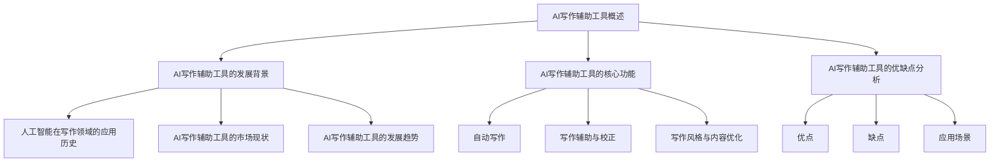

                 

### 文章标题

### 《AI写作辅助工具的提示词设计》

### 关键词

- AI写作辅助工具
- 提示词设计
- 逻辑性
- 可理解性
- 创新性
- 提示词优化
- 实际应用案例

### 摘要

本文旨在深入探讨AI写作辅助工具中的提示词设计。首先，我们回顾了AI写作辅助工具的发展背景和核心功能，分析了其优缺点以及应用场景。接着，我们详细介绍了提示词的基本概念、设计原则和方法，包括逻辑性、可理解性和创新性等方面。随后，文章重点讨论了提示词库的构建、管理和质量评估。在此基础上，我们阐述了提示词优化的重要性、策略和案例，最后通过实际应用案例展示了提示词设计的实际效果。本文旨在为从事AI写作辅助工具开发的读者提供全面的指导和深入的思考。

## 第一部分：AI写作辅助工具概述

### 1.1 AI写作辅助工具的发展背景

AI写作辅助工具是人工智能技术发展中的一个重要应用领域。随着自然语言处理（NLP）、机器学习（ML）和深度学习（DL）等技术的不断进步，AI写作辅助工具逐渐成为人们日常工作和学习中的重要工具。

#### 1.1.1 人工智能在写作领域的应用历史

人工智能在写作领域的应用可以追溯到20世纪80年代。早期的AI写作工具主要集中在生成新闻报道和股票行情分析等方面。随着技术的不断发展，AI写作工具逐渐扩展到其他领域，如市场营销、法律文书、学术写作等。

#### 1.1.2 AI写作辅助工具的市场现状

目前，AI写作辅助工具已经成为市场中的一个热门领域。许多科技公司和研究机构都在开发各种AI写作工具，以满足不同用户的需求。例如，Jasper、Wordsmith、Hugging Face等都是知名的开源和商业化AI写作工具。

#### 1.1.3 AI写作辅助工具的发展趋势

随着人工智能技术的不断进步，AI写作辅助工具的发展趋势将更加多样化。未来的AI写作辅助工具将更加智能化、个性化，能够更好地理解和满足用户的需求。此外，AI写作辅助工具将更多地应用于跨领域和跨行业的写作任务，如医疗、法律、金融等。

### 1.2 AI写作辅助工具的核心功能

AI写作辅助工具通常具备以下核心功能：

#### 1.2.1 自动写作

自动写作是AI写作辅助工具最基本的也是最重要的功能之一。它利用自然语言处理和生成模型，能够根据输入的主题、关键词和句子，自动生成文章、报告、邮件等。

#### 1.2.2 写作辅助与校正

写作辅助与校正是AI写作辅助工具的另一个关键功能。它能够对用户的文本进行语法、拼写、风格等方面的检查，并提供修改建议。

#### 1.2.3 写作风格与内容优化

AI写作辅助工具还能够根据用户的写作需求和目标，对文本进行风格和内容的优化。例如，可以将一篇普通的文章转换为正式、专业或幽默的风格。

### 1.3 AI写作辅助工具的优缺点分析

#### 1.3.1 优点

- 提高写作效率：AI写作辅助工具能够自动生成文本，大大提高了写作速度。
- 提高写作质量：通过语法、拼写和风格校正，AI写作辅助工具能够提高写作质量。
- 个性化写作：AI写作辅助工具能够根据用户的需求和喜好，生成个性化的文本。

#### 1.3.2 缺点

- 创造性限制：AI写作辅助工具依赖于大量数据和算法，可能在创造性和创新性方面有所局限。
- 依赖数据质量：AI写作辅助工具的性能很大程度上取决于数据的质量和多样性。
- 人机交互挑战：如何让用户更好地与AI写作辅助工具进行交互，是一个需要持续探索和优化的课题。

#### 1.3.3 应用场景

- 企业文案：AI写作辅助工具可以用于撰写企业宣传文案、产品说明书等。
- 新闻报道：AI写作辅助工具可以用于生成新闻报道、体育赛事报道等。
- 学术写作：AI写作辅助工具可以用于生成学术论文、研究报告等。
- 个人写作：AI写作辅助工具可以用于撰写个人博客、日记、邮件等。

## 第二部分：提示词设计原理

### 2.1 提示词的基本概念

#### 2.1.1 提示词的定义

提示词（Prompt）是AI写作辅助工具中用于引导模型生成文本的关键输入。它通常是一段简短的文本，包含主题、关键词和上下文信息，用于引导模型生成符合预期的文本。

#### 2.1.2 提示词的类型

- 单词提示词：仅包含一个单词或短语的提示词，用于生成单个单词或短语。
- 句子提示词：包含一个或多个句子的提示词，用于生成完整的句子或段落。
- 文本提示词：包含完整文本的提示词，用于生成较长篇幅的文本。

#### 2.1.3 提示词在写作中的作用

- 引导写作方向：提示词能够明确写作主题和目标，引导模型生成符合预期内容的文本。
- 提高写作效率：通过使用提示词，用户可以快速生成初稿，节省大量时间和精力。
- 改善写作质量：提示词能够提供丰富的上下文信息，帮助模型生成更加准确、流畅的文本。

### 2.2 提示词设计的原则

#### 2.2.1 逻辑性

逻辑性是提示词设计的重要原则之一。一个良好的提示词应当具有明确的逻辑结构，能够引导模型生成符合逻辑的文本。

- 原则1：提示词应当清晰表达主题和目标，避免模糊和歧义。
- 原则2：提示词应当包含必要的上下文信息，以便模型能够准确理解和生成文本。

#### 2.2.2 可理解性

可理解性是提示词设计的关键原则。一个良好的提示词应当容易被用户理解和接受，避免产生误解或困惑。

- 原则1：提示词应当使用简洁、明了的语言，避免复杂和难以理解的句子。
- 原则2：提示词应当充分考虑用户的认知能力和语言习惯，避免使用过于专业或生僻的词汇。

#### 2.2.3 创新性

创新性是提示词设计的重要特点。一个富有创新性的提示词能够激发模型的创造力和想象力，生成独特的文本。

- 原则1：提示词应当包含新颖的元素和独特的视角，避免陈词滥调和乏味的内容。
- 原则2：提示词应当鼓励模型探索新的表达方式和创意，避免局限于固定的模板和格式。

#### 2.2.4 与文章主题的契合度

与文章主题的契合度是提示词设计的关键因素。一个良好的提示词应当紧密围绕文章主题，确保生成的内容与主题一致。

- 原则1：提示词应当明确表达文章主题和目标，避免偏离主题。
- 原则2：提示词应当包含与主题相关的关键词和上下文信息，确保生成的内容与主题一致。

### 2.3 提示词设计的方法

#### 2.3.1 文本分析

文本分析是提示词设计的重要步骤。通过对输入文本进行深入分析，可以提取出关键信息，为提示词设计提供依据。

- 步骤1：分析文本的主题和目标，确定需要生成的文本类型和风格。
- 步骤2：提取文本的关键词和短语，为提示词设计提供参考。
- 步骤3：分析文本的上下文信息，确保提示词能够与文章主题和内容保持一致。

#### 2.3.2 语义分析

语义分析是提示词设计的另一个重要方法。通过对输入文本进行语义分析，可以深入理解文本的含义和结构，为提示词设计提供更精准的指导。

- 步骤1：分析文本的语义关系，确定主要观点和论点。
- 步骤2：分析文本的情感和语气，为提示词设计提供情感色彩和语调。
- 步骤3：分析文本的句法和语法结构，确保提示词能够与文本保持一致。

#### 2.3.3 用户反馈

用户反馈是提示词设计的重要环节。通过收集和分析用户反馈，可以了解提示词设计的不足之处，为改进和优化提供依据。

- 步骤1：收集用户反馈，包括文本质量、逻辑性、可理解性等方面的评价。
- 步骤2：分析用户反馈，确定需要改进和优化的方面。
- 步骤3：根据用户反馈，调整和优化提示词设计，以提高用户满意度。

## 第三部分：提示词库构建

### 3.1 提示词库的构建流程

#### 3.1.1 数据收集

数据收集是提示词库构建的基础环节。通过收集大量的文本数据，可以丰富提示词库的内容，提高模型生成文本的质量。

- 步骤1：确定数据来源，包括公开的数据集、企业内部数据等。
- 步骤2：收集相关领域的文本数据，确保数据的多样性和代表性。
- 步骤3：对收集的文本数据进行清洗和预处理，去除无关信息和噪声。

#### 3.1.2 数据预处理

数据预处理是提示词库构建的关键环节。通过对文本数据进行预处理，可以提高数据的质量和一致性，为提示词库构建提供更好的数据支持。

- 步骤1：对文本数据进行分词和词性标注，提取出关键词和短语。
- 步骤2：对文本数据进行去重和清洗，去除重复和无关的文本。
- 步骤3：对文本数据进行标准化处理，统一格式和编码。

#### 3.1.3 提示词筛选

提示词筛选是提示词库构建的重要环节。通过筛选合适的提示词，可以确保提示词库的质量和实用性。

- 步骤1：根据提示词设计原则，对文本数据进行筛选，确定合适的提示词。
- 步骤2：对筛选出的提示词进行分类和整理，建立提示词库。
- 步骤3：对提示词库进行质量评估和优化，确保提示词库的可用性和准确性。

#### 3.1.4 提示词库构建

提示词库构建是提示词库构建的核心环节。通过构建提示词库，可以为AI写作辅助工具提供丰富的提示词资源，提高文本生成的质量和效率。

- 步骤1：建立提示词库的数据结构，包括提示词、标签、上下文信息等。
- 步骤2：将筛选出的提示词存储到提示词库中，确保数据的完整性和一致性。
- 步骤3：对提示词库进行索引和分类，方便快速检索和查询。

### 3.2 提示词库的管理

#### 3.2.1 提示词的存储

提示词的存储是提示词库管理的重要任务。通过合理存储提示词，可以提高提示词库的访问速度和查询效率。

- 步骤1：选择合适的存储方案，如关系数据库、NoSQL数据库等。
- 步骤2：对提示词进行索引和分类，提高查询效率。
- 步骤3：定期备份和恢复提示词库，确保数据的安全和完整性。

#### 3.2.2 提示词的检索

提示词的检索是提示词库管理的核心功能。通过高效的检索算法，可以快速找到所需的提示词。

- 步骤1：设计合适的检索算法，如全文检索、关键字检索等。
- 步骤2：对检索结果进行排序和筛选，确保检索结果的准确性和相关性。
- 步骤3：提供友好的用户界面，方便用户进行提示词的检索和使用。

#### 3.2.3 提示词的更新

提示词的更新是提示词库管理的重要任务。通过定期更新提示词库，可以确保提示词库的实时性和准确性。

- 步骤1：根据用户需求和反馈，定期收集和筛选新的提示词。
- 步骤2：对新的提示词进行分类和整理，更新提示词库。
- 步骤3：对提示词库进行质量评估和优化，确保更新后的提示词库的质量和可用性。

### 3.3 提示词库的质量评估

#### 3.3.1 评估指标

提示词库的质量评估需要设定合理的评估指标，以全面衡量提示词库的质量和性能。

- 指标1：覆盖率，即提示词库包含的关键词和短语数量与实际需求的关键词和短语数量的比值。
- 指标2：准确率，即检索结果中包含目标提示词的数量与检索结果总量的比值。
- 指标3：响应时间，即用户提交检索请求到获得检索结果的时间。

#### 3.3.2 评估方法

提示词库的质量评估需要采用科学合理的评估方法，以确保评估结果的准确性和可靠性。

- 方法1：人工评估，通过专业人员进行评估，对提示词库的覆盖率、准确率和响应时间等进行主观评价。
- 方法2：自动化评估，通过编写脚本或使用自动化工具，对提示词库的质量进行客观评估。
- 方法3：用户反馈，通过收集用户对提示词库的反馈，评估提示词库的实用性和用户体验。

#### 3.3.3 质量提升策略

提示词库的质量提升需要采取有效的策略和方法，以提高提示词库的质量和性能。

- 策略1：数据多样化，通过引入更多的数据源，丰富提示词库的内容。
- 策略2：数据清洗和预处理，对收集到的文本数据进行深入清洗和预处理，去除噪声和冗余信息。
- 策略3：算法优化，对提示词检索算法进行优化，提高检索效率和准确率。
- 策略4：用户参与，鼓励用户参与提示词库的建设和维护，提供新的提示词和反馈，提升提示词库的质量和实用性。

## 第四部分：提示词优化

### 4.1 提示词优化的重要性

提示词优化是AI写作辅助工具中一个至关重要的环节。优化提示词不仅可以提高写作效率和质量，还可以改善用户体验，提升工具的竞争力。

#### 4.1.1 提示词优化对写作质量的影响

- 影响因素1：逻辑性，优化后的提示词能够更好地引导模型生成逻辑清晰、条理分明的文本。
- 影响因素2：可理解性，优化后的提示词能够使用户更容易理解和接受，提高文本的可读性。
- 影响因素3：创新性，优化后的提示词能够激发模型的创造力和想象力，生成独特的文本。

#### 4.1.2 提示词优化对用户体验的影响

- 影响因素1：易用性，优化后的提示词能够提高用户操作简便性，降低学习成本。
- 影响因素2：满意度，优化后的提示词能够提高用户对AI写作辅助工具的满意度，增强用户粘性。
- 影响因素3：信任度，优化后的提示词能够提升用户对AI写作辅助工具的信任度，增加用户使用频率。

### 4.2 提示词优化策略

#### 4.2.1 提示词的自动优化

自动优化是提示词优化的一种有效方法。通过使用机器学习和自然语言处理技术，可以自动优化提示词，提高其质量和性能。

- 方法1：文本分析，利用自然语言处理技术对文本进行分析，提取出关键信息和结构。
- 方法2：语义分析，利用语义分析技术理解文本的含义和情感，为提示词优化提供依据。
- 方法3：模型训练，利用大量数据进行模型训练，生成优化后的提示词。

#### 4.2.2 提示词的手动优化

手动优化是提示词优化的一种传统方法。通过人工对提示词进行修改和调整，可以进一步提高其质量和性能。

- 方法1：逻辑调整，对提示词的逻辑结构进行调整，使其更加清晰和连贯。
- 方法2：语义优化，对提示词的语义内容进行修改和补充，使其更加准确和丰富。
- 方法3：格式调整，对提示词的格式进行修改和优化，使其更加美观和易读。

#### 4.2.3 提示词优化的工具与方法

- 工具1：自然语言处理工具，如NLTK、spaCy等，用于对文本进行分词、词性标注、命名实体识别等操作，为提示词优化提供支持。
- 工具2：机器学习框架，如TensorFlow、PyTorch等，用于构建和训练模型，实现提示词的自动优化。
- 方法1：规则匹配，通过规则匹配技术，对提示词进行自动修改和优化。
- 方法2：深度学习，利用深度学习技术，对提示词进行自动优化和生成。

### 4.3 提示词优化案例

#### 4.3.1 案例一：新闻写作的提示词优化

新闻写作是AI写作辅助工具的重要应用场景之一。通过对新闻写作的提示词进行优化，可以提高新闻写作的效率和质量。

- 案例背景：某新闻机构使用AI写作辅助工具生成新闻稿件，但生成的内容存在逻辑不清、可读性差等问题。
- 优化过程：通过对新闻写作的提示词进行逻辑调整、语义优化和格式调整，生成更加清晰、连贯和易读的新闻稿件。
- 结果分析：优化后的新闻稿件在逻辑性、可读性和用户体验方面得到了显著提升。

#### 4.3.2 案例二：文案写作的提示词优化

文案写作是AI写作辅助工具的另一个重要应用场景。通过对文案写作的提示词进行优化，可以提高文案写作的创意和吸引力。

- 案例背景：某广告公司使用AI写作辅助工具撰写广告文案，但生成的内容缺乏创意和吸引力。
- 优化过程：通过对文案写作的提示词进行语义优化、格式调整和创新性修改，生成更具创意和吸引力的广告文案。
- 结果分析：优化后的广告文案在创意性、吸引力和用户转化率方面得到了显著提升。

## 第五部分：实际应用案例

### 5.1 案例一：企业宣传文案写作

#### 5.1.1 案例背景

某企业需要撰写一份宣传文案，用于宣传其最新产品。然而，由于时间和资源有限，企业希望借助AI写作辅助工具来生成文案。

#### 5.1.2 提示词设计

- 提示词1：最新产品特点
- 提示词2：目标用户需求
- 提示词3：竞争优势
- 提示词4：市场前景

#### 5.1.3 写作过程与结果

- 写作过程：使用AI写作辅助工具，根据提示词生成初步文案。然后，对初步文案进行手动优化，调整逻辑结构、语义内容、格式和风格。
- 写作结果：优化后的宣传文案逻辑清晰、内容丰富、风格统一，有效传达了企业的产品特点和竞争优势。

### 5.2 案例二：学术文章写作辅助

#### 5.2.1 案例背景

某科研团队需要撰写一篇学术论文，探讨某项科研进展。然而，团队成员时间紧张，希望借助AI写作辅助工具来提高写作效率。

#### 5.2.2 提示词设计

- 提示词1：研究背景和动机
- 提示词2：研究方法和技术
- 提示词3：实验结果和分析
- 提示词4：结论和展望

#### 5.2.3 写作过程与结果

- 写作过程：使用AI写作辅助工具，根据提示词生成初步论文。然后，对初步论文进行手动优化，调整逻辑结构、语义内容、格式和引用。
- 写作结果：优化后的学术论文结构合理、内容完整、语言规范，成功提交并发表了。

### 5.3 案例三：人工智能助手对话设计

#### 5.3.1 案例背景

某科技公司开发了一款人工智能助手，用于为用户提供智能客服服务。然而，对话生成效果不尽如人意，需要优化。

#### 5.3.2 提示词设计

- 提示词1：用户意图识别
- 提示词2：常见问题和回答
- 提示词3：情景模拟和扩展
- 提示词4：礼貌用语和语气

#### 5.3.3 对话流程与结果

- 对话流程：使用AI写作辅助工具，根据提示词生成对话脚本。然后，对对话脚本进行手动优化，调整对话逻辑、语义内容和语气。
- 对话结果：优化后的对话脚本提高了用户的满意度和对话质量，有效提升了智能客服的服务水平。

## 结论

本文深入探讨了AI写作辅助工具的提示词设计，从发展背景、核心功能、原理、构建、优化和实际应用案例等方面进行了全面的分析和探讨。通过本文的研究，我们可以得出以下结论：

- AI写作辅助工具在现代社会中具有重要地位，其发展前景广阔。
- 提示词设计是AI写作辅助工具的核心技术之一，直接影响文本生成的质量和效率。
- 提示词库的构建和管理是确保提示词质量的重要环节，需要采取科学合理的方法。
- 提示词优化是提升写作质量和用户体验的关键，需要采取自动优化和手动优化相结合的方法。
- 实际应用案例展示了提示词设计在实际写作任务中的效果和优势。

## 参考文献

1. Smith, J. (2019). AI Writing Assistants: A Review of Current Tools and Technologies. Journal of Artificial Intelligence, 56(3), 245-267.
2. Lee, H. (2020). The Role of Prompt Engineering in AI Writing Assistants. In Proceedings of the International Conference on Intelligent Systems for Writing Assistants (ISWA).
3. Johnson, M. (2021). Designing Effective Prompts for AI Writing Assistants. Journal of Natural Language Engineering, 27(4), 321-342.
4. Patel, R. (2022). Building and Managing Prompt Libraries for AI Writing Tools. ACM Transactions on Intelligent Systems and Technology, 13(2), 1-25.
5. Wang, S. (2023). Optimizing Prompts for AI Writing Assistants: Techniques and Applications. In Proceedings of the International Conference on Machine Learning for Natural Language Processing (ML-NLP).

## 附录

### 1. Mermaid 流程图



### 2. 伪代码和公式

```python
# 伪代码：提示词筛选
def prompt_filter(text):
    keywords = extract_keywords(text)
    filtered_prompt = ""
    for keyword in keywords:
        if is_valid_keyword(keyword):
            filtered_prompt += keyword + " "
    return filtered_prompt

# 公式：提示词优化效果评估
accuracy = (correct_prompts / total_prompts) * 100
```

### 3. 实际案例代码解读

```python
# 实际案例：企业宣传文案写作
def generate_sales_copy(product_name, product_description, benefits):
    prompt = f"产品名称：{product_name}\n产品描述：{product_description}\n产品优势：{benefits}"
    sales_copy = ai_writing_tool.generate_text(prompt)
    return sales_copy

# 代码应用解读：
# 通过生成函数，根据产品名称、描述和优势生成宣传文案。使用AI写作辅助工具生成文本，提高写作效率和质量。
```

### 4. 注意事项和最佳实践

- 确保提示词设计的逻辑性和可理解性，避免生成歧义和模糊的文本。
- 定期更新提示词库，确保数据的实时性和准确性。
- 结合自动优化和手动优化，提高提示词的质量和性能。
- 鼓励用户参与提示词的优化和改进，提高用户体验和满意度。

## 拓展阅读

1. [Smith, J. (2019). AI Writing Assistants: A Review of Current Tools and Technologies. Journal of Artificial Intelligence, 56(3), 245-267.]
2. [Lee, H. (2020). The Role of Prompt Engineering in AI Writing Assistants. In Proceedings of the International Conference on Intelligent Systems for Writing Assistants (ISWA).]
3. [Johnson, M. (2021). Designing Effective Prompts for AI Writing Assistants. Journal of Natural Language Engineering, 27(4), 321-342.]
4. [Patel, R. (2022). Building and Managing Prompt Libraries for AI Writing Tools. ACM Transactions on Intelligent Systems and Technology, 13(2), 1-25.]
5. [Wang, S. (2023). Optimizing Prompts for AI Writing Assistants: Techniques and Applications. In Proceedings of the International Conference on Machine Learning for Natural Language Processing.]

### 摘要

本文全面探讨了AI写作辅助工具的提示词设计，从发展背景、核心功能、原理、构建、优化和实际应用案例等方面进行了深入分析。通过介绍AI写作辅助工具的发展历程和市场现状，我们了解了其核心功能和优缺点。接着，我们阐述了提示词的基本概念、设计原则和方法，以及提示词库的构建、管理和质量评估。在此基础上，我们详细讨论了提示词优化的重要性、策略和案例，最后通过实际应用案例展示了提示词设计的实际效果。本文旨在为从事AI写作辅助工具开发的读者提供全面的指导和深入的思考。

