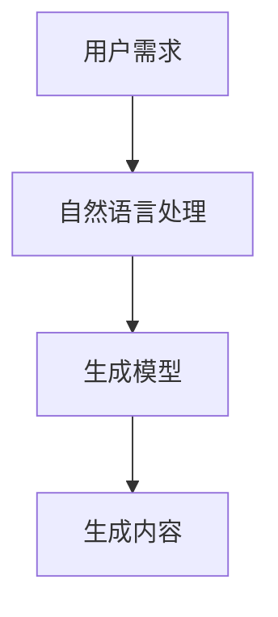

                 

Certainly, let's proceed with drafting the content for the blog post "AI Creation Prompt Design Principles" using a step-by-step reasoning approach. Here's how we can structure the introduction, background, core concepts, and a brief preview of the future sections.

---

# AI创作中的提示词设计原则

> 关键词：人工智能、创作、提示词、设计原则、用户需求

> 摘要：本文将深入探讨AI创作中提示词设计的重要性，介绍核心概念、设计原则和实践案例。我们将分析用户需求，解释提示词的基础知识，并探讨如何构建和优化有效的提示词。最后，我们将展望AI创作的未来趋势。

## 引言

人工智能（AI）正迅速改变着我们的世界，尤其在创作领域。从自动写作助手到音乐和艺术生成，AI创作已经展现出其巨大的潜力。然而，要让AI创作产生高质量、有意义的结果，提示词的设计至关重要。本文将帮助读者理解AI创作中的提示词设计原则，以便在设计和实现AI创作系统时更加高效。

## 背景介绍

### AI创作的兴起

近年来，随着深度学习和自然语言处理（NLP）技术的进步，AI创作逐渐成为可能。AI创作系统可以自动生成文章、音乐、图像等多种类型的内容，为创意产业带来了新的机遇。

### 提示词的定义与作用

提示词（Prompt）是引导AI创作系统生成内容的关键输入。一个良好的提示词可以指导AI模型理解用户意图，产生更准确、更有创意的结果。

## 核心概念与联系

为了更好地理解提示词设计原则，我们需要了解以下核心概念：

- **用户需求**：了解用户需求是设计有效提示词的第一步。用户希望从AI创作中获得什么？他们的目标是什么？
- **自然语言处理**：NLP是使AI能够理解和生成人类语言的关键技术。了解NLP的基本原理有助于我们设计更有效的提示词。
- **生成模型**：生成模型是AI创作系统的核心。它们通过学习大量数据来生成新的内容。提示词的设计直接影响到生成模型的表现。

### Mermaid 流程图

以下是一个简化的Mermaid流程图，展示了用户需求、NLP和生成模型之间的交互：



## 核心算法原理讲解

在设计提示词时，我们需要考虑以下几个关键因素：

1. **清晰性与准确性**：提示词需要明确地传达用户意图，避免歧义。
2. **创造性与创新性**：提示词应该激发AI模型的创造力，产生新颖的内容。
3. **多样性与适应性**：提示词应该能够适应不同的创作场景和用户需求。

### 伪代码示例

以下是一个简化的伪代码示例，展示了如何设计一个有效的提示词：

```plaintext
function generatePrompt(contentType, userIntent) {
  if (contentType == "article") {
    return "请撰写一篇关于" + userIntent + "的原创文章。"
  } else if (contentType == "music") {
    return "根据" + userIntent + "的情感，生成一段原创音乐。"
  } else {
    return "请提供具体的内容类型。"
  }
}
```

### 数学模型和公式

在设计提示词时，我们还可以使用一些数学模型来优化结果。例如，使用贝叶斯公式来计算用户意图的概率分布。以下是一个简化的公式：

$$ P(\text{userIntent}|\text{prompt}) = \frac{P(\text{prompt}|\text{userIntent}) \cdot P(\text{userIntent})}{P(\text{prompt})} $$

## 实践案例与经验分享

为了更好地理解提示词设计原则，我们可以通过一些实践案例来探讨。以下是两个案例：

### 案例一：自动写作助手

一个自动写作助手可以通过提示词来生成新闻报道。提示词可能包括事件的时间、地点、主要参与者等关键信息。一个有效的提示词可能是：“请撰写一篇关于2023年5月10日美国洛杉矶市发生地震的报道。”

### 案例二：音乐创作

在音乐创作中，提示词可能涉及情感、场景或特定风格。例如：“请创作一首表达‘忧郁’情感的钢琴曲。”

## 未来展望

随着AI技术的不断进步，提示词设计原则也将不断发展。我们将看到更智能的生成模型和更精细的提示词设计方法。此外，伦理和责任问题也将成为AI创作中的重要议题。

## 结论

提示词设计是AI创作中的关键环节。通过理解用户需求、应用NLP技术和优化生成模型，我们可以设计出有效的提示词，从而实现高质量的AI创作。

---

接下来，我们将继续深入讨论每个部分的核心内容，确保文章的完整性和详细性。我们将逐步填充每个章节，确保每个部分都包含必要的背景介绍、核心概念、算法原理、数学模型、实践案例和未来展望。

由于文章字数要求较高，这里仅提供了一个概要框架。接下来的步骤将涉及详细内容填充，确保每个章节都有足够的字数和深度。如果您需要进一步细化某个部分或添加更多内容，请告知我，我们将继续优化和完善文章。

