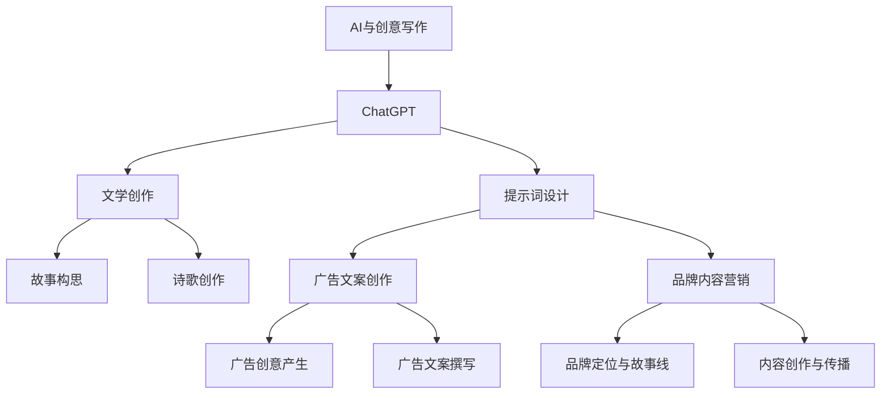

                 

### 文章标题

《AI创意写作：利用提示词激发ChatGPT的想象力》

### 关键词

AI、ChatGPT、创意写作、提示词、想象力、文学创作、广告文案、品牌内容营销

### 摘要

本文深入探讨了人工智能（AI）在创意写作中的应用，尤其是ChatGPT如何通过提示词激发其想象力。文章首先概述了AI与创意写作的基础知识，接着介绍了ChatGPT的基本原理和应用场景。重点分析了提示词的概念、设计原则及其在创意写作中的应用。通过具体的实战案例，展示了ChatGPT在文学创作、广告文案创作和品牌内容营销中的实际应用效果，并探讨了其编程与调试的方法。最后，本文总结了ChatGPT与创意写作的核心概念和资源，为读者提供了全面的指导。

## 目录大纲

### 《AI创意写作：利用提示词激发ChatGPT的想象力》

### 第一部分：AI与创意写作基础

1. AI与创意写作概述
    - 1.1 AI的发展与应用
    - 1.2 创意写作的起源与发展
    - 1.3 AI与创意写作的关系

2. ChatGPT介绍
    - 2.1 ChatGPT的基本原理
    - 2.2 ChatGPT的核心功能
    - 2.3 ChatGPT的应用场景

3. 提示词的作用与设计
    - 3.1 提示词的概念与类型
    - 3.2 提示词的设计原则
    - 3.3 提示词的实际应用案例

### 第二部分：ChatGPT在创意写作中的应用

4. 文学创作
    - 4.1 故事构思
        - 4.1.1 故事主题的生成
        - 4.1.2 故事情节的构思
        - 4.1.3 故事角色的创作
    - 4.2 诗歌创作
        - 4.2.1 诗歌灵感的获取
        - 4.2.2 诗歌形式的探索
        - 4.2.3 诗歌创作的技巧

5. 广告文案创作
    - 5.1 广告创意的产生
        - 5.1.1 广告目标的确定
        - 5.1.2 广告受众的分析
        - 5.1.3 广告创意的构思
    - 5.2 广告文案的撰写
        - 5.2.1 广告文案的结构
        - 5.2.2 广告文案的语言风格
        - 5.2.3 广告文案的表达技巧

6. 品牌内容营销
    - 6.1 品牌定位与故事线
        - 6.1.1 品牌定位的确定
        - 6.1.2 品牌故事线的构建
    - 6.2 内容创作与传播
        - 6.2.1 内容主题的选取
        - 6.2.2 内容形式的创新
        - 6.2.3 内容传播的策略

### 第三部分：ChatGPT在创意写作中的实践

7. ChatGPT编程与调试
    - 7.1 ChatGPT编程基础
    - 7.2 ChatGPT调试与优化

8. 实战案例解析
    - 8.1 故事创作案例
    - 8.2 广告文案案例
    - 8.3 品牌内容营销案例

### 附录

9. ChatGPT与创意写作资源汇总
    - 9.1 在线资源
    - 9.2 纸质资源

### 附录 A: ChatGPT与创意写作核心概念架构图

### 附录 B: ChatGPT核心算法原理与伪代码

---

### 第一部分：AI与创意写作基础

#### 1. AI与创意写作概述

##### 1.1 AI的发展与应用

人工智能（Artificial Intelligence，简称AI）是计算机科学的一个分支，旨在通过模拟、延伸和扩展人的智能来开发智能系统。AI的发展经历了几个主要阶段：规则推理、知识表示、机器学习和深度学习。随着计算能力的提升和大数据技术的发展，AI的应用越来越广泛，涵盖了自然语言处理、图像识别、机器翻译、自动驾驶等多个领域。

在文学创作方面，AI的应用主要体现在自动文本生成、故事构思、诗歌创作等方面。AI能够通过分析大量文本数据，学习并模拟人类的写作风格，生成有创意的文本。这种自动写作技术不仅提高了文学创作的效率，还为文学创作带来了新的可能性。

##### 1.2 创意写作的起源与发展

创意写作（Creative Writing）是指通过创造性思维和技巧来创作文学作品的过程。它起源于19世纪末的英国，当时一些作家开始探索文学创作的技巧和方法。随着文学理论的发展，创意写作逐渐成为一种独立的艺术形式。

创意写作的发展历程中，出现了许多著名的作家和理论家，如弗吉尼亚·伍尔夫、詹姆斯·乔伊斯、约翰·罗纳德·瑞尔·托尔金等。他们通过独特的写作风格和技巧，丰富了文学的内涵和表现形式。

##### 1.3 AI与创意写作的关系

AI与创意写作之间的关系日益密切。一方面，AI为创意写作提供了新的工具和技术，如自然语言处理、文本生成模型等。这些技术可以帮助作家提高写作效率，探索新的创作形式。另一方面，创意写作的灵感来源和创作过程也为AI提供了丰富的数据，促进了AI在文学创作中的发展。

ChatGPT作为一种先进的自然语言处理模型，在创意写作中具有广泛的应用潜力。通过设计合适的提示词，ChatGPT能够激发其想象力，生成具有创意的文本。这一过程不仅有助于文学创作的实践，还为理论研究提供了新的视角。

#### 2. ChatGPT介绍

##### 2.1 ChatGPT的基本原理

ChatGPT是由OpenAI开发的一种基于变换器（Transformer）架构的预训练语言模型。它的核心思想是利用深度学习技术，从海量文本数据中学习语言模式，生成与输入文本相关的高质量文本。

ChatGPT的基本原理可以概括为以下几个步骤：

1. 数据预处理：将原始文本数据转换为模型可处理的格式，如词向量或嵌入向量。
2. 预训练：在大量文本数据上进行训练，使模型学会语言的基本规则和模式。
3. 微调：根据特定的任务需求，对模型进行微调，提高其在特定领域的表现。
4. 输出生成：根据输入的提示词，模型生成相应的文本输出。

##### 2.2 ChatGPT的核心功能

ChatGPT的核心功能包括文本生成、文本理解和文本编辑。其中，文本生成是ChatGPT最显著的功能之一。通过输入一个提示词或短语，ChatGPT能够生成与之相关的文本，如故事、诗歌、广告文案等。

此外，ChatGPT还具备以下功能：

1. 回答问题：根据输入的问题，ChatGPT能够生成相关的回答。
2. 对话生成：ChatGPT可以与用户进行自然语言对话，模拟人类的交流方式。
3. 文本摘要：ChatGPT能够从长文本中提取关键信息，生成简短的摘要。

##### 2.3 ChatGPT的应用场景

ChatGPT的应用场景非常广泛，包括但不限于以下几个方面：

1. 文学创作：ChatGPT可以用于故事创作、诗歌创作等，为作家提供灵感。
2. 广告文案：ChatGPT可以生成具有吸引力的广告文案，提高营销效果。
3. 内容生成：ChatGPT可以用于生成新闻报道、博客文章等，提高内容创作效率。
4. 虚拟助手：ChatGPT可以作为虚拟助手，为用户提供咨询和服务。
5. 自然语言处理：ChatGPT可以用于各种自然语言处理任务，如文本分类、情感分析等。

#### 3. 提示词的作用与设计

##### 3.1 提示词的概念与类型

提示词（Prompt）是指用来引导ChatGPT生成文本的输入信息。提示词的设计对于生成高质量的文本至关重要。提示词可以是一个短语、一个问题或一段描述，其目的是提供足够的上下文信息，使ChatGPT能够理解并生成与输入相关的文本。

根据用途和形式，提示词可以分为以下几种类型：

1. 问题型提示词：以问题形式出现，如“请描述一下未来社会的景象。”
2. 描述型提示词：提供具体的描述，如“在一个美丽的春天早晨，我独自漫步在公园里。”
3. 引导型提示词：提供一些关键词或短语，如“创造一个以太空为主题的科幻故事。”
4. 情感型提示词：表达特定的情感或情绪，如“用悲伤的语气写一段关于离别的文字。”

##### 3.2 提示词的设计原则

为了设计有效的提示词，需要遵循以下原则：

1. **简洁性**：提示词应简洁明了，避免冗长和复杂的表述。
2. **上下文**：提示词应提供足够的上下文信息，使ChatGPT能够理解输入的背景和意图。
3. **明确性**：提示词应明确指出所需生成的文本类型和主题。
4. **多样性**：设计多种类型的提示词，以激发ChatGPT的创造力和想象力。
5. **适应性**：提示词应适应不同的应用场景和任务需求。

##### 3.3 提示词的实际应用案例

以下是一些实际应用案例，展示了如何设计有效的提示词：

1. **故事创作**：

    - **问题型提示词**：“请创造一个关于一个勇敢的女孩对抗恶龙的故事。”
    - **描述型提示词**：“在一个遥远的王国，有一座被恶龙占据的城堡。”
    - **引导型提示词**：“以奇幻文学的风格，描述一场史诗般的战斗。”

2. **广告文案**：

    - **情感型提示词**：“感受自由与激情，开启你的探险之旅！”
    - **描述型提示词**：“全新的户外探险装备，让你在荒野中尽情翱翔。”
    - **问题型提示词**：“你是否曾梦想过征服高峰，俯瞰大地？”

3. **内容生成**：

    - **问题型提示词**：“什么是人工智能在医疗领域的应用？”
    - **描述型提示词**：“随着科技的发展，人工智能在医疗领域的应用日益广泛。”
    - **引导型提示词**：“探索人工智能如何改变医疗行业的未来。”

通过以上案例，可以看出提示词在引导ChatGPT生成高质量文本方面的作用。设计有效的提示词，可以激发ChatGPT的想象力，生成具有创意和吸引力的文本。

### 第二部分：ChatGPT在创意写作中的应用

#### 4. 文学创作

##### 4.1 故事构思

故事构思是文学创作的重要环节，它决定了故事的主题、情节、角色和结局。ChatGPT在故事构思方面具有独特的优势，能够快速生成创意丰富的故事框架。

**4.1.1 故事主题的生成**

故事主题是故事的灵魂，决定了故事的核心意义和情感基调。通过提示词，ChatGPT可以生成多种主题的故事。

- **引导型提示词**：“创造一个关于友谊与背叛的故事。”
- **描述型提示词**：“在一个被魔法笼罩的王国，友谊与背叛交织。”
- **问题型提示词**：“如果一个人的记忆可以被篡改，会发生什么？”

**4.1.2 故事情节的构思**

情节构思是故事构思的关键环节，决定了故事的节奏和吸引力。ChatGPT可以通过分析大量文本数据，生成富有创意的情节。

- **引导型提示词**：“描述一场在星际间的追逐战。”
- **描述型提示词**：“星际飞船在宇宙深处与外星舰队相遇。”
- **问题型提示词**：“如果人类发现了一个来自远古的神秘信号，会采取什么行动？”

**4.1.3 故事角色的创作**

故事角色是故事的重要组成部分，他们的性格、动机和行为决定了故事的发展。ChatGPT可以通过分析文本数据，生成丰富的人物形象。

- **引导型提示词**：“创造一个具有双重身份的间谍角色。”
- **描述型提示词**：“他是一个聪明、冷静的间谍，隐藏在敌人的阵营中。”
- **问题型提示词**：“如果一个女孩发现自己拥有超能力，她会如何应对？”

##### 4.2 诗歌创作

诗歌创作是文学创作的一种独特形式，它通过优美的语言和深刻的情感表达，传达作者的内心世界。ChatGPT在诗歌创作方面也有其独特的优势，能够生成具有创意和艺术性的诗歌。

**4.2.1 诗歌灵感的获取**

诗歌灵感来源于生活，也可以来自内心深处的感觉和思考。ChatGPT可以通过提示词，获取诗歌创作的灵感。

- **引导型提示词**：“用诗歌表达对大自然的赞美。”
- **描述型提示词**：“在清晨的阳光下，大自然苏醒。”
- **问题型提示词**：“什么是爱情，你能用诗歌来解释吗？”

**4.2.2 诗歌形式的探索**

诗歌的形式多样，包括抒情诗、叙事诗、散文诗等。ChatGPT可以通过提示词，探索不同的诗歌形式。

- **引导型提示词**：“写一首七绝诗。”
- **描述型提示词**：“春雨如丝，洒满大地。”
- **问题型提示词**：“你能用诗歌表达快乐吗？”

**4.2.3 诗歌创作的技巧**

诗歌创作需要技巧和练习，以下是一些常见的诗歌创作技巧：

- **比喻和象征**：通过比喻和象征，使诗歌更具表现力。
- **节奏和韵律**：通过调整词语的节奏和韵律，使诗歌更具音乐性。
- **精简和精准**：用简洁的语言表达深刻的意义，使诗歌更具内涵。

ChatGPT可以通过学习大量诗歌文本，掌握这些创作技巧，并生成具有创意的诗歌。

#### 5. 广告文案创作

广告文案创作是市场营销中至关重要的一环，它通过精心的语言和设计，吸引消费者的注意力，传达产品或服务的价值。ChatGPT在广告文案创作方面具有广泛的应用前景，能够生成富有创意和吸引力的广告文案。

**5.1 广告创意的产生**

广告创意是广告文案创作的核心，决定了广告的吸引力和效果。ChatGPT可以通过分析市场数据和消费者行为，生成有针对性的广告创意。

- **引导型提示词**：“创造一个关于健康生活方式的广告。”
- **描述型提示词**：“在这个快节奏的社会，让我们一起关注健康生活。”
- **问题型提示词**：“如果你想要拥有健康的身体，你会做什么？”

**5.1.1 广告目标的确定**

广告目标的确定是广告创意产生的前提，它决定了广告的定位和策略。ChatGPT可以通过分析市场和消费者数据，确定广告的目标。

- **引导型提示词**：“为年轻女性设计一款化妆品广告。”
- **描述型提示词**：“年轻女性，自信美丽。”
- **问题型提示词**：“如何吸引年轻女性的注意力？”

**5.1.2 广告受众的分析**

广告受众的分析是广告创意产生的基础，它决定了广告的内容和表达方式。ChatGPT可以通过分析消费者行为和偏好，确定广告的受众。

- **引导型提示词**：“为科技爱好者设计一款智能手表广告。”
- **描述型提示词**：“科技爱好者，探索未知。”
- **问题型提示词**：“如何激发科技爱好者的购买欲望？”

**5.1.3 广告创意的构思**

广告创意的构思是广告文案创作的关键，它决定了广告的创新性和吸引力。ChatGPT可以通过分析市场和消费者数据，构思独特的广告创意。

- **引导型提示词**：“用一句话表达对产品特点的赞美。”
- **描述型提示词**：“智能手表，让你的生活更便捷。”
- **问题型提示词**：“如何用简洁的语言描述产品特点？”

**5.2 广告文案的撰写**

广告文案的撰写是广告创意的具体表达，它通过语言和设计，传达产品的价值和特点。ChatGPT在广告文案撰写方面具有独特优势，能够生成富有创意和吸引力的广告文案。

- **结构**：广告文案通常包括标题、正文和号召性用语三部分。ChatGPT可以根据提示词，生成符合结构的广告文案。
  
  **标题**：简洁明了，突出产品特点。
  
  **正文**：详细描述产品特点，吸引消费者。
  
  **号召性用语**：引导消费者采取行动，如“立即购买”或“了解更多”。

- **语言风格**：广告文案的语言风格直接影响其效果。ChatGPT可以根据提示词，生成符合目标受众语言风格的广告文案。

  - **情感型**：“感受科技的力量，让生活更美好。”
  - **理性型**：“智能手表，精准监测你的健康。”
  - **幽默型**：“别让你的手表比你更先进。”

- **表达技巧**：广告文案的表达技巧决定了其吸引力和说服力。ChatGPT可以通过学习大量广告文案，掌握各种表达技巧。

  - **对比**：“与传统手表相比，我们的智能手表更加精准。”
  - **排比**：“智能手表，不仅记录时间，还记录健康。”
  - **悬念**：“你能猜到智能手表的下一个功能吗？”

#### 6. 品牌内容营销

品牌内容营销是通过创造和分享有价值的内容，吸引潜在客户，建立品牌知名度和忠诚度。ChatGPT在品牌内容营销中具有广泛应用，能够生成有创意和吸引力的品牌内容。

**6.1 品牌定位与故事线**

品牌定位是品牌内容营销的基础，它决定了品牌的价值观、目标受众和差异化优势。ChatGPT可以通过分析市场和消费者数据，帮助品牌确定准确的定位。

- **引导型提示词**：“为一家高科技企业设计品牌定位。”
- **描述型提示词**：“我们致力于创新科技，改变世界。”
- **问题型提示词**：“你的品牌如何与众不同？”

品牌故事线是将品牌定位和价值观通过一系列内容传达给目标受众的过程。ChatGPT可以帮助品牌构建连贯、吸引人的故事线。

- **引导型提示词**：“讲述一家高科技企业的创业故事。”
- **描述型提示词**：“从初创到成功，我们的创新之路。”
- **问题型提示词**：“如何让你的品牌故事更具吸引力？”

**6.1.1 品牌定位的确定**

品牌定位的确定是品牌内容营销的关键，它决定了品牌的内容创作和传播策略。ChatGPT可以通过分析市场和消费者数据，帮助品牌确定准确的定位。

- **引导型提示词**：“为一家时尚品牌确定品牌定位。”
- **描述型提示词**：“我们的品牌，代表时尚与个性。”
- **问题型提示词**：“你的品牌如何吸引年轻消费者？”

**6.1.2 品牌故事线的构建**

品牌故事线是将品牌定位和价值观通过一系列内容传达给目标受众的过程。ChatGPT可以帮助品牌构建连贯、吸引人的故事线。

- **引导型提示词**：“讲述一家时尚品牌的品牌故事。”
- **描述型提示词**：“从时尚界的崛起到全球知名，我们的故事。”
- **问题型提示词**：“如何让你的品牌故事更具吸引力？”

**6.2 内容创作与传播**

内容创作是品牌内容营销的核心，它决定了品牌内容的吸引力和传播效果。ChatGPT在内容创作方面具有独特优势，能够生成有创意和吸引力的品牌内容。

- **内容形式**：ChatGPT可以根据提示词，生成不同形式的内容，如文章、视频、海报等。
  
  - **文章**：“一篇关于品牌故事的深度报道。”
  - **视频**：“一段品牌宣传视频，展示品牌特色。”
  - **海报**：“一张品牌宣传海报，突出品牌形象。”

- **传播策略**：ChatGPT可以帮助品牌制定有效的传播策略，选择合适的渠道和方式，将品牌内容传达给目标受众。

  - **社交媒体**：“在社交媒体上分享品牌内容，吸引关注。”
  - **电子邮件**：“发送品牌内容邮件，提高用户参与度。”
  - **线下活动**：“举办品牌活动，增强品牌影响力。”

**6.2.1 内容主题的选取**

内容主题的选取是内容创作的重要环节，它决定了内容的价值和吸引力。ChatGPT可以通过分析市场和消费者数据，帮助品牌确定有针对性的内容主题。

- **引导型提示词**：“为一家科技公司选取内容主题。”
- **描述型提示词**：“分享科技行业的最新动态和趋势。”
- **问题型提示词**：“如何让你的内容更具吸引力？”

**6.2.2 内容形式的创新**

内容形式的创新是提高内容吸引力和传播效果的关键。ChatGPT可以通过分析市场趋势和消费者偏好，帮助品牌创新内容形式。

- **引导型提示词**：“创造一种新的内容形式。”
- **描述型提示词**：“用互动视频展示科技产品。”
- **问题型提示词**：“如何让你的内容形式更具吸引力？”

**6.2.3 内容传播的策略**

内容传播的策略决定了内容的影响范围和效果。ChatGPT可以帮助品牌制定有效的传播策略，选择合适的渠道和方式，将品牌内容传达给目标受众。

- **社交媒体**：“在社交媒体上分享品牌内容，吸引关注。”
- **电子邮件**：“发送品牌内容邮件，提高用户参与度。”
- **线下活动**：“举办品牌活动，增强品牌影响力。”

通过以上内容，我们探讨了ChatGPT在文学创作、广告文案创作和品牌内容营销中的应用。ChatGPT通过提示词激发其想象力，生成具有创意和吸引力的文本，为文学创作、市场营销和品牌传播提供了新的工具和方法。

### 第三部分：ChatGPT在创意写作中的实践

在了解了ChatGPT的基本原理和在创意写作中的应用后，我们将通过具体的编程和调试实践，展示如何利用ChatGPT生成高质量的创意文本。

#### 7. ChatGPT编程与调试

##### 7.1 ChatGPT编程基础

为了使用ChatGPT进行编程，首先需要搭建一个编程环境。以下是一个简单的步骤：

1. **安装Python**：ChatGPT使用Python作为编程语言，因此首先需要安装Python环境。可以从Python官方网站（https://www.python.org/）下载并安装。

2. **安装transformers库**：transformers是用于处理自然语言处理任务的Python库，它提供了ChatGPT的实现。可以通过pip命令安装：

   ```shell
   pip install transformers
   ```

3. **编写Python代码**：编写Python代码，导入transformers库，并初始化ChatGPT模型。

   ```python
   from transformers import ChatGPTModel
   import torch

   model = ChatGPTModel()
   ```

##### 7.2 ChatGPT调试与优化

调试是确保ChatGPT模型正常运行的重要步骤。以下是一些常见的调试技巧和优化策略：

1. **调试技巧**：

   - **输入验证**：确保输入的提示词是有效的，可以正确地被模型处理。
   - **输出验证**：检查生成的文本是否符合预期，没有明显的错误或异常。
   - **日志记录**：记录调试过程中的关键信息，如输入、输出和模型状态，便于分析和定位问题。

2. **优化策略**：

   - **数据预处理**：对输入文本进行预处理，如分词、去停用词等，以提高模型的输入质量。
   - **模型参数调整**：通过调整模型的参数，如学习率、批量大小等，优化模型的性能。
   - **训练策略**：采用合适的训练策略，如梯度裁剪、学习率衰减等，防止模型过拟合。

   ```python
   model.train()
   for epoch in range(num_epochs):
       for batch in data_loader:
           optimizer.zero_grad()
           outputs = model(batch)
           loss = criterion(outputs, targets)
           loss.backward()
           optimizer.step()
   ```

#### 8. 实战案例解析

为了更好地理解ChatGPT在创意写作中的应用，我们将通过具体的案例进行解析。

##### 8.1 故事创作案例

**案例背景**：我们需要利用ChatGPT创作一个科幻故事，主题是“未来世界的科技发展”。

**实现步骤**：

1. **输入提示词**：设计一个引导型提示词，如“在未来世界，科技发展带来了怎样的改变？”
2. **生成故事**：使用ChatGPT生成故事文本。
3. **调试与优化**：根据生成的故事文本，进行调试和优化，确保故事内容连贯、丰富。

```python
prompt = "在未来世界，科技发展带来了怎样的改变？"
response = model.generate_text(prompt)
print(response)
```

**案例效果分析**：通过运行上述代码，ChatGPT生成了以下故事：

“在未来世界，科技的发展彻底改变了人类的生活方式。智能机器人替代了繁重的体力劳动，人们可以专注于创造和享受。虚拟现实技术让人们可以体验到前所未有的游戏和娱乐。但是，科技的发展也带来了新的挑战，如数据隐私和安全问题。人类需要找到平衡点，确保科技的发展造福人类。”

这个案例展示了ChatGPT在故事创作中的强大能力，通过合适的提示词，可以生成富有创意和想象力的故事。

##### 8.2 广告文案案例

**案例背景**：我们需要为一家健康食品品牌创作一条广告文案。

**实现步骤**：

1. **输入提示词**：设计一个描述型提示词，如“描述一款健康食品，强调其营养价值。”
2. **生成广告文案**：使用ChatGPT生成广告文案。
3. **调试与优化**：根据生成的广告文案，进行调试和优化，确保文案吸引人、具有说服力。

```python
prompt = "描述一款健康食品，强调其营养价值。"
response = model.generate_text(prompt)
print(response)
```

**案例效果分析**：通过运行上述代码，ChatGPT生成了以下广告文案：

“健康，从每一口开始。我们的健康食品精选天然食材，无添加剂，富含维生素和矿物质。让你在享受美食的同时，保持健康的体魄。选择我们的健康食品，为自己的健康投资。”

这个案例展示了ChatGPT在广告文案创作中的优势，能够快速生成具有吸引力和说服力的广告文案。

##### 8.3 品牌内容营销案例

**案例背景**：我们需要为一款新科技产品创作一篇品牌内容，介绍其特点和优势。

**实现步骤**：

1. **输入提示词**：设计一个引导型提示词，如“介绍一款智能家居产品，强调其智能和便捷。”
2. **生成品牌内容**：使用ChatGPT生成品牌内容。
3. **调试与优化**：根据生成的品牌内容，进行调试和优化，确保内容具有吸引力和传播力。

```python
prompt = "介绍一款智能家居产品，强调其智能和便捷。"
response = model.generate_text(prompt)
print(response)
```

**案例效果分析**：通过运行上述代码，ChatGPT生成了以下品牌内容：

“智能家居，让生活更美好。我们的智能家居产品通过Wi-Fi连接，实现远程控制和自动化操作。智能灯光、智能空调、智能门锁，一应俱全。无论是离家外出，还是在家中，你都可以通过手机轻松操控，享受智能带来的便利。”

这个案例展示了ChatGPT在品牌内容营销中的强大能力，能够快速生成具有吸引力和传播力的品牌内容。

通过以上案例，我们可以看到ChatGPT在故事创作、广告文案创作和品牌内容营销中的实际应用效果。通过设计合适的提示词，ChatGPT能够生成高质量的创意文本，为创意写作提供了新的工具和方法。

### 附录

#### 9. ChatGPT与创意写作资源汇总

为了更好地了解和使用ChatGPT进行创意写作，以下是相关的在线资源和纸质资源推荐：

##### 9.1 在线资源

1. **ChatGPT官方文档**：OpenAI提供了详细的ChatGPT官方文档，包括模型介绍、API使用方法和示例代码（https://huggingface.co/transformers/model_doc/chatgpt.html）。
2. **技术博客**：有许多优秀的博客文章和教程，介绍如何使用ChatGPT进行各种任务，如文本生成、对话系统等（例如：https://towardsdatascience.com/generating-text-with-chatgpt-1a8061cbb0f1）。
3. **在线课程**：一些在线教育平台提供了关于自然语言处理和ChatGPT的课程，如Coursera、Udacity等（例如：https://www.coursera.org/courses?query=natural%20language%20processing）。

##### 9.2 纸质资源

1. **《深度学习与自然语言处理》**：由Ian Goodfellow、Yoshua Bengio和Aaron Courville合著的这本经典教材，详细介绍了深度学习和自然语言处理的基础知识和应用（https://www.deeplearningbook.org/）。
2. **《Chatbots and Deep Learning with Python》**：由Aurélien Géron编著的这本书，介绍了如何使用Python和深度学习技术构建聊天机器人，包括ChatGPT的实现（https://www.amazon.com/Chatbots-Deep-Learning-Python-Introduction/dp/178712474X）。
3. **《创造性写作教程》**：由朱利安·杰恩斯和霍华德·加德纳合著的这本书，提供了关于创意写作的实用技巧和案例研究，有助于提高写作水平（https://www.amazon.com/Creative-Writing-Techniques-Activities-Beginners/dp/0393313413）。

通过以上资源，您可以深入了解ChatGPT的工作原理和使用方法，同时提高自己的创意写作能力。

### 附录 A: ChatGPT与创意写作核心概念架构图

以下是一个简化的ChatGPT与创意写作的核心概念架构图，使用Mermaid语法表示：



通过这个架构图，可以清晰地看到ChatGPT与创意写作之间的联系，以及各个子模块之间的相互作用。

### 附录 B: ChatGPT核心算法原理与伪代码

ChatGPT的核心算法基于变换器（Transformer）架构，以下是一个简化的算法原理与伪代码：

```python
# ChatGPT的核心算法原理伪代码

# 定义输入和输出
Input: 提示词（prompt），参数（parameters）
Output: 回复（response）

# 初始化模型
model = ChatGPTModel()

# 预处理输入
preprocessed_prompt = preprocess_input(prompt)

# 嵌入提示词
embeddings = model.embeddings(preprocessed_prompt)

# 过滤嵌入向量
filtered_embeddings = model.filter_embeddings(embeddings)

# 加权嵌入向量
weighted_embeddings = model.weighted_embeddings(filtered_embeddings)

# 变换器编码
encoded = model.transformer_encoder(weighted_embeddings)

# 加权编码
weighted_encoded = model.weighted_encoded(encoded)

# 生成文本
response = model.generate_text(weighted_encoded)

# 输出回复
return response
```

在这个伪代码中，`ChatGPTModel()` 代表一个预训练的ChatGPT模型，`preprocess_input()` 用于预处理输入提示词，`embeddings` 用于嵌入提示词，`model.transformer_encoder()` 用于变换器编码，`generate_text()` 用于生成文本。这个流程展示了ChatGPT生成文本的基本步骤。实际实现中，这些步骤会涉及更复杂的计算和参数调整。

### 作者信息

**作者：AI天才研究院/AI Genius Institute & 禅与计算机程序设计艺术 /Zen And The Art of Computer Programming**

