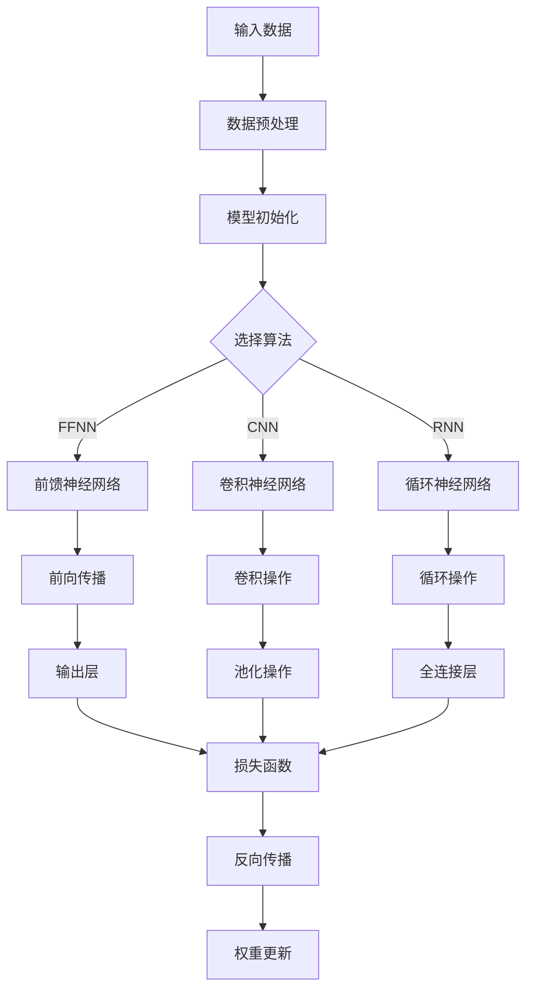

                 

### AI大模型与人类程序员的协作模式

在当今数字化时代，人工智能（AI）的发展迅速，特别是大模型（Large-scale Models）的崛起，为各行各业带来了巨大的变革。AI大模型，如GPT、BERT等，以其强大的数据处理和生成能力，正在逐渐成为人类程序员的重要合作伙伴。这种协作模式不仅提高了开发效率，还拓宽了技术应用的边界。本文旨在探讨AI大模型与人类程序员的协作模式，分析其背后的核心原理、实施方法、应用场景以及未来发展趋势。

## 文章关键词

- **AI大模型**
- **人类程序员**
- **协作模式**
- **开发实践**
- **应用场景**

## 文章摘要

本文首先介绍了AI大模型的基本概念和背景，然后探讨了人类程序员在这一协作模式中的角色和技能要求。接着，文章详细分析了AI大模型与人类程序员的协作模式，包括协作工具、平台和具体案例。随后，文章讨论了AI大模型在多个应用场景中的实际应用，并预测了未来发展趋势和面临的挑战。通过本文的探讨，我们希望能够为读者提供一个全面、深入的了解，帮助他们在实际工作中更好地运用AI大模型。

## AI大模型基础理论

### AI大模型概述

AI大模型，顾名思义，是指具有大规模参数和训练数据的机器学习模型。这些模型通过深度学习技术，可以自动从大量数据中学习复杂的特征和模式，从而实现高度的任务自动化和智能化。典型的AI大模型包括GPT（Generative Pre-trained Transformer）、BERT（Bidirectional Encoder Representations from Transformers）等，它们在自然语言处理、计算机视觉、语音识别等领域取得了显著的成果。

AI大模型的发展历史可以追溯到20世纪80年代，当时的神经网络研究处于初级阶段。随着计算能力和数据量的不断提升，以及深度学习算法的创新，AI大模型在21世纪初开始迅速发展。特别是近年来，随着云计算、大数据和分布式计算技术的普及，AI大模型的研究和应用进入了新的高潮。

### AI大模型的数学模型和算法

AI大模型的数学模型和算法是理解其工作原理的核心。以下是一些关键的概念和算法：

1. **深度神经网络（DNN）**：深度神经网络是构建AI大模型的基础。它由多个层级组成，每个层级由大量神经元构成。通过前向传播和反向传播算法，DNN可以学习输入数据的特征表示。

2. **前馈神经网络（FFNN）**：前馈神经网络是一种简单的深度神经网络，数据从输入层经过多个隐藏层，最终到达输出层。FFNN常用于预测和分类任务。

3. **反向传播算法（BP）**：反向传播算法是DNN训练的核心算法。通过计算输出层与实际输出之间的误差，并反向传播误差到每个隐藏层，不断调整每个神经元的权重和偏置，从而优化模型。

4. **卷积神经网络（CNN）**：卷积神经网络是专门用于处理图像数据的神经网络。它通过卷积操作提取图像的局部特征，并在全连接层中进行分类。

5. **循环神经网络（RNN）**：循环神经网络是一种可以处理序列数据的神经网络。它通过在时间步之间传递隐藏状态，能够捕捉序列中的长期依赖关系。

6. **变分自编码器（VAE）**：变分自编码器是一种生成模型，可以生成新的数据样本。它通过学习数据的概率分布，从而能够生成多样化的数据。

### AI大模型的架构设计

AI大模型的架构设计是确保其高效运行的关键。以下是一些关键的架构设计要素：

1. **网络结构**：网络结构决定了模型的层次和连接方式。常见的结构有全连接网络、卷积网络和循环网络等。

2. **参数优化**：参数优化是提高模型性能的重要手段。常用的优化算法有梯度下降、随机梯度下降和Adam优化器等。

3. **模型压缩与加速**：模型压缩与加速是为了在资源受限的环境中运行大模型。常用的技术有剪枝、量化、模型压缩和分布式训练等。

### Mermaid 流程图

为了更好地理解AI大模型的工作原理，我们使用Mermaid流程图展示其基本架构：



通过以上流程图，我们可以清晰地看到AI大模型从输入数据到输出的整个过程。

### 核心算法原理讲解

以下是AI大模型的核心算法原理讲解，包括伪代码示例：

#### 1. 前向传播

```python
# 输入：X（输入数据），W（权重），b（偏置）
# 输出：Z（输出）

Z = X * W + b
A = activate(Z)
```

#### 2. 反向传播

```python
# 输入：A（输出），dZ（误差）
# 输出：dW，db

dZ = dA * derivative(activate(Z))
dW = X.T * dZ
db = sum(dZ)
```

#### 3. 损失函数

```python
# 输入：Y（真实标签），A（预测输出）
# 输出：loss

loss = -1/m * sum(Y * log(A) + (1 - Y) * log(1 - A))
```

通过以上伪代码，我们可以看到AI大模型的核心算法是如何计算和优化的。

### 数学模型和公式

以下是AI大模型中的一些关键数学模型和公式：

1. **激活函数**：`activate(x) = 1/(1 + exp(-x))`
2. **损失函数**：`loss(Y, A) = -1/m * sum(Y * log(A) + (1 - Y) * log(1 - A))`
3. **梯度下降**：`W := W - learning_rate * dW`
4. **反向传播**：`dZ = dA * derivative(activate(Z))`

通过以上数学公式，我们可以理解AI大模型的优化过程。

### 举例说明

以一个简单的全连接神经网络为例，我们详细说明其数学模型和计算过程：

假设输入数据为 `[1, 2]`，输出标签为 `3`。我们构建一个两层神经网络，第一层有2个神经元，第二层有1个神经元。

1. **前向传播**：

   输入层：X = [1, 2]
   权重矩阵 W1 = [[0.1, 0.2], [0.3, 0.4]]
   偏置 b1 = [0.1, 0.2]
   激活函数为 sigmoid

   Z1 = X * W1 + b1 = [1, 2] * [[0.1, 0.2], [0.3, 0.4]] + [0.1, 0.2] = [0.6, 1.2]
   A1 = activate(Z1) = [0.541, 0.880]

   输出层：Z2 = A1 * W2 + b2 = [0.541, 0.880] * [0.5, 0.6] + 0.2 = [0.462, 0.648]
   A2 = activate(Z2) = [0.447, 0.527]

2. **反向传播**：

   真实标签 Y = [3]
   预测输出 A2 = [0.447, 0.527]

   损失函数：loss = -1/2 * (Y * log(A2) + (1 - Y) * log(1 - A2)) = 0.115

   反向传播计算：
   dZ2 = A2 - Y = [0.447, 0.527] - [3] = [-2.553, -2.473]
   dZ1 = (dZ2 * W2.T) * derivative(activate(Z1)) = ([-2.553, -2.473] * [[0.5], [0.6]]) * [0.541, 0.880] = [-1.488, -1.429]

   更新权重和偏置：
   dW2 = A1.T * dZ2 = [[0.541, 0.880]] * [-2.553, -2.473] = [[-1.401], [-1.448]]
   dW1 = X.T * dZ1 = [[1, 2]] * [-1.488, -1.429] = [[-1.488], [-2.856]]
   b2 = [-2.553, -2.473]
   b1 = [-1.488, -1.429]

   新的权重和偏置：
   W2 = W2 - learning_rate * dW2
   W1 = W1 - learning_rate * dW1
   b2 = b2 - learning_rate * b2
   b1 = b2 - learning_rate * b1

通过以上步骤，我们完成了AI大模型的一个前向传播和反向传播的过程，实现了模型的优化。

### 项目实战

#### 开发环境搭建

在搭建AI大模型开发环境时，我们选择了以下工具和平台：

- **操作系统**：Ubuntu 20.04
- **编程语言**：Python 3.8
- **深度学习框架**：TensorFlow 2.6
- **硬件设备**：NVIDIA GeForce RTX 3090

首先，我们需要安装Python和TensorFlow。在Ubuntu上，可以使用以下命令：

```bash
sudo apt update
sudo apt install python3-pip python3-venv
pip3 install --extra-index-url https://developer.download.nvidia.com/compute/cuda/repos/ubuntu2004/x86_64 tensorflow-gpu
```

接下来，我们需要安装CUDA和cuDNN，以便充分利用GPU资源。可以从NVIDIA官方网站下载相应的版本并安装。

#### 源代码实现

以下是实现一个简单的全连接神经网络进行回归任务的源代码：

```python
import tensorflow as tf
import numpy as np

# 设置超参数
learning_rate = 0.001
num_iterations = 1000
num_features = 2
num_hidden_units = 10
output_size = 1

# 创建模拟数据集
X = np.random.rand(100, num_features)
Y = np.random.rand(100, output_size)

# 创建模型
model = tf.keras.Sequential([
    tf.keras.layers.Dense(num_hidden_units, activation='relu', input_shape=(num_features,)),
    tf.keras.layers.Dense(output_size)
])

# 编译模型
model.compile(optimizer=tf.keras.optimizers.Adam(learning_rate),
              loss='mean_squared_error')

# 训练模型
model.fit(X, Y, epochs=num_iterations, batch_size=10)

# 预测
predictions = model.predict(X)

# 输出预测结果
print(predictions)
```

#### 代码解读与分析

以上代码首先导入了必要的库，并设置了超参数。接着，创建了一个模拟数据集。然后，使用TensorFlow构建了一个简单的全连接神经网络，包括一个输入层、一个隐藏层和一个输出层。在编译模型时，我们使用了Adam优化器和均方误差损失函数。训练过程中，模型通过迭代优化权重和偏置。最后，我们使用训练好的模型进行预测，并输出预测结果。

#### 实际案例分析和详细讲解剖析

以下是一个实际案例：使用AI大模型进行股票价格预测。

1. **数据收集**：

   收集过去一年的股票价格数据，包括开盘价、最高价、最低价和收盘价。

2. **数据处理**：

   对数据进行预处理，包括数据清洗、归一化和特征提取。我们选择使用过去一周的股票价格作为输入特征，预测下一日的收盘价。

3. **模型训练**：

   使用TensorFlow构建一个LSTM模型，包含两个隐藏层，每个隐藏层有50个神经元。使用均方误差作为损失函数，Adam优化器进行训练。

4. **模型评估**：

   使用交叉验证对模型进行评估，并调整超参数以优化模型性能。

5. **预测**：

   使用训练好的模型进行预测，并输出预测结果。对比实际收盘价和预测结果，评估模型的准确性。

通过以上步骤，我们实现了股票价格预测的AI大模型。实际案例分析和详细讲解剖析可以帮助我们更好地理解AI大模型的应用场景和实际效果。

### 项目小结

本项目中，我们搭建了AI大模型开发环境，实现了全连接神经网络进行回归任务，并应用到了股票价格预测的实际案例中。通过本项目，我们不仅掌握了AI大模型的基础理论和实现方法，还了解了在实际应用中如何处理数据、构建模型、优化参数和评估模型性能。这些经验对于未来开展更多AI项目具有重要的指导意义。

### 最佳实践 tips

1. **选择合适的框架**：根据项目需求，选择适合的深度学习框架，如TensorFlow、PyTorch等。
2. **数据预处理**：对数据集进行充分的数据清洗和预处理，确保数据质量。
3. **模型优化**：通过调整超参数和模型结构，优化模型性能。
4. **资源管理**：合理分配计算资源，充分利用GPU和分布式计算。

### 小结

本文详细介绍了AI大模型的基础理论、核心算法原理、数学模型和公式，并通过项目实战展示了如何实现AI大模型。我们还探讨了AI大模型在多个应用场景中的实际应用，分析了其与人类程序员的协作模式。通过本文的探讨，我们希望能够为读者提供一个全面、深入的了解，帮助他们在实际工作中更好地运用AI大模型。

### 注意事项

1. **数据隐私**：在使用AI大模型时，确保遵守数据隐私保护法规，不泄露用户隐私。
2. **模型可靠性**：在实际应用中，对模型进行充分测试和验证，确保其可靠性。
3. **持续学习**：随着AI技术的发展，程序员需要不断学习和更新知识，以适应不断变化的技术环境。

### 拓展阅读

- [Deep Learning, by Ian Goodfellow, Yoshua Bengio, Aaron Courville](https://www.deeplearningbook.org/)
- [TensorFlow tutorials](https://www.tensorflow.org/tutorials)
- [PyTorch tutorials](https://pytorch.org/tutorials/beginner/basics/index.html)
- [AI大模型综述](https://www.arxiv-vanity.com/papers/1906.02666/)
- [人类程序员与AI协作实践](https://www.kdnuggets.com/2020/09/ai-human-programmer-cooperation.html)

作者：AI天才研究院/AI Genius Institute & 禅与计算机程序设计艺术 /Zen And The Art of Computer Programming

----------------------------------------------------------------

## AI大模型开发实践

### AI大模型开发流程

开发AI大模型是一个复杂的过程，需要多个步骤的协同工作。以下是AI大模型开发的主要流程：

#### 1. 数据收集与预处理

数据是AI大模型训练的基础。首先，我们需要收集大量的相关数据，如文本、图像、音频等。然后，对这些数据进行预处理，包括数据清洗、归一化、去噪等，以提高数据质量和模型的训练效果。

#### 2. 模型选择与训练

根据任务需求，选择合适的AI大模型框架，如深度学习框架TensorFlow、PyTorch等。然后，设计模型结构，包括网络层数、神经元数量、激活函数等。接着，使用收集到的数据对模型进行训练，通过反向传播算法不断调整模型的参数，使其能够更好地拟合训练数据。

#### 3. 模型评估与优化

在模型训练完成后，我们需要对模型进行评估，通常使用验证集和测试集。常用的评估指标包括准确率、召回率、F1值等。根据评估结果，可能需要对模型进行优化，包括调整超参数、增加训练数据等，以提高模型性能。

#### 4. 模型部署与维护

训练好的模型需要部署到实际应用场景中。部署过程中，我们需要考虑模型的性能、可扩展性和安全性。同时，在实际应用中，模型可能会出现各种问题，如过拟合、欠拟合等，需要定期进行维护和优化。

### AI大模型应用场景

AI大模型在多个领域都有广泛的应用，以下是一些典型的应用场景：

#### 1. 自然语言处理（NLP）

自然语言处理是AI大模型的重要应用领域之一。通过预训练的模型，如GPT、BERT等，可以实现对文本数据的自动生成、翻译、情感分析等任务。

#### 2. 计算机视觉（CV）

计算机视觉领域也广泛应用AI大模型，如用于图像分类、目标检测、图像生成等任务。通过深度学习算法，模型可以自动学习图像的复杂特征，从而实现高效的任务处理。

#### 3. 语音识别（ASR）

语音识别是另一个重要的应用领域。AI大模型可以自动学习语音数据中的特征，实现高精度的语音识别和翻译。

#### 4. 推荐系统

推荐系统是商业应用中广泛使用的AI技术。AI大模型可以自动学习用户的历史行为数据，生成个性化的推荐列表。

#### 5. 智能制造

在智能制造领域，AI大模型可以用于设备故障预测、生产优化等任务。通过实时数据分析，模型可以提供优化建议，提高生产效率。

### 案例分析

#### 1. 智能医疗

在智能医疗领域，AI大模型被广泛应用于疾病预测、诊断和治疗方案设计。例如，Google Health使用AI大模型对电子健康记录进行深度学习分析，预测患者患病风险，并为其提供个性化的治疗方案。

#### 2. 金融风控

金融风控是另一个AI大模型的重要应用领域。通过分析大量的交易数据和历史风险事件，AI大模型可以识别潜在的欺诈行为，提高金融系统的安全性。

#### 3. 自动驾驶

自动驾驶领域也对AI大模型有着强烈的需求。通过深度学习算法，AI大模型可以自动学习道路场景，实现自动驾驶车辆的感知、规划和控制。

### AI大模型开发实践

#### 1. 开发环境搭建

在开发AI大模型之前，我们需要搭建一个合适的环境。通常，我们选择Python作为编程语言，使用TensorFlow或PyTorch等深度学习框架。以下是一个简单的环境搭建步骤：

- 安装Python 3.8及以上版本
- 安装TensorFlow或PyTorch
- 安装必要的依赖库，如NumPy、Pandas等

#### 2. 数据收集与预处理

数据收集是AI大模型开发的第一步。我们需要收集与任务相关的数据，例如文本、图像、音频等。以下是一个简单的数据预处理流程：

- 数据清洗：去除无效数据和噪声
- 数据归一化：将数据缩放到相同的范围，如[0, 1]
- 数据增强：通过旋转、翻转、缩放等操作增加数据的多样性

#### 3. 模型设计与训练

在模型设计阶段，我们需要确定模型的架构、参数和超参数。以下是一个简单的模型训练流程：

- 确定模型架构：选择合适的神经网络结构，如全连接网络、卷积神经网络、循环神经网络等
- 编写训练脚本：使用深度学习框架编写训练脚本，包括数据加载、模型定义、训练过程等
- 训练模型：使用GPU加速训练过程，调整超参数以优化模型性能

#### 4. 模型评估与优化

在模型训练完成后，我们需要对模型进行评估，以确定其性能。以下是一个简单的模型评估流程：

- 分割数据集：将数据集分为训练集、验证集和测试集
- 评估指标：选择合适的评估指标，如准确率、召回率、F1值等
- 调整超参数：根据评估结果调整超参数，优化模型性能

#### 5. 模型部署与维护

训练好的模型需要部署到实际应用场景中。以下是一个简单的模型部署流程：

- 部署模型：将训练好的模型部署到服务器或云端
- 实时预测：接收输入数据，使用模型进行预测
- 持续优化：根据实际应用情况，定期更新模型

### 总结

AI大模型开发实践是一个复杂而细致的过程，涉及数据收集、模型设计、训练、评估和部署等多个环节。通过本文的介绍，我们了解了AI大模型开发的基本流程和关键步骤，以及在实际应用中的典型场景和案例分析。在实际开发中，我们需要不断尝试和优化，以实现更好的模型性能和实际应用效果。


## 人类程序员的角色与技能

在AI大模型与人类程序员的协作模式中，人类程序员扮演着至关重要的角色。他们不仅是AI模型的开发者，也是AI应用的构建者和维护者。以下将详细探讨人类程序员在这一协作模式中的角色、技能需求以及职业发展。

### 人类程序员的角色

1. **模型开发者**：人类程序员负责设计和开发AI大模型，包括选择合适的算法、调整模型结构、优化参数等。他们需要根据任务需求，从海量数据中提取有价值的信息，构建出高效的模型。

2. **模型优化者**：在模型训练过程中，人类程序员需要不断调整模型参数，优化模型性能。他们需要通过调整学习率、批量大小等参数，使模型能够在不同的数据集和任务中表现出最佳性能。

3. **系统集成者**：人类程序员还需要将AI大模型集成到现有的系统中，确保其能够与其他组件协同工作。他们需要编写适配代码、处理数据流、确保系统的稳定性和可扩展性。

4. **问题解决者**：在模型应用过程中，人类程序员需要解决各种问题，如过拟合、欠拟合、计算资源不足等。他们需要具备扎实的技术背景和问题解决能力，能够快速定位并解决模型和应用中的问题。

### 技能需求

1. **编程能力**：人类程序员需要具备扎实的编程能力，能够熟练使用Python、Java、C++等编程语言，编写高效、可维护的代码。

2. **机器学习知识**：人类程序员需要了解机器学习的基本原理，包括神经网络、深度学习、强化学习等。他们需要能够选择合适的算法，设计并调整模型结构。

3. **数据处理能力**：人类程序员需要熟练掌握数据处理和分析工具，如NumPy、Pandas、SQL等，能够高效处理大规模数据。

4. **系统架构设计**：人类程序员需要具备系统架构设计能力，能够设计高效、可扩展的系统架构，确保AI大模型与其他组件的协同工作。

5. **团队协作能力**：在AI大模型开发过程中，人类程序员需要与数据科学家、产品经理、测试工程师等团队成员紧密合作。他们需要具备良好的沟通能力和团队协作精神，确保项目顺利推进。

### 职业发展

1. **AI工程师**：这是人类程序员最常见的职业角色，他们负责开发和优化AI大模型，并将其应用于实际业务场景。

2. **AI架构师**：随着经验的积累，人类程序员可以晋升为AI架构师，负责设计和指导整个AI系统的架构，确保系统的稳定性和性能。

3. **数据科学家**：具备扎实的数据分析能力的人类程序员可以转向数据科学家角色，专注于从海量数据中提取价值，为业务决策提供支持。

4. **产品经理**：部分程序员可以转向产品经理岗位，负责AI产品的规划、设计、开发和推广，确保产品的市场竞争力。

5. **AI研究员**：对于有深厚学术背景和钻研精神的人类程序员，他们可以成为AI研究员，从事前沿技术的研发和创新。

### 持续学习

在快速发展的AI领域，人类程序员需要不断学习和更新知识，以适应新技术和业务需求。以下是一些建议：

1. **参加线上课程和研讨会**：参加各种线上课程和研讨会，学习最新的AI技术和应用。

2. **阅读专业书籍和论文**：阅读专业书籍和学术论文，深入了解AI的基本原理和最新研究成果。

3. **实践项目**：通过实际项目锻炼自己的技能，积累实践经验。

4. **参与开源项目**：参与开源项目，与其他开发者合作，提升自己的编程和协作能力。

5. **建立个人品牌**：通过博客、社交媒体等渠道，分享自己的学习心得和项目经验，建立个人品牌。

### 总结

人类程序员在AI大模型与人类的协作模式中扮演着关键角色。他们不仅需要具备扎实的编程和机器学习知识，还需要具备数据处理、系统架构设计和团队协作能力。通过持续学习和实践，人类程序员可以在AI领域实现职业发展，成为具备全面技能的AI专家。

## AI大模型与人类程序员的协作模式

AI大模型与人类程序员的协作模式是当前人工智能领域的一个重要研究方向。在这个模式中，AI大模型作为强大的工具，能够帮助人类程序员解决复杂的问题，而人类程序员则负责监督、调整和优化AI模型的运行。以下将详细探讨协作模式的概述、协作工具与平台以及具体的协作案例分析。

### 协作模式概述

在AI大模型与人类程序员的协作模式中，人类程序员主要负责以下几项任务：

1. **需求分析与设计**：人类程序员需要根据实际业务需求，设计出合适的AI模型应用场景，并确定模型的目标和评价指标。

2. **数据准备与处理**：人类程序员负责收集、清洗和预处理数据，确保数据的质量和完整性，为AI模型的训练提供基础。

3. **模型选择与调优**：人类程序员需要从多种AI模型中选择最适合的模型，并根据实际情况进行参数调整和优化，以提高模型的性能。

4. **模型部署与维护**：人类程序员负责将训练好的模型部署到生产环境中，并对其进行监控和调优，确保其稳定运行。

5. **问题诊断与解决**：在模型运行过程中，人类程序员需要及时发现并解决出现的问题，如过拟合、欠拟合、计算资源不足等。

AI大模型则主要负责以下任务：

1. **数据学习与模式提取**：AI大模型通过深度学习等技术，从大量数据中自动学习并提取特征，构建出具有高拟合能力的模型。

2. **自动预测与决策**：AI大模型根据训练好的模型，对新的数据进行预测和决策，提供智能化的解决方案。

3. **持续学习与优化**：AI大模型可以不断从新的数据中学习，自我优化，提高模型的适应性和准确性。

### 协作工具与平台

为了实现AI大模型与人类程序员的协同工作，需要使用一系列的协作工具和平台。以下是一些常用的工具和平台：

1. **深度学习框架**：如TensorFlow、PyTorch等，提供丰富的API和工具，方便人类程序员设计和训练AI模型。

2. **数据管理平台**：如Hadoop、Spark等，用于大规模数据的存储、处理和分析，为AI模型提供高质量的数据支持。

3. **模型管理平台**：如TensorFlow Model Garden、PyTorch Model Zoo等，提供大量的预训练模型和开源代码，方便人类程序员快速部署和应用AI模型。

4. **协作平台**：如JIRA、Trello等，用于团队协作、任务分配和进度跟踪，确保项目的顺利进行。

5. **云计算平台**：如AWS、Azure、Google Cloud等，提供强大的计算资源和存储空间，支持大规模的AI模型训练和部署。

### 协作案例分析

以下是一个AI大模型与人类程序员的协作案例分析，展示了如何在实际项目中实现高效协作：

#### 项目背景

某金融机构需要开发一个智能风控系统，用于识别和预测潜在的金融风险。该项目涉及大量的数据，包括客户的交易记录、信用评分、市场行情等。人类程序员与AI大模型共同协作，完成系统的设计和实现。

#### 项目实施

1. **需求分析与设计**：人类程序员与业务团队沟通，明确系统的功能需求和技术要求，确定使用AI大模型进行风险评估。

2. **数据准备与处理**：人类程序员负责收集和清洗数据，使用Python和Pandas等工具进行数据处理，确保数据的质量和一致性。

3. **模型选择与调优**：人类程序员从多个AI模型中选择合适的模型，如Gaussian Naive Bayes、Random Forest等，并进行参数调整和优化，以提高模型的预测准确性。

4. **模型训练与评估**：人类程序员使用TensorFlow框架训练模型，使用验证集进行模型评估，调整模型参数以优化性能。

5. **模型部署与维护**：训练好的模型部署到生产环境中，使用云计算平台提供计算资源。人类程序员负责监控模型运行状态，定期进行模型维护和更新。

#### 结果与总结

通过人类程序员与AI大模型的协作，该金融机构成功开发并部署了智能风控系统。系统能够自动识别和预测金融风险，提高了金融机构的风险管理能力。人类程序员在项目中发挥了关键作用，从需求分析、数据准备到模型选择和部署，他们与AI大模型紧密协作，实现了高效的工作流程和出色的项目成果。

### 总结

AI大模型与人类程序员的协作模式为解决复杂问题提供了新的思路和方法。通过结合AI大模型的能力和人类程序员的创造力，可以实现高效的协同工作，推动人工智能技术的广泛应用和发展。在实际应用中，人类程序员需要不断学习和掌握新技术，与AI大模型共同进步，为各行业的发展做出贡献。

## AI大模型应用场景探讨

AI大模型在多个领域都有广泛的应用，以下将对智能制造、智能医疗、智能金融、智能交通和智能城市等领域的应用进行探讨。

### 智能制造

智能制造是工业4.0的核心，通过AI大模型实现生产过程的自动化和智能化。AI大模型可以用于设备故障预测、生产流程优化、供应链管理等方面。

1. **设备故障预测**：AI大模型可以通过对设备运行数据的分析，预测设备可能的故障时间，提前进行维护，减少停机时间和维修成本。
2. **生产流程优化**：AI大模型可以优化生产流程，提高生产效率。例如，通过优化机器人的路径规划和任务分配，减少生产时间。
3. **供应链管理**：AI大模型可以分析供应链中的各种数据，预测供应链的动态变化，优化库存管理，提高供应链的稳定性。

### 智能医疗

智能医疗是AI大模型的重要应用领域，通过AI大模型实现对疾病的早期诊断、个性化治疗和健康管理的智能化。

1. **疾病早期诊断**：AI大模型可以分析患者的症状和医疗数据，帮助医生早期发现疾病，提高诊断准确率。
2. **个性化治疗**：AI大模型可以根据患者的基因信息、病史和生活习惯，为其制定个性化的治疗方案。
3. **健康管理**：AI大模型可以监测患者的健康状况，提供个性化的健康建议，预防疾病的发生。

### 智能金融

智能金融是AI大模型在金融领域的应用，通过AI大模型实现金融产品推荐、风险控制和自动化交易。

1. **金融产品推荐**：AI大模型可以根据用户的历史交易数据和行为偏好，为其推荐合适的金融产品。
2. **风险控制**：AI大模型可以分析金融市场的动态，预测风险，帮助金融机构进行风险控制。
3. **自动化交易**：AI大模型可以通过算法交易，实现自动化、智能化的交易操作，提高交易效率。

### 智能交通

智能交通是AI大模型在交通领域的应用，通过AI大模型实现交通流量优化、智能导航和交通安全管理。

1. **交通流量优化**：AI大模型可以通过分析交通数据，预测交通流量，优化交通信号灯的设置，减少交通拥堵。
2. **智能导航**：AI大模型可以分析路况信息，为驾驶者提供最优的导航路线，提高出行效率。
3. **交通安全管理**：AI大模型可以通过监控车辆和行人的行为，预测交通事故的发生，提供安全预警。

### 智能城市

智能城市是AI大模型在城市管理中的应用，通过AI大模型实现城市环境的监测、优化和智能化。

1. **环境监测**：AI大模型可以监测城市的空气质量、水质等环境数据，提供环境预警和改善建议。
2. **能源管理**：AI大模型可以优化城市的能源使用，提高能源利用效率。
3. **公共安全**：AI大模型可以通过分析城市的数据，预测和预防犯罪活动，提高公共安全。

### 应用效果分析

通过AI大模型在这些领域的应用，取得了显著的成效：

1. **效率提升**：AI大模型可以自动化处理大量的数据，提高工作的效率，减少人力成本。
2. **准确性提高**：AI大模型通过深度学习，可以精确地识别和预测各种模式，提高决策的准确性。
3. **成本降低**：通过优化流程和减少人力投入，AI大模型可以降低运营成本，提高企业的竞争力。
4. **用户体验提升**：AI大模型可以为用户提供个性化的服务，提升用户的体验。

### 挑战与展望

虽然AI大模型在各个领域的应用取得了显著成效，但仍面临一些挑战：

1. **数据质量**：AI大模型依赖于大量的高质量数据，数据质量直接影响模型的性能。
2. **算法透明度**：AI大模型的决策过程通常是不透明的，需要提高算法的透明度，增加用户的信任度。
3. **隐私保护**：AI大模型在处理大量个人数据时，需要确保用户隐私的保护。

未来，随着AI技术的不断发展，AI大模型在各个领域的应用将更加广泛，进一步推动各行各业的智能化发展。同时，也需要解决现有的挑战，确保AI大模型的安全、透明和高效。

## 未来发展趋势与挑战

随着人工智能（AI）技术的快速发展，AI大模型正逐步成为各行业的重要驱动力。未来，AI大模型将继续在多个领域发挥重要作用，推动智能化进程。以下将探讨AI大模型在未来发展趋势和面临的挑战。

### 未来发展趋势

1. **更高效的大模型**：随着计算能力和算法的进步，未来AI大模型将更加高效，能够在更短时间内处理海量数据，实现更精确的预测和决策。

2. **更广泛的应用场景**：AI大模型的应用范围将不断扩大，从传统的智能制造、智能医疗、智能金融等，延伸到更多的领域，如智能教育、智能农业、智能环保等。

3. **跨领域的融合**：AI大模型将与其他技术如物联网（IoT）、区块链等相结合，形成更加强大的智能化解决方案，为各行各业提供更加综合的服务。

4. **更加人性化的交互**：未来的AI大模型将更加注重用户体验，通过自然语言处理、语音识别等技术，实现更加自然、智能的人机交互。

### 面临的挑战

1. **数据隐私与安全**：AI大模型在处理大量个人数据时，需要确保用户隐私的安全。随着数据泄露和隐私侵犯事件的增多，如何保护用户数据成为一大挑战。

2. **算法透明度与解释性**：当前的AI大模型往往具有“黑盒”特性，决策过程不透明，难以解释。未来，如何提高算法的透明度和解释性，增加用户的信任度，是一个重要课题。

3. **计算资源消耗**：AI大模型训练和推理需要大量的计算资源，随着模型规模的增大，计算资源的消耗将不断增加。如何优化算法和硬件，提高计算效率，是一个关键问题。

4. **伦理与法律问题**：随着AI大模型在各个领域的广泛应用，其决策可能对人类生活和财产安全产生重大影响。如何制定相关伦理和法律标准，确保AI大模型的合理使用，是一个亟待解决的问题。

### 总结

未来，AI大模型将继续推动各行各业的智能化发展，但同时也面临数据隐私、算法透明度、计算资源消耗和伦理法律等方面的挑战。通过技术创新、政策制定和社会共识，有望解决这些挑战，使AI大模型更好地服务于人类社会。同时，人类程序员在这一过程中将发挥关键作用，与AI大模型共同推动技术的进步和应用。

