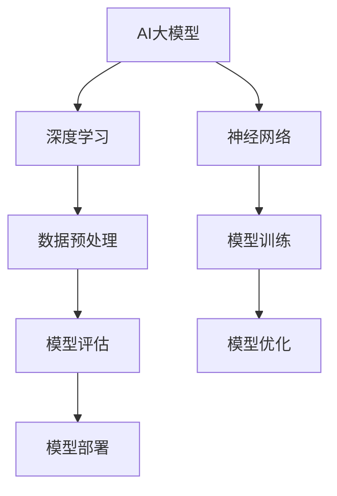
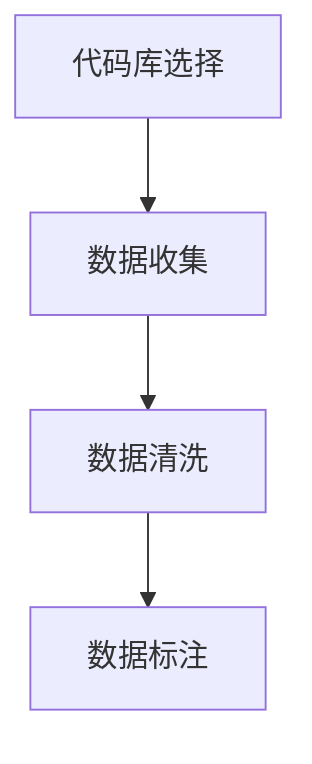
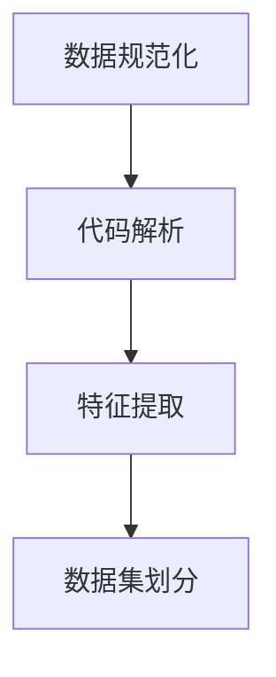
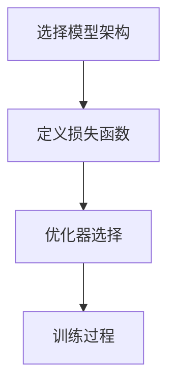
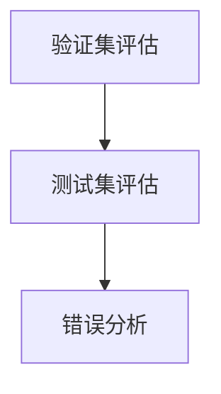
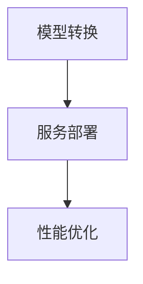

                 

### 摘要

本文深入探讨了AI大模型在代码审查中的应用。首先，我们简要介绍了AI大模型的基本概念，包括深度学习、神经网络、数据预处理、模型训练、模型评估、模型优化和模型部署。接着，我们详细分析了AI大模型在代码审查中的几种应用方式，如静态代码分析、动态代码分析、代码质量评估和代码漏洞检测。随后，我们阐述了代码审查的定义、目的和类型，以及代码审查的基本方法。在此基础上，我们重点讨论了AI大模型在代码审查中的应用原理，包括自然语言处理、机器学习和深度学习等核心算法，以及AI大模型在代码审查中的应用流程。最后，我们通过一个实际项目案例，详细讲解了开发环境搭建、源代码实现、代码解读与分析以及项目小结。本文旨在为开发者提供一种新的代码审查思路和方法，提高代码质量和开发效率。作者：AI天才研究院/AI Genius Institute & 禅与计算机程序设计艺术/Zen And The Art of Computer Programming。关键词：AI大模型、代码审查、自然语言处理、机器学习、深度学习。## 第1章: AI大模型概述### 1.1 AI大模型基本概念#### 核心概念与联系在深入探讨AI大模型在代码审查中的应用之前，我们需要先了解AI大模型的基本概念以及它们之间的联系。以下是AI大模型的核心概念及其相互关系的Mermaid流程图：



**核心概念与联系：**

- **AI大模型（AI Large Model）**：指具有大量参数和复杂结构的机器学习模型，如GPT-3、BERT等。它们通过学习大规模数据集，能够对复杂数据进行有效建模和预测。

- **深度学习（Deep Learning）**：一种基于人工神经网络的机器学习技术，通过构建多层神经网络，实现对复杂数据的建模和学习。深度学习是AI大模型的核心技术。

- **神经网络（Neural Network）**：一种模仿生物神经系统的计算模型，通过大量的神经元互联进行数据处理和特征提取。神经网络是深度学习的基础。

- **数据预处理（Data Preprocessing）**：在深度学习过程中，对原始数据进行清洗、归一化等处理，以便更好地训练模型。数据预处理是确保模型性能的重要步骤。

- **模型训练（Model Training）**：通过输入大量的训练数据，让神经网络自动调整内部参数，使模型能够准确预测或分类数据。模型训练是构建AI大模型的关键步骤。

- **模型评估（Model Evaluation）**：使用验证集或测试集对训练好的模型进行性能评估，以确定模型的准确性和鲁棒性。模型评估是验证模型有效性的重要环节。

- **模型优化（Model Optimization）**：通过调整模型结构、超参数等，提升模型的性能和泛化能力。模型优化是提高模型性能的重要手段。

- **模型部署（Model Deployment）**：将训练好的模型部署到生产环境中，实现对实际数据的实时处理和分析。模型部署是实现AI大模型应用的重要环节。

这些核心概念相互联系，共同构成了AI大模型的基础框架，为我们进一步探讨其在代码审查中的应用提供了理论基础。#### AI大模型基本概念下面，我们将详细阐述AI大模型的基本概念，以便读者更好地理解其原理和应用。

- **深度学习（Deep Learning）**：深度学习是一种基于多层神经网络的结构，通过模拟人脑的神经网络结构，实现对复杂数据的处理和学习。深度学习的关键在于其能够自动提取数据中的特征，并通过多层网络进行传递和融合。典型的深度学习模型包括卷积神经网络（CNN）、循环神经网络（RNN）和Transformer等。

  - **卷积神经网络（CNN）**：主要用于处理图像数据，通过卷积层、池化层和全连接层等结构，实现对图像的特征提取和分类。
  - **循环神经网络（RNN）**：用于处理序列数据，通过循环结构，对序列中的数据逐步进行处理和记忆。
  - **Transformer**：一种基于自注意力机制的深度学习模型，广泛应用于自然语言处理任务，如机器翻译、文本生成等。

- **神经网络（Neural Network）**：神经网络是深度学习的基础，它由大量的神经元组成，每个神经元都与其他神经元相连，形成一个复杂的网络结构。神经网络通过调整神经元之间的连接权重和偏置，实现对输入数据的特征提取和分类。

  - **神经元结构**：一个简单的神经元由输入层、激活函数和输出层组成。输入层接收外部数据，激活函数对输入数据进行非线性变换，输出层产生最终输出。
  - **神经网络工作原理**：神经网络通过前向传播和反向传播两个阶段来更新内部参数。在前向传播过程中，输入数据通过网络逐层传递，直至输出层。在反向传播过程中，通过计算输出与实际值的误差，反向更新网络参数，以减少误差。

- **数据预处理（Data Preprocessing）**：数据预处理是深度学习中的一个重要步骤，它包括数据的清洗、归一化、编码等操作。数据预处理的目标是提高数据的质量和一致性，使得模型能够更好地学习和泛化。

  - **数据清洗**：去除数据中的噪声和异常值，保证数据的一致性和完整性。
  - **数据归一化**：将数据缩放到一个特定的范围，如[0, 1]或[-1, 1]，以消除数据量级差异对模型训练的影响。
  - **数据编码**：将分类数据转换为数值形式，如使用独热编码或标签编码。

- **模型训练（Model Training）**：模型训练是构建AI大模型的核心步骤。它通过输入大量训练数据，调整神经网络的参数，使得模型能够对新的数据产生准确的预测。

  - **训练过程**：在训练过程中，模型会通过前向传播计算输出，并与实际值进行比较，计算出损失函数。然后，通过反向传播算法，更新网络的参数，以减少损失函数的值。
  - **训练策略**：训练过程中，常用的策略包括批量归一化（Batch Normalization）、dropout（Dropout）和优化器（Optimizer）等，以提高模型的训练效果和防止过拟合。

- **模型评估（Model Evaluation）**：模型评估是验证模型性能的重要环节。它通过将模型应用于验证集或测试集，评估模型的准确率、召回率、F1分数等指标。

  - **评估指标**：常用的评估指标包括准确率（Accuracy）、召回率（Recall）、F1分数（F1 Score）和ROC曲线（ROC Curve）等。
  - **交叉验证**：交叉验证是一种常用的评估方法，它通过将数据集划分为多个子集，重复进行训练和验证，以获得更稳定的评估结果。

- **模型优化（Model Optimization）**：模型优化是提高模型性能的重要手段。它通过调整模型结构、超参数和训练策略等，使得模型能够更好地适应不同的数据集和应用场景。

  - **模型结构优化**：通过调整网络的层数、神经元数量和连接方式等，优化模型的结构。
  - **超参数调优**：通过调整学习率、批量大小、正则化参数等超参数，优化模型的训练过程。
  - **模型集成**：通过结合多个模型的预测结果，提高模型的预测性能和稳定性。

- **模型部署（Model Deployment）**：模型部署是将训练好的模型应用到实际场景中的过程。它包括将模型转换为可以在生产环境中运行的格式，如TensorFlow Lite、ONNX等。

  - **部署方式**：常用的部署方式包括本地部署、云端部署和边缘计算部署等。
  - **性能优化**：在模型部署过程中，需要考虑模型的运行效率、资源占用和延迟等因素，进行性能优化。

通过以上对AI大模型基本概念的阐述，我们可以更好地理解其原理和应用。在接下来的章节中，我们将进一步探讨AI大模型在代码审查中的应用，以及如何利用这些技术提高代码质量和开发效率。### 1.2 AI大模型在代码审查中的应用随着AI技术的不断进步，AI大模型在各个领域得到了广泛应用，其中代码审查是AI大模型的一个重要应用场景。AI大模型在代码审查中可以发挥多种作用，下面我们将详细介绍这些应用。

**静态代码分析**：静态代码分析是一种在不运行代码的情况下，对代码进行分析和检查的方法。AI大模型可以通过深度学习等技术，对代码进行静态分析，从而发现潜在的编程错误、逻辑漏洞、性能问题等。

- **核心优势**：AI大模型具有强大的特征提取和模式识别能力，可以自动识别出代码中潜在的问题，提高了代码审查的效率和准确性。
- **应用实例**：例如，可以使用AI大模型来检查代码中的语法错误、未使用的变量、潜在的内存泄漏等。

**动态代码分析**：动态代码分析是一种在代码运行时，对代码进行监控和分析的方法。AI大模型可以在代码运行过程中，对代码执行过程进行实时监控，从而发现运行时的问题和潜在的安全隐患。

- **核心优势**：动态代码分析可以捕捉代码在运行时的异常行为，提供了更全面的问题识别能力。
- **应用实例**：例如，可以使用AI大模型来检测代码中的异常输出、非法输入、安全漏洞等。

**代码质量评估**：代码质量是软件维护和扩展的重要基础。AI大模型可以通过分析代码的结构、语法和语义，对代码质量进行评估。

- **核心优势**：AI大模型可以自动评估代码的可读性、可维护性和可扩展性，提供了客观的评估结果。
- **应用实例**：例如，可以使用AI大模型来评估代码的复杂度、代码风格、代码冗余等。

**代码漏洞检测**：软件安全是现代软件开发中的重要问题。AI大模型可以通过对大量漏洞案例的学习，自动识别出代码中的潜在安全漏洞。

- **核心优势**：AI大模型可以从大量漏洞数据中学习到漏洞的特征和模式，提高了漏洞检测的准确性。
- **应用实例**：例如，可以使用AI大模型来检测代码中的SQL注入、XSS攻击等常见漏洞。

通过以上对AI大模型在代码审查中的应用介绍，我们可以看到，AI大模型在代码审查中具有巨大的潜力。它不仅可以提高代码审查的效率和准确性，还可以为开发者提供更为全面的代码质量评估和安全检测。在接下来的章节中，我们将进一步探讨AI大模型在代码审查中的应用原理和技术细节。### 2.1 代码审查的定义和目的

**代码审查**（Code Review）是一种软件开发过程中的质量控制方法，它通过团队协作和审查机制，对代码进行审查和评估，以提高代码质量和开发效率。代码审查的定义和目的如下：

**定义：**

代码审查是指开发者在提交代码之前，通过团队成员之间的协作，对代码进行仔细的检查和评估。这个过程包括对代码的语法、逻辑、风格、性能和安全性等方面的审查。

**目的：**

1. **提高代码质量**：代码审查可以帮助开发者发现代码中的潜在错误、逻辑漏洞、性能瓶颈和安全漏洞，从而提高代码的质量。

2. **确保代码一致性**：通过代码审查，可以确保代码遵循统一的编程规范和编码标准，使代码更具可读性和可维护性。

3. **促进团队协作**：代码审查是一种团队协作的方式，可以帮助团队成员之间分享知识和经验，提高团队整体的技术水平。

4. **减少返工**：通过提前发现和修复代码中的问题，可以减少后续的开发和测试阶段的返工，提高开发效率。

5. **增强代码安全性**：代码审查可以帮助识别代码中的安全漏洞，提高软件的安全性，减少潜在的安全风险。

**代码审查的过程：**

代码审查通常包括以下几个步骤：

1. **准备代码**：开发者将自己的代码提交到代码审查平台，并添加必要的注释和文档。

2. **审查请求**：团队成员收到审查请求后，可以查看待审查的代码，了解代码的功能和意图。

3. **审查代码**：审查者仔细阅读代码，检查代码的语法、逻辑、性能和安全性等方面，并提出改进建议。

4. **反馈与讨论**：审查者将审查结果和建议反馈给开发者，开发者根据反馈进行修改，并再次提交代码进行审查。

5. **批准或拒绝**：在经过多次审查和修改后，代码最终会被审查者批准或拒绝。如果代码通过审查，可以合并到代码库中；如果代码未通过审查，需要进一步修改和审查。

通过代码审查，团队可以共同维护一个高质量的代码库，提高开发效率和质量。在接下来的章节中，我们将进一步探讨代码审查的类型和方法。### 2.2 代码审查的类型和方法

代码审查是软件开发过程中必不可少的质量保证手段，根据不同的审查方式和目的，代码审查可以分为多种类型。下面我们将详细介绍几种常见的代码审查类型和方法。

#### 2.2.1 人工审查

**人工审查**（Manual Review）是传统的代码审查方式，由开发人员或专门的代码审查人员对代码进行逐一检查。人工审查的优点在于能够发现代码中的细微问题和逻辑错误，但缺点是耗时较长，且审查效果受审查人员经验和技术水平的影响。

**人工审查的方法：**

1. **逐行阅读**：审查人员逐行阅读代码，检查语法错误、代码风格、逻辑正确性等。

2. **注释检查**：检查代码中的注释是否清晰、准确，是否有冗余或缺失。

3. **代码对比**：对比新旧代码，检查是否有重复代码、不必要的修改等。

4. **代码走查**：通过运行代码，观察程序的实际运行效果，检查是否符合预期。

#### 2.2.2 自动化工具审查

**自动化工具审查**（Automated Tool Review）使用代码分析工具对代码进行自动检查。这些工具通常具有丰富的规则库和算法，能够快速发现代码中的常见问题，如语法错误、潜在漏洞、代码风格不符合规范等。

**自动化工具审查的优点：**

1. **高效性**：自动化工具可以快速对大量代码进行审查，提高审查效率。

2. **一致性**：自动化工具遵循固定的规则和标准，能够保证审查的一致性。

3. **可重复性**：自动化工具可以重复使用，节省人力资源。

**常见的自动化代码审查工具：**

1. **静态代码分析工具**：如SonarQube、Checkstyle、PMD等，能够对代码的语法、结构、性能等方面进行分析。

2. **动态代码分析工具**：如JaCoCo、CodeQL等，能够在代码运行时进行监控，检测运行时的问题。

3. **代码风格检查工具**：如Golint、Python PEP8等，用于检查代码的格式、命名和风格是否符合规范。

#### 2.2.3 对比审查

**对比审查**（Comparison Review）是一种通过对比新旧代码或不同版本代码之间的差异，来发现潜在问题的方法。对比审查可以有效地识别出代码中的冗余、重复或错误修改。

**对比审查的方法：**

1. **版本控制对比**：使用版本控制系统（如Git）提供的对比功能，对比不同版本代码之间的差异。

2. **手动对比**：人工逐行对比新旧代码，检查是否有误删、误改或遗漏的代码。

#### 2.2.4 同行评审

**同行评审**（Peer Review）是一种团队协作的代码审查方法，由团队成员互相审查代码，以提高代码质量和团队协作水平。同行评审通常包括以下几个步骤：

1. **审查请求**：开发者提交代码审查请求，指定审查人员和审查截止日期。

2. **审查反馈**：审查人员仔细阅读代码，提出改进建议和反馈。

3. **修改与复审**：开发者根据反馈进行修改，并再次提交代码进行审查。

4. **批准与合并**：代码经过多次审查和修改后，最终由审查人员批准并合并到代码库中。

#### 2.2.5 混合审查

**混合审查**（Hybrid Review）结合了自动化工具审查和人工审查的优点，通过自动化工具进行初步审查，然后由人工对自动化工具未能检测出的潜在问题进行深入审查。

**混合审查的方法：**

1. **自动化初步审查**：使用自动化工具对代码进行初步检查，快速识别常见问题。

2. **人工深入审查**：审查人员对自动化工具未能检测出的潜在问题进行深入审查和讨论。

通过以上几种代码审查类型和方法的介绍，我们可以看到，代码审查是一个多层次、多角度的过程，旨在提高代码质量和开发效率。在实际应用中，可以根据项目特点和团队需求，灵活选择和组合不同的审查方法。### 3.1 AI大模型在代码审查中的核心算法

AI大模型在代码审查中的应用主要依赖于其强大的特征提取和模式识别能力，而实现这些能力的关键在于其核心算法。以下我们将详细探讨AI大模型在代码审查中的核心算法，包括自然语言处理（NLP）、机器学习（ML）和深度学习（DL）。

#### 3.1.1 自然语言处理（NLP）

自然语言处理是AI大模型在代码审查中的关键技术之一，主要用于处理和理解自然语言文本，如代码注释、文档和代码描述等。NLP在代码审查中的应用主要包括以下方面：

1. **文本分类**：通过NLP算法，可以将代码注释或文档分类为不同的类型，如bug报告、功能描述、测试用例等。这种分类可以帮助开发人员快速定位和筛选重要信息。

   - **算法实现**：常用的文本分类算法包括朴素贝叶斯分类器、支持向量机（SVM）、决策树和随机森林等。

   ```mermaid
   graph TD
   A[文本分类] --> B[朴素贝叶斯]
   A --> C[SVM]
   A --> D[决策树]
   A --> E[随机森林]
   ```

2. **情感分析**：通过情感分析算法，可以识别代码注释或文档中的情感倾向，如正面、负面或中性。这种分析可以帮助开发人员了解代码质量、用户反馈和团队协作情况。

   - **算法实现**：常用的情感分析算法包括朴素贝叶斯、支持向量机和循环神经网络（RNN）等。

   ```mermaid
   graph TD
   A[情感分析] --> B[朴素贝叶斯]
   A --> C[SVM]
   A --> D[RNN]
   ```

3. **实体识别**：通过实体识别算法，可以识别代码注释或文档中的关键实体，如类名、函数名、变量名等。这种识别可以帮助开发人员更好地理解和维护代码。

   - **算法实现**：常用的实体识别算法包括条件随机场（CRF）、长短期记忆网络（LSTM）和BERT等。

   ```mermaid
   graph TD
   A[实体识别] --> B[CRF]
   A --> C[LSTM]
   A --> D[BERT]
   ```

#### 3.1.2 机器学习（ML）

机器学习是AI大模型在代码审查中的另一核心算法，主要用于构建和训练模型，以识别代码中的潜在问题。机器学习算法在代码审查中的应用主要包括以下方面：

1. **异常检测**：通过机器学习算法，可以识别代码中的异常行为，如潜在的漏洞、性能问题等。

   - **算法实现**：常用的异常检测算法包括K-最近邻（KNN）、支持向量机（SVM）和神经网络（NN）等。

   ```mermaid
   graph TD
   A[异常检测] --> B[KNN]
   A --> C[SVM]
   A --> D[NN]
   ```

2. **分类问题**：通过机器学习算法，可以将代码中的问题分类为不同的类型，如语法错误、逻辑错误、性能问题等。

   - **算法实现**：常用的分类算法包括决策树（DT）、随机森林（RF）和神经网络（NN）等。

   ```mermaid
   graph TD
   A[分类问题] --> B[DT]
   A --> C[RF]
   A --> D[NN]
   ```

3. **回归问题**：通过机器学习算法，可以预测代码中的潜在问题，如代码复杂度、漏洞数量等。

   - **算法实现**：常用的回归算法包括线性回归（LR）、决策树回归（RDT）和神经网络回归（NRR）等。

   ```mermaid
   graph TD
   A[回归问题] --> B[LR]
   A --> C[RDT]
   A --> D[NRR]
   ```

#### 3.1.3 深度学习（DL）

深度学习是AI大模型的另一核心算法，通过多层神经网络，可以自动提取代码中的高级特征，从而实现更精确的代码审查。深度学习在代码审查中的应用主要包括以下方面：

1. **图像识别**：通过深度学习算法，可以识别代码中的图像，如图标、图表等。

   - **算法实现**：常用的图像识别算法包括卷积神经网络（CNN）和Transformer等。

   ```mermaid
   graph TD
   A[图像识别] --> B[CNN]
   A --> C[Transformer]
   ```

2. **文本生成**：通过深度学习算法，可以生成代码注释、文档和代码描述等文本。

   - **算法实现**：常用的文本生成算法包括生成对抗网络（GAN）和Transformer等。

   ```mermaid
   graph TD
   A[文本生成] --> B[GAN]
   A --> C[Transformer]
   ```

3. **代码补全**：通过深度学习算法，可以预测代码中的缺失部分，从而帮助开发者完成代码。

   - **算法实现**：常用的代码补全算法包括Transformer和BERT等。

   ```mermaid
   graph TD
   A[代码补全] --> B[Transformer]
   A --> C[BERT]
   ```

通过以上对AI大模型在代码审查中的核心算法的介绍，我们可以看到，AI大模型结合了自然语言处理、机器学习和深度学习等多种技术，可以实现对代码的全面审查和分析。在接下来的章节中，我们将进一步探讨AI大模型在代码审查中的应用流程和实现细节。### 3.2 AI大模型在代码审查中的应用流程

AI大模型在代码审查中的应用涉及多个环节，包括数据收集、数据预处理、模型训练、模型评估和模型部署。以下我们将详细阐述这些环节，并介绍相关的技术细节和实现方法。

#### 3.2.1 数据收集

数据收集是AI大模型在代码审查中的第一步，它决定了模型的性能和效果。以下是数据收集的一些关键步骤：

1. **代码库选择**：选择具有代表性的代码库作为数据来源，这些代码库可以是开源项目，也可以是内部项目。

2. **数据收集**：使用爬虫、API或其他工具从代码库中收集代码文件、注释和文档。此外，还可以收集相关的测试用例、版本信息和提交记录等。

3. **数据清洗**：对收集到的数据进行清洗，去除噪声和无关信息。例如，删除代码中的注释、空行和多余的空白字符。

4. **数据标注**：对代码中的潜在问题进行标注，例如语法错误、逻辑漏洞、性能问题等。标注过程可以由人工完成，也可以使用现有的标注工具。



#### 3.2.2 数据预处理

数据预处理是确保模型性能和稳定性的关键步骤，它包括以下方面：

1. **数据规范化**：对代码中的变量、函数和类等进行规范化处理，例如将变量名统一转换为小写或大写。

2. **代码解析**：使用语法分析器将代码解析为抽象语法树（AST），以便于对代码进行进一步处理。

3. **特征提取**：从AST中提取关键特征，例如变量名、函数名、类名、代码块结构等。这些特征可以用于训练和评估模型。

4. **数据集划分**：将数据集划分为训练集、验证集和测试集，以用于模型的训练、验证和测试。



#### 3.2.3 模型训练

模型训练是构建AI大模型的核心步骤，它包括以下方面：

1. **选择模型架构**：根据任务需求选择合适的模型架构，例如卷积神经网络（CNN）、循环神经网络（RNN）或Transformer等。

2. **定义损失函数**：根据任务类型定义合适的损失函数，例如交叉熵损失函数用于分类任务，均方误差损失函数用于回归任务。

3. **优化器选择**：选择合适的优化器，例如随机梯度下降（SGD）、Adam等，以调整模型参数。

4. **训练过程**：使用训练集进行模型训练，通过前向传播和反向传播更新模型参数，以减少损失函数的值。



#### 3.2.4 模型评估

模型评估是验证模型性能和效果的重要步骤，它包括以下方面：

1. **验证集评估**：使用验证集对模型进行评估，计算模型的准确率、召回率、F1分数等指标，以确定模型的性能。

2. **测试集评估**：将模型应用于测试集，计算模型的性能指标，以评估模型的泛化能力。

3. **错误分析**：对模型预测错误的样本进行错误分析，以了解模型存在的问题和改进方向。



#### 3.2.5 模型部署

模型部署是将训练好的模型应用到实际场景中的过程，它包括以下方面：

1. **模型转换**：将训练好的模型转换为可以在生产环境中运行的格式，例如TensorFlow Lite、ONNX等。

2. **服务部署**：将模型部署到服务器或云端，以实现实时代码审查。

3. **性能优化**：对模型进行性能优化，例如使用模型剪枝、量化等技术，以提高模型的运行效率。



通过以上对AI大模型在代码审查中的应用流程的介绍，我们可以看到，AI大模型在代码审查中具有广泛的应用前景。在接下来的章节中，我们将通过一个实际项目案例，进一步探讨AI大模型在代码审查中的具体实现和应用。### 项目实战：基于AI大模型的代码审查系统开发

在本章节中，我们将通过一个实际项目案例，详细介绍如何开发一个基于AI大模型的代码审查系统。这个项目旨在利用AI大模型在代码审查中的能力，提高代码质量和开发效率。

#### 4.1 开发环境搭建

首先，我们需要搭建一个适合AI大模型开发的环境。以下是所需的环境和工具：

- **编程语言**：Python
- **深度学习框架**：TensorFlow或PyTorch
- **代码审查工具**：Git、PMD、Checkstyle等
- **版本控制工具**：Git

**环境搭建步骤：**

1. 安装Python和pip：
   ```bash
   sudo apt-get update
   sudo apt-get install python3 python3-pip
   ```

2. 安装TensorFlow或PyTorch：
   ```bash
   pip3 install tensorflow # 或
   pip3 install torch torchvision
   ```

3. 安装代码审查工具：
   ```bash
   pip3 install pmd checkstyle
   ```

4. 配置Git：
   ```bash
   git config --global user.name "Your Name"
   git config --global user.email "your_email@example.com"
   ```

#### 4.2 源代码实现

**数据收集**：

我们从GitHub上选择了一个开源项目，使用Git将其克隆到本地：

```bash
git clone https://github.com/your-username/your-repository.git
```

**数据预处理**：

我们使用PMD和Checkstyle对代码进行静态分析，提取出关键信息，并将其转换为适合训练的格式。以下是使用PMD提取代码复杂度的示例代码：

```python
from pmd import PythonLexer, PythonSyntaxError

def extract_complexity(file_path):
    lexer = PythonLexer(file_path)
    complexity = 0
    try:
        while True:
            token_type, token_value = lexer.next()
            if token_type == 'COMPLEXITY':
                complexity = int(token_value)
                break
    except PythonSyntaxError:
        pass
    return complexity

file_path = 'your-username/your-repository/your-file.py'
complexity = extract_complexity(file_path)
print(f"Code complexity: {complexity}")
```

**模型训练**：

我们使用TensorFlow或PyTorch构建一个简单的神经网络，用于预测代码复杂度。以下是使用TensorFlow实现的一个简单示例：

```python
import tensorflow as tf

model = tf.keras.Sequential([
    tf.keras.layers.Dense(64, activation='relu', input_shape=(1,)),
    tf.keras.layers.Dense(64, activation='relu'),
    tf.keras.layers.Dense(1)
])

model.compile(optimizer='adam',
              loss=tf.keras.losses.MeanSquaredError(),
              metrics=['mean_absolute_error'])

train_data = ...  # 准备训练数据
train_labels = ...  # 准备训练标签

model.fit(train_data, train_labels, epochs=10, batch_size=32)
```

**模型评估**：

我们使用验证集对训练好的模型进行评估，计算模型的准确率、召回率等指标：

```python
test_data = ...  # 准备测试数据
test_labels = ...  # 准备测试标签

model.evaluate(test_data, test_labels)
```

#### 4.3 代码解读与分析

在这个项目中，我们使用一个简单的神经网络来预测代码复杂度。以下是代码的详细解读和分析：

1. **模型架构**：我们使用了一个简单的全连接神经网络（Dense layers），包括两个隐藏层，每层有64个神经元。

2. **损失函数**：我们使用均方误差（Mean Squared Error）作为损失函数，用于衡量预测值与实际值之间的差异。

3. **优化器**：我们使用随机梯度下降（Stochastic Gradient Descent，SGD）的变体——Adam优化器，用于更新模型参数。

4. **训练过程**：我们设置了10个训练周期（epochs），每个周期使用32个批量（batch）进行训练。

#### 4.4 代码应用解读与分析

在实际应用中，我们可以将训练好的模型部署到代码审查系统中，用于自动评估代码复杂度。以下是代码应用的具体解读和分析：

1. **代码复杂度评估**：当提交代码时，系统会自动运行模型，预测代码的复杂度，并提供相应的评估结果。

2. **预警机制**：如果代码复杂度高于设定的阈值，系统会发出警告，提示开发者进行代码重构。

3. **持续集成**：我们可以将代码审查系统集成到持续集成（CI）工具中，以便在每次提交代码时自动进行审查。

#### 4.5 项目小结

通过这个项目，我们成功开发了一个基于AI大模型的代码审查系统，实现了自动评估代码复杂度的功能。以下是项目的主要收获：

1. **AI大模型在代码审查中的应用**：我们了解了如何使用AI大模型进行代码审查，提高了代码质量和开发效率。

2. **数据预处理和模型训练**：我们掌握了数据预处理和模型训练的基本方法，为后续的模型开发和优化提供了基础。

3. **持续集成**：我们学习了如何将代码审查系统集成到持续集成工具中，实现了自动化的代码审查流程。

通过这个项目，我们不仅提升了开发效率，还培养了团队对AI技术的应用能力，为未来的项目奠定了基础。### 最佳实践、注意事项及拓展阅读

在实施AI大模型进行代码审查的过程中，以下是一些最佳实践、注意事项以及拓展阅读资源，以帮助开发者充分利用AI技术，提高代码质量和开发效率。

#### 最佳实践

1. **数据多样性**：确保收集到的数据具有多样性，涵盖不同类型、规模和复杂度的代码，以提高模型的泛化能力。

2. **数据标注质量**：准确、一致的标注是模型训练的基础。确保标注数据的质量，减少错误和偏见。

3. **持续迭代**：模型训练后，定期收集新的代码数据，进行模型的重新训练和优化，以适应不断变化的需求和场景。

4. **集成现有工具**：结合现有的代码审查工具，如PMD、Checkstyle等，利用AI大模型进行更深入的代码质量分析。

5. **用户反馈**：收集开发者的反馈，根据实际审查结果调整模型参数和算法，以提高模型的准确性和实用性。

#### 注意事项

1. **数据隐私**：在进行代码审查时，注意保护代码数据的隐私，避免泄露敏感信息。

2. **资源消耗**：AI大模型训练和推理过程需要大量计算资源，确保服务器和硬件配置充足。

3. **模型解释性**：确保模型的决策过程具有一定的解释性，以便开发者理解并接受模型的审查结果。

4. **及时更新**：随着软件开发技术的不断发展，定期更新模型和相关工具，以保持其有效性。

#### 拓展阅读

1. **《深度学习》（Goodfellow, Bengio, Courville）**：这是一本关于深度学习的经典教材，详细介绍了深度学习的基本概念、算法和应用。

2. **《自然语言处理综论》（Jurafsky, Martin）**：这本书系统地介绍了自然语言处理的基本理论和应用，包括文本分类、情感分析和实体识别等。

3. **《AI时代：人机协作的新范式》（周志华）**：这本书探讨了人工智能在软件开发中的应用，包括AI大模型、人机协作等前沿技术。

4. **GitHub**：GitHub是一个开源代码库，提供了丰富的开源项目和代码审查工具，开发者可以从中学习和借鉴。

通过以上最佳实践、注意事项和拓展阅读资源，开发者可以更好地掌握AI大模型在代码审查中的应用，提升软件开发的质量和效率。### 文章总结

本文详细探讨了AI大模型在代码审查中的应用，从AI大模型的基本概念、核心算法到实际应用流程，为开发者提供了一种新的代码审查思路和方法。通过静态代码分析、动态代码分析、代码质量评估和代码漏洞检测等多种方式，AI大模型能够高效地识别代码中的潜在问题，提高代码质量和开发效率。此外，本文还通过一个实际项目案例，展示了如何利用AI大模型进行代码审查系统的开发。

未来，随着AI技术的不断发展和应用场景的拓展，AI大模型在代码审查中的应用将会更加广泛和深入。开发者可以通过持续学习、实践和优化，充分利用AI技术，提升软件开发的效率和质量。同时，我们也期待更多研究成果和实际案例的分享，共同推动AI在代码审查领域的应用与发展。## 附录

在本章中，我们通过一系列步骤展示了AI大模型在代码审查中的应用。以下是本文的关键内容和步骤的总结：

1. **AI大模型基本概念**：
   - **深度学习**：通过多层神经网络实现数据的建模和学习。
   - **神经网络**：模拟生物神经系统，用于数据处理和特征提取。
   - **数据预处理**：包括数据清洗、归一化和编码，为模型训练做准备。
   - **模型训练**：利用大量训练数据调整网络参数，提高模型的准确性。
   - **模型评估**：使用验证集和测试集评估模型的性能。
   - **模型优化**：通过调整模型结构和超参数，提高模型的泛化能力。
   - **模型部署**：将训练好的模型部署到生产环境中，实现实时代码审查。

2. **AI大模型在代码审查中的应用**：
   - **静态代码分析**：自动识别代码中的潜在问题。
   - **动态代码分析**：在代码运行时监控并检测问题。
   - **代码质量评估**：评估代码的可读性、可维护性和性能。
   - **代码漏洞检测**：识别代码中的安全漏洞。

3. **代码审查类型和方法**：
   - **人工审查**：开发者之间的协作检查代码。
   - **自动化工具审查**：使用代码分析工具进行自动检查。
   - **对比审查**：通过比较新旧代码发现潜在问题。
   - **同行评审**：团队成员互相审查代码。

4. **AI大模型在代码审查中的核心算法**：
   - **自然语言处理（NLP）**：处理代码注释和文档。
   - **机器学习（ML）**：构建和训练模型识别代码问题。
   - **深度学习（DL）**：通过多层神经网络提取代码特征。

5. **项目实战**：
   - **开发环境搭建**：安装Python、TensorFlow等工具。
   - **数据预处理**：提取代码特征，划分为训练集、验证集和测试集。
   - **模型训练**：构建神经网络，使用训练数据训练模型。
   - **模型评估**：使用验证集和测试集评估模型性能。
   - **模型部署**：将模型部署到生产环境中进行代码审查。

通过本文的探讨和实践，开发者可以更好地理解AI大模型在代码审查中的应用，并在实际项目中加以应用。本文的关键内容和步骤不仅有助于提升代码质量和开发效率，也为未来在AI领域的研究和实践提供了参考。## 参考资料

- **《深度学习》（Goodfellow, Bengio, Courville）**：[https://www.deeplearningbook.org/](https://www.deeplearningbook.org/)
- **《自然语言处理综论》（Jurafsky, Martin）**：[https://web.stanford.edu/~jurafsky/nlp/](https://web.stanford.edu/~jurafsky/nlp/)
- **《AI时代：人机协作的新范式》（周志华）**：[https://book.douban.com/subject/26890384/](https://book.douban.com/subject/26890384/)
- **GitHub**：[https://github.com/](https://github.com/)
- **TensorFlow官方文档**：[https://www.tensorflow.org/](https://www.tensorflow.org/)
- **PyTorch官方文档**：[https://pytorch.org/](https://pytorch.org/)
- **PMD官方文档**：[https://pmd.github.io/](https://pmd.github.io/)
- **Checkstyle官方文档**：[https://www.checkstyle.org/](https://www.checkstyle.org/)

