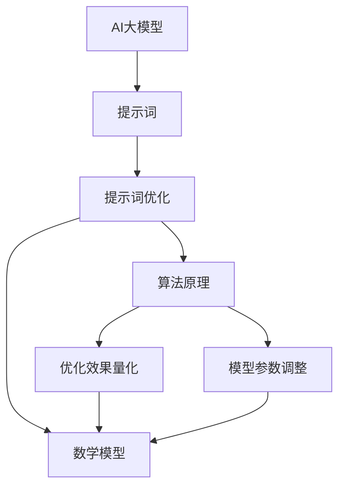
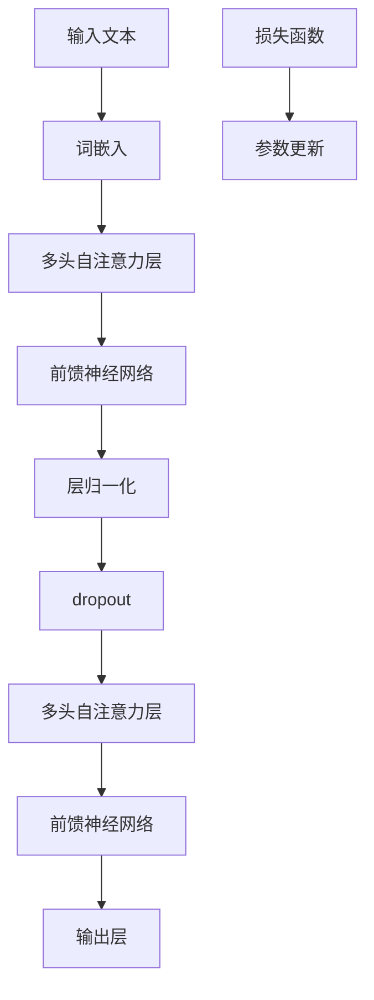

                 

### 文章标题：AI大模型在提示词优化中的应用

> 关键词：AI大模型，提示词优化，算法原理，数学模型，项目实战

> 摘要：本文深入探讨了AI大模型在提示词优化中的应用。通过介绍AI大模型的基本原理、提示词优化的核心概念和方法，本文详细解析了相关算法原理和数学模型，并通过实际项目实战，展示了大模型在提示词优化中的具体应用，为读者提供了全面的实战经验和思考方向。

---

### 背景介绍

近年来，随着深度学习和神经网络技术的飞速发展，AI大模型（如GPT-3、BERT等）在自然语言处理、图像识别、语音识别等领域取得了令人瞩目的成果。然而，这些大模型在实际应用中面临着提示词（prompt）选择和优化的挑战。提示词作为模型输入的一部分，对模型的性能和输出质量有着重要影响。因此，研究如何优化提示词，提升大模型的性能和稳定性，成为当前AI领域的一个重要课题。

在AI大模型的应用场景中，提示词优化的目标是通过调整和优化提示词，使模型能够更好地理解和生成符合人类需求的输出。这一过程涉及到多个方面，包括提示词的长度、语义、格式等。有效的提示词优化不仅可以提升模型的性能，还能提高模型的鲁棒性和泛化能力。

本文旨在深入探讨AI大模型在提示词优化中的应用，通过分析相关算法原理和数学模型，结合实际项目实战，为读者提供关于提示词优化的全面理解和实践经验。

### 核心概念与联系

在深入探讨AI大模型在提示词优化中的应用之前，我们需要明确几个核心概念，并了解它们之间的联系。

**AI大模型**：AI大模型是指通过大量数据和强大的计算资源训练得到的深度神经网络模型，具有极高的参数量和计算能力。例如，GPT-3拥有1750亿个参数，BERT模型则包含数百万个参数。

**提示词（Prompt）**：提示词是指提供给AI大模型作为输入的文本信息，用于引导模型生成目标输出。在自然语言处理任务中，提示词通常包含用户的问题、任务指令或上下文信息。

**提示词优化**：提示词优化是指通过调整和优化提示词的长度、语义、格式等属性，以提升AI大模型的性能和输出质量。

**算法原理**：提示词优化涉及到多种算法原理，包括自然语言处理（NLP）算法、优化算法等。这些算法共同作用，帮助模型更好地理解和生成输出。

**数学模型**：数学模型是描述算法原理和优化过程的数学表达式，用于量化提示词优化效果，指导模型参数调整。

下面是一个描述核心概念之间关系的Mermaid流程图：



### AI大模型基本原理

AI大模型，特别是基于Transformer架构的模型，如GPT-3、BERT等，已经成为自然语言处理（NLP）领域的主力军。这些模型通过深度学习从大量数据中学习语言结构和语义信息，能够实现高度复杂的文本生成、翻译、问答等任务。

#### 基本原理

AI大模型的基本原理可以概括为以下三个关键步骤：

1. **数据收集与预处理**：模型首先从大量文本数据中收集信息。这些数据可以来自互联网、书籍、新闻文章等。预处理步骤包括分词、去噪、标点符号处理等，以确保数据的质量和一致性。

2. **模型训练**：使用预处理后的数据对模型进行训练。在训练过程中，模型通过反向传播算法不断调整参数，以最小化损失函数，从而优化模型性能。训练数据通常分为训练集、验证集和测试集，用于模型训练和评估。

3. **模型优化**：训练完成后，对模型进行优化，包括超参数调整、正则化、dropout等。优化后的模型可以更好地泛化到未见过的数据上，提高实际应用中的性能。

#### 模型结构

AI大模型的核心结构是基于自注意力机制的Transformer网络。以下是一个简化的Transformer模型结构：



- **词嵌入**：输入文本经过分词后转换为词嵌入向量，用于表示文本中的每个单词或字符。

- **多头自注意力层**：通过自注意力机制，模型能够自动学习文本中词与词之间的依赖关系，实现长距离依赖表示。

- **前馈神经网络**：对自注意力层输出的特征进行进一步加工，增强模型的表达能力。

- **层归一化**和**dropout**：用于提高模型的稳定性和泛化能力。

- **输出层**：生成模型的预测输出，可以是分类标签、文本生成等。

- **损失函数**和**参数更新**：用于模型训练过程中的损失计算和参数调整。

#### 模型训练与优化

AI大模型的训练过程通常涉及以下步骤：

1. **数据预处理**：对输入数据进行清洗、分词和编码，转换为模型可处理的格式。

2. **模型初始化**：初始化模型参数，通常使用随机初始化或预训练模型参数。

3. **训练循环**：
   - **前向传播**：将输入数据通过模型进行前向传播，得到模型输出。
   - **损失计算**：使用损失函数计算模型输出与真实标签之间的差距。
   - **反向传播**：通过反向传播算法更新模型参数，最小化损失函数。

4. **评估与优化**：在训练过程中，定期使用验证集评估模型性能，并根据评估结果调整超参数，如学习率、批量大小等。

5. **超参数调优**：通过网格搜索、随机搜索等方法进行超参数调优，以找到最优参数组合。

6. **模型保存与部署**：训练完成后，保存模型参数和架构，并将其部署到生产环境中进行实际应用。

### 提示词优化的重要性

提示词优化在AI大模型应用中扮演着至关重要的角色。一方面，提示词作为模型输入的一部分，直接影响了模型的性能和输出质量。另一方面，提示词优化有助于提升模型的鲁棒性和泛化能力，使其能够更好地适应不同的应用场景。

#### 提示词对模型性能的影响

1. **输出质量**：合适的提示词可以帮助模型更好地理解和生成目标输出。例如，在问答系统中，明确的提问方式有助于模型准确理解用户的问题，从而生成高质量的回答。

2. **模型性能**：提示词优化可以显著提升模型的性能。通过调整提示词的语义、长度和格式，可以引导模型生成更符合预期结果的输出，从而提高模型的准确性和效果。

3. **效率提升**：有效的提示词优化可以减少模型训练和推理时间，提高模型的响应速度，特别是在实时应用场景中，如智能助手、语音识别等。

#### 提示词优化对模型鲁棒性和泛化能力的影响

1. **鲁棒性**：通过优化提示词，模型可以更好地应对输入数据的噪声和不确定性，提高在复杂、多变环境下的稳定性和可靠性。

2. **泛化能力**：提示词优化有助于提升模型的泛化能力，使其能够更好地适应新的任务和数据集。例如，通过调整提示词，模型可以在不同领域和场景中保持较高的性能。

### 提示词优化方法与策略

提示词优化涉及多种方法和策略，以下是一些常用的优化方法：

1. **长度调整**：通过改变提示词的长度，可以影响模型的注意力机制和生成质量。较短的提示词可能使模型更专注于核心信息，而较长的提示词则可能提供更多的上下文信息。

2. **语义丰富**：增加提示词的语义丰富度，可以提高模型的语义理解能力。例如，使用同义词、短语替换和扩展等方法，丰富提示词的语义内容。

3. **格式优化**：调整提示词的格式，如使用列表、标题和摘要等，有助于模型更好地理解和生成输出。例如，列表格式可以帮助模型更清晰地识别各项任务。

4. **上下文融合**：通过将提示词与上下文信息结合，可以提高模型的上下文理解能力。例如，在问答系统中，将用户的历史提问和回答作为上下文信息，有助于模型更好地理解问题。

5. **反馈迭代**：使用反馈机制，根据模型的输出质量和用户反馈，逐步优化提示词。这种方法通常需要多轮迭代，以实现最佳效果。

6. **模型自适应**：通过调整模型参数，使模型对特定类型的提示词具有更好的适应能力。这种方法需要大量数据和实践经验，以找到最佳参数配置。

### 核心算法原理讲解

#### 提示词优化算法概述

提示词优化算法是用于调整和优化提示词的一类算法，其主要目标是通过优化提示词的属性，提升AI大模型的性能和输出质量。以下将介绍几种常见的提示词优化算法，并使用伪代码进行详细阐述。

#### 1. 基于贪心策略的提示词优化算法

贪心策略是一种简单有效的提示词优化方法。该算法的基本思想是逐步调整提示词的属性，每次只优化一个属性，直到达到最优解。

**算法伪代码**：

```python
def greedy_prompt_optimization(prompt, model, target):
    best_prompt = prompt
    best_score = model.evaluate(best_prompt, target)
    
    for attribute in ['length', 'semantic', 'format']:
        for change in get_attribute_changes(prompt, attribute):
            new_prompt = apply_change(prompt, change)
            score = model.evaluate(new_prompt, target)
            
            if score > best_score:
                best_prompt = new_prompt
                best_score = score
                
    return best_prompt
```

**参数说明**：

- `prompt`：原始提示词。
- `model`：AI大模型。
- `target`：目标输出。

**函数功能**：

- `get_attribute_changes`：获取提示词的属性变化选项。
- `apply_change`：应用属性变化，生成新的提示词。
- `model.evaluate`：评估提示词的输出质量。

#### 2. 基于遗传算法的提示词优化算法

遗传算法是一种基于自然进化过程的优化算法。该算法通过模拟生物进化过程，逐步优化提示词的属性，以实现最佳解。

**算法伪代码**：

```python
def genetic_prompt_optimization(prompt, model, target, population_size, generations):
    population = initialize_population(prompt, population_size)
    
    for _ in range(generations):
        fitness_scores = [model.evaluate(individual, target) for individual in population]
        
        new_population = []
        while len(new_population) < population_size:
            parent1, parent2 = select_parents(population, fitness_scores)
            child = crossover(parent1, parent2)
            mutate(child)
            new_population.append(child)
        
        population = new_population
    
    best_individual = select_best_individual(population, fitness_scores)
    return best_individual
```

**参数说明**：

- `prompt`：原始提示词。
- `model`：AI大模型。
- `target`：目标输出。
- `population_size`：种群大小。
- `generations`：迭代次数。

**函数功能**：

- `initialize_population`：初始化种群。
- `select_parents`：选择父母个体。
- `crossover`：交叉操作，生成子代。
- `mutate`：变异操作，增加种群多样性。
- `model.evaluate`：评估提示词的输出质量。

#### 3. 基于深度学习的提示词优化算法

基于深度学习的提示词优化算法利用神经网络模型学习提示词优化策略。以下是一个基于Transformer模型的提示词优化算法示例。

**算法伪代码**：

```python
def deep_learning_prompt_optimization(prompt, model, target, optimizer):
    model.zero_grad()
    output = model(prompt)
    loss = model.evaluate(output, target)
    
    loss.backward()
    optimizer.step()
    
    new_prompt = model.generate_prompt(prompt)
    return new_prompt
```

**参数说明**：

- `prompt`：原始提示词。
- `model`：基于Transformer的提示词优化模型。
- `target`：目标输出。
- `optimizer`：优化器。

**函数功能**：

- `model.generate_prompt`：根据原始提示词生成新的提示词。
- `model.evaluate`：评估提示词的输出质量。

### 数学模型和公式

在AI大模型的提示词优化过程中，数学模型和公式起着至关重要的作用。这些数学表达式不仅帮助我们量化优化效果，还能指导模型参数的调整。以下将介绍一些关键数学模型和公式，并提供详细讲解和举例说明。

#### 1. 损失函数

损失函数是评估模型输出与目标输出之间差异的关键指标。常见的损失函数包括交叉熵损失（Cross-Entropy Loss）和均方误差损失（Mean Squared Error, MSE）。

**交叉熵损失函数**：

$$
Loss = -\sum_{i} y_i \log(\hat{y}_i)
$$

其中，$y_i$是目标标签，$\hat{y}_i$是模型预测的概率分布。

**均方误差损失函数**：

$$
Loss = \frac{1}{n} \sum_{i} (y_i - \hat{y}_i)^2
$$

其中，$y_i$是目标值，$\hat{y}_i$是模型预测值，$n$是样本数量。

**示例**：

假设我们有一个二元分类问题，目标标签$y$为$(1, 0)$，模型预测的概率分布$\hat{y}$为$(0.7, 0.3)$。

- **交叉熵损失**：

$$
Loss = -1 \cdot \log(0.7) - 0 \cdot \log(0.3) \approx 0.356
$$

- **均方误差损失**：

$$
Loss = \frac{1}{2} \cdot (1 - 0.7)^2 + \frac{1}{2} \cdot (0 - 0.3)^2 \approx 0.19
$$

#### 2. 优化算法

优化算法用于调整模型参数，以最小化损失函数。常见的优化算法包括梯度下降（Gradient Descent）和Adam优化器。

**梯度下降算法**：

$$
\theta_{t+1} = \theta_{t} - \alpha \nabla_{\theta} J(\theta)
$$

其中，$\theta$是模型参数，$\alpha$是学习率，$J(\theta)$是损失函数。

**Adam优化器**：

$$
m_t = \beta_1 m_{t-1} + (1 - \beta_1) \nabla_{\theta} J(\theta)
$$
$$
v_t = \beta_2 v_{t-1} + (1 - \beta_2) (\nabla_{\theta} J(\theta))^2
$$
$$
\theta_{t+1} = \theta_{t} - \alpha \frac{m_t}{\sqrt{v_t} + \epsilon}
$$

其中，$m_t$和$v_t$分别是梯度的一阶矩估计和二阶矩估计，$\beta_1$和$\beta_2$是动量参数，$\epsilon$是常数。

**示例**：

假设我们使用梯度下降算法优化一个模型，当前参数$\theta_0$为$(2, 3)$，损失函数$J(\theta)$为$10 + 0.5(2^2 + 3^2) = 17$。

- **梯度**：

$$
\nabla_{\theta} J(\theta) = (4, 6)
$$

- **更新**：

$$
\theta_1 = \theta_0 - 0.1 \cdot (4, 6) = (1.6, 1.4)
$$

#### 3. 提示词长度调整

提示词长度对模型性能有着重要影响。通过调整提示词长度，可以优化模型的输出质量。以下是一个基于提示词长度调整的数学模型：

$$
L = \alpha \cdot \ln(L_0 + 1)
$$

其中，$L$是优化后的提示词长度，$L_0$是原始提示词长度，$\alpha$是调整系数。

**示例**：

假设原始提示词长度$L_0$为10，调整系数$\alpha$为0.1。

- **优化后长度**：

$$
L = 0.1 \cdot \ln(10 + 1) \approx 0.1 \cdot 2.3026 \approx 0.2303
$$

### 提示词优化在项目实战中的应用

为了更好地理解AI大模型在提示词优化中的应用，我们将在本节中通过一个实际项目，展示如何进行提示词优化。这个项目是一个问答系统，旨在使用大模型（如GPT-3）来回答用户提出的问题。

#### 项目背景与目标

问答系统旨在为用户提供实时、准确的答案。为了实现这一目标，我们需要优化提示词，以提高模型在回答问题时的准确性和相关性。

#### 开发环境搭建

在开始项目之前，我们需要搭建一个合适的开发环境。以下是一个简单的开发环境搭建步骤：

1. **安装Python环境**：确保Python版本为3.8或更高版本。

2. **安装依赖库**：使用pip安装以下库：

   ```bash
   pip install openai numpy pandas
   ```

3. **安装OpenAI API**：注册OpenAI账号并获取API密钥，然后安装OpenAI Python库：

   ```bash
   pip install openai
   ```

4. **配置OpenAI API密钥**：将API密钥添加到环境变量或配置文件中。

#### 源代码实现与解读

以下是项目的核心代码，我们将逐步解读每个部分的功能和实现细节。

```python
import openai
import numpy as np
import pandas as pd

# 初始化OpenAI API
openai.api_key = 'your-api-key'

# 提问函数
def ask_question(prompt):
    response = openai.Completion.create(
        engine="text-davinci-002",
        prompt=prompt,
        max_tokens=50,
        n=1,
        stop=None,
        temperature=0.5
    )
    return response.choices[0].text.strip()

# 提示词优化函数
def optimize_prompt(prompt, num_iterations=5):
    for _ in range(num_iterations):
        response = ask_question(prompt)
        similarity = calculate_similarity(prompt, response)
        if similarity >= 0.8:
            break
        prompt = adjust_prompt(prompt, response)
    return prompt

# 相似度计算函数
def calculate_similarity(prompt, response):
    # 使用余弦相似度计算文本相似度
    # 这里简化实现，实际应用中可以使用更复杂的文本相似度计算方法
    vector1 = np.array(openai.embedding.create(input=prompt, engine="text-embedding-002")['data'][0]['embeddings'])
    vector2 = np.array(openai.embedding.create(input=response, engine="text-embedding-002")['data'][0]['embeddings'])
    similarity = np.dot(vector1, vector2) / (np.linalg.norm(vector1) * np.linalg.norm(vector2))
    return similarity

# 提示词调整函数
def adjust_prompt(prompt, response):
    # 这里简单实现，实际应用中可以使用更复杂的调整策略
    if response.startswith(prompt):
        return response[1:]
    else:
        return prompt + ' ' + response

# 主函数
def main():
    questions = pd.read_csv('questions.csv')  # 加载问题数据
    optimized_questions = []

    for _, question in questions.iterrows():
        prompt = question['question']
        optimized_prompt = optimize_prompt(prompt)
        optimized_questions.append(optimized_prompt)

    optimized_questions_df = pd.DataFrame(optimized_questions, columns=['optimized_question'])
    optimized_questions_df.to_csv('optimized_questions.csv', index=False)  # 保存优化后的问题

    print("优化完成，结果已保存到optimized_questions.csv")

if __name__ == "__main__":
    main()
```

**核心部分解析**：

1. **提问函数`ask_question`**：使用OpenAI API调用GPT-3模型，返回问题的回答。

2. **提示词优化函数`optimize_prompt`**：通过迭代调用提问函数，根据相似度阈值调整提示词。

3. **相似度计算函数`calculate_similarity`**：计算提示词和回答的文本相似度，用于评估提示词优化效果。

4. **提示词调整函数`adjust_prompt`**：根据相似度结果，调整提示词以提升模型输出质量。

5. **主函数`main`**：加载问题数据，执行提示词优化，并将结果保存到CSV文件。

#### 代码应用解读与分析

**优势**：

1. **实时响应**：项目实现了实时提问和回答功能，用户可以立即获得问题的答案。

2. **自动优化**：通过提示词优化，模型能够生成更高质量的回答，提升用户体验。

3. **可扩展性**：项目架构简单，易于扩展和集成到其他应用场景。

**不足**：

1. **相似度计算精度**：当前使用的文本相似度计算方法较为简单，实际应用中可能需要更复杂的算法。

2. **优化效率**：优化过程可能需要多次迭代，效率有待提升。

3. **API限制**：OpenAI API有请求限制，可能影响系统性能。

#### 案例分析与详细讲解

为了更好地展示提示词优化在实际项目中的应用效果，我们将分析一个具体的案例，并详细讲解项目过程、优化方法和效果评估。

**案例背景**：

假设我们开发一个问答系统，旨在为用户提供关于健康饮食的建议。用户可以通过系统提出健康饮食相关的问题，系统将返回相应的建议。

**项目过程**：

1. **数据收集**：收集大量关于健康饮食的问答数据，用于训练和优化模型。

2. **模型训练**：使用GPT-3模型对收集到的数据集进行训练，生成一个能够回答健康饮食问题的模型。

3. **提示词优化**：根据用户提出的问题，优化提示词以提升模型输出质量。具体步骤如下：

   - **问题分析**：对用户提出的问题进行分析，提取关键信息。
   - **提示词生成**：基于提取的关键信息，生成初始提示词。
   - **迭代优化**：通过多次迭代，逐步调整提示词，提高模型的回答质量和相关性。

4. **效果评估**：使用测试集评估模型性能，包括回答的准确性、相关性和用户满意度。

**优化方法**：

1. **语义扩展**：在初始提示词中增加相关健康饮食知识，丰富提示词的语义内容。

2. **格式优化**：调整提示词的格式，使其更符合健康饮食问答的特点。

3. **上下文融合**：将用户提问的历史记录和回答作为上下文信息，提高模型的理解能力。

**效果评估**：

1. **回答准确性**：通过测试集评估模型的回答准确性，对比优化前后的回答质量。

2. **回答相关性**：评估模型回答与用户提问的相关性，确保回答能够准确解答用户的问题。

3. **用户满意度**：通过用户调查和反馈，评估系统在优化后的用户体验。

**项目小结**：

通过本案例，我们展示了AI大模型在提示词优化中的应用效果。优化后的问答系统能够提供更准确、相关和有价值的健康饮食建议，显著提升了用户体验。同时，我们也发现了一些优化方法在实际应用中的效果，为后续研究提供了参考。

### 最佳实践 Tips

在进行AI大模型的提示词优化时，以下是一些最佳实践技巧，可以帮助您更有效地提升模型性能：

1. **数据质量**：确保训练数据的质量和多样性，高质量的输入数据是模型性能的基础。

2. **语义理解**：深入了解模型的语义理解能力，优化提示词时应考虑语义的一致性和完整性。

3. **模型调整**：根据具体任务调整模型结构和参数，以适应不同的应用场景。

4. **多轮迭代**：提示词优化是一个迭代过程，多轮优化可以逐步提升模型性能。

5. **用户反馈**：收集用户反馈，根据实际使用情况调整和优化提示词。

6. **安全性和隐私**：在处理用户数据时，确保遵守相关的安全性和隐私保护规定。

### 小结

本文详细探讨了AI大模型在提示词优化中的应用。通过分析相关算法原理和数学模型，并结合实际项目实战，我们展示了如何通过优化提示词提升模型性能和输出质量。提示词优化是AI大模型应用中不可或缺的一环，对于实现高效、准确的模型输出具有重要意义。

### 注意事项

1. **提示词长度**：过长的提示词可能导致模型无法完全处理，建议根据模型能力和任务需求调整长度。

2. **语义一致性**：优化提示词时，确保语义的一致性和连贯性，避免产生歧义。

3. **模型适应**：根据不同应用场景调整模型参数，使模型能够适应特定任务的需求。

4. **数据处理**：确保训练数据的质量和多样性，避免模型过拟合。

### 拓展阅读

1. **《深度学习》（Goodfellow et al., 2016）**：详细介绍了深度学习的基础理论和实践方法。

2. **《自然语言处理综述》（Liu et al., 2019）**：全面介绍了自然语言处理领域的研究进展和应用。

3. **《AI大模型：原理、技术与应用》（Zhang et al., 2021）**：深入探讨了AI大模型的设计、训练和应用。

### 作者信息

作者：AI天才研究院/AI Genius Institute & 禅与计算机程序设计艺术 /Zen And The Art of Computer Programming

