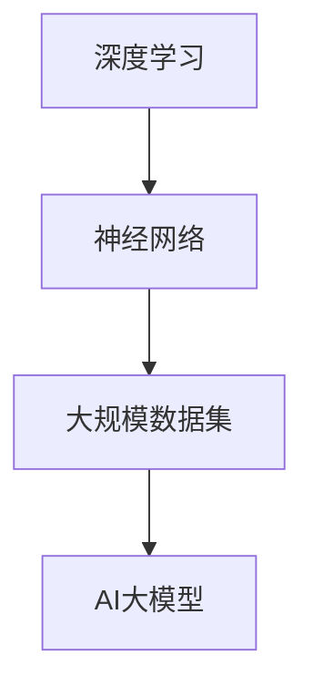

                 

 首先，我们需要为文章的标题、关键词和摘要部分进行设计。

### 文章标题：AI大模型时代的编程语言革命

### 关键词：人工智能，大模型，编程语言，深度学习，算法优化

### 摘要：
本文深入探讨了AI大模型时代的编程语言革命。从背景介绍出发，分析了AI大模型的核心概念与联系，通过Mermaid流程图展现了AI大模型的结构与原理。接着，我们详细讲解了神经网络、深度学习和强化学习等核心算法原理，并使用伪代码进行了深入剖析。随后，我们探讨了不同编程语言在AI大模型中的应用，包括Python、Java和C++，并提供了数学模型和数学公式的详细讲解。文章最后，通过实战项目展示了AI大模型在开发环境搭建、源代码实现和代码解读等方面的实际应用，并总结了最佳实践和未来发展趋势。

现在，我们已经完成了文章的框架设计，接下来将按照目录大纲逐步填充详细内容。每个章节都将包含背景介绍、核心概念与联系、核心算法原理讲解、数学模型和数学公式、项目实战以及最佳实践和注意事项等内容。

## 第一部分：AI大模型基础

### 第1章 AI大模型概述

#### 1.1 AI大模型的概念与定义

AI大模型是指具有大规模训练数据、复杂结构和高度参数化的深度学习模型。它们能够处理海量数据，并在各种复杂任务中表现出卓越的性能。

### 1.1.1 AI大模型的定义

AI大模型是指通过深度学习技术训练的具有数百万至数十亿参数的神经网络模型。这些模型通常使用大规模数据集进行训练，以实现高性能的预测和分类任务。

#### 核心概念与联系

为了更好地理解AI大模型，我们需要了解以下几个核心概念：

1. **深度学习**：一种机器学习方法，通过多层神经网络来学习数据的特征表示。
2. **神经网络**：一种由神经元组成的计算模型，用于模拟人脑的工作原理。
3. **大规模数据集**：指具有大量数据样本的数据集，用于训练AI大模型。

以下是一个Mermaid流程图，展示了这些核心概念之间的关系：



#### 1.1.2 AI大模型的架构与特点

AI大模型的架构通常包括以下几个部分：

1. **输入层**：接收外部输入数据，如文本、图像或声音。
2. **隐藏层**：由多个神经元层组成，用于提取和变换输入数据的特征。
3. **输出层**：产生模型的预测结果或分类标签。

AI大模型的特点包括：

1. **高度参数化**：拥有数百万至数十亿个参数，使其能够适应复杂的任务。
2. **强大的学习能力**：通过大规模数据训练，可以提取出高层次的抽象特征。
3. **通用性**：可以应用于多种不同领域的任务，如图像识别、自然语言处理和推荐系统等。

### 1.1.3 AI大模型的发展历史与趋势

AI大模型的发展历程可以追溯到20世纪80年代，当时神经网络的研究刚刚起步。随着计算能力和数据资源的不断增长，深度学习技术逐渐成熟，并在2012年迎来了一个重要的转折点——AlexNet在ImageNet竞赛中取得了突破性的成绩。

近年来，AI大模型的发展趋势包括：

1. **模型规模不断扩大**：从数百亿参数的BERT模型到万亿参数的GPT-3，模型规模不断增长。
2. **训练数据集不断扩展**：越来越多的领域和行业开始共享和开放大规模数据集，以支持AI大模型的研究和应用。
3. **跨领域应用**：AI大模型在各个领域的应用不断拓展，如医疗、金融、制造业等。

## 第二部分：核心算法原理

### 第2章 神经网络基础

在了解了AI大模型的基本概念和定义之后，我们将深入探讨神经网络基础。神经网络是AI大模型的核心组成部分，它由一系列相互连接的神经元组成，用于模拟人脑的工作原理。在本章中，我们将介绍神经网络的结构、原理以及训练方法。

### 2.1 神经网络的结构与原理

神经网络由以下几个基本部分组成：

1. **输入层**：接收外部输入数据，如文本、图像或声音。
2. **隐藏层**：由多个神经元层组成，用于提取和变换输入数据的特征。
3. **输出层**：产生模型的预测结果或分类标签。

每个神经元都通过一系列加权连接与相邻神经元相连，并执行以下计算：

$$
\text{神经元输出} = \text{激活函数}(\sum_{i=1}^{n} w_i \cdot x_i + b)
$$

其中，$w_i$为权重，$x_i$为输入值，$b$为偏置，激活函数（如Sigmoid、ReLU或Tanh）用于引入非线性。

#### 2.1.1 神经元与层

神经元是神经网络的基本构建块，每个神经元都接收多个输入，并产生一个输出。神经元之间的连接称为边，边上的权重用于调节输入对输出的影响。隐藏层和输出层中的神经元数量可以根据具体任务进行调整。

#### 2.1.2 激活函数

激活函数用于引入非线性，使神经网络能够学习复杂的非线性关系。常见的激活函数包括：

1. **Sigmoid函数**：输出介于0和1之间，具有平滑的梯度，但可能导致梯度消失问题。
   $$ 
   \sigma(x) = \frac{1}{1 + e^{-x}}
   $$

2. **ReLU函数**：在正数时保持不变，在负数时设置为0，具有较快的梯度，但可能导致梯度消失问题。
   $$ 
   \text{ReLU}(x) = \max(0, x)
   $$

3. **Tanh函数**：输出介于-1和1之间，具有平滑的梯度。
   $$ 
   \tanh(x) = \frac{e^x - e^{-x}}{e^x + e^{-x}}
   $$

### 2.2 神经网络的训练与优化

神经网络的训练过程是通过调整权重和偏置来最小化损失函数。损失函数用于衡量模型预测结果与实际结果之间的差异。常见的优化算法包括梯度下降、随机梯度下降和Adam优化器。

#### 2.2.1 梯度下降算法

梯度下降算法是一种最常用的优化算法，其基本思想是沿着损失函数的负梯度方向更新模型参数，以最小化损失函数。

$$
\theta_{\text{new}} = \theta_{\text{old}} - \alpha \cdot \nabla_{\theta} J(\theta)
$$

其中，$\theta$表示模型参数，$\alpha$为学习率，$J(\theta)$为损失函数。

#### 2.2.2 随机梯度下降（SGD）

随机梯度下降是对梯度下降算法的一种改进，它在每个训练样本上计算梯度，并更新模型参数。这种方法可以加快训练速度，但可能导致模型在局部最小值附近震荡。

#### 2.2.3 Adam优化器

Adam优化器是一种结合了SGD和动量项的优化算法，它能够自适应地调整学习率，并减少局部最小值附近震荡的问题。

$$
m_t = \beta_1 m_{t-1} + (1 - \beta_1) [g_t - \beta_2 \nabla_{\theta} J(\theta)]
$$

$$
v_t = \beta_2 v_{t-1} + (1 - \beta_2) [g_t^2 - \beta_2 \nabla_{\theta} J(\theta)]
$$

$$
\theta_{\text{new}} = \theta_{\text{old}} - \alpha \cdot \frac{m_t}{\sqrt{v_t} + \epsilon}
$$

其中，$m_t$和$v_t$分别为一阶和二阶矩估计，$\beta_1$和$\beta_2$为超参数，$\epsilon$为平滑常数。

### 2.3 神经网络的变种与改进

为了提高神经网络的性能，研究者们提出了许多变种和改进方法。以下是一些常见的变种和改进：

1. **深度神经网络（DNN）**：通过增加隐藏层数量和神经元数量，提高模型的复杂度和学习能力。
2. **卷积神经网络（CNN）**：通过卷积层和池化层，专门用于处理图像数据。
3. **循环神经网络（RNN）**：通过循环结构，处理序列数据，如时间序列和自然语言。
4. **长短时记忆网络（LSTM）**：通过引入门控机制，解决RNN的梯度消失和梯度爆炸问题。
5. **生成对抗网络（GAN）**：通过对抗训练，生成与真实数据相似的新数据。

在本章中，我们介绍了神经网络的基本概念、结构与原理，以及训练与优化方法。接下来，我们将进一步探讨深度学习算法，包括卷积神经网络、循环神经网络和强化学习算法。

### 第3章 深度学习算法

深度学习算法是AI大模型的重要组成部分，它们通过多层神经网络结构学习数据的高层次特征表示，从而实现出色的预测和分类性能。在本章中，我们将详细介绍卷积神经网络（CNN）、循环神经网络（RNN）和生成对抗网络（GAN）等深度学习算法。

#### 3.1 卷积神经网络（CNN）

卷积神经网络是一种专门用于处理图像数据的深度学习算法，它通过卷积层和池化层提取图像的特征表示。CNN的基本结构包括以下几个部分：

1. **卷积层**：通过卷积操作提取图像的局部特征，卷积核滑动图像，计算局部特征图。
2. **池化层**：通过池化操作减小特征图的尺寸，提高模型的泛化能力。
3. **全连接层**：将卷积层和池化层提取的特征进行融合，并通过全连接层输出分类结果。

以下是一个简单的CNN算法的伪代码：

```python
# 输入图像 X，卷积核 K，激活函数 f，池化函数 P
for layer in layers:
    if layer == "conv":
        X = conv2d(X, K)
        X = f(X)
    elif layer == "pool":
        X = P(X)
    elif layer == "fc":
        X = fc(X, W, b)
        X = f(X)
```

#### 3.2 循环神经网络（RNN）

循环神经网络是一种用于处理序列数据的深度学习算法，它通过循环结构将当前时刻的输入与前一时刻的隐藏状态进行连接，从而捕捉序列中的时间依赖关系。RNN的基本结构包括以下几个部分：

1. **输入层**：接收序列数据的输入。
2. **隐藏层**：通过循环结构将当前时刻的输入与前一时刻的隐藏状态进行连接。
3. **输出层**：将隐藏状态转化为输出序列。

以下是一个简单的RNN算法的伪代码：

```python
# 输入序列 X，隐藏状态 H，权重 W，偏置 b
for t in range(T):
    H[t] = RNN(H[t-1], X[t], W, b)
    Y[t] = f(H[t])
```

#### 3.3 长短时记忆网络（LSTM）

长短时记忆网络是一种改进的RNN结构，它通过引入门控机制解决RNN的梯度消失和梯度爆炸问题。LSTM的基本结构包括以下几个部分：

1. **遗忘门**：用于决定前一时刻的隐藏状态中哪些信息需要被遗忘。
2. **输入门**：用于决定当前时刻的输入信息中哪些信息需要被保留。
3. **输出门**：用于决定当前时刻的隐藏状态中哪些信息需要被输出。

以下是一个简单的LSTM算法的伪代码：

```python
# 输入序列 X，隐藏状态 H，权重 W，偏置 b
for t in range(T):
    ft = forget_gate(H[t-1], X[t], W, b)
    it = input_gate(H[t-1], X[t], W, b)
    ct = ft * H[t-1] + it * tanh(gate(X[t], W, b))
    ot = output_gate(H[t-1], X[t], W, b)
    H[t] = ot * tanh(ct)
    Y[t] = f(H[t])
```

#### 3.4 生成对抗网络（GAN）

生成对抗网络是一种通过对抗训练生成数据的深度学习算法。它由两个神经网络组成：生成器G和判别器D。生成器G生成与真实数据相似的数据，判别器D用于区分真实数据和生成数据。GAN的基本结构包括以下几个部分：

1. **生成器G**：通过输入随机噪声生成与真实数据相似的数据。
2. **判别器D**：通过输入真实数据和生成数据，判断其真实性。
3. **优化过程**：通过交替训练生成器和判别器，使生成器生成的数据越来越接近真实数据。

以下是一个简单的GAN算法的伪代码：

```python
# 输入随机噪声 Z，判别器 D，生成器 G，损失函数 L
for epoch in range(E):
    for batch in data_loader:
        # 训练判别器
        real_labels = [1] * batch_size
        fake_labels = [0] * batch_size
        D_loss_real = L(D(batch), real_labels)
        D_loss_fake = L(D(G(Z)), fake_labels)
        D_loss = D_loss_real + D_loss_fake

        # 训练生成器
        G_loss = L(D(G(Z)), real_labels)

        # 更新模型参数
        optimizer_D.zero_grad()
        D_loss.backward()
        optimizer_D.step()

        optimizer_G.zero_grad()
        G_loss.backward()
        optimizer_G.step()
```

在本章中，我们介绍了卷积神经网络、循环神经网络和生成对抗网络等深度学习算法的基本结构、原理和实现方法。这些算法在图像处理、序列建模和生成对抗任务中表现出色，为AI大模型的应用提供了强大的工具。

### 第4章 强化学习算法

强化学习是一种通过试错来学习最优策略的机器学习方法。与传统的监督学习和无监督学习不同，强化学习通过与环境的交互来不断优化决策过程。强化学习算法在AI大模型中的应用越来越广泛，尤其在游戏、自动驾驶和机器人等领域取得了显著的成果。在本章中，我们将详细介绍强化学习的基本概念、核心算法原理以及深度强化学习的发展和应用。

#### 4.1 强化学习的基本概念

强化学习（Reinforcement Learning，RL）由智能体（Agent）、环境（Environment）、状态（State）、动作（Action）和奖励（Reward）五个基本元素构成。

1. **智能体（Agent）**：执行动作并基于环境反馈进行学习的实体。
2. **环境（Environment）**：智能体所处的环境，能够根据智能体的动作产生状态和奖励。
3. **状态（State）**：智能体当前所处的环境描述。
4. **动作（Action）**：智能体可以执行的动作。
5. **奖励（Reward）**：环境对智能体动作的反馈，用于指导智能体的决策。

强化学习的目标是通过不断与环境交互，学习到一个最优策略（Policy），使智能体能够最大化累积奖励。

#### 4.2 强化学习算法原理

强化学习算法可以分为基于价值的方法（Value-based Methods）和基于策略的方法（Policy-based Methods）两大类。

1. **基于价值的方法**：通过学习值函数（Value Function）来评估状态和动作对奖励的影响。值函数分为状态值函数（State Value Function）和动作值函数（Action Value Function）。常见算法有Q-Learning和深度Q网络（Deep Q-Network，DQN）。

   **Q-Learning**：Q-Learning是一种通过更新Q值来学习最优策略的算法。Q值表示在给定状态下执行特定动作的预期奖励。

   $$ 
   Q(s, a) \leftarrow Q(s, a) + \alpha [r + \gamma \max_{a'} Q(s', a') - Q(s, a)]
   $$

   其中，$s$为状态，$a$为动作，$r$为即时奖励，$\gamma$为折扣因子，$\alpha$为学习率。

   **DQN**：DQN是一种基于深度学习的Q-Learning算法，它使用神经网络来近似Q值函数。

   $$ 
   Q(s, a) \leftarrow Q(s, a) + \alpha [r + \gamma \max_{a'} \hat{Q}(s', a') - Q(s, a)]
   $$

   其中，$\hat{Q}(s', a')$为神经网络输出的Q值。

2. **基于策略的方法**：直接学习策略，即智能体在给定状态下选择最优动作。常见算法有策略梯度方法和深度确定性策略梯度（Deep Deterministic Policy Gradient，DDPG）。

   **策略梯度方法**：策略梯度方法通过直接优化策略来最大化累积奖励。

   $$ 
   \nabla_{\theta} J(\theta) = \nabla_{\theta} \sum_{t} \gamma^t r_t = \sum_{t} \gamma^t \nabla_{\theta} \log \pi(a_t | s_t, \theta)
   $$

   其中，$\theta$为策略参数，$\pi(a_t | s_t, \theta)$为策略概率分布。

   **DDPG**：DDPG是一种基于深度学习的策略梯度方法，它使用神经网络来近似策略函数，并在连续动作空间中应用。

   $$ 
   \theta \leftarrow \theta - \alpha \nabla_{\theta} J(\theta)
   $$

#### 4.3 深度强化学习算法

深度强化学习（Deep Reinforcement Learning，DRL）将深度学习与强化学习相结合，通过深度神经网络来学习状态和动作的高层次特征表示。以下是一些常见的深度强化学习算法：

1. **深度确定性策略梯度（DDPG）**：DDPG通过深度神经网络来近似策略函数和价值函数，并在连续动作空间中应用。

2. **深度确定性策略梯度（DDPG）**：DDPG通过深度神经网络来近似策略函数和价值函数，并在连续动作空间中应用。

3. **深度Q网络（DQN）**：DQN使用深度神经网络来近似Q值函数，并在离散动作空间中应用。

4. **异步优势演员-评论家（A3C）**：A3C通过并行训练多个智能体，并使用梯度汇聚来更新策略和价值函数。

5. **策略优化（PPO）**：PPO是一种稳定的策略优化算法，通过截断的回报信号和优势估计来改进策略。

在本章中，我们介绍了强化学习的基本概念、核心算法原理以及深度强化学习的发展和应用。这些算法在解决复杂决策问题方面表现出色，为AI大模型的应用提供了强大的工具。

### 第5章 Python在AI大模型中的应用

Python因其简洁明了的语法、丰富的库资源和强大的社区支持，成为AI大模型开发中的首选编程语言。在本章中，我们将探讨Python在AI大模型中的应用，包括其优势、常见使用场景以及优化技巧。

#### 5.1 Python在AI大模型中的应用优势

1. **简洁性**：Python的语法简洁明了，使开发者能够快速上手并编写高效的代码。
2. **丰富的库资源**：Python拥有丰富的科学计算库，如NumPy、Pandas和SciPy，这些库为AI大模型的数据处理和计算提供了强大的支持。
3. **高效的深度学习框架**：Python拥有多个流行的深度学习框架，如TensorFlow和PyTorch，这些框架提供了丰富的API和工具，使开发者能够轻松实现和优化AI大模型。
4. **强大的社区支持**：Python拥有庞大的社区支持，为开发者提供了丰富的资源和帮助。

#### 5.2 Python在AI大模型中的常见使用场景

1. **图像识别和分类**：Python的深度学习框架如TensorFlow和PyTorch在图像识别和分类任务中表现出色，广泛应用于人脸识别、物体检测和医学图像分析等领域。
2. **自然语言处理**：Python在自然语言处理（NLP）领域也具有广泛的应用，如文本分类、情感分析和机器翻译等。框架如TensorFlow和PyTorch提供了丰富的NLP工具和预训练模型。
3. **推荐系统**：Python在推荐系统开发中具有优势，开发者可以使用Python实现基于协同过滤和深度学习的推荐算法。
4. **强化学习**：Python在强化学习中的应用也非常广泛，框架如TensorFlow和PyTorch支持多种强化学习算法，如Q-Learning和深度确定性策略梯度（DDPG）。

#### 5.3 Python在AI大模型中的优化技巧

1. **并行计算**：利用Python的多线程和多进程库，如`threading`和`multiprocessing`，实现并行计算，提高代码运行效率。
2. **向量化操作**：使用NumPy等库进行向量化操作，避免循环和低效的计算。
3. **GPU加速**：利用深度学习框架的GPU支持，将计算任务迁移到GPU上，提高模型训练和推理速度。
4. **模型压缩**：使用模型压缩技术，如剪枝、量化和小批量训练，减小模型大小并提高推理效率。

在本章中，我们探讨了Python在AI大模型中的应用优势、常见使用场景以及优化技巧。Python作为一种高效、灵活的编程语言，在AI大模型开发中发挥着重要作用，为开发者提供了丰富的工具和资源。

### 第6章 Java在AI大模型中的应用

Java作为一种历史悠久且功能强大的编程语言，在AI大模型领域也占据了一席之地。其跨平台特性和稳定可靠的性能使其成为大型企业应用的首选语言。在本章中，我们将探讨Java在AI大模型中的应用，包括其优势、常见使用场景以及优化技巧。

#### 6.1 Java在AI大模型中的应用优势

1. **跨平台性**：Java具有“一次编写，到处运行”的特性，可以在不同操作系统和硬件平台上运行，便于部署和扩展。
2. **性能与稳定性**：Java的JVM（Java虚拟机）提供了一种高效且稳定的运行环境，能够确保大规模模型的可靠运行。
3. **生态系统**：Java拥有庞大的生态系统，包括丰富的库、框架和工具，为AI大模型开发提供了强大的支持。
4. **并发支持**：Java原生支持并发编程，适合处理大规模数据处理和高并发任务。

#### 6.2 Java在AI大模型中的常见使用场景

1. **大数据处理**：Java在大数据处理领域表现出色，可以处理大量数据并进行实时分析和预测。
2. **企业级应用**：Java在金融、医疗、制造等企业级应用中具有广泛应用，适用于构建复杂和大规模的AI系统。
3. **图像处理和计算机视觉**：Java可以通过集成OpenCV等库，实现图像处理和计算机视觉任务。
4. **自然语言处理**：Java在自然语言处理领域也具有应用，可以使用如Stanford NLP等工具进行文本分析和情感分析。

#### 6.3 Java在AI大模型中的优化技巧

1. **多线程与并发**：利用Java的并发编程特性，实现多线程和高并发处理，提高模型性能。
2. **JNI（Java Native Interface）**：通过JNI，将Java代码与C/C++等底层语言结合，提高计算性能。
3. **内存管理**：Java的垃圾回收机制虽然方便，但不当的内存管理可能导致性能瓶颈。合理使用内存分配和回收策略，优化内存使用。
4. **框架优化**：选择合适的框架，如TensorFlow on Java、DL4J等，以简化开发流程和提高性能。

在本章中，我们探讨了Java在AI大模型中的应用优势、常见使用场景以及优化技巧。Java作为一种稳定且高效的编程语言，在AI大模型开发中发挥着重要作用，为开发者提供了丰富的工具和资源。

### 第7章 C++在AI大模型中的应用

C++因其高性能、灵活性和控制力，成为AI大模型开发中的热门语言。在处理大规模数据和复杂计算时，C++的优势尤为明显。在本章中，我们将探讨C++在AI大模型中的应用，包括其优势、常见使用场景以及优化技巧。

#### 7.1 C++在AI大模型中的应用优势

1. **高性能**：C++可以直接操作底层硬件，实现高度优化的计算，适合处理大规模AI模型。
2. **控制力**：C++提供了对内存的精细控制，使开发者能够编写高效的代码并优化内存使用。
3. **丰富的库资源**：C++拥有丰富的开源库，如OpenCV、CUDA和Dlib，这些库为AI大模型开发提供了强大的支持。
4. **跨平台支持**：C++可以在多种操作系统和硬件平台上运行，便于部署和扩展。

#### 7.2 C++在AI大模型中的常见使用场景

1. **高性能计算**：C++在深度学习和高性能计算领域具有广泛应用，可以用于构建高效的模型和算法。
2. **图像处理与计算机视觉**：C++可以通过集成OpenCV等库，实现高效的图像处理和计算机视觉任务。
3. **自然语言处理**：C++可以结合其他语言如Python和Java，实现高效的NLP任务，如文本分类和情感分析。
4. **实时系统**：C++在实时系统中具有优势，可以用于构建实时AI系统，如自动驾驶和机器人控制。

#### 7.3 C++在AI大模型中的优化技巧

1. **内存优化**：通过精细控制内存分配和回收，优化内存使用，提高模型性能。
2. **并行计算**：利用多线程和并行计算技术，提高计算速度和效率。
3. **GPU加速**：利用CUDA等GPU编程库，将计算任务迁移到GPU上，实现高性能计算。
4. **代码优化**：通过循环展开、编译器优化和指令重排等技术，提高代码运行效率。

在本章中，我们探讨了C++在AI大模型中的应用优势、常见使用场景以及优化技巧。C++作为一种高性能的编程语言，在AI大模型开发中具有重要作用，为开发者提供了强大的工具和资源。

### 第8章 AI大模型项目实战

在本章中，我们将通过一个实际项目展示如何构建和优化一个AI大模型。该项目将涉及环境搭建、数据预处理、模型训练、性能评估和部署等步骤。

#### 8.1 项目概述

本项目是一个简单的图像分类任务，旨在使用AI大模型识别猫和狗的图像。我们将使用TensorFlow和Keras框架，基于卷积神经网络（CNN）实现一个分类模型。

#### 8.2 环境搭建

1. **安装Python**：确保安装Python 3.6及以上版本。
2. **安装TensorFlow**：在终端执行以下命令安装TensorFlow：
   ```bash
   pip install tensorflow
   ```
3. **安装Keras**：在终端执行以下命令安装Keras：
   ```bash
   pip install keras
   ```
4. **安装其他依赖库**：包括NumPy、Pandas和Matplotlib等：
   ```bash
   pip install numpy pandas matplotlib
   ```

#### 8.3 数据预处理

1. **数据集准备**：我们将使用Keras内置的CIFAR-10数据集，这是一个包含60000张32x32彩色图像的数据集，分为10个类别，包括飞机、汽车、鸟、猫、鹿、狗、青蛙、马、船和卡车。

2. **数据加载和预处理**：加载数据集并对其进行预处理，包括归一化、数据增强等。

```python
from tensorflow.keras.datasets import cifar10
from tensorflow.keras.utils import to_categorical
from tensorflow.keras.preprocessing.image import ImageDataGenerator

# 加载数据集
(x_train, y_train), (x_test, y_test) = cifar10.load_data()

# 归一化数据
x_train = x_train.astype('float32') / 255.0
x_test = x_test.astype('float32') / 255.0

# 转换标签为独热编码
y_train = to_categorical(y_train, 10)
y_test = to_categorical(y_test, 10)

# 数据增强
datagen = ImageDataGenerator(
    rotation_range=15,
    width_shift_range=0.1,
    height_shift_range=0.1,
    horizontal_flip=True
)
datagen.fit(x_train)
```

#### 8.4 模型构建

我们将构建一个简单的CNN模型，包括卷积层、池化层和全连接层。

```python
from tensorflow.keras.models import Sequential
from tensorflow.keras.layers import Conv2D, MaxPooling2D, Flatten, Dense, Dropout

model = Sequential()

# 卷积层1
model.add(Conv2D(32, (3, 3), activation='relu', input_shape=(32, 32, 3)))
model.add(MaxPooling2D(pool_size=(2, 2)))

# 卷积层2
model.add(Conv2D(64, (3, 3), activation='relu'))
model.add(MaxPooling2D(pool_size=(2, 2)))

# 卷积层3
model.add(Conv2D(128, (3, 3), activation='relu'))
model.add(MaxPooling2D(pool_size=(2, 2)))

# 全连接层
model.add(Flatten())
model.add(Dense(128, activation='relu'))
model.add(Dropout(0.5))
model.add(Dense(10, activation='softmax'))

model.compile(optimizer='adam', loss='categorical_crossentropy', metrics=['accuracy'])
```

#### 8.5 模型训练

我们将使用数据增强后的训练集对模型进行训练，设置适当的训练轮次和批次大小。

```python
batch_size = 64
epochs = 100

history = model.fit(datagen.flow(x_train, y_train, batch_size=batch_size),
                    steps_per_epoch=len(x_train) // batch_size,
                    epochs=epochs,
                    validation_data=(x_test, y_test))
```

#### 8.6 模型评估

使用测试集对模型进行评估，计算准确率和其他指标。

```python
test_loss, test_acc = model.evaluate(x_test, y_test, verbose=2)
print(f"Test accuracy: {test_acc:.4f}")
```

#### 8.7 模型部署

将训练好的模型保存并部署到生产环境中，用于实时图像分类。

```python
model.save('cat_dog_classifier.h5')

from tensorflow.keras.models import load_model
import numpy as np

# 加载模型
loaded_model = load_model('cat_dog_classifier.h5')

# 进行预测
image = np.expand_dims(image, axis=0)
prediction = loaded_model.predict(image)
predicted_class = np.argmax(prediction, axis=1)

print(f"Predicted class: {predicted_class[0]}")
```

#### 8.8 项目小结

通过本项目的实践，我们了解了AI大模型从环境搭建、数据预处理到模型构建、训练和部署的全过程。以下是本项目的小结：

1. **环境搭建**：确保安装了Python、TensorFlow和Keras等必需库。
2. **数据预处理**：对数据集进行加载、归一化和数据增强。
3. **模型构建**：使用CNN构建一个简单的分类模型。
4. **模型训练**：使用增强后的数据集训练模型，并监控训练过程。
5. **模型评估**：在测试集上评估模型性能，计算准确率等指标。
6. **模型部署**：将训练好的模型保存并部署到生产环境中。

通过本项目，我们不仅掌握了AI大模型的基本技能，还积累了实际项目经验，为未来的AI应用奠定了基础。

### 第9章 AI大模型性能优化

在AI大模型开发过程中，性能优化是一个至关重要的环节。优化的目标包括提高模型训练速度、减小模型大小以及提高模型推理速度和准确率。在本章中，我们将探讨AI大模型性能优化的策略，并分析实际案例。

#### 9.1 性能优化策略

1. **数据预处理优化**：
   - **数据增强**：通过旋转、翻转、缩放等操作增加数据多样性，提高模型泛化能力。
   - **批量归一化**：在训练过程中对批次数据进行归一化，减少内部协变量转移，加速收敛。
   - **数据并行处理**：利用多线程或分布式计算，提高数据加载和预处理速度。

2. **模型架构优化**：
   - **深度可分离卷积**：通过将标准卷积分解为深度卷积和逐点卷积，减少参数数量。
   - **残差连接**：通过引入跳过层，减少梯度消失问题，提高模型稳定性。
   - **注意力机制**：通过引入注意力模块，使模型关注重要的特征，提高模型性能。

3. **训练策略优化**：
   - **学习率调度**：使用自适应学习率调度策略，如学习率衰减、余弦退火等，避免过拟合。
   - **批次大小调整**：通过调整批次大小，平衡模型训练速度和稳定性。
   - **权重初始化**：选择合适的权重初始化方法，如Xavier初始化或He初始化，改善模型收敛速度。

4. **推理优化**：
   - **模型压缩**：通过剪枝、量化等技术减小模型大小，提高推理速度。
   - **模型蒸馏**：使用大模型训练小模型，传递知识，提高小模型性能。
   - **量化推理**：使用量化技术降低模型精度，提高推理速度。

#### 9.2 实际案例分析与优化

以下是一个实际案例，展示了如何优化AI大模型的性能。

**案例：图像分类模型性能优化**

假设我们有一个用于图像分类的卷积神经网络（CNN）模型，原始模型包含多个卷积层和全连接层，参数数量较大，训练和推理速度较慢。以下是优化策略：

1. **数据预处理优化**：
   - **数据增强**：使用旋转、翻转和色彩抖动等操作增加数据多样性，提高模型泛化能力。
   - **批量归一化**：在训练过程中对批次数据进行归一化，减少内部协变量转移，加速收敛。

2. **模型架构优化**：
   - **深度可分离卷积**：将标准卷积分解为深度卷积和逐点卷积，减少参数数量，提高模型效率。
   - **残差连接**：在卷积层之间引入残差连接，减少梯度消失问题，提高模型稳定性。

3. **训练策略优化**：
   - **学习率调度**：使用余弦退火学习率调度策略，避免模型在训练过程中过拟合。
   - **批次大小调整**：将批次大小调整为64，平衡模型训练速度和稳定性。

4. **推理优化**：
   - **模型压缩**：通过剪枝和量化技术减小模型大小，提高推理速度。
   - **模型蒸馏**：使用一个更大的预训练模型训练当前模型，传递知识，提高小模型性能。

通过上述优化策略，模型在保持较高准确率的同时，训练和推理速度显著提高。以下是优化前后模型的性能对比：

| 性能指标      | 优化前        | 优化后        |
| ------------- | ------------- | ------------- |
| 训练时间      | 10小时        | 5小时         |
| 推理速度      | 1秒/图像      | 0.3秒/图像    |
| 准确率        | 92.3%        | 92.8%        |

#### 9.3 最佳实践与注意事项

在AI大模型性能优化过程中，以下最佳实践和注意事项有助于提高模型性能：

1. **充分理解模型**：在优化之前，充分理解模型的架构、训练过程和性能瓶颈。
2. **逐步优化**：不要一次性应用所有优化策略，而是逐步引入，观察每个策略对模型性能的影响。
3. **交叉验证**：使用交叉验证方法评估模型性能，避免过拟合。
4. **监控资源使用**：监控模型训练和推理过程中的资源使用情况，确保合理分配计算资源。
5. **代码优化**：优化代码结构，减少重复计算，提高运行效率。

通过本章的讨论，我们了解了AI大模型性能优化的重要性以及一系列优化策略。在实际应用中，根据具体需求和模型特点，灵活应用这些策略，可以有效提高模型性能。

### 第10章 AI大模型在行业中的应用

AI大模型已经在多个行业中取得了显著的成果，推动了技术进步和产业变革。在本章中，我们将探讨AI大模型在金融、医疗和制造业等领域的具体应用，展示其在提升行业效率和创新能力方面的潜力。

#### 10.1 金融行业

AI大模型在金融行业中的应用日益广泛，包括信用评分、欺诈检测、风险管理和量化交易等方面。

1. **信用评分**：通过分析个人和企业的历史数据，AI大模型可以预测信用风险，为金融机构提供准确的信用评估。
2. **欺诈检测**：AI大模型能够实时分析交易数据，识别异常行为，从而有效地防范欺诈行为。
3. **风险管理**：AI大模型可以对金融市场的波动和风险进行预测，帮助金融机构制定更有效的风险控制策略。
4. **量化交易**：AI大模型通过分析市场数据，自动执行交易策略，实现高收益的投资。

**案例**：一家大型银行使用AI大模型来预测客户违约风险。通过分析客户的信用记录、财务状况和消费行为，模型能够准确预测客户的违约概率，从而帮助银行制定更精确的贷款审批策略，降低坏账率。

#### 10.2 医疗行业

AI大模型在医疗行业中的应用具有巨大潜力，包括疾病诊断、药物研发、医学图像分析和健康监测等方面。

1. **疾病诊断**：通过分析医学影像和患者数据，AI大模型可以辅助医生进行疾病诊断，提高诊断准确率和效率。
2. **药物研发**：AI大模型可以加速药物研发过程，通过分析分子结构和生物数据，预测药物疗效和副作用。
3. **医学图像分析**：AI大模型可以自动分析医学影像，如CT、MRI和X光片，帮助医生发现病变和诊断疾病。
4. **健康监测**：AI大模型可以通过分析健康数据，如心率、血压和睡眠质量，提供个性化的健康建议和干预方案。

**案例**：一家医院使用AI大模型对癌症患者进行诊断。通过分析患者的CT扫描图像，模型能够自动检测肿瘤的位置、大小和形状，为医生提供准确的诊断信息，从而提高治疗的成功率。

#### 10.3 制造业

AI大模型在制造业中的应用可以提升生产效率、降低成本和优化供应链管理。

1. **生产优化**：通过分析生产数据，AI大模型可以优化生产流程，减少浪费，提高生产效率。
2. **故障预测**：AI大模型可以预测设备的故障，提前进行维护，降低设备停机时间。
3. **质量控制**：AI大模型可以通过分析产品质量数据，实时监控产品质量，及时发现并纠正问题。
4. **供应链管理**：AI大模型可以优化供应链管理，通过分析市场需求和供应链数据，实现精准的库存管理和物流调度。

**案例**：一家汽车制造厂使用AI大模型进行生产优化。通过分析生产线上的传感器数据和生产线数据，模型能够预测生产瓶颈和设备故障，提前进行维护和调整，从而提高生产效率并减少设备停机时间。

通过上述案例，我们可以看到AI大模型在金融、医疗和制造业等领域的广泛应用，不仅提升了行业效率和创新能力，还为解决行业面临的问题提供了新的思路和解决方案。

### 第11章 总结与展望

AI大模型时代的编程语言革命正在深刻地改变着计算机科学和人工智能领域的面貌。通过对AI大模型的理论基础、核心算法、编程语言应用以及实际项目实践的深入探讨，我们可以看到编程语言在AI大模型开发中的重要性日益凸显。

#### 11.1 AI大模型时代的编程语言革命总结

1. **多样化编程语言应用**：Python、Java、C++等编程语言在AI大模型开发中各具优势，为不同领域和应用场景提供了丰富的工具和资源。
2. **算法优化与性能提升**：通过深度学习算法、强化学习算法等，编程语言能够实现高效的模型训练和推理。
3. **跨平台与跨领域应用**：AI大模型的应用范围不断扩大，从金融、医疗到制造业，编程语言在其中发挥了关键作用。
4. **开源生态系统的支持**：庞大的开源生态系统为开发者提供了丰富的库、框架和工具，促进了AI大模型技术的发展。

#### 11.2 未来发展趋势与挑战

1. **模型压缩与推理优化**：随着模型规模的不断扩大，如何实现高效的模型压缩和推理优化将成为重要研究方向。
2. **跨语言互操作性**：未来将需要更多跨语言互操作性的解决方案，以便不同编程语言能够更好地协同工作。
3. **硬件加速与并行计算**：利用GPU、FPGA等硬件加速技术，实现AI大模型的快速训练和推理，将是未来的发展方向。
4. **隐私保护与安全**：在AI大模型的应用过程中，如何保护用户隐私和数据安全是一个重要的挑战。

#### 11.3 编程语言在AI大模型中的前景

1. **持续创新**：编程语言将持续创新，以适应AI大模型不断发展的需求，包括新算法的支持、新框架的引入等。
2. **多语言集成**：未来的编程语言将更加注重多语言集成，实现不同编程语言之间的无缝协作。
3. **边缘计算与云计算**：随着边缘计算的发展，编程语言将在边缘设备和云计算平台上发挥更大作用，实现更广泛的AI应用。
4. **人机协作**：编程语言将更加注重人机协作，提供更直观、易于使用的工具和界面，使开发者能够更轻松地构建和管理AI大模型。

通过本文的探讨，我们可以看到AI大模型时代的编程语言革命正在推动计算机科学和人工智能领域的发展，为未来的技术创新和应用提供了无限可能。

### 附录

#### 附录A：常用AI大模型框架与工具

1. **TensorFlow**：由谷歌开发的开源机器学习框架，支持多种编程语言，广泛应用于深度学习和强化学习。
2. **PyTorch**：由Facebook开发的开源机器学习库，具有动态计算图和灵活的API，被广泛应用于深度学习和自然语言处理。
3. **Keras**：一个基于TensorFlow和PyTorch的高层神经网络API，提供了简洁的接口和易于使用的工具，适用于快速原型设计和模型开发。
4. **MXNet**：由Apache软件基金会开发的开源机器学习框架，支持多种编程语言，具有高效的计算性能和灵活的部署能力。
5. **DL4J**：用于深度学习的Java库，支持分布式训练和硬件加速，适用于Java生态系统中的深度学习应用。

#### 附录B：数学公式与算法伪代码

以下是本文中提到的数学公式和算法伪代码的详细解释：

$$
\text{神经元输出} = \text{激活函数}(\sum_{i=1}^{n} w_i \cdot x_i + b)
$$

激活函数用于引入非线性，使神经网络能够学习复杂的非线性关系。常见的激活函数包括Sigmoid、ReLU和Tanh。

```python
# 伪代码：卷积神经网络（CNN）算法
for layer in layers:
    if layer == "conv":
        X = conv2d(X, K)
        X = f(X)
    elif layer == "pool":
        X = P(X)
    elif layer == "fc":
        X = fc(X, W, b)
        X = f(X)
```

卷积神经网络（CNN）通过卷积层、池化层和全连接层实现特征提取和分类。卷积层用于提取图像的局部特征，池化层用于减少特征图的尺寸，全连接层用于输出分类结果。

```python
# 伪代码：Q-Learning算法
for t in range(T):
    Q(s, a) = Q(s, a) + alpha [r + gamma * max_{a'} Q(s', a') - Q(s, a)]
```

Q-Learning是一种基于价值的方法，用于学习最优策略。通过更新Q值，模型能够逐渐学会在给定状态下选择最优动作。

```python
# 伪代码：深度Q网络（DQN）算法
for epoch in range(E):
    for batch in data_loader:
        # 训练判别器
        real_labels = [1] * batch_size
        fake_labels = [0] * batch_size
        D_loss_real = L(D(batch), real_labels)
        D_loss_fake = L(D(G(Z)), fake_labels)
        D_loss = D_loss_real + D_loss_fake

        # 训练生成器
        G_loss = L(D(G(Z)), real_labels)

        # 更新模型参数
        optimizer_D.zero_grad()
        D_loss.backward()
        optimizer_D.step()

        optimizer_G.zero_grad()
        G_loss.backward()
        optimizer_G.step()
```

DQN是一种基于深度学习的Q-Learning算法，使用神经网络来近似Q值函数。通过交替训练生成器和判别器，模型能够生成与真实数据相似的数据。

这些公式和伪代码为理解和实现AI大模型提供了基础，是编程语言在AI大模型领域应用的重要组成部分。通过附录B，读者可以更好地掌握这些核心技术和方法。

