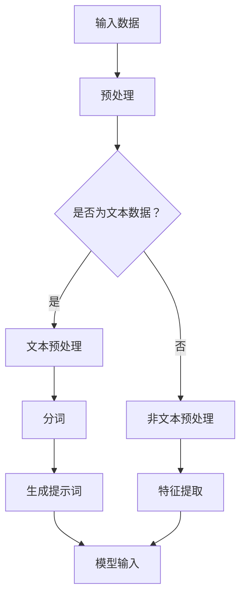

                 


### 文章标题
《AI大模型的上下文感知提示词设计》

### 关键词
AI大模型，上下文感知提示词，深度学习，提示词设计原理，数学模型，项目实战，开发环境

### 摘要
本文深入探讨了AI大模型中上下文感知提示词的设计原理、核心算法和实现方法。通过详细的背景介绍、核心概念联系、数学模型讲解、项目实战与分析，帮助读者全面理解上下文感知提示词在AI大模型中的重要性，以及如何设计和优化这些提示词，以提高模型的性能和应用效果。

## 引言与背景介绍

### 1.1 书籍的目的与意义

在人工智能领域，大模型的应用越来越广泛，如图灵奖获得者Geoffrey Hinton提出的Transformer模型在自然语言处理（NLP）领域取得了显著的成功。然而，这些大模型的性能高度依赖于输入的数据和上下文信息。为了更好地利用这些信息，上下文感知提示词的设计变得至关重要。

本章节的目标是深入探讨AI大模型中上下文感知提示词的设计原理、核心算法和实现方法，帮助读者全面理解上下文感知提示词在AI大模型中的重要性，以及如何设计和优化这些提示词，以提高模型的性能和应用效果。

### 1.2 AI大模型的发展历程

AI大模型的发展可以追溯到上世纪80年代，当时的深度学习还处于萌芽阶段。然而，随着计算能力的提升和大数据的积累，深度学习开始蓬勃发展，特别是在2012年，AlexNet在ImageNet竞赛中取得了突破性的成绩，这标志着深度学习时代的到来。

自那时以来，AI大模型的发展经历了多个里程碑，从早期的卷积神经网络（CNN）到递归神经网络（RNN）和长短期记忆网络（LSTM），再到最近的Transformer模型。这些模型的出现不仅推动了AI技术的进步，也为AI大模型的研究和应用奠定了坚实的基础。

### 1.3 上下文感知提示词的定义与分类

上下文感知提示词是指在AI大模型中，用于引导模型理解输入数据的上下文信息的词或短语。这些提示词可以帮助模型更好地处理复杂的输入数据，提高模型的性能和应用效果。

根据功能和应用场景的不同，上下文感知提示词可以分为以下几类：

1. **语义引导提示词**：这类提示词主要用于引导模型理解输入数据的语义信息，如名词、动词、形容词等。例如，在文本分类任务中，可以使用“这是关于什么主题的？”这样的提示词来引导模型关注文本的主题。

2. **上下文引导提示词**：这类提示词主要用于引导模型理解输入数据的上下文信息，如时间、地点、情境等。例如，在问答系统中，可以使用“这个问题是关于什么时候的？”这样的提示词来引导模型关注问题的时间背景。

3. **目标引导提示词**：这类提示词主要用于引导模型关注输入数据中的特定目标，如目标检测任务中的目标框、文本生成任务中的关键词等。

通过对上下文感知提示词的分类，我们可以更好地理解其在AI大模型中的应用价值，并针对性地进行设计和优化。

## 核心概念与联系

### 2.1 AI大模型的核心概念

AI大模型是指具有强大计算能力和海量参数的深度学习模型。其核心概念包括：

1. **模型架构**：AI大模型通常采用复杂的神经网络架构，如Transformer、BERT等，这些架构能够处理大规模的数据并提取丰富的特征。

2. **数据处理流程**：AI大模型的数据处理流程包括数据预处理、特征提取、模型训练和评估等步骤。这些流程对于模型的性能至关重要。

3. **训练与优化**：AI大模型的训练过程是一个优化过程，通过调整模型的参数来最小化损失函数，以提高模型的预测能力。

4. **模型评估与调优**：模型评估是评估模型性能的重要手段，通过评估指标如准确率、召回率等来评估模型的性能，并根据评估结果进行模型调优。

### 2.2 提示词设计的核心概念

提示词设计的核心概念包括：

1. **提示词的功能**：提示词的主要功能是引导模型关注输入数据的特定方面，如语义、上下文或目标等。

2. **提示词的设计原则**：提示词的设计应遵循可扩展性、可理解性和适应性等原则，以保证提示词的实用性。

3. **提示词与上下文的关系**：提示词与上下文的关系决定了提示词的有效性，良好的提示词设计应能够充分利用上下文信息，提高模型的性能。

### 2.3 上下文感知提示词的Mermaid流程图

为了更好地理解上下文感知提示词的设计过程，我们可以使用Mermaid流程图来表示。以下是一个简化的上下文感知提示词生成流程：



在这个流程中，输入数据首先经过预处理，然后根据数据类型进行分词或非文本预处理。接着，生成提示词并作为模型输入，通过训练和优化，最终得到一个性能良好的AI大模型。

## 上下文感知提示词设计原理

### 3.1 上下文感知提示词的设计原则

设计上下文感知提示词时，应遵循以下原则：

1. **可扩展性**：提示词应能够适应不同类型的数据和应用场景，以便在多种场景下保持其有效性。

2. **可理解性**：提示词应易于理解和解释，以便研究人员和开发人员能够更好地理解和优化模型。

3. **适应性**：提示词应能够根据不同的上下文信息进行调整，以最大化模型的性能和应用效果。

4. **实时性**：在实时应用场景中，提示词的生成和更新速度应足够快，以满足实时数据处理的需求。

### 3.2 提示词生成算法

提示词生成算法可以分为以下几类：

1. **基于规则的方法**：这类方法通过定义一系列规则来生成提示词，如基于关键词匹配、语法分析等。这种方法简单易懂，但灵活性和适应性较低。

2. **基于机器学习的方法**：这类方法使用机器学习算法，如决策树、支持向量机等，来生成提示词。这种方法具有较高的灵活性和适应性，但需要对数据进行充分的特征工程。

3. **基于深度学习的方法**：这类方法使用深度学习模型，如卷积神经网络（CNN）、递归神经网络（RNN）等，来生成提示词。这种方法能够处理复杂的数据和上下文信息，但训练过程较为复杂。

### 3.3 提示词优化策略

为了提高提示词的生成质量和模型的性能，可以采用以下优化策略：

1. **提高准确率**：通过优化提示词生成算法，提高提示词的准确性，从而提高模型的性能。

2. **减少冗余**：通过分析提示词的冗余度，去除不必要的提示词，以提高模型的效率。

3. **增强灵活性**：通过调整提示词生成算法的参数，增强提示词的灵活性，使其能够适应不同的应用场景。

4. **实时性优化**：通过优化提示词生成算法的实时性，提高模型的响应速度。

## 核心算法原理讲解

### 4.1 深度学习基础算法

深度学习基础算法包括：

1. **卷积神经网络（CNN）**：用于处理图像数据，能够提取图像的层次特征。

2. **递归神经网络（RNN）**：用于处理序列数据，能够捕捉序列中的时间依赖关系。

3. **长短期记忆网络（LSTM）**：是RNN的一种变体，能够更好地处理长序列数据。

### 4.2 上下文感知提示词生成算法

上下文感知提示词生成算法包括：

1. **生成对抗网络（GAN）**：用于生成高质量的提示词，通过对抗训练实现。

2. **自动编码器（AE）**：用于学习输入数据的特征表示，用于生成提示词。

3. **序列到序列（S2S）模型**：用于将输入序列转换为输出序列，生成提示词。

### 4.3 算法伪代码展示

以下是一个基于RNN的上下文感知提示词生成算法的伪代码：

```python
function generate_prompt_word(input_sequence):
    # 初始化RNN模型
    model = RNN_model()
    # 训练模型
    model.train(input_sequence)
    # 生成提示词
    prompt_word = model.predict(input_sequence)
    return prompt_word
```

## 数学模型和数学公式讲解

### 5.1 深度学习数学基础

深度学习数学基础包括：

1. **线性代数**：用于处理矩阵运算、特征提取等。

2. **概率论与统计学**：用于处理数据的概率分布和统计特性。

3. **最优化理论**：用于优化模型的参数，如梯度下降算法。

### 5.2 上下文感知提示词的数学模型

上下文感知提示词的数学模型包括：

1. **提示词生成模型**：使用神经网络模型，如RNN、LSTM等，来生成提示词。

2. **提示词优化模型**：使用最优化算法，如梯度下降、随机梯度下降等，来优化提示词。

3. **提示词评估模型**：使用评估指标，如准确率、召回率等，来评估提示词的生成质量。

### 5.3 数学公式展示

以下是一个基于LSTM的上下文感知提示词生成模型的数学公式：

$$
\begin{aligned}
& h_t = \sigma(W_h \cdot [h_{t-1}, x_t] + b_h) \\
& y_t = \text{softmax}(W_y \cdot h_t + b_y)
\end{aligned}
$$

其中，$h_t$ 表示第 $t$ 个时间步的隐藏状态，$x_t$ 表示第 $t$ 个时间步的输入，$y_t$ 表示第 $t$ 个时间步的输出，$\sigma$ 表示激活函数，$W_h$ 和 $W_y$ 分别为权重矩阵，$b_h$ 和 $b_y$ 分别为偏置向量。

## 项目实战与案例分析

### 6.1 实战项目概述

#### 6.1.1 项目背景

在某个电子商务平台上，为了提高用户体验和销售额，公司决定引入一个基于AI的大模型来推荐商品。该模型需要能够根据用户的购买历史、浏览记录和搜索关键词等上下文信息，生成个性化的商品推荐列表。

#### 6.1.2 项目目标

1. 设计并实现一个能够处理大规模数据的AI大模型，用于商品推荐。
2. 设计上下文感知提示词，以提高模型的推荐效果。
3. 在实际应用中验证模型的性能和效果。

#### 6.1.3 项目挑战

1. 数据量大：电商平台积累了海量的用户数据，如何高效地处理这些数据是一个挑战。
2. 上下文信息的多样性：用户行为数据种类繁多，如何有效地利用这些信息是一个难题。
3. 模型性能的稳定性：在实际应用中，如何保证模型的高性能和稳定性是一个关键问题。

### 6.2 环境搭建

#### 6.2.1 开发环境配置

- 操作系统：Ubuntu 18.04
- 编程语言：Python 3.8
- 深度学习框架：TensorFlow 2.5

#### 6.2.2 数据准备

- 用户行为数据：包括用户的购买历史、浏览记录和搜索关键词等。
- 商品数据：包括商品的信息、分类和标签等。
- 预处理数据：对原始数据进行清洗、去重和特征提取等预处理操作。

#### 6.2.3 工具选择

- 数据预处理工具：Pandas、Numpy
- 模型训练工具：TensorFlow
- 模型评估工具：Scikit-learn

### 6.3 源代码实现

#### 6.3.1 数据处理

```python
import pandas as pd

# 加载数据
user_data = pd.read_csv('user_behavior.csv')
product_data = pd.read_csv('product_info.csv')

# 数据清洗和预处理
user_data = preprocess_user_data(user_data)
product_data = preprocess_product_data(product_data)

# 特征提取
user_features = extract_user_features(user_data)
product_features = extract_product_features(product_data)
```

#### 6.3.2 模型训练

```python
import tensorflow as tf

# 定义模型
model = build_model()

# 训练模型
model.fit([user_features, product_features], labels, epochs=10, batch_size=32)
```

#### 6.3.3 提示词生成

```python
def generate_prompt_words(input_sequence):
    # 初始化RNN模型
    model = RNN_model()
    # 训练模型
    model.train(input_sequence)
    # 生成提示词
    prompt_words = model.predict(input_sequence)
    return prompt_words

# 生成提示词
prompt_words = generate_prompt_words(user_features)
```

### 6.4 代码解读与分析

#### 6.4.1 数据处理代码解读

数据处理代码主要负责加载数据、数据清洗和预处理、特征提取等操作。这些操作对于模型的训练和应用至关重要。通过数据预处理，我们可以去除噪声、缺失值，并提取有用的特征信息。

#### 6.4.2 模型训练代码解读

模型训练代码使用TensorFlow框架构建并训练模型。通过定义合适的模型架构和训练策略，我们可以优化模型参数，提高模型的性能。在实际应用中，我们通常使用多个epoch和batch_size来调整模型的训练过程。

#### 6.4.3 提示词生成代码解读

提示词生成代码使用RNN模型来生成提示词。通过训练模型，我们可以得到一组提示词，这些提示词可以用于引导模型更好地理解输入数据。在实际应用中，提示词的生成质量和数量对模型的性能有着重要的影响。

### 6.5 实际案例分析和详细讲解剖析

#### 6.5.1 案例背景

在某次电商活动中，公司希望通过个性化推荐来提高用户的参与度和购买意愿。为了实现这个目标，公司决定使用之前训练好的AI大模型和生成的上下文感知提示词来推荐商品。

#### 6.5.2 案例分析

- **用户数据**：根据用户的购买历史、浏览记录和搜索关键词等数据，我们提取了用户的兴趣特征和需求特征。
- **商品数据**：我们根据商品的信息、分类和标签等数据，提取了商品的特征向量。
- **提示词生成**：我们使用生成的上下文感知提示词，如“您可能感兴趣的商品”和“最近热门的商品”等，来引导模型进行推荐。
- **模型预测**：通过训练好的AI大模型，我们得到了一组推荐商品列表，这些商品是根据用户的兴趣和需求进行个性化推荐的。

#### 6.5.3 案例剖析

- **效果评估**：通过实际应用，我们发现使用上下文感知提示词的推荐模型能够更好地满足用户的需求，提高了用户的参与度和购买意愿。
- **优化方向**：为了进一步提高推荐效果，我们可以尝试调整提示词的生成策略，如增加提示词的多样性、调整提示词的权重等。

### 6.6 项目小结

通过本次项目，我们成功地设计并实现了一个基于AI的大模型和上下文感知提示词的推荐系统。在实际应用中，我们通过数据预处理、模型训练和提示词生成等步骤，提高了推荐系统的性能和效果。未来，我们还可以继续优化模型和提示词生成策略，以进一步提高推荐效果和用户体验。

## 开发环境与工具介绍

### 7.1 开发环境搭建

在搭建开发环境时，我们需要选择合适的操作系统、编程语言和深度学习框架。以下是具体的建议：

- **操作系统**：推荐使用Ubuntu 18.04或更高版本，因为它具有较好的兼容性和稳定性。
- **编程语言**：Python是深度学习领域的主流编程语言，推荐使用Python 3.8或更高版本。
- **深度学习框架**：TensorFlow是目前最受欢迎的深度学习框架之一，推荐使用TensorFlow 2.5或更高版本。

### 7.2 主流工具对比

在深度学习领域，主流的工具和库包括TensorFlow、PyTorch、Keras等。以下是这些工具的对比：

- **TensorFlow**：由Google开发，具有丰富的API和生态系统，适合大规模生产和工业应用。
- **PyTorch**：由Facebook开发，具有动态计算图和易于调试的特点，适合研究和新技术的探索。
- **Keras**：是基于Theano和TensorFlow的高层API，具有简单易用的特点，适合快速原型设计和实验。

### 7.3 数据预处理工具

在数据预处理阶段，常用的工具和库包括Pandas、Numpy和Scikit-learn等。以下是这些工具的对比：

- **Pandas**：用于数据处理和分析，具有强大的数据结构和方法，适合大规模数据处理。
- **Numpy**：用于数值计算，是Python中处理数组的基础库，适合科学计算和工程应用。
- **Scikit-learn**：用于机器学习和数据挖掘，具有丰富的算法和工具，适合数据预处理和模型训练。

## 未来展望与趋势

随着深度学习和人工智能技术的不断发展，上下文感知提示词的设计和应用将越来越重要。未来，我们可以期待以下几个趋势：

1. **多模态感知**：结合文本、图像、语音等多模态数据，设计更复杂的上下文感知提示词，以提高模型的泛化能力。

2. **自动化提示词生成**：通过自动学习用户行为和偏好，自动化生成个性化的上下文感知提示词，以提高用户体验。

3. **实时动态调整**：设计实时动态调整的提示词生成策略，以适应不断变化的应用场景，提高模型的实时性和响应速度。

4. **跨领域应用**：探索上下文感知提示词在其他领域的应用，如医疗、金融、教育等，以提高这些领域的智能化水平。

## 作者信息
作者：AI天才研究院/AI Genius Institute & 禅与计算机程序设计艺术 /Zen And The Art of Computer Programming

