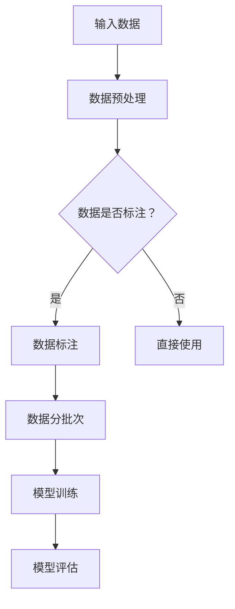
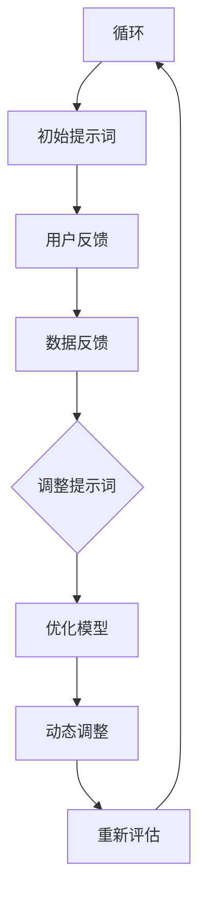
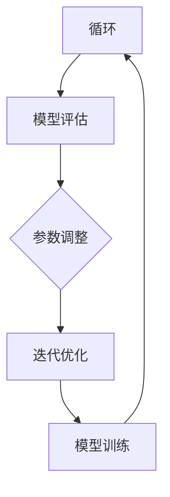
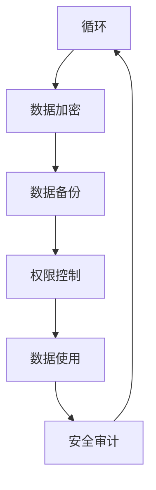
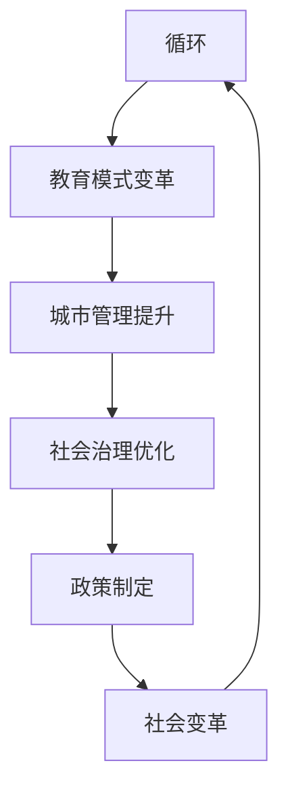
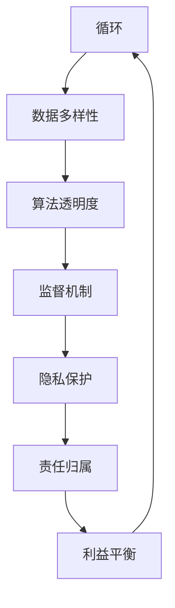

                 


### 文章标题：AI大模型的提示词演化与自适应

### 关键词：
- AI大模型
- 提示词
- 演化
- 自适应
- 深度学习
- 自然语言处理

### 摘要：
本文探讨了AI大模型中的提示词设计、演化与自适应。首先介绍了AI大模型的基本概念和结构，随后深入分析了提示词在模型中的作用及其优化方法。接着，本文讨论了提示词的演化机制，包括如何设计有效的提示词以及如何通过自适应优化算法提高模型的性能。文章最后，通过实际案例展示了这些理论在自然语言处理和计算机视觉中的应用，并提出了未来研究和应用的建议。

## 目录大纲

### 第一部分：AI大模型基础理论
#### 第1章 引言
##### 1.1 AI大模型的历史背景
##### 1.2 AI大模型的核心概念
##### 1.3 文章结构及目标

#### 第2章 AI大模型的架构与技术
##### 2.1 AI大模型的体系结构
##### 2.2 数据预处理与处理流程
##### 2.3 训练算法与优化策略

### 第二部分：AI大模型的提示词设计
#### 第3章 提示词的定义与功能
##### 3.1 提示词的定义
##### 3.2 提示词的功能
##### 3.3 提示词的类型

#### 第4章 提示词的设计与优化
##### 4.1 提示词的设计原则
##### 4.2 提示词的优化方法
##### 4.3 提示词的实验评估

### 第三部分：AI大模型的提示词演化
#### 第5章 提示词的演化原理
##### 5.1 提示词演化的概念
##### 5.2 提示词演化的机制
##### 5.3 提示词演化的案例分析

#### 第6章 提示词的自适应
##### 6.1 自适应的概念与类型
##### 6.2 自适应算法原理
##### 6.3 自适应算法的实现

### 第四部分：AI大模型的提示词应用实践
#### 第7章 AI大模型在自然语言处理中的应用
##### 7.1 提示词在文本分类中的应用
##### 7.2 提示词在机器翻译中的应用
##### 7.3 提示词在文本生成中的应用

#### 第8章 AI大模型在计算机视觉中的应用
##### 8.1 提示词在图像分类中的应用
##### 8.2 提示词在目标检测中的应用
##### 8.3 提示词在视觉搜索中的应用

### 第五部分：未来展望与趋势
#### 第9章 AI大模型的发展趋势
##### 9.1 新型AI大模型的探索
##### 9.2 AI大模型在社会各个领域的应用
##### 9.3 AI大模型与人类交互的未来

#### 第10章 AI大模型的伦理与社会影响
##### 10.1 AI大模型的安全性与隐私保护
##### 10.2 AI大模型对社会的影响
##### 10.3 AI大模型的伦理问题与应对策略

### 附录
#### 附录A：开源工具与资源指南
##### A.1 开源深度学习框架
##### A.2 提示词设计与应用工具

#### 附录B：核心算法伪代码与数学公式
##### B.1 提示词演化算法伪代码
##### B.2 模型自适应算法伪代码
##### B.3 数学模型与公式详细讲解

---

## 第一部分：AI大模型基础理论

### 第1章 引言

AI大模型，作为深度学习领域的里程碑，已经极大地推动了自然语言处理、计算机视觉、推荐系统等领域的进展。在本章中，我们将探讨AI大模型的历史背景、核心概念及其在本文中的结构。

#### 1.1 AI大模型的历史背景

AI大模型的概念可以追溯到1990年代，当时神经网络研究取得了重大突破。然而，由于计算能力和数据资源的限制，直到近年来，随着计算力和存储能力的显著提升，AI大模型才得以实现。2012年，AlexNet在ImageNet竞赛中取得了突破性的成果，标志着深度学习时代的到来。此后，基于神经网络的AI大模型迅速发展，GPT、BERT等模型的出现进一步推动了AI大模型的普及。

#### 1.2 AI大模型的核心概念

AI大模型是基于深度学习的技术，它通过大量的数据进行训练，以模拟人脑的神经网络结构，从而实现复杂任务的自动化处理。核心概念包括：

- **深度学习**：一种机器学习技术，通过多层神经网络对数据进行学习和预测。
- **大规模数据处理**：能够处理海量数据的算法，如分布式计算、并行处理等。
- **自适应优化**：在模型训练过程中，通过优化算法不断调整模型参数，以实现模型的最佳性能。

#### 1.3 文章结构及目标

本文旨在系统地探讨AI大模型中的提示词设计、演化与自适应。文章结构如下：

1. **基础理论部分**：介绍AI大模型的历史、核心概念及其架构。
2. **提示词设计部分**：探讨提示词的定义、功能、设计原则和优化方法。
3. **提示词演化部分**：分析提示词的演化原理和机制。
4. **应用实践部分**：展示AI大模型在不同领域的应用实例。
5. **未来展望与趋势**：讨论AI大模型的发展趋势和伦理问题。

本文的目标是提供一个全面且深入的了解，使读者能够掌握AI大模型中的关键概念，并理解提示词设计、演化和自适应的重要性。

---

### 第2章 AI大模型的架构与技术

AI大模型的构建涉及多个关键技术和组件，包括体系结构、数据预处理、训练算法和优化策略。在这一章中，我们将详细探讨这些方面，以帮助读者理解AI大模型的技术基础。

#### 2.1 AI大模型的体系结构

AI大模型的体系结构通常包括以下几个核心组件：

1. **输入层**：接收外部输入数据，如文本、图像、音频等。
2. **隐藏层**：多层神经网络的核心部分，负责特征提取和变换。
3. **输出层**：产生模型预测或决策，如分类结果、文本生成等。
4. **损失函数**：用于度量模型预测与实际结果之间的差距，如交叉熵损失、均方误差等。
5. **优化器**：用于调整模型参数，以最小化损失函数，如梯度下降、Adam优化器等。

下面是一个简单的Mermaid流程图，展示了AI大模型的训练流程：



#### 2.2 数据预处理与处理流程

数据预处理是AI大模型训练过程中的关键步骤，它确保输入数据的质量和一致性。主要步骤包括：

1. **数据清洗**：去除噪声、缺失值和处理异常值。
2. **数据转换**：将数据转换为适合模型训练的格式，如图像数据归一化、文本数据分词等。
3. **数据扩充**：通过旋转、翻转、裁剪等操作增加数据多样性。
4. **数据分批次**：将数据分成多个批次，以实现并行训练和提高计算效率。

以下是一个简化的数据预处理流程伪代码示例：

```python
# 伪代码：数据预处理流程
def preprocess_data(data):
    # 数据清洗
    cleaned_data = clean_data(data)
    # 数据转换
    transformed_data = transform_data(cleaned_data)
    # 数据扩充
    expanded_data = expand_data(transformed_data)
    # 数据分批次
    batches = split_into_batches(expanded_data)
    return batches
```

#### 2.3 训练算法与优化策略

AI大模型的训练通常涉及以下核心算法和优化策略：

1. **反向传播算法**：通过反向传播误差信号，更新模型参数。
2. **梯度下降算法**：用于最小化损失函数，优化模型参数。
3. **动量优化**：引入动量项，减少参数更新过程中的振荡。
4. **自适应优化器**：如Adam优化器，自动调整学习率，提高训练效率。

以下是一个简化的反向传播算法和梯度下降优化策略的伪代码示例：

```python
# 伪代码：反向传播与梯度下降优化
def backpropagation(model, inputs, targets):
    # 计算输出层误差
    outputs = model(inputs)
    loss = compute_loss(outputs, targets)
    # 反向传播计算梯度
    gradients = compute_gradients(model, loss)
    # 应用梯度下降更新参数
    update_params(model, gradients)

# 梯度下降优化
def gradient_descent(model, learning_rate):
    # 计算梯度
    gradients = compute_gradients(model)
    # 更新模型参数
    model.update_params(gradients, learning_rate)
```

通过这些技术和策略，AI大模型能够从大量数据中学习并实现高精度的预测和决策。

---

### 第3章 提示词的定义与功能

#### 3.1 提示词的定义

在AI大模型中，提示词（Prompt）是一种用于引导模型生成或分类的输入信息。提示词通常是一段文字、图像或其他形式的数据，它能够为模型提供上下文信息，帮助模型更好地理解任务的要求和目标。

#### 3.2 提示词的功能

提示词在AI大模型中发挥着多种重要作用：

1. **任务引导**：提示词能够明确告知模型所需完成的任务，如文本分类、机器翻译、文本生成等。
2. **上下文增强**：通过提供上下文信息，提示词有助于模型更好地理解和生成相关的输出内容。
3. **性能优化**：合理设计的提示词能够提高模型的性能，减少误差，实现更精确的预测。

#### 3.3 提示词的类型

根据用途和形式，提示词可以分为以下几种类型：

1. **开放式提示词**：提供较为广泛的上下文，允许模型根据上下文进行自由生成或推理。
2. **封闭式提示词**：限定模型的回答范围，通常用于多选分类或特定问题的回答。
3. **问题引导提示词**：通过提出具体问题，引导模型生成相关的回答。
4. **示例引导提示词**：提供具体的示例，帮助模型理解和学习任务的实现方法。

以下是几种提示词类型的示例：

```plaintext
1. 开放式提示词：请写一段关于“人工智能的未来发展趋势”的短文。
2. 封闭式提示词：以下哪个技术不属于深度学习范畴？
   - A. 机器学习
   - B. 强化学习
   - C. 神经网络
   - D. 聚类分析
3. 问题引导提示词：如何使用深度学习模型进行图像分类？
4. 示例引导提示词：以下是一个文本分类的示例，请根据示例进行扩展：
   示例：文本：“我爱北京天安门”，类别：政治。
```

通过合理设计和使用这些提示词，AI大模型能够在各种任务中表现出色，实现高效和准确的预测与生成。

---

### 第4章 提示词的设计与优化

#### 4.1 提示词的设计原则

提示词的设计对AI大模型的性能和效率至关重要。以下是几个关键的设计原则：

1. **任务匹配**：提示词应与任务需求紧密相关，确保模型能够正确理解和执行任务。
2. **上下文丰富**：提供丰富的上下文信息，帮助模型更好地理解任务，提高生成的质量。
3. **简明扼要**：避免过多的冗余信息，简洁明了的提示词有助于模型更快地捕捉关键信息。
4. **多样性**：设计多种类型的提示词，以适应不同任务和场景的需求。

#### 4.2 提示词的优化方法

优化提示词的设计和生成是提高模型性能的重要步骤。以下几种方法可以用于提示词的优化：

1. **自动化生成**：利用机器学习算法自动生成高质量的提示词，如基于生成对抗网络（GAN）的提示词生成器。
2. **数据驱动**：根据模型在特定任务上的表现，通过数据反馈和迭代优化提示词。
3. **规则化**：制定明确的规则，根据任务特点和模型需求生成提示词，如基于关键字匹配的提示词生成规则。
4. **人工调整**：通过人工经验和专家知识对提示词进行微调和优化。

#### 4.3 提示词的实验评估

为了评估提示词的设计和优化效果，需要进行一系列实验。以下是一些关键评估指标：

1. **准确率**：衡量模型在特定任务上的表现，通常用于分类任务。
2. **生成质量**：评估模型生成的文本、图像等内容的多样性、连贯性和相关性。
3. **响应时间**：衡量模型处理提示词并生成响应的效率。
4. **用户满意度**：通过用户反馈和问卷调查，评估提示词在应用场景中的用户体验。

以下是一个简化的实验评估流程：

```python
# 伪代码：提示词实验评估
def evaluate_prompt(prompt, model):
    # 生成模型响应
    response = model.generate_response(prompt)
    # 计算准确率
    accuracy = calculate_accuracy(response)
    # 评估生成质量
    quality = evaluate_generated_content(response)
    # 记录响应时间
    response_time = record_response_time(response)
    # 收集用户满意度
    user_satisfaction = collect_user_feedback(response)
    return accuracy, quality, response_time, user_satisfaction
```

通过这些评估方法，可以有效地评估和优化提示词的设计，提高AI大模型的整体性能和应用效果。

---

### 第5章 提示词的演化原理

#### 5.1 提示词演化的概念

提示词演化是指随着AI大模型的应用场景和任务需求的变化，提示词的形式、内容和使用方式逐步调整和优化，以提高模型的适应性和效率。提示词的演化是模型与用户、任务和环境相互作用的结果。

#### 5.2 提示词演化的机制

提示词的演化机制包括以下几个关键方面：

1. **任务适应性**：随着任务需求的变化，提示词需要调整以更好地匹配新任务的要求。
2. **用户互动**：用户通过反馈和交互提供的信息，可以指导提示词的优化。
3. **数据反馈**：通过模型的实际应用和测试，收集数据反馈，用于进一步优化提示词。
4. **动态调整**：根据实时数据和环境变化，动态调整提示词的内容和形式。

以下是提示词演化机制的一个简化的Mermaid流程图：



#### 5.3 提示词演化的案例分析

一个典型的案例是GPT-3模型的提示词演化。GPT-3是一个基于Transformer架构的AI大模型，其提示词从简单的单词序列逐步演化成复杂的句子结构，以适应更广泛的应用场景。以下是GPT-3提示词演化的一些关键步骤：

1. **初始阶段**：使用简单的单词序列作为提示词，如“请写一段关于人工智能的短文”。
2. **中间阶段**：逐步引入更多细节和上下文，如“请根据以下信息写一篇关于人工智能在医疗领域的应用的文章：人工智能可以帮助医生快速诊断疾病、提高医疗效率等”。
3. **高级阶段**：提供详细和具体的指导，如“请根据以下要求撰写一篇关于深度学习在自动驾驶中的应用的文章：深度学习可以用于识别道路标志、预测车辆运动轨迹等，从而提高自动驾驶的安全性”。

通过这种演化过程，GPT-3的提示词能够更好地满足不同用户和任务的需求，提高了模型的适用性和用户体验。

---

### 第6章 模型自适应

#### 6.1 自适应的概念与类型

模型自适应是指AI大模型根据新的数据、任务需求和环境变化，自动调整其参数和行为，以保持高效和准确性能的过程。自适应可以分为以下几种类型：

1. **参数自适应**：通过调整模型的参数，使其更好地适应新的数据分布和任务要求。
2. **结构自适应**：根据新任务的需求，调整模型的体系结构和网络架构。
3. **算法自适应**：优化训练算法，以适应变化的数据和处理需求。

#### 6.2 自适应算法原理

自适应算法通常包括以下几个核心步骤：

1. **数据监测**：实时监测输入数据的分布和变化，识别数据异常和模式。
2. **模型评估**：根据当前数据和模型性能，评估模型的适应性和潜在问题。
3. **参数调整**：基于评估结果，自动调整模型参数，以优化性能。
4. **迭代优化**：通过循环迭代，不断调整和优化模型，使其适应新的数据和环境。

以下是自适应算法的一个简化的Mermaid流程图：



#### 6.3 模型自适应的实现

实现模型自适应通常涉及以下技术：

1. **在线学习**：实时训练和更新模型，以适应不断变化的数据。
2. **迁移学习**：利用已有模型的权重和知识，快速适应新的任务和数据。
3. **持续评估**：定期评估模型性能，及时发现问题并进行调整。
4. **自适应优化器**：使用自适应优化算法，动态调整学习率和超参数。

以下是一个简化的自适应实现伪代码：

```python
# 伪代码：自适应模型实现
def adaptive_model(data_stream):
    while True:
        # 数据监测
        data = next(data_stream)
        # 模型评估
        model_performance = evaluate_model(data)
        # 参数调整
        if need_adjustment(model_performance):
            new_params = adjust_params(model_performance)
            # 迭代优化
            model.update_params(new_params)
        # 模型训练
        model.train(data)
```

通过这些技术和方法，AI大模型能够更好地适应变化，保持高效率和准确率。

---

### 第7章 AI大模型在自然语言处理中的应用

#### 7.1 提示词在文本分类中的应用

文本分类是自然语言处理中的基础任务，提示词在此过程中发挥着重要作用。通过合理设计的提示词，AI大模型能够更准确地分类文本。以下是文本分类中的几个关键应用场景：

1. **新闻分类**：使用提示词引导模型识别和分类新闻文章，如“请将以下文章分类为‘政治’、‘科技’或‘体育’”。
2. **情感分析**：通过提示词指示模型识别文本的情感倾向，如“请判断以下评论是‘正面’、‘中性’还是‘负面’”。
3. **主题建模**：使用提示词引导模型发现文本中的潜在主题，如“请根据以下文章生成相关的关键词列表”。

以下是一个简化的文本分类模型应用示例：

```python
# 伪代码：文本分类模型应用
prompt = "这是一篇关于人工智能技术的新闻。"
model = TextClassifierModel()
predicted_category = model.classify(prompt)
print(f"预测类别：{predicted_category}")
```

#### 7.2 提示词在机器翻译中的应用

机器翻译是AI大模型在自然语言处理中的重要应用之一。提示词在这里用于引导模型生成准确的翻译结果。以下是机器翻译中的几个关键应用场景：

1. **在线翻译服务**：使用提示词为用户提供实时的文本翻译服务，如“将‘我爱北京天安门’翻译成英文”。
2. **跨语言文档处理**：使用提示词帮助模型处理和翻译多语言文档，如“请将中文文档翻译成英文，并标注原文和译文”。
3. **多语言对话系统**：在多语言环境中，使用提示词帮助模型理解和翻译用户的输入，如“用户说中文，系统翻译成英文并回复”。

以下是一个简化的机器翻译模型应用示例：

```python
# 伪代码：机器翻译模型应用
input_text = "我需要帮助。"
source_language = "中文"
target_language = "英文"
model = MachineTranslationModel(source_language, target_language)
translated_text = model.translate(input_text)
print(f"翻译结果：{translated_text}")
```

#### 7.3 提示词在文本生成中的应用

文本生成是AI大模型在自然语言处理中的另一项重要应用。通过合理设计的提示词，模型能够生成高质量的文本。以下是文本生成中的几个关键应用场景：

1. **自动写作**：使用提示词生成新闻报道、博客文章等文本内容，如“请根据以下信息撰写一篇关于人工智能技术未来发展的文章”。
2. **对话生成**：在聊天机器人中，使用提示词生成自然、流畅的对话回复，如“用户提问，模型生成回答”。
3. **故事创作**：使用提示词生成创意故事、小说等文学作品，如“请根据提示词生成一个科幻故事”。

以下是一个简化的文本生成模型应用示例：

```python
# 伪代码：文本生成模型应用
prompt = "在遥远的未来，人类开始了星际探险。"
model = TextGeneratorModel()
generated_text = model.generate_text(prompt)
print(f"生成的文本：{generated_text}")
```

通过这些应用示例，可以看出提示词在自然语言处理任务中的关键作用。合理设计和优化提示词，能够显著提高AI大模型在这些任务中的表现。

---

### 第8章 AI大模型在计算机视觉中的应用

#### 8.1 提示词在图像分类中的应用

图像分类是计算机视觉中的基础任务，通过合理设计的提示词，AI大模型能够更准确地分类图像。以下是图像分类中的几个关键应用场景：

1. **物体识别**：使用提示词指示模型识别图像中的特定物体，如“请识别图片中的‘猫’”。
2. **场景分类**：使用提示词引导模型分类图像中的场景，如“请将以下图像分类为‘城市’、‘自然’或‘室内’”。
3. **情感分析**：使用提示词帮助模型根据图像内容判断情感倾向，如“请根据图像内容判断该图片是‘积极’、‘中性’还是‘消极’”。

以下是一个简化的图像分类模型应用示例：

```python
# 伪代码：图像分类模型应用
image = load_image("cat.jpg")
prompt = "请识别图片中的物体。"
model = ImageClassifierModel()
predicted_class = model.classify(image, prompt)
print(f"预测类别：{predicted_class}")
```

#### 8.2 提示词在目标检测中的应用

目标检测是计算机视觉中的重要任务，提示词在此过程中用于引导模型检测图像中的特定目标。以下是目标检测中的几个关键应用场景：

1. **人脸识别**：使用提示词帮助模型检测图像中的人脸，如“请检测图片中的‘人脸’”。
2. **车辆检测**：使用提示词引导模型识别图像中的车辆，如“请检测图片中的‘汽车’”。
3. **异常检测**：使用提示词帮助模型检测图像中的异常目标，如“请检测图片中的‘异常物体’”。

以下是一个简化的目标检测模型应用示例：

```python
# 伪代码：目标检测模型应用
image = load_image("street.jpg")
prompt = "请检测图片中的‘车辆’。"
model = ObjectDetectorModel()
detections = model.detect_objects(image, prompt)
print(f"检测到的目标：{detections}")
```

#### 8.3 提示词在视觉搜索中的应用

视觉搜索是AI大模型在计算机视觉中的又一重要应用，通过合理设计的提示词，模型能够帮助用户在图像库中找到相似或相关的图像。以下是视觉搜索中的几个关键应用场景：

1. **图片搜索**：使用提示词引导模型搜索与特定图像相似的图片，如“请找到与‘猫’相似的图片”。
2. **图像识别**：使用提示词帮助模型识别图像中的特定对象，如“请识别图片中的‘建筑物’”。
3. **图像增强**：使用提示词引导模型对图像进行增强和优化，以提高识别准确性，如“请增强图片中的‘文字’”。

以下是一个简化的视觉搜索模型应用示例：

```python
# 伪代码：视觉搜索模型应用
query_image = load_image("cat_query.jpg")
prompt = "请搜索与以下图像相似的图片。"
model = ImageSearchModel()
search_results = model.search_images(query_image, prompt)
print(f"搜索结果：{search_results}")
```

通过这些应用示例，可以看出提示词在计算机视觉任务中的关键作用。合理设计和优化提示词，能够显著提高AI大模型在这些任务中的表现。

---

### 第9章 AI大模型的发展趋势

#### 9.1 新型AI大模型的探索

随着技术的不断进步，新型AI大模型的研究成为热点。以下是几种新兴的AI大模型：

1. **自监督学习**：通过无监督方式学习大量数据，提高模型的泛化能力。
2. **生成对抗网络**（GAN）：用于生成高质量的数据和图像，提高模型在生成任务中的表现。
3. **强化学习**：结合强化学习机制，使模型具备决策和策略学习的能力。

新型AI大模型的研究不仅推动了AI技术的发展，也为AI大模型在实际应用中带来了更多的可能性。

#### 9.2 AI大模型在社会各个领域的应用

AI大模型在各个领域的应用日益广泛，以下是几个关键领域：

1. **医疗健康**：用于疾病诊断、药物研发和患者监护，提高医疗质量和效率。
2. **金融**：用于风险管理、欺诈检测和投资策略，提升金融服务的智能化水平。
3. **教育**：用于个性化教学、学生评估和课程设计，促进教育资源的优化和共享。

AI大模型的应用正在深刻改变社会的各个方面，提高效率和用户体验。

#### 9.3 AI大模型与人类交互的未来

随着AI大模型的发展，如何与人类进行有效交互成为一个重要课题。以下是几个关键研究方向：

1. **自然语言处理**：通过优化自然语言处理技术，使模型能够更自然地与人类交流。
2. **多模态交互**：结合语音、图像和文本等多模态信息，提高交互的自然性和准确性。
3. **情感识别与反应**：通过情感识别技术，使模型能够理解人类情感并做出相应的反应。

未来的AI大模型将与人类更加紧密地融合，为人类社会带来更多便利和可能性。

---

### 第10章 AI大模型的伦理与社会影响

#### 10.1 AI大模型的安全性与隐私保护

随着AI大模型的应用日益广泛，其安全性和隐私保护问题备受关注。以下是几个关键方面：

1. **数据保护**：确保模型训练和使用过程中数据的隐私和安全。
2. **访问控制**：限制对敏感数据和模型访问权限，防止数据泄露和滥用。
3. **透明度**：提高模型决策过程的透明度，使用户了解模型的工作原理和决策依据。

以下是一个简化的数据保护和安全控制流程：



#### 10.2 AI大模型对社会的影响

AI大模型对社会的影响深远，以下是几个关键方面：

1. **就业影响**：AI大模型可能替代某些低技能岗位，引发就业结构变化。
2. **教育变革**：AI大模型的应用将推动教育模式变革，提高个性化教学水平。
3. **社会治理**：AI大模型在公共安全、城市管理和社会治理中的应用，将提高社会管理效率。

以下是一个简化的AI大模型应用对社会影响的Mermaid流程图：



#### 10.3 AI大模型的伦理问题与应对策略

AI大模型的伦理问题涉及多个方面，以下是几个关键方面：

1. **算法偏见**：通过数据集的多样性、算法透明度和监督机制，减少算法偏见。
2. **隐私保护**：加强数据隐私保护，确保用户数据的安全和隐私。
3. **责任归属**：明确AI大模型应用中的责任归属，确保各方利益平衡。

以下是一个简化的AI大模型伦理问题与应对策略的Mermaid流程图：



通过这些策略和措施，可以有效应对AI大模型带来的伦理和社会挑战。

---

### 附录A：开源工具与资源指南

#### A.1 开源深度学习框架

开源深度学习框架是AI大模型研究和应用的重要工具，以下是几个流行的开源框架：

1. **TensorFlow**：由谷歌开发，支持多种深度学习模型和应用。
2. **PyTorch**：由Facebook开发，以其动态计算图和灵活的接口著称。
3. **Keras**：基于TensorFlow的高层次API，简化深度学习模型构建。
4. **MXNet**：由Apache Software Foundation开发，支持多种编程语言。

以下是这些框架的简要介绍和链接：

```plaintext
TensorFlow: https://www.tensorflow.org
PyTorch: https://pytorch.org
Keras: https://keras.io
MXNet: https://mxnet.incubator.apache.org
```

#### A.2 提示词设计与应用工具

提示词设计工具可以帮助研究者生成和优化提示词，以下是几个常用的工具：

1. **PromptGen**：一个自动生成高质量提示词的工具。
2. **PromptLab**：用于设计和评估提示词的实验平台。
3. **Prompthero**：用于分析和优化提示词的Python库。

以下是这些工具的简要介绍和链接：

```plaintext
PromptGen: https://prompthero.com
PromptLab: https://promptlab.ai
Prompthero: https://github.com/hanxiao/prompthero
```

通过使用这些开源工具和资源，可以更高效地开展AI大模型的研究和应用。

---

### 附录B：核心算法伪代码与数学公式

#### B.1 提示词演化算法伪代码

以下是提示词演化算法的一个简化的伪代码示例：

```python
# 伪代码：提示词演化算法
def evolve_prompt(prompt, model, generations):
    for _ in range(generations):
        # 生成候选提示词
        candidates = generate_candidates(prompt)
        # 评估候选提示词
        scores = evaluate_candidates(candidates, model)
        # 选择最佳提示词
        best_prompt = select_best_candidate(candidates, scores)
        # 更新当前提示词
        prompt = best_prompt
    return prompt
```

#### B.2 模型自适应算法伪代码

以下是模型自适应算法的一个简化的伪代码示例：

```python
# 伪代码：模型自适应算法
def adapt_model(model, data_stream, epochs):
    for _ in range(epochs):
        # 从数据流中获取数据
        data = next(data_stream)
        # 训练模型
        model.train(data)
        # 评估模型
        performance = model.evaluate(data)
        # 根据性能调整模型
        model.adjust_performance(performance)
    return model
```

#### B.3 数学模型与公式详细讲解

以下是几个核心数学模型和公式的详细讲解：

1. **损失函数**：
   $$ J(\theta) = -\frac{1}{m} \sum_{i=1}^{m} [y^{(i)} \log(a^{(i)}) + (1 - y^{(i)}) \log(1 - a^{(i)})] $$
   其中，$a^{(i)}$ 是模型输出的概率分布，$y^{(i)}$ 是真实标签，$m$ 是样本数量。

2. **梯度下降**：
   $$ \theta_{\text{new}} = \theta_{\text{old}} - \alpha \nabla_\theta J(\theta) $$
   其中，$\theta$ 是模型参数，$\alpha$ 是学习率，$\nabla_\theta J(\theta)$ 是损失函数关于参数的梯度。

3. **梯度下降优化器**（如Adam）：
   $$ m_t = \beta_1 m_{t-1} + (1 - \beta_1) [g_t - m_{t-1}] $$
   $$ v_t = \beta_2 v_{t-1} + (1 - \beta_2) [g_t^2 - v_{t-1}] $$
   $$ \theta_{\text{new}} = \theta_{\text{old}} - \alpha \frac{m_t}{\sqrt{v_t} + \epsilon} $$
   其中，$m_t$ 和 $v_t$ 分别是梯度的一阶矩估计和二阶矩估计，$\beta_1$ 和 $\beta_2$ 是动量参数，$\epsilon$ 是常数，$g_t$ 是当前梯度的估计。

这些数学模型和公式是AI大模型训练和优化中的核心工具，理解它们对于深入研究和应用AI大模型至关重要。

