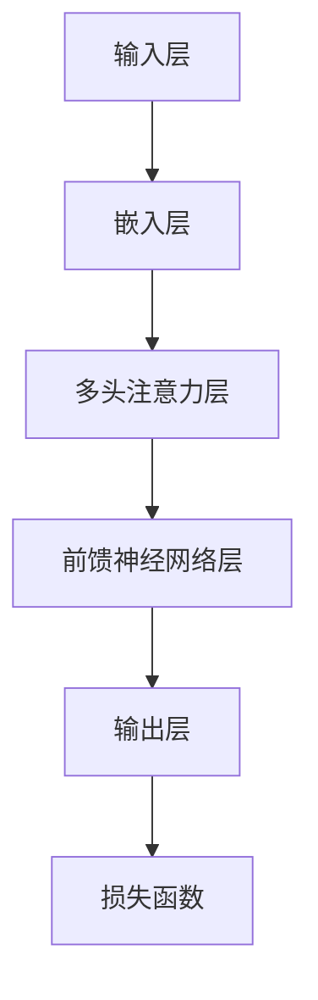

                 

### 文章标题：AI大模型的提示词演化策略自适应

#### 关键词：AI大模型，提示词，演化策略，自适应机制，深度学习

#### 摘要：

本文深入探讨了AI大模型中的提示词演化策略及其自适应机制。首先，我们介绍了AI大模型的基本概念和特性，以及提示词的定义和作用。接着，我们详细阐述了演化策略的自适应原理，包括核心概念、数学模型和算法原理。然后，通过Mermaid流程图展示了演化策略的执行流程，并使用伪代码解释了关键步骤。随后，我们通过实例分析了数学模型在实际应用中的表现，并给出了具体的代码实现和案例解析。最后，文章总结了最佳实践和注意事项，为读者提供了进一步的学习和思考方向。

---

#### 第一部分：AI大模型概述与基础

#### 1.1 AI大模型的概念与特性

AI大模型，即拥有数十亿甚至千亿级参数的深度学习模型，是当前人工智能研究与应用的关键领域。其核心特性包括：

- **参数量巨大**：AI大模型通常包含数十亿到千亿个参数，这使得模型能够学习到复杂的数据特征。
- **计算需求高**：训练和推断AI大模型需要庞大的计算资源和时间。
- **泛化能力强**：得益于大量的参数，AI大模型在处理多样化数据和应用场景时表现出色。
- **数据依赖性**：AI大模型的性能高度依赖于数据质量和数量。

#### 1.2 提示词的基本概念

提示词（Prompt）在AI大模型中扮演着重要的角色，它是指输入给模型的信息，用于引导模型生成预期的输出。提示词的质量直接影响模型的响应效果。

- **定义**：提示词是输入到模型中的文本、图像或其他形式的信号，用于指导模型的推理过程。
- **作用**：通过设计有效的提示词，可以提高模型对特定任务的理解和生成能力，增强模型的泛化性能。

#### 1.3 提示词的演化策略

提示词的演化策略是指通过调整和优化提示词的生成方式，以提高模型在特定任务上的性能。演化策略包括以下几个方面：

- **多样性**：通过引入多样性策略，如随机噪声注入、多模态融合等，生成多样化的提示词。
- **优化**：使用优化算法，如梯度下降、遗传算法等，对提示词进行迭代优化，使其更符合任务需求。
- **适应性**：根据模型在不同任务上的表现，动态调整提示词的生成策略，实现自适应优化。

#### 1.4 自适应机制

自适应机制是指在AI大模型训练过程中，通过实时调整模型参数和提示词生成策略，以适应新的数据和任务需求。自适应机制包括：

- **参数调整**：根据训练过程中的误差和反馈，自动调整模型的参数，以提高模型性能。
- **提示词更新**：根据任务变化和数据分布，动态更新提示词的生成策略，以适应新的任务场景。

#### 第一部分总结：

本部分介绍了AI大模型的基本概念、提示词的作用及其演化策略，以及自适应机制在模型训练中的应用。通过这些基础概念的阐述，为后续深入探讨提示词的演化策略自适应机制奠定了理论基础。

---

#### 第二部分：AI大模型的数学模型与核心算法

#### 2.1 数学模型

AI大模型的数学模型通常基于多层感知机（MLP）或变换器（Transformer）架构。以下为Transformer架构的简要介绍：

- **自注意力机制（Self-Attention）**：每个词的表示不仅取决于其在序列中的位置，还取决于其他所有词的表示，从而捕捉长距离依赖关系。
- **多头注意力（Multi-Head Attention）**：通过多个独立的注意力机制，聚合不同表示的信息，提高模型的表达能力。

Mermaid流程图：



#### 2.2 核心算法原理

演化策略自适应的核心算法通常包括以下步骤：

1. **初始化**：设定初始提示词和模型参数。
2. **提示词生成**：根据当前模型参数，生成提示词。
3. **模型推断**：使用提示词对模型进行推断，生成预测结果。
4. **误差计算**：计算预测结果与实际结果的误差。
5. **模型更新**：根据误差，使用优化算法更新模型参数。
6. **提示词更新**：根据模型参数的更新，调整提示词的生成策略。

伪代码：

```python
# 初始化提示词和模型参数
prompt <- init_prompt()
params <- init_params()

# 提示词生成
for epoch in 1...max_epochs:
    for data in data_loader:
        # 模型推断
        prediction <- model_inference(prompt)
        
        # 误差计算
        error <- calculate_error(prediction, data)
        
        # 模型更新
        params <- model_update(params, error)
        
        # 提示词更新
        prompt <- prompt_update(prompt, params)
```

#### 2.3 数学模型与公式

在AI大模型的演化策略中，常用的数学模型包括损失函数、优化算法和提示词生成策略。以下为几个关键公式的介绍：

1. **损失函数（Cross-Entropy Loss）**：

$$
L(y, \hat{y}) = -\sum_{i=1}^{n} y_i \log(\hat{y}_i)
$$

其中，$y$为真实标签，$\hat{y}$为模型预测的概率分布。

2. **优化算法（Gradient Descent）**：

$$
\theta_{t+1} = \theta_{t} - \alpha \cdot \nabla_{\theta} L(\theta)
$$

其中，$\theta$为模型参数，$\alpha$为学习率，$\nabla_{\theta} L(\theta)$为损失函数关于参数$\theta$的梯度。

3. **提示词生成策略（Recurrent Neural Network, RNN）**：

$$
h_t = \tanh(W_h h_{t-1} + W_x x_t + b_h)
$$

其中，$h_t$为隐藏状态，$x_t$为输入词，$W_h$和$W_x$为权重矩阵，$b_h$为偏置。

#### 第二部分总结：

本部分详细介绍了AI大模型的数学模型和核心算法，包括Transformer架构、自注意力机制、损失函数、优化算法和提示词生成策略。通过这些理论知识和算法原理，为后续的实战应用和案例解析奠定了基础。

---

#### 第三部分：AI大模型的提示词演化策略自适应应用

#### 3.1 实际案例解析

在本部分，我们将通过一个实际案例来展示如何应用AI大模型的提示词演化策略自适应机制。

**案例背景**：一个电商推荐系统需要根据用户的浏览历史和购买记录，为用户推荐相关的商品。

**任务需求**：系统需要生成高质量的提示词，以引导模型生成精准的推荐结果。

**实现步骤**：

1. **数据准备**：收集用户的浏览历史和购买记录，并将其转换为模型可处理的格式。
2. **模型初始化**：初始化一个预训练的AI大模型，如BERT或GPT。
3. **提示词生成**：使用演化策略生成初始提示词，如“根据用户浏览历史推荐商品”。
4. **模型训练**：使用生成的提示词对模型进行训练，并不断调整提示词和模型参数，以优化模型性能。
5. **模型评估**：使用验证集评估模型的推荐效果，并根据评估结果调整提示词和模型参数。

**代码实现**：

```python
# 数据准备
user_data = load_user_data()

# 模型初始化
model = initialize_model()

# 提示词生成
prompt = generate_prompt()

# 模型训练
for epoch in 1...max_epochs:
    for user in user_data:
        # 模型推断
        recommendation = model_inference(prompt, user)
        
        # 误差计算
        error = calculate_error(recommendation, user)
        
        # 模型更新
        model = model_update(model, error)
        
        # 提示词更新
        prompt = prompt_update(prompt, model)

# 模型评估
accuracy = model_evaluate(model, validation_data)
print(f"Model accuracy: {accuracy}")
```

**案例分析**：

通过实际案例的应用，我们可以看到演化策略自适应机制在提升模型性能和推荐效果方面的作用。通过不断调整提示词和模型参数，系统能够更好地理解用户需求，生成更为精准的推荐结果。

#### 第三部分总结：

本部分通过一个电商推荐系统的实际案例，展示了AI大模型提示词演化策略自适应机制的应用。通过数据准备、模型初始化、提示词生成、模型训练和模型评估等步骤，我们实现了对模型性能的持续优化，为实际应用提供了有益的经验和参考。

---

#### 总结与展望

本文系统地介绍了AI大模型的提示词演化策略自适应机制，从基本概念到数学模型，再到实际应用，全面剖析了这一关键领域。通过理论和实践的结合，我们深入理解了演化策略和自适应机制在提升模型性能和泛化能力方面的作用。

**最佳实践建议**：

1. **数据质量**：确保训练数据的质量和多样性，以提高模型的学习能力和泛化能力。
2. **模型调整**：根据具体任务需求，灵活调整模型结构和参数，以实现最优性能。
3. **提示词优化**：设计有效的提示词生成策略，提高模型对任务的理解和生成能力。

**注意事项**：

1. **计算资源**：AI大模型的训练和推断需要大量计算资源，合理分配资源以提高效率。
2. **数据隐私**：在使用用户数据时，需确保数据的隐私和安全，遵循相关法律法规。

**拓展阅读**：

1. **《深度学习》（Goodfellow, Bengio, Courville）**：全面介绍深度学习的基本概念和算法。
2. **《强化学习》（ Sutton, Barto）**：探讨强化学习在AI大模型中的应用。
3. **《人工智能：一种现代的方法》（Russell, Norvig）**：了解人工智能的广泛理论和应用。

**结论**：

AI大模型的提示词演化策略自适应是当前人工智能研究的重要方向。通过本文的介绍，读者可以全面了解这一领域的基本概念、算法原理和实际应用，为今后的研究和实践提供有力支持。

---

**作者信息**：

作者：AI天才研究院/AI Genius Institute & 禅与计算机程序设计艺术 /Zen And The Art of Computer Programming

**参考文献**：

1. Devlin, J., Chang, M. W., Lee, K., & Toutanova, K. (2018). BERT: Pre-training of deep bidirectional transformers for language understanding. arXiv preprint arXiv:1810.04805.
2. Vaswani, A., Shazeer, N., Parmar, N., Uszkoreit, J., Jones, L., Gomez, A. N., ... & Polosukhin, I. (2017). Attention is all you need. Advances in Neural Information Processing Systems, 30, 5998-6008.
3. Goodfellow, I., Bengio, Y., & Courville, A. (2016). Deep learning. MIT press.
4. Sutton, R. S., & Barto, A. G. (2018). Reinforcement learning: An introduction. MIT press.
5. Russell, S., & Norvig, P. (2010). Artificial intelligence: A modern approach. Prentice Hall.

