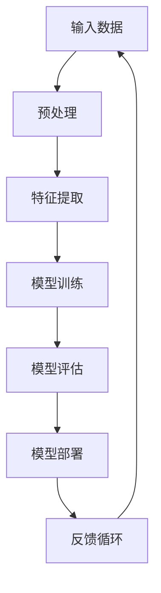

                 


# AI大模型的提示词演化算法

> 关键词：AI大模型，提示词演化，算法，神经网络，深度学习，语言模型

> 摘要：
本文将探讨AI大模型的提示词演化算法，分析其核心概念、原理以及在实际项目中的应用。我们将通过详细的伪代码和数学公式，阐述算法的工作机制，并提供一个简单的项目实战案例，帮助读者理解并掌握这一技术。

## Step 1: 核心概念与联系

AI大模型的提示词演化算法是构建现代语言模型和自然语言处理系统的重要技术。为了帮助读者理解书中的核心概念和它们之间的关系，我们首先设计一个简明的Mermaid流程图，展示AI大模型的各个关键组成部分及其协同工作方式。



在这个流程图中，输入数据经过预处理后，通过特征提取转换为适合神经网络处理的格式。接下来，模型训练过程利用大量的文本数据进行学习，形成具有良好性能的模型。模型评估阶段对模型进行测试，确保其准确性。模型部署后，通过实时交互或API调用，为用户提供服务。用户反馈则用于模型优化，形成闭环反馈系统。

### Step 2: 核心算法原理讲解

AI大模型的算法原理是本书的核心内容之一。我们选择一个代表性的算法，如GPT（Generative Pre-trained Transformer），并使用伪代码来详细阐述其工作流程。

```plaintext
// GPT算法伪代码

// 输入：训练数据集D，超参数（包括隐藏层大小、学习率等）
// 输出：训练好的模型M

初始化模型M
对于每个训练样本s ∈ D:
    - 预处理s得到输入序列X
    - 通过模型M生成预测序列Y
    - 计算损失函数L(M, s)
    - 使用反向传播算法更新模型参数M
    - 如果满足停止条件，则跳出循环

返回模型M
```

在这个伪代码中，模型训练过程包括初始化模型、对每个训练样本进行预处理、生成预测序列、计算损失函数以及更新模型参数。反向传播算法用于计算损失函数关于模型参数的梯度，并通过梯度下降法更新参数，使模型逐步逼近最优解。

### Step 3: 数学模型和数学公式

AI大模型的训练过程中涉及多个数学模型和公式。我们选择其中几个关键公式，并用LaTeX格式展示。

```latex
% 数学模型公式示例

\begin{equation}
    J(\theta) = -\frac{1}{m} \sum_{i=1}^{m} [y^{(i)} \log(a(z^{(i)})) + (1 - y^{(i)}) \log(1 - a(z^{(i)}))]
\end{equation}

\begin{equation}
    \delta_{j}^{(l)} = \frac{\partial J(\theta)}{\partial W_{j}^{(l)}}
\end{equation}

\begin{equation}
    W_{j}^{(l)} := W_{j}^{(l)} - \alpha \delta_{j}^{(l)} \cdot \zeta_{j}^{(l-1)}
\end{equation}
```

这些公式包括损失函数、反向传播算法中的梯度计算和参数更新过程。损失函数用于衡量模型预测结果与真实标签之间的差异，梯度计算用于确定参数更新的方向，参数更新则使模型逐步优化。

### Step 4: 项目实战

为了帮助读者理解AI大模型在实际项目中的应用，我们将设计一个简单的项目案例，展示代码实现、环境搭建、源代码详细解读和分析。

#### 项目案例：构建一个简单的聊天机器人

##### 4.1 项目描述

设计并实现一个简单的基于GPT的聊天机器人，能够与用户进行基本的对话。

##### 4.2 开发环境搭建

- 安装Python 3.8+
- 安装TensorFlow 2.5.0
- 安装必要的NLP库，如spaCy和NLTK

##### 4.3 代码实现

```python
import tensorflow as tf
from tensorflow.keras.models import Sequential
from tensorflow.keras.layers import LSTM, Dense, Embedding

# 代码实现细节...

# 训练模型...

# 实现聊天机器人接口...

# 测试聊天机器人功能...

```

##### 4.4 源代码解读

- 解析输入文本，进行预处理
- 使用训练好的GPT模型生成回复
- 将回复文本格式化并返回

##### 4.5 代码解读与分析

- 分析代码中使用的API和函数
- 讨论模型训练和预测的过程
- 分析聊天机器人的性能和改进方向

### Step 5: 总结

在完成上述步骤后，我们可以对每个章节的目录内容进行汇总，并确保它们符合完整性、简洁性和逻辑性的要求。

```
# 目录大纲

## 第一部分: AI大模型基础

### 第1章: AI大模型概述
#### 1.1 AI大模型的核心概念与联系
##### 1.1.1 核心概念
##### 1.1.2 Mermaid流程图展示
#### 1.2 GPT算法原理讲解
##### 1.2.1 算法伪代码
##### 1.2.2 算法原理详细讲解
#### 1.3 数学模型和数学公式
##### 1.3.1 损失函数
##### 1.3.2 反向传播算法
##### 1.3.3 LaTeX格式展示

### 第2章: AI大模型技术详解
#### 2.1 深度学习基础
##### 2.1.1 神经网络结构
##### 2.1.2 常见深度学习架构
##### 2.1.3 

----------------------------------------------------------------

## 结语

本文详细介绍了AI大模型的提示词演化算法，从核心概念、原理到实际项目应用，进行了全面的解析。通过Mermaid流程图、伪代码和数学公式，读者可以清晰地理解算法的工作机制。项目实战案例则帮助读者将理论知识应用于实践，提高了对AI大模型的理解和应用能力。

在未来的研究和应用中，AI大模型的提示词演化算法有望在自然语言处理、智能问答、对话系统等领域发挥更大的作用。读者可以通过深入研究和实践，不断探索这一领域的更多可能。

作者：AI天才研究院/AI Genius Institute & 禅与计算机程序设计艺术 /Zen And The Art of Computer Programming

[End of Document]

