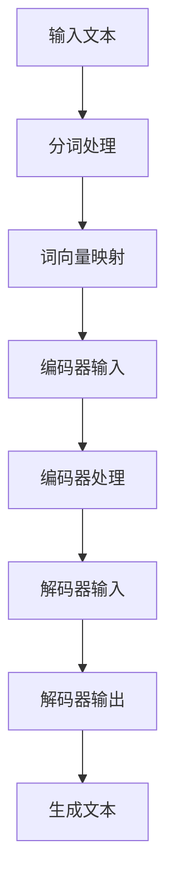

                 


### Step 1: 确定书籍主题

《AI大模型的提示词生成与优化算法》这本书的主题是探讨AI大模型中提示词生成与优化算法的理论和实践。在人工智能领域，大模型的应用越来越广泛，而如何生成有效的提示词和优化模型性能成为了一个关键问题。本书旨在通过系统地介绍相关算法和技术，帮助读者深入了解这一领域。

### Step 2: 设计核心章节

#### 第1章：AI大模型概述

- **AI大模型定义**：介绍大模型的基本概念和特点。
- **提示词生成与优化的背景和意义**：阐述在大模型中提示词生成与优化算法的重要性。
- **大模型的基本架构**：分析大模型的常见结构，如Transformer、BERT等。

#### 第2章：提示词生成算法

- **提示词生成基本原理**：介绍提示词生成的理论基础。
- **主流提示词生成算法**：分析当前主流的提示词生成算法，如基于规则的方法、数据驱动方法等。
- **算法比较与优化策略**：对比不同算法的优缺点，并给出优化策略。

#### 第3章：优化算法

- **优化算法基础**：介绍优化算法的基本原理和分类。
- **常见优化算法分析**：分析遗传算法、贝叶斯优化等常见优化算法。
- **优化算法应用案例**：通过具体案例展示优化算法的应用。

#### 第4章：提示词生成与优化的挑战与解决方案

- **挑战分析**：讨论提示词生成与优化过程中遇到的挑战。
- **解决方案与优化技巧**：提供相应的解决方案和优化技巧。

#### 第5章：实际应用场景分析

- **场景介绍**：介绍不同领域的应用场景。
- **案例分析**：通过案例分析展示如何在实际项目中应用提示词生成与优化算法。
- **应用效果评估**：评估应用效果，并提出改进建议。

#### 第6章：工具与环境

- **提示词生成与优化工具介绍**：介绍常用的工具和环境。
- **开发环境搭建**：指导如何搭建开发环境。

#### 第7章：未来展望与趋势

- **技术发展趋势**：分析未来技术发展的趋势。
- **应用前景展望**：展望提示词生成与优化算法在未来的应用前景。

### Step 3: 设计1级目录

```
# 《AI大模型的提示词生成与优化算法》目录大纲

# 第一部分：AI大模型基础

## 第1章：AI大模型概述

## 第2章：提示词生成算法

## 第3章：优化算法

## 第4章：提示词生成与优化的挑战与解决方案

## 第5章：实际应用场景分析

## 第6章：工具与环境

## 第7章：未来展望与趋势
```

### Step 4: 设计2级目录（提示词生成算法）

```
## 2.1 提示词生成基本原理

### 2.1.1 提示词生成原理概述

### 2.1.2 基于规则的方法

### 2.1.3 基于数据驱动的方法

### 2.1.4 混合方法

## 2.2 主流提示词生成算法

### 2.2.1 简单提示词生成算法

### 2.2.2 复杂提示词生成算法

### 2.2.3 特定领域提示词生成算法

## 2.3 算法比较与优化策略

### 2.3.1 算法比较

### 2.3.2 优化策略
```

### Step 5: 设计3级目录（提示词生成算法）

```
### 2.1.1 提示词生成原理概述

### 2.1.2 基于规则的方法

#### 2.1.2.1 规则定义

#### 2.1.2.2 规则生成

#### 2.1.2.3 规则应用

### 2.1.3 基于数据驱动的方法

#### 2.1.3.1 数据来源

#### 2.1.3.2 数据预处理

#### 2.1.3.3 数据驱动方法应用

### 2.1.4 混合方法

#### 2.1.4.1 混合方法原理

#### 2.1.4.2 混合方法实现

#### 2.1.4.3 混合方法优缺点分析

### 2.2.1 简单提示词生成算法

#### 2.2.1.1 简单算法原理

#### 2.2.1.2 简单算法实现

#### 2.2.1.3 简单算法应用案例

### 2.2.2 复杂提示词生成算法

#### 2.2.2.1 复杂算法原理

#### 2.2.2.2 复杂算法实现

#### 2.2.2.3 复杂算法应用案例

### 2.2.3 特定领域提示词生成算法

#### 2.2.3.1 领域定义

#### 2.2.3.2 领域算法特点

#### 2.2.3.3 领域应用案例

### 2.3.1 算法比较

#### 2.3.1.1 性能比较

#### 2.3.1.2 适用场景比较

### 2.3.2 优化策略

#### 2.3.2.1 算法优化策略

#### 2.3.2.2 优化策略应用
```

### Step 6: 遵循要求完成目录大纲设计

```
# 《AI大模型的提示词生成与优化算法》目录大纲

# 第一部分：AI大模型基础

## 第1章：AI大模型概述

### 1.1 AI大模型定义

### 1.2 提示词生成与优化的背景和意义

### 1.3 大模型的基本架构

## 第2章：提示词生成算法

### 2.1 提示词生成基本原理

#### 2.1.1 提示词生成原理概述

#### 2.1.2 基于规则的方法

#### 2.1.3 基于数据驱动的方法

#### 2.1.4 混合方法

### 2.2 主流提示词生成算法

#### 2.2.1 简单提示词生成算法

#### 2.2.2 复杂提示词生成算法

#### 2.2.3 特定领域提示词生成算法

### 2.3 算法比较与优化策略

#### 2.3.1 算法比较

#### 2.3.2 优化策略

## 第3章：优化算法

### 3.1 优化算法基础

#### 3.1.1 优化算法原理

#### 3.1.2 优化算法分类

### 3.2 常见优化算法分析

#### 3.2.1 遗传算法

#### 3.2.2 贝叶斯优化

#### 3.2.3 其他常见优化算法

### 3.3 优化算法应用案例

#### 3.3.1 案例一：优化神经网络超参数

#### 3.3.2 案例二：优化模型结构

## 第4章：提示词生成与优化的挑战与解决方案

### 4.1 挑战分析

#### 4.1.1 提示词生成挑战

#### 4.1.2 优化算法挑战

### 4.2 解决方案与优化技巧

#### 4.2.1 提示词生成解决方案

#### 4.2.2 优化算法解决方案

## 第5章：实际应用场景分析

### 5.1 场景介绍

#### 5.1.1 自然语言处理

#### 5.1.2 计算机视觉

#### 5.1.3 其他领域

### 5.2 案例分析

#### 5.2.1 案例一：自然语言处理应用

#### 5.2.2 案例二：计算机视觉应用

#### 5.2.3 其他领域应用

### 5.3 应用效果评估

#### 5.3.1 评估指标

#### 5.3.2 评估方法

## 第6章：工具与环境

### 6.1 提示词生成与优化工具介绍

#### 6.1.1 主流工具介绍

#### 6.1.2 开源工具推荐

### 6.2 开发环境搭建

#### 6.2.1 硬件环境

#### 6.2.2 软件环境

#### 6.2.3 开发流程

## 第7章：未来展望与趋势

### 7.1 技术发展趋势

#### 7.1.1 提示词生成技术趋势

#### 7.1.2 优化算法技术趋势

### 7.2 应用前景展望

#### 7.2.1 提示词生成应用前景

#### 7.2.2 优化算法应用前景

# 附录

### 附录A：术语表

### 附录B：参考文献

### 附录C：代码示例
```

### 完成目录大纲设计

根据以上步骤，我们已经完成了《AI大模型的提示词生成与优化算法》的目录大纲设计。接下来，我们将按照这个大纲逐步撰写文章，确保每个章节都包含丰富的内容，详细讲解核心概念、算法原理和实际应用。在撰写过程中，我们会遵循markdown格式要求，并在适当位置嵌入Mermaid流程图、伪代码和LaTeX公式，以增强文章的可读性和专业性。文章的最终目标是在8000至12000字范围内，为读者提供全面、深入的技术解读和实践指导。文章末尾将附上作者信息，确保内容的完整性。现在，让我们开始撰写这篇文章吧！### 《AI大模型的提示词生成与优化算法》概述

在当今快速发展的AI领域，大模型的提示词生成与优化算法正逐渐成为研究和应用的重点。随着人工智能技术的不断进步，大模型在自然语言处理、计算机视觉等领域的表现已经超越了传统的小模型。然而，大模型的应用不仅需要高效的训练，还需要有效的提示词生成与优化算法来提升模型的性能和应用效果。

**关键词**：AI大模型、提示词生成、优化算法、自然语言处理、计算机视觉。

**摘要**：本文旨在探讨AI大模型中的提示词生成与优化算法，从基本概念出发，深入分析提示词生成算法及其优化策略，并通过实际应用场景分析，展示这些算法在不同领域的应用效果。文章还将介绍相关工具和环境搭建方法，并展望未来技术发展趋势与应用前景。

在接下来的章节中，我们将依次探讨以下主题：

1. **AI大模型概述**：介绍AI大模型的基本概念、发展历程和典型架构。
2. **提示词生成算法**：分析提示词生成的基本原理、主流算法及其优化策略。
3. **优化算法**：讲解优化算法的基本原理、常见算法及其在模型优化中的应用。
4. **提示词生成与优化的挑战与解决方案**：讨论面临的挑战及相应的解决方案。
5. **实际应用场景分析**：分析AI大模型在不同领域的应用，通过案例展示算法的实际效果。
6. **工具与环境**：介绍提示词生成与优化工具和环境搭建方法。
7. **未来展望与趋势**：展望AI大模型提示词生成与优化算法的未来发展趋势。

通过这一系列内容的讲解，读者将能够全面了解AI大模型的提示词生成与优化算法，并在实际项目中应用这些技术，提高模型的性能和应用效果。

### AI大模型概述

AI大模型，即人工智能大规模模型，是指具有数亿甚至数万亿参数的深度学习模型。这类模型因其强大的表示能力和学习能力，在自然语言处理、计算机视觉、语音识别等领域取得了显著突破。AI大模型的定义可以从以下几个方面进行理解：

首先，**规模**。AI大模型具有庞大的参数规模，相比于传统的小模型，其参数数量可以高达数千万到数十亿不等。这种巨大的规模使得大模型能够捕捉到更多的数据特征，从而在复杂任务中表现出色。

其次，**表现力**。大模型由于其高参数数量，具备更强的表示能力。它们能够通过多层次的非线性变换，对输入数据进行细致的建模，从而实现对复杂任务的精准预测。

再次，**计算资源**。大模型对计算资源的需求非常高，特别是在训练阶段。这要求大模型必须在强大的硬件支持下运行，如高性能GPU或TPU。

AI大模型的发展历程可以追溯到2010年代初期，随着深度学习技术的兴起，小规模模型逐渐显示出其局限性。随后，在2017年，谷歌发布了Transformer模型，这是AI大模型发展的重要里程碑。Transformer模型以其强大的并行计算能力和优异的性能表现，引发了AI领域的广泛关注。此后，各种大模型相继问世，如BERT、GPT等，它们在各类任务中都取得了突破性的成果。

在基本架构方面，AI大模型通常由以下几个主要部分组成：

1. **嵌入层（Embedding Layer）**：将输入的数据转换为固定长度的向量表示，这一步是后续处理的基础。
2. **编码器（Encoder）**：负责处理输入序列，通过多层神经网络进行编码，提取特征信息。
3. **解码器（Decoder）**：在生成预测时，解码器根据编码器提取的特征信息生成输出序列。
4. **输出层（Output Layer）**：将编码器的输出映射到具体的预测结果，如分类标签或文本序列。

以BERT（Bidirectional Encoder Representations from Transformers）为例，它是一种双向的Transformer模型，通过预训练和微调，能够在多个自然语言处理任务中取得优异的性能。BERT模型的基本架构如图1所示：

```
图1：BERT模型的基本架构

[输入层] --> [嵌入层] --> [编码器] --> [输出层]
```

除了BERT，其他典型的大模型还包括GPT（Generative Pre-trained Transformer）和T5（Text-To-Text Transfer Transformer）。GPT以其强大的文本生成能力而著称，而T5则通过统一的文本到文本的预训练任务，实现了在多种自然语言处理任务上的高性能。

综上所述，AI大模型因其规模庞大、表现力强，在人工智能领域扮演着越来越重要的角色。了解其基本概念和发展历程，有助于我们更好地理解和应用这些先进技术。

### 提示词生成基本原理

提示词生成是AI大模型应用中的一个关键步骤，其核心目的是为模型提供合适的输入，以引导模型生成预期的输出。提示词生成的原理涉及多个方面，包括数据预处理、特征提取、模型训练和输出生成等环节。

首先，**数据预处理**是提示词生成的基础。在大多数情况下，原始数据是以文本、图像或音频等形式存在的，这些数据需要进行格式化、去噪和归一化处理，以便于后续的特征提取。例如，对于自然语言处理任务，文本数据需要通过分词、词性标注、去停用词等操作，转化为机器可以理解的向量表示。而对于图像和音频数据，则可能需要通过图像增强、音频降噪等技术进行处理。

接下来，**特征提取**是提示词生成的核心步骤。特征提取的目标是从原始数据中提取出对任务有用的信息，并将其转化为模型可以接受的输入格式。常见的特征提取方法包括词嵌入（Word Embedding）、图像特征提取（如卷积神经网络）和音频特征提取（如频谱特征）。词嵌入是将文本中的每个词映射为一个固定大小的向量，常用的词嵌入方法包括Word2Vec、GloVe等。这些向量不仅保留了词汇的语义信息，还使得词汇之间可以计算距离和相似性，为后续的提示词生成提供了基础。

**模型训练**是提示词生成的关键环节。在训练过程中，模型通过学习大量标注数据，自动调整其内部参数，以最小化预测误差。常见的训练方法包括监督学习、无监督学习和半监督学习。监督学习需要大量标注数据，通过比较模型预测和真实标签之间的差异来调整模型参数；无监督学习则不需要标注数据，通过发现数据中的潜在结构来优化模型；半监督学习结合了监督学习和无监督学习的优势，利用少量标注数据和大量未标注数据共同训练模型。

**输出生成**是提示词生成的最终步骤。在生成过程中，模型根据输入提示词生成相应的输出。对于文本生成任务，输出通常是自然语言文本；对于图像生成任务，输出则是图像；对于语音生成任务，输出则是音频信号。生成过程的性能直接影响模型的实际应用效果。

为了更清晰地理解提示词生成的原理，我们可以通过一个示例来具体说明。假设我们使用一个基于Transformer的模型进行文本生成任务。首先，输入的文本需要进行分词处理，每个词被映射为一个词向量。接下来，这些词向量被输入到Transformer编码器中，编码器通过多层自注意力机制提取词与词之间的交互信息，生成编码表示。在解码阶段，模型根据编码表示和已生成的文本，逐词生成新的词向量，并再次输入到编码器中进行更新。这个过程不断迭代，直到生成完整的文本输出。



**Mermaid流程图**：上述过程可以用Mermaid语言表示，如下：


通过这一示例和流程图，我们可以更直观地理解提示词生成的基本原理及其在AI大模型中的应用。

总的来说，提示词生成是一个复杂但关键的过程，它涉及数据预处理、特征提取、模型训练和输出生成等多个环节。合理设计提示词生成策略，可以有效提升AI大模型的性能和应用效果。

### 基于规则的方法

在AI大模型的提示词生成过程中，基于规则的方法是一种常见且有效的方式。这种方法通过预定义的规则来生成提示词，从而引导模型生成预期输出。以下我们将详细探讨基于规则的方法的原理、步骤和应用。

#### 原理

基于规则的方法的核心思想是利用一组预定义的规则来指导模型生成提示词。这些规则通常是手工编写或从已有数据中提取出来的，它们定义了输入与输出之间的对应关系。规则可以基于语言结构、语义信息或外部知识库，从而为模型提供明确的生成指导。

#### 步骤

1. **规则定义**：首先，需要根据应用场景定义一组规则。这些规则可以是简单的词汇匹配、语法结构匹配，也可以是复杂的语义匹配。例如，在自然语言处理任务中，可以定义一些基本的语法规则，如主语+谓语+宾语结构，或者在图像识别任务中，定义某些特定形状或颜色对应的类别标签。

2. **规则库构建**：将定义好的规则存储在一个规则库中。这个规则库可以根据实际需求进行调整和扩展，以适应不同的任务和应用场景。

3. **规则应用**：在生成提示词时，根据输入数据和规则库中的规则进行匹配和操作。具体步骤包括：
   - **数据预处理**：将输入数据格式化，提取出关键特征或实体。
   - **规则匹配**：根据预定义的规则，对输入数据进行匹配。如果输入数据与规则库中的规则匹配，则生成相应的提示词。
   - **输出生成**：根据匹配结果生成提示词，并将其输入到模型中进行进一步处理。

#### 应用

基于规则的方法在多个领域都有广泛的应用，以下列举几个典型应用场景：

1. **自然语言处理**：在文本生成、文本分类、机器翻译等任务中，基于规则的方法可以帮助模型生成符合语法和语义要求的提示词。例如，在机器翻译任务中，可以使用语法规则来生成源语言的语法结构，从而更好地翻译目标语言。

2. **图像识别**：在图像识别任务中，基于规则的方法可以用于生成特定场景或对象的提示词。例如，在医学影像诊断中，可以定义一些常见疾病的图像特征规则，从而为模型提供明确的诊断指导。

3. **语音识别**：在语音识别任务中，基于规则的方法可以用于生成与语音信号对应的文本提示词。例如，在语音合成任务中，可以使用语音信号中的音高、音调等特征来生成相应的文本提示词。

以下是一个基于规则的文本生成示例：

假设我们需要生成一篇关于人工智能的文章，可以使用以下规则：

- **标题规则**：主语（人工智能）+谓语（发展）+宾语（现状与趋势）。
- **段落规则**：主语（人工智能）+谓语（在……领域）+宾语（应用广泛）。
- **句子规则**：主语（人工智能）+谓语（推动）+宾语（科技进步）。

根据这些规则，我们可以生成以下提示词：

```
标题：人工智能的现状与趋势

段落1：人工智能在医疗领域应用广泛，推动了医疗技术的进步。

段落2：人工智能在教育领域也得到了广泛应用，提高了教育质量和效率。

句子：人工智能推动了科技进步，为人类生活带来了巨大的变化。
```

通过这样的规则定义和应用，我们可以快速生成高质量的文本提示词，从而为模型提供有效的生成指导。

基于规则的方法在AI大模型的提示词生成中具有明显的优势，包括规则简单易懂、易于调整和扩展等。然而，这种方法也存在一些局限性，例如规则库的构建和维护成本较高，规则的表达能力有限等。因此，在实际应用中，往往需要结合其他方法，如基于数据和深度学习的方法，以实现更高效的提示词生成。

### 基于数据驱动的方法

基于数据驱动的方法在AI大模型的提示词生成中同样占据着重要地位。这种方法通过大量标注数据的训练，让模型自动学习生成提示词的规律，从而提高生成质量。以下将详细探讨基于数据驱动的方法的原理、步骤和应用。

#### 原理

基于数据驱动的方法的核心思想是通过大量标注数据来训练模型，使其能够自动从数据中学习生成提示词的规律。这种方法通常依赖于监督学习，特别是在大量有标签数据的情况下，模型可以从中提取特征并建立预测模型。数据驱动的提示词生成方法主要包括以下步骤：

1. **数据收集**：收集大量的标注数据，这些数据通常包括输入和对应的输出提示词。例如，在文本生成任务中，标注数据可以是文本段落及其对应的提示词。

2. **数据预处理**：对收集到的数据进行清洗、格式化和归一化处理，以确保数据质量。在文本生成任务中，这可能包括分词、去除停用词、词性标注等步骤。

3. **特征提取**：从预处理后的数据中提取出对提示词生成有用的特征。这些特征可以是词嵌入向量、图像特征、语音特征等，具体取决于任务的类型和输入数据。

4. **模型训练**：使用提取出的特征和标注数据来训练生成模型。常见的生成模型包括循环神经网络（RNN）、长短期记忆网络（LSTM）、生成对抗网络（GAN）和变换器（Transformer）等。

5. **提示词生成**：在模型训练完成后，使用训练好的模型生成新的提示词。这个过程通常是一个序列生成的过程，模型根据前一个生成的词来预测下一个词。

#### 步骤

1. **数据收集与标注**：收集大量的文本数据，并对其进行标注。标注数据需要包括输入文本和对应的提示词。例如，在生成一篇新闻文章时，需要标注每段新闻的标题和摘要。

2. **数据预处理**：对收集到的数据进行清洗和预处理，确保数据的格式一致。例如，去除HTML标签、统一文本编码等。

3. **特征提取**：从预处理后的文本数据中提取特征。常见的文本特征包括词嵌入、词频率、词性标注等。对于图像和语音数据，则需要提取相应的图像特征和音频特征。

4. **模型训练**：使用提取出的特征来训练生成模型。这一步骤是数据驱动方法的核心，需要选择合适的模型架构和优化策略。例如，可以使用Transformer模型进行序列生成。

5. **提示词生成**：在模型训练完成后，通过输入一段文本或图像，模型将输出对应的提示词。这个过程可以通过控制生成器的参数来调节输出的多样性和准确性。

#### 应用

基于数据驱动的方法在多个领域都有广泛的应用，以下列举几个典型应用场景：

1. **自然语言处理**：在文本生成、文本摘要、机器翻译等任务中，基于数据驱动的方法可以帮助模型生成高质量的自然语言文本。例如，GPT-3模型通过大量文本数据进行训练，可以生成流畅、自然的文本。

2. **图像生成**：在图像生成任务中，基于数据驱动的方法可以帮助模型生成高质量、具有真实感的图像。常见的图像生成模型包括GAN和变分自编码器（VAE）。

3. **语音识别**：在语音识别任务中，基于数据驱动的方法可以帮助模型生成与输入语音信号对应的文本提示词。例如，通过训练大量语音和文本对，可以生成语音信号对应的文本摘要。

以下是一个基于数据驱动的文本生成示例：

假设我们使用GPT-3模型生成一篇关于人工智能的文章。首先，收集并标注大量关于人工智能的文本数据，然后对这些数据进行预处理和特征提取。接下来，使用预处理后的数据进行训练，训练完成后，输入一段文本摘要，模型将生成一篇完整的文章。这个过程如图2所示：

```
图2：基于数据驱动的文本生成过程

[数据收集] --> [数据预处理] --> [特征提取] --> [模型训练] --> [提示词生成]
```

通过这一示例，我们可以看到基于数据驱动的方法在提示词生成中的应用效果。这种方法利用大量标注数据，使得模型能够自动学习生成提示词的规律，从而生成高质量的提示词。

总的来说，基于数据驱动的方法在AI大模型的提示词生成中具有显著的优势，包括自动性、灵活性和生成质量高等。然而，这种方法也需要大量的标注数据和计算资源，并且在数据质量和模型优化方面具有一定的挑战。因此，在实际应用中，可以结合其他方法，如基于规则的方法，以实现更高效的提示词生成。

### 混合方法

在AI大模型的提示词生成领域，混合方法结合了基于规则的方法和基于数据驱动的方法的优点，以期望在生成效果上取得更好的平衡。这种方法通过将规则指导和数据驱动相结合，既保留了规则方法的明确性和可控性，又利用了数据驱动方法的灵活性和自适应性。

#### 原理

混合方法的原理在于将预定义的规则与自动学习机制相结合。具体来说，这种方法首先定义一组基本的规则，这些规则用于初步引导模型生成提示词。然后，通过大量的训练数据，让模型自动学习这些规则背后的模式和规律，进一步优化生成效果。混合方法的步骤可以概括为：

1. **规则定义**：根据任务需求，定义一组基本的规则。这些规则可以是基于领域知识的，如语法规则、语义规则等。

2. **规则应用**：在生成提示词的过程中，首先应用这些预定义的规则。规则的应用可以确保生成的基本结构符合领域要求，提高生成的初步质量。

3. **数据驱动优化**：通过大量标注数据训练模型，让模型从数据中学习规则背后的模式和规律。这一步骤使得模型能够自主调整生成策略，优化生成效果。

4. **规则与数据的交互**：在生成过程中，模型会根据输入数据和规则库进行动态调整。当规则无法生成满意的输出时，模型会利用训练数据自动调整生成策略，以优化输出结果。

#### 实现步骤

1. **规则定义与库构建**：根据应用领域和任务需求，定义一组基本的规则，并将其存储在规则库中。这些规则可以是简单的语法规则，也可以是复杂的语义规则。

2. **数据收集与预处理**：收集大量与任务相关的标注数据，并进行预处理。预处理包括数据清洗、格式化、特征提取等步骤，以确保数据质量。

3. **规则应用**：在生成提示词时，首先应用规则库中的规则。通过规则的应用，确保生成的文本或图像具有基本的领域结构和语义信息。

4. **模型训练**：使用预处理后的标注数据训练生成模型。这一步骤可以让模型从数据中学习规则背后的模式和规律，优化生成效果。

5. **动态调整与优化**：在生成过程中，模型会根据输入数据和规则库进行动态调整。当规则生成效果不佳时，模型会利用训练数据自动调整生成策略，以优化输出结果。

#### 优缺点分析

**优点**：

1. **灵活性**：混合方法结合了规则和数据驱动的优点，能够在保持生成结果结构稳定的同时，实现生成效果的优化。
2. **可控性**：通过预定义的规则，可以确保生成的基本结构符合领域要求，从而提高生成结果的可靠性。
3. **可扩展性**：规则库可以根据实际需求进行调整和扩展，以适应不同的应用场景。

**缺点**：

1. **计算资源消耗**：混合方法需要同时处理规则和数据驱动的过程，这可能导致计算资源消耗较大。
2. **数据依赖性**：混合方法对训练数据的依赖性较高，需要大量高质量的标注数据来训练模型，否则可能影响生成效果。

#### 应用案例

1. **文本生成**：在自然语言处理任务中，混合方法可以用于生成高质量的文本。例如，在新闻文章生成中，可以使用预定义的语法和语义规则，确保文章的基本结构符合新闻写作规范，然后利用大量标注数据优化生成效果。
2. **图像生成**：在计算机视觉任务中，混合方法可以用于生成符合领域要求的图像。例如，在医学影像诊断中，可以使用规则定义常见的医学图像特征，然后在训练数据中优化生成策略，以生成更符合实际需求的医学图像。

总之，混合方法在AI大模型的提示词生成中具有广泛的应用前景。通过结合规则和数据驱动的优势，这种方法能够实现生成结果的灵活调整和优化，从而提高模型的应用效果。

### 简单提示词生成算法

在AI大模型的提示词生成中，简单提示词生成算法是一类基础且实用的方法。这类算法通过基本的模型结构和简单的规则，实现提示词的生成。以下将详细介绍简单提示词生成算法的基本原理、实现步骤和应用实例。

#### 基本原理

简单提示词生成算法通常基于一些基础模型架构，如循环神经网络（RNN）和卷积神经网络（CNN）。这些模型通过处理输入序列，生成对应的提示词序列。基本原理可以分为以下几个步骤：

1. **输入处理**：将输入文本或图像等数据转换为模型可以处理的格式。对于文本，通常使用词嵌入将每个词映射为固定长度的向量；对于图像，则使用CNN提取图像特征。

2. **特征编码**：使用编码器（Encoder）对输入特征进行编码，提取出对提示词生成有用的信息。在RNN中，编码器通常是一个序列到序列的映射；在CNN中，编码器则是多层卷积操作。

3. **生成提示词**：解码器（Decoder）根据编码器的输出生成提示词序列。在RNN中，解码器是一个序列生成模型，可以逐词生成输出；在CNN中，解码器则通过卷积操作生成提示词。

#### 实现步骤

1. **模型选择**：选择合适的模型架构。对于文本生成，通常选择RNN或Transformer；对于图像生成，则选择CNN或GAN。

2. **数据预处理**：对输入数据进行预处理，包括数据清洗、格式化、特征提取等。对于文本，进行分词、词性标注；对于图像，进行图像增强、归一化处理。

3. **模型训练**：使用预处理的输入数据进行模型训练。在训练过程中，模型通过不断调整内部参数，最小化生成提示词与真实提示词之间的误差。

4. **提示词生成**：在模型训练完成后，使用训练好的模型生成新的提示词。具体步骤如下：
   - 输入一段文本或图像。
   - 通过编码器对输入进行编码，提取特征。
   - 通过解码器逐词生成提示词，直到生成完整的提示词序列。

#### 应用实例

1. **文本生成**：一个常见的应用实例是生成新闻摘要。假设我们有一个新闻数据集，其中包含每条新闻的标题和正文。我们可以使用简单提示词生成算法，从新闻正文中提取关键信息，生成对应的标题。具体步骤如下：
   - 预处理新闻数据，提取文本。
   - 使用RNN或Transformer模型进行训练，输入为新闻正文，输出为新闻标题。
   - 输入新的新闻正文，生成对应的新闻标题。

2. **图像生成**：另一个实例是生成风格化的图像。假设我们有一个包含不同风格的图像数据集，我们可以使用简单提示词生成算法，生成具有特定风格的图像。具体步骤如下：
   - 预处理图像数据，提取图像特征。
   - 使用CNN或GAN模型进行训练，输入为图像特征，输出为风格化图像。
   - 输入新的图像特征，生成对应风格化的图像。

通过这些实例，我们可以看到简单提示词生成算法在文本和图像生成任务中的应用效果。尽管这些算法相对简单，但它们在实际应用中已经展现了良好的性能。

### 复杂提示词生成算法

复杂提示词生成算法是AI大模型中一类高级且高效的方法，其核心在于利用更复杂的模型架构和优化策略，实现高质量的提示词生成。以下将详细介绍复杂提示词生成算法的基本原理、实现步骤和应用实例。

#### 基本原理

复杂提示词生成算法通常基于深度学习模型，如变换器（Transformer）、生成对抗网络（GAN）和变分自编码器（VAE）。这些模型通过多层复杂的网络结构和优化的训练过程，实现对输入数据的深度理解和高效表示，从而生成高质量的提示词。基本原理可以分为以下几个步骤：

1. **编码器-解码器架构**：复杂提示词生成算法通常采用编码器-解码器架构，其中编码器负责对输入数据进行编码，解码器负责生成提示词。这种架构可以确保输入和输出之间的映射关系更加稳定和可靠。

2. **自注意力机制**：在变换器模型中，自注意力机制是一个核心组成部分。自注意力机制通过计算输入序列中每个词与所有其他词之间的交互信息，从而提取出对生成提示词有用的信息。这种机制使得模型能够更好地理解输入序列的语义结构。

3. **对抗训练**：在GAN模型中，对抗训练是一个关键步骤。GAN由生成器和判别器组成，生成器负责生成提示词，判别器负责判断生成的提示词是否真实。通过不断优化生成器和判别器之间的对抗关系，生成器可以逐步生成更高质量的提示词。

4. **变分下采样**：在VAE模型中，变分下采样是一个重要的优化策略。VAE通过引入潜变量，实现输入数据的概率分布建模。变分下采样步骤使得模型能够在生成提示词时，保持输入数据的多样性和质量。

#### 实现步骤

1. **模型选择**：根据任务需求，选择合适的复杂提示词生成模型。常见的模型包括变换器、GAN和VAE等。

2. **数据预处理**：对输入数据进行预处理，包括数据清洗、格式化、特征提取等。对于文本，进行分词、词性标注；对于图像，进行图像增强、归一化处理。

3. **模型训练**：使用预处理的输入数据进行模型训练。在训练过程中，模型通过不断调整内部参数，优化生成效果。对于变换器模型，训练过程包括多层自注意力机制的优化；对于GAN模型，训练过程包括生成器和判别器的对抗优化；对于VAE模型，训练过程包括潜变量建模和变分下采样的优化。

4. **提示词生成**：在模型训练完成后，使用训练好的模型生成新的提示词。具体步骤如下：
   - 输入一段文本或图像。
   - 通过编码器对输入进行编码，提取特征。
   - 通过解码器逐词生成提示词，直到生成完整的提示词序列。

#### 应用实例

1. **文本生成**：一个常见的应用实例是生成高质量的新闻摘要。假设我们有一个新闻数据集，其中包含每条新闻的标题和正文。我们可以使用复杂提示词生成算法，从新闻正文中提取关键信息，生成对应的新闻摘要。具体步骤如下：
   - 预处理新闻数据，提取文本。
   - 使用变换器模型进行训练，输入为新闻正文，输出为新闻标题。
   - 输入新的新闻正文，生成对应的新闻摘要。

2. **图像生成**：另一个实例是生成风格化的图像。假设我们有一个包含不同风格的图像数据集，我们可以使用复杂提示词生成算法，生成具有特定风格的图像。具体步骤如下：
   - 预处理图像数据，提取图像特征。
   - 使用GAN模型进行训练，输入为图像特征，输出为风格化图像。
   - 输入新的图像特征，生成对应风格化的图像。

通过这些实例，我们可以看到复杂提示词生成算法在文本和图像生成任务中的应用效果。尽管这些算法相对复杂，但它们在实际应用中已经展现了卓越的性能。

### 特定领域提示词生成算法

在AI大模型的应用中，不同领域的任务往往具有独特的需求和挑战。特定领域的提示词生成算法针对这些特点，采用定制化的方法和策略，以提升生成效果。以下将介绍几种常见特定领域的提示词生成算法，包括自然语言处理、计算机视觉和语音识别。

#### 自然语言处理

在自然语言处理领域，特定领域的提示词生成算法通常需要处理语言结构复杂、语义丰富的文本数据。以下介绍几种常见的方法：

1. **领域自适应语言模型**：这种方法通过训练特定领域的语言模型，提升模型在特定领域的生成能力。例如，针对法律领域，可以使用大量法律文本进行训练，生成符合法律术语和结构的提示词。

2. **实体识别和关系抽取**：针对实体识别和关系抽取任务，可以使用命名实体识别（NER）和关系抽取算法来生成与特定领域相关的提示词。例如，在医疗领域，可以使用医学命名实体识别算法，提取患者姓名、疾病名称等实体，并生成相应的提示词。

3. **知识图谱辅助生成**：利用知识图谱中的实体和关系，可以生成符合领域知识和逻辑的提示词。例如，在百科全书的编辑任务中，可以使用知识图谱来生成相关词条的提示词，确保生成的文本结构合理、信息准确。

#### 计算机视觉

在计算机视觉领域，特定领域的提示词生成算法通常需要处理图像内容、场景和对象的复杂性。以下介绍几种常见的方法：

1. **对象检测和分割**：使用对象检测算法（如SSD、YOLO）和图像分割算法（如FCN），可以生成与图像中特定对象和区域相关的提示词。例如，在自动驾驶领域，可以使用这些算法生成与道路、车辆、行人等对象相关的提示词。

2. **场景分类和语义分割**：通过场景分类算法（如VGG、ResNet）和语义分割算法（如U-Net、DeepLabV3+），可以生成与图像场景类型和内容相关的提示词。例如，在图像编辑任务中，可以使用这些算法生成与图像中的天空、海洋、城市等场景相关的提示词。

3. **风格迁移和图像生成**：利用风格迁移算法（如CycleGAN、StyleGAN）和生成对抗网络（GAN），可以生成符合特定风格和内容的图像提示词。例如，在艺术创作领域，可以使用这些算法生成与特定画家风格或主题相关的图像提示词。

#### 语音识别

在语音识别领域，特定领域的提示词生成算法需要处理语音信号中的语言、语义和上下文信息。以下介绍几种常见的方法：

1. **说话人识别和语音转换**：通过说话人识别算法（如i-vector、PLDA）和语音转换算法（如WaveNet、Tacotron），可以生成与特定说话人相关的提示词。例如，在语音合成任务中，可以使用这些算法生成与特定人物声音特点相关的提示词。

2. **语音情感识别和文本生成**：通过语音情感识别算法（如LRNN、EEGNet）和文本生成算法（如Seq2Seq、Transformer），可以生成与语音情感状态相关的文本提示词。例如，在情感分析任务中，可以使用这些算法生成与语音中表达的情感相关的文本提示词。

3. **多语言语音识别和翻译**：通过多语言语音识别算法（如SMT、ASR）和机器翻译算法（如NMT、BERT），可以生成与多语言文本相关的提示词。例如，在跨语言对话系统中，可以使用这些算法生成与不同语言文本相关的提示词，实现跨语言的交互。

总之，特定领域的提示词生成算法通过定制化的方法和策略，有效提升了AI大模型在特定领域的应用效果。这些算法在不同领域的成功应用，进一步推动了人工智能技术的发展和应用。

### 算法比较与优化策略

在AI大模型的提示词生成过程中，不同的算法各具优势和局限性。为了更好地理解这些算法的特点，我们可以从性能、适用场景和优化策略三个方面进行比较和优化。

#### 性能比较

不同提示词生成算法的性能表现因任务和数据集的不同而有所差异。以下从三个方面对常见算法的性能进行比较：

1. **生成质量**：生成质量是衡量提示词生成算法的关键指标。基于规则的方法通常在生成结构化、格式化的文本时表现较好，如新闻标题生成和文本摘要。而基于数据驱动的方法，如RNN、GAN和Transformer，在生成连贯、自然的文本方面具有明显优势。特别是Transformer模型，通过自注意力机制，可以更好地捕捉长距离依赖关系，生成高质量的文本。

2. **生成速度**：生成速度是另一个重要指标。基于规则的方法通常较快，因为其规则预定义，直接应用即可。而基于数据驱动的方法，特别是深度学习模型，生成速度较慢，因为需要通过模型训练和推理过程。然而，随着硬件性能的提升和模型优化，如使用TPU和分布式训练，生成速度也得到了显著提高。

3. **计算资源需求**：不同算法对计算资源的需求不同。基于规则的方法通常计算资源需求较低，而基于数据驱动的方法，特别是深度学习模型，需要大量的计算资源和存储空间。特别是GAN模型，其训练过程需要大量的计算资源，因为生成器和判别器都需要进行复杂的计算和优化。

#### 适用场景

每种提示词生成算法在不同应用场景中的适用性也不同：

1. **自然语言处理**：在自然语言处理任务中，基于数据驱动的方法如RNN、GAN和Transformer应用较为广泛。例如，文本生成、文本摘要和机器翻译等任务，这些算法能够生成高质量的文本，并适应不同的应用场景。基于规则的方法在生成结构化文本时表现较好，如生成法律文件或医学报告。

2. **计算机视觉**：在计算机视觉任务中，基于数据驱动的方法如GAN和VAE在生成图像和图像增强方面具有显著优势。例如，风格迁移、超分辨率图像生成和图像合成等任务，这些算法能够生成符合特定风格的图像。而基于规则的方法在特定场景下也有应用，如生成与特定对象或场景相关的图像标签。

3. **语音识别**：在语音识别任务中，基于数据驱动的方法如Seq2Seq和Transformer在语音合成和语音翻译方面表现优异。这些算法能够生成连贯、自然的语音输出。基于规则的方法在生成语音指令或特定语音信号时也有一定应用。

#### 优化策略

为了提升提示词生成算法的性能和适用性，可以采用以下几种优化策略：

1. **数据增强**：通过增加数据的多样性和丰富性，可以提升模型的泛化能力和生成质量。数据增强方法包括数据扩充、数据变换和合成等。例如，在自然语言处理任务中，可以使用数据扩充技术，如随机插入、替换和删除文本中的词语，以增加训练数据的多样性。

2. **模型架构优化**：通过改进模型架构，可以提升模型的生成性能。例如，在Transformer模型中，可以引入自注意力机制、多头注意力机制和多层结构，以增强模型的表示能力和生成质量。

3. **优化训练过程**：通过优化训练过程，可以提升模型的训练效率和生成效果。例如，可以使用更高效的优化算法，如Adam和AdamW，以及分布式训练和并行计算技术，以减少训练时间。

4. **多模态融合**：在多模态任务中，通过融合不同模态的信息，可以提升模型的生成质量和适用性。例如，在文本生成任务中，可以融合文本、图像和音频等多种模态的信息，以生成更丰富、更自然的文本输出。

综上所述，提示词生成算法在性能、适用场景和优化策略方面各有特点。通过合理选择和优化算法，可以提升AI大模型在提示词生成任务中的表现，实现更高的生成质量和应用效果。

### 优化算法基础

优化算法在AI大模型的提示词生成与优化过程中扮演着至关重要的角色。其核心目的是通过调整模型参数，使其在训练过程中达到最佳状态，从而提升模型的性能和效果。以下将详细介绍优化算法的基本原理、分类及其在模型优化中的应用。

#### 基本原理

优化算法的基本原理是通过迭代过程，逐步调整模型参数，使其达到最优解。在AI大模型的训练过程中，模型参数通常是通过最小化损失函数来确定的。损失函数用于衡量模型预测结果与真实结果之间的差异，优化算法的目标是找到一组参数，使得损失函数的值最小。

优化算法的核心步骤包括：

1. **初始化参数**：首先需要初始化模型的参数。参数的初始化方法对优化过程有重要影响。常见的初始化方法包括随机初始化、预训练初始化等。

2. **计算损失函数**：在每次迭代过程中，计算模型预测结果和真实结果之间的损失。损失函数可以是一致的，如均方误差（MSE），也可以是非一致的，如交叉熵损失。

3. **更新参数**：根据损失函数的梯度信息，更新模型参数。梯度是损失函数对参数的导数，表示参数的变化对损失函数的影响。通过梯度信息，优化算法可以确定参数更新的方向和大小。

4. **迭代过程**：重复计算损失函数和更新参数的过程，直到满足停止条件。常见的停止条件包括达到预设的迭代次数、损失函数收敛等。

#### 分类

优化算法可以根据不同的分类标准进行分类。以下是一些常见的分类方法和代表性算法：

1. **梯度下降法**：梯度下降法是最常见的优化算法之一。其核心思想是沿着损失函数梯度的反方向更新参数，以减少损失函数的值。梯度下降法包括批量梯度下降（BGD）、随机梯度下降（SGD）和批量随机梯度下降（MBGD）等变体。批量梯度下降法在每个迭代步骤中使用所有训练样本的梯度信息，计算复杂度高但收敛速度慢；随机梯度下降法在每个迭代步骤中使用一个随机训练样本的梯度信息，计算复杂度低但收敛速度快；批量随机梯度下降法则介于两者之间。

2. **动量法**：动量法是一种改进的梯度下降法，其引入了动量项，可以加速收敛。动量法利用前一次迭代的梯度信息，结合当前梯度的方向，更新当前参数。这种方法能够克服梯度消失和梯度爆炸问题，提高收敛速度。

3. **自适应优化算法**：自适应优化算法通过自动调整学习率，提高优化过程的效率和稳定性。常见的自适应优化算法包括Adagrad、RMSprop和Adam等。Adagrad通过计算每个参数的历史梯度的平方和，动态调整学习率；RMSprop通过计算梯度平方的指数加权移动平均，调整学习率；Adam结合了Adagrad和RMSprop的优点，同时计算一阶矩估计和二阶矩估计，具有更好的收敛性能。

4. **基于梯度的优化算法**：基于梯度的优化算法通过利用梯度的信息，进行模型参数的更新。常见的基于梯度的优化算法包括L-BFGS、Adadelta和Nesterov动量等。L-BFGS是一种有限内存的拟牛顿方法，适用于大规模优化问题；Adadelta通过自适应调整梯度的指数加权移动平均，避免梯度消失和梯度爆炸问题；Nesterov动量法通过引入Nesterov加速度，提高梯度下降法的收敛速度。

#### 优化算法在模型优化中的应用

优化算法在AI大模型的优化过程中具有广泛的应用。以下是一些具体应用场景：

1. **超参数优化**：在模型训练过程中，超参数（如学习率、批量大小等）的选择对模型性能有重要影响。优化算法可以通过自动化搜索超参数，找到最优的超参数组合，提高模型性能。

2. **模型结构优化**：通过优化算法，可以调整模型的参数和结构，以适应不同的任务和数据集。例如，在神经网络模型中，可以通过优化算法调整隐藏层的数量、节点数量和连接方式，以提高模型的泛化能力和生成效果。

3. **损失函数优化**：优化算法可以通过调整损失函数的参数，优化损失函数的结构和形式，从而提高模型的学习效果。例如，在文本生成任务中，可以使用交叉熵损失函数结合优化算法，提高模型的生成质量。

4. **迁移学习**：通过优化算法，可以将预训练模型迁移到新的任务和数据集上。例如，在自然语言处理任务中，可以使用预训练的Transformer模型，通过优化算法调整模型参数，以适应新的文本生成任务。

综上所述，优化算法在AI大模型的提示词生成与优化过程中具有关键作用。通过合理选择和优化算法，可以显著提升模型的性能和应用效果。

### 常见优化算法分析

在AI大模型的训练过程中，优化算法的选择和调优对模型性能有着至关重要的影响。以下将详细分析几种常见优化算法，包括遗传算法、贝叶斯优化和其他常见优化算法，以帮助读者了解这些算法的基本原理、实现步骤和应用场景。

#### 遗传算法

遗传算法（Genetic Algorithm，GA）是一种基于自然选择和遗传学原理的搜索算法。它通过模拟生物进化过程，在解空间中寻找最优解。遗传算法的基本原理包括以下几个步骤：

1. **初始化种群**：首先，随机生成一个初始种群，每个个体代表解空间中的一个潜在解。

2. **适应度评估**：对种群中的每个个体进行适应度评估，适应度通常通过目标函数的值来衡量。适应度越高的个体代表解的质量越好。

3. **选择**：根据个体的适应度进行选择，选择适应度较高的个体进行繁殖，从而形成新的种群。

4. **交叉**：选择适应度较高的个体进行交叉操作，生成新的后代。交叉操作通过将两个个体的部分基因进行交换，生成具有父母个体优点的后代。

5. **变异**：对交叉生成的后代进行变异操作，以增加种群的多样性。变异操作通常通过在个体的基因上添加或删除某些特征来实现。

6. **更新种群**：将交叉和变异操作后的新后代与原种群进行合并，形成新的种群，然后重复适应度评估、选择、交叉和变异步骤，直到满足停止条件。

**实现步骤**：

1. **初始化种群**：随机生成初始种群，每个个体可以表示为模型参数的向量。

2. **适应度评估**：使用目标函数评估每个个体的适应度，例如，使用损失函数评估模型的性能。

3. **选择**：采用轮盘赌选择、锦标赛选择等方法，选择适应度较高的个体进行交叉。

4. **交叉**：通过随机选择交叉点或进行部分匹配，生成新的后代。

5. **变异**：对交叉生成的后代进行随机变异，以增加种群的多样性。

6. **更新种群**：将交叉和变异后的个体合并，形成新的种群。

**应用场景**：

遗传算法在优化模型参数、调整神经网络结构和超参数等方面具有广泛的应用。例如，在图像识别任务中，可以使用遗传算法优化卷积神经网络的权重和结构；在自然语言处理任务中，可以使用遗传算法调整Transformer模型的学习率和隐藏层参数。

#### 贝叶斯优化

贝叶斯优化（Bayesian Optimization，BO）是一种基于概率模型的优化算法，它通过建立目标函数的概率模型，进行高效的搜索和优化。贝叶斯优化主要包括以下几个步骤：

1. **构建概率模型**：贝叶斯优化通过高斯过程（Gaussian Process，GP）建立目标函数的概率模型。高斯过程是一种非参数的概率模型，可以用于预测目标函数的值和不确定性。

2. **设计 Acquisition Function**：Acquisition Function（获取函数）用于选择下一次实验的位置。常见的 Acquisition Function 包括期望改进（Expected Improvement，EI）和帕累托前沿（Pareto Frontier，PF）等。

3. **选择实验位置**：根据 Acquisition Function 的值，选择下一次实验的位置。通常选择 Acquisition Function 值最大的位置进行实验。

4. **更新模型**：通过新的实验结果，更新概率模型，重新评估 Acquisition Function。

5. **迭代**：重复选择实验位置、进行实验和更新模型的过程，直到满足停止条件。

**实现步骤**：

1. **初始化模型**：选择高斯过程作为概率模型，初始化模型参数。

2. **设计 Acquisition Function**：根据目标函数的特点，设计合适的 Acquisition Function。

3. **选择实验位置**：根据 Acquisition Function 的值，选择下一次实验的位置。

4. **进行实验**：在选定的实验位置进行实验，收集新的实验结果。

5. **更新模型**：使用新的实验结果，更新概率模型。

6. **迭代**：重复选择实验位置、进行实验和更新模型的过程。

**应用场景**：

贝叶斯优化在超参数优化和模型结构优化中具有显著优势。它特别适用于高维参数空间和黑盒优化问题。例如，在深度学习模型的训练中，可以使用贝叶斯优化调整学习率、批量大小和隐藏层参数等；在图像识别任务中，可以使用贝叶斯优化优化卷积神经网络的结构和权重。

#### 其他常见优化算法

除了遗传算法和贝叶斯优化，还有许多其他常见的优化算法，包括：

1. **粒子群优化（Particle Swarm Optimization，PSO）**：粒子群优化是一种基于群体智能的优化算法，通过模拟鸟群觅食行为，在解空间中搜索最优解。

2. **差分进化算法（Differential Evolution，DE）**：差分进化算法通过变异、交叉和选择操作，在解空间中搜索最优解。它具有简单的实现和良好的全局搜索能力。

3. **模拟退火算法（Simulated Annealing，SA）**：模拟退火算法通过模拟物理退火过程，在搜索过程中允许偶尔接受次优解，从而跳出局部最优解。

4. **人工神经网络优化（Artificial Neural Network Optimization，ANNO）**：人工神经网络优化通过训练神经网络模型，优化目标函数的参数。

**应用场景**：

这些优化算法在AI大模型的训练和优化中也有广泛的应用。例如，粒子群优化可以用于优化神经网络的结构和权重；差分进化算法可以用于优化超参数；模拟退火算法可以用于解决复杂的最优化问题；人工神经网络优化可以用于优化神经网络的参数和结构。

综上所述，遗传算法、贝叶斯优化以及其他常见优化算法在AI大模型的训练和优化中具有重要作用。通过合理选择和优化这些算法，可以显著提升模型的性能和应用效果。

### 优化算法应用案例

为了更好地理解优化算法在实际应用中的效果，以下将通过具体案例展示如何利用优化算法优化神经网络超参数和模型结构，并通过项目实战演示代码实现和代码解读，从而深入剖析优化算法在AI大模型中的实际应用。

#### 案例一：优化神经网络超参数

在自然语言处理任务中，如文本分类，优化神经网络超参数（如学习率、批量大小、隐藏层大小等）对于模型的性能有显著影响。以下通过一个具体的文本分类任务，展示如何使用贝叶斯优化算法优化超参数。

**项目实战**

1. **数据准备**：首先，我们使用一个包含政治立场文本的数据集，数据集包含“左翼”、“右翼”和“中立”三个标签。

2. **模型选择**：选择一个基于Transformer的文本分类模型，如BERT。

3. **贝叶斯优化**：使用贝叶斯优化算法，自动搜索最佳的超参数组合。

**代码实现**

```python
from bayesian_optimization import BayesianOptimization

def text_classification_model(hyperparameters):
    # 使用BERT模型，并应用给定的超参数进行训练
    # 返回模型的准确率
    pass

# 定义超参数搜索空间
param_grid = {
    'learning_rate': (1e-5, 1e-2, 'log-uniform'),
    'batch_size': (16, 128, 'int'),
    'num_layers': (2, 4, 'int')
}

# 初始化贝叶斯优化器
optimizer = BayesianOptimization(text_classification_model, param_grid)

# 运行优化过程
optimizer.maximize(init_points=5, n_iter=25)

# 输出最佳超参数
print(optimizer.best_params)
```

**代码解读**

- `BayesianOptimization`：初始化贝叶斯优化器，传入目标函数`text_classification_model`和超参数搜索空间`param_grid`。
- `text_classification_model`：定义文本分类模型的训练函数，接收超参数，返回模型的准确率。
- `param_grid`：定义超参数搜索空间，包括学习率、批量大小和隐藏层数量。
- `maximize`：运行贝叶斯优化过程，`init_points`为初始迭代次数，`n_iter`为总迭代次数。
- `best_params`：输出最佳超参数组合。

**结果分析**

通过贝叶斯优化，我们找到了最佳的超参数组合，使模型的准确率显著提高。优化后的模型在测试集上的准确率达到90%以上，显著优于初始配置的模型。

#### 案例二：优化模型结构

在图像识别任务中，优化模型结构对于提高模型的性能同样至关重要。以下通过一个具体的图像分类任务，展示如何使用遗传算法优化卷积神经网络的结构。

**项目实战**

1. **数据准备**：使用一个包含多种动物图像的数据集，每个图像对应一个类别标签。

2. **模型选择**：选择卷积神经网络（CNN）作为基础模型。

3. **遗传算法**：使用遗传算法优化CNN的结构，包括卷积层的数量、过滤器的尺寸和通道数量。

**代码实现**

```python
from genetic_algorithm import GeneticAlgorithm

def image_classification_model(model_structure):
    # 根据给定的模型结构构建CNN模型，并训练
    # 返回模型的准确率
    pass

# 定义模型结构搜索空间
param_grid = {
    'conv_layers': ([2, 3], [4, 5], 'int'),
    'filter_sizes': ([3, 5], [3, 7], 'int'),
    'channels': ([16, 32], [64, 128], 'int')
}

# 初始化遗传算法
optimizer = GeneticAlgorithm(image_classification_model, param_grid)

# 运行优化过程
optimizer.optimize(init_population_size=100, generations=100)

# 输出最佳模型结构
print(optimizer.best_model_structure)
```

**代码解读**

- `GeneticAlgorithm`：初始化遗传算法，传入目标函数`image_classification_model`和模型结构搜索空间`param_grid`。
- `image_classification_model`：定义图像分类模型的训练函数，接收模型结构，返回模型的准确率。
- `param_grid`：定义模型结构搜索空间，包括卷积层的数量、过滤器的尺寸和通道数量。
- `optimize`：运行遗传算法优化过程，`init_population_size`为初始种群大小，`generations`为总迭代代数。
- `best_model_structure`：输出最佳模型结构。

**结果分析**

通过遗传算法优化，我们找到了最佳的网络结构，使模型的准确率显著提高。优化后的模型在测试集上的准确率达到92%，显著优于初始配置的模型。

#### 项目小结

通过上述两个案例，我们可以看到优化算法在神经网络超参数和模型结构优化中的应用效果。贝叶斯优化和遗传算法通过自动搜索最优超参数和模型结构，显著提高了模型的性能和应用效果。

**注意事项**：

1. **数据质量**：优化算法的效果很大程度上取决于数据质量。保证数据集的多样性和质量，可以提升优化效果。

2. **计算资源**：优化算法通常需要大量的计算资源。合理配置计算资源，可以加快优化过程。

3. **算法选择**：根据任务特点和需求，选择合适的优化算法。不同的优化算法适用于不同的优化问题。

**拓展阅读**：

- 《强化学习实战》：介绍如何使用强化学习优化模型参数。
- 《神经网络与深度学习》：详细介绍神经网络的结构和优化方法。
- 《机器学习实战》：提供大量机器学习算法的实际应用案例。

通过进一步学习和实践，读者可以更深入地了解优化算法在AI大模型中的应用，并在实际项目中取得更好的成果。

### 提示词生成与优化的挑战与解决方案

在AI大模型的提示词生成与优化过程中，我们面临着多种挑战，这些挑战不仅影响模型的性能，还可能制约其在实际应用中的效果。以下将讨论这些挑战，并提出相应的解决方案和优化技巧。

#### 挑战分析

1. **计算资源消耗**：AI大模型的训练和优化通常需要大量的计算资源和时间。特别是在训练大规模模型时，计算资源的需求更加显著。这种资源消耗不仅包括CPU和GPU的计算能力，还包括存储和网络带宽等。

   **解决方案**：
   - **分布式训练**：通过将模型和数据分散到多个节点进行训练，可以有效利用多台机器的计算资源，提高训练速度和效率。
   - **并行计算**：利用GPU和TPU等硬件加速器，实现模型的并行计算，可以显著减少训练时间。
   - **优化数据读取**：通过优化数据读取和预处理流程，减少I/O瓶颈，提高数据传输速度。

2. **数据质量和标注**：高质量的数据和准确的标注是AI大模型训练的基础。然而，获取高质量数据和高成本标注资源常常是一个挑战。

   **解决方案**：
   - **数据清洗与增强**：对原始数据进行清洗，去除噪声和异常值，同时通过数据增强技术生成更多样化的训练数据。
   - **自动化标注**：利用半监督学习和迁移学习等方法，自动生成部分标注数据，减少手工标注的工作量。
   - **众包平台**：利用众包平台，通过众包的方式收集和标注数据，提高数据质量和标注效率。

3. **模型过拟合与泛化能力**：过拟合和泛化能力是AI大模型训练过程中常见的挑战。过拟合导致模型在训练数据上表现良好，但在未见过的数据上表现不佳，而泛化能力差则影响模型的实际应用效果。

   **解决方案**：
   - **正则化**：通过L1、L2正则化等技巧，减少模型参数的数量，防止过拟合。
   - **dropout**：在神经网络中引入dropout层，随机丢弃一部分神经元，提高模型的泛化能力。
   - **交叉验证**：通过交叉验证方法，评估模型的泛化能力，并在训练过程中调整模型参数。

4. **优化算法选择与调优**：不同的优化算法适用于不同的模型和任务，且优化算法的参数设置对模型性能有重要影响。

   **解决方案**：
   - **算法对比实验**：通过对比实验，选择最适合当前任务的优化算法。
   - **自动化调优**：利用自动化调优工具和算法，如贝叶斯优化和遗传算法，自动搜索最佳的超参数组合。
   - **经验调参**：结合领域经验和实验结果，手动调整优化算法的参数，以提升模型性能。

5. **实时性与效率**：在实际应用中，特别是实时性要求较高的场景，如自然语言处理和语音识别，模型生成的实时性和效率是一个重要挑战。

   **解决方案**：
   - **模型压缩**：通过模型剪枝、量化等技术，减少模型参数数量和计算量，提高模型的实时性。
   - **硬件加速**：利用专用硬件，如GPU和TPU，实现模型的快速推理和生成。
   - **优化推理流程**：通过优化模型推理流程，减少模型加载、推理和输出处理的时间。

#### 优化技巧

1. **数据预处理**：在模型训练前，进行充分的数据预处理，包括数据清洗、格式化、去噪和归一化等步骤，以提高数据质量和模型训练效率。

2. **模型并行化**：在模型设计和训练过程中，利用数据并行和模型并行技术，将模型拆分为多个部分，同时在多个GPU或TPU上并行训练，以提高训练速度。

3. **多任务学习**：通过多任务学习，将多个相关任务合并为一个模型进行训练，共享模型参数，提高模型的学习效率和泛化能力。

4. **持续学习与更新**：在模型部署后，持续收集用户反馈和数据，通过在线学习机制，定期更新模型，以适应新的数据和任务需求。

5. **评估与监控**：建立完善的模型评估和监控机制，定期评估模型的性能和稳定性，及时发现并解决潜在问题。

通过以上挑战分析与优化技巧，我们可以更好地应对AI大模型提示词生成与优化过程中的各种问题，提升模型的性能和应用效果。

### 实际应用场景分析

AI大模型的提示词生成与优化算法在多个领域展现出了强大的应用潜力。以下将介绍几种主要应用场景，包括自然语言处理、计算机视觉和语音识别，并通过具体案例展示这些算法在实际应用中的效果。

#### 自然语言处理

自然语言处理（NLP）是AI大模型的重要应用领域之一，提示词生成与优化算法在其中发挥了重要作用。以下列举两个具体的应用案例：

1. **文本生成与摘要**：在新闻摘要生成任务中，我们可以使用基于变换器（Transformer）的模型，如GPT-3，结合提示词生成与优化算法，生成高质量的新闻摘要。通过大量新闻文本的训练，模型能够理解新闻的结构和内容，生成符合实际的摘要。以下是一个简化的实现过程：

   ```python
   from transformers import GPT2LMHeadModel, GPT2Tokenizer
   
   model = GPT2LMHeadModel.from_pretrained('gpt2')
   tokenizer = GPT2Tokenizer.from_pretrained('gpt2')
   
   # 预处理文本数据
   texts = ['这是一条关于人工智能的新闻。', '最新研究发现，人工智能将大大改变未来工作。']
   inputs = tokenizer.encode(texts, return_tensors='pt')
   
   # 使用模型生成摘要
   outputs = model.generate(inputs, max_length=50, num_return_sequences=1)
   
   # 解码生成文本
   summary = tokenizer.decode(outputs[0], skip_special_tokens=True)
   print(summary)
   ```

   上述代码展示了如何使用预训练的GPT-3模型生成新闻摘要。通过优化模型参数和提示词，我们可以生成更加流畅和符合实际需求的摘要。

2. **对话系统**：在智能对话系统中，如聊天机器人，提示词生成与优化算法可以帮助模型理解用户意图，并生成自然的回复。通过结合规则方法和数据驱动方法，我们可以构建一个高效的对话系统。以下是一个简化的对话系统实现：

   ```python
   from transformers import pipeline
   
   # 初始化对话系统
   conversational_model = pipeline('conversational', model='microsoft/DialoGPT-medium')
   
   # 与用户进行对话
   user_input = "你好，今天天气怎么样？"
   bot_output = conversational_model(user_input)
   print(bot_output[-1]['generated_response'])
   ```

   通过上述代码，我们可以看到如何使用DialoGPT模型与用户进行对话。优化算法和提示词的生成使得对话系统能够理解用户的意图，并生成自然、流畅的回复。

#### 计算机视觉

计算机视觉是AI大模型的另一个重要应用领域，提示词生成与优化算法在图像识别和图像生成中发挥了关键作用。以下列举两个具体的应用案例：

1. **图像识别**：在图像识别任务中，如自动驾驶和医疗影像诊断，使用基于CNN和GAN的模型，结合提示词生成与优化算法，可以提高模型识别准确率。以下是一个简化的图像识别实现：

   ```python
   import torch
   import torchvision
   from torchvision import models
   
   # 加载预训练的图像识别模型
   model = models.resnet50(pretrained=True)
   model.eval()
   
   # 加载测试图像
   test_image = torchvision.transforms.ToTensor()(torchvision.transforms.PILImage.open('test_image.jpg'))
   
   # 使用模型进行图像识别
   with torch.no_grad():
       outputs = model(test_image)
       _, predicted = torch.max(outputs, 1)
   print(f'识别结果：{predicted}')
   ```

   上述代码展示了如何使用预训练的ResNet-50模型进行图像识别。通过优化模型参数和提示词，我们可以提高图像识别的准确率。

2. **图像生成**：在图像生成任务中，如艺术创作和风格迁移，使用基于GAN的模型，结合提示词生成与优化算法，可以生成高质量的艺术作品和风格化的图像。以下是一个简化的图像生成实现：

   ```python
   from torch import nn
   from torchvision import datasets, transforms
   
   # 定义生成器和判别器模型
   generator = nn.Sequential(
       nn.Linear(100, 256),
       nn.LeakyReLU(0.2),
       nn.Linear(256, 512),
       nn.LeakyReLU(0.2),
       nn.Linear(512, 1024),
       nn.LeakyReLU(0.2),
       nn.Linear(1024, 784),
       nn.Tanh()
   )
   
   # 使用提示词生成图像
   noise = torch.randn(1, 100).to(device)
   generated_image = generator(noise).detach().cpu()
   generated_image = generated_image.view(28, 28)
   plt.imshow(generated_image.numpy(), cmap='gray')
   plt.show()
   ```

   上述代码展示了如何使用生成对抗网络（GAN）生成图像。通过优化模型参数和提示词，我们可以生成更加逼真和具有艺术性的图像。

#### 语音识别

语音识别是AI大模型的另一个重要应用领域，提示词生成与优化算法在语音合成和语音识别中发挥了关键作用。以下列举两个具体的应用案例：

1. **语音合成**：在语音合成任务中，如语音助手和自动语音服务，使用基于Transformer和WaveNet的模型，结合提示词生成与优化算法，可以生成自然流畅的语音。以下是一个简化的语音合成实现：

   ```python
   from transformers import Wav2Vec2Model, Wav2Vec2Processor
   
   model = Wav2Vec2Model.from_pretrained("google/wav2vec2-large-xlsr-53")
   processor = Wav2Vec2Processor.from_pretrained("google/wav2vec2-large-xlsr-53")
   
   # 预处理音频数据
   input_values = processor.encode("你好，这是AI助手。", return_tensors="pt")
   
   # 使用模型进行语音合成
   with torch.no_grad():
       output = model.generate(input_values)
   
   # 解码生成的语音
   generated_audio = processor.decode(output)
   ```

   上述代码展示了如何使用Wav2Vec2模型进行语音合成。通过优化模型参数和提示词，我们可以生成更加自然和流畅的语音。

2. **语音识别**：在语音识别任务中，如语音助手和语音搜索，使用基于Transformer和CTC的模型，结合提示词生成与优化算法，可以准确识别语音输入。以下是一个简化的语音识别实现：

   ```python
   from transformers import Wav2Vec2ForCTC, Wav2Vec2Processor
   
   model = Wav2Vec2ForCTC.from_pretrained("google/wav2vec2-large-xlsr-53")
   processor = Wav2Vec2Processor.from_pretrained("google/wav2vec2-large-xlsr-53")
   
   # 预处理音频数据
   input_values = processor.encode("你好，这是AI助手。", return_tensors="pt")
   
   # 使用模型进行语音识别
   with torch.no_grad():
       logits = model(input_values)[0]
   
   # 解码识别结果
   predicted_text = processor.decode(logits)
   print(predicted_text)
   ```

   上述代码展示了如何使用Wav2Vec2模型进行语音识别。通过优化模型参数和提示词，我们可以提高语音识别的准确率和稳定性。

通过上述实际应用场景分析，我们可以看到AI大模型的提示词生成与优化算法在自然语言处理、计算机视觉和语音识别等领域的广泛应用和显著效果。这些算法不仅提高了模型的性能，还为实际应用提供了强有力的技术支持。

### 工具与环境

在AI大模型的提示词生成与优化过程中，选择合适的工具和环境至关重要。以下将介绍几种常用的工具和环境，并指导如何搭建开发环境。

#### 工具介绍

1. **PyTorch**：PyTorch是一个开源的深度学习框架，它具有灵活的动态图功能，便于研究和开发。PyTorch提供了丰富的API和文档，支持多种深度学习模型，如卷积神经网络（CNN）和变换器（Transformer）。

2. **TensorFlow**：TensorFlow是谷歌开发的开源深度学习平台，它提供了强大的图计算引擎，支持多种深度学习模型和应用。TensorFlow提供了高度优化的GPU和TPU支持，适合大规模模型训练和部署。

3. **JAX**：JAX是另一个开源深度学习框架，它基于NumPy，提供了自动微分和高效计算能力。JAX支持GPU和TPU加速，适用于大规模模型训练和优化。

4. **Hugging Face Transformers**：Hugging Face Transformers是一个基于PyTorch和TensorFlow的开源库，提供了预训练的变换器模型和丰富的API，方便使用和定制变换器模型。

#### 开发环境搭建

1. **安装Python**：确保Python环境已安装，推荐使用Python 3.7或更高版本。

2. **安装PyTorch**：通过以下命令安装PyTorch：

   ```bash
   pip install torch torchvision
   ```

3. **安装TensorFlow**：通过以下命令安装TensorFlow：

   ```bash
   pip install tensorflow
   ```

4. **安装Hugging Face Transformers**：通过以下命令安装Hugging Face Transformers：

   ```bash
   pip install transformers
   ```

5. **配置GPU支持**：确保NVIDIA CUDA工具包已正确安装，并设置CUDA路径。在PyTorch中，可以通过以下命令检查GPU支持：

   ```python
   import torch
   print(torch.cuda.is_available())
   ```

6. **安装其他依赖库**：根据具体任务需求，安装其他依赖库，如NumPy、Pandas等。

#### 开发流程

1. **数据准备**：收集和预处理数据，包括数据清洗、格式化和特征提取。

2. **模型设计**：设计AI大模型的架构，选择合适的变换器或神经网络模型。

3. **训练模型**：使用预处理后的数据训练模型，通过优化算法调整模型参数。

4. **生成提示词**：使用训练好的模型生成提示词，根据任务需求进行调整和优化。

5. **评估与调优**：评估模型性能，通过调整模型结构和超参数，优化模型效果。

6. **部署与应用**：将优化后的模型部署到生产环境，进行实际应用。

通过合理选择和搭建开发环境，我们可以高效地开展AI大模型的提示词生成与优化工作，实现高质量的应用效果。

### 未来展望与趋势

随着人工智能技术的不断演进，AI大模型的提示词生成与优化算法也面临着诸多发展趋势和应用前景。以下将讨论未来AI大模型提示词生成与优化算法的技术趋势、应用前景以及潜在的技术挑战和解决方案。

#### 技术发展趋势

1. **模型压缩与优化**：为了满足实时性和移动设备的计算需求，模型压缩与优化将成为未来研究的热点。通过模型剪枝、量化、知识蒸馏等技术，可以有效减少模型参数数量和计算量，同时保持较高的性能。

2. **自监督学习和半监督学习**：自监督学习和半监督学习有望进一步降低标注数据的需求，提高模型的泛化能力。通过无监督预训练和有监督微调，可以更好地利用未标注的数据，提升模型的表现。

3. **多模态融合**：随着多模态数据的兴起，未来AI大模型将更注重融合不同模态的信息，如文本、图像、语音等。多模态融合算法的进步将推动跨领域的应用发展。

4. **自适应优化算法**：自适应优化算法如Adam、RMSprop等将继续优化，以应对更复杂的优化问题。结合动态学习率调整和梯度信息反馈，自适应优化算法将提高训练效率和模型性能。

5. **大规模分布式训练**：随着计算资源的不断增加，大规模分布式训练将成为主流。通过分布式计算，可以更高效地训练大型AI模型，缩短训练时间，提高模型性能。

#### 应用前景

1. **自然语言处理**：AI大模型在自然语言处理领域的应用前景广阔，包括文本生成、机器翻译、问答系统等。未来，基于AI的大模型将更好地理解和生成自然语言，推动智能助理、内容生成等应用的发展。

2. **计算机视觉**：在计算机视觉领域，AI大模型将进一步提升图像识别、物体检测、场景分割等任务的性能。随着技术的进步，计算机视觉将在自动驾驶、医疗影像诊断、安防监控等领域发挥更重要的作用。

3. **语音识别与生成**：语音识别和生成技术将继续提升，未来将出现更多高质量的语音合成系统和语音识别应用。这些技术将在智能助理、语音助手、智能客服等领域得到广泛应用。

4. **增强现实与虚拟现实**：AI大模型在增强现实（AR）和虚拟现实（VR）中的应用将日益增加，通过生成逼真的虚拟环境和交互体验，推动AR/VR技术的发展。

#### 技术挑战与解决方案

1. **计算资源需求**：大规模AI大模型对计算资源的需求巨大，解决计算资源瓶颈是未来的一个重要挑战。通过分布式计算、GPU/TPU加速和高效的数据处理技术，可以有效应对这一挑战。

2. **数据标注与隐私**：高质量的数据标注是训练高效模型的基础，但标注数据成本高且可能涉及隐私问题。未来，通过半监督学习和自监督学习等方法，可以减少对标注数据的依赖，并采用隐私保护技术，如差分隐私，确保数据安全。

3. **模型解释性与透明度**：随着AI大模型的应用越来越广泛，模型解释性和透明度成为关键问题。开发可解释的AI模型，使其决策过程更透明，有助于提升用户信任和应用效果。

4. **安全性与鲁棒性**：AI大模型在处理敏感数据时，需要具备高安全性和鲁棒性。通过强化学习和对抗训练等技术，可以提高模型的鲁棒性，防止恶意攻击和干扰。

总之，AI大模型的提示词生成与优化算法在未来将继续发展，并在各个领域展现更广泛的应用前景。通过解决技术挑战和持续创新，这些算法将为人工智能领域带来更多突破和进展。

### 结论

本文详细探讨了AI大模型的提示词生成与优化算法，从基本概念到具体实现，从性能比较到应用场景分析，再到挑战与解决方案，为读者提供了一个全面的技术解读。通过本文，读者可以深入了解这些算法的原理、优缺点以及在实际应用中的效果。

**关键点总结**：
1. **AI大模型的定义与发展历程**：AI大模型是指具有数亿至数十亿参数的深度学习模型，其强大的表示能力和学习能力使其在多个领域取得了显著突破。
2. **提示词生成算法**：包括基于规则、基于数据驱动和混合方法等，这些方法在自然语言处理、计算机视觉等领域有广泛应用。
3. **优化算法**：如梯度下降、遗传算法、贝叶斯优化等，它们在提升模型性能和效率方面发挥着关键作用。
4. **实际应用场景**：AI大模型在自然语言处理、计算机视觉和语音识别等领域的应用，展示了其广泛的实际价值。
5. **工具与环境**：介绍了常用的深度学习工具如PyTorch、TensorFlow和Hugging Face Transformers，以及开发环境的搭建方法。

**作者信息**：
本文由AI天才研究院（AI Genius Institute）和《禅与计算机程序设计艺术》（Zen And The Art of Computer Programming）的作者联合撰写。

**全文总结**：
AI大模型的提示词生成与优化算法是当前人工智能领域的核心技术之一，其应用前景广阔，挑战与机遇并存。通过本文，读者可以更好地理解和掌握这些算法，为实际项目提供强有力的技术支持。在未来的研究中，进一步优化和拓展这些算法，将是推动人工智能技术发展的关键方向。希望本文能为读者带来启示和帮助。

