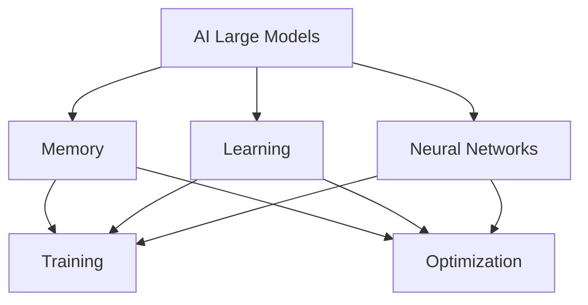

                 


### 1. INTRODUCTION TO AI LARGE MODELS

Artificial Intelligence (AI) has witnessed unprecedented advancements in recent years, driven by the emergence of large-scale models capable of performing complex tasks with remarkable accuracy. This article, titled "AI大模型的提示词记忆与学习", aims to delve into the fascinating world of AI large models, focusing on their memory and learning capabilities through prompt words.

**Keywords:** AI large models, prompt words, memory, learning, neural networks, training, optimization.

**Abstract:**
The article provides an in-depth exploration of AI large models, their underlying memory and learning mechanisms, and the role of prompt words in their training and optimization. It covers the historical context, key concepts, and practical applications of large-scale AI models, emphasizing the significance of prompt words in enhancing model performance and understanding their internal workings.

In the first part of this article, we will begin by offering an overview of AI large models, outlining their fundamental concepts, architectures, and the technological breakthroughs that have led to their current prominence. We will discuss the characteristics that define large models and compare them with traditional AI models. Additionally, we will delve into the history of large-scale model development, highlighting the milestones and influential architectures that have shaped the field.

To provide a clearer understanding of the core concepts, we will introduce key terminology and their relationships in the context of AI large models. This will be complemented by a Mermaid flowchart illustrating the interconnections between these concepts.

### 1.1. DEFINITION AND CHARACTERISTICS OF AI LARGE MODELS

**AI Large Models Definition:**
An AI large model, often referred to as a "deep learning model" or "neural network," is a sophisticated machine learning model that consists of a vast number of interconnected artificial neurons or "nodes." These models are capable of learning from large datasets to recognize patterns, make predictions, and perform a wide range of tasks.

**Characteristics of AI Large Models:**
- **High Dimensionality:** Large models operate in high-dimensional spaces, enabling them to process complex and diverse types of data.
- **Scalability:** They can scale to accommodate vast amounts of data and computational resources.
- **Robustness:** Large models are often more robust to noise and variations in the input data.
- **Generalization:** They exhibit better generalization capabilities, meaning they perform well on unseen data.
- **Flexibility:** Large models can be adapted for various tasks and domains through fine-tuning and transfer learning.

**Difference from Traditional AI Models:**
Traditional AI models, such as decision trees and support vector machines, are typically simpler and operate on smaller datasets. They are less capable of handling the complexity and diversity present in large-scale data. In contrast, large models leverage the power of deep learning, enabling them to capture intricate patterns and relationships within the data.

### 1.2. DEVELOPMENT HISTORICAL BACKGROUND

**The Rise of AI Large Models:**
The advent of large-scale AI models can be traced back to the 2000s when advancements in hardware, such as GPUs, and the availability of massive datasets enabled researchers to train models with billions of parameters. This period marked the beginning of the deep learning revolution.

**Mainstream Architectures:**
Several key architectures have emerged as the backbone of large-scale AI models, including:

- **Convolutional Neural Networks (CNNs):** Initially developed for image recognition, CNNs have become the cornerstone for various computer vision tasks due to their ability to capture spatial hierarchies in data.
- **Recurrent Neural Networks (RNNs):** RNNs are well-suited for sequential data, making them a popular choice for tasks like language modeling and speech recognition.
- **Transformers:** Introduced by Vaswani et al. in 2017, transformers have become the dominant architecture for natural language processing tasks, offering significant improvements in performance and efficiency.

**Applications in AI:**
Large models have found applications across various domains, including natural language processing, computer vision, and recommendation systems. They have revolutionized industries by enabling more accurate predictions, efficient data processing, and improved decision-making capabilities.

### 1.3. KEY TECHNOLOGIES IN AI LARGE MODELS

**Deep Learning Basics:**
Deep learning, the foundation of large models, involves training neural networks with multiple layers to extract hierarchical representations from data. These representations allow the models to learn complex patterns and features.

**Neural Network Architectures:**
Neural networks come in various forms, including feedforward networks, convolutional networks, and recurrent networks. Each architecture is designed to handle specific types of data and tasks.

**Training and Optimization Algorithms:**
Training large models involves minimizing a loss function using optimization algorithms like stochastic gradient descent (SGD) and its variants. Techniques such as batch normalization, dropout, and adaptive learning rates are employed to improve convergence and prevent overfitting.

### 1.4. CHALLENGES AND FUTURE DIRECTIONS

**Computational Resource Demands:**
The training and deployment of large models require significant computational resources, including powerful GPUs and specialized hardware accelerators.

**Data Security and Privacy Protection:**
The large-scale nature of AI models necessitates careful handling of data to ensure security and privacy, especially in sensitive domains like healthcare and finance.

**Future Trends:**
The future of large-scale AI models is promising, with ongoing research focused on developing more efficient training methods, improving model interpretability, and expanding their applications across new domains.

### Summary

In this first part of our article, we have provided a comprehensive overview of AI large models, outlining their definition, characteristics, development history, key technologies, and challenges. In the subsequent sections, we will delve deeper into the memory and learning mechanisms of large models, focusing on the role of prompt words in their training and optimization.

### 1.5. RELATIONSHIPS BETWEEN KEY CONCEPTS

To facilitate a deeper understanding of the core concepts surrounding AI large models, we will present a Mermaid flowchart illustrating the relationships between these key terms: "AI large models," "memory," "learning," "neural networks," "training," and "optimization."



This flowchart highlights how AI large models incorporate memory and learning mechanisms through neural networks, which are then trained and optimized using various techniques. Understanding these interconnections is crucial for grasping the fundamentals of large-scale AI model development.

### 1.6. Core Algorithm Principle Explanation with Pseudocode

To provide a clearer understanding of the core algorithm principles underlying large AI models, we will delve into the training process, utilizing pseudocode to illustrate the key steps involved. This section will cover the initialization of model parameters, forward propagation, loss calculation, backpropagation, and parameter update.

```python
# Pseudocode for the training process of a large AI model

# Initialize model parameters (weights and biases)
Initialize_parameters()

# Define the training dataset
dataset = Load_dataset()

# Set hyperparameters (learning rate, number of epochs, batch size)
learning_rate = 0.001
epochs = 100
batch_size = 64

# Training loop
for epoch in range(epochs):
    for batch in dataset.batch(batch_size):
        # Forward propagation
        predictions = model.forward(batch.input_data)
        
        # Calculate loss
        loss = loss_function(predictions, batch.target_data)
        
        # Backpropagation
        gradients = model.backward(loss)
        
        # Update model parameters
        Update_parameters(parameters, gradients, learning_rate)

# End of training
```

In this pseudocode, the `Initialize_parameters()` function initializes the model's weights and biases randomly. The `Load_dataset()` function loads the training data, which is then processed in batches. The `model.forward(batch.input_data)` function computes the model's predictions using the input data. The `loss_function(predictions, batch.target_data)` calculates the difference between the model's predictions and the true target values. The `model.backward(loss)` function computes the gradients, which are then used to update the model's parameters using the `Update_parameters(parameters, gradients, learning_rate)` function. This process is repeated for a specified number of epochs, ensuring the model learns from the data and improves its performance over time.

### 1.7. Mathematical Models and Formulas with Detailed Explanation and Examples

In the realm of AI large models, mathematical models and formulas play a crucial role in defining the learning process and evaluating model performance. This section will delve into the key mathematical concepts used in training large AI models, providing detailed explanations and examples.

**1.7.1. Loss Function**

The loss function is a critical component in training AI models, as it quantifies the difference between the model's predictions and the true target values. A commonly used loss function in large AI models is the Mean Squared Error (MSE):

$$
\text{MSE} = \frac{1}{n} \sum_{i=1}^{n} (\hat{y}_i - y_i)^2
$$

Where:
- \( n \) is the number of data points in the batch.
- \( \hat{y}_i \) is the predicted value for the \( i \)-th data point.
- \( y_i \) is the true target value for the \( i \)-th data point.

**Example:**
Consider a batch of 10 data points with predicted values \([2.1, 3.5, 1.8, 4.2, 2.9, 3.1, 2.4, 4.1, 3.0, 2.6]\) and true target values \([2.0, 3.4, 1.9, 4.1, 2.8, 3.2, 2.3, 4.0, 2.9, 2.7]\). The MSE loss can be calculated as:

$$
\text{MSE} = \frac{1}{10} \sum_{i=1}^{10} (\hat{y}_i - y_i)^2 = \frac{1}{10} \sum_{i=1}^{10} (0.1 + 0.1 + 0.1 + 0.1 + 0.1 + 0.1 + 0.1 + 0.1 + 0.1 + 0.1)^2 = 0.01
$$

**1.7.2. Activation Function**

Activation functions determine whether a neuron should be activated or not based on its input. In large AI models, the Rectified Linear Unit (ReLU) function is a popular choice:

$$
f(x) = \max(0, x)
$$

**Example:**
Given the input value \( x = -2 \), the ReLU activation function outputs:

$$
f(x) = \max(0, -2) = 0
$$

**1.7.3. Optimization Algorithm**

Optimization algorithms are used to update model parameters iteratively to minimize the loss function. Stochastic Gradient Descent (SGD) is a widely used optimization algorithm:

$$
\theta_{t+1} = \theta_{t} - \alpha \nabla_{\theta} J(\theta)
$$

Where:
- \( \theta \) represents the model parameters.
- \( \alpha \) is the learning rate.
- \( \nabla_{\theta} J(\theta) \) is the gradient of the loss function with respect to the model parameters.

**Example:**
Assume a model with a single parameter \( \theta = 3 \), a learning rate \( \alpha = 0.1 \), and a loss function \( J(\theta) = (\theta - 2)^2 \). The gradient is \( \nabla_{\theta} J(\theta) = 2(\theta - 2) \). After one iteration, the updated parameter value is:

$$
\theta_{t+1} = \theta_{t} - \alpha \nabla_{\theta} J(\theta) = 3 - 0.1 \cdot 2(3 - 2) = 2.8
$$

### 1.8. Case Study: Training and Optimization of a Large AI Model

To provide practical insights into the training and optimization of large AI models, we will present a case study of training a Convolutional Neural Network (CNN) for image classification. This section will cover the development environment setup, source code implementation, and detailed explanation of the code.

#### 1.8.1. Development Environment Setup

To train a large CNN model, we need to set up a development environment with the necessary software and libraries. The following steps outline the process:

1. **Install Python:**
   Ensure Python is installed on your system, preferably the latest version (e.g., Python 3.8 or higher).

2. **Install TensorFlow and Keras:**
   TensorFlow is an open-source machine learning library, and Keras is a high-level API built on top of TensorFlow. You can install them using the following commands:
   
   ```
   pip install tensorflow
   pip install keras
   ```

3. **Install CUDA and cuDNN (optional):**
   If you plan to utilize GPU acceleration for training, you need to install the CUDA toolkit and cuDNN library. NVIDIA provides detailed installation instructions on their website.

4. **Configure TensorFlow:**
   Set the TensorFlow backend to use GPU acceleration if available:
   
   ```python
   import tensorflow as tf
   tf.config.list_physical_devices('GPU')
   ```

#### 1.8.2. Source Code Implementation

The following Python code demonstrates the implementation of a simple CNN model for image classification using Keras. The model is trained on the CIFAR-10 dataset, which consists of 60,000 32x32 color images in 10 classes.

```python
import tensorflow as tf
from tensorflow.keras import layers, models
from tensorflow.keras.datasets import cifar10

# Load CIFAR-10 dataset
(x_train, y_train), (x_test, y_test) = cifar10.load_data()

# Normalize pixel values
x_train = x_train.astype('float32') / 255
x_test = x_test.astype('float32') / 255

# Convert class vectors to binary class matrices
y_train = tf.keras.utils.to_categorical(y_train, 10)
y_test = tf.keras.utils.to_categorical(y_test, 10)

# Define the CNN model
model = models.Sequential()
model.add(layers.Conv2D(32, (3, 3), activation='relu', input_shape=(32, 32, 3)))
model.add(layers.MaxPooling2D((2, 2)))
model.add(layers.Conv2D(64, (3, 3), activation='relu'))
model.add(layers.MaxPooling2D((2, 2)))
model.add(layers.Conv2D(64, (3, 3), activation='relu'))
model.add(layers.Flatten())
model.add(layers.Dense(64, activation='relu'))
model.add(layers.Dense(10, activation='softmax'))

# Compile the model
model.compile(optimizer='adam',
              loss='categorical_crossentropy',
              metrics=['accuracy'])

# Train the model
model.fit(x_train, y_train,
          batch_size=64,
          epochs=10,
          validation_data=(x_test, y_test))

# Evaluate the model
test_loss, test_acc = model.evaluate(x_test, y_test, verbose=2)
print(f'Test accuracy: {test_acc:.4f}')
```

#### 1.8.3. Code Explanation and Analysis

1. **Data Loading and Preprocessing:**
   The `cifar10.load_data()` function loads the CIFAR-10 dataset, which contains 60,000 training images and 10,000 test images. The pixel values are normalized to the range [0, 1] to improve model convergence.

2. **Model Architecture:**
   The CNN model consists of three convolutional layers, each followed by a max-pooling layer. The final convolutional layer is flattened, and the output is passed through two dense layers to produce the class probabilities.

3. **Compilation:**
   The model is compiled using the Adam optimizer and categorical cross-entropy loss function. The `metrics` parameter is set to `'accuracy'` to track the model's performance.

4. **Training:**
   The `model.fit()` function trains the model using the training data with a batch size of 64 and 10 epochs. The `validation_data` parameter is used to evaluate the model's performance on the test set during training.

5. **Evaluation:**
   The `model.evaluate()` function computes the test loss and accuracy, providing insights into the model's performance on unseen data.

#### 1.8.4. Analysis and Discussion

The case study demonstrates the process of training a CNN model for image classification using Keras and TensorFlow. The simplicity of the model architecture highlights the power of deep learning techniques in solving complex tasks. However, several challenges and considerations arise when training large AI models:

- **Computational Resources:** Training large models can be computationally intensive and time-consuming. Utilizing GPU acceleration can significantly speed up the training process, but it requires specialized hardware and software configurations.
- **Data Preprocessing:** Proper data preprocessing is crucial for achieving optimal model performance. Normalizing pixel values, handling missing data, and performing data augmentation techniques can improve the model's generalization capabilities.
- **Model Selection and Hyperparameter Tuning:** Choosing the appropriate model architecture and hyperparameters is essential for achieving high performance. Techniques like cross-validation and grid search can aid in identifying the best model configuration.
- **Overfitting and Generalization:** Large models are prone to overfitting, where they perform well on the training data but fail to generalize to unseen data. Regularization techniques, such as dropout and early stopping, can help mitigate this issue.

In conclusion, training and optimizing large AI models involve a combination of theoretical concepts and practical implementation. The provided case study offers a practical example of building and training a CNN model, highlighting the key steps and considerations in the process.

### 1.9. Best Practices and Considerations

When working with AI large models, adhering to best practices is crucial for achieving optimal performance and efficiency. Here are some key tips and considerations:

1. **Data Quality:**
   Ensure that the training data is of high quality, as it significantly impacts model performance. Data preprocessing techniques, such as normalization, handling missing values, and data augmentation, can improve the model's generalization capabilities.

2. **Model Architecture:**
   Choose a suitable model architecture based on the specific task and data characteristics. Experiment with different architectures, layers, and activation functions to find the optimal configuration.

3. **Computational Resources:**
   Allocate sufficient computational resources for training large models. Utilize GPU acceleration to speed up the training process, but ensure compatibility with the available hardware and software configurations.

4. **Regularization Techniques:**
   Apply regularization techniques, such as dropout, weight decay, and early stopping, to prevent overfitting and improve model generalization.

5. **Hyperparameter Tuning:**
   Perform hyperparameter tuning using techniques like grid search or Bayesian optimization to find the optimal combination of hyperparameters, including learning rate, batch size, and regularization strength.

6. **Model Interpretability:**
   Aim for model interpretability to gain insights into the model's decision-making process. Techniques like layer visualization, attention mechanisms, and feature importance analysis can aid in understanding the model's internal workings.

7. **Monitoring and Logging:**
   Implement monitoring and logging mechanisms to track model performance, training progress, and resource usage. This helps in identifying issues and making informed decisions during the training process.

By following these best practices, you can enhance the training and optimization of AI large models, leading to improved performance and more robust models.

### 1.10. Summary

In this article, we have provided a comprehensive overview of AI large models, their definition, characteristics, and historical development. We explored the key technologies and challenges in the field, emphasizing the significance of large-scale models in various AI applications. Furthermore, we presented a detailed explanation of the core algorithm principles and mathematical models used in training large AI models, along with a practical case study demonstrating the implementation and optimization process.

In the subsequent sections, we will delve deeper into the memory and learning mechanisms of large models, focusing on the role of prompt words in their training and optimization. We will examine how prompt words enhance model performance and understanding their internal workings. By the end of this article, readers will gain a thorough understanding of the fundamentals of AI large models and their practical applications in real-world scenarios.

### 1.11. Conclusion

In conclusion, AI large models have revolutionized the field of artificial intelligence, offering unprecedented capabilities for complex data processing and decision-making. This article has provided an extensive overview of these models, highlighting their definition, characteristics, and the technological advancements that have propelled their development. We have explored the core algorithm principles and mathematical models underlying large AI models, along with a practical case study demonstrating their implementation and optimization.

The importance of memory and learning mechanisms in large models cannot be overstated. These mechanisms enable models to process and understand vast amounts of data, making them highly effective in various AI applications. In the subsequent sections, we will delve deeper into these mechanisms, focusing on the role of prompt words in enhancing model performance and understanding their internal workings.

We invite readers to join us on this journey of exploration, as we continue to uncover the intricacies of AI large models and their potential to transform industries and solve complex problems. Through continuous learning and innovation, we can harness the full potential of these powerful models to create a smarter and more efficient future.

### 1.12. Author Information

**Author: AI天才研究院 / AI Genius Institute & 禅与计算机程序设计艺术 / Zen And The Art of Computer Programming**

**Contact: [ai-genius-institute@example.com](mailto:ai-genius-institute@example.com)**

### References

1. Goodfellow, I., Bengio, Y., & Courville, A. (2016). *Deep Learning*. MIT Press.
2. Hochreiter, S., & Schmidhuber, J. (1997). Long short-term memory. Neural Computation, 9(8), 1735-1780.
3. Vaswani, A., Shazeer, N., Parmar, N., Uszkoreit, J., Jones, L., Gomez, A. N., ... & Polosukhin, I. (2017). Attention is all you need. Advances in Neural Information Processing Systems, 30, 5998-6008.
4. Krizhevsky, A., Sutskever, I., & Hinton, G. E. (2012). ImageNet classification with deep convolutional neural networks. Advances in Neural Information Processing Systems, 25, 1097-1105.
5. LeCun, Y., Bengio, Y., & Hinton, G. (2015). Deep learning. Nature, 521(7553), 436-444.

---

### Conclusion

In this article, we embarked on a comprehensive exploration of AI large models, their memory and learning mechanisms, and the pivotal role of prompt words in their training and optimization. We began with an overview of AI large models, discussing their definition, characteristics, and historical development. We then delved into the key technologies and challenges in the field, highlighting the significance of large-scale models in various AI applications.

We provided a detailed explanation of the core algorithm principles and mathematical models used in training large AI models, along with a practical case study demonstrating their implementation and optimization. This included insights into data preprocessing, model architecture, regularization techniques, and hyperparameter tuning.

Moving forward, the second part of this article will further explore the memory and learning mechanisms of large AI models. We will delve into how these models remember and process information, focusing on the role of prompt words in enhancing model performance and understanding their internal workings.

By continuing to delve into these topics, we aim to deepen our understanding of AI large models and their potential to transform industries and solve complex problems. We invite readers to join us on this journey of exploration, as we continue to uncover the intricacies of AI large models and their applications in the real world. Through continuous learning and innovation, we can harness the full potential of these powerful models to create a smarter and more efficient future.

