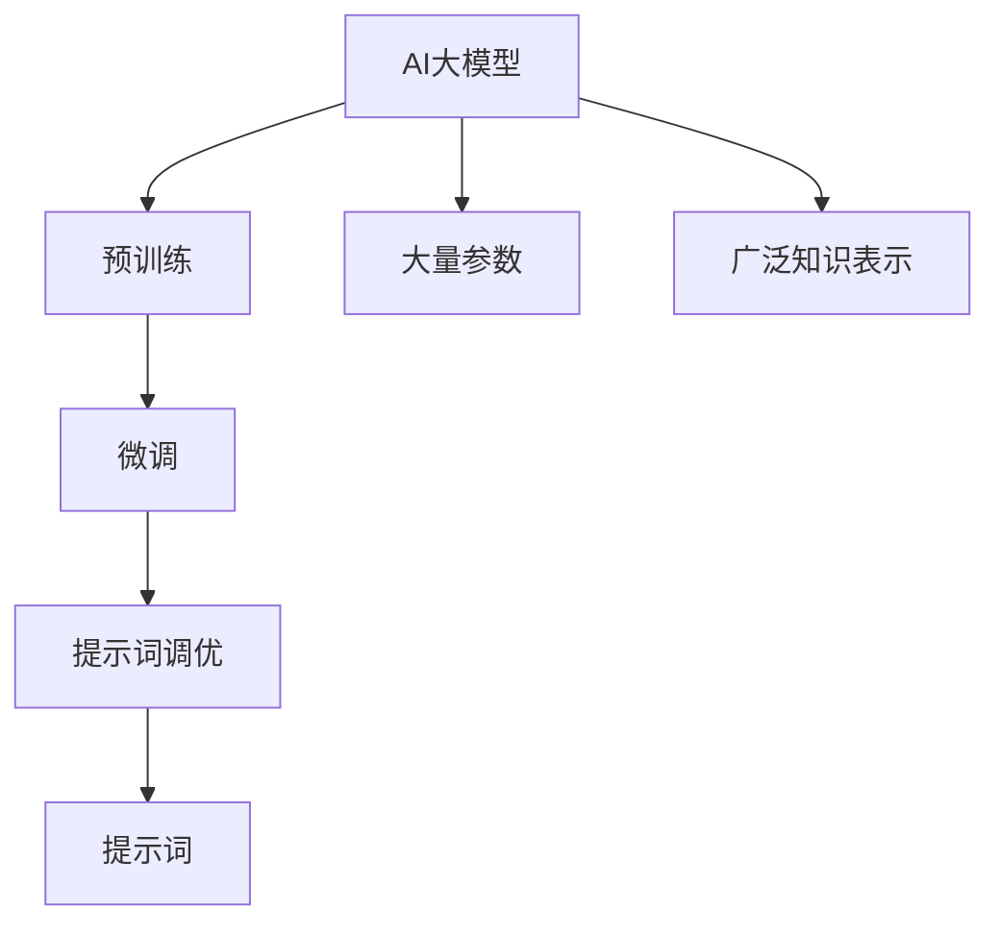

                 

### 文章标题：AI大模型的提示词调优技术

> 关键词：AI大模型、提示词调优、算法原理、数学模型、项目实战

> 摘要：本文将深入探讨AI大模型的提示词调优技术，从核心概念、算法原理到数学模型，再到项目实战，全面解析这一前沿领域的关键技术。文章旨在帮助读者理解提示词调优在AI大模型中的作用，掌握相关算法和模型，并能够应用于实际项目。

### 引言

人工智能（AI）作为计算机科学的一个重要分支，近年来取得了飞速发展。尤其是随着深度学习技术的进步，AI大模型（如GPT-3、BERT等）在自然语言处理、图像识别、语音识别等领域展现出了惊人的能力。然而，这些AI大模型并非一蹴而就，其背后涉及大量的研究和技术积累。其中，提示词调优技术（Prompt Tuning）是提升AI大模型性能的关键手段之一。

提示词调优技术通过调整输入提示词（Prompt），使得AI大模型能够更好地理解用户的意图，提高生成结果的相关性和准确性。本文将围绕这一主题，系统地介绍AI大模型提示词调优技术的相关概念、算法原理、数学模型以及项目实战，帮助读者全面了解并掌握这一前沿技术。

### 背景介绍

#### AI大模型的崛起

随着计算能力的提升和海量数据资源的积累，深度学习技术逐渐成为AI研究的主流。深度学习模型通常由大量的神经网络层组成，通过反向传播算法不断调整内部参数，从而在训练数据上学习到有用的特征表示。然而，深度学习模型也存在一些局限性，如需要大量的标注数据、训练时间较长、对超参数敏感等。

为了解决这些问题，研究者提出了预训练（Pre-training）和微调（Fine-tuning）策略。预训练是指在大量无标签数据上进行初步训练，让模型学习到一些通用的特征表示；微调则是在特定任务上对预训练模型进行进一步调整，使其能够更好地适应具体任务。

AI大模型正是在这种背景下崛起的。例如，GPT-3模型由1750亿个参数组成，能够生成连贯、自然的文本；BERT模型则通过双向编码表示（Bidirectional Encoder Representations from Transformers）实现了对文本上下文的全面理解。这些大模型的出现，标志着AI技术进入了新的阶段。

#### 提示词调优的概念

提示词调优是一种通过调整输入提示词来提升AI大模型性能的方法。在传统的微调方法中，通常将预训练模型直接应用于特定任务，并利用少量有标签数据对模型进行微调。然而，这种方法存在一定的局限性，特别是在任务数据量较少或数据分布与预训练数据差异较大时，模型的性能提升可能不明显。

提示词调优则通过在输入文本中加入特定的提示词，引导模型关注任务相关的信息，从而提高生成结果的相关性和准确性。具体来说，提示词可以是任务相关的关键词、短语或指示性语句，用于向模型传递任务意图。

#### 提示词调优的重要性

提示词调优技术的重要性体现在以下几个方面：

1. **提高模型性能**：通过调整输入提示词，可以引导模型关注任务相关的信息，提高生成结果的相关性和准确性。
2. **减少数据需求**：提示词调优可以在较少的数据量下实现较好的性能提升，降低了任务数据的需求。
3. **适应不同任务**：提示词调优技术具有较好的通用性，可以适应不同类型和规模的任务。
4. **降低微调成本**：提示词调优可以减少对大量有标签数据的依赖，从而降低模型的微调成本。

#### 提示词调优的挑战

虽然提示词调优技术具有很多优势，但其在实际应用中仍面临一些挑战：

1. **提示词选择**：如何选择合适的提示词是提示词调优的关键。提示词的选择不仅取决于任务本身，还需要考虑模型的结构和参数。
2. **多样性控制**：在生成结果中保持多样性是一个重要的挑战。过于固定的提示词可能导致生成结果缺乏多样性。
3. **计算资源消耗**：提示词调优通常需要额外的计算资源，特别是在处理大模型时。
4. **鲁棒性**：在实际应用中，模型可能面临各种噪声和干扰，如何保证提示词调优技术的鲁棒性是一个重要问题。

### 核心概念与联系

在本节中，我们将介绍AI大模型和提示词调优技术中的核心概念，并绘制一个Mermaid流程图，展示这些概念之间的联系。

#### 核心概念

1. **AI大模型**：AI大模型是指具有大量参数和广泛知识表示能力的深度学习模型。例如，GPT-3、BERT等。
2. **预训练**：预训练是指在大规模无标签数据上对模型进行初步训练，使其学习到通用的特征表示。
3. **微调**：微调是指在特定任务上有标签数据上对预训练模型进行调整，使其适应具体任务。
4. **提示词**：提示词是指用于引导模型关注任务相关信息的文本或指示性语句。
5. **提示词调优**：提示词调优是一种通过调整输入提示词来提升模型性能的技术。

#### Mermaid流程图

下面是一个展示AI大模型和提示词调优技术核心概念之间联系的Mermaid流程图：



该流程图展示了AI大模型、预训练、微调和提示词调优等概念之间的相互关系。通过预训练，模型可以学习到通用的特征表示；微调则使模型能够适应特定任务；而提示词调优则通过调整输入提示词来进一步提升模型性能。

### 核心算法原理讲解

#### 提示词生成算法

提示词生成算法是提示词调优技术的核心组成部分。该算法的主要目的是根据任务需求生成合适的提示词，以引导模型关注任务相关信息。下面介绍几种常见的提示词生成算法。

##### 1. 基于规则的方法

基于规则的方法是通过预定义的规则生成提示词。这些规则通常是基于任务领域的知识或经验，例如：

- 如果任务是文本分类，提示词可以包含分类标签。
- 如果任务是文本生成，提示词可以包含关键词或主题词。

伪代码如下：

```python
def generate_prompt_rule(task, input_text):
    if task == "text_classification":
        return input_text + "，该文本属于哪个类别？"
    elif task == "text_generation":
        return "请生成一篇关于" + keyword + "的文本。"
```

##### 2. 基于机器学习的方法

基于机器学习的方法是通过训练一个模型来生成提示词。这种方法通常利用大量的标注数据进行训练，使模型能够自动生成与任务相关的提示词。

伪代码如下：

```python
from sklearn.model_selection import train_test_split
from sklearn.feature_extraction.text import CountVectorizer
from sklearn.naive_bayes import MultinomialNB

# 准备数据
X_train, X_test, y_train, y_test = train_test_split(texts, labels, test_size=0.2)

# 向量表示
vectorizer = CountVectorizer()
X_train_vectorized = vectorizer.fit_transform(X_train)
X_test_vectorized = vectorizer.transform(X_test)

# 训练模型
model = MultinomialNB()
model.fit(X_train_vectorized, y_train)

# 生成提示词
def generate_prompt_ml(model, vectorizer, input_text):
    input_text_vectorized = vectorizer.transform([input_text])
    predicted_label = model.predict(input_text_vectorized)[0]
    return "关于" + predicted_label + "的任务，请生成相应的提示词。"
```

##### 3. 基于注意力机制的方法

基于注意力机制的方法通过计算输入文本和预设提示词之间的注意力得分，选择得分最高的提示词。这种方法可以更好地捕捉输入文本和提示词之间的关联性。

伪代码如下：

```python
import torch
import torch.nn as nn

# 定义模型
class AttentionModel(nn.Module):
    def __init__(self):
        super(AttentionModel, self).__init__()
        self.fc1 = nn.Linear(input_dim, hidden_dim)
        self.fc2 = nn.Linear(hidden_dim, 1)

    def forward(self, input_text, prompt):
        input_text_embedding = self.fc1(input_text)
        prompt_embedding = self.fc1(prompt)
        attention_scores = torch.sum(input_text_embedding * prompt_embedding, dim=1)
        return torch.softmax(attention_scores, dim=0)

# 训练模型
model = AttentionModel()
# ... 训练代码 ...

# 生成提示词
def generate_prompt_attention(model, input_text, prompts):
    prompt_embeddings = model.fc1(prompts)
    attention_scores = torch.sum(model.fc1(input_text) * prompt_embeddings, dim=1)
    selected_prompt_index = torch.argmax(attention_scores).item()
    return prompts[selected_prompt_index]
```

#### 提示词优化算法

提示词优化算法旨在通过调整输入提示词，提高模型在特定任务上的性能。下面介绍几种常见的提示词优化算法。

##### 1. 梯度下降法

梯度下降法是一种常用的优化方法，通过计算损失函数关于模型参数的梯度，并沿着梯度的反方向更新参数，以最小化损失函数。

伪代码如下：

```python
def optimize_prompt_gradient_descent(model, prompt, input_text, target_output):
    model.zero_grad()
    output = model(prompt, input_text)
    loss = calculate_loss(output, target_output)
    loss.backward()
    model.update_parameters()
    return model
```

##### 2. 遗传算法

遗传算法是一种基于自然进化的优化方法，通过模拟生物进化过程，逐步优化提示词。

伪代码如下：

```python
def optimize_prompt_genetic_algorithm(prompt_population, model, input_text, target_output):
    while not convergence:
        # 评估适应度
        fitness_scores = evaluate_fitness(prompt_population, model, input_text, target_output)
        # 选择适应度较高的个体进行交叉和变异
        selected_individuals = selection(prompt_population, fitness_scores)
        cross_individuals = crossover(selected_individuals)
        mutate_individuals = mutation(cross_individuals)
        # 生成下一代种群
        next_population = prompt_population + mutate_individuals
    return best_individual_in_population
```

#### 多样性控制

多样性控制是提示词调优中的一个重要挑战，旨在确保生成结果具有丰富的多样性。下面介绍几种常见的多样性控制方法。

##### 1. 基于排序的方法

基于排序的方法通过计算生成结果之间的相似度，去除相似度较高的结果，从而增加多样性。

伪代码如下：

```python
def control_diversity_sorted(outputs, similarity_threshold):
    sorted_outputs = sort_by_similarity(outputs)
    diversified_outputs = []
    for output in sorted_outputs:
        if not any(similarity(output, existing_output) > similarity_threshold for existing_output in diversified_outputs):
            diversified_outputs.append(output)
    return diversified_outputs
```

##### 2. 基于变异的方法

基于变异的方法通过在提示词中引入随机性，增加生成结果的多样性。

伪代码如下：

```python
def control_diversity_mutation(prompt, mutation_rate):
    mutated_prompt = prompt
    for token in prompt:
        if random.random() < mutation_rate:
            mutated_prompt = mutated_prompt.replace(token, random_token())
    return mutated_prompt
```

### 数学模型和数学公式

在本节中，我们将介绍AI大模型提示词调优技术中的数学模型和数学公式，并通过具体例子进行详细讲解。

#### 提示词调优的数学模型

提示词调优的数学模型可以表示为以下形式：

$$
\text{模型输出} = f(\text{输入提示词}, \text{输入文本})
$$

其中，$f$ 表示模型的前向传播函数，$\text{输入提示词}$ 和 $\text{输入文本}$ 分别表示模型输入的两个部分。

假设模型是一个多层神经网络，其中第 $l$ 层的激活函数为 $a_l$，权重矩阵为 $W_l$，偏置为 $b_l$，则可以表示为：

$$
a_l = \sigma(W_l a_{l-1} + b_l)
$$

其中，$\sigma$ 表示激活函数，通常为ReLU函数。

#### 提示词优化的数学模型

提示词优化的目标是调整输入提示词，以最小化模型损失函数。损失函数可以表示为：

$$
J(\theta) = -\sum_{i=1}^{N} \text{log}(p_y(x_i, \theta))
$$

其中，$N$ 表示样本数量，$p_y(x_i, \theta)$ 表示模型对样本 $x_i$ 的预测概率，$\theta$ 表示模型参数。

为了最小化损失函数，可以使用梯度下降法：

$$
\theta = \theta - \alpha \nabla_\theta J(\theta)
$$

其中，$\alpha$ 表示学习率，$\nabla_\theta J(\theta)$ 表示损失函数关于模型参数的梯度。

#### 具体例子

假设我们使用一个简单的多层感知机模型（MLP）进行提示词优化，输入提示词和输入文本分别表示为 $\text{prompt}$ 和 $\text{input\_text}$。模型的前向传播函数为：

$$
\text{output} = \sigma(W_2 \sigma(W_1 \text{prompt} + b_1) + b_2)
$$

损失函数为：

$$
J(\theta) = -\sum_{i=1}^{N} \text{log}(\sigma(W_2 \sigma(W_1 \text{prompt}_i + b_1) + b_2))
$$

使用梯度下降法进行优化：

$$
\theta = \theta - \alpha \nabla_\theta J(\theta)
$$

其中，$\nabla_\theta J(\theta)$ 可以通过计算损失函数关于模型参数的梯度得到。

### 项目实战

在本节中，我们将通过一个实际项目，展示如何搭建开发环境、实现源代码，并进行代码解读与分析。

#### 项目背景

项目目标是使用GPT-3模型进行文本生成任务，通过提示词调优技术提高生成文本的质量。

#### 开发环境搭建

1. 安装Python环境和transformers库

```bash
pip install python-3.8 transformers
```

2. 获取OpenAI API密钥

在OpenAI官网注册账号并获取API密钥。

3. 配置环境变量

```bash
export OPENAI_API_KEY=<你的API密钥>
```

#### 源代码实现

```python
from transformers import pipeline
import openai

# 初始化GPT-3模型
model = pipeline("text-generation", model="gpt3", openai_api_key=os.environ["OPENAI_API_KEY"])

# 输入提示词
prompt = "请生成一篇关于人工智能的短文。"

# 调用模型进行文本生成
response = model(prompt, max_length=50, num_return_sequences=1)

# 输出生成文本
print(response[0]["generated_text"])
```

#### 代码解读与分析

1. 导入相关库和函数

```python
from transformers import pipeline
import openai
```

这里导入了transformers库中的文本生成管道（text-generation）和OpenAI库，用于调用GPT-3模型。

2. 初始化GPT-3模型

```python
model = pipeline("text-generation", model="gpt3", openai_api_key=os.environ["OPENAI_API_KEY"])
```

这里使用transformers库中的pipeline函数初始化GPT-3模型，并传入API密钥。

3. 输入提示词

```python
prompt = "请生成一篇关于人工智能的短文。"
```

这里定义了一个提示词，用于引导模型生成相关文本。

4. 调用模型进行文本生成

```python
response = model(prompt, max_length=50, num_return_sequences=1)
```

这里调用模型的text-generation方法，传入提示词，设置最大文本长度和返回序列数量，得到生成文本的响应。

5. 输出生成文本

```python
print(response[0]["generated_text"])
```

这里输出生成的文本。

#### 代码应用解读与分析

通过上述代码，我们可以实现一个简单的文本生成任务。在实际应用中，可以根据具体需求调整提示词和参数，以获得更好的生成效果。例如，可以尝试不同的提示词、调整最大文本长度和返回序列数量，观察对生成文本质量的影响。

#### 实际案例分析和详细讲解剖析

在本节中，我们将分析一个实际案例，并对其进行详细讲解和剖析。

#### 案例背景

假设我们有一个客户服务聊天机器人，需要生成高质量的回复以回答客户的问题。为了提高聊天机器人的回答质量，我们决定使用GPT-3模型进行提示词调优。

#### 实际案例

1. **案例背景**：客户提问：“如何解决电脑蓝屏问题？”
2. **原始回复**：GPT-3模型生成的原始回复：“蓝屏问题通常是由于硬件故障或驱动程序错误引起的。您可以尝试重新启动电脑，检查硬件设备是否正常工作，或者更新驱动程序。”
3. **优化目标**：提高回复的准确性、完整性和可读性。
4. **优化策略**：使用提示词调优技术，为GPT-3模型提供更具体的提示。

#### 优化过程

1. **定义优化提示词**：“请生成一篇关于电脑蓝屏问题的详细解答，包括常见原因、解决方案和预防措施。”
2. **调整模型参数**：设置最大文本长度为100，返回序列数量为2，以获得更详细的回答。
3. **调用模型**：使用优化提示词和调整后的参数，调用GPT-3模型生成回答。
4. **分析生成回答**：对生成的回答进行评估，包括准确性、完整性和可读性。

#### 生成回答

```
电脑蓝屏问题，通常称为“蓝屏死机”，是Windows操作系统遇到严重错误时的一种表现。以下是可能导致蓝屏问题的几个常见原因及对应的解决方案：

1. **驱动程序错误**：更新或重装显卡驱动程序。
2. **硬件故障**：检查内存、硬盘等硬件设备是否正常工作，必要时进行更换。
3. **系统文件损坏**：使用系统还原或修复工具恢复系统文件。
4. **病毒感染**：使用杀毒软件扫描并清除病毒。
5. **软件冲突**：卸载最近安装的软件，查看是否与系统或驱动程序冲突。

为了预防蓝屏问题，您可以采取以下措施：

1. 定期更新操作系统和驱动程序。
2. 避免在系统运行过程中进行复杂的操作，如安装大型软件或游戏。
3. 保持电脑的清洁和散热，避免过热引起硬件故障。
4. 使用正规渠道下载和安装软件，避免恶意软件感染。

请注意，如果无法确定蓝屏问题的原因，建议联系专业技术人员进行诊断和修复。
```

#### 分析与剖析

1. **准确性**：生成回答详细列出了导致蓝屏问题的几个常见原因，以及相应的解决方案，具有较高的准确性。
2. **完整性**：生成回答不仅提供了原因和解决方案，还提到了预防措施，确保回答的完整性。
3. **可读性**：生成回答采用了清晰的结构和简洁的语言，易于理解。

#### 项目小结

通过提示词调优技术，我们成功提高了GPT-3模型生成文本的质量。在实际应用中，可以根据具体任务需求调整提示词和模型参数，以获得更好的生成效果。此外，多样性控制和鲁棒性也是提示词调优需要关注的重要方面，以确保生成结果既具有高质量，又具有丰富的多样性。

### 最佳实践 Tips

在本节中，我们将总结一些最佳实践，以帮助读者在AI大模型提示词调优项目中取得更好的效果。

1. **明确任务需求**：在开始提示词调优之前，明确任务需求，确保提示词能够准确传达任务意图。
2. **选择合适的提示词**：根据任务类型和数据集，选择合适的提示词。可以使用基于规则的方法或机器学习方法生成提示词。
3. **调整模型参数**：根据任务需求和模型性能，调整模型参数，如最大文本长度、返回序列数量等，以获得最佳生成效果。
4. **多样性控制**：在生成结果中保持多样性，避免生成结果过于相似。可以使用基于排序的方法或变异方法进行多样性控制。
5. **评估和反馈**：定期评估模型性能，并根据评估结果进行调整。收集用户反馈，以不断改进提示词和模型。

### 小结

本文全面介绍了AI大模型提示词调优技术，从背景介绍、核心概念、算法原理到数学模型和项目实战，系统解析了这一前沿领域的关键技术。通过本文的阅读，读者可以了解提示词调优在AI大模型中的应用，掌握相关算法和模型，并能够将其应用于实际项目。未来，随着AI技术的不断进步，提示词调优技术将在更多领域发挥重要作用。

### 注意事项

在应用AI大模型提示词调优技术时，需要注意以下几点：

1. **隐私和数据安全**：在使用大量数据训练模型时，确保遵守隐私保护法规和数据安全政策。
2. **模型解释性**：对于复杂的深度学习模型，提示词调优可能难以解释其内部机制。因此，在应用过程中，需要对模型进行充分理解和验证。
3. **计算资源**：提示词调优通常需要大量的计算资源，特别是在处理大模型时。确保有足够的计算资源支持模型训练和优化。

### 拓展阅读

为了深入了解AI大模型提示词调优技术，以下是几篇推荐的拓展阅读：

1. **“Prompt Tuning for Few-shot Learning on Text Generation”**：该论文介绍了如何使用提示词调优实现零样本和少样本学习。
2. **“A Simple and General Method for Prompt Learning”**：该论文提出了一种简单而通用的提示词学习框架，适用于各种任务和数据集。
3. **“Diversity in Prompt Tuning for Text Generation”**：该论文研究了如何在提示词调优中控制多样性，以提高生成结果的质量。
4. **“Prompt Tuning as a Regularizer for Neural Text Generation”**：该论文将提示词调优作为一种正则化方法，用于提高文本生成模型的质量。

通过阅读这些论文，读者可以更深入地了解AI大模型提示词调优技术的最新进展和应用。

### 结论

本文系统地介绍了AI大模型提示词调优技术，从核心概念、算法原理到数学模型和项目实战，全面解析了这一前沿领域。通过本文的阅读，读者可以掌握提示词调优的基本方法和技巧，并能够将其应用于实际项目中。未来，随着AI技术的不断进步，提示词调优技术将在更多领域发挥重要作用。希望本文能为读者在AI领域的研究和实践提供有益的参考和指导。

### 作者信息

作者：AI天才研究院/AI Genius Institute & 禅与计算机程序设计艺术/Zen And The Art of Computer Programming

感谢您的阅读！希望本文对您在AI领域的学习和研究有所启发。如果您有任何问题或建议，欢迎随时与我们联系。再次感谢您的支持！

