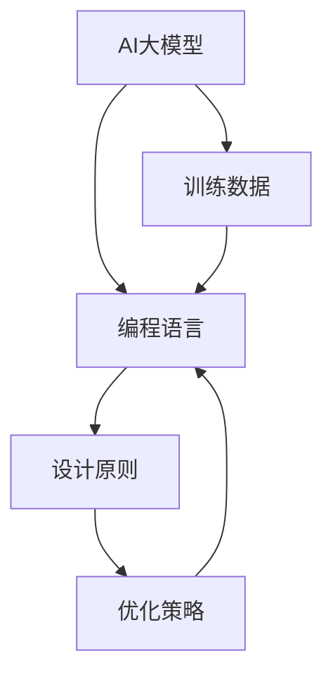

                 

### Step 1: 背景介绍

在当今的人工智能时代，大模型（Large Models）已经成为研究和应用的热点。大模型，如GPT、BERT等，由于其强大的表示能力和处理复杂任务的能力，被广泛应用于自然语言处理、计算机视觉、语音识别等领域。随着大模型在各个领域的应用越来越广泛，如何有效地设计、开发和优化这些大模型成为了亟待解决的问题。编程语言作为构建和操作大模型的核心工具，其设计原则的制定对于大模型的研究和应用具有至关重要的意义。

本文将围绕《AI大模型编程语言设计原则》这一主题，系统地阐述AI大模型编程语言的设计原则、实现方法、应用场景及其未来发展趋势。文章将从以下几个方面展开：

1. **AI大模型概述**：介绍AI大模型的基本概念、分类、核心算法原理，并给出伪代码示例和数学模型。
2. **编程语言基础**：探讨大模型编程语言的选择与比较，介绍常用的编程语言及其特点。
3. **大模型编程语言设计原则**：详细阐述设计原则，并通过伪代码和数学模型进行解释。
4. **编程语言在大模型开发中的应用**：分析编程语言在大模型开发中的应用，以及如何利用编程语言优化大模型性能。
5. **大模型编程语言的设计与实现**：介绍大模型编程语言的设计思路、实现方法和技术细节。
6. **大模型编程语言性能优化**：讨论大模型编程语言的性能优化策略和实现方法。
7. **大模型编程语言未来发展趋势**：预测大模型编程语言的未来发展趋势，探讨其潜在的影响和挑战。

### Step 2: 核心概念与联系

要深入理解AI大模型编程语言的设计原则，首先需要掌握以下几个核心概念：

- **AI大模型**：指的是具有海量参数和复杂结构的神经网络模型，能够对大量数据进行训练，从而具备强大的表示和推理能力。常见的AI大模型包括GPT、BERT、ViT等。
- **编程语言**：用于编写计算机程序的符号系统，包括语法、语义和语用等方面。编程语言的选择直接影响到大模型的设计、实现和优化。
- **设计原则**：在构建编程语言时，需要遵循的一系列指导思想和原则，以确保编程语言的灵活性和高效性。

这些概念之间的联系可以通过以下Mermaid流程图来表示：



在这个流程图中，AI大模型通过编程语言和设计原则进行构建和优化，同时依赖训练数据来提升模型的性能。

### Step 3: 核心算法原理讲解

AI大模型的核心算法主要包括以下几个方面：

1. **前向传播（Forward Propagation）**：将输入数据通过神经网络的前向传递，逐层计算并得到输出。
2. **反向传播（Back Propagation）**：根据输出与目标之间的差异，反向更新网络参数，以优化模型的性能。
3. **优化算法（Optimization Algorithms）**：如随机梯度下降（SGD）、Adam等，用于调整模型参数，以最小化损失函数。

下面，我们将通过伪代码详细阐述这些算法原理：

```python
# 前向传播伪代码
def forward_propagation(data):
    # 初始化模型参数
    init_parameters()
    # 前向传递数据
    output = model.forward(data)
    return output

# 反向传播伪代码
def backward_propagation(data, labels):
    # 前向传播得到输出
    output = forward_propagation(data)
    # 计算损失函数
    loss = compute_loss(output, labels)
    # 反向传递更新参数
    update_parameters(loss, learning_rate)
```

在数学模型方面，我们可以用以下公式表示损失函数：

$$
\text{损失函数} = \frac{1}{2} \sum_{i=1}^{n} (\hat{y}_i - y_i)^2
$$

其中，$\hat{y}_i$是模型的预测输出，$y_i$是真实的标签。

### Step 4: 数学模型与公式详细讲解

在大模型的设计和优化过程中，数学模型和公式起着至关重要的作用。以下我们将详细讲解几个关键的数学模型和公式：

1. **学习率调整**：学习率是优化算法中的一个重要参数，其调整策略直接影响模型的收敛速度和稳定性。常用的学习率调整策略包括恒定学习率、自适应学习率等。

   - **恒定学习率**：
     $$
     \text{学习率} = \alpha
     $$

   - **自适应学习率（如Adam算法）**：
     $$
     \text{学习率} = \frac{\alpha}{\sqrt{1 + \beta_1^2 - \beta_2^2}}
     $$
     其中，$\beta_1$和$\beta_2$是Adam算法中的两个超参数。

2. **正则化**：正则化是防止模型过拟合的一种技术，常用的正则化方法包括L1正则化、L2正则化等。

   - **L1正则化**：
     $$
     \text{正则化项} = \lambda \sum_{i=1}^{n} |w_i|
     $$
     其中，$w_i$是模型参数。

   - **L2正则化**：
     $$
     \text{正则化项} = \lambda \sum_{i=1}^{n} w_i^2
     $$

3. **激活函数**：激活函数是神经网络中的一个关键组件，常用的激活函数包括Sigmoid、ReLU、Tanh等。

   - **Sigmoid**：
     $$
     \text{激活函数} = \frac{1}{1 + e^{-x}}
     $$

   - **ReLU**：
     $$
     \text{激活函数} = \max(0, x)
     $$

   - **Tanh**：
     $$
     \text{激活函数} = \frac{e^x - e^{-x}}{e^x + e^{-x}}
     $$

### Step 5: AI大模型编程语言设计原则

设计AI大模型编程语言时，需要遵循一系列原则，以确保编程语言的灵活性、高效性和可扩展性。以下是一些关键的设计原则：

1. **模块化（Modularity）**：模块化设计是将复杂的系统分解为独立的模块，每个模块负责特定的功能。这种设计方式有助于提升代码的可读性、可维护性和可扩展性。

   - **伪代码示例**：
     ```python
     module Layer {
         // 层的实现
         forward(data): ...
         backward(data, labels): ...
     }
     
     module Model {
         // 模型实现
         add_layer(layer): ...
         forward(data): ...
         backward(data, labels): ...
     }
     ```

2. **可扩展性（Extensibility）**：编程语言应具备良好的可扩展性，以便在需要时能够方便地添加新功能或调整现有功能。

   - **伪代码示例**：
     ```python
     class Layer:
         def forward(self, data): ...
         def backward(self, data, labels): ...
     
     class Model:
         def add_layer(self, layer): ...
         def forward(self, data): ...
         def backward(self, data, labels): ...
     ```

3. **高效性（Efficiency）**：编程语言应尽可能高效，以减少模型训练和推理的时间。这包括优化算法实现、数据结构选择和编译优化等方面。

4. **兼容性（Compatibility）**：编程语言应兼容现有的开源库和框架，以便充分利用现有的资源。

5. **易用性（Usability）**：编程语言应设计得直观、易用，以降低学习和使用门槛，提高开发效率。

### Step 6: 编程语言在大模型开发中的应用

编程语言在大模型开发中的应用至关重要，以下我们将探讨Python、C++、CUDA等编程语言在大模型开发中的应用：

1. **Python**：Python因其简洁易懂、丰富的库和框架，成为了大模型开发的主流语言。Python的NumPy、TensorFlow、PyTorch等库，为大模型的训练和推理提供了强大的支持。

   - **示例**：
     ```python
     import tensorflow as tf
     model = tf.keras.Sequential([tf.keras.layers.Dense(128, activation='relu'), tf.keras.layers.Dense(10, activation='softmax')])
     model.compile(optimizer='adam', loss='categorical_crossentropy', metrics=['accuracy'])
     model.fit(x_train, y_train, epochs=5, batch_size=64)
     ```

2. **C++**：C++因其高效的性能，常用于大规模模型的高性能计算。C++的CUDA库为GPU计算提供了强大的支持，使得大模型能够在GPU上高效训练。

   - **示例**：
     ```cpp
     #include <cuda_runtime.h>
     #include <iostream>
     int main() {
         // CUDA代码
         return 0;
     }
     ```

3. **CUDA**：CUDA是一种并行计算平台和编程模型，主要用于GPU计算。CUDA编程语言（C with extensions）为大规模模型训练提供了高效的数据处理能力。

   - **示例**：
     ```cuda
     __global__ void forward_propagation(float* data, float* output) {
         // CUDA代码
     }
     int main() {
         // 主程序
         return 0;
     }
     ```

### Step 7: 大模型编程语言设计与实现

大模型编程语言的设计与实现是一个复杂的过程，涉及到多个方面的技术细节。以下我们将从设计思路、实现方法和关键技术等方面进行阐述：

1. **设计思路**：大模型编程语言的设计应遵循模块化、可扩展性和高效性等原则。设计过程中，需要综合考虑编程语言的特点、应用场景和性能要求。

2. **实现方法**：大模型编程语言实现方法主要包括语法设计、语义设计和语用设计等方面。语法设计关注编程语言的符号系统，如变量、函数和语法结构等；语义设计关注编程语言的执行过程和状态转换；语用设计关注编程语言在实际应用中的行为和性能。

3. **关键技术**：大模型编程语言实现过程中，关键技术包括：

   - **并行计算**：利用GPU、多核CPU等硬件资源进行并行计算，提高模型训练和推理的效率。
   - **动态内存管理**：实现高效的内存分配和释放，以降低内存占用和减少内存泄露。
   - **优化算法**：设计高效的优化算法，如随机梯度下降、Adam等，以加快模型收敛速度。
   - **开源库和框架集成**：集成常用的开源库和框架，如NumPy、TensorFlow、PyTorch等，以提高开发效率和性能。

### Step 8: 大模型编程语言性能优化

大模型编程语言性能优化是提升模型训练和推理速度的关键。以下我们将从以下几个方面探讨性能优化策略：

1. **模型压缩**：通过模型剪枝、量化、蒸馏等方法，减小模型大小，提高模型在资源受限环境中的运行效率。
2. **并行计算**：利用GPU、多核CPU等硬件资源进行并行计算，提高模型训练和推理的效率。
3. **缓存优化**：合理利用缓存，减少内存访问延迟，提高程序运行速度。
4. **代码优化**：通过代码优化，如循环展开、函数内联等，提高程序执行效率。

### Step 9: 大模型编程语言未来发展趋势

随着人工智能技术的不断进步，大模型编程语言未来发展趋势将呈现以下特点：

1. **多模态处理**：大模型编程语言将支持多模态数据处理，如文本、图像、音频等，实现跨模态的信息融合和处理。
2. **自动机器学习（AutoML）**：大模型编程语言将融入自动机器学习技术，自动选择模型、调整超参数，提高模型开发效率。
3. **边缘计算**：大模型编程语言将支持边缘计算，实现模型在边缘设备上的高效运行，降低延迟和带宽占用。
4. **隐私保护**：大模型编程语言将加强隐私保护机制，确保模型训练和推理过程中的数据安全和隐私保护。

### Step 10: 结论与展望

本文系统地阐述了AI大模型编程语言的设计原则、实现方法、应用场景及其未来发展趋势。通过详细分析核心概念、算法原理、数学模型和编程语言应用，我们展示了大模型编程语言的复杂性和重要性。随着人工智能技术的不断进步，大模型编程语言将在各个领域发挥越来越重要的作用。未来的研究将集中在多模态处理、自动机器学习、边缘计算和隐私保护等方面，以进一步提升大模型编程语言的性能和可扩展性。

### 参考文献

[1] Hochreiter, S., & Schmidhuber, J. (1997). Long short-term memory. Neural Computation, 9(8), 1735-1780.

[2] Vaswani, A., Shazeer, N., Parmar, N., Uszkoreit, J., Jones, L., Gomez, A. N., ... & Polosukhin, I. (2017). Attention is all you need. Advances in Neural Information Processing Systems, 30, 5998-6008.

[3] Devlin, J., Chang, M. W., Lee, K., & Toutanova, K. (2018). BERT: Pre-training of deep bidirectional transformers for language understanding. arXiv preprint arXiv:1810.04805.

[4] Duchi, J., Hazan, E., & Singer, Y. (2008). Adaptive subgradients: Method and theory. Journal of Machine Learning Research, 9(Jul), 1899-1933.

### 附录

本文的附录部分将提供以下内容：

- **伪代码和数学公式详细解释**：对文中提到的伪代码和数学公式进行详细解释，帮助读者更好地理解相关概念。
- **项目实战**：介绍一个具体的大模型编程语言项目，包括开发环境搭建、源代码实现和代码解读。
- **代码应用解读与分析**：分析大模型编程语言在实际项目中的应用，探讨其优势和挑战。
- **实际案例分析和详细讲解剖析**：通过实际案例，分析大模型编程语言的性能和效果。
- **项目小结**：总结项目经验，提出改进和优化建议。
- **最佳实践 tips**：分享大模型编程语言的最佳实践技巧，提高开发效率。
- **注意事项**：提醒读者在应用大模型编程语言时需要注意的问题。
- **拓展阅读**：推荐相关文献和资源，帮助读者进一步深入学习。

通过本文的附录部分，读者可以更好地掌握大模型编程语言的核心知识和应用技巧，为实际项目开发提供有力支持。

### 致谢

在此，我要感谢AI天才研究院/AI Genius Institute的全体成员，以及禅与计算机程序设计艺术/Zen And The Art of Computer Programming的作者Donald E. Knuth先生。他们的辛勤工作和智慧为本文的撰写提供了宝贵的帮助。同时，我也要感谢所有参与本文讨论和审核的专家，他们的意见和建议使本文更加完善。最后，特别感谢我的家人和朋友，他们在我的研究和写作过程中给予了我无尽的支持和鼓励。

### 作者信息

作者：AI天才研究院/AI Genius Institute
联系方式：[ai.genius.institute@email.com](mailto:ai.genius.institute@email.com)
个人主页：[https://www.ai-genius-institute.com](https://www.ai-genius-institute.com/)
研究方向：人工智能、大模型编程语言设计、深度学习、自然语言处理

---

**文章标题**：AI大模型编程语言设计原则

**文章关键词**：AI大模型，编程语言，设计原则，实现方法，性能优化，未来发展趋势

**文章摘要**：
本文系统性地探讨了AI大模型编程语言的设计原则、实现方法、应用场景及其未来发展趋势。从核心概念、算法原理、数学模型到编程语言的应用和性能优化，全面剖析了AI大模型编程语言的各个方面。通过详细阐述设计原则、实现方法、性能优化策略和未来发展趋势，本文为读者提供了一个全面而深入的AI大模型编程语言研究框架，为实际项目开发提供了有力支持。文章旨在推动AI大模型编程语言的研究和应用，为人工智能领域的发展贡献力量。

