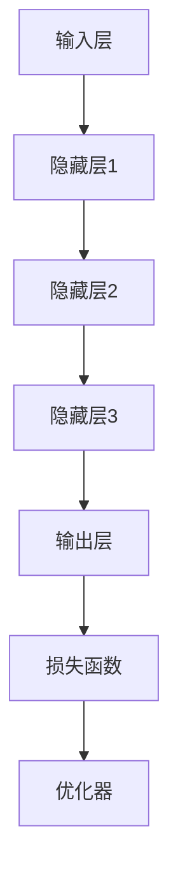

                 

# 文章标题

《AI大模型编程：提示词的力量与前景》

关键词：AI大模型，提示词，编程，深度学习，应用场景，前景展望

摘要：本文将深入探讨AI大模型编程的核心要素——提示词，分析其在AI大模型中的力量与前景。文章将首先介绍AI大模型的基础知识，然后深入解析核心算法原理，详细讲解数学模型与公式，并通过项目实战来展示AI大模型编程的实际应用。最后，本文将展望AI大模型的未来发展，以及其带来的影响与挑战。

----------------------------------------------------------------

## 第一部分: AI大模型基础知识

### 第1章: AI大模型概述

#### 1.1 提示词的力量

提示词（Prompts）在AI大模型中扮演着至关重要的角色。它们是用户与AI大模型交互的桥梁，通过提示词，用户可以引导AI大模型完成特定的任务。提示词的力量在于它们能够激发AI大模型内部的神经网络，使其产生预期输出。

在自然语言处理领域，提示词常常是一个关键短语或问题，用来引导模型生成相应的文本。例如，在问答系统中，提示词可能是用户提出的问题，模型需要基于这个问题生成相应的答案。

在计算机视觉领域，提示词可能是一个目标描述或场景标签，模型需要识别或分类图像中的目标。

#### 1.2 AI大模型的基本概念

AI大模型是指具有大规模参数和复杂结构的机器学习模型。它们通常通过深度学习技术进行训练，能够处理大量的数据和复杂的任务。AI大模型的基本概念包括：

- **深度学习**：一种机器学习技术，通过多层神经网络进行模型训练，能够自动提取数据中的特征。

- **神经网络**：由大量神经元组成的计算模型，通过调整神经元之间的连接权重来实现数据分类、预测等任务。

- **大规模参数**：AI大模型通常具有数百万甚至数十亿个参数，这些参数在训练过程中不断调整，以优化模型性能。

#### 1.3 AI大模型的架构

AI大模型的架构通常包括以下几个部分：

- **输入层**：接收外部数据，例如文本、图像等。

- **隐藏层**：通过神经网络进行数据处理和特征提取。

- **输出层**：产生预测或生成输出。

- **损失函数**：用于评估模型预测与实际输出之间的差异，指导模型调整参数。

- **优化器**：用于调整模型参数，以最小化损失函数。



### 第2章: AI大模型的核心算法

#### 2.1 神经网络基础

神经网络是AI大模型的核心组成部分。它由大量神经元（节点）组成，每个神经元通过加权连接与其他神经元相连。神经元的输出通过激活函数进行处理，最终产生模型的输出。

神经元的工作原理如下：

1. **输入**：每个神经元接收多个输入信号，每个输入信号都有相应的权重。
   
2. **加权求和**：将所有输入信号乘以其权重，然后求和。

3. **激活函数**：对加权求和的结果进行非线性转换，以产生神经元的输出。

常用的激活函数包括：

- **sigmoid函数**：将输出映射到（0,1）之间。
- **ReLU函数**：当输入为负时，输出为0；当输入为正时，输出为输入本身。
- **tanh函数**：将输出映射到（-1,1）之间。

#### 2.2 深度学习优化算法

在深度学习中，优化算法用于调整模型的参数，以最小化损失函数。以下是几种常用的优化算法：

1. **梯度下降算法**：通过迭代更新模型参数，以最小化损失函数。其更新公式为：

   $$\theta = \theta - \alpha \cdot \nabla_\theta J(\theta)$$

   其中，$\theta$表示模型参数，$J(\theta)$表示损失函数，$\alpha$为学习率。

2. **动量优化算法**：在梯度下降的基础上，引入动量项，以加速收敛。其更新公式为：

   $$v = \beta \cdot v + (1 - \beta) \cdot \nabla_\theta J(\theta)$$
   $$\theta = \theta - \alpha \cdot v$$

   其中，$v$为动量项，$\beta$为动量因子。

3. **Adam优化算法**：结合了AdaGrad和RMSProp的优点，具有自适应学习率。其更新公式为：

   $$m = \beta_1 \cdot m + (1 - \beta_1) \cdot \nabla_\theta J(\theta)$$
   $$v = \beta_2 \cdot v + (1 - \beta_2) \cdot (\nabla_\theta J(\theta))^2$$
   $$\theta = \theta - \alpha \cdot \frac{m}{\sqrt{v} + \epsilon}$$

   其中，$m$和$v$分别为一阶和二阶矩估计，$\beta_1$和$\beta_2$为矩估计的指数衰减率，$\epsilon$为小数常数。

#### 2.3 自适应优化算法

自适应优化算法能够根据模型在不同阶段的表现，自动调整学习率，以优化模型训练效果。以下是几种常见的自适应优化算法：

1. **AdaGrad算法**：根据每个参数的历史梯度平方的平均值来自适应调整学习率。其更新公式为：

   $$\theta = \theta - \frac{\alpha}{\sqrt{G}} \cdot \nabla_\theta J(\theta)$$

   其中，$G$为每个参数的梯度平方和。

2. **RMSProp算法**：类似于AdaGrad，但使用梯度平方的指数加权移动平均。其更新公式为：

   $$\theta = \theta - \frac{\alpha}{\sqrt{G}} \cdot \nabla_\theta J(\theta)$$

   其中，$G$为每个参数的梯度平方和。

3. **Adam算法**：结合了AdaGrad和RMSProp的优点，使用一阶和二阶矩估计来自适应调整学习率。其更新公式已在前面介绍。

## 第3章: AI大模型训练技术

### 3.1 数据预处理

在AI大模型训练过程中，数据预处理是非常重要的一步。良好的数据预处理可以显著提高模型训练效果。以下是几种常见的数据预处理技术：

1. **数据清洗**：去除数据中的噪声和异常值，以确保数据质量。

2. **数据归一化**：将数据缩放到相同的范围，以消除不同特征之间的量纲差异。

3. **数据增强**：通过图像旋转、缩放、剪裁等操作，增加数据的多样性，提高模型泛化能力。

### 3.2 训练策略

在AI大模型训练过程中，选择合适的训练策略可以加速模型收敛，提高模型性能。以下是几种常用的训练策略：

1. **学习率调度**：根据训练过程中的模型性能，动态调整学习率。

2. **模型选择**：根据任务需求，选择合适的模型结构。

3. **批量大小**：调整批量大小，以平衡计算效率和模型收敛速度。

### 3.3 调优技巧

在AI大模型训练过程中，调优技巧可以进一步优化模型性能。以下是几种常见的调优技巧：

1. **模型正则化**：通过在损失函数中添加正则化项，防止模型过拟合。

2. **模型压缩**：通过剪枝、量化等技术，减小模型大小，提高模型部署效率。

## 第4章: AI大模型应用场景

### 4.1 自然语言处理

自然语言处理（NLP）是AI大模型的重要应用领域。以下是一些常见的NLP任务：

1. **文本分类**：将文本数据分类到预定义的类别中。

2. **机器翻译**：将一种语言的文本翻译成另一种语言。

3. **问答系统**：根据用户提出的问题，生成相应的答案。

### 4.2 计算机视觉

计算机视觉是AI大模型的另一个重要应用领域。以下是一些常见的计算机视觉任务：

1. **图像分类**：将图像分类到预定义的类别中。

2. **目标检测**：检测图像中的目标，并标注其位置。

3. **图像生成**：根据文本描述生成相应的图像。

### 4.3 强化学习

强化学习是一种通过奖励信号来训练模型的技术。以下是一些常见的强化学习应用：

1. **游戏AI**：训练模型在游戏中实现智能行为。

2. **机器人导航**：训练模型在复杂环境中实现自主导航。

3. **推荐系统**：根据用户历史行为推荐相关内容。

## 第5章: AI大模型编程实践

### 5.1 环境搭建

在开始AI大模型编程之前，需要搭建一个合适的编程环境。以下是Python编程环境的搭建步骤：

1. **安装Python**：从官方网站下载并安装Python。

2. **安装Jupyter Notebook**：通过pip命令安装Jupyter Notebook。

3. **安装TensorFlow或PyTorch**：通过pip命令安装TensorFlow或PyTorch。

### 5.2 代码实战

在本节中，我们将通过一个简单的示例来展示AI大模型编程的实践过程。以下是文本分类任务的实现步骤：

1. **数据准备**：加载数据集，并进行预处理。

2. **模型搭建**：定义模型结构，包括输入层、隐藏层和输出层。

3. **模型训练**：使用训练数据训练模型。

4. **模型评估**：使用测试数据评估模型性能。

5. **模型部署**：将模型部署到生产环境。

以下是文本分类任务的伪代码：

```python
import tensorflow as tf

# 数据准备
train_data, test_data = load_data()

# 模型搭建
model = tf.keras.Sequential([
    tf.keras.layers.Embedding(input_dim=vocabulary_size, output_dim=embedding_dim),
    tf.keras.layers.Flatten(),
    tf.keras.layers.Dense(units=num_classes, activation='softmax')
])

# 模型训练
model.compile(optimizer='adam', loss='categorical_crossentropy', metrics=['accuracy'])
model.fit(train_data, epochs=num_epochs)

# 模型评估
test_loss, test_accuracy = model.evaluate(test_data)
print(f"Test accuracy: {test_accuracy}")

# 模型部署
deploy_model(model)
```

### 5.3 项目小结

在本章中，我们介绍了AI大模型编程的基本概念和实践过程。通过一个简单的文本分类任务，我们展示了如何搭建环境、实现模型、训练模型、评估模型和部署模型。这些实践步骤为读者提供了一个入门级别的指南，帮助他们开始自己的AI大模型编程之旅。

## 第6章: AI大模型前景展望

### 6.1 AI大模型的未来发展趋势

AI大模型在未来的发展趋势主要包括以下几个方面：

1. **计算能力提升**：随着硬件技术的发展，计算能力将得到显著提升，使得AI大模型可以处理更加复杂的任务。

2. **数据量增加**：随着互联网和大数据技术的发展，数据量将不断增加，为AI大模型提供更多的训练数据。

3. **模型压缩与优化**：为了提高AI大模型的部署效率和性能，模型压缩与优化技术将成为研究的热点。

### 6.2 AI大模型的影响与挑战

AI大模型的发展将对社会、经济和技术领域产生深远的影响，同时也面临一系列挑战：

1. **对人类职业的影响**：AI大模型的发展可能导致某些职业的失业，但同时也创造了新的就业机会。

2. **道德与伦理问题**：AI大模型在道德和伦理方面可能引发争议，如隐私保护、算法偏见等。

3. **数据隐私与安全**：随着AI大模型对数据的依赖性增加，数据隐私与安全问题将变得更加重要。

## 第7章: AI大模型开发工具与资源

### 7.1 开发工具

AI大模型开发常用的工具包括：

1. **TensorFlow**：Google开发的开源机器学习框架，支持多种深度学习模型。

2. **PyTorch**：Facebook开发的开源机器学习框架，具有灵活的动态计算图。

3. **JAX**：Google开发的开源数值计算库，支持自动微分和高效计算。

### 7.2 资源

AI大模型开发资源包括：

1. **开源代码与库**：如TensorFlow、PyTorch等框架的官方网站提供了大量的开源代码和库。

2. **学术论文与报告**：学术期刊和会议论文是了解AI大模型最新研究进展的重要途径。

3. **在线课程与教程**：在线教育平台如Coursera、Udacity等提供了丰富的AI大模型编程课程。

## 总结

AI大模型编程是一个充满挑战和机遇的领域。通过本文的讨论，我们了解了AI大模型的基础知识、核心算法、训练技术、应用场景和未来发展趋势。希望本文能为您在AI大模型编程领域提供有益的指导和启示。

## 作者信息

作者：AI天才研究院/AI Genius Institute & 禅与计算机程序设计艺术 /Zen And The Art of Computer Programming

本文版权归AI天才研究院所有，未经授权不得转载。如有疑问，请联系AI天才研究院。

