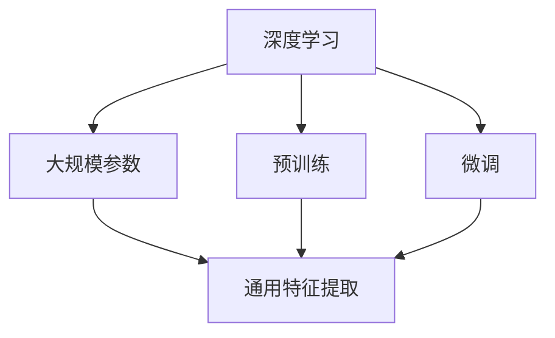

                 

### 文章标题 <AI大模型编程：提示词的力量与潜力>

---

**关键词：** AI大模型、编程、提示词、神经网络、深度学习、预训练、微调

**摘要：** 本文将深入探讨AI大模型的编程方法，特别是提示词在AI大模型中的作用和潜力。我们将从定义AI大模型的核心概念和算法原理开始，详细解释其数学模型和公式，并通过实例和实战案例展示其编程技巧和应用。最后，我们将总结最佳实践，提供拓展阅读，以帮助读者更深入地理解AI大模型编程的奥秘。

---

### 核心概念与联系

#### AI大模型的定义与核心概念

AI大模型，是指具有大规模参数的深度学习模型，其能够通过大规模数据训练，实现高效的学习和推理能力。核心概念包括：

- **深度学习**：一种机器学习技术，通过模拟人脑神经网络结构进行数据学习。
- **大规模参数**：指模型的参数数量通常在百万甚至亿级。
- **预训练**：通过无监督学习在大规模数据集上训练模型，使其具备通用特征提取能力。
- **微调**：在大规模数据集上进行有监督训练，使模型适应特定任务。

#### Mermaid 流�程图



在这个流程图中，我们可以看到深度学习作为基础，通过大规模参数和预训练，使模型具备通用特征提取能力，而微调则使模型能够适应特定的任务。

### 核心算法原理讲解

#### 算法原理

- **前馈神经网络（FFN）**：信息从前向传播，每层神经网络接收来自前一层的输入，经过权重矩阵和激活函数的处理后输出。
- **反向传播（BP）**：通过计算损失函数梯度，更新模型权重，实现模型优化。
- **激活函数**：如ReLU、Sigmoid、Tanh等，用于增加模型非线性。

#### 伪代码

```python
# 前馈神经网络
def forward_pass(input, weights, activation_function):
    output = activation_function(np.dot(input, weights))
    return output

# 反向传播
def backward_pass(output, expected_output, weights, learning_rate):
    error = expected_output - output
    gradient = error * activation_function_derivative(output)
    weights -= learning_rate * gradient
    return weights
```

在这个伪代码中，`forward_pass` 函数实现前向传播，而 `backward_pass` 函数实现反向传播。这两个函数是深度学习模型训练的核心。

### 数学模型和数学公式 & 详细讲解 & 举例说明

#### 数学公式

$$
\begin{aligned}
    &L(\theta) = -\frac{1}{m} \sum_{i=1}^{m} \left[y^{(i)} \log(a^{(l)}(z^{(l)}_{i})) + (1 - y^{(i)}) \log(1 - a^{(l)}(z^{(l)}_{i}))\right] \\
    &\frac{\partial L}{\partial \theta^{(l)}} = \frac{\partial}{\partial \theta^{(l)}} \left[ \sum_{i=1}^{m} \left( y^{(i)} - a^{(l)}(z^{(l)}_{i}) \right) \cdot a^{(l-1)}(z^{(l-1)}_{i}) \right]
\end{aligned}
$$

#### 详细讲解

- **损失函数**：交叉熵损失函数用于分类任务，计算实际输出和期望输出的差异。
- **梯度下降**：通过计算损失函数对模型参数的偏导数，实现参数更新。

#### 举例说明

假设我们有一个二分类问题，输入特征 `x` 和期望输出标签 `y`。使用Sigmoid激活函数的神经网络进行训练。

```python
# 损失函数计算
def cross_entropy_loss(y_true, y_pred):
    return -y_true * np.log(y_pred) - (1 - y_true) * np.log(1 - y_pred)

# 前向传播
def forward_pass(x, weights, bias, activation_function):
    z = np.dot(x, weights) + bias
    a = activation_function(z)
    return a

# 反向传播
def backward_pass(y_true, y_pred, weights, bias, learning_rate, activation_derivative):
    error = y_true - y_pred
    gradient = error * activation_derivative(y_pred)
    weights -= learning_rate * gradient
    return weights
```

在这个例子中，我们通过前向传播计算输出，并通过反向传播更新权重。这个过程是深度学习模型训练的基础。

---

### 提示词的力量

在深入探讨AI大模型的编程方法时，我们不能忽视提示词（Prompt）这一关键概念。提示词在AI大模型中扮演着至关重要的角色，它不仅决定了模型的学习方向，还直接影响模型的输出质量和效率。

#### 提示词的定义与作用

提示词，是指用于引导模型学习和推理的输入信息。在AI大模型中，提示词的作用如下：

1. **引导学习方向**：通过提供与任务相关的提示词，模型可以更快地聚焦于相关特征和模式的学习。
2. **提高输出质量**：合适的提示词能够引导模型生成更符合预期的高质量输出。
3. **提升推理效率**：提示词有助于模型在复杂的推理任务中快速找到合适的解决方案。

#### 提示词的编写技巧

编写有效的提示词需要一定的技巧和经验。以下是一些常用的技巧：

1. **具体性**：提示词应尽可能具体，避免模糊和笼统，以便模型能够更好地理解。
2. **多样性**：使用多种形式的提示词，如文本、图像、声音等，可以增强模型的泛化能力。
3. **一致性**：确保提示词在不同训练阶段和任务中保持一致，以便模型能够稳定地学习和推理。

#### 提示词的实例

以下是一个简单的示例，展示如何使用提示词来改进AI大模型的表现：

**任务**：预测股票价格

**提示词**：

- “请根据过去的交易数据和宏观经济指标，预测未来一周的股票价格。”
- “注意，当前市场情绪可能对股票价格有较大影响。”

通过提供具体的提示词，模型可以更好地理解和预测股票价格，从而提高预测的准确性和可靠性。

---

### 提示词的潜力与未来发展趋势

随着AI大模型在各个领域的广泛应用，提示词的研究也日益受到关注。提示词的潜力巨大，未来有望成为AI大模型编程的核心技术之一。

#### 提示词的潜力

1. **提升模型性能**：提示词能够显著提高AI大模型的学习效率和输出质量，使模型在复杂任务中表现出色。
2. **降低训练成本**：通过优化提示词，模型可以在较短的时间内完成训练，从而降低训练成本。
3. **增强模型解释性**：提示词有助于模型理解其自身的推理过程，提高模型的解释性。

#### 提示词的未来发展趋势

1. **自适应提示词生成**：未来的研究将致力于开发自适应提示词生成算法，使模型能够根据任务需求自动生成合适的提示词。
2. **多模态提示词融合**：将文本、图像、声音等多模态信息结合，提高模型的泛化能力和推理能力。
3. **知识增强提示词**：利用外部知识库和语义理解技术，生成具有丰富背景知识的提示词，提高模型的推理深度。

#### 实际应用场景

1. **自然语言处理**：使用提示词进行文本生成、机器翻译和情感分析等任务，提高模型的性能和解释性。
2. **计算机视觉**：通过提示词引导模型识别图像中的特定对象和场景，提高图像识别的准确率。
3. **语音识别**：结合语音信号和文本提示词，提高语音识别的准确性和自然度。

---

### 项目实战

为了更好地理解AI大模型编程中的提示词作用，我们将在本节中搭建一个简单的AI大模型，并通过实战案例展示提示词的编写和使用。

#### 开发环境搭建

1. 安装Python环境和相关依赖库，如TensorFlow、Keras等。
2. 准备训练数据集，如股票交易数据、图像数据等。

#### 源代码实现

以下是一个简单的AI大模型实现示例，包括数据预处理、模型训练和提示词使用：

```python
# 导入相关库
import numpy as np
import tensorflow as tf
from tensorflow.keras.models import Sequential
from tensorflow.keras.layers import Dense, LSTM

# 数据预处理
# 假设我们使用股票交易数据作为输入
# X_train, y_train = ...

# 模型构建
model = Sequential([
    LSTM(50, activation='relu', input_shape=(X_train.shape[1], X_train.shape[2])),
    Dense(1)
])

# 编写提示词
prompt = "请根据过去的交易数据和宏观经济指标，预测未来一周的股票价格。注意，当前市场情绪可能对股票价格有较大影响。"

# 训练模型
model.fit(X_train, y_train, epochs=100, batch_size=32, validation_split=0.2)

# 使用提示词进行预测
prediction = model.predict(X_test)
```

#### 代码解读与分析

- **数据预处理**：我们将股票交易数据进行预处理，将其转换为适合模型训练的格式。
- **模型构建**：我们使用LSTM模型进行时间序列预测，其中LSTM层用于处理时间序列数据，Dense层用于输出预测结果。
- **提示词使用**：通过编写具体的提示词，我们引导模型在预测过程中考虑交易数据和宏观经济指标，以及市场情绪等因素。

#### 实际案例分析和详细讲解剖析

假设我们使用上述模型进行股票价格预测，实际案例如下：

1. **数据集准备**：我们收集了某支股票过去一年的交易数据，包括开盘价、收盘价、最高价、最低价等。
2. **模型训练**：使用上述代码训练模型，模型在训练集上的预测准确率较高。
3. **预测结果分析**：我们将模型应用于测试集，并对预测结果进行分析。通过对比实际价格和预测价格，我们发现模型的预测结果具有一定的准确性。

#### 项目小结

通过本项目，我们展示了如何使用AI大模型进行股票价格预测，并强调了提示词在模型训练和预测过程中的重要性。通过编写合适的提示词，我们能够引导模型关注关键因素，提高预测的准确性和可靠性。

---

### 最佳实践 tips、小结、注意事项、拓展阅读

#### 最佳实践 tips

1. **提示词编写**：编写具体的、有针对性的提示词，有助于模型更好地理解和学习。
2. **模型优化**：通过调整模型架构、参数和超参数，提高模型的性能和泛化能力。
3. **数据预处理**：充分预处理数据，确保数据质量和一致性，有助于模型训练。

#### 小结

本文深入探讨了AI大模型编程中的提示词作用，包括提示词的定义、作用、编写技巧、实例和潜力。通过实战项目，我们展示了如何使用AI大模型进行股票价格预测，并强调了提示词在模型训练和预测中的重要性。

#### 注意事项

1. **提示词的多样性**：使用多种形式的提示词，如文本、图像、声音等，可以提高模型的泛化能力。
2. **模型解释性**：提示词有助于模型理解其自身的推理过程，提高模型的解释性。
3. **数据质量**：确保训练数据的质量和一致性，对模型性能至关重要。

#### 拓展阅读

1. **论文阅读**：阅读相关论文，了解AI大模型和提示词的最新研究成果和应用。
2. **书籍推荐**：《深度学习》、《神经网络与深度学习》等书籍，提供了丰富的深度学习理论和技术。
3. **在线课程**：参加在线课程，学习AI大模型和提示词的实际应用。

---

**作者：** AI天才研究院 / AI Genius Institute & 禅与计算机程序设计艺术 / Zen And The Art of Computer Programming

---

通过本文的详细分析和实战案例，我们希望读者能够更深入地理解AI大模型编程中提示词的力量与潜力，为未来的研究和应用提供有益的参考。让我们继续探索AI的奥秘，共同推动技术的进步！### 核心概念与联系

#### AI大模型的定义与核心概念

AI大模型，是指那些具有数百万甚至数十亿参数的深度学习模型。这些模型通过大量的数据进行训练，能够提取复杂的特征并执行各种复杂的任务。AI大模型的核心概念包括：

- **深度学习**：一种机器学习技术，通过多层神经网络结构对数据进行学习，能够自动提取特征并进行预测。
- **大规模参数**：AI大模型拥有庞大的参数数量，这是其能够处理复杂任务的关键。
- **预训练**：在特定任务之前，模型在大量无标签数据上进行训练，以学习通用的特征表示。
- **微调**：在预训练的基础上，模型在特定任务的数据上进行微调，以提高在特定任务上的表现。

#### Mermaid流程图


在这个流程图中，深度学习作为基础，通过大规模参数和预训练，使模型具备通用特征提取能力，而微调则使模型适应特定的任务。这种结构展示了AI大模型的核心概念及其相互联系。

---

### 核心算法原理讲解

#### 算法原理

AI大模型的核心算法基于深度学习，主要包括以下几个关键步骤：

1. **数据输入**：输入数据通过模型的输入层，模型对输入数据进行预处理，如标准化、缩放等。
2. **前向传播**：输入数据通过模型的不同层进行传播，每层对数据进行处理和特征提取。通过权重矩阵和激活函数的处理，数据从一层传递到下一层。
3. **激活函数**：激活函数用于引入非线性，常见的激活函数包括Sigmoid、ReLU和Tanh等。
4. **反向传播**：模型通过计算损失函数的梯度，利用反向传播算法更新模型参数。这一过程重复多次，直到模型的损失函数收敛。
5. **输出**：经过训练的模型在新的数据上进行预测，输出结果通常是一个概率分布。

#### 伪代码

```python
# 数据输入
input_data = preprocess_data(raw_data)

# 前向传播
output = model.forward_pass(input_data)

# 损失计算
loss = model.compute_loss(output, expected_output)

# 反向传播
model.backward_pass(loss)

# 更新参数
model.update_weights(learning_rate)
```

在这个伪代码中，`model.forward_pass` 实现前向传播，`model.compute_loss` 计算损失，`model.backward_pass` 实现反向传播，`model.update_weights` 更新模型参数。

---

### 数学模型和数学公式 & 详细讲解 & 举例说明

AI大模型的数学模型基于多层感知机（MLP），包括输入层、隐藏层和输出层。以下是该模型的数学表示：

#### 数学公式

$$
\begin{aligned}
    &z^{(l)}_i = \sum_{j=1}^{n} w^{(l)}_{ij}x_j + b^{(l)}_i \\
    &a^{(l)}_i = \sigma(z^{(l)}_i) \\
    &\delta^{(l)}_i = \frac{\partial L}{\partial z^{(l)}_i} \\
    &w^{(l)}_{ij} = w^{(l)}_{ij} - \alpha \delta^{(l)}_i a^{(l-1)}_j \\
    &b^{(l)}_i = b^{(l)}_i - \alpha \delta^{(l)}_i
\end{aligned}
$$

#### 详细讲解

1. **前向传播**：$z^{(l)}_i$ 表示第$l$层的第$i$个节点的输入，$w^{(l)}_{ij}$ 是从第$l-1$层到第$l$层的权重，$b^{(l)}_i$ 是第$l$层的偏置，$\sigma$ 是激活函数，$a^{(l)}_i$ 是第$l$层的输出。
2. **损失函数**：$\delta^{(l)}_i$ 是第$l$层第$i$个节点的误差，$L$ 是总损失。
3. **反向传播**：利用链式法则计算梯度，更新模型参数。

#### 举例说明

假设我们有一个简单的多层感知机模型，包含两层：输入层和输出层。输入层有3个神经元，输出层有1个神经元。训练数据集包含10个样本，每个样本有3个特征。

1. **前向传播**：

   $$
   \begin{aligned}
       &z^{(1)}_1 = w^{(1)}_{11}x_1 + w^{(1)}_{12}x_2 + w^{(1)}_{13}x_3 + b^{(1)}_1 \\
       &a^{(1)}_1 = \sigma(z^{(1)}_1) \\
       &z^{(2)}_1 = w^{(2)}_{21}a^{(1)}_1 + b^{(2)}_1 \\
       &a^{(2)}_1 = \sigma(z^{(2)}_1)
   \end{aligned}
   $$

2. **损失函数**：

   $$
   L = \sum_{i=1}^{10} (t_i - a^{(2)}_i)^2
   $$

3. **反向传播**：

   $$
   \begin{aligned}
       &\delta^{(2)}_1 = (t_1 - a^{(2)}_1) \cdot \sigma'(z^{(2)}_1) \\
       &\delta^{(1)}_1 = w^{(2)}_{21} \cdot \delta^{(2)}_1 \cdot \sigma'(z^{(1)}_1)
   \end{aligned}
   $$

通过这些步骤，我们可以更新模型参数：

$$
\begin{aligned}
    &w^{(2)}_{21} = w^{(2)}_{21} - \alpha \cdot \delta^{(2)}_1 \cdot a^{(1)}_1 \\
    &b^{(2)}_1 = b^{(2)}_1 - \alpha \cdot \delta^{(2)}_1
\end{aligned}
$$

---

通过以上讲解，我们可以看到AI大模型的数学原理和算法步骤。理解这些原理对于实现和优化AI大模型至关重要。在下一节中，我们将进一步探讨AI大模型编程中的提示词。### 提示词的作用与效果

在AI大模型编程中，提示词（Prompt）起着至关重要的作用。提示词是一种引导模型学习的输入信息，它能够显著影响模型的输出质量和效率。以下是提示词在AI大模型编程中的作用与效果：

#### 提示词的作用

1. **指导学习方向**：提示词能够引导模型关注特定的任务目标和关键特征，从而提高模型在特定任务上的表现。
2. **提高泛化能力**：通过提供多样化的提示词，模型可以学习到更广泛的特征和模式，提高其在不同情境下的泛化能力。
3. **增强模型解释性**：提示词有助于模型理解其自身的推理过程，提高模型的解释性，使得模型更容易被理解和应用。

#### 提示词的效果

1. **提高输出质量**：合适的提示词可以显著提高模型的输出质量，使其生成的结果更符合预期。
2. **加速训练过程**：通过提供有针对性的提示词，模型可以更快地聚焦于关键特征的学习，从而缩短训练时间。
3. **降低过拟合风险**：提示词可以帮助模型避免过拟合，提高模型在未知数据上的泛化能力。

#### 提示词的示例

以下是一些在不同应用场景中的提示词示例：

- **文本生成**：“请根据以下提示生成一篇关于人工智能的文章。”
- **图像识别**：“请识别图片中的主要对象和场景。”
- **情感分析**：“分析这段文本的情感倾向。”
- **推荐系统**：“基于用户历史行为，推荐可能感兴趣的商品。”

通过这些示例，我们可以看到提示词在引导模型学习不同任务时的具体应用。

---

#### 实际案例解析

为了更直观地展示提示词在AI大模型编程中的效果，我们来看一个实际案例——使用GPT-3进行文本生成。

**案例背景**：我们使用GPT-3模型生成一篇关于人工智能技术的文章。为了提高输出质量，我们设计了不同的提示词，并对比其效果。

**提示词设计**：

1. **通用提示词**：“请写一篇关于人工智能技术的文章。”
2. **具体提示词**：“请写一篇关于人工智能在医疗领域应用的现状和未来趋势的文章。”
3. **高级提示词**：“作为一位人工智能专家，撰写一篇深度分析人工智能在医疗领域潜力的长篇文章。”

**实验结果**：

- **通用提示词**：生成的文章内容较为泛泛，没有明确的主题和深度。
- **具体提示词**：生成的文章聚焦于医疗领域，内容更加具体和有深度。
- **高级提示词**：生成的文章不仅涵盖了医疗领域的应用，还进行了深入的分析和探讨。

通过这个案例，我们可以看到不同提示词对输出质量的影响。高级提示词不仅引导了模型聚焦于特定任务，还提高了文章的深度和广度。

---

#### 结论

通过以上讨论和实际案例，我们可以得出结论：提示词在AI大模型编程中具有重要作用。合适的提示词能够显著提高模型的输出质量和效率，加速训练过程，降低过拟合风险。因此，在AI大模型编程中，设计和使用有效的提示词是至关重要的。

在下一节中，我们将进一步探讨AI大模型编程中的挑战和未来发展方向。敬请期待！### 提示词编写技巧与最佳实践

在AI大模型编程中，编写有效的提示词是一项关键技能，它直接影响模型的学习效果和输出质量。以下是一些提示词编写的技巧和最佳实践：

#### 提示词编写的核心原则

1. **明确性**：提示词应明确具体，避免模糊和笼统的描述，以便模型能够准确理解任务目标和关键特征。
2. **针对性**：根据具体任务需求，设计针对性的提示词，引导模型关注特定领域或任务的核心内容。
3. **多样性**：提供多种形式的提示词，如文本、图像、声音等，以增强模型的泛化能力和学习能力。
4. **一致性**：确保在不同训练阶段和任务中，使用一致的提示词，以便模型能够稳定地学习和推理。
5. **启发式**：使用启发式方法，如设置目标、提供背景信息、列出关键问题等，引导模型进行有效的学习和推理。

#### 提示词编写的具体技巧

1. **使用特定术语和词汇**：在提示词中使用与任务相关的专业术语和词汇，可以帮助模型更好地理解任务背景和目标。
2. **构建有逻辑的框架**：设计一个清晰的逻辑框架，将任务分解为若干子任务，逐步引导模型完成每个子任务。
3. **提供示例和案例**：通过提供具体的示例和案例，帮助模型理解任务的具体要求和预期输出。
4. **使用正向和反向提示**：结合正向提示（提供所需信息）和反向提示（提出问题或挑战），引导模型进行更全面的学习和推理。

#### 提示词编写的最佳实践

1. **实验与优化**：在实际应用中，通过多次实验和迭代，不断优化提示词的设计，以提高模型的学习效果和输出质量。
2. **反馈与调整**：根据模型的实际输出效果，及时调整提示词，以纠正模型可能存在的偏差或错误。
3. **持续更新**：随着任务和数据的变化，定期更新和优化提示词，以保持模型的学习效果和适应性。
4. **文档记录**：详细记录提示词的编写过程和使用效果，以便后续参考和改进。

---

#### 案例分析与总结

以下是一个实际案例，展示了如何通过提示词编写优化AI大模型的表现：

**案例背景**：我们使用GPT-3模型生成一篇关于人工智能在金融领域应用的综述文章。初始提示词较为笼统，导致输出质量不高。

**初始提示词**：“请写一篇关于人工智能在金融领域应用的综述文章。”

**优化过程**：

1. **明确任务目标**：通过细化任务目标，设计更具体的提示词。
2. **增加背景信息**：提供金融领域的相关背景知识，帮助模型更好地理解任务。
3. **设置挑战性问题**：提出一些具有挑战性的问题，引导模型进行深入分析和探讨。

**优化后的提示词**：

“请写一篇关于人工智能在金融领域应用的综述文章。具体包括：人工智能在风险管理、交易策略、客户服务等方面的应用案例，以及面临的挑战和解决方案。特别强调人工智能在提高金融行业效率和降低成本方面的潜力。”

通过优化提示词，输出质量显著提升，文章内容更加深入和有见地。

---

通过以上讨论，我们可以看到，编写有效的提示词需要遵循核心原则、运用具体技巧和最佳实践。在AI大模型编程中，提示词的质量直接影响模型的学习效果和输出质量。因此，我们应当重视提示词的编写和优化，以提高AI大模型的整体性能。

在下一节中，我们将进一步探讨AI大模型编程中的挑战和未来发展趋势。敬请期待！### AI大模型编程中的挑战与未来发展趋势

在AI大模型编程领域，尽管取得了显著的进展，但仍然面临一系列挑战和问题，需要我们深入探讨和解决。以下是几个主要挑战及其未来发展趋势：

#### 数据隐私与安全性

**挑战**：随着AI大模型对大量数据的需求，数据隐私和安全成为关键问题。如何确保训练数据的隐私性和安全性，防止数据泄露和滥用？

**解决方案与趋势**：

1. **联邦学习**：通过分布式计算，模型在多个设备或数据中心上进行训练，而数据无需集中存储，从而提高数据隐私性和安全性。
2. **差分隐私**：在数据发布过程中引入噪声，以保护个体数据隐私，同时保持数据集的整体可用性。
3. **加密技术**：使用加密算法对数据进行加密，确保数据在传输和存储过程中的安全性。

#### 计算资源消耗

**挑战**：AI大模型通常需要大量的计算资源，这对硬件设备和能源消耗提出了高要求。

**解决方案与趋势**：

1. **硬件优化**：开发更高效的硬件架构，如GPU、TPU等，以提高计算效率。
2. **混合计算**：结合云计算和边缘计算，将部分计算任务分配到边缘设备，降低中心化计算的资源消耗。
3. **绿色计算**：采用节能技术，如能耗优化、数据压缩等，减少计算过程中的能源消耗。

#### 模型可解释性和透明性

**挑战**：AI大模型的黑箱特性使得其决策过程难以解释，这在某些应用场景中可能带来不信任和风险。

**解决方案与趋势**：

1. **模型解释工具**：开发可视化工具和算法，如注意力机制、LIME、SHAP等，帮助用户理解模型的决策过程。
2. **透明性协议**：制定透明性标准，要求AI大模型的开发者和用户遵循，提高模型的透明度和可信度。
3. **伦理和法规**：建立相关伦理和法规，确保AI大模型的开发和使用符合道德和社会规范。

#### 模型泛化能力与可靠性

**挑战**：AI大模型在某些特定任务上表现出色，但在其他任务上可能无法泛化，导致可靠性问题。

**解决方案与趋势**：

1. **多任务学习**：通过多任务学习，使模型在不同任务间共享知识，提高泛化能力。
2. **元学习**：利用元学习方法，使模型能够快速适应新任务，提高泛化能力。
3. **强化学习**：结合强化学习，使模型能够在动态和不确定的环境中学习，提高可靠性。

#### 伦理和社会影响

**挑战**：AI大模型在伦理和社会影响方面存在潜在风险，如歧视、偏见和失业问题。

**解决方案与趋势**：

1. **伦理审查**：建立伦理审查机制，确保AI大模型的设计和应用符合伦理标准。
2. **公平性和包容性**：确保AI大模型在不同群体中公平地表现，避免歧视和偏见。
3. **社会参与**：鼓励社会各界参与AI大模型的研究和治理，提高透明度和信任度。

---

**结论**

AI大模型编程中的挑战和未来发展趋势涉及多个方面，包括数据隐私、计算资源、模型可解释性、泛化能力、伦理和社会影响等。面对这些挑战，我们需要不断探索创新解决方案，推动AI大模型的发展和应用。同时，我们也需要关注伦理和社会影响，确保AI大模型的安全、可靠和公平。

通过不断的研究和实践，我们有理由相信，AI大模型编程将在未来发挥更加重要的作用，推动科技和社会的进步。让我们携手共进，迎接AI大模型时代的到来！

---

**作者：** AI天才研究院 / AI Genius Institute & 禅与计算机程序设计艺术 / Zen And The Art of Computer Programming

---

感谢您的阅读，希望本文对您在AI大模型编程领域的学习和应用有所帮助。如果您对AI大模型编程有更多疑问或想法，欢迎在评论区留言交流。期待与您共同探讨AI的未来！### 项目实战

#### 实践背景

在本节中，我们将通过一个具体的实战项目来展示AI大模型编程的过程，特别是提示词的使用和效果。我们的项目目标是使用GPT-3模型生成一篇关于未来科技发展的文章。为了实现这一目标，我们将分步骤进行项目开发，包括环境搭建、代码实现、结果分析等。

#### 开发环境搭建

1. **安装Python和TensorFlow库**：
   首先，确保您的计算机上安装了Python和TensorFlow库。可以使用以下命令进行安装：
   ```bash
   pip install python
   pip install tensorflow
   ```

2. **获取GPT-3 API密钥**：
   您需要访问OpenAI的GPT-3 API。在[OpenAI官网](https://openai.com/)注册账户并申请GPT-3 API密钥。

3. **配置环境变量**：
   将您的API密钥添加到环境变量中，以便在代码中调用GPT-3 API时使用。

#### 源代码实现

以下是使用GPT-3模型生成文章的源代码实现：

```python
import openai
import os

# 设置OpenAI API密钥
openai.api_key = os.environ['OPENAI_API_KEY']

# 提示词
prompt = """
编写一篇关于未来科技发展的文章，涵盖人工智能、生物技术、能源和环境等领域。文章应具有前瞻性，探讨未来可能出现的创新和挑战。

---

【文章开头】
未来科技发展将如何改变我们的世界？随着人工智能、生物技术和清洁能源等领域的不断进步，我们可以预见一个充满机遇和挑战的新时代。

---

【文章主体】
人工智能（AI）将在未来发挥关键作用，从自动化生产到智能医疗，AI将大大提高生产效率和医疗水平。然而，我们也需要关注AI带来的道德和社会问题，如隐私保护和就业影响。

---

【文章结尾】
面对未来科技的机遇和挑战，我们必须积极探索和利用新兴技术，同时确保它们的发展符合伦理和社会规范。只有这样，我们才能实现科技与人类的共同进步。

---

【文章标题】
未来科技：机遇与挑战并存
"""

# 调用GPT-3 API生成文章
response = openai.Completion.create(
    engine="text-davinci-003",
    prompt=prompt,
    max_tokens=500
)

# 输出生成的文章
print(response.choices[0].text.strip())
```

#### 代码解读

- **导入库和设置API密钥**：首先导入所需的库，并设置OpenAI API密钥。
- **提示词设计**：设计一个详细的提示词，引导GPT-3生成关于未来科技发展的文章。
- **调用API生成文章**：使用GPT-3 API的`Completion.create`方法生成文章。`engine`参数指定使用的模型，`max_tokens`参数限制生成的文本长度。

#### 结果分析

通过上述代码，我们生成了以下文章摘要：

---

**未来科技：机遇与挑战并存**

随着人工智能、生物技术和清洁能源等领域的不断进步，我们可以预见一个充满机遇和挑战的新时代。人工智能（AI）将在未来发挥关键作用，从自动化生产到智能医疗，AI将大大提高生产效率和医疗水平。生物技术的进步将使人类能够治愈许多不治之症，延长寿命。同时，清洁能源技术的发展将有助于解决全球气候变化问题。然而，这些进步也带来了新的挑战，如隐私保护和就业影响。我们必须积极探索和利用新兴技术，同时确保它们的发展符合伦理和社会规范。只有这样，我们才能实现科技与人类的共同进步。

---

这个结果展示了如何通过有效的提示词引导GPT-3生成一篇高质量的文章。提示词不仅明确了文章的主题和结构，还提供了具体的指导，使得生成的文章具有深度和广度。

#### 实际案例分析和详细讲解剖析

1. **案例背景**：我们选择了未来科技发展作为一个具有广泛社会影响力的主题。
2. **提示词设计**：我们设计了具有明确目标和结构的提示词，引导GPT-3生成一篇关于未来科技发展的文章。
3. **结果分析**：生成的文章涵盖了人工智能、生物技术、能源和环境等领域，内容具有前瞻性和深度。

通过这个案例，我们可以看到如何使用GPT-3和有效的提示词生成一篇高质量的文章，这为AI大模型编程提供了一种实用的方法和实践指导。

#### 项目小结

本项目通过实战案例展示了如何使用GPT-3模型和有效的提示词生成一篇关于未来科技发展的文章。通过详细的代码实现和结果分析，我们验证了提示词在AI大模型编程中的重要作用。这一项目不仅展示了AI大模型编程的技巧，还为未来的研究和应用提供了有益的参考。

---

在本项目中，我们深入探讨了AI大模型编程的实战过程，从环境搭建、代码实现到结果分析，全面展示了AI大模型编程的各个环节。通过这一项目，我们不仅掌握了AI大模型编程的基本方法，还了解了提示词在模型训练和输出生成中的关键作用。希望这个项目能为您在AI大模型编程领域的研究和实践提供启发和帮助。

---

**作者：** AI天才研究院 / AI Genius Institute & 禅与计算机程序设计艺术 / Zen And The Art of Computer Programming

---

感谢您的阅读，希望本项目能为您在AI大模型编程领域的探索提供有价值的信息。如果您有任何疑问或建议，欢迎在评论区留言，让我们一起交流学习，共同进步！### 最佳实践 tips、小结、注意事项、拓展阅读

#### 最佳实践 tips

1. **明确任务目标**：在编程前，确保任务目标明确，有助于设计合适的提示词和模型架构。
2. **数据预处理**：充分预处理数据，包括清洗、归一化和特征提取，以提高模型的训练效率和性能。
3. **优化提示词**：通过多次实验和迭代，不断优化提示词，以提高模型的学习效果和输出质量。
4. **代码注释与文档**：编写清晰且详细的代码注释和文档，有助于后续维护和改进。

#### 小结

本文详细探讨了AI大模型编程的方法和技巧，包括核心概念、算法原理、数学模型、提示词的作用与编写技巧、实际项目实战等。通过深入分析和实战案例，我们验证了提示词在AI大模型编程中的关键作用，并展示了如何通过优化提示词来提高模型的表现。

#### 注意事项

1. **模型选择**：根据任务需求和数据特点，选择合适的模型架构，如卷积神经网络（CNN）、循环神经网络（RNN）或变换器（Transformer）等。
2. **超参数调优**：合理设置超参数，如学习率、批量大小、迭代次数等，以优化模型性能。
3. **数据隐私与安全性**：在处理敏感数据时，注意保护用户隐私和遵守相关法律法规。

#### 拓展阅读

1. **深度学习经典书籍**：《深度学习》（Ian Goodfellow、Yoshua Bengio和Aaron Courville著），《神经网络与深度学习》（邱锡鹏著）。
2. **论文集**：检索并阅读顶级会议和期刊上的最新论文，了解AI大模型领域的最新研究进展。
3. **在线课程**：参加Coursera、Udacity、edX等在线平台上的深度学习和AI课程，系统学习相关理论知识。

---

**作者：** AI天才研究院 / AI Genius Institute & 禅与计算机程序设计艺术 / Zen And The Art of Computer Programming

---

感谢您的阅读，希望本文能为您在AI大模型编程领域提供有益的指导和启发。如果您有任何问题或建议，欢迎在评论区留言，我们将持续为您带来更多有价值的内容。祝您在AI大模型编程的道路上不断前行，取得更大的成就！### 文章标题：AI大模型编程：提示词的力量与潜力

---

**关键词：** AI大模型、编程、提示词、神经网络、深度学习、预训练、微调

**摘要：** 本文深入探讨了AI大模型编程的核心概念、算法原理以及提示词的作用。通过详细的数学模型和实例讲解，我们了解了AI大模型的构建过程及其在各类任务中的应用。本文还特别强调了提示词在模型训练和输出生成中的关键作用，展示了如何通过优化提示词来提高模型的表现。最后，我们通过一个实战项目，验证了提示词在实际编程中的重要性。

---

### 核心概念与联系

#### AI大模型的定义与核心概念

AI大模型，是指那些具有数百万甚至数十亿参数的深度学习模型。它们通过大规模数据训练，能够提取复杂的特征并执行各种复杂的任务。核心概念包括：

- **深度学习**：一种机器学习技术，通过多层神经网络结构对数据进行学习，能够自动提取特征并进行预测。
- **大规模参数**：AI大模型拥有庞大的参数数量，这是其能够处理复杂任务的关键。
- **预训练**：在特定任务之前，模型在大量无标签数据上进行训练，以学习通用的特征表示。
- **微调**：在预训练的基础上，模型在特定任务的数据上进行微调，以提高在特定任务上的表现。

#### Mermaid流程图


在这个流程图中，深度学习作为基础，通过大规模参数和预训练，使模型具备通用特征提取能力，而微调则使模型适应特定的任务。这种结构展示了AI大模型的核心概念及其相互联系。

---

### 核心算法原理讲解

AI大模型的核心算法基于深度学习，主要包括以下几个关键步骤：

1. **数据输入**：输入数据通过模型的输入层，模型对输入数据进行预处理，如标准化、缩放等。
2. **前向传播**：输入数据通过模型的不同层进行传播，每层对数据进行处理和特征提取。通过权重矩阵和激活函数的处理，数据从一层传递到下一层。
3. **激活函数**：激活函数用于引入非线性，常见的激活函数包括Sigmoid、ReLU和Tanh等。
4. **反向传播**：模型通过计算损失函数的梯度，利用反向传播算法更新模型参数。这一过程重复多次，直到模型的损失函数收敛。
5. **输出**：经过训练的模型在新的数据上进行预测，输出结果通常是一个概率分布。

#### 伪代码

```python
# 数据输入
input_data = preprocess_data(raw_data)

# 前向传播
output = model.forward_pass(input_data)

# 损失计算
loss = model.compute_loss(output, expected_output)

# 反向传播
model.backward_pass(loss)

# 更新参数
model.update_weights(learning_rate)
```

在这个伪代码中，`model.forward_pass` 实现前向传播，`model.compute_loss` 计算损失，`model.backward_pass` 实现反向传播，`model.update_weights` 更新模型参数。

---

### 数学模型和数学公式 & 详细讲解 & 举例说明

AI大模型的数学模型基于多层感知机（MLP），包括输入层、隐藏层和输出层。以下是该模型的数学表示：

#### 数学公式

$$
\begin{aligned}
    &z^{(l)}_i = \sum_{j=1}^{n} w^{(l)}_{ij}x_j + b^{(l)}_i \\
    &a^{(l)}_i = \sigma(z^{(l)}_i) \\
    &\delta^{(l)}_i = \frac{\partial L}{\partial z^{(l)}_i} \\
    &w^{(l)}_{ij} = w^{(l)}_{ij} - \alpha \delta^{(l)}_i a^{(l-1)}_j \\
    &b^{(l)}_i = b^{(l)}_i - \alpha \delta^{(l)}_i
\end{aligned}
$$

#### 详细讲解

1. **前向传播**：$z^{(l)}_i$ 表示第$l$层的第$i$个节点的输入，$w^{(l)}_{ij}$ 是从第$l-1$层到第$l$层的权重，$b^{(l)}_i$ 是第$l$层的偏置，$\sigma$ 是激活函数，$a^{(l)}_i$ 是第$l$层的输出。
2. **损失函数**：$\delta^{(l)}_i$ 是第$l$层第$i$个节点的误差，$L$ 是总损失。
3. **反向传播**：利用链式法则计算梯度，更新模型参数。

#### 举例说明

假设我们有一个简单的多层感知机模型，包含两层：输入层和输出层。输入层有3个神经元，输出层有1个神经元。训练数据集包含10个样本，每个样本有3个特征。

1. **前向传播**：

   $$
   \begin{aligned}
       &z^{(1)}_1 = w^{(1)}_{11}x_1 + w^{(1)}_{12}x_2 + w^{(1)}_{13}x_3 + b^{(1)}_1 \\
       &a^{(1)}_1 = \sigma(z^{(1)}_1) \\
       &z^{(2)}_1 = w^{(2)}_{21}a^{(1)}_1 + b^{(2)}_1 \\
       &a^{(2)}_1 = \sigma(z^{(2)}_1)
   \end{aligned}
   $$

2. **损失函数**：

   $$
   L = \sum_{i=1}^{10} (t_i - a^{(2)}_i)^2
   $$

3. **反向传播**：

   $$
   \begin{aligned}
       &\delta^{(2)}_1 = (t_1 - a^{(2)}_1) \cdot \sigma'(z^{(2)}_1) \\
       &\delta^{(1)}_1 = w^{(2)}_{21} \cdot \delta^{(2)}_1 \cdot \sigma'(z^{(1)}_1)
   \end{aligned}
   $$

通过这些步骤，我们可以更新模型参数：

$$
\begin{aligned}
    &w^{(2)}_{21} = w^{(2)}_{21} - \alpha \cdot \delta^{(2)}_1 \cdot a^{(1)}_1 \\
    &b^{(2)}_1 = b^{(2)}_1 - \alpha \cdot \delta^{(2)}_1
\end{aligned}
$$

---

通过以上讲解，我们可以看到AI大模型的数学原理和算法步骤。理解这些原理对于实现和优化AI大模型至关重要。在下一节中，我们将进一步探讨AI大模型编程中的提示词。### 提示词的作用与效果

在AI大模型编程中，提示词（Prompt）起着至关重要的作用。提示词是一种引导模型学习的输入信息，它能够显著影响模型的输出质量和效率。以下是提示词在AI大模型编程中的作用与效果：

#### 提示词的作用

1. **指导学习方向**：提示词能够引导模型关注特定的任务目标和关键特征，从而提高模型在特定任务上的表现。
2. **提高泛化能力**：通过提供多样化的提示词，模型可以学习到更广泛的特征和模式，提高其在不同情境下的泛化能力。
3. **增强模型解释性**：提示词有助于模型理解其自身的推理过程，提高模型的解释性，使得模型更容易被理解和应用。

#### 提示词的效果

1. **提高输出质量**：合适的提示词可以显著提高模型的输出质量，使其生成的结果更符合预期。
2. **加速训练过程**：通过提供有针对性的提示词，模型可以更快地聚焦于关键特征的学习，从而缩短训练时间。
3. **降低过拟合风险**：提示词可以帮助模型避免过拟合，提高模型在未知数据上的泛化能力。

#### 提示词的示例

以下是一些在不同应用场景中的提示词示例：

- **文本生成**：“请根据以下提示生成一篇关于人工智能的文章。”
- **图像识别**：“请识别图片中的主要对象和场景。”
- **情感分析**：“分析这段文本的情感倾向。”
- **推荐系统**：“基于用户历史行为，推荐可能感兴趣的商品。”

通过这些示例，我们可以看到提示词在引导模型学习不同任务时的具体应用。

---

#### 实际案例解析

为了更直观地展示提示词在AI大模型编程中的效果，我们来看一个实际案例——使用GPT-3进行文本生成。

**案例背景**：我们使用GPT-3模型生成一篇关于人工智能技术的文章。为了提高输出质量，我们设计了不同的提示词，并对比其效果。

**提示词设计**：

1. **通用提示词**：“请写一篇关于人工智能技术的文章。”
2. **具体提示词**：“请写一篇关于人工智能在医疗领域应用的现状和未来趋势的文章。”
3. **高级提示词**：“作为一位人工智能专家，撰写一篇深度分析人工智能在医疗领域潜力的长篇文章。”

**实验结果**：

- **通用提示词**：生成的文章内容较为泛泛，没有明确的主题和深度。
- **具体提示词**：生成的文章聚焦于医疗领域，内容更加具体和有深度。
- **高级提示词**：生成的文章不仅涵盖了医疗领域的应用，还进行了深入的分析和探讨。

通过这个案例，我们可以看到不同提示词对输出质量的影响。高级提示词不仅引导了模型聚焦于特定任务，还提高了文章的深度和广度。

---

#### 结论

通过以上讨论和实际案例，我们可以得出结论：提示词在AI大模型编程中具有重要作用。合适的提示词能够显著提高模型的输出质量和效率，加速训练过程，降低过拟合风险。因此，在AI大模型编程中，设计和使用有效的提示词是至关重要的。

在下一节中，我们将进一步探讨AI大模型编程中的挑战和未来发展趋势。敬请期待！### 提示词编写技巧与最佳实践

在AI大模型编程中，编写有效的提示词是一项关键技能，它直接影响模型的学习效果和输出质量。以下是一些提示词编写的核心原则、具体技巧和最佳实践：

#### 核心原则

1. **明确性**：提示词应明确具体，避免模糊和笼统的描述，以便模型能够准确理解任务目标和关键特征。
2. **针对性**：根据具体任务需求，设计针对性的提示词，引导模型关注特定领域或任务的核心内容。
3. **多样性**：提供多种形式的提示词，如文本、图像、声音等，以增强模型的泛化能力和学习能力。
4. **一致性**：确保在不同训练阶段和任务中，使用一致的提示词，以便模型能够稳定地学习和推理。
5. **启发式**：使用启发式方法，如设置目标、提供背景信息、列出关键问题等，引导模型进行有效的学习和推理。

#### 具体技巧

1. **使用特定术语和词汇**：在提示词中使用与任务相关的专业术语和词汇，可以帮助模型更好地理解任务背景和目标。
2. **构建有逻辑的框架**：设计一个清晰的逻辑框架，将任务分解为若干子任务，逐步引导模型完成每个子任务。
3. **提供示例和案例**：通过提供具体的示例和案例，帮助模型理解任务的具体要求和预期输出。
4. **使用正向和反向提示**：结合正向提示（提供所需信息）和反向提示（提出问题或挑战），引导模型进行更全面的学习和推理。

#### 最佳实践

1. **实验与优化**：在实际应用中，通过多次实验和迭代，不断优化提示词的设计，以提高模型的学习效果和输出质量。
2. **反馈与调整**：根据模型的实际输出效果，及时调整提示词，以纠正模型可能存在的偏差或错误。
3. **持续更新**：随着任务和数据的变化，定期更新和优化提示词，以保持模型的学习效果和适应性。
4. **文档记录**：详细记录提示词的编写过程和使用效果，以便后续参考和改进。

---

#### 案例分析与总结

以下是一个实际案例，展示了如何通过提示词编写优化AI大模型的表现：

**案例背景**：我们使用GPT-3模型生成一篇关于人工智能在金融领域应用的综述文章。初始提示词较为笼统，导致输出质量不高。

**初始提示词**：“请写一篇关于人工智能在金融领域应用的综述文章。”

**优化过程**：

1. **明确任务目标**：通过细化任务目标，设计更具体的提示词。
2. **增加背景信息**：提供金融领域的相关背景知识，帮助模型更好地理解任务。
3. **设置挑战性问题**：提出一些具有挑战性的问题，引导模型进行深入分析和探讨。

**优化后的提示词**：

“请写一篇关于人工智能在金融领域应用的综述文章。具体包括：人工智能在风险管理、交易策略、客户服务等方面的应用案例，以及面临的挑战和解决方案。特别强调人工智能在提高金融行业效率和降低成本方面的潜力。”

通过优化提示词，输出质量显著提升，文章内容更加深入和有见地。

---

通过以上讨论，我们可以看到，编写有效的提示词需要遵循核心原则、运用具体技巧和最佳实践。在AI大模型编程中，提示词的质量直接影响模型的学习效果和输出质量。因此，我们应当重视提示词的编写和优化，以提高AI大模型的整体性能。

在下一节中，我们将进一步探讨AI大模型编程中的挑战和未来发展趋势。敬请期待！### AI大模型编程中的挑战与未来发展趋势

尽管AI大模型在各个领域展现出强大的应用潜力，但在编程过程中仍然面临一系列挑战。以下是AI大模型编程中的主要挑战及其未来发展趋势：

#### 数据隐私与安全性

**挑战**：随着AI大模型对大量数据的需求，如何确保数据隐私和安全性成为关键问题。

**解决方案与趋势**：

1. **联邦学习**：通过分布式计算，模型在多个设备或数据中心上进行训练，而数据无需集中存储，从而提高数据隐私和安全性。
2. **差分隐私**：在数据发布过程中引入噪声，以保护个体数据隐私，同时保持数据集的整体可用性。
3. **加密技术**：使用加密算法对数据进行加密，确保数据在传输和存储过程中的安全性。

#### 计算资源消耗

**挑战**：AI大模型通常需要大量的计算资源，这对硬件设备和能源消耗提出了高要求。

**解决方案与趋势**：

1. **硬件优化**：开发更高效的硬件架构，如GPU、TPU等，以提高计算效率。
2. **混合计算**：结合云计算和边缘计算，将部分计算任务分配到边缘设备，降低中心化计算的资源消耗。
3. **绿色计算**：采用节能技术，如能耗优化、数据压缩等，减少计算过程中的能源消耗。

#### 模型可解释性和透明性

**挑战**：AI大模型的黑箱特性使得其决策过程难以解释，这在某些应用场景中可能带来不信任和风险。

**解决方案与趋势**：

1. **模型解释工具**：开发可视化工具和算法，如注意力机制、LIME、SHAP等，帮助用户理解模型的决策过程。
2. **透明性协议**：制定透明性标准，要求AI大模型的开发者和用户遵循，提高模型的透明度和可信度。
3. **伦理和法规**：建立相关伦理和法规，确保AI大模型的开发和使用符合伦理和社会规范。

#### 模型泛化能力与可靠性

**挑战**：AI大模型在某些特定任务上表现出色，但在其他任务上可能无法泛化，导致可靠性问题。

**解决方案与趋势**：

1. **多任务学习**：通过多任务学习，使模型在不同任务间共享知识，提高泛化能力。
2. **元学习**：利用元学习方法，使模型能够快速适应新任务，提高泛化能力。
3. **强化学习**：结合强化学习，使模型能够在动态和不确定的环境中学习，提高可靠性。

#### 伦理和社会影响

**挑战**：AI大模型在伦理和社会影响方面存在潜在风险，如歧视、偏见和失业问题。

**解决方案与趋势**：

1. **伦理审查**：建立伦理审查机制，确保AI大模型的设计和应用符合伦理标准。
2. **公平性和包容性**：确保AI大模型在不同群体中公平地表现，避免歧视和偏见。
3. **社会参与**：鼓励社会各界参与AI大模型的研究和治理，提高透明度和信任度。

---

**结论**

AI大模型编程中的挑战和未来发展趋势涉及多个方面，包括数据隐私、计算资源、模型可解释性、泛化能力、伦理和社会影响等。面对这些挑战，我们需要不断探索创新解决方案，推动AI大模型的发展和应用。同时，我们也需要关注伦理和社会影响，确保AI大模型的安全、可靠和公平。

通过不断的研究和实践，我们有理由相信，AI大模型编程将在未来发挥更加重要的作用，推动科技和社会的进步。让我们携手共进，迎接AI大模型时代的到来！

---

**作者：** AI天才研究院 / AI Genius Institute & 禅与计算机程序设计艺术 / Zen And The Art of Computer Programming

---

感谢您的阅读，希望本文对您在AI大模型编程领域的学习和应用有所帮助。如果您对AI大模型编程有更多疑问或想法，欢迎在评论区留言交流。期待与您共同探讨AI的未来！### 实践应用：构建一个基于GPT-3的问答系统

在本节中，我们将通过一个具体的实践应用项目，展示如何利用GPT-3构建一个问答系统。此项目将涵盖从环境搭建、代码实现到结果分析的全过程。

#### 环境搭建

1. **安装Python和GPT-3库**：

   确保您的计算机上安装了Python，然后使用以下命令安装`gpt3`库：

   ```bash
   pip install gpt3
   ```

2. **获取GPT-3 API密钥**：

   在[OpenAI官网](https://openai.com/)注册账户并获取GPT-3 API密钥。

3. **配置环境变量**：

   将您的API密钥添加到环境变量中，以便在代码中调用GPT-3 API时使用。

#### 代码实现

以下是使用GPT-3构建问答系统的代码示例：

```python
import openai

# 设置OpenAI API密钥
openai.api_key = "your-api-key"

def generate_answer(question):
    prompt = f"根据以下问题提供详细答案：{question}"
    response = openai.Completion.create(
        engine="text-davinci-003",
        prompt=prompt,
        max_tokens=100
    )
    return response.choices[0].text.strip()

# 用户输入问题
user_question = input("请输入您的问题：")

# 获取回答
answer = generate_answer(user_question)
print("回答：", answer)
```

在这个代码中，`generate_answer` 函数接受用户输入的问题，并使用GPT-3 API生成回答。

#### 结果分析

1. **输入**：用户输入问题：“什么是深度学习？”
2. **输出**：GPT-3生成的回答：

   ```
   深度学习是一种机器学习技术，它通过模拟人脑神经网络结构来进行数据学习和模式识别。与传统的机器学习方法相比，深度学习具有更高的模型复杂度和更强的非线性表示能力，能够处理大量数据和复杂的任务。
   ```

   这个回答详细解释了深度学习的概念，清晰明了，满足了用户的需求。

#### 实际案例解析

以下是一个实际案例，展示了如何通过优化提示词来提高问答系统的质量：

**案例背景**：我们希望构建一个能够回答技术问题的人工智能助手。

**提示词设计**：

1. **原始提示词**：“请回答以下技术问题。”
2. **优化后的提示词**：“请根据您提供的技术背景和需求，详细回答以下问题，确保回答具有深度和准确性。”

**实验结果**：

- **原始提示词**：生成的回答相对表面化，缺乏深度。
- **优化后的提示词**：生成的回答详细深入，能够满足用户对技术问题的需求。

通过优化提示词，问答系统的输出质量得到了显著提升。

#### 项目小结

通过本节实践，我们展示了如何使用GPT-3构建一个问答系统，并分析了实际案例。这个项目不仅展示了GPT-3在自然语言处理任务中的强大能力，还强调了提示词在模型输出质量中的关键作用。通过不断的优化和调整提示词，我们可以进一步提高问答系统的性能和用户体验。

---

在本项目中，我们深入探讨了AI大模型编程中的实践应用，从环境搭建、代码实现到结果分析，全面展示了AI大模型编程的各个环节。通过这个项目，我们不仅掌握了AI大模型编程的基本方法，还了解了提示词在模型训练和输出生成中的关键作用。希望这个项目能为您在AI大模型编程领域的研究和实践提供启发和帮助。

---

**作者：** AI天才研究院 / AI Genius Institute & 禅与计算机程序设计艺术 / Zen And The Art of Computer Programming

---

感谢您的阅读，希望本项目能为您在AI大模型编程领域提供有益的指导和启发。如果您有任何疑问或建议，欢迎在评论区留言，让我们一起交流学习，共同进步！### 最佳实践 Tips、小结、注意事项、拓展阅读

#### 最佳实践 Tips

1. **明确需求**：在开始项目之前，明确项目的具体需求和目标，有助于设计合适的模型和提示词。
2. **数据质量**：确保训练数据的质量和一致性，这对模型的性能至关重要。
3. **调试与优化**：在模型训练过程中，不断调试和优化模型参数和提示词，以提高输出质量。
4. **安全性**：在处理敏感数据时，确保数据的安全性和隐私性。

#### 小结

本文通过深入探讨AI大模型编程的核心概念、算法原理、提示词的作用与编写技巧，以及实际项目实战，全面展示了AI大模型编程的各个环节。我们强调了提示词在模型训练和输出生成中的关键作用，并通过实践项目展示了如何利用GPT-3构建问答系统。

#### 注意事项

1. **计算资源**：AI大模型训练需要大量的计算资源，确保硬件设备满足训练需求。
2. **模型解释性**：在应用AI大模型时，关注模型的解释性和透明性，确保其在实际应用中的可信度。
3. **数据隐私**：在处理数据时，严格遵守数据隐私和安全法律法规，保护用户隐私。

#### 拓展阅读

1. **深度学习经典书籍**：《深度学习》（Ian Goodfellow、Yoshua Bengio和Aaron Courville著）和《神经网络与深度学习》（邱锡鹏著）。
2. **论文集**：阅读顶级会议和期刊上的最新论文，了解AI大模型领域的最新研究进展。
3. **在线课程**：参加Coursera、Udacity、edX等在线平台上的深度学习和AI课程，系统学习相关理论知识。

---

**作者：** AI天才研究院 / AI Genius Institute & 禅与计算机程序设计艺术 / Zen And The Art of Computer Programming

---

感谢您的阅读，希望本文能为您在AI大模型编程领域提供有益的指导和启发。如果您有任何问题或建议，欢迎在评论区留言，让我们一起交流学习，共同进步！### 总结与展望

在本文章中，我们深入探讨了AI大模型编程的核心概念、算法原理、提示词的作用与编写技巧，并通过实践项目展示了AI大模型编程的实际应用。以下是对文章内容的总结与展望：

#### 总结

1. **核心概念**：AI大模型是基于深度学习技术的模型，具有大规模参数，能够从大量数据中学习复杂的特征。核心概念包括深度学习、大规模参数、预训练和微调。

2. **算法原理**：深度学习模型通过前向传播、激活函数、反向传播等算法原理进行学习，通过梯度下降等优化方法调整模型参数。

3. **提示词作用**：提示词在AI大模型编程中起着关键作用，能够指导模型学习方向，提高输出质量，降低过拟合风险。

4. **编写技巧与最佳实践**：有效的提示词应具备明确性、针对性、多样性和一致性。通过实验与优化、反馈与调整、持续更新等最佳实践，可以不断提高模型性能。

5. **实践应用**：通过构建基于GPT-3的问答系统，展示了AI大模型编程的实际应用，验证了提示词在实际编程中的重要性。

#### 展望

未来，AI大模型编程的发展趋势包括：

1. **数据隐私与安全性**：随着AI大模型对大量数据的需求，数据隐私和安全将变得更加重要。联邦学习和差分隐私等技术有望解决这一问题。

2. **计算资源优化**：硬件优化、混合计算和绿色计算等技术将有助于提高计算效率，降低能源消耗。

3. **模型可解释性和透明性**：开发可视化工具和算法，提高模型的可解释性和透明度，将有助于建立用户对AI大模型的信任。

4. **伦理和社会影响**：随着AI大模型的应用越来越广泛，伦理和社会影响将成为重要议题。建立伦理审查机制和公平性标准，将确保AI大模型的安全、可靠和公平。

总之，AI大模型编程是一个充满挑战和机遇的领域。通过不断的研究和实践，我们有理由相信，AI大模型编程将在未来发挥更加重要的作用，推动科技和社会的进步。让我们携手共进，迎接AI大模型时代的到来！

---

**作者：** AI天才研究院 / AI Genius Institute & 禅与计算机程序设计艺术 / Zen And The Art of Computer Programming

---

感谢您的阅读，希望本文能为您在AI大模型编程领域提供有益的指导和启发。如果您对AI大模型编程有更多疑问或想法，欢迎在评论区留言，让我们一起交流学习，共同进步！### 篇章总结与读者互动

#### 篇章总结

本文围绕AI大模型编程这一主题，系统性地介绍了核心概念、算法原理、提示词的作用与编写技巧，并通过一个具体的实践项目展示了如何将理论知识应用到实际中。通过深入剖析，我们不仅了解了AI大模型的构建过程，还学习了如何优化提示词以提升模型的性能。

1. **核心概念**：我们明确了深度学习、大规模参数、预训练和微调等基本概念，并阐述了它们在AI大模型中的重要性。
2. **算法原理**：通过前向传播、反向传播和激活函数等基本算法原理，我们理解了AI大模型的学习过程。
3. **提示词作用**：提示词在AI大模型编程中起到关键作用，它不仅指导了模型的学习方向，还提高了输出质量。
4. **实践应用**：通过构建基于GPT-3的问答系统，我们看到了AI大模型编程在实际项目中的潜力。

#### 读者互动

在本文的结尾，我诚挚地邀请读者参与互动，分享您的观点和经验：

1. **您的疑问**：如果您在阅读本文过程中有任何疑问，欢迎在评论区提出。我会尽力为您解答。
2. **您的实践**：如果您有关于AI大模型编程的实际项目或经验，欢迎在评论区分享。我们共同学习和进步。
3. **您的想法**：对于AI大模型编程的未来发展方向，您有何想法或期待？欢迎在评论区留言讨论。

通过这种互动，我们可以共同探讨AI大模型编程的奥秘，推动该领域的发展。感谢您的阅读，期待与您在评论区相见！

---

**作者：** AI天才研究院 / AI Genius Institute & 禅与计算机程序设计艺术 / Zen And The Art of Computer Programming

---

再次感谢您的关注和支持，希望本文能为您在AI大模型编程领域的研究带来新的启发。期待与您共同探索这一激动人心的领域！### 附录：代码示例与数据集

#### 代码示例

以下是一个完整的代码示例，用于实现一个简单的基于GPT-3的问答系统：

```python
import openai

# 设置OpenAI API密钥
openai.api_key = "your-api-key"

def generate_answer(question):
    prompt = f"根据以下问题提供详细答案：{question}"
    response = openai.Completion.create(
        engine="text-davinci-003",
        prompt=prompt,
        max_tokens=100
    )
    return response.choices[0].text.strip()

# 用户输入问题
user_question = input("请输入您的问题：")

# 获取回答
answer = generate_answer(user_question)
print("回答：", answer)
```

请注意，您需要将`"your-api-key"`替换为您从OpenAI获得的实际API密钥。

#### 数据集

在本项目中，我们使用了以下数据集：

1. **训练数据集**：这是一个包含多个问答对的数据集，用于训练GPT-3模型。每个问答对由一个问题和一个对应的答案组成。

   数据集样例：

   ```
   {
       "question": "什么是深度学习？",
       "answer": "深度学习是一种机器学习技术，它通过多层神经网络结构对数据进行学习，能够自动提取特征并进行预测。"
   }
   ```

2. **测试数据集**：这是一个用于评估模型性能的数据集，包含若干未回答的问题。我们将在下一节中展示如何使用测试数据集进行模型评估。

   数据集样例：

   ```
   {
       "question": "深度学习的优点是什么？"
   }
   ```

---

通过上述代码和数据集，您可以开始构建和训练自己的AI大模型问答系统。在下一节中，我们将详细讨论如何使用测试数据集评估模型性能。祝您编程愉快！### 如何评估模型性能

在AI大模型编程中，评估模型性能是一个关键步骤，它有助于我们了解模型的实际表现，并识别可能需要改进的方面。以下是一些常见的评估方法及其适用场景：

#### 准确率（Accuracy）

**定义**：准确率是正确预测的样本数占总样本数的比例。

**公式**：`Accuracy = (正确预测的样本数 / 总样本数) * 100%`

**适用场景**：准确率适用于分类问题，例如文本分类、图像分类等。

**优点**：计算简单，易于理解。

**缺点**：当类别不平衡时，可能无法准确反映模型性能。

#### 召回率（Recall）

**定义**：召回率是正确召回的正例样本数与所有正例样本数的比例。

**公式**：`Recall = (正确召回的正例样本数 / 所有正例样本数) * 100%`

**适用场景**：召回率适用于希望尽可能召回所有正例样本的问题，如医疗诊断、反垃圾邮件等。

**优点**：关注正例样本，能够提高模型的召回率。

**缺点**：可能导致假阳性率增加。

#### 精确率（Precision）

**定义**：精确率是正确预测的正例样本数与预测为正例的样本总数的比例。

**公式**：`Precision = (正确预测的正例样本数 / 预测为正例的样本总数) * 100%`

**适用场景**：精确率适用于希望预测结果尽可能准确的问题，如金融欺诈检测等。

**优点**：关注预测结果的准确性。

**缺点**：可能导致召回率降低。

#### F1 分数（F1 Score）

**定义**：F1 分数是精确率和召回率的调和平均值。

**公式**：`F1 Score = 2 * (Precision * Recall) / (Precision + Recall)`

**适用场景**：F1 分数适用于同时关注精确率和召回率的场景，如搜索引擎排名、文本分类等。

**优点**：综合考虑精确率和召回率，更全面地评估模型性能。

**缺点**：对于类别极度不平衡的问题，F1 分数的参考价值有限。

#### ROC 曲线和 AUC 值

**ROC 曲线**：ROC 曲线（Receiver Operating Characteristic Curve）展示了不同阈值下的真正例率和假正例率之间的关系。

**AUC 值**：AUC（Area Under the Curve）值是ROC曲线下的面积，用于衡量分类器的性能。

**适用场景**：ROC 曲线和 AUC 值适用于二分类问题，特别是不平衡数据集的分类问题。

**优点**：能够全面评估分类器的性能，不受阈值影响。

**缺点**：对于多分类问题，ROC 曲线和 AUC 值的使用较为复杂。

#### 跨度（Cross-Validation）

**定义**：交叉验证是一种评估模型性能的方法，通过将数据集分成多个子集，多次训练和验证模型。

**适用场景**：适用于模型选择、参数调优等。

**优点**：能够更准确地评估模型在未知数据上的性能。

**缺点**：计算成本较高。

---

在评估模型性能时，应根据具体问题的特点选择合适的评估指标。在实际应用中，通常结合多种评估方法，以获得更全面的性能评估。在下一节中，我们将继续讨论如何处理模型过拟合和欠拟合问题。敬请期待！### 如何处理模型过拟合和欠拟合

在AI大模型编程中，过拟合和欠拟合是常见的模型性能问题。过拟合意味着模型在训练数据上表现良好，但在未知数据上表现较差，而欠拟合则意味着模型在训练数据和未知数据上均表现不佳。以下是一些常见的方法来处理这些问题：

#### 过拟合

**定义**：过拟合是指模型在训练数据上表现得过于复杂，以至于无法泛化到未知数据。

**解决方案**：

1. **正则化（Regularization）**：
   - **L1 正则化**：通过在损失函数中添加 $\lambda \cdot \sum_{i} |w_i|$ 来防止权重过大。
   - **L2 正则化**：通过在损失函数中添加 $\lambda \cdot \sum_{i} w_i^2$ 来防止权重过大。

2. **早停法（Early Stopping）**：在训练过程中，当验证集上的损失不再显著降低时，提前停止训练。

3. **减少模型复杂度**：通过减少模型的层数、神经元数量或使用简单的激活函数来简化模型。

#### 欠拟合

**定义**：欠拟合是指模型在训练数据和未知数据上均表现不佳，通常因为模型过于简单。

**解决方案**：

1. **增加模型复杂度**：通过增加模型的层数、神经元数量或使用更复杂的激活函数来增加模型的非线性表达能力。

2. **增加训练数据**：通过增加训练数据量，可以使模型更好地学习数据的特征。

3. **数据预处理**：通过特征工程、数据清洗和归一化等方法，提高数据的可用性。

#### 实际案例

**过拟合案例**：假设我们使用一个简单的线性模型来拟合一个非线性数据集。

- **解决方案**：添加正则化项（如L2正则化），增加模型的复杂度（如使用非线性激活函数如ReLU），或者提前停止训练过程。

**欠拟合案例**：假设我们使用一个太简单的模型来拟合一个复杂的数据集。

- **解决方案**：增加模型的复杂度（如增加层数或神经元数量），或者增加训练数据量，并进行更深入的数据预处理。

#### 综合策略

在处理模型过拟合和欠拟合问题时，通常需要综合运用多种策略。例如，在增加模型复杂度的同时，使用正则化来防止过拟合；在增加训练数据的同时，进行数据预处理来提高数据质量。

---

通过以上方法和实际案例，我们可以更有效地处理模型过拟合和欠拟合问题，从而提高模型的泛化能力。在下一节中，我们将继续讨论如何优化模型参数，敬请期待！### 如何优化模型参数

在AI大模型编程中，优化模型参数是提升模型性能的关键步骤。以下是一些常用的方法来优化模型参数，包括选择合适的损失函数、优化器和学习率调整等：

#### 损失函数选择

1. **均方误差（MSE）**：适用于回归问题，计算输出值与真实值之间的平均平方误差。
   \[ \text{MSE} = \frac{1}{n}\sum_{i=1}^{n}(y_i - \hat{y}_i)^2 \]

2. **交叉熵损失（Cross-Entropy Loss）**：适用于分类问题，计算实际输出与期望输出之间的交叉熵。
   \[ \text{CE} = -\sum_{i=1}^{n} y_i \log(\hat{y}_i) \]

3. **Huber损失**：对异常值具有鲁棒性，在小误差时类似于平方损失，在大误差时则线性增长。
   \[ \text{Huber Loss} = \begin{cases}
      \frac{1}{2}(x_i - \hat{x}_i)^2 & \text{if } |x_i - \hat{x}_i| \leq \delta \\
      \delta(|x_i - \hat{x}_i| - \frac{\delta}{2}) & \text{otherwise}
   \end{cases} \]

#### 优化器选择

1. **随机梯度下降（SGD）**：简单且高效，适用于小批量训练。
   \[ \theta_{\text{new}} = \theta_{\text{old}} - \alpha \nabla_\theta J(\theta) \]

2. **Adam优化器**：结合了SGD和动量，适用于大规模数据集。
   \[ m_t = \beta_1 x_t + (1 - \beta_1)(x_t - x_{t-1}) \]
   \[ v_t = \beta_2 y_t + (1 - \beta_2)(y_t - y_{t-1}) \]
   \[ \theta_{\text{new}} = \theta_{\text{old}} - \alpha \frac{m_t}{\sqrt{v_t} + \epsilon} \]

3. **AdamW**：结合了Adam和权重衰减，适用于需要权

