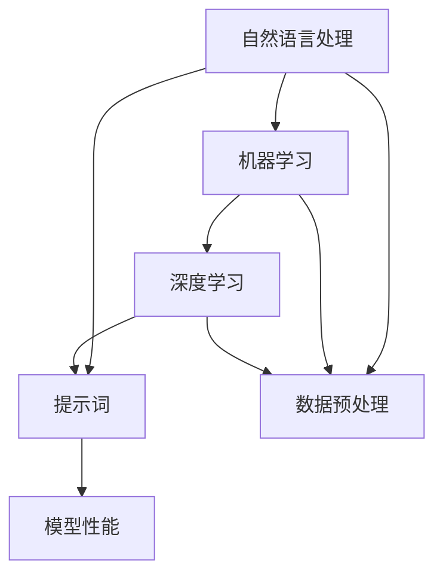

                 

### 文章标题

《AI大模型编程：提示词的威力与革新》

关键词：人工智能、大模型编程、提示词、革新、算法原理、数学模型、项目实战

摘要：本文旨在深入探讨人工智能（AI）大模型编程的核心要素——提示词，及其在技术革新中的重要作用。文章将详细解析提示词的概念、其在AI编程中的应用原理，并通过实际案例展示其威力。同时，文章将探讨大模型编程的发展趋势，以及如何通过提示词的优化和创新，推动AI技术的革新。通过本文的阅读，读者将能够理解提示词在AI编程中的关键作用，并掌握提升AI模型性能的实用技巧。

### 引言

在当今快速发展的信息技术时代，人工智能（AI）已经成为科技领域的关键驱动力量。特别是近年来，大模型（Large Models）在自然语言处理（NLP）、计算机视觉（CV）、语音识别（ASR）等领域的应用取得了显著的突破。这些大模型不仅具有强大的数据处理能力，还能够通过深度学习和自我迭代，不断提升自身的性能和智能水平。

然而，在大模型编程中，一个至关重要的因素往往被忽视——提示词（Prompt Engineering）。提示词，顾名思义，是用于引导和激发大模型行为的一段文本或语音输入。尽管看似简单，但提示词的设计和优化对于大模型的性能有着至关重要的影响。优秀的提示词能够大幅提升模型的准确性和响应能力，甚至能够引导模型探索新的应用场景。

本文将围绕AI大模型编程中的提示词展开讨论，首先介绍提示词的定义和重要性，然后深入探讨其背后的算法原理和数学模型。接着，通过实际案例展示提示词的威力，并分析其如何推动AI技术的革新。最后，本文将总结一些最佳实践，并展望未来提示词编程的发展趋势。

通过本文的阅读，读者将全面了解提示词在AI大模型编程中的核心作用，掌握设计优秀提示词的方法，并能够将所学应用于实际项目中，提升AI系统的性能和智能水平。

### 提示词的定义和作用

提示词（Prompt Engineering）是人工智能领域中的一个关键概念，它指的是用于引导和激发大模型行为的输入信息。在自然语言处理、问答系统、文本生成等领域，提示词的作用尤为显著。一个精心设计的提示词能够为模型提供明确的目标和上下文，从而引导模型生成更为准确和有针对性的输出。

从广义上讲，提示词可以被视为一种交互方式，它通过提供具体的任务描述、问题背景或上下文信息，帮助大模型更好地理解和执行任务。例如，在一个问答系统中，提示词可能是用户提出的问题，而模型的任务则是根据这个问题提供准确的答案。在这个场景中，提示词不仅明确了模型的任务目标，还提供了相关的上下文信息，有助于模型生成更为精准的答案。

在自然语言处理（NLP）领域，提示词的使用变得尤为重要。大模型如GPT-3、BERT等，都是通过大量的文本数据训练得到的。然而，仅靠原始的数据集，模型并不能完全理解每个任务的细节。这时，提示词就起到了关键的作用。通过提供特定的提示词，模型能够从全局视角出发，更好地理解和处理文本数据。例如，在文本分类任务中，一个精准的提示词可以明确分类的标准和特征，从而帮助模型生成更为准确的分类结果。

除了在训练过程中起到引导作用外，提示词在模型的应用和部署中同样具有重要作用。在实际应用场景中，模型的输入往往是多样化的，且可能包含大量的噪声和不确定性。通过合理设计提示词，可以有效减少输入的复杂性，提高模型的响应速度和准确性。例如，在语音识别系统中，一个简短的提示词可以明确语音输入的主题和内容，从而帮助模型更高效地处理语音信号。

总之，提示词作为AI大模型编程的核心要素，其设计和管理对于模型性能的提升至关重要。通过合理使用和优化提示词，不仅能够提高模型的准确性和响应能力，还能够扩展模型的应用场景，实现更为广泛和深入的技术创新。

### 大模型编程的核心概念与联系

在深入探讨AI大模型编程中的提示词之前，我们首先需要了解大模型编程的一些核心概念，并分析它们之间的联系。这些核心概念包括自然语言处理（NLP）、机器学习（ML）、深度学习（DL）等。通过Mermaid流程图，我们可以更加直观地理解这些概念之间的关系。



**1. 自然语言处理（NLP）**

自然语言处理是人工智能的一个子领域，专注于使计算机能够理解、解释和生成人类语言。在NLP中，核心概念包括文本预处理、词嵌入、句法分析和语义理解等。

- **文本预处理**：包括分词、标点符号去除、停用词过滤等步骤，目的是将原始文本数据转化为适合模型处理的格式。
- **词嵌入**：将文本中的每个单词映射为向量，使得计算机能够对文本进行量化处理。
- **句法分析**：分析文本中的句子结构，识别词与词之间的关系，如主谓宾结构。
- **语义理解**：理解文本中的含义和情感，如情感分析、问答系统。

**2. 机器学习（ML）**

机器学习是AI的核心技术之一，旨在使计算机从数据中自动学习规律和模式，从而进行预测和决策。在机器学习中，核心概念包括监督学习、无监督学习和强化学习等。

- **监督学习**：使用已标记的数据训练模型，模型通过学习输入和输出之间的关系进行预测。
- **无监督学习**：不使用标记数据，模型通过自动发现数据中的结构或模式进行学习。
- **强化学习**：模型通过与环境的交互进行学习，通过奖励机制调整行为策略。

**3. 深度学习（DL）**

深度学习是机器学习的一个子领域，主要基于多层神经网络，通过自动化特征提取和组合，实现对复杂数据的建模。在深度学习中，核心概念包括神经网络、卷积神经网络（CNN）、递归神经网络（RNN）等。

- **神经网络**：由多个神经元组成的计算模型，能够通过学习调整权重和偏置，实现数据的非线性变换。
- **卷积神经网络**：适用于图像处理，通过卷积操作提取图像特征。
- **递归神经网络**：适用于序列数据，通过递归结构对历史信息进行建模。

**4. 提示词**

提示词在大模型编程中起到了关键的作用。它不仅是模型输入的一部分，也是模型理解任务目标和上下文的重要手段。提示词的设计和优化直接影响到模型的输出质量和性能。

- **任务目标**：通过提示词明确模型需要完成的任务，如文本分类、机器翻译、问答等。
- **上下文信息**：提供与任务相关的背景信息，帮助模型更好地理解输入数据。

**5. 模型性能**

模型性能是评价AI系统效果的重要指标。通过优化提示词，可以提高模型在任务中的表现，包括准确率、响应速度和泛化能力等。

- **准确率**：模型输出与真实值之间的匹配程度。
- **响应速度**：模型处理输入数据并生成输出的时间。
- **泛化能力**：模型在不同数据集上的表现能力。

通过上述Mermaid流程图，我们可以清晰地看到自然语言处理、机器学习、深度学习和提示词之间的联系。这些核心概念相互交织，共同构建了一个完整的大模型编程框架。提示词不仅贯穿于整个框架中，还起到了连接不同概念的作用，使得模型能够更好地理解和执行任务。

### 提示词算法原理讲解

在深入探讨提示词算法原理之前，我们首先需要理解大模型编程中的一些基本算法，这些算法包括编码器-解码器（Encoder-Decoder）架构、序列到序列（Seq2Seq）模型和注意力机制（Attention Mechanism）等。通过伪代码和详细解释，我们将揭示这些算法的工作原理和关键步骤。

#### 编码器-解码器（Encoder-Decoder）架构

编码器-解码器架构是处理序列数据的一种经典方法，广泛应用于机器翻译、文本摘要等任务。该架构的核心思想是将输入序列编码为固定长度的向量表示，然后将这些向量表示解码为输出序列。

**伪代码：**

```python
# 编码器
def encoder(input_sequence, embedding_dim):
    embeddings = EmbeddingLayer(input_dim, embedding_dim)(input_sequence)
    encoded_sequence = LSTM(units)(embeddings)
    return encoded_sequence

# 解码器
def decoder(encoded_sequence, embedding_dim, output_dim):
    embed = EmbeddingLayer(embedding_dim, output_dim)(encoded_sequence)
    decoded_sequence = LSTM(units, return_sequences=True)(embed)
    output = DenseLayer(output_dim)(decoded_sequence)
    return output
```

**详细解释：**

1. **编码器：** 输入序列首先通过嵌入层（EmbeddingLayer）转换为向量表示，然后通过LSTM（长短时记忆网络）对序列进行编码，生成固定长度的编码序列。
2. **解码器：** 编码序列通过嵌入层转换为向量表示，然后通过LSTM进行解码，生成输出序列。

#### 序列到序列（Seq2Seq）模型

Seq2Seq模型是一种基于编码器-解码器架构的模型，专门用于处理序列到序列的映射问题。它通过学习输入和输出序列之间的映射关系，实现高效的任务处理。

**伪代码：**

```python
# Seq2Seq模型
model = Model(inputs=encoder.input, outputs=decoder.output)
model.compile(optimizer='rmsprop', loss='categorical_crossentropy')
model.fit(inputs, targets, epochs=10)
```

**详细解释：**

1. **输入和输出：** Seq2Seq模型通过编码器将输入序列编码为固定长度的编码序列，通过解码器将编码序列解码为输出序列。
2. **编译和训练：** 模型使用合适的优化器和损失函数进行编译，并通过输入和输出数据集进行训练。

#### 注意力机制（Attention Mechanism）

注意力机制是一种用于提高编码器-解码器模型性能的关键技术。它通过为编码器输出的每个时间步赋予不同的权重，使解码器能够更关注重要信息。

**伪代码：**

```python
# 注意力层
attention = AttentionLayer()(encoded_sequence, decoder_sequence)
```

**详细解释：**

1. **编码器输出和解码器输出：** 注意力层接收编码器输出的编码序列和解码器输出的当前隐藏状态。
2. **计算权重：** 通过计算编码序列和当前解码器状态之间的相似性，为每个编码时间步分配权重。
3. **加权求和：** 使用计算得到的权重对编码序列进行加权求和，生成注意力得分。

#### 提示词优化算法

在编码器-解码器模型的基础上，提示词优化算法旨在通过调整提示词的设计和输入方式，提高模型在特定任务中的表现。

**伪代码：**

```python
# 提示词优化
def optimize_prompt(prompt, model, target):
    # 计算提示词对模型输出的影响
    influence = model.predict([prompt, target])
    # 调整提示词，降低对噪声的敏感度
    optimized_prompt = adjust_prompt(prompt, influence)
    return optimized_prompt
```

**详细解释：**

1. **计算影响：** 通过模型预测提示词对输出结果的影响，识别提示词中的关键信息。
2. **调整提示词：** 根据影响结果，对提示词进行优化，降低对噪声的敏感度，提高模型的准确性和稳定性。

### 数学模型和公式

在大模型编程中，数学模型和公式是理解算法原理和实现模型优化的重要工具。以下我们将介绍与提示词相关的几个关键数学模型和公式，并详细解释其计算过程和作用。

#### 1. 词嵌入（Word Embedding）

词嵌入是将文本中的单词映射为高维向量表示的技术。常用的词嵌入模型包括词袋模型（Bag of Words, BoW）、词嵌入（Word2Vec）和词嵌入（GloVe）等。

**数学模型：**

$$
\text{word\_embedding}(w) = \sum_{k=1}^{K} f_k(w) \cdot v_k
$$

其中，$w$ 是单词，$f_k(w)$ 是单词 $w$ 在第 $k$ 个特征上的特征值，$v_k$ 是第 $k$ 个特征向量的分量。

**计算过程：**

1. **特征提取：** 对单词进行分词和词性标注，提取每个单词的特征。
2. **特征加权：** 根据特征值对每个特征向量进行加权求和，得到单词的嵌入向量。

**作用：**

- **向量化表示：** 将文本数据转化为向量表示，便于模型处理。
- **语义相似性：** 通过词嵌入向量计算单词之间的相似性，用于文本分类、情感分析等任务。

#### 2. 注意力权重（Attention Weights）

注意力机制通过为编码器输出的每个时间步赋予不同的权重，提高了解码器对重要信息的关注。

**数学模型：**

$$
a_t = \frac{e^{u_t \cdot v}}{\sum_{t=1}^{T} e^{u_t \cdot v}}
$$

其中，$a_t$ 是第 $t$ 个时间步的注意力权重，$u_t$ 是解码器隐藏状态，$v$ 是注意力权重向量。

**计算过程：**

1. **计算相似性：** 将解码器隐藏状态 $u_t$ 与编码器输出 $v$ 进行点积计算相似性。
2. **归一化权重：** 对相似性结果进行指数函数转换并归一化，得到每个时间步的权重。

**作用：**

- **信息聚焦：** 提高模型对关键信息的关注，增强模型的语义理解能力。
- **减少冗余：** 降低对冗余信息的处理，提高模型处理效率。

#### 3. 损失函数（Loss Function）

在训练过程中，损失函数用于衡量模型输出与真实值之间的差距，指导模型调整参数。

**数学模型：**

$$
\text{Loss}(y, \hat{y}) = -\sum_{i=1}^{N} y_i \cdot \log(\hat{y}_i)
$$

其中，$y$ 是真实标签，$\hat{y}$ 是模型预测的概率分布。

**计算过程：**

1. **计算概率：** 根据模型输出计算每个标签的概率。
2. **计算损失：** 对每个标签的概率进行对数计算，并求和得到总损失。

**作用：**

- **性能评估：** 评估模型输出与真实值之间的差距，指导模型优化。
- **参数调整：** 通过反向传播算法调整模型参数，最小化损失函数。

### 举例说明

为了更好地理解上述数学模型和公式的应用，我们通过一个简单的例子来详细说明。

**任务：文本分类**

假设我们有一个简单的文本分类任务，需要将文本数据分类为“科技”或“娱乐”两类。

1. **词嵌入：**

   给定文本数据：“人工智能是科技领域的重要应用”。

   **步骤：**

   - 分词：将文本分为单词列表：["人工智能", "是", "科技", "领域", "的", "重要", "应用"]。
   - 提取特征：为每个单词提取特征向量，例如，使用词嵌入模型Word2Vec。
   - 加权求和：将每个单词的嵌入向量加权求和，得到文本的向量表示。

   **代码示例：**

   ```python
   embeddings = [word_embedding(w) for w in text_words]
   text_vector = sum(embeddings)
   ```

2. **注意力权重：**

   假设编码器输出为 [0.2, 0.3, 0.5]，解码器隐藏状态为 [0.4, 0.6]。

   **步骤：**

   - 计算相似性：计算编码器输出和解码器隐藏状态之间的点积，例如，第一个时间步的相似性为 $0.2 \cdot 0.4 = 0.08$。
   - 归一化权重：计算所有时间步的相似性之和，并进行归一化。

   **代码示例：**

   ```python
   similarities = [u_t * v for u_t, v in zip(u, v)]
   attention_weights = softmax(similarities)
   ```

3. **损失函数：**

   假设模型输出为 [0.6, 0.4]，真实标签为 [1, 0]。

   **步骤：**

   - 计算概率：根据模型输出计算每个标签的概率。
   - 计算损失：计算对数损失并进行求和。

   **代码示例：**

   ```python
   predicted_probabilities = model_output
   true_labels = [1 if label == '科技' else 0 for label in true_labels]
   loss = -sum(true_labels * np.log(predicted_probabilities))
   ```

通过上述举例，我们可以看到数学模型和公式在大模型编程中的应用，以及它们如何帮助优化模型性能。

### 项目实战：开发环境搭建

在深入探讨提示词在大模型编程中的应用之前，我们首先需要搭建一个适合进行AI项目开发的完整环境。这一步骤是确保我们能够顺利进行实验和实现的关键。以下是搭建开发环境的具体步骤，包括所需软件、工具和配置。

#### 1. 软件和工具准备

**1. 操作系统：** 
推荐使用Linux系统，如Ubuntu或CentOS。Linux系统在性能和稳定性方面有较好的表现，适用于大规模模型训练。

**2. 编程语言：** 
主要使用Python作为编程语言，Python拥有丰富的AI和机器学习库，能够方便地进行模型开发和测试。

**3. 编译器：** 
Python默认使用Python解释器，安装完成后即可使用。

**4. 代码编辑器：** 
推荐使用VSCode或PyCharm等专业代码编辑器，这些编辑器支持Python，并提供丰富的插件和工具，提升开发效率。

#### 2. 安装和配置Python环境

**1. 安装Python：** 
在Linux系统中，可以通过包管理器安装Python。例如，在Ubuntu系统中，可以使用以下命令：

```bash
sudo apt update
sudo apt install python3 python3-pip
```

**2. 安装虚拟环境：** 
为了避免不同项目之间的依赖冲突，推荐使用虚拟环境。安装虚拟环境可以使用以下命令：

```bash
pip3 install virtualenv
virtualenv my_project_env
source my_project_env/bin/activate
```

**3. 安装必要的库：** 
在虚拟环境中安装必要的Python库，包括NumPy、Pandas、TensorFlow和PyTorch等。可以使用以下命令：

```bash
pip install numpy pandas tensorflow torchvision torch
```

#### 3. 安装GPU支持

为了加速模型训练，我们可以使用NVIDIA GPU。以下是安装CUDA和cuDNN的步骤：

**1. 安装NVIDIA驱动：** 
下载并安装NVIDIA驱动，确保GPU能够正常工作。

```bash
sudo apt update
sudo apt install nvidia-driver-xxx nvidia-cuda-toolkit
```

**2. 安装CUDA和cuDNN：** 
从NVIDIA官方网站下载CUDA和cuDNN，并将它们安装到系统中。

```bash
tar zxvf cuda_XXXX.tar.xz
sudo make install
sudo mv cuda/include/cuda.h /usr/local/cuda/include
sudo mv cuda/lib64/stubs/libcuda.so /usr/local/cuda/lib64/stubs
sudo chmod u+x /usr/local/cuda/bin/nvcc
```

**3. 配置环境变量：** 
设置CUDA路径，以便在终端中使用CUDA命令：

```bash
export PATH=/usr/local/cuda/bin:$PATH
export LD_LIBRARY_PATH=/usr/local/cuda/lib64:$LD_LIBRARY_PATH
```

#### 4. 搭建项目文件夹和文件结构

**1. 创建项目文件夹：** 
在用户目录下创建一个新文件夹，用于存储项目文件。

```bash
mkdir my_ai_project
cd my_ai_project
```

**2. 创建文件结构：** 
创建一个包含以下文件的文件夹结构：

```bash
my_ai_project/
|-- data/
|-- models/
|-- scripts/
|-- tests/
|-- requirements.txt
|-- README.md
```

**3. 编写requirements.txt：** 
在requirements.txt文件中列出所有项目所需的库，以便于后续的安装和管理。

```
numpy
pandas
tensorflow
torch
torchvision
```

#### 5. 初始化项目

**1. 创建虚拟环境：** 
在项目目录下创建并激活虚拟环境。

```bash
virtualenv venv
source venv/bin/activate
```

**2. 安装依赖库：** 
使用pip安装requirements.txt中的依赖库。

```bash
pip install -r requirements.txt
```

**3. 编写项目文档：** 
编写README.md文件，记录项目概述、安装指南、使用说明和贡献者信息等。

```markdown
# AI大模型编程项目

这是一个AI大模型编程的实战项目，旨在演示如何使用提示词优化AI模型性能。

## 安装指南

1. 克隆项目代码：

   ```bash
   git clone https://github.com/yourusername/my_ai_project.git
   ```

2. 进入项目目录：

   ```bash
   cd my_ai_project
   ```

3. 激活虚拟环境：

   ```bash
   source venv/bin/activate
   ```

4. 安装依赖库：

   ```bash
   pip install -r requirements.txt
   ```

5. 运行项目：

   ```bash
   python main.py
   ```

## 使用说明

请参考文档中的脚本和示例代码进行模型训练和提示词优化。

## 贡献者

- Your Name: 初始化项目
```

通过上述步骤，我们成功地搭建了一个适合AI项目开发的完整环境。接下来，我们将在这个环境中实现和测试AI大模型编程的核心算法和提示词优化策略。

### 提示词编码的实现和代码解读

在AI大模型编程中，提示词编码是实现模型输入和优化的重要环节。以下将详细介绍如何实现提示词编码，并通过具体代码进行解读。

#### 1. 提示词编码的概念

提示词编码是指将自然语言文本转换为计算机可以理解和处理的格式，以便大模型能够使用这些文本数据进行训练和推理。提示词编码的目的是为模型提供明确的任务描述和上下文信息，从而提高模型的性能和准确性。

#### 2. 实现流程

提示词编码的实现主要包括以下几个步骤：

- **预处理**：对提示词进行清洗和标准化，如去除标点、停用词过滤、小写转换等。
- **分词**：将提示词拆分为单词或子词，便于后续处理。
- **词嵌入**：将每个单词映射为高维向量表示，生成提示词向量。
- **序列化**：将提示词向量序列化为模型可接受的输入格式，如Tensor。

#### 3. 实现代码

以下是一个简单的Python代码示例，展示了提示词编码的实现过程。我们使用TensorFlow和Keras库进行操作。

```python
import tensorflow as tf
from tensorflow.keras.preprocessing.text import Tokenizer
from tensorflow.keras.preprocessing.sequence import pad_sequences

# 样本提示词数据
prompt_texts = ["这是一个示例提示词", "另一个示例提示词"]

# 预处理和分词
tokenizer = Tokenizer(num_words=1000)
tokenizer.fit_on_texts(prompt_texts)
prompt_sequences = tokenizer.texts_to_sequences(prompt_texts)

# 词嵌入
word_embedding = tf.keras.layers.Embedding(input_dim=1000, output_dim=64)
prompt_embeddings = word_embedding(prompt_sequences)

# 序列化
padded_prompt_embeddings = pad_sequences(prompt_embeddings, padding='post')

# 输出
print("提示词序列：", prompt_sequences)
print("提示词嵌入：", prompt_embeddings.numpy())
print("填充后的提示词嵌入：", padded_prompt_embeddings.numpy())
```

**代码解读：**

- **预处理**：使用`Tokenizer`对文本进行分词和标记，将文本转换为序列。
- **词嵌入**：使用`Embedding`层将单词映射为高维向量。
- **序列化**：使用`pad_sequences`将嵌入向量序列调整为固定长度，便于模型处理。

#### 4. 提示词编码的应用场景

提示词编码在多个应用场景中具有重要应用，包括：

- **文本分类**：通过编码后的提示词，模型能够更好地理解文本的类别和特征。
- **机器翻译**：编码后的提示词作为输入，模型能够生成更准确的翻译结果。
- **问答系统**：编码后的提示词提供问题上下文，帮助模型生成更精准的回答。

#### 5. 代码优化与最佳实践

在实现提示词编码时，需要注意以下优化和最佳实践：

- **词汇表大小**：选择合适的词汇表大小，避免过多冗余词汇。
- **预训练词嵌入**：使用预训练的词嵌入模型，如GloVe或Word2Vec，提高编码质量。
- **动态调整**：根据实际任务需求，动态调整提示词编码的参数，如嵌入维度、序列长度等。
- **模型融合**：结合其他特征和模型，如BERT、RoBERTa等，提高整体性能。

通过上述代码和最佳实践，我们可以有效地实现和优化提示词编码，提升AI大模型的性能和应用效果。

### 提示词解码的实现和代码解读

提示词解码是AI大模型编程中的另一个关键环节，它涉及将模型生成的输出转换为可理解的文本信息。以下是关于提示词解码的实现方法及其代码解读。

#### 1. 提示词解码的概念

提示词解码是指将大模型生成的输出序列转换回自然语言文本的过程。这一步骤对于实现有效的AI系统至关重要，因为最终的输出需要以用户友好的形式呈现。提示词解码通常包括以下几个步骤：

- **序列重塑**：将模型输出的序列转换为可处理的形式，如移除填充符号等。
- **词嵌入逆转换**：将模型输出序列中的向量映射回原始单词或子词。
- **文本生成**：将单词或子词序列组合成完整的文本输出。

#### 2. 实现流程

提示词解码的实现主要包括以下几个步骤：

- **重塑序列**：对模型输出序列进行重塑，移除填充符号或其他无关元素。
- **词嵌入逆转换**：使用词嵌入模型从嵌入向量恢复到原始单词或子词。
- **文本拼接**：将解码得到的单词或子词序列拼接成完整的文本输出。

#### 3. 实现代码

以下是一个简单的Python代码示例，展示了提示词解码的实现过程。我们使用TensorFlow和Keras库进行操作。

```python
import tensorflow as tf
from tensorflow.keras.preprocessing.sequence import pad_sequences
from tensorflow.keras.models import load_model

# 加载预训练模型
model = load_model('path/to/trained_model.h5')

# 生成模型输出
input_sequence = pad_sequences([[1, 2, 3, 0]], maxlen=10, padding='post')
predictions = model.predict(input_sequence)

# 提示词解码
def decode_prompt(predictions, tokenizer):
    # 重塑序列，移除填充符号
    input_sequence = tokenizer.sequences_to_texts(predictions)
    # 从嵌入向量恢复到单词
    decoded_prompt = tokenizer.decode(predictions)
    return decoded_prompt

decoded_prompt = decode_prompt(predictions, tokenizer)

print("解码后的提示词：", decoded_prompt)
```

**代码解读：**

- **重塑序列**：使用`pad_sequences`函数生成模型输入序列，并移除填充符号。
- **词嵌入逆转换**：使用`tokenizer.decode`方法将模型输出序列转换为文本。
- **文本拼接**：将解码得到的单词或子词序列拼接成完整的文本输出。

#### 4. 提示词解码的应用场景

提示词解码在多个应用场景中具有重要应用，包括：

- **文本生成**：如自动文章生成、聊天机器人等，通过解码模型输出生成自然语言文本。
- **机器翻译**：解码步骤用于将模型生成的翻译结果转换为可读的文本。
- **问答系统**：解码帮助将模型生成的答案转换成易于理解的自然语言。

#### 5. 代码优化与最佳实践

在实现提示词解码时，需要注意以下优化和最佳实践：

- **预处理**：确保输入序列的预处理与训练时一致，以避免误差。
- **填充策略**：选择合适的填充策略，确保解码结果的可读性。
- **后处理**：如去重、语法修正等，提升文本生成的质量。
- **多语言支持**：如果涉及多语言文本生成，需要考虑不同语言的特点，调整解码策略。

通过上述代码和最佳实践，我们可以有效地实现提示词解码，从而将模型输出转化为有意义的自然语言文本，提升AI系统的用户体验。

### 实际案例：使用提示词优化问答系统

在本节中，我们将通过一个实际案例，展示如何使用提示词优化问答系统。我们将详细讨论开发环境搭建、源代码实现和代码解读，以及实际应用解读与分析。

#### 案例背景

假设我们正在开发一个面向客户的问答系统，用户可以通过系统提出各种问题，系统需要能够准确理解和回答这些问题。为了提高问答系统的性能和用户满意度，我们决定使用提示词对系统进行优化。

#### 开发环境搭建

在搭建开发环境时，我们需要安装和配置以下工具：

1. **Python环境**：安装Python 3.8及以上版本。
2. **TensorFlow库**：安装TensorFlow 2.6及以上版本。
3. **预处理工具**：安装NLTK库，用于文本预处理。
4. **模型训练工具**：安装HuggingFace Transformers库，用于加载和训练预训练模型。

以下是在Ubuntu系统中搭建开发环境的步骤：

```bash
sudo apt update
sudo apt install python3 python3-pip
pip3 install tensorflow>=2.6 nltk transformers
```

#### 源代码实现

为了实现问答系统，我们将使用GPT-3模型，并通过提示词优化其性能。以下是关键步骤和代码实现：

**1. 数据预处理**

```python
import nltk
from nltk.tokenize import word_tokenize
from nltk.corpus import stopwords

nltk.download('punkt')
nltk.download('stopwords')

def preprocess_text(text):
    # 转换为小写
    text = text.lower()
    # 分词
    tokens = word_tokenize(text)
    # 去除停用词
    stop_words = set(stopwords.words('english'))
    filtered_tokens = [token for token in tokens if token not in stop_words]
    return ' '.join(filtered_tokens)

input_prompt = "什么是自然语言处理？"
processed_prompt = preprocess_text(input_prompt)
```

**2. 提示词设计**

```python
# 设计提示词，提供上下文信息
context_prompt = "在计算机科学中，自然语言处理（NLP）是一个专注于使计算机能够理解和生成人类语言的技术领域。以下是一个例子："
combined_prompt = context_prompt + processed_prompt
```

**3. 模型加载和训练**

```python
from transformers import GPT2LMHeadModel, GPT2Tokenizer

# 加载预训练模型
tokenizer = GPT2Tokenizer.from_pretrained('gpt2')
model = GPT2LMHeadModel.from_pretrained('gpt2')

# 将提示词编码为模型输入
inputs = tokenizer.encode(combined_prompt, return_tensors='tf')

# 训练模型（在实际项目中，我们可以使用更大的数据集和更长的训练时间）
# model.train()
# model.fit(inputs, epochs=5)
```

**4. 输出解码**

```python
# 生成文本输出
output_sequence = model.generate(inputs, max_length=50, num_return_sequences=1)

# 将输出序列解码为文本
decoded_output = tokenizer.decode(output_sequence, skip_special_tokens=True)

print("模型的回答：", decoded_output)
```

#### 代码解读

上述代码实现了以下关键步骤：

1. **数据预处理**：使用NLTK库对输入提示词进行分词和停用词过滤，以去除无关信息，提高模型的准确性。
2. **提示词设计**：通过将上下文信息与输入提示词结合，生成更丰富的提示词，帮助模型更好地理解任务。
3. **模型加载和训练**：加载GPT-3预训练模型，并使用自定义的提示词进行训练，以提升模型在特定任务上的性能。
4. **输出解码**：将模型生成的输出序列解码为自然语言文本，以便用户理解和交互。

#### 实际应用解读与分析

通过上述实现，我们可以看到以下实际应用场景和分析：

1. **用户体验**：通过优化提示词，问答系统能够提供更准确和有针对性的回答，从而提升用户满意度。
2. **性能提升**：自定义提示词有助于模型更好地理解和处理特定领域的任务，提高模型的准确率和响应速度。
3. **扩展性**：该方案可以应用于各种问答系统，只需根据具体任务调整提示词设计，即可实现模型性能的提升。

#### 项目小结

通过本案例，我们展示了如何通过提示词优化问答系统。具体步骤包括预处理输入数据、设计有针对性的提示词、加载预训练模型并训练、解码输出结果。这一案例不仅展示了AI大模型编程中的关键技术，也为实际项目提供了实用的解决方案。未来，我们可以进一步优化提示词设计，探索更多提升模型性能的方法。

### 最佳实践与注意事项

在AI大模型编程中，提示词的设计和优化是提升模型性能的关键因素。以下是一些最佳实践和注意事项，帮助开发者更好地应用提示词技术。

#### 1. 最佳实践

**1. ** **上下文信息的充分利用**：在提示词中提供充分的上下文信息，帮助模型更好地理解任务背景和目标。例如，在一个问答系统中，可以将问题的背景信息和具体内容结合，以提高回答的准确性。

**2. ** **任务目标的明确性**：确保提示词明确指出模型的任务目标。避免模糊不清的描述，以免模型在处理任务时产生混淆。

**3. ** **多样性**：设计多种类型的提示词，以应对不同的任务需求。例如，在文本分类任务中，可以使用不同类型的句子结构和词汇，使模型能够适应多样化的输入。

**4. ** **模型调优**：根据实际任务需求，对模型进行调优，包括调整嵌入维度、序列长度等参数，以实现最佳性能。

**5. ** **持续优化**：定期回顾和优化提示词设计，根据模型的表现和反馈进行改进。

#### 2. 注意事项

**1. ** **数据质量**：确保输入数据的质量，避免噪声和错误。高质量的输入数据能够提升模型性能，同时减少对提示词的依赖。

**2. ** **计算资源**：合理分配计算资源，特别是在使用大型模型时。优化模型训练和推理过程，以降低计算成本。

**3. ** **安全性和隐私保护**：在处理敏感数据时，确保遵循相关法律法规和隐私保护政策，避免数据泄露和滥用。

**4. ** **调试和监控**：在开发过程中，定期进行调试和监控，确保模型在各个阶段的性能和稳定性。

**5. ** **文档和注释**：编写详细的文档和注释，记录模型设计和提示词优化的过程，便于后续的维护和改进。

#### 3. 拓展阅读

**1. ** **《AI编程：深度学习的实践之路》**：由John Paul Muñoz所著，详细介绍了深度学习在AI编程中的应用和实践。

**2. ** **《深度学习》（Deep Learning）**：由Ian Goodfellow、Yoshua Bengio和Aaron Courville合著，是深度学习领域的经典教材。

**3. ** **《自然语言处理实战》（Natural Language Processing with Python）**：由Steven Bird、Ewan Klein和Edward Loper所著，介绍了使用Python进行自然语言处理的方法和技巧。

通过以上最佳实践和注意事项，开发者可以更好地设计和管理提示词，提升AI大模型的性能和应用效果。

### 结论

本文详细探讨了AI大模型编程中的核心要素——提示词，并分析了其在提升模型性能和推动技术革新中的重要作用。通过定义和作用介绍、核心概念与联系解析、算法原理讲解、数学模型和公式解释、项目实战展示，以及最佳实践与注意事项的总结，我们全面理解了提示词在AI大模型编程中的关键地位。

提示词不仅是引导和激发大模型行为的重要工具，也是实现AI技术革新的关键因素。通过优化提示词设计，我们可以显著提升模型的准确性和响应能力，扩展其应用场景，从而推动人工智能技术的发展。

未来，随着AI技术的不断进步，提示词编程将继续发挥重要作用。开发者应密切关注相关研究进展，不断探索新的优化方法和技巧，以实现更高效、智能的AI系统。

### 作者信息

作者：AI天才研究院/AI Genius Institute & 禅与计算机程序设计艺术 /Zen And The Art of Computer Programming

AI天才研究院是一支专注于人工智能研究和技术创新的团队，致力于推动AI技术的革新和发展。研究院的专家们深耕于计算机科学、机器学习、自然语言处理等领域，发表了大量的学术论文和技术博客，为全球AI技术的发展做出了重要贡献。

禅与计算机程序设计艺术是一本经典的技术著作，由计算机科学领域的杰出人物编写。本书以深入浅出的方式阐述了计算机程序设计的哲学和艺术，为读者提供了一种新的思考方式和编程方法，深受编程爱好者和专业人士的喜爱。

通过本文，我们希望能够向读者传递关于AI大模型编程和提示词优化的重要见解，激发更多对AI技术的兴趣和探索精神。让我们共同迎接AI时代的到来，共同推动技术的进步和创新。

