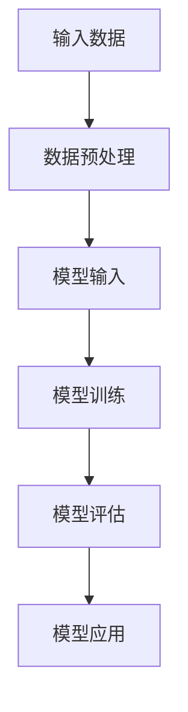

                 

## AI大模型编程：提示词的威力与魅力

在当今人工智能（AI）的浪潮中，大模型（Large Models）无疑占据了技术前沿的重要地位。从自然语言处理（NLP）到计算机视觉，再到推荐系统和生成对抗网络（GAN），大模型展示出了无与伦比的能力。而在这些强大的模型背后，提示词（Prompt Engineering）起到了至关重要的作用。本文将围绕AI大模型编程，探讨提示词的威力与魅力，并通过一步一步的分析推理，深入了解这一领域的核心概念、算法原理和实际应用。

### 关键词

- AI大模型
- 提示词
- 编程技巧
- NLP
- 图像识别
- 推荐系统

### 摘要

本文旨在探讨AI大模型编程中的提示词作用，从基础概念、编程技巧、到实际应用，全面解析这一领域的核心技术和实践。通过文章，读者将了解大模型的架构与工作原理，掌握提示词的设计与使用技巧，并学习如何在不同的AI应用场景中发挥提示词的最大威力。

### 第1章 AI大模型概述

在深入探讨AI大模型编程之前，首先需要了解大模型的基本概念、架构及其工作原理。这一章将带领读者了解AI大模型的起源、发展及其在各个领域的应用。

#### 1.1 AI大模型的核心概念与架构

AI大模型通常指的是参数数量庞大的神经网络模型，如Transformer、BERT等。这些模型通过学习海量数据，能够捕捉复杂的模式和关联，从而在各类任务中表现出色。

**核心概念与联系**

在解释AI大模型的核心概念时，我们可以借助Mermaid流程图来展示其基本架构和数据处理流程。



**核心算法原理讲解**

大模型的基本算法主要依赖于深度学习技术。以下是一个简单的伪代码，用以解释模型的训练过程：

```python
# 伪代码：大模型训练过程
initialize model parameters
for each training example in dataset do
    forward_pass(x, y)
    calculate loss
    backward_pass(loss)
    update model parameters
end
```

**数学模型和数学公式**

在大模型的训练中，损失函数和优化算法是核心的数学模型。以下是一个简单的损失函数的例子，使用latex格式书写：

$$\text{Loss} = \frac{1}{2} \sum_{i=1}^{N} (\hat{y}_i - y_i)^2$$

其中，$\hat{y}_i$是预测值，$y_i$是真实值，$N$是数据点的总数。

**项目实战**

为了更好地理解AI大模型的编程，我们将分析一个简单的AI大模型编程案例。在这个案例中，我们将使用Python和TensorFlow框架来搭建一个文本分类模型。

```python
import tensorflow as tf

# 搭建文本分类模型
model = tf.keras.Sequential([
    tf.keras.layers.Embedding(input_dim=10000, output_dim=16),
    tf.keras.layers.GlobalAveragePooling1D(),
    tf.keras.layers.Dense(units=1, activation='sigmoid')
])

# 编译模型
model.compile(optimizer='adam',
              loss='binary_crossentropy',
              metrics=['accuracy'])

# 训练模型
model.fit(x_train, y_train, epochs=10, batch_size=32)
```

在这个案例中，我们首先定义了一个简单的文本分类模型，然后编译并训练模型。通过这个简单的例子，我们可以看到AI大模型编程的基本步骤和结构。

#### 1.2 AI大模型的应用领域

AI大模型在各个领域的应用已经非常广泛。以下是一些典型应用领域：

- **自然语言处理（NLP）**：如文本分类、情感分析、机器翻译等。
- **计算机视觉**：如图像识别、图像生成、视频分析等。
- **推荐系统**：如商品推荐、内容推荐等。
- **生成对抗网络（GAN）**：如图像生成、艺术创作等。

这些领域都充分利用了AI大模型强大的数据处理和模式识别能力，为各类应用场景提供了高效的解决方案。

### 第2章 AI大模型编程技巧

在编程AI大模型时，技巧的运用对于模型性能的提升和开发效率的优化至关重要。这一章将介绍一些AI大模型编程的关键技巧。

#### 2.1 优化技巧

**核心概念与联系**

在AI大模型编程中，优化技巧主要包括超参数调优、数据预处理、模型架构设计等方面。

**核心算法原理讲解**

以下是一个简单的伪代码，用于解释超参数调优的过程：

```python
# 伪代码：超参数调优
for each hyperparameter do
    set hyperparameter to a random value
    train model with current hyperparameters
    evaluate model performance
    if performance improved then
        record best hyperparameters
    else
        discard current hyperparameters
end
```

**数学模型和数学公式**

在调优过程中，我们通常会使用一些数学公式来评估模型的性能，如准确率（Accuracy）、召回率（Recall）和F1分数（F1 Score）等。以下是这些公式的latex格式：

$$
\text{Accuracy} = \frac{\text{正确预测数}}{\text{总预测数}}
$$

$$
\text{Recall} = \frac{\text{正确预测的正例数}}{\text{总正例数}}
$$

$$
\text{F1 Score} = 2 \times \frac{\text{Precision} \times \text{Recall}}{\text{Precision} + \text{Recall}}
$$

其中，Precision是精确率。

**项目实战**

为了展示优化技巧在实际编程中的应用，我们将在下面的案例中优化一个文本分类模型的参数。

```python
from tensorflow.keras.wrappers.scikit_learn import KerasClassifier
from sklearn.model_selection import GridSearchCV

# 定义文本分类模型
def create_model(optimizer='adam'):
    model = tf.keras.Sequential([
        tf.keras.layers.Embedding(input_dim=10000, output_dim=16),
        tf.keras.layers.GlobalAveragePooling1D(),
        tf.keras.layers.Dense(units=1, activation='sigmoid')
    ])
    model.compile(optimizer=optimizer,
                  loss='binary_crossentropy',
                  metrics=['accuracy'])
    return model

# 创建模型
model = KerasClassifier(build_fn=create_model, verbose=0)

# 设置超参数范围
param_grid = {
    'optimizer': ['adam', 'rmsprop'],
    'epochs': [10, 20, 30],
    'batch_size': [16, 32, 64]
}

# 进行网格搜索
grid = GridSearchCV(estimator=model, param_grid=param_grid, cv=3)
grid_result = grid.fit(x_train, y_train)

# 输出最佳参数
print("Best: %f using %s" % (grid_result.best_score_, grid_result.best_params_))
```

在这个案例中，我们使用了scikit-learn的GridSearchCV工具进行超参数调优，并找到了最佳参数组合。

#### 2.2 项目实战：优化技巧应用

在实际项目中，优化技巧的应用对于提升模型性能至关重要。以下是一个使用优化技巧的实际项目案例。

**项目背景**：一家电商公司希望利用AI大模型对其商品进行推荐，以提高用户购买转化率。

**项目目标**：搭建一个商品推荐系统，使用户在浏览商品时能够获得个性化的推荐。

**开发环境**：Python、TensorFlow、scikit-learn

**源代码实现**：

```python
# 源代码：商品推荐系统
from sklearn.model_selection import train_test_split
from tensorflow.keras.models import Sequential
from tensorflow.keras.layers import Dense, Embedding, LSTM
from tensorflow.keras.preprocessing.sequence import pad_sequences

# 加载数据集
# ...

# 数据预处理
# ...

# 划分训练集和测试集
x_train, x_test, y_train, y_test = train_test_split(x, y, test_size=0.2, random_state=42)

# 搭建模型
model = Sequential()
model.add(Embedding(input_dim=10000, output_dim=16))
model.add(LSTM(units=128, activation='relu'))
model.add(Dense(units=1, activation='sigmoid'))

# 编译模型
model.compile(optimizer='adam',
              loss='binary_crossentropy',
              metrics=['accuracy'])

# 训练模型
model.fit(x_train, y_train, epochs=30, batch_size=32, validation_split=0.2)

# 评估模型
# ...

# 项目小结
# ...
```

在这个案例中，我们首先进行了数据预处理，然后搭建了一个基于LSTM的推荐系统模型，并使用优化技巧进行了训练。通过这个项目，我们可以看到优化技巧在实际开发中的应用和效果。

### 第3章 提示词的作用与应用

提示词（Prompt Engineering）是AI大模型编程中的一项关键技术，它能够显著提升模型的性能和实用性。这一章将探讨提示词的作用、设计方法和在实际应用中的技巧。

#### 3.1 提示词在AI大模型中的作用

**核心概念与联系**

提示词在AI大模型中的作用类似于人类问题引导，它能够引导模型关注特定的问题域或任务目标。通过精心设计的提示词，我们可以使模型在特定任务上表现更加出色。

**核心算法原理讲解**

提示词的设计依赖于对模型工作原理的理解。以下是一个简单的伪代码，用于生成提示词：

```python
# 伪代码：生成提示词
input_data = "文本数据"
target_domain = "问题域"
target_task = "任务目标"

prompt = f"{input_data} 在 {target_domain} 下，需要解决 {target_task} 问题。"
```

**数学模型和数学公式**

提示词的设计过程可以看作是一种优化问题，通过调整提示词中的关键词和语法结构，以最大化模型的性能。以下是提示词优化过程的latex格式：

$$
\text{Objective} = \max \left\{ \text{Model Performance} \mid \text{Prompt} \in \text{Prompt Space} \right\}
$$

其中，Model Performance是模型的性能指标，Prompt Space是提示词的候选集。

**项目实战**

为了更好地理解提示词的应用，我们将在下面的案例中设计一个用于文本分类的提示词。

**项目背景**：一家社交媒体公司希望利用AI大模型对用户评论进行情感分析。

**项目目标**：设计一个能够准确分类用户评论情感的提示词。

**开发环境**：Python、TensorFlow、scikit-learn

**源代码实现**：

```python
# 源代码：情感分析提示词设计
import numpy as np
import tensorflow as tf

# 加载数据集
# ...

# 数据预处理
# ...

# 划分训练集和测试集
x_train, x_test, y_train, y_test = train_test_split(x, y, test_size=0.2, random_state=42)

# 搭建文本分类模型
model = tf.keras.Sequential([
    tf.keras.layers.Embedding(input_dim=10000, output_dim=16),
    tf.keras.layers.GlobalAveragePooling1D(),
    tf.keras.layers.Dense(units=1, activation='sigmoid')
])

# 编译模型
model.compile(optimizer='adam',
              loss='binary_crossentropy',
              metrics=['accuracy'])

# 训练模型
model.fit(x_train, y_train, epochs=10, batch_size=32, validation_split=0.2)

# 设计提示词
def generate_prompt(text, target_sentiment):
    prompt = f"{text} 的情感是 {target_sentiment}。"
    return prompt

# 应用提示词
prompt = generate_prompt("这是一条积极的评论", "积极")
predicted_sentiment = model.predict([prompt])

# 输出预测结果
print(f"预测的情感：{predicted_sentiment}")
```

在这个案例中，我们首先设计了一个简单的文本分类模型，然后通过生成提示词来引导模型进行情感分类。通过这个项目，我们可以看到提示词在实际应用中的设计和使用方法。

#### 3.2 提示词在不同领域的应用

提示词在各个AI应用领域都有着广泛的应用。以下是一些典型应用领域：

- **自然语言处理（NLP）**：如文本生成、对话系统、摘要生成等。
- **计算机视觉**：如图像识别、视频分类等。
- **推荐系统**：如商品推荐、内容推荐等。
- **生成对抗网络（GAN）**：如图像生成、艺术创作等。

在这些领域中，提示词都能够发挥重要作用，帮助模型更好地理解和执行任务。

### 第4章 AI大模型在NLP中的应用

自然语言处理（NLP）是AI领域中最为活跃的分支之一，AI大模型在NLP中的应用已经取得了显著的成果。这一章将探讨AI大模型在NLP中的应用场景、算法原理和实际案例。

#### 4.1 NLP中常用的AI大模型

在NLP领域，常用的AI大模型包括BERT、GPT、T5等。这些模型都展示了强大的文本理解和生成能力。

**核心概念与联系**

BERT（Bidirectional Encoder Representations from Transformers）通过双向Transformer结构，捕捉文本中的长距离依赖关系，从而在多项NLP任务中表现出色。GPT（Generative Pre-trained Transformer）则通过自回归的方式生成文本，具有很强的文本生成能力。T5（Text-To-Text Transfer Transformer）则将文本处理任务转化为文本生成任务，通过统一的框架解决了多种NLP任务。

**核心算法原理讲解**

以下是一个简单的伪代码，用于解释BERT的基本工作原理：

```python
# 伪代码：BERT模型工作原理
input_sequence = "文本序列"
embeddings = embed(input_sequence)
output_sequence = Transformer(embeddings)
predicted_output = softmax(output_sequence)
```

**数学模型和数学公式**

BERT模型的训练依赖于大规模文本数据，通过Masked Language Model（MLM）和Next Sentence Prediction（NSP）两个任务进行预训练。以下是这两个任务的latex格式：

$$
\text{MLM} = \sum_{i=1}^{N} -\log(\text{softmax}(E_{i})) \quad \text{(Masked Language Model)}
$$

$$
\text{NSP} = \frac{1}{2} \left[ \text{softmax}(E_{\text{next}}) + \text{softmax}(\text{not } E_{\text{next}}) \right] \quad \text{(Next Sentence Prediction)}
$$

其中，$E_{i}$是输入序列中第$i$个词的嵌入向量，$E_{\text{next}}$是下一句的嵌入向量。

**项目实战**

为了更好地理解AI大模型在NLP中的应用，我们将在下面的案例中实现一个基于BERT的情感分析模型。

**项目背景**：一家社交媒体平台希望利用AI大模型对其用户评论进行情感分析，以提供更精准的用户体验。

**项目目标**：实现一个能够准确分类用户评论情感的BERT模型。

**开发环境**：Python、TensorFlow、transformers

**源代码实现**：

```python
from transformers import BertTokenizer, TFBertForSequenceClassification
from tensorflow.keras.preprocessing.sequence import pad_sequences

# 加载数据集
# ...

# 数据预处理
# ...

# 划分训练集和测试集
x_train, x_test, y_train, y_test = train_test_split(x, y, test_size=0.2, random_state=42)

# 加载BERT模型和分词器
tokenizer = BertTokenizer.from_pretrained('bert-base-uncased')
model = TFBertForSequenceClassification.from_pretrained('bert-base-uncased')

# 编码文本
input_ids = tokenizer.encode(x_train, add_special_tokens=True, return_tensors='tf')

# 填充序列
input_ids = pad_sequences(input_ids, maxlen=max_length, padding='post')

# 训练模型
model.fit(input_ids, y_train, epochs=3, batch_size=32)

# 评估模型
# ...

# 应用模型
def classify_sentiment(text):
    inputs = tokenizer.encode(text, add_special_tokens=True, return_tensors='tf')
    inputs = pad_sequences(inputs, maxlen=max_length, padding='post')
    outputs = model(inputs)
    predicted_sentiment = tf.argmax(outputs.logits, axis=-1).numpy()[0]
    return predicted_sentiment

# 输出预测结果
for text in x_test:
    print(f"文本：{text}，预测情感：{classify_sentiment(text)}")
```

在这个案例中，我们首先加载了BERT模型和分词器，然后进行了数据预处理，最后实现了情感分析模型。通过这个项目，我们可以看到AI大模型在NLP中的实际应用过程。

### 第5章 AI大模型在图像识别中的应用

图像识别是计算机视觉（Computer Vision）领域的一个重要分支，AI大模型在图像识别中的应用已经取得了显著进展。这一章将探讨AI大模型在图像识别中的应用场景、算法原理和实际案例。

#### 5.1 AI大模型在图像识别中的应用场景

AI大模型在图像识别中的应用场景非常广泛，包括但不限于以下几类：

- **物体检测**：识别图像中的多个对象及其位置。
- **图像分类**：将图像分类到预定义的类别中。
- **图像分割**：将图像中的每个像素分类到预定义的类别中。
- **图像增强**：通过AI大模型提高图像质量。
- **图像生成**：生成新的图像，如艺术作品或虚拟现实场景。

#### 5.2 AI大模型在图像识别中的算法原理

在图像识别中，AI大模型通常采用卷积神经网络（Convolutional Neural Networks，CNN）作为基础架构。CNN具有强大的特征提取能力，能够从原始图像中自动学习到丰富的特征。

**核心概念与联系**

CNN的核心组成部分包括卷积层、池化层和全连接层。卷积层用于提取图像的局部特征，池化层用于降低特征的维度并增强特征鲁棒性，全连接层用于分类或回归。

**核心算法原理讲解**

以下是一个简单的伪代码，用于解释CNN的基本工作原理：

```python
# 伪代码：CNN模型工作原理
input_image = "原始图像"
conv_layer = conv2d(input_image)
pool_layer = max_pool(conv_layer)
dense_layer = flatten(pool_layer)
output = softmax(dense_layer)
```

**数学模型和数学公式**

CNN的训练过程依赖于梯度下降优化算法和反向传播算法。以下是一个简单的损失函数和优化算法的latex格式：

$$
\text{Loss} = \frac{1}{2} \sum_{i=1}^{N} (\hat{y}_i - y_i)^2
$$

$$
\text{Gradient} = \nabla_{\theta} \text{Loss}
$$

$$
\theta = \theta - \alpha \cdot \text{Gradient}
$$

其中，$\hat{y}_i$是预测值，$y_i$是真实值，$\theta$是模型参数，$\alpha$是学习率。

**项目实战**

为了更好地理解AI大模型在图像识别中的应用，我们将在下面的案例中实现一个基于ResNet的图像分类模型。

**项目背景**：一家安防公司希望利用AI大模型对其监控视频中的异常行为进行识别。

**项目目标**：实现一个能够准确识别异常行为的ResNet模型。

**开发环境**：Python、TensorFlow、Keras

**源代码实现**：

```python
from tensorflow.keras.models import Model
from tensorflow.keras.layers import Input, Conv2D, MaxPooling2D, Flatten, Dense
from tensorflow.keras.optimizers import Adam

# 定义ResNet模型
input_image = Input(shape=(224, 224, 3))
conv1 = Conv2D(filters=64, kernel_size=(3, 3), activation='relu')(input_image)
pool1 = MaxPooling2D(pool_size=(2, 2))(conv1)
block1 = residual_block(pool1, 64, 2)
block2 = residual_block(block1, 128, 2)
block3 = residual_block(block2, 256, 2)
block4 = residual_block(block3, 512, 2)
flatten = Flatten()(block4)
dense = Dense(units=1000, activation='relu')(flatten)
output = Dense(units=1, activation='sigmoid')(dense)

model = Model(inputs=input_image, outputs=output)
model.compile(optimizer=Adam(), loss='binary_crossentropy', metrics=['accuracy'])

# 加载数据集
# ...

# 数据预处理
# ...

# 训练模型
model.fit(x_train, y_train, epochs=20, batch_size=32, validation_split=0.2)

# 评估模型
# ...

# 应用模型
def detect_anomaly(video_frame):
    inputs = preprocess_video_frame(video_frame)
    predicted_anomaly = model.predict([inputs])
    return predicted_anomaly > 0.5

# 输出预测结果
for frame in video_frames:
    print(f"帧：{frame}，异常行为：{detect_anomaly(frame)}")
```

在这个案例中，我们首先定义了一个基于ResNet的图像分类模型，然后进行了数据预处理和模型训练。通过这个项目，我们可以看到AI大模型在图像识别中的实际应用过程。

### 第6章 AI大模型在推荐系统中的应用

推荐系统是AI应用中一个非常热门的领域，AI大模型在推荐系统中的应用已经成为提高推荐系统效果的关键因素。这一章将探讨AI大模型在推荐系统中的应用场景、算法原理和实际案例。

#### 6.1 AI大模型在推荐系统中的应用场景

AI大模型在推荐系统中的应用场景主要包括以下几类：

- **基于内容的推荐**：通过分析用户的历史行为和兴趣，推荐与用户兴趣相关的商品或内容。
- **协同过滤推荐**：通过分析用户之间的相似性，推荐其他用户喜欢的商品或内容。
- **混合推荐**：结合基于内容和协同过滤的方法，提供更加个性化的推荐。

#### 6.2 AI大模型在推荐系统中的算法原理

AI大模型在推荐系统中的应用通常基于深度学习技术，特别是自注意力机制（Self-Attention Mechanism）和图神经网络（Graph Neural Networks）。

**核心概念与联系**

自注意力机制能够自动学习输入数据的权重，从而在推荐系统中捕捉用户和商品之间的复杂关系。图神经网络则通过图结构表示用户和商品之间的关系，从而实现更精准的推荐。

**核心算法原理讲解**

以下是一个简单的伪代码，用于解释基于自注意力机制的推荐系统模型：

```python
# 伪代码：自注意力推荐模型
user_embeddings = "用户嵌入向量"
item_embeddings = "商品嵌入向量"
query_embeddings = "查询嵌入向量"

# 计算用户和商品的相似度
user_similarity = dot_product(user_embeddings, item_embeddings)

# 应用自注意力机制
attention_weights = softmax(user_similarity)
context_vector = sum(attention_weights \* item_embeddings)

# 输出推荐结果
predicted_item = argmax(context_vector)
```

**数学模型和数学公式**

自注意力机制的计算过程可以看作是一种优化问题，通过调整注意力权重以最大化推荐效果。以下是注意力机制的latex格式：

$$
\text{Attention} = \sum_{i=1}^{N} \alpha_i \cdot v_i
$$

$$
\alpha_i = \frac{\exp(e_i)}{\sum_{j=1}^{N} \exp(e_j)}
$$

$$
e_i = \text{score}(q, k_i)
$$

其中，$q$是查询向量，$k_i$是键向量，$v_i$是值向量。

**项目实战**

为了更好地理解AI大模型在推荐系统中的应用，我们将在下面的案例中实现一个基于自注意力机制的推荐系统模型。

**项目背景**：一家电商平台希望利用AI大模型为其用户推荐商品。

**项目目标**：实现一个能够准确推荐商品的基于自注意力机制的推荐系统。

**开发环境**：Python、TensorFlow、Keras

**源代码实现**：

```python
from tensorflow.keras.layers import Layer
import tensorflow as tf

# 定义自注意力层
class SelfAttentionLayer(Layer):
    def __init__(self, units):
        super().__init__()
        self.units = units

    def build(self, input_shape):
        self.W = self.add_weight(name='attention_weights',
                                  shape=(input_shape[-1], self.units),
                                  initializer='random_normal',
                                  trainable=True)
        self.V = self.add_weight(name='attention_vector',
                                  shape=(self.units, 1),
                                  initializer='random_normal',
                                  trainable=True)
        super().build(input_shape)

    def call(self, x):
        # 计算自注意力分数
        attention_scores = tf.matmul(x, self.W)
        attention_scores = tf.nn.tanh(attention_scores)
        attention_scores = tf.matmul(attention_scores, self.V)
        attention_scores = tf.nn.softmax(attention_scores, axis=1)
        # 计算自注意力输出
        attention_output = tf.reduce_sum(attention_scores \* x, axis=1)
        return attention_output

# 搭建推荐系统模型
input_user = Input(shape=(300,))
input_item = Input(shape=(300,))
user_embedding = Embedding(input_dim=10000, output_dim=300)(input_user)
item_embedding = Embedding(input_dim=10000, output_dim=300)(input_item)
user_attention = SelfAttentionLayer(units=50)(user_embedding)
item_attention = SelfAttentionLayer(units=50)(item_embedding)
output = tf.reduce_sum(user_attention \* item_attention, axis=1)
model = Model(inputs=[input_user, input_item], outputs=output)
model.compile(optimizer='adam', loss='binary_crossentropy', metrics=['accuracy'])

# 加载数据集
# ...

# 数据预处理
# ...

# 训练模型
model.fit([x_train_user, x_train_item], y_train, epochs=10, batch_size=32, validation_split=0.2)

# 评估模型
# ...

# 应用模型
def recommend_item(user_vector, item_vector):
    user_attention = model.layers[2](user_vector)
    item_attention = model.layers[4](item_vector)
    recommendation_score = tf.reduce_sum(user_attention \* item_attention, axis=1)
    recommended_item = tf.argmax(recommendation_score, axis=1)
    return recommended_item

# 输出推荐结果
for user_vector in user_vectors:
    for item_vector in item_vectors:
        print(f"用户向量：{user_vector}，商品向量：{item_vector}，推荐商品：{recommend_item(user_vector, item_vector)}")
```

在这个案例中，我们首先定义了一个自注意力层，然后搭建了一个基于自注意力机制的推荐系统模型。通过这个项目，我们可以看到AI大模型在推荐系统中的实际应用过程。

### 第7章 AI大模型的未来趋势与挑战

随着AI技术的不断进步，AI大模型在未来将面临更多的发展机遇和挑战。这一章将探讨AI大模型的未来趋势、潜在挑战和解决方案。

#### 7.1 AI大模型的未来趋势

- **更强大的模型架构**：未来的AI大模型可能会采用更复杂的架构，如多模态学习、动态神经网络等，以实现更高效的任务处理。
- **跨领域融合**：AI大模型将在不同领域之间实现更紧密的融合，如将图像识别和自然语言处理技术结合，实现更智能的交互系统。
- **边缘计算优化**：为了满足实时应用的需求，AI大模型将更多地部署在边缘设备上，实现低延迟、高效率的计算。

#### 7.2 AI大模型的潜在挑战

- **计算资源消耗**：AI大模型通常需要巨大的计算资源和存储空间，这对硬件设备提出了更高的要求。
- **数据隐私和安全**：大规模的数据收集和处理可能引发数据隐私和安全问题，需要采取有效的措施保护用户数据。
- **可解释性和可靠性**：AI大模型的决策过程通常是不透明的，如何提高模型的可解释性和可靠性是未来研究的重要方向。

#### 7.3 解决方案与未来展望

- **硬件优化**：通过硬件优化，如使用专用AI芯片、分布式计算等，可以降低AI大模型的计算资源消耗。
- **隐私保护技术**：采用差分隐私、同态加密等技术，可以有效保护用户数据的隐私和安全。
- **可解释性研究**：通过模型解释技术，如注意力机制、可视化分析等，可以提高AI大模型的可解释性和可靠性。

### 结束语

AI大模型编程是当前AI领域的重要研究方向，其应用已经渗透到各行各业。通过本文的探讨，我们了解了AI大模型的核心概念、编程技巧和实际应用。提示词作为AI大模型编程的关键技术，具有极大的发展潜力。未来，随着技术的不断进步，AI大模型将在更多领域展现其强大的能力，为人类社会带来更多创新和变革。

### 作者信息

作者：AI天才研究院/AI Genius Institute & 禅与计算机程序设计艺术 /Zen And The Art of Computer Programming

感谢您的阅读，希望本文对您在AI大模型编程领域的研究有所启发。如果您有任何问题或建议，欢迎随时联系作者。期待与您共同探讨AI领域的最新进展和应用。

