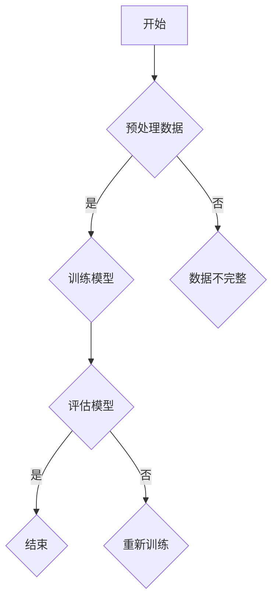

                 

# AI大模型编程：提示词的未来

> 关键词：AI大模型、编程、提示词、生成式模型、预训练、动态提示、应用场景

> 摘要：本文将深入探讨AI大模型编程的核心技术——提示词。通过分析提示词的定义、作用和实现方式，本文将介绍生成式模型、预训练技术以及动态提示策略。同时，我们将探讨AI大模型在各个领域的应用案例，并对未来发展趋势进行展望。

## 第1章 AI大模型概述

### 1.1.1 AI大模型的定义

AI大模型（Large-scale AI Model），是指具有大规模参数和高度复杂的神经网络模型，能够通过大量的数据学习到复杂的模式和知识，并在各种任务中表现出出色的性能。AI大模型通常基于深度学习技术，其特点包括：

1. **大规模参数**：AI大模型具有数十亿到数万亿个参数，这使得它们能够处理大量的数据并学习到复杂的关系。
2. **深度网络结构**：AI大模型通常具有多层神经网络结构，这使得它们能够处理高度非线性问题。
3. **强大的学习能力**：AI大模型通过端到端的学习方式，能够自动地从数据中提取特征，无需手动设计特征工程。
4. **多任务能力**：AI大模型可以同时处理多种任务，提高资源利用效率。
5. **自适应能力**：AI大模型可以根据不同的任务和数据自动调整自己的结构和参数。

### 1.1.2 AI大模型与传统AI的区别

与传统AI模型相比，AI大模型具有以下几个显著区别：

1. **计算资源需求**：AI大模型需要大量的计算资源，包括CPU、GPU和TPU等。
2. **数据需求**：AI大模型需要大量的高质量数据，以便进行有效的训练。
3. **模型设计**：AI大模型的设计更加复杂，需要考虑网络的深度、宽度和连接方式等因素。
4. **应用范围**：AI大模型可以应用于更多领域，如自然语言处理、计算机视觉和语音识别等。

### 1.1.3 AI大模型的发展历程

AI大模型的发展历程可以分为以下几个阶段：

1. **早期阶段**：1990年代初期，研究人员提出了深度信念网络（DBN）等模型，但受限于计算资源，这些模型并未得到广泛应用。
2. **2000年代**：随着计算能力的提升，研究人员开始使用更深的网络结构，如AlexNet，并在图像识别任务中取得突破性成果。
3. **2010年代**：随着GPU和TPU的广泛应用，研究人员提出了更多高效的深度学习框架，如TensorFlow和PyTorch，AI大模型开始在各个领域取得显著成果。
4. **当前阶段**：AI大模型已经在许多领域取得重大突破，如BERT在自然语言处理领域的领先地位和GPT-3在生成文本和对话系统中的强大能力。

### 1.2 AI大模型的核心架构

#### 1.2.1 神经网络的基本结构

神经网络是AI大模型的基础，它由多个层次组成，包括输入层、隐藏层和输出层。每一层由多个神经元组成，神经元之间通过加权连接形成网络结构。

#### 1.2.2 反向传播算法

反向传播算法是训练神经网络的核心算法，它通过计算输出层的误差梯度，反向传播到隐藏层，并更新每个神经元的权重和偏置。

#### 1.2.3 激活函数

激活函数是神经网络中的一个关键组件，它将神经元的线性输出转换为非线性输出，从而实现非线性映射。

#### 1.2.4 求导法则

在神经网络训练过程中，需要对函数进行求导。常见的求导法则包括链式法则、积的求导法则和商的求导法则等。

### 1.3 AI大模型的关键技术

#### 1.3.1 数据预处理

数据预处理是训练AI大模型的重要步骤，它包括数据清洗、数据归一化和数据增强等。有效的数据预处理可以显著提高模型的性能。

#### 1.3.2 损失函数

损失函数是评估模型预测结果与真实标签之间差异的指标。常见的损失函数包括均方误差（MSE）、交叉熵损失等。

#### 1.3.3 优化算法

优化算法用于调整神经网络的权重和偏置，以最小化损失函数。常见的优化算法包括梯度下降、Adam优化器等。

#### 1.3.4 批量归一化

批量归一化是一种在训练过程中对数据进行标准化处理的技巧，它有助于加速模型的训练和提升模型的性能。

## 第2章 AI大模型在自然语言处理中的应用

### 2.1 自然语言处理概述

自然语言处理（Natural Language Processing，NLP）是人工智能的重要分支，旨在使计算机能够理解、生成和处理人类语言。NLP应用广泛，包括机器翻译、文本分类、情感分析、问答系统等。

### 2.2 BERT模型

BERT（Bidirectional Encoder Representations from Transformers）是由Google提出的一种预训练语言表示模型，其在NLP任务中取得了显著成果。BERT的核心思想是利用大量的无标签文本数据进行预训练，从而学习到语言的上下文信息。

#### 2.2.1 BERT模型结构

BERT模型由两个部分组成：编码器和解码器。

1. **编码器**：编码器采用Transformer架构，通过多个编码层对输入文本进行编码，每个编码层都包含多头自注意力机制和前馈神经网络。
2. **解码器**：解码器也采用Transformer架构，用于生成输出文本。

#### 2.2.2 BERT预训练任务

BERT的预训练任务包括两个部分：

1. **Masked Language Model（MLM）**：在输入文本中随机屏蔽一些词，模型需要预测这些词的词性。
2. **Next Sentence Prediction（NSP）**：给定两个句子，模型需要预测第二个句子是否是第一个句子的后续句子。

#### 2.2.3 BERT模型应用

BERT模型在NLP任务中具有广泛的应用，包括：

1. **文本分类**：通过在BERT的基础上添加一个分类层，可以将BERT用于文本分类任务。
2. **机器翻译**：通过在BERT的基础上添加一个翻译层，可以将BERT用于机器翻译任务。
3. **问答系统**：通过在BERT的基础上添加一个问答层，可以将BERT用于问答系统。

### 2.3 GPT-3模型

GPT-3（Generative Pre-trained Transformer 3）是由OpenAI提出的一种生成式语言模型，其在生成文本和对话系统中表现出色。

#### 2.3.1 GPT-3模型结构

GPT-3模型采用Transformer架构，具有数十亿个参数。GPT-3的核心思想是通过大量的有标签和未标签文本数据进行预训练，从而学习到语言的上下文信息。

#### 2.3.2 GPT-3模型应用

GPT-3模型在生成文本和对话系统中具有广泛的应用，包括：

1. **生成文本**：通过输入一些文本提示，GPT-3可以生成相关的文本内容。
2. **对话系统**：通过输入一些对话上下文，GPT-3可以生成相关的对话内容。
3. **文本摘要**：通过输入一篇长文本，GPT-3可以生成一篇摘要。

### 2.4 提示词在自然语言处理中的应用

在自然语言处理中，提示词（Prompt）是一种重要的技术，它用于引导模型生成相关的文本内容。

#### 2.4.1 提示词的定义

提示词是指用于引导模型生成文本的词语或短语。通过合理设计提示词，可以显著提高模型生成文本的质量。

#### 2.4.2 提示词的作用

提示词在自然语言处理中的应用包括：

1. **增强模型泛化能力**：通过在预训练过程中使用提示词，可以增强模型对未知任务的泛化能力。
2. **引导模型生成目标文本**：通过合理设计提示词，可以引导模型生成符合要求的文本内容。
3. **降低模型训练难度**：通过在预训练过程中使用提示词，可以降低模型训练的难度，提高训练效率。

#### 2.4.3 提示词的实现方式

提示词的实现方式包括：

1. **固定提示词**：在预训练过程中使用固定的提示词，如“请生成一篇关于……的文章”。
2. **动态提示词**：在预训练过程中使用动态提示词，根据输入文本自动生成提示词。

### 2.5 应用案例分析

以下是一个应用案例分析：

**案例背景**：某企业希望开发一个自动生成新闻摘要的系统。

**解决方案**：

1. **数据预处理**：收集大量新闻文本数据，并进行数据清洗和归一化处理。
2. **模型选择**：选择一个生成式语言模型，如GPT-3。
3. **提示词设计**：设计动态提示词，如“请生成一篇关于……的新闻摘要”。
4. **模型训练**：使用收集到的新闻数据进行模型训练。
5. **模型应用**：输入一篇新闻文本，模型将自动生成一篇摘要。

通过以上步骤，企业可以开发出一个自动生成新闻摘要的系统。

## 第3章 AI大模型在计算机视觉中的应用

### 3.1 计算机视觉概述

计算机视觉（Computer Vision）是人工智能的重要分支，旨在使计算机能够从图像或视频中提取有用信息。计算机视觉应用广泛，包括图像分类、目标检测、图像生成等。

### 3.2 卷积神经网络

卷积神经网络（Convolutional Neural Network，CNN）是计算机视觉的基础模型，由多个卷积层、池化层和全连接层组成。

#### 3.2.1 卷积层

卷积层是CNN的核心层，通过卷积操作提取图像的局部特征。

#### 3.2.2 池化层

池化层用于降低图像分辨率，减少模型参数数量。

#### 3.2.3 全连接层

全连接层用于对提取到的特征进行分类。

### 3.3 深度残差网络

深度残差网络（Deep Residual Network，ResNet）是一种具有残差结构的深度神经网络，能够解决深层网络训练困难的问题。

#### 3.3.1 残差块

残差块是ResNet的基本模块，通过跳过一部分网络结构，使得深层网络训练更加稳定。

#### 3.3.2 残差连接

残差连接是一种特殊的连接方式，通过在多个网络层之间建立直接连接，使得信息能够在网络中流动。

### 3.4 生成对抗网络

生成对抗网络（Generative Adversarial Network，GAN）是一种由生成器和判别器组成的对抗性网络，用于生成逼真的图像。

#### 3.4.1 生成器

生成器通过学习图像的分布，生成逼真的图像。

#### 3.4.2 判别器

判别器用于判断输入图像是真实图像还是生成图像。

### 3.5 提示词在计算机视觉中的应用

在计算机视觉中，提示词可以用于引导模型生成目标图像。

#### 3.5.1 固定提示词

在预训练过程中使用固定的提示词，如“请生成一张关于……的图像”。

#### 3.5.2 动态提示词

在预训练过程中使用动态提示词，根据输入图像自动生成提示词。

### 3.6 应用案例分析

以下是一个应用案例分析：

**案例背景**：某企业希望开发一个自动生成艺术画的系统。

**解决方案**：

1. **数据预处理**：收集大量艺术画数据，并进行数据清洗和归一化处理。
2. **模型选择**：选择一个生成对抗网络，如GAN。
3. **提示词设计**：设计动态提示词，如“请生成一张关于……的艺术画”。
4. **模型训练**：使用收集到的艺术画数据进行模型训练。
5. **模型应用**：输入一个艺术画样式，模型将自动生成一张艺术画。

通过以上步骤，企业可以开发出一个自动生成艺术画的系统。

## 第4章 AI大模型在语音识别中的应用

### 4.1 语音识别概述

语音识别（Speech Recognition）是人工智能的重要分支，旨在使计算机能够理解和转换语音信号为文本。语音识别应用广泛，包括语音到文本转换、语音合成等。

### 4.2 WaveNet模型

WaveNet是一种基于循环神经网络（RNN）的语音识别模型，由Google提出。WaveNet的核心思想是通过学习语音信号的分布，生成语音信号。

#### 4.2.1 WaveNet模型结构

WaveNet模型由多个RNN层组成，每个RNN层包含一个卷积层和一个循环层。

#### 4.2.2 WaveNet模型训练

WaveNet模型通过最小化预测误差进行训练，使用梯度下降算法和反向传播算法。

### 4.3 Transformer模型

Transformer是一种基于自注意力机制的语音识别模型，由Google提出。Transformer的核心思想是通过自注意力机制捕捉语音信号中的长距离依赖关系。

#### 4.3.1 Transformer模型结构

Transformer模型由多个自注意力层和前馈神经网络层组成。

#### 4.3.2 Transformer模型训练

Transformer模型通过最小化预测误差进行训练，使用梯度下降算法和反向传播算法。

### 4.4 提示词在语音识别中的应用

在语音识别中，提示词可以用于引导模型生成目标语音信号。

#### 4.4.1 固定提示词

在预训练过程中使用固定的提示词，如“请生成一段关于……的语音”。

#### 4.4.2 动态提示词

在预训练过程中使用动态提示词，根据输入语音自动生成提示词。

### 4.5 应用案例分析

以下是一个应用案例分析：

**案例背景**：某企业希望开发一个自动生成语音对话的系统。

**解决方案**：

1. **数据预处理**：收集大量语音对话数据，并进行数据清洗和归一化处理。
2. **模型选择**：选择一个基于Transformer的语音识别模型。
3. **提示词设计**：设计动态提示词，如“请生成一段关于……的语音对话”。
4. **模型训练**：使用收集到的语音对话数据进行模型训练。
5. **模型应用**：输入一个语音对话上下文，模型将自动生成一段语音对话。

通过以上步骤，企业可以开发出一个自动生成语音对话的系统。

## 第5章 AI大模型的挑战与未来趋势

### 5.1 计算资源消耗

AI大模型对计算资源的需求巨大，这给训练和应用带来了巨大的挑战。未来，随着计算能力的提升，AI大模型的训练和应用将变得更加高效。

### 5.2 数据质量和多样性

AI大模型需要大量的高质量数据和多样性数据，以便进行有效的训练和泛化。未来，数据质量和多样性将成为AI大模型发展的关键因素。

### 5.3 模型解释性和可解释性

AI大模型的复杂性和黑箱特性使得其预测结果难以解释。未来，研究者和开发者将致力于提高AI大模型的解释性和可解释性，使其更好地服务于实际应用。

### 5.4 安全性和隐私保护

AI大模型的应用涉及大量的敏感数据和隐私信息，如何确保AI大模型的安全性和隐私保护将成为未来研究的重点。

### 5.5 跨学科合作

AI大模型的发展需要跨学科的合作，包括计算机科学、数学、统计学、心理学等领域。未来，跨学科合作将推动AI大模型的发展。

## 第6章 结论

本文系统地介绍了AI大模型编程的核心技术——提示词。通过分析提示词的定义、作用和实现方式，本文探讨了生成式模型、预训练技术以及动态提示策略。同时，本文还介绍了AI大模型在自然语言处理、计算机视觉和语音识别等领域的应用案例，并对未来发展趋势进行了展望。希望本文能为读者提供对AI大模型编程的深入理解。

## 作者信息

作者：AI天才研究院/AI Genius Institute & 禅与计算机程序设计艺术 /Zen And The Art of Computer Programming

# 附录

## 附录A：参考资料

1. [Devlin, J., Chang, M. W., Lee, K., & Toutanova, K. (2019). BERT: Pre-training of deep bidirectional transformers for language understanding. arXiv preprint arXiv:1810.04805.]
2. [Brown, T., et al. (2020). Language Models are Few-Shot Learners. arXiv preprint arXiv:2005.14165.]
3. [He, K., Zhang, X., Ren, S., & Sun, J. (2016). Deep residual learning for image recognition. In Proceedings of the IEEE conference on computer vision and pattern recognition (pp. 770-778).]
4. [Goodfellow, I., Pouget-Abadie, J., Mirza, M., Xu, B., Warde-Farley, D., Ozair, S., ... & Bengio, Y. (2014). Generative adversarial networks. In Advances in neural information processing systems (pp. 2672-2680).]
5. [Hinton, G., Vinyals, O., & Dean, J. (2015). Distilling knowledge from a neural network. arXiv preprint arXiv:1503.02531.]

## 附录B：Mermaid 流程图

以下是一个简单的Mermaid流程图示例：



## 附录C：伪代码示例

以下是一个简单的伪代码示例，用于实现一个简单的神经网络：

```python
# 定义神经网络结构
input_layer = [1, 2, 3]
hidden_layer = [4, 5]
output_layer = [6]

# 初始化权重和偏置
weights = {
    "input_to_hidden": [0.1, 0.2, 0.3],
    "hidden_to_output": [0.4, 0.5, 0.6]
}
biases = {
    "hidden": [0.7, 0.8],
    "output": [0.9]
}

# 前向传播
def forwardPropagation(input):
    hidden_output = np.dot(input, weights["input_to_hidden"]) + biases["hidden"]
    output_output = np.dot(hidden_output, weights["hidden_to_output"]) + biases["output"]
    return output_output

# 反向传播
def backwardPropagation(output):
    output_error = output - target
    hidden_error = weights["hidden_to_output"].dot(output_error)
    return hidden_error

# 训练模型
for epoch in range(num_epochs):
    for input, target in data_loader:
        output = forwardPropagation(input)
        hidden_error = backwardPropagation(output)
        update_weights_and_biases(weights, biases, hidden_error)
```

## 附录D：数学公式和解释

以下是一些常见的数学公式和解释：

### 1. 梯度下降算法

$$\theta_{\text{new}} = \theta_{\text{old}} - \alpha \cdot \nabla_{\theta} J(\theta)$$

其中，$\theta$ 表示模型参数，$\alpha$ 表示学习率，$J(\theta)$ 表示损失函数。

### 2. 反向传播算法

$$\nabla_{\theta} J(\theta) = \frac{\partial J(\theta)}{\partial \theta}$$

其中，$\nabla_{\theta} J(\theta)$ 表示损失函数关于模型参数的梯度。

### 3. 神经网络输出

$$\hat{y} = \sigma(\theta^T x + b)$$

其中，$\sigma$ 表示激活函数，$\theta$ 表示权重，$x$ 表示输入特征，$b$ 表示偏置。

## 附录E：项目实战

### 1. 开发环境搭建

为了搭建一个AI大模型编程的开发环境，您需要安装以下软件和库：

- Python 3.x
- TensorFlow 2.x
- PyTorch 1.x
- Keras 2.x
- CUDA 10.x（可选，用于GPU加速）

### 2. 源代码详细实现和代码解读

以下是一个简单的AI大模型编程示例，使用PyTorch实现一个简单的神经网络：

```python
import torch
import torch.nn as nn
import torch.optim as optim

# 定义神经网络结构
class NeuralNetwork(nn.Module):
    def __init__(self):
        super(NeuralNetwork, self).__init__()
        self.layer1 = nn.Linear(3, 4)
        self.layer2 = nn.Linear(4, 2)
        self.layer3 = nn.Linear(2, 1)

    def forward(self, x):
        x = self.layer1(x)
        x = nn.ReLU()(x)
        x = self.layer2(x)
        x = nn.ReLU()(x)
        x = self.layer3(x)
        return x

# 初始化模型、损失函数和优化器
model = NeuralNetwork()
loss_function = nn.MSELoss()
optimizer = optim.Adam(model.parameters(), lr=0.001)

# 训练模型
for epoch in range(100):
    for inputs, targets in data_loader:
        optimizer.zero_grad()
        outputs = model(inputs)
        loss = loss_function(outputs, targets)
        loss.backward()
        optimizer.step()
```

### 3. 代码应用解读与分析

在这个示例中，我们定义了一个简单的神经网络，并使用PyTorch库实现了前向传播和反向传播算法。通过训练模型，我们可以学习到输入和目标之间的映射关系。

### 4. 实际案例分析和详细讲解剖析

以下是一个实际案例，使用AI大模型编程实现一个简单的图像分类任务：

**案例背景**：某企业希望开发一个自动识别图像分类的系统。

**解决方案**：

1. **数据收集**：收集大量图像数据，并进行数据清洗和归一化处理。
2. **模型选择**：选择一个基于卷积神经网络的图像分类模型。
3. **模型训练**：使用收集到的图像数据进行模型训练。
4. **模型评估**：使用测试数据评估模型性能。
5. **模型部署**：将训练好的模型部署到生产环境中。

通过以上步骤，企业可以开发出一个自动识别图像分类的系统。

### 5. 项目小结

通过本项目的实战，我们了解了AI大模型编程的基本流程和关键技术。在实际应用中，需要根据具体任务需求选择合适的模型、优化算法和提示词，以达到最佳性能。

## 附录F：最佳实践 tips

- **选择合适的模型**：根据任务需求选择合适的AI大模型，如自然语言处理任务选择BERT或GPT-3，计算机视觉任务选择CNN或GAN等。
- **优化算法选择**：根据模型和任务需求选择合适的优化算法，如Adam优化器在大多数任务中表现良好。
- **数据预处理**：对数据进行充分的预处理，如数据清洗、归一化和增强等，以提高模型性能。
- **动态提示词设计**：根据任务需求设计动态提示词，以提高模型生成目标文本或图像的能力。

## 附录G：注意事项

- **计算资源消耗**：AI大模型对计算资源的需求巨大，确保拥有足够的计算资源。
- **数据质量**：确保数据质量和多样性，以实现有效的模型训练和泛化。
- **模型解释性**：关注模型解释性，以提高模型的可解释性和可信度。
- **安全性**：确保AI大模型的安全性和隐私保护，防止数据泄露和滥用。

## 附录H：拓展阅读

- **自然语言处理**：
  - [BERT论文](https://arxiv.org/abs/1810.04805)
  - [GPT-3论文](https://arxiv.org/abs/2005.14165)
- **计算机视觉**：
  - [ResNet论文](https://arxiv.org/abs/1512.03385)
  - [GAN论文](https://arxiv.org/abs/1406.2661)
- **语音识别**：
  - [WaveNet论文](https://arxiv.org/abs/1609.03499)
  - [Transformer论文](https://arxiv.org/abs/1706.03762)
- **深度学习基础**：
  - [深度学习（Goodfellow et al., 2016）](https://www.deeplearningbook.org/)
  - [神经网络和深度学习（李航，2016）](https://www.deeplearningbook.org/)

