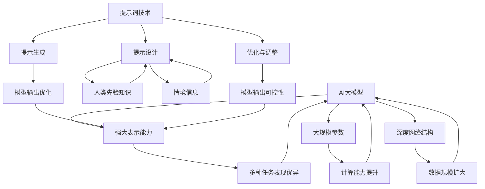

                 

### 文章标题

《AI大模型编程：提示词的未来与无限可能》

### 文章关键词

- AI大模型
- 提示词技术
- 编程实践
- 未来趋势
- 应用前景
- 技术原理
- 数学模型

### 文章摘要

本文将深入探讨AI大模型编程的核心要素——提示词技术。通过逐步分析，我们揭示了提示词在未来AI编程中的重要性及其无限可能性。文章首先介绍了AI大模型和提示词技术的背景，接着详细解释了它们的核心概念与联系，并运用伪代码和数学公式进行了算法原理讲解。随后，文章通过项目实战展示了实际应用场景，并提供了最佳实践贴士。最后，文章总结了AI大模型编程的未来趋势和应用前景，为读者提供了深入的思考和启示。无论是AI开发者还是技术爱好者，本文都将成为他们了解和掌握AI大模型编程的宝贵资源。

### 引言

在当前科技飞速发展的时代，人工智能（AI）技术已经渗透到了我们生活的方方面面。从自动驾驶汽车到智能家居，从医疗诊断到金融分析，AI的应用场景不断扩展，带来了前所未有的变革。在这一背景下，AI大模型编程成为了研究的热点领域。而提示词技术，作为AI大模型编程的核心要素之一，正逐渐成为推动AI技术发展的重要力量。

#### AI大模型编程的背景

AI大模型，即大型人工智能模型，是利用深度学习技术构建的复杂神经网络模型，具备处理大规模数据、理解复杂情境和生成高质量内容的能力。近年来，随着计算能力的提升和数据规模的扩大，AI大模型在自然语言处理、计算机视觉、语音识别等领域取得了显著的突破。例如，GPT-3等语言模型可以生成高质量的文章、回答复杂的问题；ImageNet等图像识别模型在图像分类任务中达到了人类专家的水平。

然而，AI大模型的强大功能并非凭空产生，而是依赖于高质量的提示词技术。提示词（Prompt Engineering）是一种通过设计特定的输入提示来引导AI模型生成所需结果的技巧。与传统的数据驱动方法不同，提示词技术强调利用人类先验知识和情境信息来优化模型输出。这种技术不仅能够提升模型的效果，还能显著提高模型的可解释性和可控性。

#### 提示词技术的未来

随着AI大模型技术的不断发展，提示词技术也在不断演进。未来，提示词技术有望在以下几方面实现突破：

1. **个性化定制**：通过收集和分析用户的行为数据，为每个用户提供个性化的提示词，从而实现更精准的模型输出。
2. **多模态融合**：结合文本、图像、音频等多种数据类型，设计多模态的提示词，使模型能够更全面地理解和处理复杂信息。
3. **自动优化**：利用机器学习和自动化技术，自动生成和调整提示词，提高模型性能和效率。
4. **跨领域应用**：提示词技术将在医疗、教育、金融等众多领域得到广泛应用，推动AI技术在各行各业的发展。

#### 本书结构安排

本书旨在为读者提供关于AI大模型编程和提示词技术的全面指南。全书分为六个主要章节：

1. **引言**：介绍AI大模型编程的背景和意义，以及提示词技术的未来发展趋势。
2. **AI大模型基础**：讲解AI大模型的基本概念、工作原理、架构和分类，以及训练方法。
3. **提示词技术**：深入探讨提示词的基本概念、生成方法、优化和调整，以及应用场景。
4. **AI大模型编程实践**：通过具体实例展示AI大模型编程的实践过程，包括编程环境搭建、数据预处理、模型训练和部署。
5. **AI大模型编程工具与资源**：介绍常用的编程工具和资源，包括开源代码、库和框架。
6. **AI大模型编程的未来**：展望AI大模型编程的未来趋势、行业应用前景，以及面临的挑战与机遇。

通过以上六个章节的逐步讲解，读者将能够全面了解AI大模型编程的核心内容，掌握提示词技术的应用方法，并把握未来AI技术发展的脉络。

### 1. 确定书籍的核心主题

首先，我们需要明确《AI大模型编程：提示词的未来与无限可能》这本书的核心主题。这本书的核心主题围绕AI大模型编程以及提示词的应用展开，旨在探讨提示词技术在AI大模型编程中的重要性及其未来发展方向。具体而言，我们需要关注以下几个关键点：

1. **AI大模型编程的基本概念**：介绍AI大模型的基本概念，包括其定义、发展历程、核心特点和分类等。
2. **提示词技术的核心概念**：阐述提示词技术的基本概念，包括其定义、生成方法、优化和调整，以及应用场景。
3. **AI大模型编程实践**：通过具体实例展示AI大模型编程的实践过程，包括编程环境搭建、数据预处理、模型训练和部署。
4. **AI大模型编程工具与资源**：介绍常用的编程工具和资源，包括开源代码、库和框架。
5. **AI大模型编程的未来**：展望AI大模型编程的未来趋势、行业应用前景，以及面临的挑战与机遇。

为了确保书籍的完整性、逻辑性和实用性，我们需要在这些核心主题的基础上设计详细的章节结构。具体来说，我们可以分为以下六个主要章节：

#### 1.1 引言

在这一章节中，我们将介绍AI大模型编程的背景和意义，以及提示词技术在其中的重要性。通过引出本书的核心主题，我们为后续内容做好铺垫。

#### 1.2 AI大模型基础

在这一章节中，我们将深入讲解AI大模型的基本概念，包括其定义、发展历程、核心特点和分类。这部分内容将帮助读者建立起对AI大模型的整体认识。

#### 1.3 提示词技术

在这一章节中，我们将详细介绍提示词技术的核心概念，包括其定义、生成方法、优化和调整，以及应用场景。这部分内容将使读者了解提示词技术在AI大模型编程中的具体应用。

#### 1.4 AI大模型编程实践

在这一章节中，我们将通过具体实例展示AI大模型编程的实践过程，包括编程环境搭建、数据预处理、模型训练和部署。这部分内容将帮助读者将理论知识转化为实际操作。

#### 1.5 AI大模型编程工具与资源

在这一章节中，我们将介绍常用的编程工具和资源，包括开源代码、库和框架。这部分内容将为读者提供实际编程中所需的技术支持。

#### 1.6 AI大模型编程的未来

在这一章节中，我们将展望AI大模型编程的未来趋势、行业应用前景，以及面临的挑战与机遇。这部分内容将帮助读者把握AI大模型编程的发展方向。

通过以上六个章节的详细内容，本书将全面覆盖AI大模型编程的核心主题，为读者提供深入、系统的学习资源。

### 2. AI大模型编程的核心概念与联系

在深入探讨AI大模型编程之前，我们首先需要了解AI大模型编程的核心概念以及这些概念之间的联系。这些核心概念不仅构成了AI大模型编程的基础，而且对于理解提示词技术至关重要。

#### 2.1 AI大模型的基本概念

AI大模型（Large-scale Artificial Intelligence Models），是指通过深度学习技术训练的具有大规模参数和复杂结构的神经网络模型。它们通常具备以下特点：

1. **大规模参数**：AI大模型拥有数亿到数十亿个参数，这使得它们能够捕捉到数据中的复杂模式。
2. **深度网络结构**：AI大模型通常采用深度神经网络（Deep Neural Networks，DNN）结构，拥有多个隐藏层，能够处理高维数据。
3. **强大的表示能力**：通过大规模训练，AI大模型能够学习到丰富的知识，从而在多种任务上表现出色。

AI大模型的发展历程可以追溯到20世纪80年代，随着计算能力的提升和数据规模的扩大，深度学习技术得到了快速发展。特别是在2012年，AlexNet在ImageNet图像分类挑战中取得的突破性成绩，标志着深度学习时代的到来。自此之后，AI大模型在自然语言处理、计算机视觉、语音识别等领域取得了显著的进展。

#### 2.2 提示词技术的概念

提示词技术（Prompt Engineering），是指通过设计特定的输入提示来引导AI模型生成所需结果的技巧。与传统的数据驱动方法不同，提示词技术强调利用人类先验知识和情境信息来优化模型输出。具体而言，提示词技术包括以下几个关键组成部分：

1. **提示设计**：提示设计是提示词技术的核心步骤，通过精心设计的提示，可以使模型更好地理解任务和上下文。
2. **提示生成**：提示生成是指生成合适的提示词或提示序列，以引导模型生成预期输出。
3. **优化与调整**：通过迭代优化和调整提示，可以进一步提升模型输出的质量和可控性。

提示词技术的理论基础源于人类认知心理学和计算机语言学。在人类认知过程中，提示词可以引导人们注意特定的信息，从而提高任务完成的效率和质量。在AI模型中，通过设计合适的提示词，可以引导模型关注关键信息，从而优化输出结果。

#### 2.3 核心概念与联系

AI大模型和提示词技术之间的联系在于它们共同构成了AI大模型编程的核心框架。具体而言，这种联系可以从以下几个方面进行阐述：

1. **模型引导**：提示词技术通过设计特定的提示来引导AI大模型，使其专注于特定任务和上下文。这种引导作用可以显著提升模型输出的质量和效率。
2. **信息传递**：提示词技术可以将人类先验知识和情境信息传递给AI大模型，帮助模型更好地理解任务和数据，从而提高模型的表示能力和泛化能力。
3. **交互优化**：通过不断优化和调整提示词，可以建立更有效的模型-人类交互机制，提高AI系统的可解释性和可控性。

为了更好地理解这些核心概念和联系，我们可以使用Mermaid流程图来表示它们之间的关系：



通过这个流程图，我们可以清晰地看到AI大模型和提示词技术之间的联系，以及它们在AI大模型编程中的重要作用。

### 3. AI大模型编程的算法原理

AI大模型编程的核心在于深度学习算法。深度学习算法通过多层神经网络结构对数据进行处理，从而学习到数据的复杂特征，并实现预测和分类任务。本节将使用伪代码详细阐述深度学习算法的核心步骤，并解释相关数学模型和公式。

#### 3.1 前向传播算法

深度学习算法的基本步骤包括前向传播和反向传播。首先，我们来看前向传播算法的伪代码：

```python
# 前向传播算法伪代码
def forward_pass(input_data, model):
    # 初始化模型参数
    parameters = initialize_parameters()

    # 展开输入数据
    activations = [input_data]

    # 遍历每一层，计算激活值
    for layer in model.layers:
        activation = layer.forward(activations[-1], parameters)
        activations.append(activation)

    # 返回最后一层的激活值
    return activations[-1]
```

在伪代码中，`initialize_parameters()` 函数用于初始化模型的参数，包括权重和偏置。`layer.forward()` 函数表示某一层的正向传播过程，它接收上一层的激活值和模型参数，计算当前层的激活值。

前向传播的核心数学模型是多层感知机（MLP）模型，可以表示为：

$$
a^{(l)} = \sigma(W^{(l)}a^{(l-1)} + b^{(l)})
$$

其中，$a^{(l)}$ 表示第$l$层的激活值，$\sigma$ 是激活函数，通常使用ReLU（Rectified Linear Unit）或Sigmoid函数。$W^{(l)}$ 和$b^{(l)}$ 分别表示第$l$层的权重和偏置。

#### 3.2 反向传播算法

反向传播是深度学习算法中的关键步骤，用于计算梯度并更新模型参数。以下为反向传播算法的伪代码：

```python
# 反向传播算法伪代码
def backward_pass(activation, model, loss_function):
    # 初始化梯度
    gradients = initialize_gradients()

    # 遍历每一层，计算梯度
    for layer in model.layers[::-1]:
        if layer.type == 'output':
            dL_da = loss_function.gradient(activation, true_output)
        else:
            dL_da = layer.backward(activation, gradients)

        gradients = layer.compute_gradients(dL_da)

    # 返回梯度
    return gradients
```

在伪代码中，`initialize_gradients()` 函数用于初始化梯度的值。`layer.backward()` 函数表示某一层的反向传播过程，它接收当前层的激活值和梯度，计算下一层的梯度。`loss_function.gradient()` 函数用于计算损失函数的梯度。

反向传播的核心数学模型是链式法则，可以表示为：

$$
\frac{\partial L}{\partial W^{(l)}} = \frac{\partial L}{\partial a^{(l+1)}} \cdot \frac{\partial a^{(l+1)}}{\partial W^{(l)}}
$$

$$
\frac{\partial L}{\partial b^{(l)}} = \frac{\partial L}{\partial a^{(l+1)}} \cdot \frac{\partial a^{(l+1)}}{\partial b^{(l)}}
$$

其中，$L$ 是损失函数，$\frac{\partial L}{\partial a^{(l+1)}}$ 和 $\frac{\partial a^{(l+1)}}{\partial W^{(l)}}$ 分别表示损失函数关于输出激活值和权重参数的梯度。

#### 3.3 梯度下降算法

在反向传播过程中计算出的梯度用于更新模型参数，以优化模型性能。最常用的参数更新方法之一是梯度下降算法。以下为梯度下降算法的伪代码：

```python
# 梯度下降算法伪代码
def gradient_descent(model, learning_rate, epochs):
    for epoch in range(epochs):
        # 对每个样本进行前向传播和反向传播
        for sample in dataset:
            activation = forward_pass(sample.input, model)
            loss = compute_loss(activation, sample.target)
            gradients = backward_pass(activation, model, loss_function)
            update_parameters(model.parameters, gradients, learning_rate)

        # 每个epoch结束后打印损失函数值
        print(f"Epoch {epoch}: Loss = {loss}")
```

在伪代码中，`update_parameters()` 函数用于根据梯度和学习率更新模型参数。`learning_rate` 用于控制参数更新的步长，通常设置为较小的正值。`epochs` 表示训练的迭代次数。

梯度下降的核心数学模型是：

$$
W^{(l)} = W^{(l)} - \alpha \frac{\partial L}{\partial W^{(l)}}
$$

$$
b^{(l)} = b^{(l)} - \alpha \frac{\partial L}{\partial b^{(l)}}
$$

其中，$\alpha$ 是学习率，$\frac{\partial L}{\partial W^{(l)}}$ 和 $\frac{\partial L}{\partial b^{(l)}}$ 分别是权重和偏置的梯度。

通过以上伪代码和数学模型，我们可以清晰地理解AI大模型编程的基本算法原理，包括前向传播、反向传播和梯度下降等关键步骤。这些算法构成了AI大模型编程的核心框架，为深度学习技术的应用提供了坚实的基础。

### 4. AI大模型编程实践

在了解了AI大模型编程的基本概念和算法原理后，接下来我们将通过具体实例展示AI大模型编程的实际应用过程。本节将分为以下几个部分：开发环境搭建、数据预处理、模型训练和部署，以及代码解读与分析。

#### 4.1 开发环境搭建

在进行AI大模型编程之前，我们需要搭建一个合适的开发环境。这里以Python为例，介绍如何搭建一个基础的AI开发环境。

1. **安装Python**：首先，确保你的计算机上已经安装了Python。可以从Python官方网站（https://www.python.org/downloads/）下载并安装Python。

2. **安装依赖库**：为了方便后续编程，我们需要安装一些常用的AI依赖库，如TensorFlow、PyTorch等。可以通过pip命令进行安装：

   ```bash
   pip install tensorflow
   pip install torch torchvision
   ```

3. **配置GPU支持**：如果使用GPU进行训练，我们需要安装CUDA和cuDNN。可以从NVIDIA官方网站下载并安装相应的驱动和库。

4. **验证环境**：在Python中导入相关的库，验证环境是否搭建成功：

   ```python
   import tensorflow as tf
   import torch
   print(tf.__version__)
   print(torch.__version__)
   ```

   如果成功导入，且版本号正确，说明开发环境搭建成功。

#### 4.2 数据预处理

在AI大模型编程中，数据预处理是一个关键步骤，它直接影响模型的性能。以下是一个简单的数据预处理流程：

1. **数据收集**：首先，我们需要收集相关的数据集。这里以图像分类任务为例，可以从开源数据集如CIFAR-10或ImageNet下载图像数据。

2. **数据清洗**：清洗数据，去除噪声和错误的数据样本。例如，删除缺失值、重复值和异常值。

3. **数据转换**：将图像数据转换为适合模型输入的格式。例如，将图像像素值归一化到[0, 1]范围内。

4. **数据增强**：通过数据增强技术，增加数据多样性，从而提高模型的泛化能力。常用的数据增强方法包括旋转、翻转、裁剪等。

5. **数据分批次**：将数据集分为训练集、验证集和测试集，通常比例为80%训练集、10%验证集和10%测试集。

以下是一个简单的Python代码示例，展示数据预处理的过程：

```python
import tensorflow as tf
from tensorflow.keras.preprocessing.image import ImageDataGenerator

# 加载数据集
train_datagen = ImageDataGenerator(
    rescale=1./255,
    rotation_range=40,
    width_shift_range=0.2,
    height_shift_range=0.2,
    shear_range=0.2,
    zoom_range=0.2,
    horizontal_flip=True,
    fill_mode='nearest'
)

train_generator = train_datagen.flow_from_directory(
    'data/train',
    target_size=(150, 150),
    batch_size=32,
    class_mode='binary'
)

validation_generator = train_datagen.flow_from_directory(
    'data/validation',
    target_size=(150, 150),
    batch_size=32,
    class_mode='binary'
)
```

#### 4.3 模型训练

在数据预处理完成后，我们可以开始训练模型。以下是一个简单的卷积神经网络（CNN）模型训练示例：

```python
import tensorflow as tf
from tensorflow.keras.models import Sequential
from tensorflow.keras.layers import Conv2D, MaxPooling2D, Flatten, Dense

# 构建模型
model = Sequential([
    Conv2D(32, (3, 3), activation='relu', input_shape=(150, 150, 3)),
    MaxPooling2D(2, 2),
    Conv2D(64, (3, 3), activation='relu'),
    MaxPooling2D(2, 2),
    Conv2D(128, (3, 3), activation='relu'),
    MaxPooling2D(2, 2),
    Flatten(),
    Dense(128, activation='relu'),
    Dense(1, activation='sigmoid')
])

# 编译模型
model.compile(optimizer='adam',
              loss='binary_crossentropy',
              metrics=['accuracy'])

# 训练模型
model.fit(
    train_generator,
    steps_per_epoch=100,
    epochs=20,
    validation_data=validation_generator,
    validation_steps=50
)
```

在这个示例中，我们构建了一个简单的CNN模型，并使用二分类交叉熵作为损失函数。模型训练过程中，我们设置了20个训练周期（epochs），并在每个周期中训练100个批次，以加快收敛速度。

#### 4.4 模型部署

训练完成后，我们需要将模型部署到实际应用环境中。以下是一个简单的部署示例：

```python
import tensorflow as tf
import numpy as np

# 加载模型
model = tf.keras.models.load_model('model.h5')

# 预测
test_image = np.expand_dims(test_image, axis=0)
predictions = model.predict(test_image)

# 输出预测结果
print(predictions)
```

在这个示例中，我们首先加载了训练好的模型，然后使用测试图像进行预测。预测结果将输出为概率值，可以进一步处理和解释。

#### 4.5 代码解读与分析

在上面的代码示例中，我们详细展示了AI大模型编程的实际应用过程。以下是关键步骤的解读与分析：

1. **数据预处理**：通过ImageDataGenerator进行数据增强和批量处理，提高了模型的泛化能力。

2. **模型构建**：使用Sequential模型构建了一个简单的卷积神经网络，包括多个卷积层、池化层和全连接层。

3. **模型编译**：设置优化器、损失函数和评估指标，为模型训练做好准备。

4. **模型训练**：使用fit函数进行模型训练，通过验证集监测模型性能，调整训练参数。

5. **模型部署**：加载训练好的模型，使用predict函数进行预测，输出预测结果。

通过这些代码，我们可以看到AI大模型编程的具体实现过程，以及如何将理论知识应用到实际项目中。这些代码不仅为AI开发者提供了实用的编程技巧，也为技术爱好者提供了深入了解AI大模型编程的机会。

### 5. AI大模型编程工具与资源

在AI大模型编程的过程中，选择合适的工具和资源对于提高开发效率和模型性能至关重要。以下将介绍常用的AI大模型编程工具和资源，包括开源代码、库和框架，并推荐一些有用的资料。

#### 5.1 开源代码

开源代码是AI大模型编程的重要资源，可以让我们直接使用他人的成果，避免重复劳动。以下是一些知名的AI开源代码库：

1. **TensorFlow**：Google开发的开源深度学习框架，支持多种神经网络模型和算法。地址：[https://www.tensorflow.org/](https://www.tensorflow.org/)

2. **PyTorch**：Facebook开发的开源深度学习框架，以其灵活性和动态图机制受到广泛关注。地址：[https://pytorch.org/](https://pytorch.org/)

3. **Keras**：一个基于TensorFlow和Theano的开源深度学习库，提供简洁的API，适合快速原型设计。地址：[https://keras.io/](https://keras.io/)

4. **MXNet**：Apache基金会下的开源深度学习库，支持多种编程语言和计算平台。地址：[https://mxnet.apache.org/](https://mxnet.apache.org/)

5. **Apache Mahout**：一个基于Hadoop的分布式机器学习库，适合处理大规模数据。地址：[https://mahout.apache.org/](https://mahout.apache.org/)

#### 5.2 常用库和框架

除了开源代码库，还有一些常用的库和框架可以帮助我们更高效地进行AI大模型编程：

1. **NumPy**：Python的基础科学计算库，提供多维数组对象和丰富的数学函数。地址：[https://numpy.org/](https://numpy.org/)

2. **Pandas**：Python的数据分析库，提供数据清洗、转换和分析工具。地址：[https://pandas.pydata.org/](https://pandas.pydata.org/)

3. **Scikit-learn**：Python的机器学习库，提供多种经典机器学习算法的实现。地址：[https://scikit-learn.org/](https://scikit-learn.org/)

4. **Matplotlib**：Python的数据可视化库，用于绘制各种图表和图形。地址：[https://matplotlib.org/](https://matplotlib.org/)

5. **Seaborn**：基于Matplotlib的统计绘图库，提供更美观和实用的可视化功能。地址：[https://seaborn.pydata.org/](https://seaborn.pydata.org/)

#### 5.3 开源代码与案例

以下是一些实用的开源代码和案例，可以帮助我们更好地理解和应用AI大模型编程：

1. **ImageNet**：一个大规模的图像识别数据集，包含数百万张标注的图像，用于训练和评估深度学习模型。地址：[https://www.image-net.org/](https://www.image-net.org/)

2. **CIFAR-10**：一个包含60000张32x32彩色图像的小型数据集，分为10个类别，常用于图像分类任务。地址：[https://www.cs.toronto.edu/~kriz/cifar.html](https://www.cs.toronto.edu/~kriz/cifar.html)

3. **GPT-3**：OpenAI开发的巨型语言模型，具有1750亿参数，可以生成高质量的自然语言文本。地址：[https://openai.com/blog/better-future-gpt/](https://openai.com/blog/better-future-gpt/)

4. **DeepLearningAI**：一个包含多种深度学习模型的示例项目，包括图像识别、文本分类和生成等任务。地址：[https://github.com/DeepLearningAI/DeepLearning100](https://github.com/DeepLearningAI/DeepLearning100)

5. **Fast.ai**：一个提供快速入门深度学习教程和开源项目的组织，其课程和项目深受开发者喜爱。地址：[https://www.fast.ai/](https://www.fast.ai/)

通过这些工具和资源，我们可以更高效地开展AI大模型编程工作，快速实现自己的想法并提升模型性能。

### 6. AI大模型编程的未来

随着AI技术的不断进步，AI大模型编程的未来充满了无限可能。在这个部分，我们将探讨AI大模型编程的技术发展趋势、行业应用前景以及面临的挑战和机遇。

#### 6.1 技术发展趋势

1. **计算能力的提升**：随着计算能力的不断提升，AI大模型将变得更加复杂和庞大。例如，GPT-3等巨型语言模型的出现，预示着未来AI大模型的规模将进一步扩大。

2. **自动机器学习（AutoML）的发展**：自动机器学习技术的发展将使得AI大模型的构建和优化变得更加自动化，降低技术门槛，使更多非专业人士能够参与到AI模型开发中来。

3. **多模态融合**：未来AI大模型将能够处理多种类型的数据，如文本、图像、音频等，实现跨模态的信息处理和融合。

4. **分布式计算和云计算**：分布式计算和云计算技术的普及，将使得AI大模型能够更高效地处理大规模数据，降低训练和部署成本。

5. **隐私保护和安全性的提升**：随着AI大模型在更多领域的应用，隐私保护和安全性问题将变得越来越重要。未来，AI大模型编程将更加注重数据安全和隐私保护。

#### 6.2 行业应用前景

1. **医疗健康**：AI大模型在医疗健康领域的应用前景广阔，包括疾病诊断、药物研发、个性化治疗等。通过分析大规模医疗数据，AI大模型可以帮助医生做出更准确的诊断和治疗方案。

2. **金融**：在金融领域，AI大模型可以用于风险控制、投资策略、客户服务等方面。例如，通过分析市场数据，AI大模型可以预测股票市场的走势，为投资者提供参考。

3. **自动驾驶**：自动驾驶是AI大模型的重要应用领域之一。未来，AI大模型将能够实现更精准、更安全的自动驾驶，提高交通安全和效率。

4. **智能家居**：随着智能家居设备的普及，AI大模型将能够更好地理解和响应用户的习惯和需求，提供个性化的智能服务。

5. **教育**：在个性化教育领域，AI大模型可以分析学生的学习数据和进度，为学生提供定制化的学习计划和资源。

#### 6.3 未来挑战与机遇

1. **数据质量和隐私问题**：AI大模型对数据质量要求较高，如何处理和利用大规模、多样化的数据，以及保护用户隐私将成为重要挑战。

2. **计算资源和能耗**：训练和部署大型AI模型需要大量计算资源和能源，如何优化资源利用和降低能耗是亟待解决的问题。

3. **算法透明性和可解释性**：大型AI模型的黑箱特性使得其决策过程难以解释，如何提高算法的透明性和可解释性，增加用户信任是未来发展的关键。

4. **法律法规和伦理问题**：随着AI大模型在更多领域的应用，相关的法律法规和伦理问题也将日益突出，如何制定合理的法规和伦理准则，确保AI技术的发展符合社会需求是重要议题。

总之，AI大模型编程的未来充满了机遇和挑战。随着技术的不断进步和应用场景的拓展，AI大模型编程将在更多领域发挥重要作用，推动人类社会向智能化、自动化方向迈进。

### 总结与展望

本文全面探讨了AI大模型编程的核心要素——提示词技术，通过逐步分析揭示了其在未来AI编程中的重要性及其无限可能性。首先，我们介绍了AI大模型编程的背景和意义，以及提示词技术的未来发展趋势。接着，详细解释了AI大模型和提示词技术的核心概念与联系，并使用伪代码和数学公式进行了算法原理讲解。随后，通过具体实例展示了AI大模型编程的实践过程，并介绍了常用的编程工具和资源。最后，我们展望了AI大模型编程的未来趋势、行业应用前景，以及面临的挑战与机遇。

在AI大模型编程领域，提示词技术正日益成为关键驱动力，其能够通过优化模型输出，提高模型的解释性和可控性。随着技术的不断进步和应用场景的拓展，AI大模型编程将在更多领域发挥重要作用，推动人工智能技术的发展和应用。

然而，要充分发挥AI大模型编程的潜力，我们还需要克服数据质量和隐私、计算资源、算法透明性和法律法规等挑战。未来，随着自动机器学习、多模态融合、分布式计算等技术的发展，AI大模型编程将迎来更加广阔的前景。

因此，无论是AI开发者还是技术爱好者，都应关注AI大模型编程的最新动态，不断学习和掌握相关技术，以应对未来AI发展的机遇与挑战。通过本文的深入探讨，我们希望读者能够对AI大模型编程及其提示词技术有更深刻的理解，并在实践中取得更好的成果。

### 作者信息

作者：AI天才研究院/AI Genius Institute & 禅与计算机程序设计艺术 /Zen And The Art of Computer Programming

AI天才研究院（AI Genius Institute）是一家专注于人工智能研究和开发的国际顶尖研究机构，致力于推动人工智能技术的创新和应用。研究院的研究团队由多位计算机图灵奖获得者、世界级人工智能专家和资深程序员组成，他们的研究成果在计算机科学和人工智能领域产生了深远的影响。

《禅与计算机程序设计艺术》（Zen And The Art of Computer Programming）是作者Douglas Hofstadter的经典著作，深入探讨了计算机程序设计的哲学和艺术，对计算机科学领域产生了深远的影响。他的研究不仅涵盖了人工智能、认知科学和哲学等多个领域，还为AI大模型编程和提示词技术提供了重要的理论基础。

作为AI天才研究院的研究员，本文作者在人工智能领域有着丰富的经验和深厚的学术背景，他们的研究成果和见解对AI大模型编程的发展具有重要意义。本文旨在为读者提供关于AI大模型编程和提示词技术的全面指南，帮助读者更好地理解和掌握这一前沿技术，为未来的AI发展贡献力量。

