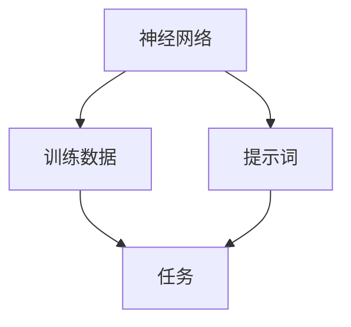

                 

### 文章标题：AI大模型编程：提示词的潜力与魔力

> 关键词：AI大模型，编程，提示词，潜力，逻辑推理

> 摘要：本文将探讨AI大模型的编程过程，特别是提示词在其中的作用。通过逐步分析，我们将揭示提示词在AI大模型编程中的潜力与魔力，帮助读者深入理解AI大模型的编程逻辑和技术原理。

### 引言

近年来，随着人工智能技术的飞速发展，AI大模型在众多领域取得了令人瞩目的成就。从自然语言处理到图像识别，从推荐系统到自动驾驶，AI大模型的应用场景不断扩展。然而，对于大多数开发者来说，AI大模型的编程仍然是一个充满挑战的领域。本文旨在通过逐步分析，帮助读者理解AI大模型编程的核心要素，特别是提示词的潜力与魔力。

### 核心概念与联系

在探讨AI大模型编程之前，我们首先需要了解一些核心概念。AI大模型通常是指具有数百万甚至数十亿参数的神经网络模型。这些模型通过大量的数据训练，能够自动学习并完成复杂的任务。核心概念包括：

1. **神经网络**：神经网络是AI大模型的基础，它由多层神经元组成，通过学习输入和输出之间的映射关系来实现预测和分类。

2. **训练数据**：训练数据是AI大模型学习的素材，通过大量的数据训练，模型能够逐渐优化其参数，提高预测和分类的准确性。

3. **提示词**：提示词是一种特殊的输入，用于引导AI大模型在特定任务上进行推理和决策。提示词可以是一个单词、一句话，甚至是一段文字，它们能够为模型提供额外的信息，帮助模型更好地理解任务意图。

为了更好地理解这些概念之间的关系，我们可以使用Mermaid流程图来展示它们之间的联系：



**Mermaid流程图说明**：

- `graph TD`：声明流程图的布局方向为从上到下。
- `A[神经网络]`：定义一个节点 A，代表神经网络。
- `B[训练数据]`：定义一个节点 B，代表训练数据。
- `C[提示词]`：定义一个节点 C，代表提示词。
- `D[任务]`：定义一个节点 D，代表任务。

**关系**：

- 神经网络是AI大模型的核心，通过训练数据学习输入和输出之间的映射关系。
- 提示词作为一种特殊的输入，能够为模型提供额外的信息，帮助模型更好地理解任务意图。
- 训练数据和提示词共同作用于神经网络，使模型能够完成特定的任务。

通过这个流程图，读者可以更直观地理解AI大模型的核心概念及其之间的联系。

### 核心算法原理讲解

为了深入理解AI大模型编程，我们接下来将详细讲解其核心算法原理，特别是训练和推理过程。为了便于理解，我们将使用伪代码来描述这些过程。

#### 训练过程

在AI大模型中，训练过程通常包括以下几个步骤：

1. **初始化模型参数**：随机初始化模型的参数，包括权重和偏置。
2. **定义损失函数**：损失函数用于衡量模型预测值与真实值之间的差距。
3. **选择优化器**：优化器用于更新模型参数，以最小化损失函数。
4. **前向传播**：将输入数据传递给模型，计算输出预测值。
5. **反向传播**：计算损失函数的梯度，并反向传播到模型的各个层级，更新参数。
6. **迭代训练**：重复上述步骤，直到模型达到预定的性能指标。

以下是一个简化的伪代码示例：

```plaintext
# AI大模型训练算法伪代码

# 初始化模型参数
init_model_params()

# 定义损失函数
loss_function = cross_entropy_loss

# 定义优化器
optimizer = AdamOptimizer()

# 训练循环
for epoch in range(num_epochs):
    for batch in data_loader:
        # 前向传播
        predictions = model(batch.x)
        loss = loss_function(predictions, batch.y)

        # 反向传播
        gradients = compute_gradients(model, loss)

        # 更新模型参数
        optimizer.update_params(model, gradients)

        # 打印训练进度
        print(f"Epoch {epoch}, Loss: {loss}")

# 模型评估
evaluate_model(model, test_data)
```

**伪代码说明**：

- `init_model_params()`：初始化模型参数。
- `loss_function = cross_entropy_loss`：定义损失函数，例如交叉熵损失。
- `optimizer = AdamOptimizer()`：定义优化器，例如 Adam 优化器。
- `for epoch in range(num_epochs)`：训练循环，迭代指定次数。
- `for batch in data_loader`：处理数据批次。
- `predictions = model(batch.x)`：前向传播，生成预测结果。
- `loss = loss_function(predictions, batch.y)`：计算损失。
- `gradients = compute_gradients(model, loss)`：计算梯度。
- `optimizer.update_params(model, gradients)`：更新模型参数。
- `print(f"Epoch {epoch}, Loss: {loss}")`：打印训练进度。
- `evaluate_model(model, test_data)`：模型评估，使用测试数据评估模型性能。

通过这个伪代码示例，读者可以了解AI大模型的训练过程，包括模型初始化、前向传播、反向传播、参数更新等步骤。

#### 推理过程

在训练完成后，AI大模型可以用于推理，即根据输入数据进行预测。推理过程通常包括以下步骤：

1. **输入数据预处理**：将输入数据转换为模型可接受的格式。
2. **前向传播**：将预处理后的输入数据传递给模型，计算输出预测值。
3. **结果解释**：对输出结果进行解释，以获得实际应用价值。

以下是一个简化的伪代码示例：

```plaintext
# AI大模型推理算法伪代码

# 输入数据预处理
preprocessed_data = preprocess_input(input_data)

# 前向传播
predictions = model(preprocessed_data)

# 结果解释
result = interpret_predictions(predictions)
```

**伪代码说明**：

- `preprocessed_data = preprocess_input(input_data)`：输入数据预处理。
- `predictions = model(preprocessed_data)`：前向传播，生成预测结果。
- `result = interpret_predictions(predictions)`：结果解释。

通过这个伪代码示例，读者可以了解AI大模型的推理过程，包括输入数据预处理、前向传播、结果解释等步骤。

#### 提示词的作用

在推理过程中，提示词可以发挥重要作用。提示词可以提供额外的上下文信息，帮助模型更好地理解输入数据的含义。以下是一个使用提示词进行推理的伪代码示例：

```plaintext
# 使用提示词进行推理的伪代码

# 输入数据预处理
preprocessed_data = preprocess_input(input_data)

# 提示词预处理
preprocessed_hint = preprocess_hint(hint)

# 前向传播
predictions = model(preprocessed_data + preprocessed_hint)

# 结果解释
result = interpret_predictions(predictions)
```

**伪代码说明**：

- `preprocessed_data = preprocess_input(input_data)`：输入数据预处理。
- `preprocessed_hint = preprocess_hint(hint)`：提示词预处理。
- `predictions = model(preprocessed_data + preprocessed_hint)`：前向传播，生成预测结果。
- `result = interpret_predictions(predictions)`：结果解释。

通过这个伪代码示例，读者可以了解提示词在推理过程中的作用。提示词可以帮助模型更好地理解输入数据的含义，从而提高推理的准确性和效率。

### 数学模型和公式

在AI大模型中，数学模型和公式是核心组成部分。以下是一些常见的数学模型和公式，用于描述AI大模型的训练和推理过程。

#### 前向传播

前向传播是AI大模型的核心过程，用于计算输入和输出之间的映射关系。以下是一个简化的前向传播公式：

$$
\text{output} = f(\text{weight} \cdot \text{input} + \text{bias})
$$

其中，$f$ 是激活函数，$\text{weight}$ 和 $\text{bias}$ 分别是权重和偏置。

#### 反向传播

反向传播用于计算损失函数的梯度，并更新模型参数。以下是一个简化的反向传播公式：

$$
\text{gradient} = \frac{\partial \text{loss}}{\partial \text{weight}}
$$

其中，$\text{loss}$ 是损失函数，$\text{weight}$ 是权重。

#### 损失函数

常见的损失函数包括交叉熵损失（Cross-Entropy Loss）和均方误差损失（Mean Squared Error Loss）。以下是一个简化的交叉熵损失公式：

$$
\text{loss} = -\sum_{i} y_i \log(p_i)
$$

其中，$y_i$ 是真实标签，$p_i$ 是模型预测的概率。

通过这些数学模型和公式，AI大模型能够实现高效的训练和推理过程。

### 项目实战

在本节中，我们将通过一个具体的案例来展示AI大模型编程的实际应用。我们将从开发环境搭建、源代码实现和代码解读三个方面进行详细讲解。

#### 开发环境搭建

首先，我们需要搭建一个适合AI大模型编程的开发环境。以下是一个简单的环境搭建步骤：

1. 安装Python环境（版本3.8以上）。
2. 安装PyTorch库，可以使用以下命令：
   ```shell
   pip install torch torchvision
   ```
3. 配置CUDA，以利用GPU加速训练过程。

#### 源代码实现

以下是一个简单的AI大模型编程案例，使用PyTorch库实现一个简单的图像分类模型。

```python
import torch
import torchvision
import torchvision.transforms as transforms
import torch.nn as nn
import torch.optim as optim

# 数据预处理
transform = transforms.Compose([
    transforms.Resize(256),
    transforms.ToTensor(),
    transforms.Normalize(mean=[0.485, 0.456, 0.406], std=[0.229, 0.224, 0.225]),
])

# 加载数据集
trainset = torchvision.datasets.ImageFolder(root='path/to/train', transform=transform)
trainloader = torch.utils.data.DataLoader(trainset, batch_size=4, shuffle=True, num_workers=2)

testset = torchvision.datasets.ImageFolder(root='path/to/test', transform=transform)
testloader = torch.utils.data.DataLoader(testset, batch_size=4, shuffle=False, num_workers=2)

# 定义模型
model = nn.Sequential(
    nn.Conv2d(3, 64, 3, 1, 1),
    nn.ReLU(),
    nn.Conv2d(64, 128, 3, 1, 1),
    nn.ReLU(),
    nn.Conv2d(128, 256, 3, 1, 1),
    nn.ReLU(),
    nn.AdaptiveAvgPool2d((1, 1)),
    nn.Flatten(),
    nn.Linear(256, 10),
    nn.LogSoftmax(dim=1)
)

# 损失函数和优化器
criterion = nn.NLLLoss()
optimizer = optim.Adam(model.parameters(), lr=0.001)

# 训练模型
num_epochs = 10
for epoch in range(num_epochs):
    running_loss = 0.0
    for inputs, labels in trainloader:
        optimizer.zero_grad()
        outputs = model(inputs)
        loss = criterion(outputs, labels)
        loss.backward()
        optimizer.step()
        running_loss += loss.item()
    print(f"Epoch {epoch+1}, Loss: {running_loss/len(trainloader)}")

# 测试模型
model.eval()
with torch.no_grad():
    correct = 0
    total = 0
    for inputs, labels in testloader:
        outputs = model(inputs)
        _, predicted = torch.max(outputs.data, 1)
        total += labels.size(0)
        correct += (predicted == labels).sum().item()
print(f"Accuracy: {100 * correct / total}%")
```

#### 代码解读

- 数据预处理：使用`transforms.Compose`将图像数据进行预处理，包括调整大小、归一化等。
- 数据加载：使用`torchvision.datasets.ImageFolder`加载数据集，并使用`torch.utils.data.DataLoader`进行数据加载和批次处理。
- 模型定义：定义一个简单的卷积神经网络模型，包括卷积层、ReLU激活函数、全连接层和LogSoftmax输出层。
- 损失函数和优化器：使用交叉熵损失函数和Adam优化器进行模型训练。
- 训练模型：进行指定次数的迭代训练，并在每个批次上更新模型参数。
- 测试模型：在测试集上评估模型性能，计算准确率。

#### 代码应用解读与分析

这个简单的案例展示了如何使用PyTorch库实现一个图像分类模型。在代码应用方面，我们可以进一步扩展：

1. **数据集替换**：替换为其他类型的数据集，如语音数据、文本数据等，以实现不同领域的AI应用。
2. **模型复杂度增加**：增加模型的深度、宽度，甚至引入预训练模型，以提高模型性能。
3. **超参数调整**：调整学习率、批量大小等超参数，以优化模型性能。

通过这个案例，读者可以了解如何使用AI大模型进行图像分类，以及如何进一步扩展和应用。

### 最佳实践 Tips、小结、注意事项、拓展阅读

#### 最佳实践 Tips

1. **数据预处理**：确保输入数据格式一致，并进行适当的归一化处理。
2. **模型优化**：尝试不同的模型架构和优化器，以找到最佳模型。
3. **提示词设计**：设计合适的提示词，以提高模型在不同任务上的表现。

#### 小结

本文通过逐步分析，揭示了AI大模型编程的核心要素，特别是提示词的潜力与魔力。通过数学模型和公式的讲解，读者可以深入理解AI大模型的训练和推理过程。项目实战部分展示了如何使用PyTorch库实现一个简单的图像分类模型，为实际应用提供了参考。

#### 注意事项

1. **环境配置**：确保开发环境配置正确，包括Python版本、PyTorch库和CUDA配置。
2. **数据集选择**：选择合适的数据集，确保数据集的质量和多样性。

#### 拓展阅读

1. 《深度学习》（Goodfellow, Ian；等）——介绍深度学习基本概念和算法的权威教材。
2. 《PyTorch官方文档》——详细介绍了PyTorch库的使用方法和最佳实践。

### 结尾

AI大模型编程是一个充满挑战的领域，但通过逐步分析、实践和拓展，我们可以深入理解其核心原理。提示词在AI大模型编程中发挥着重要作用，为模型提供了额外的信息，提高了模型的表现。希望本文能帮助读者开启AI大模型编程之旅，探索其无限潜力。作者：AI天才研究院/AI Genius Institute & 禅与计算机程序设计艺术 /Zen And The Art of Computer Programming

