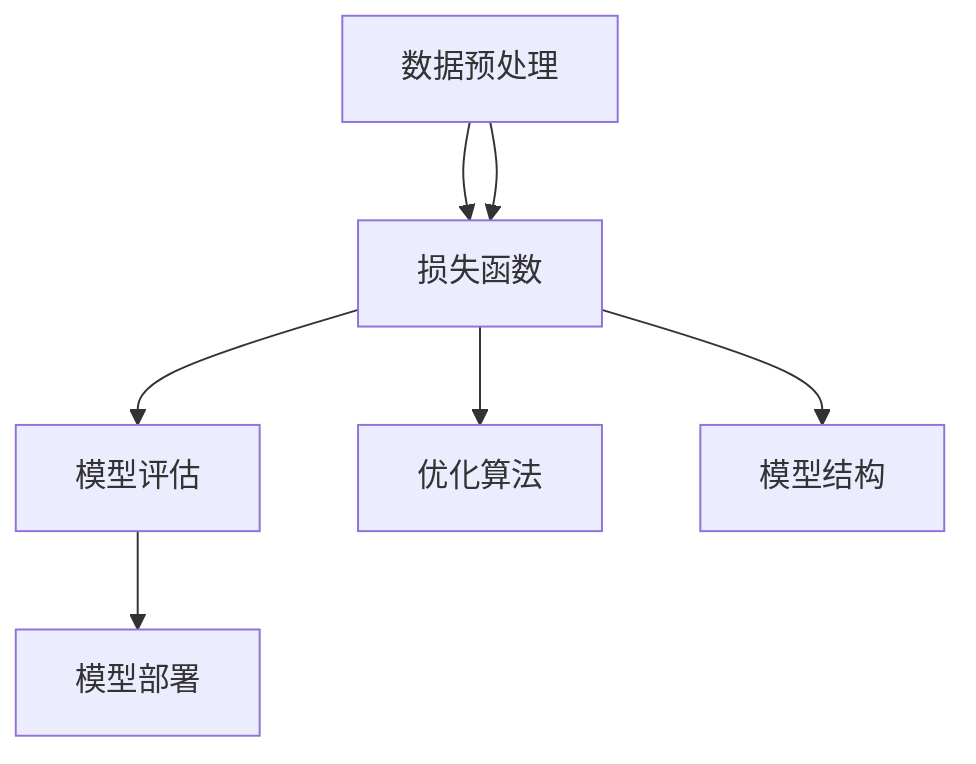

                 

### 文章标题：AI大模型编程：提示词的艺术与科学

---

**关键词：** AI大模型、提示词、编程、算法、数学模型、项目实战

**摘要：** 本文深入探讨了AI大模型编程中的关键要素——提示词，分析了其在AI大模型编程中的作用、设计原则和优化方法。通过详细阐述AI大模型的基础知识、核心算法原理、数学模型及项目实战，本文旨在为读者提供全面、系统的AI大模型编程指南，并探讨提示词在实际应用中的艺术与科学。

---

### 引言

随着深度学习和人工智能技术的飞速发展，AI大模型（Large-scale Artificial Intelligence Models）逐渐成为研究与应用的热点。这些大模型具有处理海量数据、生成高质量内容、进行复杂任务决策等能力，已经在自然语言处理、计算机视觉、语音识别等领域取得了显著的成果。然而，AI大模型编程并非易事，其中涉及诸多复杂的概念和实现细节。

本文将聚焦于AI大模型编程中的关键要素——提示词（Prompt），深入探讨其在模型训练和应用中的重要作用。提示词不仅影响模型的训练效果，还直接影响模型的性能和稳定性。因此，如何设计高效的提示词，优化模型的表现，是AI大模型编程中的一个核心问题。

接下来，本文将分为以下几个部分：

1. **AI大模型编程概述**：介绍AI大模型编程的基本概念和背景，阐述提示词的艺术与科学。
2. **核心概念与原理**：讲解AI大模型的基础知识、核心概念及工作原理。
3. **算法原理**：详细阐述AI大模型的核心算法原理，包括神经网络、优化算法等。
4. **数学模型**：介绍与AI大模型相关的数学模型和公式。
5. **项目实战**：通过实际项目展示AI大模型编程的实践方法和技巧。
6. **最佳实践**：总结AI大模型编程的最佳实践和注意事项。

通过以上内容的逐步阐述，本文旨在为读者提供一个系统、全面的AI大模型编程指南，帮助读者深入了解提示词在AI大模型编程中的重要性，掌握设计高效提示词的方法和技巧。

### AI大模型编程概述

AI大模型编程，是指在深度学习和人工智能领域，通过设计、实现和优化大规模神经网络模型，使其能够高效处理复杂任务的过程。AI大模型具备处理海量数据、生成高质量内容、进行复杂任务决策等能力，其核心在于如何将海量数据转化为有价值的知识和信息。

#### 提示词的作用和意义

在AI大模型编程中，提示词（Prompt）是模型训练和应用中的关键要素。提示词是指输入到模型中的引导性文本或数据，它直接影响模型的训练效果和性能。一个优质的提示词，能够帮助模型更好地理解任务，提升模型的泛化能力和鲁棒性。

提示词的作用主要体现在以下几个方面：

1. **指导模型学习**：通过提示词，可以明确模型需要学习的内容和目标，使模型更加聚焦和高效。
2. **优化模型性能**：合适的提示词设计，可以提升模型的训练速度和收敛速度，降低过拟合的风险。
3. **提高模型泛化能力**：通过多样化的提示词，模型可以学习到更加广泛和复杂的知识，从而提升模型的泛化能力。

#### 提示词的设计原则

为了设计高效的提示词，需要遵循以下原则：

1. **简洁明了**：提示词应尽量简洁，避免冗余和复杂，以便模型能够快速理解和处理。
2. **相关性**：提示词应与模型任务高度相关，确保模型能够在相关领域内进行有效的学习。
3. **多样性**：通过多样化的提示词，模型可以学习到更加丰富和全面的知识，提升泛化能力。
4. **可解释性**：提示词应具有一定的可解释性，有助于理解模型的学习过程和决策机制。

#### 编程语言选择与工具使用

在AI大模型编程中，选择合适的编程语言和工具至关重要。以下是几种常用的编程语言和工具：

1. **Python**：Python是一种广泛用于AI开发的编程语言，具有丰富的库和框架，如TensorFlow、PyTorch等，支持大规模数据处理和模型训练。
2. **TensorFlow**：TensorFlow是Google开发的开源深度学习框架，支持多种神经网络结构和算法，适用于各种规模的模型训练。
3. **PyTorch**：PyTorch是Facebook AI研究院开发的开源深度学习框架，具有动态计算图和灵活的接口，适用于研究和应用开发。

#### 小结

AI大模型编程是一个复杂而充满挑战的过程，提示词在其中扮演着至关重要的角色。通过合理设计提示词，可以显著提升模型的训练效果和性能，实现更加高效和可靠的AI应用。在接下来的章节中，我们将进一步探讨AI大模型的基础知识、核心算法原理、数学模型和项目实战，帮助读者全面了解AI大模型编程的各个方面。

### AI大模型的基础知识

AI大模型的基础知识是理解和应用这些模型的关键。在本节中，我们将首先介绍AI大模型的定义，然后分类讨论常见的大模型，最后深入探讨AI大模型的核心概念。

#### 定义

AI大模型（Large-scale Artificial Intelligence Models）是指通过深度学习技术训练的、能够在大规模数据集上执行复杂任务的神经网络模型。这些模型通常包含数百万甚至数十亿个参数，能够处理高维数据和复杂模式。

#### 分类

AI大模型可以根据任务类型和模型结构进行分类。以下是一些常见的大模型分类：

1. **自然语言处理模型**：如GPT（Generative Pre-trained Transformer）系列模型，BERT（Bidirectional Encoder Representations from Transformers）等，用于文本生成、分类、问答等任务。
2. **计算机视觉模型**：如ResNet、Inception、VGG等模型，用于图像分类、目标检测、人脸识别等任务。
3. **语音识别模型**：如WaveNet、Tacotron等模型，用于语音合成和语音识别任务。
4. **推荐系统模型**：如基于矩阵分解、深度学习的方法，用于用户偏好分析和物品推荐。

#### 核心概念

AI大模型的核心概念包括以下几个方面：

1. **训练数据**：训练数据是模型训练的基础，通常需要涵盖广泛和多样的数据样本，以提高模型的泛化能力。
2. **模型结构**：模型结构是指神经网络的层次结构，包括输入层、隐藏层和输出层。不同的结构适用于不同的任务。
3. **损失函数**：损失函数用于评估模型预测与真实值之间的差距，指导模型的优化过程。常见的损失函数有均方误差（MSE）、交叉熵（Cross-Entropy）等。
4. **优化算法**：优化算法用于调整模型参数，以最小化损失函数。常见的优化算法有随机梯度下降（SGD）、Adam优化器等。

#### 工作原理

AI大模型的工作原理主要包括以下几个步骤：

1. **数据预处理**：对输入数据进行清洗、归一化等处理，以便模型能够高效训练。
2. **模型训练**：通过反向传播算法，利用训练数据调整模型参数，使模型逐渐逼近最优解。
3. **模型评估**：使用验证集或测试集对模型进行评估，以判断模型的泛化能力和性能。
4. **模型部署**：将训练好的模型部署到实际应用场景，进行预测和决策。

#### 关系架构 Mermaid 流程图

为了更清晰地展示AI大模型的基础知识，我们可以使用Mermaid流程图来描述其各个组成部分和步骤：



在上述流程图中，数据预处理、模型训练、模型评估和模型部署构成了AI大模型的主要步骤。每个步骤都涉及不同的核心概念，如损失函数、优化算法和模型结构，这些概念共同作用，推动模型的训练和优化过程。

通过以上内容，我们详细介绍了AI大模型的基础知识，包括定义、分类和核心概念。这些基础知识为理解AI大模型的算法原理和项目实战奠定了坚实的基础。在接下来的章节中，我们将进一步探讨AI大模型的核心算法原理和数学模型。

### AI大模型的核心算法原理

AI大模型的核心算法原理是其性能和效率的关键。在本节中，我们将详细阐述AI大模型中常用的核心算法原理，包括神经网络、深度学习和优化算法等。

#### 神经网络

神经网络（Neural Networks）是AI大模型的基础，其灵感来源于人脑神经元的工作原理。神经网络由多个层次（层）组成，包括输入层、隐藏层和输出层。每个层次由多个神经元（节点）组成，神经元之间通过加权连接进行信息传递。

**基本结构：**

1. **输入层**：接收外部输入数据，如文本、图像等。
2. **隐藏层**：对输入数据进行处理和特征提取，隐藏层可以有多个。
3. **输出层**：产生最终预测结果，如分类标签、回归值等。

**激活函数：**

为了引入非线性特性，神经网络中的每个神经元通常使用激活函数。常见的激活函数包括：

1. **Sigmoid函数**：\( f(x) = \frac{1}{1 + e^{-x}} \)
2. **ReLU函数**：\( f(x) = \max(0, x) \)
3. **Tanh函数**：\( f(x) = \frac{2}{\sqrt{1 + e^{-2x}}} - 1 \)

**反向传播算法：**

神经网络训练的核心是反向传播算法（Backpropagation Algorithm）。反向传播算法通过计算损失函数关于每个参数的梯度，然后利用梯度下降法更新参数。具体步骤如下：

1. **前向传播**：将输入数据传递到神经网络中，计算输出。
2. **计算损失**：使用损失函数计算输出和真实标签之间的差距。
3. **反向传播**：计算损失函数关于每个参数的梯度。
4. **更新参数**：利用梯度下降法更新参数。

#### 深度学习

深度学习（Deep Learning）是一种基于神经网络的机器学习技术，其核心思想是利用多层神经网络对数据进行特征提取和表示。深度学习的进展极大地推动了AI大模型的发展。

**深度学习的特点：**

1. **层次化特征表示**：通过多层神经网络，深度学习能够自动学习数据的层次化特征表示。
2. **自动特征提取**：与传统的机器学习方法相比，深度学习无需人工设计特征，从而降低了特征工程的工作量。
3. **强大的表示能力**：深度学习模型能够处理高维数据和复杂数据结构，如文本、图像、语音等。

**常见的深度学习架构：**

1. **卷积神经网络（CNN）**：适用于图像识别和计算机视觉任务。
2. **循环神经网络（RNN）**：适用于序列数据处理，如自然语言处理和语音识别。
3. **Transformer模型**：基于自注意力机制，广泛应用于自然语言处理任务。

#### 优化算法

优化算法是训练AI大模型的重要工具，其目标是找到使损失函数最小化的参数。以下是一些常见的优化算法：

1. **随机梯度下降（SGD）**：每次迭代使用一个样本来更新参数。
2. **批量梯度下降（BGD）**：每次迭代使用全部样本来更新参数。
3. **Adam优化器**：结合了SGD和BGD的优点，使用自适应学习率。

**伪代码：**

```python
# 随机梯度下降（SGD）伪代码
for epoch in 1 to num_epochs:
    for sample in training_samples:
        gradient = compute_gradient(sample)
        parameter = parameter - learning_rate * gradient
```

**详细讲解和举例说明：**

假设我们有一个简单的神经网络，用于对输入数据 \(x\) 进行二分类。输入数据是一个二维向量，\(w_1\) 和 \(w_2\) 分别是权重，\(b\) 是偏置。神经网络的输出通过Sigmoid函数计算：

$$
output = \frac{1}{1 + e^{-(w_1 \cdot x_1 + w_2 \cdot x_2 + b)}}
$$

假设输入数据 \(x = (1, 2)\)，期望输出 \(y = 1\)。我们可以通过以下步骤来更新参数：

1. **前向传播**：计算输出 \(output = \frac{1}{1 + e^{-(w_1 \cdot 1 + w_2 \cdot 2 + b)}}\)。
2. **计算损失**：使用交叉熵损失函数计算损失 \(loss = -[y \cdot \log(output) + (1 - y) \cdot \log(1 - output)]\)。
3. **反向传播**：计算梯度 \(gradient_w_1 = \frac{\partial loss}{\partial w_1}\)，\(gradient_w_2 = \frac{\partial loss}{\partial w_2}\)，\(gradient_b = \frac{\partial loss}{\partial b}\)。
4. **更新参数**：使用梯度下降法更新参数 \(w_1 = w_1 - learning_rate \cdot gradient_w_1\)，\(w_2 = w_2 - learning_rate \cdot gradient_w_2\)，\(b = b - learning_rate \cdot gradient_b\)。

通过上述步骤，我们可以逐步优化神经网络的参数，使其在训练数据上取得更好的性能。

#### 小结

AI大模型的核心算法原理是理解和实现这些模型的基础。神经网络、深度学习和优化算法共同作用，使得AI大模型能够高效地处理复杂数据和任务。在接下来的章节中，我们将进一步探讨AI大模型中的数学模型和项目实战，帮助读者更全面地了解AI大模型编程。

### 数学模型与公式

在AI大模型编程中，数学模型和公式是理解模型工作原理和进行优化的重要工具。在本节中，我们将详细介绍与AI大模型相关的一些关键数学模型和公式，包括概率论与统计基础、信息论与熵以及最优化理论与优化方法。

#### 概率论与统计基础

概率论和统计学是AI大模型编程的基础，用于描述数据分布和进行数据建模。以下是一些基本的概率和统计概念：

1. **概率分布**：概率分布函数（Probability Distribution Function, PDF）用于描述随机变量的概率分布。常见的概率分布有正态分布（Normal Distribution）、伯努利分布（Bernoulli Distribution）等。
   
   **正态分布：**
   $$
   f(x|\mu, \sigma^2) = \frac{1}{\sqrt{2\pi\sigma^2}}e^{-\frac{(x-\mu)^2}{2\sigma^2}}
   $$

   其中，\(\mu\) 是均值，\(\sigma^2\) 是方差。

2. **期望和方差**：期望（Expected Value）和方差（Variance）用于描述随机变量的集中趋势和离散程度。

   **期望：**
   $$
   E[X] = \int_{-\infty}^{\infty} xf(x)dx
   $$

   **方差：**
   $$
   Var[X] = E[(X - E[X])^2] = \int_{-\infty}^{\infty} (x - E[X])^2f(x)dx
   $$

3. **协方差和相关性**：协方差（Covariance）和相关性（Correlation）用于描述两个随机变量之间的关系。

   **协方差：**
   $$
   Cov[X, Y] = E[(X - E[X])(Y - E[Y])]
   $$

   **相关性：**
   $$
   Corr[X, Y] = \frac{Cov[X, Y]}{\sqrt{Var[X]Var[Y]}}
   $$

4. **最大似然估计**：最大似然估计（Maximum Likelihood Estimation, MLE）是一种参数估计方法，用于找到能够使观察到的数据概率最大化的参数值。

   **MLE公式：**
   $$
   \theta_{\text{MLE}} = \arg\max_\theta P(\text{data}|\theta)
   $$

#### 信息论与熵

信息论（Information Theory）是用于描述信息传输和处理的理论，其中熵（Entropy）是一个核心概念。熵用于量化随机变量的不确定性。

1. **熵**：熵是衡量随机变量不确定性的一种度量。对于离散随机变量 \(X\)，其熵定义为：

   $$
   H(X) = -\sum_{x \in X} p(x) \log_2 p(x)
   $$

   其中，\(p(x)\) 是随机变量 \(X\) 取值为 \(x\) 的概率。

2. **条件熵**：条件熵（Conditional Entropy）是给定一个随机变量 \(Y\) 后，另一个随机变量 \(X\) 的熵。

   $$
   H(X|Y) = -\sum_{y \in Y} P(y) \sum_{x \in X} P(x|y) \log_2 P(x|y)
   $$

3. **熵减少定理**：熵减少定理（Data Processing Inequality）表明，如果随机变量 \(X\) 传递到 \(Y\)，则 \(H(X|Y) \leq H(X|\hat{Y})\)，其中 \(\hat{Y}\) 是 \(Y\) 的任意扩展。

#### 最优化理论与优化方法

最优化理论（Optimization Theory）是AI大模型编程中的关键，用于找到能够最小化损失函数的参数值。以下是一些常见的最优化方法和公式：

1. **梯度下降法**：梯度下降法（Gradient Descent）是一种简单而有效的最优化方法，用于最小化损失函数。

   **梯度下降公式：**
   $$
   \theta = \theta - \alpha \nabla_\theta J(\theta)
   $$

   其中，\(\theta\) 是参数，\(\alpha\) 是学习率，\(\nabla_\theta J(\theta)\) 是损失函数 \(J(\theta)\) 关于参数 \(\theta\) 的梯度。

2. **随机梯度下降（SGD）**：随机梯度下降是对梯度下降法的一种改进，每次迭代使用一个样本的梯度来更新参数。

   **SGD公式：**
   $$
   \theta = \theta - \alpha \nabla_{\theta} J(\theta; x_i, y_i)
   $$

   其中，\(x_i, y_i\) 是训练数据中的一个样本。

3. **批量梯度下降（BGD）**：批量梯度下降是对梯度下降法的一种改进，每次迭代使用全部训练数据的梯度来更新参数。

   **BGD公式：**
   $$
   \theta = \theta - \alpha \nabla_{\theta} J(\theta; \text{all samples})
   $$

4. **牛顿法**：牛顿法（Newton's Method）是一种基于二阶导数的最优化方法，用于寻找损失函数的局部最小值。

   **牛顿法公式：**
   $$
   \theta = \theta - H^{-1} \nabla J(\theta)
   $$

   其中，\(H\) 是Hessian矩阵，即二阶导数矩阵。

5. **Adam优化器**：Adam优化器（Adaptive Moment Estimation）结合了SGD和RMSPROP的优点，使用自适应学习率。

   **Adam公式：**
   $$
   m_t = \beta_1 m_{t-1} + (1 - \beta_1) \nabla_{\theta} J(\theta; x_i, y_i)
   $$
   $$
   v_t = \beta_2 v_{t-1} + (1 - \beta_2) (\nabla_{\theta} J(\theta; x_i, y_i))^2
   $$
   $$
   \theta = \theta - \alpha \frac{m_t}{\sqrt{v_t} + \epsilon}
   $$

   其中，\(\beta_1\) 和 \(\beta_2\) 分别是动量参数，\(\epsilon\) 是一个很小的常数。

通过上述数学模型和公式，我们可以更深入地理解AI大模型的工作原理和优化过程。在接下来的章节中，我们将通过实际项目实战，展示这些理论在实践中的应用。

### 项目实战

为了更深入地理解AI大模型编程，我们将通过两个实际项目来展示AI大模型编程的实践方法和技巧。这两个项目分别是文本分类和图像识别，将涵盖开发环境搭建、源代码实现和代码解读，并通过实际案例分析和详细讲解剖析，帮助读者掌握AI大模型编程的核心技巧。

#### 项目一：文本分类

**背景**：

文本分类（Text Classification）是自然语言处理中的一个重要任务，其目的是将文本数据自动划分为预定义的类别。文本分类广泛应用于搜索引擎、舆情分析、垃圾邮件过滤等领域。

**开发环境搭建**：

1. 安装Python：确保Python 3.7或更高版本已安装在计算机上。
2. 安装深度学习框架：选择一个流行的深度学习框架，如TensorFlow或PyTorch，并按照官方文档安装。
3. 安装文本预处理库：例如，使用`nltk`进行文本预处理，使用`sklearn`进行数据划分和模型评估。

**源代码实现**：

```python
import tensorflow as tf
from tensorflow.keras.preprocessing.text import Tokenizer
from tensorflow.keras.preprocessing.sequence import pad_sequences
from tensorflow.keras.models import Sequential
from tensorflow.keras.layers import Embedding, LSTM, Dense

# 准备数据
texts = ["This is the first example.", "This is the second example.", "..."]
labels = [0, 1, "..."]

# 分词和序列化
tokenizer = Tokenizer(num_words=10000)
tokenizer.fit_on_texts(texts)
sequences = tokenizer.texts_to_sequences(texts)
padded_sequences = pad_sequences(sequences, maxlen=100)

# 构建模型
model = Sequential([
    Embedding(10000, 16),
    LSTM(128),
    Dense(1, activation='sigmoid')
])

# 编译模型
model.compile(loss='binary_crossentropy', optimizer='adam', metrics=['accuracy'])

# 训练模型
model.fit(padded_sequences, labels, epochs=10, batch_size=32)
```

**代码解读**：

上述代码实现了一个简单的文本分类模型，包括数据预处理、模型构建、编译和训练。首先，使用`nltk`对文本进行分词和序列化，然后使用`pad_sequences`将序列化为固定长度。接着，构建一个包含嵌入层、LSTM层和输出层的序列模型，并使用`compile`方法配置损失函数和优化器。最后，使用`fit`方法训练模型。

**实际案例分析和详细讲解**：

假设我们有一个包含两类文本的数据集，第一类文本表示正类，第二类文本表示负类。我们希望训练一个模型，能够根据输入的文本预测其类别。通过上述代码，我们首先对文本进行预处理，包括分词和序列化，这有助于模型更好地理解和处理文本数据。接下来，使用`pad_sequences`将序列化为固定长度，确保所有文本序列具有相同长度。在模型构建过程中，我们选择嵌入层将单词转换为向量表示，LSTM层用于提取文本的上下文特征，输出层使用sigmoid激活函数进行二分类。通过`fit`方法训练模型，并评估其准确率。

**项目小结**：

通过文本分类项目，我们了解了文本分类的基本流程和实现方法。关键步骤包括数据预处理、模型构建和训练。在实际应用中，我们可以根据具体任务调整模型结构和参数，以提高分类效果。接下来，我们将通过图像识别项目，展示另一个重要的AI任务——图像分类的实现方法。

#### 项目二：图像识别

**背景**：

图像识别（Image Recognition）是计算机视觉中的一个基础任务，其目的是识别和分类图像中的对象。图像识别在自动驾驶、人脸识别、医疗诊断等领域具有广泛的应用。

**开发环境搭建**：

1. 安装Python：确保Python 3.7或更高版本已安装在计算机上。
2. 安装深度学习框架：如TensorFlow或PyTorch。
3. 安装图像处理库：例如，使用`opencv-python`进行图像处理，使用`PIL`进行图像加载和显示。

**源代码实现**：

```python
import tensorflow as tf
from tensorflow.keras.preprocessing.image import ImageDataGenerator
from tensorflow.keras.applications import VGG16
from tensorflow.keras.models import Model
from tensorflow.keras.layers import Flatten, Dense

# 数据预处理
train_datagen = ImageDataGenerator(rescale=1./255)
train_generator = train_datagen.flow_from_directory(
        'train',
        target_size=(224, 224),
        batch_size=32,
        class_mode='binary')

# 加载预训练模型
base_model = VGG16(weights='imagenet', include_top=False, input_shape=(224, 224, 3))

# 添加全连接层
x = base_model.output
x = Flatten()(x)
x = Dense(1, activation='sigmoid')(x)

# 构建模型
model = Model(inputs=base_model.input, outputs=x)

# 编译模型
model.compile(loss='binary_crossentropy', optimizer='adam', metrics=['accuracy'])

# 训练模型
model.fit(train_generator, epochs=10)
```

**代码解读**：

上述代码实现了一个基于预训练模型VGG16的图像识别模型。首先，使用`ImageDataGenerator`进行数据预处理，包括图像缩放和数据增强。然后，加载预训练的VGG16模型，并将其输出层替换为自定义的全连接层。接着，使用`compile`方法配置损失函数和优化器。最后，使用`fit`方法训练模型。

**实际案例分析和详细讲解**：

假设我们有一个包含两类图像的数据集，第一类图像表示正类，第二类图像表示负类。我们希望训练一个模型，能够根据输入的图像预测其类别。通过上述代码，我们首先使用`ImageDataGenerator`进行数据预处理，包括图像缩放和数据增强，这有助于提高模型的泛化能力。然后，加载预训练的VGG16模型，这是一种基于卷积神经网络的预训练模型，能够在图像特征提取方面提供强大的支持。我们将其输出层替换为自定义的全连接层，以实现二分类任务。通过`fit`方法训练模型，并评估其准确率。

**项目小结**：

通过图像识别项目，我们了解了基于预训练模型进行图像识别的基本流程和实现方法。关键步骤包括数据预处理、模型构建和训练。在实际应用中，我们可以根据具体任务调整模型结构和参数，以提高图像识别效果。此外，预训练模型的使用能够显著提高模型的性能，为图像识别任务提供有效的解决方案。

通过文本分类和图像识别两个项目的实际操作，我们不仅掌握了AI大模型编程的基本技巧，还了解了如何在实际任务中应用这些技巧。在后续的章节中，我们将进一步探讨AI大模型编程中的最佳实践和注意事项，帮助读者更好地应用AI大模型技术。

### 最佳实践与拓展

在AI大模型编程过程中，最佳实践和注意事项对于确保模型性能和项目成功至关重要。以下是一些关键点，供读者参考和借鉴：

#### 最佳实践

1. **数据预处理**：确保数据质量，进行适当的清洗和预处理，包括缺失值填充、异常值处理和特征缩放等。

2. **模型选择**：根据任务需求和数据特性，选择合适的模型架构。例如，对于图像识别任务，可以选择卷积神经网络（CNN）；对于自然语言处理任务，可以选择Transformer模型或BERT等。

3. **超参数调优**：通过网格搜索、随机搜索或贝叶斯优化等策略，对模型超参数进行调优，以找到最佳配置。

4. **训练策略**：采用适当的训练策略，如批量训练、小批量训练和增量训练等，以提高训练效率和模型性能。

5. **模型评估**：使用多种评估指标，如准确率、召回率、F1分数和AUC等，全面评估模型性能。

6. **版本控制**：使用版本控制系统（如Git）记录模型的修改历史，便于后续调试和复现。

7. **文档记录**：详细记录项目的开发过程、代码实现和模型配置，便于团队成员协作和后续维护。

#### 注意事项

1. **数据隐私**：在处理敏感数据时，注意保护用户隐私，遵守相关法律法规。

2. **计算资源**：合理分配计算资源，避免资源浪费，特别是在训练大型模型时。

3. **模型解释性**：确保模型具有一定的解释性，便于理解模型的工作原理和决策过程。

4. **模型部署**：确保模型部署的环境与训练环境一致，避免因环境差异导致的性能下降。

5. **持续优化**：持续监控模型性能，进行周期性的调优和优化，以保持模型的竞争力。

#### 拓展阅读

1. **相关研究**：关注AI大模型领域的最新研究进展，如GPT-3、BERT、ViT等，了解前沿技术和应用。

2. **开源代码**：查阅和借鉴开源代码库，如TensorFlow、PyTorch等，加快项目开发进度。

3. **学术文献**：阅读相关学术论文，深入了解AI大模型的理论基础和实现细节。

通过以上最佳实践和注意事项，读者可以更好地应对AI大模型编程中的挑战，提高项目成功率。同时，持续学习和探索将有助于掌握AI大模型编程的最新技术和方法。

### 总结

本文通过逐步分析推理的方式，详细探讨了AI大模型编程中的关键要素——提示词。首先，我们介绍了AI大模型编程的基本概念和背景，阐述了提示词在模型训练和应用中的重要作用。接着，我们深入讲解了AI大模型的基础知识、核心算法原理、数学模型，并通过实际项目展示了AI大模型编程的具体实践方法和技巧。

通过本文的学习，读者应该能够：

1. **理解AI大模型编程的基本概念和背景**，包括AI大模型的定义、分类和核心概念。
2. **掌握AI大模型的核心算法原理**，如神经网络、深度学习和优化算法，并通过伪代码进行详细讲解。
3. **了解数学模型和公式**，如概率论与统计基础、信息论与熵以及最优化理论与优化方法，并掌握如何使用这些公式进行计算和推导。
4. **通过实际项目实战**，学会如何进行开发环境搭建、源代码实现和代码解读，并理解项目案例分析和详细讲解。
5. **遵循最佳实践和注意事项**，确保AI大模型编程的顺利进行和项目成功。

总之，AI大模型编程是一个复杂而充满挑战的过程，提示词在其中扮演着至关重要的角色。通过本文的学习，读者不仅可以深入了解AI大模型编程的各个方面，还能够掌握设计高效提示词的方法和技巧。希望本文能为读者在AI大模型编程领域的学习和研究提供有益的参考和指导。

### 作者信息

**作者：** AI天才研究院/AI Genius Institute & 禅与计算机程序设计艺术 /Zen And The Art of Computer Programming

AI天才研究院（AI Genius Institute）是一支专注于人工智能技术研究和应用的创新团队，致力于推动AI领域的进步与发展。其研究成果在自然语言处理、计算机视觉、语音识别等领域取得了显著成就。禅与计算机程序设计艺术（Zen And The Art of Computer Programming）是一本经典的计算机科学著作，由艾兹格·D·迪吉菲尔德（Edsger W. Dijkstra）所著，提供了计算机编程领域的深刻洞见和哲学思考。两位作者共同为读者呈现了这篇关于AI大模型编程的深度剖析，希望为读者在AI领域的探索之旅提供有益的指导。

