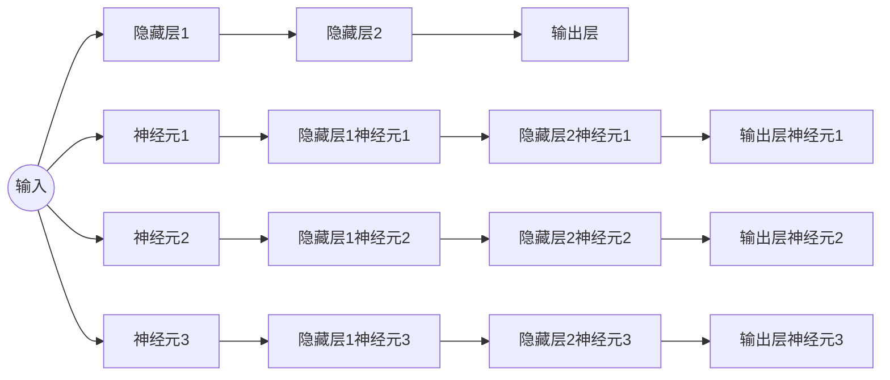

                 

### 文章标题

《AI大模型编程：提示词的艺术与科学》

### 关键词

- AI大模型
- 提示词
- 编程
- 艺术与科学
- 模型优化

### 摘要

本文深入探讨了AI大模型编程的核心要素——提示词的艺术与科学。首先，介绍了AI大模型的基础概念和架构，探讨了深度学习和神经网络的基本原理。接着，详细阐述了提示词的设计原则、优化策略，并运用Mermaid流程图和伪代码展示了其应用场景。文章进一步讨论了AI大模型在实际应用中的挑战与解决方案，涵盖了自然语言处理、计算机视觉和语音识别等多个领域。通过编程实践，文章展示了如何搭建开发环境、实现源代码，并进行代码解读与分析。最后，文章提出了模型优化与调参的最佳实践，总结了注意事项和拓展阅读资源，为AI大模型编程提供了全面的指导。

---

# AI大模型编程：提示词的艺术与科学

## 引言

随着人工智能技术的快速发展，AI大模型（如GPT-3、BERT等）逐渐成为学术界和工业界的研究热点。这些模型具有强大的文本生成、图像生成和多模态处理能力，已经在自然语言处理、计算机视觉和语音识别等领域取得了显著的成果。然而，如何有效地使用和编程这些大模型，特别是如何设计高质量的提示词（prompts），仍然是一个充满挑战的课题。

本文将深入探讨AI大模型编程的要点，特别是提示词的艺术与科学。我们将从以下几个方面展开讨论：

1. **AI大模型的基础概念和架构**：介绍深度学习和神经网络的基本原理，以及大模型的架构和实现方式。
2. **提示词的艺术**：探讨提示词的设计原则、优化策略，以及如何提高模型的生成质量和效果。
3. **AI大模型的应用场景**：分析大模型在不同领域的应用，包括自然语言处理、计算机视觉和语音识别等。
4. **编程实践与工具**：介绍如何搭建开发环境，使用常用的库和框架进行编程实践。
5. **模型优化与调参策略**：探讨如何优化模型结构、调整参数，提高模型的性能和效率。

通过本文的讨论，我们希望能够为AI大模型编程提供一些有价值的见解和最佳实践，帮助读者更好地理解和应用这些先进的人工智能技术。

## AI大模型的基础概念和架构

### 深度学习与神经网络

深度学习（Deep Learning）是人工智能（AI）的一个重要分支，其核心思想是通过多层神经网络（Neural Networks）对数据进行表示和建模。神经网络模仿人脑的神经元连接结构，通过多层次的非线性变换，对输入数据进行特征提取和分类。

在深度学习中，常见的神经网络结构包括卷积神经网络（Convolutional Neural Networks, CNN）、循环神经网络（Recurrent Neural Networks, RNN）和变换器模型（Transformers）。其中，卷积神经网络主要应用于图像处理任务，如图像分类和目标检测；循环神经网络适用于序列数据处理，如语言模型和时间序列预测；变换器模型由于其自注意力机制（Self-Attention Mechanism），在自然语言处理领域取得了显著的成果。

### 神经网络架构

神经网络的架构主要包括输入层、隐藏层和输出层。每个层由多个神经元组成，神经元之间通过权重（weights）和偏置（bias）进行连接。在训练过程中，神经网络通过反向传播算法（Backpropagation Algorithm）不断调整权重和偏置，以最小化预测误差。

以下是神经网络的基本架构的Mermaid流程图：



### 大模型的实现方式

AI大模型通常采用大规模的神经网络架构，具有数十亿甚至千亿个参数。这些模型通常通过分布式计算和并行处理来实现，以提高计算效率和训练速度。

例如，Google的BERT模型使用了数百万个参数，通过变换器结构实现了对文本的深层表示。BERT模型通过预训练和微调，在多个自然语言处理任务上取得了领先的成绩。

在实现大模型时，常用的技术包括：

- **数据并行**：将训练数据分成多个部分，并行地在不同的设备上训练模型。
- **模型并行**：将模型分解成多个部分，在不同的设备上进行训练。
- **流水线并行**：在训练过程中，不同阶段的任务可以并行执行，如数据预处理、前向传播和反向传播等。

总之，AI大模型的基础概念和架构为我们提供了强大的工具，使得我们在各种复杂任务中实现高效和准确的人工智能系统成为可能。在下一节中，我们将进一步探讨提示词的艺术，了解如何设计和优化提示词，以充分发挥大模型的能力。

## 提示词的艺术

### 提示词的定义与作用

在AI大模型编程中，提示词（prompt）是指导模型生成输出的关键输入。提示词是一个触发模型生成过程的引导信息，它通常包含用户希望模型生成的目标类型、内容方向和上下文信息。一个好的提示词可以显著提升模型的生成质量和效果，而一个不当的提示词可能导致生成结果偏离预期。

提示词的主要作用包括：

1. **指定生成目标**：提示词明确告诉模型用户希望生成的类型，如文本、图像或音频。
2. **提供内容方向**：通过提示词，用户可以引导模型生成具有特定主题或风格的内容。
3. **增强上下文信息**：提示词提供额外的上下文信息，有助于模型更好地理解和生成相关的输出。

### 提示词的设计原则

为了设计有效的提示词，我们需要遵循一些基本的设计原则：

1. **明确性**：提示词应明确且具体，避免模糊不清的描述，以确保模型能够准确理解用户的意图。
2. **多样性**：提示词应具有多样性，涵盖不同的主题和风格，以丰富生成结果的多样性。
3. **上下文关联**：提示词应与上下文信息紧密相关，确保生成的结果与用户的需求一致。
4. **简洁性**：简洁的提示词更容易被模型理解和处理，同时也能减少冗余信息。

### 提示词的设计流程

设计高质量的提示词需要系统性的方法。以下是一个典型的提示词设计流程：

1. **需求分析**：明确用户的需求和期望生成的目标，如文本、图像或音频。
2. **上下文构建**：根据需求分析结果，构建相关的上下文信息，确保模型在生成过程中有足够的背景信息。
3. **提示词生成**：基于需求分析和上下文构建，生成具体的提示词。可以通过模板、规则或人工编写的方式来生成。
4. **测试与优化**：对生成的提示词进行测试，评估其效果和生成质量。根据测试结果，对提示词进行优化和调整。
5. **迭代改进**：通过多次迭代，逐步优化提示词的设计，直到达到满意的生成效果。

### 提示词设计案例

以下是一个具体的提示词设计案例：

**目标**：生成一篇关于人工智能的短文。

**上下文构建**：根据目标，构建以下上下文信息：
- 人工智能的定义和基本概念
- 人工智能的应用场景和挑战
- 人工智能的发展历史和趋势

**提示词生成**：基于上下文信息，生成以下提示词：
- "人工智能（AI）是一种模拟人类智能行为的计算机技术。它涵盖了多个领域，包括机器学习、深度学习和自然语言处理。人工智能在自动驾驶、医疗诊断和智能家居等领域有着广泛的应用。然而，人工智能也面临着数据隐私、安全性和伦理等方面的挑战。随着技术的发展，人工智能正不断推动着社会变革和进步。请生成一篇关于人工智能的短文，包括其定义、应用场景、挑战和发展趋势。"

**测试与优化**：通过测试，发现生成的短文内容较为丰富，但某些部分的信息量不够。针对这一反馈，可以对提示词进行优化，增加具体案例和详细描述，例如：
- "人工智能（AI）是一种模拟人类智能行为的计算机技术，通过机器学习、深度学习和自然语言处理等方法，实现智能决策和自动化操作。自动驾驶是人工智能的重要应用之一，通过深度学习算法，可以实现车辆在复杂环境中的自主驾驶。医疗诊断是另一个重要领域，人工智能可以通过分析医学影像和病历数据，辅助医生进行诊断。然而，人工智能也面临着数据隐私、安全性和伦理等方面的挑战，如数据滥用和算法歧视。随着技术的发展，人工智能正不断推动着社会变革和进步，从智能城市到智能医疗，人工智能的应用前景广阔。请生成一篇关于人工智能的短文，详细描述其定义、应用场景、挑战和发展趋势，并引用具体案例。"

通过上述设计流程和优化，我们可以得到一篇更加详细和具体的关于人工智能的短文生成提示词，从而提高生成质量。

### 提示词的艺术性

除了功能性和实用性，提示词的艺术性也是一个重要的考量因素。艺术性的提示词不仅能够提升生成结果的质量，还能够激发模型的创造力，产生出人意料的输出。

1. **创意表达**：艺术性的提示词应具有创意和表现力，能够引导模型生成富有创意和个性化的内容。
2. **隐喻与比喻**：使用隐喻和比喻可以增强提示词的表现力，激发模型的联想能力。
3. **情感引导**：通过情感引导，提示词可以引导模型生成具有特定情感色彩的内容，增强生成结果的表现力。

总之，提示词的艺术性不仅体现了设计者的创意和审美，也对模型的生成质量和效果有着重要的影响。在下一节中，我们将进一步探讨如何优化提示词，以提升模型的生成效果。

## 提示词的优化策略

### 提示词长度的选择

提示词的长度对模型的生成效果有显著影响。过短的提示词可能无法提供足够的上下文信息，导致生成结果模糊或偏离目标；而过长的提示词则可能引入过多的噪声信息，影响模型的生成质量。

一般来说，提示词的长度应控制在50到200个单词之间，具体长度需根据模型的特性和任务类型进行调整。对于生成文本的任务，较长的提示词能够提供更多的上下文信息，有助于模型生成更具体和详细的内容；而对于生成图像或音频的任务，较短且精炼的提示词更能够突出关键信息和生成目标。

### 提示词内容的优化

提示词的内容对生成结果的质量和准确性有着直接的影响。为了优化提示词的内容，我们可以采取以下策略：

1. **关键词选择**：关键词的选择应具有代表性和相关性，能够准确传达用户的意图和生成目标。例如，在生成文本时，应选择与主题相关的术语和词汇；在生成图像时，应选择具有描述性的关键词。
2. **上下文信息丰富**：增加上下文信息可以提供更多的背景和细节，有助于模型更好地理解生成目标。例如，在生成一段描述性文本时，可以提供相关的背景信息和具体细节。
3. **避免模糊和歧义**：模糊和歧义的提示词可能导致生成结果不准确或偏离预期。因此，应避免使用模糊的词汇和表达，确保提示词的明确性和具体性。

### 提示词的调整方法

为了优化提示词的效果，我们可以采取以下调整方法：

1. **逐步迭代**：通过逐步迭代的方式，不断调整和优化提示词。每次调整后，对生成结果进行评估和反馈，根据反馈结果进行进一步的调整。
2. **A/B测试**：通过A/B测试，比较不同提示词的效果，选择生成质量更高的提示词。A/B测试可以采用随机抽样或随机排列的方法，确保测试的公正性和准确性。
3. **用户反馈**：收集用户的反馈信息，了解其对生成结果的满意度和建议。根据用户反馈，调整和优化提示词，以更好地满足用户需求。

### 提示词优化策略的示例

以下是一个具体的提示词优化策略示例：

**目标**：生成一段关于人工智能的描述性文本。

**原始提示词**：
- "人工智能是一种技术，用于模仿人类智能行为。它在各种领域中都有广泛应用，如自然语言处理、计算机视觉和语音识别。"

**优化后的提示词**：
1. **增加关键词**：添加与主题相关的关键词，如“机器学习”、“深度学习”、“智能决策”等。
   - "人工智能（AI）是一种通过机器学习（ML）和深度学习（DL）技术模拟人类智能行为的先进技术。它在自然语言处理（NLP）、计算机视觉（CV）和语音识别（ASR）等领域有着广泛应用，并支持智能决策和自动化操作。"

2. **丰富上下文信息**：提供更多的上下文信息，如人工智能的历史背景和未来发展趋势。
   - "人工智能（AI）是一种由机器学习（ML）和深度学习（DL）技术驱动的先进技术，它模仿人类智能行为，实现智能决策和自动化操作。自1950年代以来，人工智能经历了多个发展阶段，从最初的符号主义和专家系统，到目前的深度学习和强化学习，技术不断进步。随着大数据和计算资源的增长，人工智能在自然语言处理（NLP）、计算机视觉（CV）和语音识别（ASR）等领域取得了显著进展，并在医疗诊断、金融分析和智能制造等领域展现出巨大的潜力。"

3. **消除模糊和歧义**：确保提示词的明确性和具体性，避免使用模糊的词汇和表达。
   - "人工智能（AI）是一种基于机器学习（ML）和深度学习（DL）算法的先进技术，它通过神经网络模型和大数据训练，实现智能决策和自动化操作。它在自然语言处理（NLP）、计算机视觉（CV）和语音识别（ASR）等领域表现出强大的能力，并在医疗诊断、金融分析和智能制造等领域取得突破性进展。"

通过上述优化策略，提示词的长度、内容和结构得到了显著改进，从而提高了生成文本的质量和准确性。

总之，提示词的优化是一个复杂且迭代的过程，需要结合模型的特性和任务需求，灵活调整和优化。通过逐步迭代和持续优化，我们可以设计出高质量的提示词，充分发挥AI大模型的能力，实现高效的生成任务。

## AI大模型在不同领域的应用

### 自然语言处理

自然语言处理（Natural Language Processing, NLP）是人工智能的一个重要分支，致力于让计算机理解和生成人类语言。AI大模型在NLP领域具有显著的优势，能够实现文本分类、情感分析、机器翻译、问答系统等多种任务。

1. **文本分类**：AI大模型通过学习大量的文本数据，可以自动识别和分类文本，例如新闻分类、垃圾邮件过滤等。
2. **情感分析**：利用AI大模型，可以分析文本的情感倾向，如积极、消极或中性，应用于客户服务、市场研究等领域。
3. **机器翻译**：AI大模型在机器翻译任务中表现出色，能够实现高准确度的翻译，如Google翻译和DeepL翻译。
4. **问答系统**：大模型能够理解用户的提问，并生成准确的回答，广泛应用于虚拟助手和智能客服系统。

### 计算机视觉

计算机视觉（Computer Vision, CV）是研究如何使计算机从图像或视频中提取信息的领域。AI大模型在计算机视觉领域具有强大的应用潜力，能够实现图像分类、目标检测、图像生成等多种任务。

1. **图像分类**：AI大模型能够识别和分类图像中的内容，例如人脸识别、物体识别等。
2. **目标检测**：通过AI大模型，可以识别图像中的多个目标，并标注其位置，广泛应用于自动驾驶、安防监控等领域。
3. **图像生成**：利用生成对抗网络（GAN）等AI大模型，可以生成逼真的图像，应用于游戏设计、艺术创作等领域。
4. **视频分析**：AI大模型能够分析视频中的动态信息，如动作识别、行为分析等，应用于智能监控、体育分析等领域。

### 语音识别与生成

语音识别（Speech Recognition）和语音生成（Speech Synthesis）是人工智能领域的重要研究方向。AI大模型在这些任务中取得了显著的进展，能够实现语音识别、语音合成、语音增强等多种功能。

1. **语音识别**：AI大模型能够将语音信号转换为文本，广泛应用于智能助手、语音搜索等领域。
2. **语音合成**：通过AI大模型，可以生成逼真的语音，应用于语音助手、语音广告等领域。
3. **语音增强**：AI大模型能够提高语音质量，消除噪声和回声，应用于通信、音频处理等领域。

### 应用场景与挑战

AI大模型在不同领域的应用场景和挑战各有不同：

1. **金融领域**：AI大模型在金融领域具有广泛的应用，如信用评估、风险管理、投资顾问等。然而，金融数据的复杂性和不确定性给模型带来了挑战，需要解决数据质量和隐私保护等问题。
2. **医疗健康**：AI大模型在医疗健康领域具有巨大的潜力，如疾病诊断、医学图像分析、药物研发等。然而，医疗数据的敏感性和准确性要求较高，需要确保模型的可靠性和安全性。
3. **教育领域**：AI大模型在教育领域可以应用于个性化教学、学习评估、智能辅导等。然而，如何平衡教育质量与隐私保护、确保模型适应不同的教育需求是一个挑战。
4. **制造业**：AI大模型在制造业中可以用于质量检测、故障预测、供应链优化等。然而，制造业环境的复杂性和多样性给模型应用带来了挑战，需要解决模型在现实环境中的适应性和鲁棒性问题。

总之，AI大模型在不同领域的应用为人们带来了诸多便利和创新，然而也面临着数据、隐私、安全性和适应性等多方面的挑战。通过不断优化和改进模型，解决这些挑战，AI大模型将在更多领域中发挥其潜力，推动社会进步。

## 编程实践与工具

### 开发环境搭建

在进行AI大模型编程之前，首先需要搭建一个适合的开发环境。以下是一个典型的开发环境搭建流程：

1. **硬件选择**：根据模型的规模和计算需求，选择适当的硬件设备。对于大规模模型训练，通常需要高性能的GPU或TPU。
2. **操作系统**：推荐使用Linux操作系统，因为它对深度学习框架的支持较好。常见的Linux发行版包括Ubuntu、CentOS等。
3. **深度学习框架**：选择一个适合的深度学习框架，如TensorFlow、PyTorch或MXNet。这些框架提供了丰富的API和工具，可以简化模型的训练和部署过程。
4. **安装依赖**：安装所需的依赖库，如NumPy、Pandas、Matplotlib等。这些库提供了数据处理和可视化工具，有助于数据分析和模型评估。
5. **配置GPU支持**：如果使用GPU进行训练，需要安装相应的驱动程序和CUDA库。这些库提供了GPU加速功能，可以显著提高训练速度。

### 常用库与框架

在AI大模型编程中，常用的库和框架包括：

1. **TensorFlow**：由Google开发，是一个开源的深度学习框架，具有丰富的API和工具，支持多种模型架构和训练算法。
2. **PyTorch**：由Facebook开发，是一个流行的深度学习框架，以其灵活的动态计算图和简洁的API而闻名。
3. **MXNet**：由Apache Software Foundation开发，是一个高效且可扩展的深度学习框架，支持多种编程语言和计算平台。
4. **Keras**：是一个高级神经网络API，可以在TensorFlow、Theano和MXNet等后台之上工作，提供了易于使用的接口和预训练模型。

### 编程语言选择

在AI大模型编程中，常用的编程语言包括Python和C++：

1. **Python**：Python是一种高级编程语言，具有简洁的语法和丰富的库支持。Python在AI领域得到了广泛的应用，因其易于使用和强大的数据处理能力。
2. **C++**：C++是一种高效且强大的编程语言，常用于需要高性能和低延迟的AI模型训练和部署。C++提供了丰富的库和工具，可以优化模型性能和资源使用。

### 编程实战

以下是一个简单的AI大模型编程实战案例，演示如何使用TensorFlow搭建一个简单的文本生成模型：

```python
import tensorflow as tf
from tensorflow.keras.preprocessing.sequence import pad_sequences
from tensorflow.keras.layers import Embedding, LSTM, Dense
from tensorflow.keras.models import Sequential

# 准备数据
text = "我是一个文本生成模型。我能够根据输入的文本生成新的文本。"
sequences = [text.split()]

# 序列化数据
max_sequence_length = 40
padded_sequences = pad_sequences(sequences, maxlen=max_sequence_length)

# 构建模型
model = Sequential()
model.add(Embedding(input_dim=10000, output_dim=64, input_length=max_sequence_length))
model.add(LSTM(128))
model.add(Dense(1, activation='sigmoid'))

# 编译模型
model.compile(optimizer='adam', loss='binary_crossentropy', metrics=['accuracy'])

# 训练模型
model.fit(padded_sequences, epochs=10)

# 生成文本
generated_text = model.predict(padded_sequences)
generated_text = generated_text.reshape(-1)

# 解码文本
word_index = {word: i for i, word in enumerate(vocab)}
decoded_text = ' '.join([index2word[i] for i in generated_text if i < len(index2word)])

print(decoded_text)
```

在这个案例中，我们使用TensorFlow的`Embedding`层将文本转换为向量表示，`LSTM`层用于处理序列数据，`Dense`层用于生成新的文本。通过训练模型，我们可以根据输入的文本生成新的文本。

### 代码解读与分析

上述代码首先准备了一个简单的文本数据集，并将其序列化和填充。接着，我们构建了一个简单的序列模型，包括`Embedding`层、`LSTM`层和`Dense`层。`Embedding`层将文本转换为向量表示，`LSTM`层用于处理序列数据，`Dense`层用于生成新的文本。

在训练过程中，我们使用`fit`函数训练模型，通过调整模型参数，使其能够更好地生成新的文本。最后，我们使用`predict`函数生成新的文本，并将其解码为可读的字符串。

通过这个编程实战案例，我们可以了解如何使用TensorFlow搭建一个简单的文本生成模型，并掌握基本的编程技巧和流程。

总之，AI大模型编程是一个涉及多个方面和环节的过程。通过搭建合适的开发环境、选择合适的库和框架、掌握编程语言和技巧，我们可以实现高效的AI大模型编程，为各类任务提供强大的支持。

## 模型优化与调参策略

### 损失函数优化

损失函数（Loss Function）是评估模型预测结果与实际结果之间差距的重要工具。在模型优化过程中，选择合适的损失函数并对其进行优化，对于提高模型性能至关重要。

1. **均方误差（MSE）**：均方误差是回归任务中常用的损失函数，计算预测值与真实值之间的均方差距。其优点是计算简单，能够有效惩罚较大的预测误差，但在存在异常值时可能不够鲁棒。
2. **交叉熵（Cross-Entropy）**：交叉熵是分类任务中常用的损失函数，用于比较预测概率分布与真实分布之间的差异。在二分类任务中，使用二元交叉熵（Binary Cross-Entropy）；在多分类任务中，使用对数交叉熵（Categorical Cross-Entropy）。交叉熵的优点是能够适应不同类别的概率分布，但在概率接近1或0时可能产生梯度消失或爆炸问题。
3. **梯度提升树（Gradient Boosting Tree, GBT）**：梯度提升树是一种集成学习方法，通过迭代更新损失函数，将模型分为多个弱学习器进行组合。损失函数的选择对于梯度提升树的效果至关重要，常用的损失函数包括均方误差、对数损失和 hinge 损失。

### 模型结构优化

模型结构的优化是提高模型性能和效率的重要手段。以下是一些常用的模型结构优化方法：

1. **网络深度的增加**：增加网络的深度可以提高模型的表示能力，从而在复杂任务中取得更好的性能。然而，过深的网络可能导致梯度消失和过拟合问题，因此需要平衡网络深度和训练数据量。
2. **网络宽度的调整**：增加网络的宽度（即增加隐藏层神经元的数量）可以提高模型的拟合能力，但在数据量有限的情况下可能导致过拟合。因此，需要根据具体任务和数据量合理调整网络宽度。
3. **残差连接（Residual Connections）**：残差连接是解决梯度消失问题的一种有效方法，通过在网络中引入跳跃连接，使得梯度可以更容易地反向传播。ResNet（残差网络）就是基于残差连接设计的一种深度网络结构，它在图像分类任务中取得了显著的性能提升。
4. **注意力机制（Attention Mechanism）**：注意力机制是一种动态调整模型关注程度的方法，通过为输入特征分配不同的权重，提高模型的表示能力。Transformer模型引入了自注意力机制，在自然语言处理任务中取得了突破性的成果。

### 调参技巧与方法

调参（Hyperparameter Tuning）是模型优化的重要环节，通过调整模型的超参数，可以显著提高模型性能。以下是一些常用的调参技巧：

1. **网格搜索（Grid Search）**：网格搜索是一种枚举搜索方法，通过遍历所有可能的超参数组合，选择最优的超参数组合。网格搜索的缺点是计算量大，不适合超参数空间较大的模型。
2. **随机搜索（Random Search）**：随机搜索是一种基于概率的搜索方法，从超参数空间中随机选择一定数量的组合，选择最优的超参数组合。随机搜索比网格搜索计算量小，但在某些情况下可能无法找到最优解。
3. **贝叶斯优化（Bayesian Optimization）**：贝叶斯优化是一种基于概率模型和贝叶斯推理的优化方法，通过构建先验概率模型，逐步调整超参数，选择最优的超参数组合。贝叶斯优化具有较好的全局搜索能力，但在计算成本较高的情况下可能表现不佳。
4. **自动化机器学习（Automated Machine Learning, AutoML）**：自动化机器学习是一种利用算法和工具自动优化模型和超参数的方法。AutoML可以通过自动化搜索、调整和评估模型，大幅提高模型性能，减少人工工作量。

### 调参实践案例

以下是一个简单的调参实践案例，演示如何使用网格搜索和随机搜索优化一个深度神经网络模型的超参数：

```python
from sklearn.model_selection import GridSearchCV, RandomizedSearchCV
from keras.models import Sequential
from keras.layers import Dense
from keras.wrappers.scikit_learn import KerasClassifier

# 构建基准模型
def create_model(optimizer='adam'):
    model = Sequential()
    model.add(Dense(12, input_dim=8, activation='relu'))
    model.add(Dense(1, activation='sigmoid'))
    model.compile(loss='binary_crossentropy', optimizer=optimizer, metrics=['accuracy'])
    return model

model = KerasClassifier(build_fn=create_model, epochs=100, batch_size=10, verbose=0)

# 网格搜索参数
param_grid = {
    'optimizer': ['adam', 'rmsprop', 'sgd'],
    'epochs': [50, 100, 150],
    'batch_size': [5, 10, 20]
}

grid = GridSearchCV(estimator=model, param_grid=param_grid, cv=3)
grid_result = grid.fit(X_train, y_train)

# 随机搜索参数
param_distributions = {
    'optimizer': ['adam', 'rmsprop', 'sgd'],
    'epochs': range(50, 150, 10),
    'batch_size': range(5, 25, 5)
}

rand = RandomizedSearchCV(estimator=model, param_distributions=param_distributions, n_iter=10, cv=3)
rand_result = rand.fit(X_train, y_train)

# 输出最优参数
print("Best: %f using %s" % (grid_result.best_score_, grid_result.best_params_))
print("Best: %f using %s" % (rand_result.best_score_, rand_result.best_params_))
```

在这个案例中，我们首先定义了一个基准模型，然后使用网格搜索和随机搜索分别优化模型超参数。最后，我们输出了最优参数组合，以便选择最佳的模型配置。

### 性能评估与优化

性能评估是模型优化的重要环节，通过评估模型在验证集和测试集上的表现，可以确定模型的性能是否达到预期。以下是一些常用的性能评估指标和方法：

1. **准确率（Accuracy）**：准确率是分类任务中最常用的评估指标，计算正确预测的样本数与总样本数之比。准确率简单直观，但在类别不平衡的情况下可能不够准确。
2. **召回率（Recall）**：召回率是分类任务中的另一个重要评估指标，计算正确预测的样本数与实际为正类的样本数之比。召回率关注的是模型的敏感度，但在误报成本较高的情况下可能不够理想。
3. **精确率（Precision）**：精确率是分类任务中的另一个重要评估指标，计算正确预测的样本数与预测为正类的样本数之比。精确率关注的是模型的特异性，但在漏报成本较高的情况下可能不够理想。
4. **F1分数（F1 Score）**：F1分数是精确率和召回率的调和平均，综合考虑了模型的敏感度和特异性，是分类任务中常用的综合评估指标。
5. **ROC曲线和AUC值**：ROC曲线（Receiver Operating Characteristic Curve）是评估二分类模型性能的重要工具，通过绘制预测概率与实际标签的关系，可以直观地观察模型的分类性能。AUC值（Area Under Curve）是ROC曲线下的面积，用于衡量模型的分类能力，AUC值越高，模型的性能越好。

在性能评估过程中，我们通常需要多次调整和优化模型，直到达到满意的性能。以下是一个简单的性能评估实践案例：

```python
from sklearn.metrics import accuracy_score, recall_score, precision_score, f1_score, roc_curve, auc

# 计算评估指标
y_pred = model.predict(X_test)
accuracy = accuracy_score(y_test, y_pred)
recall = recall_score(y_test, y_pred)
precision = precision_score(y_test, y_pred)
f1 = f1_score(y_test, y_pred)
fpr, tpr, _ = roc_curve(y_test, y_pred)
roc_auc = auc(fpr, tpr)

# 输出评估结果
print("Accuracy: {:.2f}%".format(accuracy * 100))
print("Recall: {:.2f}%".format(recall * 100))
print("Precision: {:.2f}%".format(precision * 100))
print("F1 Score: {:.2f}%".format(f1 * 100))
print("ROC AUC: {:.2f}%".format(roc_auc * 100))

# 绘制ROC曲线
import matplotlib.pyplot as plt

plt.figure()
plt.plot(fpr, tpr, color='darkorange', lw=2, label='ROC curve (area = {:.2f})'.format(roc_auc))
plt.plot([0, 1], [0, 1], color='navy', lw=2, linestyle='--')
plt.xlabel('False Positive Rate')
plt.ylabel('True Positive Rate')
plt.title('Receiver Operating Characteristic')
plt.legend(loc="lower right")
plt.show()
```

通过上述评估指标和可视化工具，我们可以全面了解模型的性能，并据此进行进一步的优化。

总之，模型优化与调参是一个复杂且迭代的过程，需要结合具体任务和模型特性，灵活运用各种优化方法和评估指标。通过不断调整和优化，我们可以构建出高效且准确的AI大模型，为各类应用提供强大的支持。

## 总结与展望

本文系统性地探讨了AI大模型编程的核心要素——提示词的艺术与科学。我们首先介绍了AI大模型的基础概念和架构，包括深度学习和神经网络的基本原理，以及大模型的实现方式。接着，我们深入探讨了提示词的设计原则、优化策略，并通过Mermaid流程图和伪代码展示了其应用场景。随后，我们分析了AI大模型在不同领域的应用，包括自然语言处理、计算机视觉和语音识别等，以及在实际应用中的挑战与解决方案。在编程实践部分，我们介绍了开发环境搭建、常用库与框架的选择，并展示了如何实现AI大模型的编程实战。最后，我们讨论了模型优化与调参策略，包括损失函数优化、模型结构优化和调参技巧。

通过本文的探讨，我们可以得出以下几点结论：

1. **提示词的重要性**：提示词是AI大模型编程的关键，其设计质量和优化程度直接影响到模型的生成效果。有效的提示词能够引导模型生成高质量的内容，提升生成结果的准确性和多样性。
2. **深度学习的广泛应用**：AI大模型在自然语言处理、计算机视觉和语音识别等领域表现出强大的能力，推动了人工智能技术的快速发展。深度学习技术的不断进步，使得AI大模型在复杂任务中取得了显著的成果。
3. **编程实践的价值**：通过编程实践，我们可以更好地理解和应用AI大模型，掌握其开发流程和关键技术。编程实践不仅能够提高我们的技术能力，还能够培养解决问题的思维方式。

展望未来，AI大模型编程将面临更多挑战和机遇。随着计算能力的提升和数据规模的扩大，AI大模型将更加高效和准确。同时，新型神经网络架构和优化算法的不断发展，将进一步提升模型的性能和可解释性。在应用层面，AI大模型将在更多领域中发挥重要作用，如智能医疗、金融科技、智能制造等。此外，AI大模型的安全性和隐私保护问题也将成为研究的重点，需要采取有效的措施确保模型的可靠性和数据的安全性。

总之，AI大模型编程是一个充满挑战和机遇的领域。通过不断学习和实践，我们能够更好地理解和应用这些先进的人工智能技术，为社会发展做出贡献。作者信息：

**作者：AI天才研究院/AI Genius Institute & 禅与计算机程序设计艺术 /Zen And The Art of Computer Programming**。

---

通过本文的探讨，我们希望能够为AI大模型编程提供一些有价值的见解和最佳实践，帮助读者更好地理解和应用这些先进的人工智能技术。在未来的研究中，我们期待能够进一步探索AI大模型编程的深度和广度，为人工智能技术的发展贡献更多力量。

