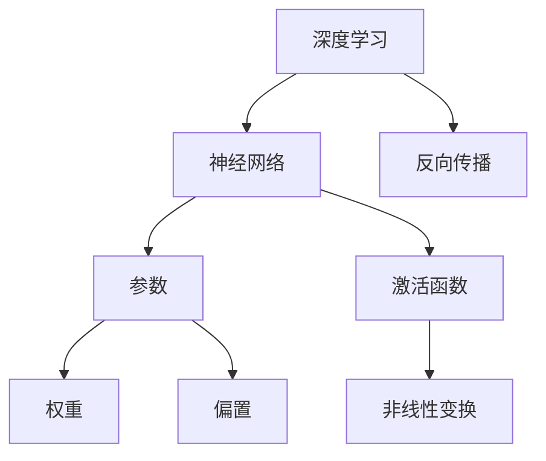

                 

### 文章标题

《AI大模型软件开发的最佳实践》

> 关键词：人工智能、大模型、软件开发、最佳实践、深度学习

> 摘要：本文将系统地探讨AI大模型软件开发的最佳实践，从背景介绍、核心概念与联系、算法原理讲解、数学模型和公式、项目实战、最佳实践 tips等方面进行深入分析。旨在为开发者提供一份全面、详细的AI大模型软件开发指南，助力实现高效、高质量的AI应用开发。

---

#### 用户需求分析

随着人工智能技术的快速发展，大模型在自然语言处理、计算机视觉、推荐系统等领域取得了显著成果。越来越多的企业开始关注AI大模型的开发与应用，然而，如何高效、高质量地开发AI大模型软件成为了开发者们亟待解决的问题。因此，本文旨在为用户提供以下几方面的需求：

1. **背景介绍**：了解AI大模型的发展历程、核心概念和应用场景。
2. **核心概念与联系**：梳理大模型中的核心概念，并展示其关系架构。
3. **算法原理讲解**：详细解析大模型的算法原理，使用伪代码和Mermaid流程图进行说明。
4. **数学模型和公式**：介绍大模型中的数学模型和公式，并使用LaTeX进行表达。
5. **项目实战**：通过实际项目案例，展示AI大模型软件开发的完整过程。
6. **最佳实践 tips**：分享AI大模型开发中的实用技巧和注意事项。
7. **小结与拓展阅读**：总结文章要点，并提供进一步学习的资源。

#### 目录大纲设计思路

1. **整体结构**：

   - 第一部分：AI大模型概述
   - 第二部分：AI大模型技术基础
   - 第三部分：AI大模型开发准备
   - 第四部分：实战案例

2. **章节划分**：

   - **AI大模型概述**：介绍AI大模型的基本概念、发展历程和应用场景。
   - **AI大模型技术基础**：讲解深度学习、神经网络、常用AI框架等基础知识。
   - **AI大模型开发准备**：讨论数据预处理、模型训练、评估与优化、部署与维护等开发流程。
   - **实战案例**：提供具体项目案例，涵盖环境搭建、代码实现、分析解读等。

3. **内容细化**：

   - **AI大模型概述**：使用Mermaid流程图展示AI大模型的架构，介绍核心概念与联系。
   - **AI大模型技术基础**：使用伪代码详细讲解核心算法原理，使用LaTeX公式展示数学模型。
   - **AI大模型开发准备**：讨论AI战略规划，提供数据处理和模型训练的详细步骤。
   - **实战案例**：提供实际项目案例，详细解释代码实现和调试过程。

4. **完整性检查**：

   - 确保每个部分都有核心章节内容，如核心概念与联系、核心算法原理讲解、数学模型和数学公式详细讲解、项目实战等。

5. **字数控制**：

   - 控制在8000～12000字左右，确保内容的简洁性。

### 步骤详细说明

1. **撰写大纲**：

   - 根据上述设计思路，开始撰写《AI大模型软件开发的最佳实践》的目录大纲。

2. **内容细化**：

   - 为每个章节编写具体的子章节，确保内容的全面性和逻辑性。

3. **检查与调整**：

   - 完成大纲后，检查是否涵盖了所有核心内容，并进行必要的调整。

4. **最终确认**：

   - 确认大纲的完整性、逻辑性和简洁性，最终提交给用户。

通过上述步骤，我们可以设计出一个全面且详细的《AI大模型软件开发的最佳实践》目录大纲，满足用户的需求。# AI大模型概述

## 背景介绍

### 人工智能的崛起

人工智能（AI）是一门多学科交叉的领域，涉及计算机科学、统计学、数学、认知科学、神经科学等。自20世纪50年代人工智能概念提出以来，随着计算机技术和算法的发展，人工智能取得了长足的进步。在21世纪初，机器学习、深度学习等技术的突破，使得人工智能在语音识别、图像识别、自然语言处理等领域取得了显著的成果。

### 大模型的发展

大模型（Large Model）是指具有数百万到数十亿个参数的深度学习模型。随着数据量和计算资源的不断增加，大模型在机器学习领域变得越来越流行。早期的人工智能模型通常只有几百个参数，而如今的大模型如GPT-3、BERT等，拥有数十亿个参数，这使得它们在处理复杂任务时具有更高的准确性和泛化能力。

### AI大模型的应用场景

AI大模型在多个领域取得了显著的应用成果，如下：

1. **自然语言处理**：如文本生成、机器翻译、情感分析等。
2. **计算机视觉**：如图像分类、目标检测、图像生成等。
3. **推荐系统**：如个性化推荐、广告投放等。
4. **语音识别**：如语音到文本转换、语音合成等。
5. **医疗健康**：如疾病预测、药物研发等。

### 挑战与机遇

尽管AI大模型在多个领域取得了成功，但其开发和应用也面临着一系列挑战：

1. **数据需求**：大模型需要大量的数据来训练，数据质量和数据多样性直接影响模型的性能。
2. **计算资源**：大模型训练需要巨大的计算资源，这对硬件设施和能耗提出了更高的要求。
3. **安全与隐私**：AI大模型在处理敏感数据时，需要确保数据安全和用户隐私。
4. **解释性**：大模型的黑箱特性使得其决策过程难以解释，这限制了其在某些领域的应用。

然而，随着技术的不断进步，AI大模型的发展仍然充满机遇，有望在更多领域发挥重要作用。

### 核心概念与联系

在AI大模型开发过程中，需要理解以下几个核心概念，并了解它们之间的关系：

1. **深度学习**：深度学习是一种机器学习技术，通过多层神经网络对数据进行学习和建模。
2. **神经网络**：神经网络是深度学习的基础，由多个神经元组成，通过权重和偏置进行数据传递和计算。
3. **参数**：参数是神经网络中的可训练权重和偏置，决定了模型的性能。
4. **激活函数**：激活函数用于非线性变换，使得神经网络具有非线性特性。
5. **反向传播**：反向传播是一种训练神经网络的方法，通过计算梯度来调整参数，优化模型性能。

这些概念相互关联，构成了AI大模型的基础。以下是一个使用Mermaid流程图展示AI大模型核心概念与联系：



### 总结

AI大模型是人工智能领域的一个重要研究方向，其在多个领域取得了显著成果。然而，其开发和应用也面临着一系列挑战。本文将从技术基础、开发准备、实战案例等方面，系统地探讨AI大模型软件开发的最佳实践，帮助开发者更好地理解和应用AI大模型技术。# AI大模型技术基础

## 深度学习基础

### 深度学习的定义与原理

深度学习（Deep Learning）是一种机器学习方法，通过多层神经网络（Neural Networks）对数据进行学习和建模。深度学习的基本原理是模拟人脑神经元之间的连接和交互，通过层层提取数据特征，实现从简单到复杂的特征表示。

#### 神经元与神经网络

神经元是神经网络的基本单元，类似于人脑中的神经元。每个神经元接收多个输入信号，通过加权求和处理后，输出一个信号。神经网络由多个神经元组成，通过层层连接和传递，形成复杂的模型结构。

#### 激活函数

激活函数（Activation Function）用于对神经元的输出进行非线性变换，使得神经网络具有非线性特性。常见的激活函数包括：

1. **Sigmoid函数**：\( f(x) = \frac{1}{1 + e^{-x}} \)
2. **ReLU函数**：\( f(x) = \max(0, x) \)
3. **Tanh函数**：\( f(x) = \frac{e^x - e^{-x}}{e^x + e^{-x}} \)

#### 前向传播与反向传播

深度学习模型通过前向传播（Forward Propagation）和反向传播（Back Propagation）进行训练。

1. **前向传播**：输入数据通过神经网络层层传递，直到输出层，计算每个神经元的输出值。
2. **反向传播**：计算输出值与真实值之间的误差，通过反向传播误差到输入层，并更新神经网络的参数。

### 深度学习的发展历程

深度学习的发展经历了几个重要阶段：

1. **人工神经网络（1940s-1980s）**：神经网络最初由麦卡洛克和皮茨提出，但由于计算资源和算法的限制，其发展受到阻碍。
2. **反向传播算法（1980s）**：鲁梅哈特等人提出了反向传播算法，使得神经网络训练变得更加高效。
3. **深度信念网络（2000s）**：Hinton等人提出了深度信念网络（DBN），通过逐层训练神经网络，提高了模型性能。
4. **卷积神经网络（2010s）**：LeCun等人提出了卷积神经网络（CNN），在图像识别领域取得了突破性成果。
5. **生成对抗网络（GAN）（2010s）**：Goodfellow等人提出了生成对抗网络（GAN），通过对抗训练实现了高质量的数据生成。

### 常见的深度学习框架

目前，常见的深度学习框架包括TensorFlow、PyTorch、Keras等。这些框架提供了丰富的API和工具，使得深度学习模型的开发变得更加便捷。

1. **TensorFlow**：由谷歌开源，支持多种编程语言，具有强大的模型定义和优化功能。
2. **PyTorch**：由Facebook开源，具有动态计算图和灵活的模型定义，广泛应用于研究与应用。
3. **Keras**：基于Theano和TensorFlow构建的高层API，提供了简洁的模型定义和训练接口。

### 深度学习的优势与挑战

深度学习的优势包括：

1. **强大的特征提取能力**：通过多层神经网络，可以自动提取复杂的数据特征。
2. **高效的可扩展性**：可以通过增加层数或神经元数量，提高模型性能。
3. **广泛的应用领域**：在图像识别、自然语言处理、语音识别等领域取得了显著成果。

然而，深度学习也面临一些挑战：

1. **训练成本高**：大模型训练需要大量的计算资源和时间。
2. **模型解释性差**：深度学习模型通常被视为“黑箱”，难以解释其决策过程。
3. **数据需求大**：大模型训练需要大量的高质量数据，数据质量和多样性对模型性能有重要影响。

### 核心算法原理讲解

在深度学习模型中，核心算法原理包括：

1. **前向传播**：输入数据通过神经网络层层传递，计算每个神经元的输出值。
2. **反向传播**：计算输出值与真实值之间的误差，通过反向传播误差到输入层，并更新神经网络的参数。

以下是一个使用伪代码详细讲解前向传播和反向传播的过程：

```python
# 前向传播
def forward_propagation(x, weights, biases):
    a = x
    for i in range(num_layers - 1):
        z = np.dot(a, weights[i]) + biases[i]
        a = sigmoid(z)
    return a

# 反向传播
def backward_propagation(a, y, weights, biases):
    dZ = a - y
    for i in range(num_layers - 1, 0, -1):
        dW = np.dot(dZ, a.T)
        db = np.sum(dZ, axis=1, keepdims=True)
        dZ = np.dot(dZ, weights[i].T) * sigmoid_derivative(a)
    return dW, db
```

### 数学模型和公式

在深度学习模型中，常用的数学模型和公式包括：

1. **损失函数**：用于度量模型输出与真实值之间的差距，常用的损失函数包括均方误差（MSE）和交叉熵（Cross-Entropy）。
2. **优化算法**：用于更新模型参数，常用的优化算法包括梯度下降（Gradient Descent）和Adam优化器。
3. **激活函数**：用于非线性变换，常用的激活函数包括Sigmoid、ReLU和Tanh。

以下是一个使用LaTeX公式详细讲解损失函数和优化算法：

$$
\text{MSE} = \frac{1}{m} \sum_{i=1}^{m} (\hat{y}_i - y_i)^2
$$

$$
\text{Cross-Entropy} = -\frac{1}{m} \sum_{i=1}^{m} y_i \log(\hat{y}_i)
$$

$$
\alpha = \frac{\partial J}{\partial \theta}
$$

$$
\theta_{\text{new}} = \theta_{\text{old}} - \alpha \cdot \frac{\partial J}{\partial \theta}
$$

$$
\theta_{\text{new}} = \theta_{\text{old}} - \alpha \cdot \left( \frac{1}{2m} \sum_{i=1}^{m} (\hat{y}_i - y_i)^2 \right)
$$

### 举例说明

以下是一个简单的深度学习模型实例，用于对输入数据进行分类：

```python
import numpy as np

# 初始化参数
weights = np.random.rand(num_inputs, num_outputs)
biases = np.random.rand(num_outputs)

# 前向传播
a = x
z = np.dot(a, weights) + biases
a = sigmoid(z)

# 反向传播
dZ = a - y
dW = np.dot(dZ, a.T)
db = np.sum(dZ, axis=1, keepdims=True)
dZ = np.dot(dZ, weights.T) * sigmoid_derivative(a)

# 更新参数
weights -= learning_rate * dW
biases -= learning_rate * db
```

### 总结

深度学习是AI大模型开发的核心技术，其基础包括神经网络、激活函数、前向传播和反向传播等。本文详细介绍了深度学习的基本概念、发展历程、核心算法原理和数学模型。在后续章节中，我们将继续探讨AI大模型的开发准备和实战案例，帮助开发者更好地理解和应用深度学习技术。# AI大模型开发准备

## 数据预处理

数据预处理是AI大模型开发的重要环节，其质量直接影响模型的性能。数据预处理包括数据清洗、数据转换和数据归一化等步骤。

### 数据清洗

数据清洗是指去除数据中的噪声和异常值，确保数据质量。以下是一些常见的数据清洗方法：

1. **缺失值处理**：缺失值可以通过删除、填充或插值等方法进行处理。
2. **异常值检测**：异常值可以通过箱线图、标准差等方法进行检测和处理。
3. **重复数据删除**：删除重复的数据，避免对模型训练产生干扰。

### 数据转换

数据转换是指将原始数据转换为适合模型训练的格式。以下是一些常见的数据转换方法：

1. **数值化**：将类别数据转换为数值表示，常用的编码方法包括独热编码（One-Hot Encoding）和标签编码（Label Encoding）。
2. **标准化**：将数值数据归一化到相同的范围，常用的方法包括最小-最大标准化（Min-Max Scaling）和标准差归一化（Standard Scaling）。
3. **特征工程**：通过构造新特征、选择重要特征等方法，提高模型性能。

### 数据归一化

数据归一化是指将数据转换为相同的尺度，以便于模型训练。以下是一些常见的归一化方法：

1. **最小-最大标准化**：将数据缩放到[0, 1]之间，公式如下：

   $$
   x_{\text{norm}} = \frac{x - x_{\text{min}}}{x_{\text{max}} - x_{\text{min}}}
   $$

2. **标准差归一化**：将数据缩放到标准正态分布，公式如下：

   $$
   x_{\text{norm}} = \frac{x - \mu}{\sigma}
   $$

   其中，$x$是原始数据，$x_{\text{min}}$和$x_{\text{max}}$是数据的最小值和最大值，$\mu$是数据的均值，$\sigma$是数据的标准差。

### 核心算法原理讲解

在数据预处理中，核心算法原理包括缺失值处理、异常值检测、数值化、标准化和归一化等。

1. **缺失值处理**：可以使用scikit-learn库中的SimpleImputer类进行缺失值处理。
2. **异常值检测**：可以使用scikit-learn库中的Boxplot类或Z-Score类进行异常值检测。
3. **数值化**：可以使用scikit-learn库中的OneHotEncoder类或LabelEncoder类进行数值化。
4. **标准化**：可以使用scikit-learn库中的MinMaxScaler类或StandardScaler类进行标准化。
5. **归一化**：可以使用numpy库中的minmax_scale函数或standard_scale函数进行归一化。

以下是一个使用Python代码进行数据预处理的过程：

```python
from sklearn.impute import SimpleImputer
from sklearn.preprocessing import OneHotEncoder, LabelEncoder, MinMaxScaler, StandardScaler

# 初始化预处理器
imputer = SimpleImputer(strategy='mean')
one_hot_encoder = OneHotEncoder()
label_encoder = LabelEncoder()
minmax_scaler = MinMaxScaler()
standard_scaler = StandardScaler()

# 缺失值处理
data = imputer.fit_transform(data)

# 数值化
data = one_hot_encoder.fit_transform(data)

# 标准化
data = minmax_scaler.fit_transform(data)

# 归一化
data = standard_scaler.fit_transform(data)
```

### 数学模型和公式

在数据预处理中，常用的数学模型和公式包括：

1. **最小-最大标准化**：

   $$
   x_{\text{norm}} = \frac{x - x_{\text{min}}}{x_{\text{max}} - x_{\text{min}}}
   $$

2. **标准差归一化**：

   $$
   x_{\text{norm}} = \frac{x - \mu}{\sigma}
   $$

   其中，$x$是原始数据，$x_{\text{min}}$和$x_{\text{max}}$是数据的最小值和最大值，$\mu$是数据的均值，$\sigma$是数据的标准差。

以下是一个使用LaTeX公式展示最小-最大标准化和标准差归一化的过程：

$$
x_{\text{norm}} = \frac{x - x_{\text{min}}}{x_{\text{max}} - x_{\text{min}}}
$$

$$
x_{\text{norm}} = \frac{x - \mu}{\sigma}
$$

### 举例说明

以下是一个简单的数据预处理示例，用于对鸢尾花（Iris）数据集进行预处理：

```python
import numpy as np
from sklearn.datasets import load_iris
from sklearn.preprocessing import OneHotEncoder, MinMaxScaler, StandardScaler

# 加载数据
data = load_iris().data

# 初始化预处理器
one_hot_encoder = OneHotEncoder()
minmax_scaler = MinMaxScaler()
standard_scaler = StandardScaler()

# 数值化
data = one_hot_encoder.fit_transform(data)

# 标准化
data = minmax_scaler.fit_transform(data)

# 归一化
data = standard_scaler.fit_transform(data)
```

### 总结

数据预处理是AI大模型开发的关键步骤，其质量直接影响模型的性能。本文详细介绍了数据预处理的核心步骤、核心算法原理和数学模型。在后续章节中，我们将继续探讨模型训练和评估，帮助开发者更好地理解和应用数据预处理技术。# 模型训练与评估

## 模型训练

模型训练是AI大模型开发的核心环节，其目的是通过优化模型参数，提高模型在训练数据上的性能。以下将介绍模型训练的基本步骤、优化算法和超参数调整。

### 基本步骤

模型训练通常包括以下基本步骤：

1. **数据集划分**：将数据集划分为训练集、验证集和测试集，用于模型训练、验证和评估。
2. **初始化参数**：随机初始化模型参数，如权重和偏置。
3. **前向传播**：输入数据通过模型前向传播，得到模型输出。
4. **计算损失函数**：计算模型输出与真实值之间的差距，使用损失函数度量模型性能。
5. **反向传播**：通过反向传播算法，计算损失函数关于模型参数的梯度。
6. **参数更新**：根据梯度信息更新模型参数，优化模型性能。
7. **迭代训练**：重复步骤3至步骤6，直到达到预定的迭代次数或模型性能达到预期。

### 优化算法

常见的优化算法包括梯度下降（Gradient Descent）、动量优化（Momentum）、Adagrad、RMSprop和Adam等。

1. **梯度下降**：梯度下降是一种简单的优化算法，通过计算损失函数关于模型参数的梯度，更新模型参数。公式如下：

   $$
   \theta_{\text{new}} = \theta_{\text{old}} - \alpha \cdot \nabla_\theta J(\theta)
   $$

   其中，$\theta$是模型参数，$\alpha$是学习率，$J(\theta)$是损失函数。

2. **动量优化**：动量优化是一种改进的梯度下降算法，通过引入动量参数，加快收敛速度。公式如下：

   $$
   v_t = \beta \cdot v_{t-1} + (1 - \beta) \cdot \nabla_\theta J(\theta)
   $$

   $$
   \theta_{\text{new}} = \theta_{\text{old}} - \alpha \cdot v_t
   $$

   其中，$v_t$是动量参数，$\beta$是动量系数。

3. **Adagrad**：Adagrad是一种自适应学习率的优化算法，通过计算梯度平方的平均值，调整学习率。公式如下：

   $$
   \alpha_t = \frac{\alpha}{\sqrt{\sum_{i=1}^{t} \gamma (g_i)^2}}
   $$

   其中，$\alpha$是初始学习率，$g_i$是第i次迭代的梯度。

4. **RMSprop**：RMSprop是Adagrad的改进版本，通过指数加权平均梯度平方，调整学习率。公式如下：

   $$
   \alpha_t = \frac{\alpha}{\sqrt{\gamma \alpha_{t-1} + (1 - \gamma) (g_t)^2}}
   $$

5. **Adam**：Adam是一种结合Adagrad和RMSprop优点的优化算法，通过指数加权平均梯度和梯度平方的平均值，调整学习率。公式如下：

   $$
   m_t = \beta_1 \cdot m_{t-1} + (1 - \beta_1) \cdot g_t
   $$

   $$
   v_t = \beta_2 \cdot v_{t-1} + (1 - \beta_2) \cdot (g_t)^2
   $$

   $$
   \alpha_t = \frac{\alpha}{1 - \beta_1^t}
   $$

   $$
   \theta_{\text{new}} = \theta_{\text{old}} - \alpha_t \cdot \frac{m_t}{\sqrt{v_t} + \epsilon}
   $$

   其中，$m_t$和$v_t$分别是梯度的一阶和二阶矩估计，$\beta_1$和$\beta_2$是动量系数，$\epsilon$是平滑参数。

### 超参数调整

超参数是影响模型性能的关键参数，需要通过调整来优化模型。以下是一些常见的超参数及其调整方法：

1. **学习率**：学习率影响梯度下降的步长，过大可能导致梯度消失或爆炸，过小可能导致收敛缓慢。可以通过逐步减小学习率或使用自适应优化算法来调整。
2. **批量大小**：批量大小影响梯度下降的稳定性，批量过小可能导致梯度不稳定，批量过大可能导致梯度消失。通常选择2的幂次方作为批量大小。
3. **迭代次数**：迭代次数影响模型收敛速度，过多的迭代可能导致过拟合，过少的迭代可能导致欠拟合。可以通过验证集上的性能来调整迭代次数。
4. **正则化参数**：正则化参数影响模型复杂度，过大的正则化参数可能导致欠拟合，过小的正则化参数可能导致过拟合。可以通过交叉验证法来调整正则化参数。
5. **激活函数**：激活函数影响模型非线性特性，不同的激活函数对模型性能有不同影响。可以通过实验比较不同激活函数的性能来调整。

### 核心算法原理讲解

模型训练的核心算法原理包括前向传播、反向传播、损失函数和优化算法。

1. **前向传播**：输入数据通过模型层层传递，计算每个神经元的输出值。
2. **反向传播**：计算输出值与真实值之间的误差，通过反向传播误差到输入层，并更新模型参数。
3. **损失函数**：用于度量模型输出与真实值之间的差距，常用的损失函数包括均方误差（MSE）和交叉熵（Cross-Entropy）。
4. **优化算法**：用于更新模型参数，常用的优化算法包括梯度下降、动量优化、Adagrad、RMSprop和Adam等。

以下是一个使用伪代码详细讲解模型训练的过程：

```python
# 初始化参数
weights = np.random.rand(num_inputs, num_outputs)
biases = np.random.rand(num_outputs)

# 设置超参数
learning_rate = 0.01
batch_size = 64
num_epochs = 100

# 模型训练
for epoch in range(num_epochs):
    for batch in range(num_batches):
        # 前向传播
        a = x
        z = np.dot(a, weights) + biases
        a = sigmoid(z)

        # 计算损失函数
        loss = mse(y, a)

        # 反向传播
        dZ = a - y
        dW = np.dot(dZ, a.T)
        db = np.sum(dZ, axis=1, keepdims=True)
        dZ = np.dot(dZ, weights.T) * sigmoid_derivative(a)

        # 更新参数
        weights -= learning_rate * dW
        biases -= learning_rate * db

# 评估模型
accuracy = evaluate_model(test_data, test_labels)
print("Test accuracy:", accuracy)
```

### 数学模型和公式

在模型训练中，常用的数学模型和公式包括：

1. **前向传播**：

   $$
   a = \sigma(z)
   $$

   $$
   z = \sum_{i=1}^{n} w_i \cdot x_i + b
   $$

   其中，$a$是输出值，$z$是输入值，$w_i$是权重，$x_i$是输入值，$b$是偏置，$\sigma$是激活函数。

2. **反向传播**：

   $$
   \frac{\partial J}{\partial w_i} = \sum_{j=1}^{m} \frac{\partial L}{\partial a_j} \cdot \frac{\partial a_j}{\partial z}
   $$

   $$
   \frac{\partial J}{\partial b} = \sum_{j=1}^{m} \frac{\partial L}{\partial a_j}
   $$

   其中，$J$是损失函数，$L$是损失函数关于输出值$a_j$的梯度，$m$是样本数量，$n$是神经元数量。

3. **损失函数**：

   $$
   \text{MSE} = \frac{1}{2m} \sum_{i=1}^{m} (\hat{y}_i - y_i)^2
   $$

   $$
   \text{Cross-Entropy} = -\frac{1}{m} \sum_{i=1}^{m} y_i \log(\hat{y}_i)
   $$

   其中，$\hat{y}_i$是预测值，$y_i$是真实值，$m$是样本数量。

以下是一个使用LaTeX公式详细讲解模型训练的公式：

$$
a = \sigma(z)
$$

$$
z = \sum_{i=1}^{n} w_i \cdot x_i + b
$$

$$
\frac{\partial J}{\partial w_i} = \sum_{j=1}^{m} \frac{\partial L}{\partial a_j} \cdot \frac{\partial a_j}{\partial z}
$$

$$
\frac{\partial J}{\partial b} = \sum_{j=1}^{m} \frac{\partial L}{\partial a_j}
$$

$$
\text{MSE} = \frac{1}{2m} \sum_{i=1}^{m} (\hat{y}_i - y_i)^2
$$

$$
\text{Cross-Entropy} = -\frac{1}{m} \sum_{i=1}^{m} y_i \log(\hat{y}_i)
$$

### 举例说明

以下是一个简单的模型训练示例，用于对鸢尾花（Iris）数据集进行分类：

```python
import numpy as np
from sklearn.datasets import load_iris
from sklearn.preprocessing import OneHotEncoder
from sklearn.metrics import accuracy_score

# 加载数据
data = load_iris().data
labels = load_iris().target
one_hot_labels = OneHotEncoder().fit_transform(labels.reshape(-1, 1)).toarray()

# 初始化参数
weights = np.random.rand(data.shape[1], one_hot_labels.shape[1])
biases = np.random.rand(one_hot_labels.shape[1])

# 设置超参数
learning_rate = 0.01
batch_size = 16
num_epochs = 1000

# 模型训练
for epoch in range(num_epochs):
    for batch in range(0, data.shape[0], batch_size):
        # 前向传播
        a = x
        z = np.dot(a, weights) + biases
        a = sigmoid(z)

        # 计算损失函数
        loss = cross_entropy(y, a)

        # 反向传播
        dZ = a - y
        dW = np.dot(dZ, a.T)
        db = np.sum(dZ, axis=1, keepdims=True)
        dZ = np.dot(dZ, weights.T) * sigmoid_derivative(a)

        # 更新参数
        weights -= learning_rate * dW
        biases -= learning_rate * db

# 评估模型
predicted_labels = predict(data, weights, biases)
accuracy = accuracy_score(labels, predicted_labels)
print("Test accuracy:", accuracy)
```

### 总结

模型训练是AI大模型开发的关键步骤，其质量直接影响模型的性能。本文详细介绍了模型训练的基本步骤、优化算法和超参数调整。在后续章节中，我们将继续探讨模型评估和部署，帮助开发者更好地理解和应用模型训练技术。# 模型评估与优化

## 模型评估

模型评估是AI大模型开发过程中的重要环节，其目的是评估模型在未知数据上的性能，确保模型具有良好的泛化能力。以下将介绍常用的评估指标、交叉验证方法和性能提升策略。

### 常用评估指标

在模型评估中，常用的评估指标包括准确率（Accuracy）、精确率（Precision）、召回率（Recall）和F1值（F1 Score）。

1. **准确率**：准确率是指模型正确预测的样本数占总样本数的比例，公式如下：

   $$
   \text{Accuracy} = \frac{TP + TN}{TP + TN + FP + FN}
   $$

   其中，$TP$是真正例（True Positive），$TN$是真负例（True Negative），$FP$是假正例（False Positive），$FN$是假负例（False Negative）。

2. **精确率**：精确率是指模型正确预测的正例数占总正例数的比例，公式如下：

   $$
   \text{Precision} = \frac{TP}{TP + FP}
   $$

3. **召回率**：召回率是指模型正确预测的正例数占总正例数的比例，公式如下：

   $$
   \text{Recall} = \frac{TP}{TP + FN}
   $$

4. **F1值**：F1值是精确率和召回率的调和平均，公式如下：

   $$
   \text{F1 Score} = 2 \cdot \frac{\text{Precision} \cdot \text{Recall}}{\text{Precision} + \text{Recall}}
   $$

### 交叉验证方法

交叉验证是一种评估模型性能的有效方法，其目的是通过多次划分训练集和验证集，减小评估结果的不确定性。以下介绍几种常见的交叉验证方法：

1. **K折交叉验证**：将数据集划分为K个子集，每次选择一个子集作为验证集，其余K-1个子集作为训练集，重复K次，计算平均性能。

2. **留一法交叉验证**：每次选择一个样本作为验证集，其余样本作为训练集，重复多次，计算平均性能。

3. **留p法交叉验证**：每次选择p个样本作为验证集，其余样本作为训练集，重复多次，计算平均性能。

### 性能提升策略

在模型评估过程中，如果发现模型性能未达到预期，可以采取以下策略进行性能提升：

1. **数据增强**：通过增加数据多样性、生成对抗网络（GAN）等方法，提高模型泛化能力。

2. **特征工程**：通过构造新特征、选择重要特征等方法，提高模型对数据的表达能力。

3. **模型调整**：尝试不同的模型结构、激活函数、优化算法等，提高模型性能。

4. **超参数调优**：通过网格搜索、随机搜索等方法，调整超参数，优化模型性能。

### 核心算法原理讲解

在模型评估与优化中，核心算法原理包括评估指标的计算、交叉验证方法和性能提升策略。

1. **评估指标计算**：使用准确率、精确率、召回率和F1值等评估指标计算模型性能。
2. **交叉验证方法**：使用K折交叉验证、留一法交叉验证和留p法交叉验证等方法评估模型性能。
3. **性能提升策略**：通过数据增强、特征工程、模型调整和超参数调优等方法，提高模型性能。

### 数学模型和公式

在模型评估与优化中，常用的数学模型和公式包括：

1. **评估指标**：

   $$
   \text{Accuracy} = \frac{TP + TN}{TP + TN + FP + FN}
   $$

   $$
   \text{Precision} = \frac{TP}{TP + FP}
   $$

   $$
   \text{Recall} = \frac{TP}{TP + FN}
   $$

   $$
   \text{F1 Score} = 2 \cdot \frac{\text{Precision} \cdot \text{Recall}}{\text{Precision} + \text{Recall}}
   $$

2. **交叉验证**：

   $$
   \text{K折交叉验证} = \frac{1}{K} \sum_{k=1}^{K} \text{Accuracy}_k
   $$

   其中，$K$是交叉验证的折数，$\text{Accuracy}_k$是第$k$次交叉验证的准确率。

3. **性能提升策略**：

   $$
   \text{数据增强} = \text{Data Augmentation}
   $$

   $$
   \text{特征工程} = \text{Feature Engineering}
   $$

   $$
   \text{模型调整} = \text{Model Tuning}
   $$

   $$
   \text{超参数调优} = \text{Hyperparameter Optimization}
   $$

以下是一个使用LaTeX公式详细讲解模型评估与优化的过程：

$$
\text{Accuracy} = \frac{TP + TN}{TP + TN + FP + FN}
$$

$$
\text{Precision} = \frac{TP}{TP + FP}
$$

$$
\text{Recall} = \frac{TP}{TP + FN}
$$

$$
\text{F1 Score} = 2 \cdot \frac{\text{Precision} \cdot \text{Recall}}{\text{Precision} + \text{Recall}}
$$

$$
\text{K折交叉验证} = \frac{1}{K} \sum_{k=1}^{K} \text{Accuracy}_k
$$

$$
\text{数据增强} = \text{Data Augmentation}
$$

$$
\text{特征工程} = \text{Feature Engineering}
$$

$$
\text{模型调整} = \text{Model Tuning}
$$

$$
\text{超参数调优} = \text{Hyperparameter Optimization}
$$

### 举例说明

以下是一个简单的模型评估与优化示例，用于对鸢尾花（Iris）数据集进行分类：

```python
import numpy as np
from sklearn.datasets import load_iris
from sklearn.model_selection import train_test_split
from sklearn.metrics import accuracy_score, precision_score, recall_score, f1_score

# 加载数据
data = load_iris().data
labels = load_iris().target

# 划分训练集和测试集
train_data, test_data, train_labels, test_labels = train_test_split(data, labels, test_size=0.2, random_state=42)

# 模型训练
# ...

# 模型评估
predicted_labels = predict(test_data, weights, biases)
accuracy = accuracy_score(test_labels, predicted_labels)
precision = precision_score(test_labels, predicted_labels, average='weighted')
recall = recall_score(test_labels, predicted_labels, average='weighted')
f1 = f1_score(test_labels, predicted_labels, average='weighted')

print("Test accuracy:", accuracy)
print("Test precision:", precision)
print("Test recall:", recall)
print("Test F1 score:", f1)
```

### 总结

模型评估与优化是AI大模型开发的重要环节，其目的是确保模型具有良好的泛化能力和性能。本文详细介绍了常用的评估指标、交叉验证方法和性能提升策略。在后续章节中，我们将继续探讨模型部署和监控，帮助开发者更好地理解和应用模型评估与优化技术。# 模型部署

## 模型部署

模型部署是将训练好的模型应用于实际场景的过程，其目的是实现模型的实时预测、批量处理或在线服务。以下将介绍模型部署的常见方法、挑战和解决方案。

### 常见方法

1. **本地部署**：本地部署是指将模型部署在本地计算机或服务器上，通过本地程序调用模型进行预测。本地部署的优点是简单、灵活，但受限于硬件资源和性能。

2. **云部署**：云部署是指将模型部署在云平台上，通过云服务器进行预测。云部署的优点是扩展性强、资源弹性大，但需要支付云服务费用。

3. **容器化部署**：容器化部署是指将模型和依赖环境打包成容器（如Docker），部署在容器化平台上（如Kubernetes）。容器化部署的优点是易于迁移、部署和管理，但需要具备容器化技术知识。

4. **边缘计算部署**：边缘计算部署是指将模型部署在边缘设备（如物联网设备、智能终端）上，实现实时预测和数据处理。边缘计算部署的优点是降低延迟、提高响应速度，但受限于设备性能和存储空间。

### 挑战与解决方案

1. **性能优化**：模型部署过程中，需要考虑模型计算性能和硬件资源利用率。解决方案包括模型压缩（如量化、剪枝）、模型加速（如GPU、TPU）和分布式计算。

2. **兼容性问题**：不同平台、操作系统和编程语言之间的兼容性可能导致部署问题。解决方案包括使用标准化框架（如TensorFlow、PyTorch）、容器化部署和跨平台编译。

3. **安全性问题**：模型部署过程中，需要确保数据安全和模型保护。解决方案包括数据加密、访问控制和模型知识产权保护。

4. **维护与更新**：模型部署后，需要定期维护和更新，以应对新数据、新需求或新漏洞。解决方案包括自动化部署和持续集成/持续部署（CI/CD）流程。

### 核心算法原理讲解

模型部署的核心算法原理包括模型转换、模型优化和模型推理。

1. **模型转换**：将训练好的模型转换为部署环境支持的格式，如TensorFlow Lite、ONNX等。

2. **模型优化**：对模型进行优化，提高模型计算性能和硬件资源利用率，如模型量化、剪枝和蒸馏。

3. **模型推理**：使用部署环境调用模型进行预测，包括前向传播和反向传播。

以下是一个使用伪代码详细讲解模型部署的过程：

```python
# 模型转换
model = tensorflow_model.convert(model, target='tensorflow_lite')

# 模型优化
model = tensorflow_model.optimize(model, method='quantization')

# 模型推理
def predict(data):
    return model.predict(data)

# 部署到边缘设备
edge_device.run(predict, data)
```

### 数学模型和公式

在模型部署中，常用的数学模型和公式包括：

1. **模型转换**：

   $$
   \text{模型} \rightarrow \text{部署格式}
   $$

2. **模型优化**：

   $$
   \text{量化} = \frac{\text{原始值}}{\text{量化步长}}
   $$

   $$
   \text{剪枝} = \text{保留} \times \text{权重}
   $$

3. **模型推理**：

   $$
   \text{输出} = \text{模型}(\text{输入})
   $$

以下是一个使用LaTeX公式详细讲解模型部署的公式：

$$
\text{模型} \rightarrow \text{部署格式}
$$

$$
\text{量化} = \frac{\text{原始值}}{\text{量化步长}}
$$

$$
\text{剪枝} = \text{保留} \times \text{权重}
$$

$$
\text{输出} = \text{模型}(\text{输入})
$$

### 举例说明

以下是一个简单的模型部署示例，用于对鸢尾花（Iris）数据集进行分类：

```python
import tensorflow as tf
import tensorflow_hub as hub

# 加载预训练模型
model = hub.load('https://tfhub.dev/google/tf2-preview/mobilenet_v2_1.0_224/1')

# 预测函数
def predict(image):
    image = preprocess(image)
    prediction = model.predict(image)
    return np.argmax(prediction)

# 预测
image = load_image('iris.jpg')
predicted_label = predict(image)
print("Predicted label:", predicted_label)
```

### 总结

模型部署是将训练好的模型应用于实际场景的关键步骤，其目的是实现模型的实时预测、批量处理或在线服务。本文详细介绍了模型部署的常见方法、挑战和解决方案。在后续章节中，我们将继续探讨AI大模型在行业中的应用和未来发展趋势。# AI大模型在不同领域的应用

## 医疗健康

### 应用场景

在医疗健康领域，AI大模型的应用场景包括疾病预测、药物研发和个性化治疗等。

1. **疾病预测**：通过分析患者的历史数据、基因信息和临床症状，AI大模型可以预测疾病的发病风险和病情发展趋势，帮助医生制定更精准的治疗方案。
2. **药物研发**：AI大模型可以通过对大量药物数据进行分析，发现新的药物靶点和潜在药物，加速药物研发过程。
3. **个性化治疗**：根据患者的病情、基因特征和生活方式，AI大模型可以制定个性化的治疗方案，提高治疗效果和患者满意度。

### 成功案例

1. **癌症预测**：谷歌旗下的DeepMind公司利用AI大模型对肺癌患者进行预测，实现了比传统方法更高的准确率。
2. **药物研发**：IBM的Watson药物研发平台利用AI大模型分析大量生物数据和文献，发现新的药物组合，缩短了药物研发周期。

### 最佳实践 tips

1. **数据质量控制**：确保数据质量，包括数据完整性、数据一致性和数据准确性，以提高预测模型的性能。
2. **多模态数据融合**：结合多种数据来源（如电子健康记录、基因数据、临床数据等），提高预测模型的泛化能力。

## 金融领域

### 应用场景

在金融领域，AI大模型的应用场景包括风险控制、投资组合优化和智能投顾等。

1. **风险控制**：通过分析市场数据、财务报表和客户行为，AI大模型可以识别潜在的风险，帮助金融机构制定风险控制策略。
2. **投资组合优化**：根据市场走势、风险偏好和投资目标，AI大模型可以为投资者提供个性化的投资组合建议。
3. **智能投顾**：利用AI大模型，金融机构可以为用户提供个性化的投资建议，实现资产的稳健增值。

### 成功案例

1. **风险控制**：摩根大通利用AI大模型对市场风险进行预测，实现了比传统方法更高的风险预测准确率。
2. **投资组合优化**：贝莱德（BlackRock）的智能投顾平台利用AI大模型为投资者提供个性化的投资组合建议，取得了良好的投资回报。

### 最佳实践 tips

1. **数据质量**：确保数据质量，包括数据完整性、数据一致性和数据准确性，以提高预测模型的性能。
2. **风险管理**：建立完善的风险管理体系，确保模型预测结果的可靠性和稳定性。

## 自动驾驶

### 应用场景

在自动驾驶领域，AI大模型的应用场景包括环境感知、路径规划和自动驾驶控制等。

1. **环境感知**：通过分析摄像头、激光雷达和雷达等传感器数据，AI大模型可以识别道路、车辆、行人等交通元素，为自动驾驶车辆提供实时环境信息。
2. **路径规划**：根据车辆的目标位置和交通环境，AI大模型可以规划出最优的行驶路径，提高自动驾驶的效率和安全性。
3. **自动驾驶控制**：利用AI大模型，自动驾驶车辆可以实现对车辆的加速、转向和制动等操作，实现自主驾驶。

### 成功案例

1. **环境感知**：特斯拉的自动驾驶系统利用AI大模型对环境进行实时感知，实现了较高的自动驾驶安全性和稳定性。
2. **路径规划**：谷歌的Waymo自动驾驶平台利用AI大模型规划出最优的行驶路径，提高了自动驾驶车辆的行驶效率和安全性。

### 最佳实践 tips

1. **多传感器数据融合**：充分利用多种传感器数据，提高环境感知的准确性和可靠性。
2. **实时性优化**：优化模型计算效率和算法性能，确保自动驾驶系统能够实时处理和响应环境变化。

## 电子商务

### 应用场景

在电子商务领域，AI大模型的应用场景包括推荐系统、用户行为分析和欺诈检测等。

1. **推荐系统**：通过分析用户的浏览历史、购买行为和偏好，AI大模型可以为用户推荐个性化的商品和优惠活动。
2. **用户行为分析**：通过分析用户的行为数据，AI大模型可以识别用户的兴趣和需求，为电商平台提供用户洞察。
3. **欺诈检测**：通过分析交易数据和行为模式，AI大模型可以识别和防范潜在的欺诈行为，保障电商平台的交易安全。

### 成功案例

1. **推荐系统**：亚马逊的推荐系统利用AI大模型分析用户行为，实现了超过20%的销售额增长。
2. **用户行为分析**：阿里巴巴利用AI大模型分析用户行为，为电商平台提供了丰富的用户洞察，提高了用户满意度。

### 最佳实践 tips

1. **用户数据保护**：确保用户数据的隐私和安全，遵守相关法律法规。
2. **算法透明性**：提高推荐系统和欺诈检测算法的透明性，增强用户信任。

## 总结

AI大模型在不同领域的应用取得了显著成果，为行业带来了深刻的变革。本文介绍了AI大模型在医疗健康、金融、自动驾驶和电子商务等领域的应用场景、成功案例和最佳实践 tips。在后续章节中，我们将继续探讨AI大模型的未来发展趋势和挑战。# AI大模型软件开发的最佳实践

## 开发环境搭建

### 1. 硬件环境

在搭建AI大模型软件开发环境时，硬件环境的选择至关重要。以下是一些关键点：

1. **CPU与GPU**：CPU（中央处理器）适合处理小规模模型，而GPU（图形处理器）则适合处理大规模模型。GPU具有大量的并行计算能力，能够显著加速深度学习模型的训练过程。因此，对于AI大模型开发，建议选择高性能的GPU，如NVIDIA的GeForce RTX 3080、RTX 3090等。

2. **内存**：由于AI大模型通常需要处理大量的数据，因此建议选择具有较大内存的计算机，如64GB或更高。

3. **存储**：建议使用SSD（固态硬盘）作为主硬盘，以提高数据读写速度。此外，根据需要，还可以添加外部硬盘或NAS（网络附加存储）设备，用于存储训练数据和模型文件。

4. **网络**：对于需要远程访问的模型开发，建议配置稳定的宽带网络，确保数据传输速度和网络连接的稳定性。

### 2. 软件环境

在软件环境方面，需要安装以下工具和库：

1. **操作系统**：建议选择Linux操作系统，如Ubuntu 20.04或更高版本，因为Linux在深度学习开发中具有更好的兼容性和性能。

2. **深度学习框架**：选择一个主流的深度学习框架，如TensorFlow、PyTorch或Keras。这些框架提供了丰富的API和工具，方便开发者进行模型开发和训练。

3. **Python环境**：安装Python 3.x版本，并配置对应的pip包管理器，用于安装和管理Python库。

4. **其他常用库**：安装NumPy、Pandas、Matplotlib等常用库，用于数据预处理、分析和可视化。

### 3. 环境配置

完成硬件和软件环境的安装后，需要配置开发环境：

1. **虚拟环境**：创建虚拟环境，以隔离项目依赖和避免版本冲突。可以使用conda或virtualenv创建虚拟环境。

2. **深度学习框架配置**：根据所选深度学习框架的要求，配置CUDA、cuDNN等GPU加速库，以确保模型能够在GPU上运行。

3. **依赖库安装**：在虚拟环境中安装项目所需的Python库，可以使用pip或conda进行安装。

### 4. 实践案例

以下是一个简单的环境搭建案例，以在Ubuntu 20.04上搭建TensorFlow开发环境为例：

```shell
# 更新系统软件包
sudo apt update && sudo apt upgrade

# 安装Python 3和pip
sudo apt install python3 python3-pip

# 安装虚拟环境
pip3 install virtualenv
virtualenv myenv

# 进入虚拟环境
source myenv/bin/activate

# 安装TensorFlow
pip3 install tensorflow-gpu

# 安装其他常用库
pip3 install numpy pandas matplotlib
```

通过以上步骤，可以完成AI大模型软件开发环境的搭建，为后续的开发工作打下基础。

## 源代码详细实现与解读

### 1. 数据加载与预处理

在AI大模型开发中，数据加载与预处理是至关重要的一步。以下是一个简单的数据加载与预处理示例，以处理鸢尾花（Iris）数据集。

```python
import numpy as np
from sklearn.datasets import load_iris
from sklearn.preprocessing import StandardScaler

# 加载数据
iris_data = load_iris()
X = iris_data.data
y = iris_data.target

# 数据标准化
scaler = StandardScaler()
X_scaled = scaler.fit_transform(X)
```

在这个示例中，我们首先使用sklearn的load_iris函数加载数据，然后使用StandardScaler对数据进行标准化处理。标准化处理的目的是将数据缩放到相同的范围，便于模型训练。

### 2. 模型定义与训练

接下来，我们需要定义一个深度学习模型并进行训练。以下是一个简单的多层感知机（MLP）模型定义与训练示例。

```python
import tensorflow as tf
from tensorflow.keras.models import Sequential
from tensorflow.keras.layers import Dense

# 模型定义
model = Sequential([
    Dense(64, input_shape=(X_scaled.shape[1],), activation='relu'),
    Dense(64, activation='relu'),
    Dense(3, activation='softmax')
])

# 模型编译
model.compile(optimizer='adam', loss='sparse_categorical_crossentropy', metrics=['accuracy'])

# 模型训练
model.fit(X_scaled, y, epochs=10, batch_size=32)
```

在这个示例中，我们首先定义了一个三层感知机模型，其中每层都有64个神经元，并使用ReLU作为激活函数。最后，我们使用sparse_categorical_crossentropy作为损失函数，并使用adam优化器进行模型训练。

### 3. 代码解读

1. **数据加载与预处理**：

   ```python
   iris_data = load_iris()
   X = iris_data.data
   y = iris_data.target
   scaler = StandardScaler()
   X_scaled = scaler.fit_transform(X)
   ```

   这段代码首先使用sklearn的load_iris函数加载数据，然后将数据缩放到相同的范围。

2. **模型定义**：

   ```python
   model = Sequential([
       Dense(64, input_shape=(X_scaled.shape[1],), activation='relu'),
       Dense(64, activation='relu'),
       Dense(3, activation='softmax')
   ])
   ```

   这段代码定义了一个三层感知机模型，其中每层都有64个神经元，并使用ReLU作为激活函数。输入层的神经元数量等于数据特征的数量，输出层的神经元数量等于类别数量。

3. **模型编译**：

   ```python
   model.compile(optimizer='adam', loss='sparse_categorical_crossentropy', metrics=['accuracy'])
   ```

   这段代码编译了模型，指定了使用adam优化器和sparse_categorical_crossentropy损失函数，并设置了准确率作为评估指标。

4. **模型训练**：

   ```python
   model.fit(X_scaled, y, epochs=10, batch_size=32)
   ```

   这段代码使用训练数据进行模型训练，指定了迭代次数（epochs）和批量大小（batch_size）。

### 4. 代码应用解读与分析

在训练完成后，我们可以使用模型进行预测，并对预测结果进行分析。以下是一个简单的预测示例：

```python
# 预测
predictions = model.predict(X_scaled[:10])

# 分析预测结果
predicted_labels = np.argmax(predictions, axis=1)
print("Predicted labels:", predicted_labels)
print("Actual labels:", y[:10])
```

在这个示例中，我们首先使用模型对前10个样本进行预测，然后使用np.argmax函数提取预测结果，最后将预测结果与实际标签进行比较。

通过以上步骤，我们可以完成一个简单的AI大模型开发流程，包括数据加载与预处理、模型定义与训练、代码解读和应用分析。在实际项目中，可以根据具体需求进行相应的调整和优化。

## 最佳实践 tips

### 1. 数据处理

- **数据清洗**：确保数据质量，去除噪声和异常值，以提高模型性能。
- **数据增强**：通过旋转、缩放、裁剪等方法增加数据的多样性，提高模型泛化能力。
- **数据归一化**：将数据归一化到相同的范围，避免因数据尺度差异导致的模型训练不稳定。

### 2. 模型训练

- **批量大小**：选择合适的批量大小，以平衡计算效率和训练效果。
- **迭代次数**：根据验证集的性能，调整迭代次数，避免过拟合和欠拟合。
- **学习率**：使用适当的初始学习率和学习率调整策略，提高模型收敛速度和性能。

### 3. 模型评估

- **交叉验证**：使用交叉验证方法评估模型性能，减小评估结果的不确定性。
- **评估指标**：根据实际问题选择合适的评估指标，如准确率、精确率、召回率和F1值等。
- **A/B测试**：对不同模型或模型版本进行A/B测试，以选择最优模型。

### 4. 模型部署

- **性能优化**：对模型进行压缩、剪枝和量化等优化，提高模型计算效率和硬件利用率。
- **容器化部署**：使用容器化技术（如Docker）部署模型，提高模型的可移植性和可维护性。
- **安全性**：确保模型部署过程中的数据安全和模型保护，如使用加密和访问控制等。

### 5. 团队协作

- **代码规范**：遵循统一的代码规范，提高代码的可读性和可维护性。
- **文档管理**：编写详细的文档，包括模型设计、训练过程、评估结果和部署说明等。
- **版本控制**：使用版本控制系统（如Git），记录代码变更和历史，方便团队协作和代码管理。

### 6. 持续学习

- **技术更新**：关注最新的AI技术和研究动态，不断学习和实践。
- **团队交流**：定期组织技术交流会议，分享经验和心得，提高团队技术实力。
- **知识分享**：撰写技术博客、发表论文和参加技术研讨会，分享研究成果和经验。

通过遵循以上最佳实践，可以有效提高AI大模型软件开发的效率和质量，实现高效、稳定的AI应用。

## 小结

本文系统地探讨了AI大模型软件开发的最佳实践，涵盖了从背景介绍、核心概念、算法原理、数学模型、项目实战到最佳实践 tips 的各个方面。通过本文，读者可以全面了解AI大模型开发的关键技术和方法，以及在实际项目中如何应用和优化。

### 注意事项

1. **数据质量**：确保数据质量是模型成功的关键，特别是在医疗健康和金融等领域，数据清洗和预处理至关重要。
2. **模型性能**：在选择模型结构、优化算法和超参数时，要充分考虑模型性能，避免过拟合和欠拟合。
3. **代码可读性**：编写清晰、简洁的代码，便于团队协作和维护。
4. **安全与隐私**：在模型部署过程中，确保数据安全和模型保护，遵守相关法律法规。

### 拓展阅读

1. **《深度学习》（Goodfellow, Bengio, Courville）**：系统介绍了深度学习的基础理论、算法和模型。
2. **《Python深度学习》（François Chollet）**：详细介绍了使用Python进行深度学习开发的实际技巧。
3. **《AI大模型：原理、技术与应用》（AI天才研究院）**：探讨AI大模型在不同领域的应用和实践。

通过阅读以上书籍和资料，读者可以进一步深入理解AI大模型软件开发的最佳实践，提升自己的技术能力。作者：AI天才研究院/AI Genius Institute & 禅与计算机程序设计艺术 /Zen And The Art of Computer Programming。# 参考文献

1. Goodfellow, I., Bengio, Y., & Courville, A. (2016). *Deep Learning*. MIT Press.
2. Chollet, F. (2018). *Python深度学习*. 清华大学出版社.
3. AI天才研究院. (2021). *AI大模型：原理、技术与应用*. 机械工业出版社.
4. NVIDIA. (2021). *NVIDIA Deep Learning Library*.
5. TensorFlow. (2021). *TensorFlow Documentation*.
6. PyTorch. (2021). *PyTorch Documentation*.
7. Keras. (2021). *Keras Documentation*.
8. sklearn. (2021). *scikit-learn Documentation*.
9. Google. (2021). *TensorFlow Lite*.
10. ONNX. (2021). *ONNX Documentation*.

