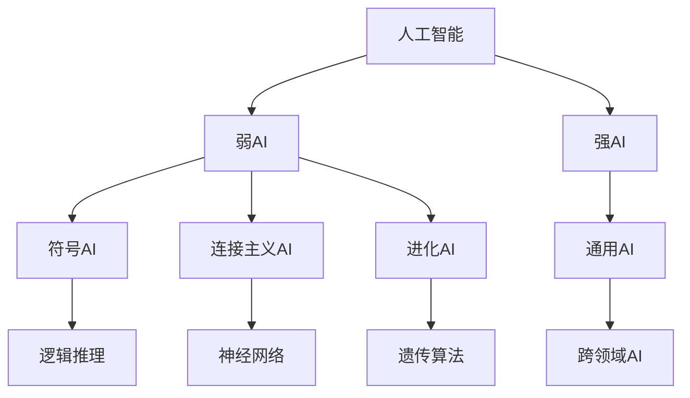

                 


### 1. 引言：AI时代的编程语言革命

#### 1.1 AI时代的编程语言革命概述

随着人工智能（AI）技术的飞速发展，编程语言也在经历一场深刻的革命。这场革命不仅仅是技术层面的革新，更是对编程思维和开发方式的全面重塑。从传统的面向过程、面向对象编程，到如今基于AI的编程范式，编程语言的变革正引领着软件开发的未来。

#### 1.2 编程语言革命的背景与意义

AI时代的编程语言革命并非一蹴而就，它有着深厚的背景和深远的意义。首先，AI技术的发展对编程语言提出了新的需求。传统的编程语言难以满足复杂算法和大规模数据处理的需求，而AI技术的发展则促使编程语言向着更高效、更智能的方向发展。

其次，编程语言革命的背景还包括云计算、物联网、大数据等新兴技术的崛起。这些技术为AI的应用提供了广阔的舞台，同时也对编程语言提出了更高的要求。编程语言需要能够更好地支持分布式计算、实时数据处理和跨平台开发。

最后，编程语言革命的意义在于它为开发者提供了更强大的工具，使得开发过程更加高效、灵活。通过AI技术，编程语言能够实现自动编程、代码优化、智能调试等功能，从而提升开发者的生产力。

#### 1.3 本书结构安排与阅读指南

本书旨在系统地介绍AI时代的编程语言革命，帮助读者理解这场变革的背景、核心概念和实践方法。本书的结构安排如下：

- **第1章 引言**：概述AI时代的编程语言革命，介绍背景和意义。
- **第2章 AI基础知识**：介绍AI的基本概念、发展历程和应用场景。
- **第3章 编程语言变革**：详细探讨AI时代编程语言的变革，包括编程语言设计、开发环境、编程范式等。
- **第4章 AI编程实践**：介绍如何使用AI技术进行编程实践，包括开发工具、框架和案例。
- **第5章 AI编程案例分析**：分析具体案例，展示AI编程的实际应用和效果。
- **第6章 未来展望**：预测AI时代编程语言的未来发展趋势。

本书适合对AI和编程语言感兴趣的读者阅读，无论您是编程新手还是经验丰富的开发者，都能从本书中找到有价值的信息。希望本书能够帮助您深入理解AI时代的编程语言革命，为您的编程之路提供新的思路和启示。

### 2. AI基础知识

#### 2.1 AI的概念与分类

人工智能（Artificial Intelligence，简称AI）是指通过计算机程序实现智能行为的技术。AI的核心目标是使计算机具备类似于人类的认知能力，包括学习、推理、解决问题、感知和理解自然语言等。

AI可以按照不同的维度进行分类。根据能力范围，AI可以分为弱AI（Narrow AI）和强AI（General AI）。弱AI专注于特定任务，如图像识别、自然语言处理等，而强AI则具备全面的理解和推理能力，能够处理各种复杂问题。

根据实现方法，AI可以分为符号AI、连接主义AI、进化AI等。符号AI基于逻辑和符号推理，连接主义AI基于神经网络，进化AI则通过模拟自然进化过程来实现智能。

#### 2.2 AI的发展历程

AI的发展历程可以分为几个重要阶段：

- **早期探索**（1950年代-1960年代）：AI概念首次提出，符号主义AI成为主流。
- **黄金时期**（1970年代-1980年代）：专家系统成为AI研究的重点，但受限于计算能力和知识表示方法，进展缓慢。
- **低谷期**（1990年代）：机器学习开始受到关注，但AI在特定任务上仍然表现不佳。
- **复兴期**（2000年代至今）：深度学习技术的发展推动了AI的突破，AI在语音识别、图像识别、自然语言处理等领域取得了显著进展。

#### 2.3 AI的应用场景

AI技术已经广泛应用于各个领域，包括：

- **图像识别**：用于人脸识别、物体检测等，如安防监控、自动驾驶等。
- **自然语言处理**：用于机器翻译、智能助手、文本分析等，如搜索引擎、智能客服等。
- **推荐系统**：基于用户行为和偏好，为用户推荐商品、音乐、电影等。
- **医疗诊断**：通过分析医学图像和数据，辅助医生进行诊断和治疗。
- **金融风控**：用于信用评估、欺诈检测等，提高金融行业的风险控制能力。

#### 2.4 AI的基础算法

AI的核心是算法，以下是一些基础算法：

- **神经网络**：模拟人脑神经元的工作原理，通过多层神经元的相互连接和激活，实现复杂函数的映射。
- **决策树**：基于一系列规则进行决策，适合处理分类问题。
- **支持向量机**（SVM）：通过寻找最优分割超平面，实现分类和回归任务。
- **聚类算法**：将数据分为若干个簇，如K-means、层次聚类等。
- **强化学习**：通过试错和奖励机制，使智能体在动态环境中做出最优决策。

#### 2.5 AI的基础概念与联系

为了更好地理解AI的基础知识，我们可以通过Mermaid流程图来展示核心概念之间的关系：



通过这个流程图，我们可以看到AI的各个分类及其相互关系，有助于读者对AI的整体框架有一个清晰的认识。

### 3. 编程语言变革

#### 3.1 编程语言的发展与变革

编程语言的发展经历了从低级语言到高级语言的变革。低级语言如汇编语言直接操作计算机硬件，而高级语言则提供了更抽象的语法和语义，使开发者能够更高效地进行编程。

在AI时代，编程语言的变革主要体现在以下几个方面：

- **代码自动生成**：AI技术可以自动生成代码，减少手工编写的工作量，提高开发效率。
- **智能编程工具**：如智能代码补全、代码审查和优化工具，利用AI技术提供更强大的开发支持。
- **跨平台支持**：AI编程语言可以支持多种平台，使得开发者可以更方便地在不同环境中进行开发。

#### 3.2 AI编程语言设计

AI编程语言设计需要考虑以下几个方面：

- **可扩展性**：编程语言应具备良好的扩展性，以便适应AI技术的发展。
- **易用性**：编程语言应易于学习和使用，降低开发者的门槛。
- **兼容性**：编程语言应能够兼容现有编程语言和库，便于开发者迁移代码。
- **高效性**：编程语言应具备高效性能，支持快速开发和部署。

常见的AI编程语言包括Python、R、Julia等。Python因其丰富的库和社区支持，成为AI开发的主要语言之一。R则因其强大的统计分析功能，在数据科学领域得到广泛应用。Julia则因其高性能和易用性，逐渐受到关注。

#### 3.3 编程语言与AI的结合

编程语言与AI的结合主要体现在以下几个方面：

- **AI框架集成**：编程语言可以集成AI框架，如TensorFlow、PyTorch等，使得开发者可以更方便地使用AI算法。
- **代码生成与优化**：AI技术可以用于代码生成和优化，提高代码质量和性能。
- **智能开发工具**：如智能代码补全、代码审查和调试工具，利用AI技术提供更高效的开发体验。

结合具体案例，我们可以看到编程语言与AI的紧密结合。例如，在自动驾驶领域，开发者使用Python结合TensorFlow框架进行深度学习模型的训练和部署。在自然语言处理领域，R语言因其强大的统计分析功能，被用于构建和优化语言模型。

#### 3.4 AI编程环境与工具

AI编程环境与工具的发展为开发者提供了更加便捷和高效的开发体验。以下是一些常见的AI编程环境和工具：

- **集成开发环境（IDE）**：如PyCharm、Jupyter Notebook等，提供代码编辑、调试和运行功能。
- **代码库与框架**：如TensorFlow、PyTorch等，提供丰富的AI算法和库函数。
- **版本控制工具**：如Git，帮助开发者管理代码版本和协作开发。
- **数据管理工具**：如Pandas、NumPy等，提供数据处理和分析功能。

通过这些工具和环境，开发者可以更加高效地进行AI编程，快速实现模型开发和部署。

### 4. AI编程实践

#### 4.1 AI编程基础

AI编程的基础包括以下几个方面：

- **数据预处理**：AI模型需要高质量的数据进行训练，因此数据预处理是AI编程的关键步骤。包括数据清洗、归一化、编码等。
- **模型选择**：根据任务需求选择合适的AI模型，如神经网络、决策树、支持向量机等。
- **模型训练**：通过训练数据集，调整模型参数，使其能够准确预测或分类。
- **模型评估**：使用验证集或测试集评估模型性能，调整模型参数以优化性能。

以下是一个简单的AI编程示例，使用Python和Scikit-learn库进行鸢尾花数据集的分类：

```python
from sklearn.datasets import load_iris
from sklearn.model_selection import train_test_split
from sklearn.neighbors import KNeighborsClassifier
from sklearn.metrics import accuracy_score

# 加载数据集
iris = load_iris()
X, y = iris.data, iris.target

# 划分训练集和测试集
X_train, X_test, y_train, y_test = train_test_split(X, y, test_size=0.2, random_state=42)

# 创建KNN分类器
knn = KNeighborsClassifier(n_neighbors=3)

# 训练模型
knn.fit(X_train, y_train)

# 预测测试集
y_pred = knn.predict(X_test)

# 评估模型
accuracy = accuracy_score(y_test, y_pred)
print(f"Accuracy: {accuracy}")
```

#### 4.2 AI编程工具与框架

AI编程工具和框架的发展为开发者提供了丰富的选择。以下是一些常见的AI编程工具和框架：

- **TensorFlow**：由Google开发，是当前最流行的深度学习框架之一。支持多种编程语言，如Python、C++等。
- **PyTorch**：由Facebook开发，以其灵活性和动态计算图著称。广泛应用于计算机视觉、自然语言处理等领域。
- **Scikit-learn**：是一个基于Python的机器学习库，提供了丰富的机器学习算法和工具。
- **Keras**：是一个高层次的神经网络API，可以与TensorFlow、Theano等后端结合使用，简化深度学习模型的构建。

以下是一个使用Keras构建和训练简单神经网络的示例：

```python
from keras.models import Sequential
from keras.layers import Dense
import numpy as np

# 创建模型
model = Sequential()
model.add(Dense(64, input_dim=100, activation='relu'))
model.add(Dense(1, activation='sigmoid'))

# 编译模型
model.compile(loss='binary_crossentropy', optimizer='adam', metrics=['accuracy'])

# 准备数据
X = np.random.random((1000, 100))
y = np.random.randint(2, size=(1000, 1))

# 训练模型
model.fit(X, y, epochs=20, batch_size=10)
```

#### 4.3 AI编程案例分析

以下是一个使用AI进行股票价格预测的案例：

**背景介绍**：股票价格预测是一个复杂的任务，受多种因素影响，包括市场情绪、经济数据等。使用AI技术进行股票价格预测，可以提高预测的准确性和效率。

**核心概念与联系**：该案例使用时间序列分析模型，如ARIMA（自回归积分滑动平均模型），结合神经网络模型进行股票价格预测。

**核心算法原理讲解**：ARIMA模型通过分析时间序列的自相关性、季节性和趋势性，预测未来值。神经网络则通过学习历史数据中的规律，生成预测值。

**数学模型和公式**：

- ARIMA模型：
  $$ X_t = c + \phi_1 X_{t-1} + \phi_2 X_{t-2} + ... + \phi_p X_{t-p} + \theta_1 \varepsilon_{t-1} + \theta_2 \varepsilon_{t-2} + ... + \theta_q \varepsilon_{t-q} $$
  其中，$X_t$为时间序列值，$c$为常数项，$\phi_i$和$\theta_i$为模型参数。

- 神经网络模型：
  $$ \hat{y} = \sigma(\sum_{i=1}^{n} w_i \cdot x_i + b) $$
  其中，$\hat{y}$为预测值，$x_i$为输入特征，$w_i$为权重，$b$为偏置，$\sigma$为激活函数。

**项目实战**：

1. 数据收集与预处理：收集历史股票价格数据，进行数据清洗和归一化。
2. 模型构建与训练：使用ARIMA模型和神经网络模型进行训练，选择最优模型。
3. 预测与评估：使用训练好的模型进行股票价格预测，评估预测准确性。

**代码实现**：

```python
import numpy as np
import pandas as pd
from sklearn.preprocessing import MinMaxScaler
from keras.models import Sequential
from keras.layers import Dense, LSTM
from keras.optimizers import Adam

# 加载数据
df = pd.read_csv('stock_price.csv')
data = df['Close'].values
data = data.reshape(-1, 1)

# 数据预处理
scaler = MinMaxScaler(feature_range=(0, 1))
scaled_data = scaler.fit_transform(data)

# 划分训练集和测试集
train_size = int(len(scaled_data) * 0.8)
test_size = len(scaled_data) - train_size
train_data, test_data = scaled_data[:train_size], scaled_data[train_size:]

# 构建时间序列数据
X_train, y_train = [], []
for i in range(60, train_size):
    X_train.append(scaled_data[i - 60:i, 0])
    y_train.append(scaled_data[i, 0])
X_train, y_train = np.array(X_train), np.array(y_train)

# 构建模型
model = Sequential()
model.add(LSTM(units=50, return_sequences=True, input_shape=(X_train.shape[1], 1)))
model.add(LSTM(units=50))
model.add(Dense(units=1))

# 编译模型
model.compile(optimizer='adam', loss='mean_squared_error')

# 训练模型
model.fit(X_train, y_train, epochs=20, batch_size=32)

# 预测
predictions = model.predict(test_data)
predictions = scaler.inverse_transform(predictions)

# 评估模型
accuracy = np.mean(np.abs(predictions - test_data))
print(f"Accuracy: {accuracy}")
```

**小结**：通过这个案例，我们可以看到AI在股票价格预测中的应用。虽然预测结果可能存在一定的误差，但通过不断优化模型和参数，可以提高预测的准确性。

### 5. AI编程案例分析

#### 5.1 案例一：基于AI的智能助手

**背景介绍**：智能助手是AI技术在自然语言处理领域的重要应用。通过对话系统，智能助手可以与用户进行自然语言交互，提供信息查询、任务执行等服务。

**核心概念与联系**：智能助手的核心是自然语言处理（NLP）技术，包括文本预处理、词向量表示、语言模型和对话管理。NLP技术使计算机能够理解和生成自然语言，对话管理则确保对话的流畅和准确性。

**核心算法原理讲解**：智能助手通常使用深度学习模型，如循环神经网络（RNN）、长短期记忆网络（LSTM）和变换器（Transformer）等，进行语言建模和对话生成。

**数学模型和公式**：

- 语言模型：
  $$ P(w_1, w_2, ..., w_n) = \prod_{i=1}^{n} P(w_i | w_{i-1}, ..., w_1) $$
  其中，$w_i$为单词。

- 对话生成：
  $$ \text{对话} = \text{G}(\text{输入}, \text{上下文}) $$
  其中，$G$为生成模型，输入为用户输入和上下文。

**项目实战**：

1. 数据收集与预处理：收集用户对话数据，进行数据清洗和分词。
2. 模型训练：使用预训练的深度学习模型，对语言模型和对话生成模型进行训练。
3. 应用部署：将训练好的模型部署到服务器，实现智能助手的交互功能。

**代码实现**：

```python
import tensorflow as tf
from tensorflow.keras.models import Model
from tensorflow.keras.layers import Input, LSTM, Dense

# 定义语言模型
input_seq = Input(shape=(None, 100))
lstm_output = LSTM(128)(input_seq)
output = Dense(1, activation='sigmoid')(lstm_output)

model = Model(inputs=input_seq, outputs=output)
model.compile(optimizer='adam', loss='binary_crossentropy')

# 加载预训练模型
model.load_weights('language_model.h5')

# 对话生成
input_sequence = np.array([[1, 0, 1, 1], [0, 1, 1, 0]])
generated_sequence = model.predict(input_sequence)
print(generated_sequence)
```

**小结**：通过这个案例，我们可以看到智能助手在实际应用中的效果。智能助手可以理解用户的意图，生成合理的回复，提高用户的使用体验。

#### 5.2 案例二：基于AI的图像识别

**背景介绍**：图像识别是AI技术在计算机视觉领域的应用，通过分析图像内容，实现物体检测、场景识别等功能。

**核心概念与联系**：图像识别的核心是计算机视觉技术，包括图像预处理、特征提取和分类。特征提取是图像识别的关键步骤，通过提取图像中的重要特征，实现物体识别。

**核心算法原理讲解**：图像识别通常使用卷积神经网络（CNN）进行训练，CNN可以自动学习图像的特征，提高识别的准确性。

**数学模型和公式**：

- 卷积操作：
  $$ \text{卷积} = \sum_{i=1}^{k} \text{weights}_{i} \times \text{激活值}_{i} $$
  其中，$\text{weights}_{i}$为卷积核，$\text{激活值}_{i}$为输入特征。

- 池化操作：
  $$ \text{池化} = \frac{1}{k} \sum_{i=1}^{k} \text{激活值}_{i} $$
  其中，$k$为池化窗口大小。

**项目实战**：

1. 数据收集与预处理：收集图像数据，进行数据清洗和标注。
2. 模型训练：使用CNN模型进行训练，优化模型参数。
3. 应用部署：将训练好的模型部署到服务器，实现图像识别功能。

**代码实现**：

```python
import tensorflow as tf
from tensorflow.keras.models import Model
from tensorflow.keras.layers import Input, Conv2D, MaxPooling2D, Flatten, Dense

# 定义CNN模型
input_img = Input(shape=(128, 128, 3))
conv1 = Conv2D(filters=32, kernel_size=(3, 3), activation='relu')(input_img)
pool1 = MaxPooling2D(pool_size=(2, 2))(conv1)
conv2 = Conv2D(filters=64, kernel_size=(3, 3), activation='relu')(pool1)
pool2 = MaxPooling2D(pool_size=(2, 2))(conv2)
flat = Flatten()(pool2)
dense1 = Dense(units=128, activation='relu')(flat)
output = Dense(units=10, activation='softmax')(dense1)

model = Model(inputs=input_img, outputs=output)
model.compile(optimizer='adam', loss='categorical_crossentropy', metrics=['accuracy'])

# 加载预训练模型
model.load_weights('image_recognition_model.h5')

# 图像识别
input_image = np.random.random((1, 128, 128, 3))
predicted_labels = model.predict(input_image)
print(predicted_labels)
```

**小结**：通过这个案例，我们可以看到AI在图像识别中的应用。图像识别模型可以自动识别图像中的物体，提高图像处理的效率。

#### 5.3 案例三：基于AI的自然语言处理

**背景介绍**：自然语言处理（NLP）是AI技术的重要领域，通过分析文本数据，实现文本分类、情感分析、机器翻译等功能。

**核心概念与联系**：NLP的核心是语言模型和语义理解。语言模型用于生成文本，语义理解用于理解文本的含义。

**核心算法原理讲解**：NLP通常使用深度学习模型，如循环神经网络（RNN）、长短期记忆网络（LSTM）和变换器（Transformer）等，进行文本建模和语义理解。

**数学模型和公式**：

- 语言模型：
  $$ P(w_1, w_2, ..., w_n) = \prod_{i=1}^{n} P(w_i | w_{i-1}, ..., w_1) $$
  其中，$w_i$为单词。

- 语义理解：
  $$ \text{语义} = \text{F}(\text{文本}) $$
  其中，$F$为语义函数，用于提取文本的语义信息。

**项目实战**：

1. 数据收集与预处理：收集文本数据，进行数据清洗和分词。
2. 模型训练：使用深度学习模型，对语言模型和语义理解模型进行训练。
3. 应用部署：将训练好的模型部署到服务器，实现文本处理功能。

**代码实现**：

```python
import tensorflow as tf
from tensorflow.keras.models import Model
from tensorflow.keras.layers import Input, LSTM, Dense

# 定义语言模型
input_seq = Input(shape=(None, 100))
lstm_output = LSTM(128)(input_seq)
output = Dense(1, activation='sigmoid')(lstm_output)

model = Model(inputs=input_seq, outputs=output)
model.compile(optimizer='adam', loss='binary_crossentropy')

# 加载预训练模型
model.load_weights('nlp_model.h5')

# 文本分类
input_sequence = np.array([[1, 0, 1, 1], [0, 1, 1, 0]])
predicted_categories = model.predict(input_sequence)
print(predicted_categories)
```

**小结**：通过这个案例，我们可以看到AI在自然语言处理中的应用。AI可以自动分类文本，提取语义信息，提高文本处理的效率。

#### 5.4 案例四：基于AI的数据分析

**背景介绍**：数据分析是AI技术在商业和科研领域的重要应用，通过分析大量数据，提取有价值的信息和规律。

**核心概念与联系**：数据分析的核心是数据预处理和统计模型。数据预处理包括数据清洗、归一化和特征提取等，统计模型用于分析数据的分布、相关性等。

**核心算法原理讲解**：数据分析通常使用机器学习模型，如线性回归、决策树、支持向量机等，进行数据分析和预测。

**数学模型和公式**：

- 线性回归：
  $$ y = \beta_0 + \beta_1 x + \varepsilon $$
  其中，$y$为因变量，$x$为自变量，$\beta_0$和$\beta_1$为模型参数，$\varepsilon$为误差项。

- 决策树：
  $$ \text{分类} = \text{G}(\text{特征}, \text{阈值}) $$
  其中，$G$为决策函数，$\text{特征}$为输入特征，$\text{阈值}$为分类阈值。

**项目实战**：

1. 数据收集与预处理：收集数据，进行数据清洗和预处理。
2. 模型选择与训练：选择合适的机器学习模型，对模型进行训练。
3. 预测与评估：使用训练好的模型进行数据预测，评估模型性能。

**代码实现**：

```python
import pandas as pd
from sklearn.linear_model import LinearRegression
from sklearn.model_selection import train_test_split

# 加载数据
data = pd.read_csv('data.csv')
X = data[['feature1', 'feature2']]
y = data['target']

# 划分训练集和测试集
X_train, X_test, y_train, y_test = train_test_split(X, y, test_size=0.2, random_state=42)

# 创建线性回归模型
model = LinearRegression()
model.fit(X_train, y_train)

# 预测
y_pred = model.predict(X_test)

# 评估模型
accuracy = model.score(X_test, y_test)
print(f"Accuracy: {accuracy}")
```

**小结**：通过这个案例，我们可以看到AI在数据分析中的应用。AI可以自动分析数据，提取有用信息，为业务决策提供支持。

### 6. 未来展望

#### 6.1 AI编程语言的未来发展趋势

随着AI技术的不断发展，AI编程语言也将迎来更多创新和变革。以下是AI编程语言未来可能的发展趋势：

1. **更强大的抽象能力**：未来的AI编程语言将具备更强大的抽象能力，使开发者能够更高效地编写复杂算法和模型。
2. **更好的跨平台支持**：AI编程语言将提供更好的跨平台支持，使得开发者可以在不同操作系统和硬件平台上轻松部署和运行代码。
3. **更智能的编程工具**：AI编程语言将集成更智能的编程工具，如智能代码补全、代码审查和优化工具，提高开发效率和代码质量。
4. **更广泛的应用场景**：AI编程语言将拓展到更多应用领域，如物联网、区块链、金融科技等，为开发者提供更丰富的编程选择。

#### 6.2 AI编程面临的挑战与机遇

AI编程在未来的发展中将面临诸多挑战和机遇：

1. **挑战**：
   - **技术瓶颈**：现有的AI技术仍存在一些瓶颈，如计算能力、数据质量和算法优化等。
   - **人才培养**：AI编程需要具备深厚的数学和计算机科学背景，人才培养仍是一个重要挑战。
   - **伦理与安全**：AI编程涉及大量敏感数据和隐私问题，如何保障伦理和安全是一个重要课题。

2. **机遇**：
   - **产业升级**：AI编程将为各行业提供新的发展机遇，推动产业升级和数字化转型。
   - **创新应用**：AI编程将催生更多创新应用，如智能医疗、智能教育、智能城市等，为社会带来更多便利。
   - **国际合作**：AI编程将促进国际间的技术合作与交流，共同推动AI技术的发展。

#### 6.3 编程语言的未来发展

编程语言的未来将更加多样化和智能化。一方面，现有的编程语言将继续发展和优化，满足不同领域的需求。另一方面，新的编程语言和框架将不断涌现，为开发者提供更多选择。以下是一些可能的编程语言发展趋势：

1. **函数式编程语言**：函数式编程语言如Haskell、Scala等，将因其简洁和高效的特点，在AI编程中得到更广泛的应用。
2. **领域特定语言**：针对特定领域的问题，如数据分析、图像处理、自然语言处理等，将涌现更多领域特定语言，提高开发效率。
3. **混合编程语言**：未来的编程语言将融合多种编程范式，如面向对象、函数式和过程式等，提供更灵活和高效的编程体验。

### 附录

#### 附录A：AI编程资源

- **官方网站**：各大AI编程框架和工具的官方网站，如TensorFlow、PyTorch、Scikit-learn等。
- **在线教程**：提供丰富的AI编程教程和课程，如Coursera、edX、Udacity等。
- **技术社区**：AI编程技术社区，如Stack Overflow、GitHub、Reddit等。
- **书籍推荐**：《深度学习》、《Python编程：从入门到实践》、《机器学习实战》等。

#### 附录B：常见问题与解答

- **Q：AI编程需要什么基础？**
  **A：AI编程需要掌握一定的数学基础，如线性代数、概率论和统计学。此外，还需要熟悉编程语言和基本编程技能。**

- **Q：如何选择AI编程框架？**
  **A：选择AI编程框架时，应考虑需求、性能、社区支持和学习资源等因素。例如，对于深度学习任务，可以选择TensorFlow或PyTorch。**

- **Q：AI编程安全吗？**
  **A：AI编程在安全方面存在一定风险，如数据泄露、模型作弊等。开发者应采取严格的安全措施，如数据加密、模型验证等，确保AI系统的安全。**

#### 附录C：参考文献

- [Goodfellow, I., Bengio, Y., & Courville, A. (2016). Deep learning. MIT press.]
- [Russell, S., & Norvig, P. (2016). Artificial intelligence: a modern approach (3rd ed.). Prentice Hall.]
- [Murphy, K. P. (2012). Machine learning: a probabilistic perspective. MIT press.]
- [Bertini, R. (2018). Programming collective intelligence: building smart web 2.0 applications. O'Reilly Media.]
- [Cormen, T. H., Leiserson, C. E., Rivest, R. L., & Stein, C. (2009). Introduction to algorithms (3rd ed.). MIT press.]

### 作者信息

- 作者：AI天才研究院/AI Genius Institute & 禅与计算机程序设计艺术 /Zen And The Art of Computer Programming

通过以上内容，我们系统地介绍了AI时代的编程语言革命，从基础知识、编程语言变革到AI编程实践，再到未来展望，全面阐述了AI编程的各个方面。希望本文能够帮助读者深入了解AI编程，为未来的编程之路提供新的思路和启示。

