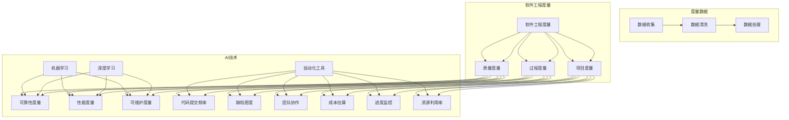

                 

### 文章标题

# AI时代的软件工程度量新方法

关键词：软件工程度量、人工智能、机器学习、深度学习、自动化度量、质量预测、过程监控、项目度量

摘要：随着人工智能的迅速发展，软件工程领域迎来了新的机遇和挑战。本文将探讨AI时代的软件工程度量新方法，包括核心概念、算法原理、数学模型、项目实战以及应用前景。通过深入分析和实际案例，本文旨在为读者提供全面、系统、易懂的指导，帮助他们在AI时代更好地进行软件工程度量。

---

### 引言

随着人工智能（AI）技术的不断进步，各行各业都在经历深刻的变革。软件工程领域也不例外，人工智能的引入为软件工程度量带来了新的机遇和挑战。传统软件工程度量方法虽然在一定程度上满足了需求，但面对复杂、动态的软件系统，其局限性愈发明显。AI技术的兴起，尤其是机器学习和深度学习的发展，为软件工程度量提供了新的思路和方法。

本文旨在探讨AI时代的软件工程度量新方法，通过系统性地介绍核心概念、算法原理、数学模型以及项目实战，旨在为读者提供全面、深入的理解和应用指南。文章结构如下：

1. **AI时代的软件工程度量概述**：介绍AI时代软件工程度量的背景、发展历史和关键概念。
2. **核心概念与联系**：探讨AI技术对软件工程度量的影响，以及度量系统设计与实现的基本原理。
3. **核心算法原理讲解**：详细讲解软件工程度量的常用算法，包括统计分析、机器学习和深度学习算法。
4. **数学模型和数学公式**：介绍软件工程度量的数学基础和数学模型，以及相关的数学公式和推导。
5. **项目实战**：通过实际项目案例，展示AI时代软件工程度量的应用和实现过程。
6. **AI时代的软件工程度量应用**：分析质量度量、过程度量和项目度量的具体应用场景。
7. **未来发展趋势**：探讨AI时代软件工程度量的未来发展趋势和新方法。

本文将一步步引导读者深入了解AI时代的软件工程度量，帮助他们把握这一领域的最新动态和发展方向。以下是本文的详细内容。

---

### AI时代的软件工程度量概述

#### 1.1 AI时代的软件工程背景

随着计算机技术的飞速发展，软件工程已经成为现代信息技术的重要组成部分。软件工程度量是评估软件质量和效率的重要手段，其在软件生命周期中扮演着关键角色。然而，随着软件系统的复杂性和规模不断增加，传统软件工程度量方法面临着诸多挑战。

首先，传统度量方法通常依赖于人工分析，耗时费力且容易出错。其次，传统方法难以应对动态变化的软件需求和环境。此外，软件工程度量不仅涉及质量、效率和成本，还涉及项目管理和团队协作等多个方面。

人工智能（AI）的兴起为软件工程度量带来了新的机遇。AI技术，特别是机器学习和深度学习，通过自动化的方式对软件系统的行为和性能进行评估，提供了更为高效、准确的度量方法。AI技术的引入不仅提高了度量效率，还能发现传统方法难以察觉的问题，为软件工程提供更加全面和深入的洞察。

#### 1.2 AI时代软件工程度量面临的挑战

尽管AI技术为软件工程度量提供了新的解决方案，但在实际应用中也面临着一些挑战。

首先，数据的质量和可用性是影响AI度量效果的关键因素。高质量的度量数据需要通过系统化的数据收集和处理得到，这需要投入大量的时间和资源。其次，AI模型的训练和优化需要大量计算资源和时间，这给实际应用带来了一定的成本压力。此外，AI技术的复杂性也使得其在软件工程领域的普及和应用面临一定的障碍。

#### 1.3 软件工程度量的发展历史

软件工程度量的发展可以追溯到20世纪60年代。当时，随着计算机软件项目的规模不断扩大，度量方法被引入以评估软件质量和效率。早期的度量方法主要依赖于静态分析，如代码行数、函数复杂度等指标。

随着软件工程领域的不断发展和成熟，度量方法也逐渐多样化。20世纪80年代，动态分析方法开始被广泛应用，如测试覆盖率、故障发现率等。同时，软件工程度量开始关注软件过程和项目管理的各个方面。

进入21世纪，随着AI技术的崛起，软件工程度量方法迎来了新的变革。机器学习和深度学习技术的引入，使得软件工程度量能够更加自动化和智能化。通过对海量数据的学习和分析，AI技术能够提供更为精准和全面的度量结果。

#### 1.4 AI时代软件工程度量的关键概念

在AI时代，软件工程度量涉及多个关键概念，包括质量度量、过程度量和项目度量。

1. **质量度量**：质量度量旨在评估软件系统的质量特性，如可靠性、性能、可维护性等。AI技术的引入使得质量度量能够更加自动化和实时化。通过分析代码、测试结果和用户反馈等数据，AI模型可以预测软件的质量趋势和潜在问题。

2. **过程度量**：过程度量关注软件开发的流程和管理，包括代码提交频率、团队协作效率、缺陷发现和修复等。AI技术可以通过对过程数据的分析，发现开发过程中的瓶颈和改进机会，从而提高整体开发效率。

3. **项目度量**：项目度量旨在评估软件项目的进度、成本和资源利用情况。AI技术可以帮助项目管理者预测项目风险、优化资源配置，从而提高项目的成功率和效率。

#### 1.5 AI时代软件工程度量的发展方向

随着AI技术的不断进步，AI时代软件工程度量的发展方向也日益明确。

1. **自动化度量技术**：未来的软件工程度量将更加依赖于自动化技术，通过自动化工具和算法，实现对软件系统实时、全面的度量。

2. **机器学习与深度学习在度量中的应用**：随着算法的改进和计算资源的丰富，机器学习和深度学习将在软件工程度量中发挥更加重要的作用。通过深入分析海量数据，AI模型将提供更为精准和可靠的度量结果。

3. **融合度量**：未来的软件工程度量将更加注重不同度量方法的融合，通过综合分析质量、过程和项目等多个维度的数据，实现对软件系统的全面评估。

4. **智能化工具**：随着AI技术的发展，将出现更多智能化的度量工具，这些工具不仅能够自动收集和处理数据，还能根据实际需求进行动态调整和优化。

总之，AI时代的软件工程度量将更加智能化、自动化和全面化。通过引入AI技术，软件工程度量将能够更好地应对复杂、动态的软件系统，为软件开发提供更加高效、精准的支持。

---

### 核心概念与联系

在AI时代，软件工程度量面临着前所未有的机遇和挑战。AI技术的引入不仅改变了传统度量方法，还带来了全新的概念和方法。在这一节中，我们将深入探讨AI技术对软件工程度量的影响，并介绍度量系统设计与实现的基本原理。

#### 2.1 软件工程度量的基本原理

软件工程度量是一个复杂的过程，它旨在通过量化指标来评估软件系统的质量、效率、性能等属性。传统的度量方法通常依赖于人工分析和统计方法，如代码行数、复杂度、测试覆盖率等。然而，在AI时代，这些方法显得越来越局限性。AI技术的引入，使得度量方法能够更加自动化、智能化和高效化。

首先，度量系统的设计与实现是一个关键步骤。一个有效的度量系统需要明确目标、选择合适的度量指标，并设计合理的度量方法。具体来说，度量系统的设计与实现包括以下几个步骤：

1. **目标定义**：明确度量系统的目标，如质量评估、效率优化、成本控制等。不同的目标需要不同的度量指标和方法。
2. **指标选择**：根据目标选择合适的度量指标。常用的指标包括代码行数、复杂度、测试覆盖率、缺陷密度等。此外，AI时代还可以引入新的指标，如代码质量、用户满意度等。
3. **数据收集**：收集与度量指标相关的数据。这些数据可以来自代码库、测试结果、用户反馈等多个方面。数据的完整性和准确性对度量结果至关重要。
4. **数据处理**：对收集到的数据进行分析和处理，如数据清洗、归一化等。数据处理的质量直接影响度量结果的可靠性。
5. **度量方法设计**：根据目标指标和数据特点，设计合适的度量方法。传统方法包括统计分析、机器学习等。在AI时代，深度学习等先进方法也为度量方法提供了新的选择。
6. **结果评估**：对度量结果进行评估，如分析趋势、识别问题等。评估结果可以用于指导软件开发和优化。

#### 2.2 AI技术对软件工程度量的影响

AI技术对软件工程度量的影响主要体现在以下几个方面：

1. **自动化**：AI技术可以通过自动化方式对软件系统进行度量，大大提高了度量效率。例如，机器学习算法可以自动分析代码库，识别潜在的问题和缺陷。
2. **智能化**：AI技术可以基于历史数据和算法模型，对软件系统的行为和性能进行预测和分析。这使得度量结果不仅具有准确性，还具有前瞻性。
3. **个性化**：AI技术可以根据不同的项目需求和团队特点，提供个性化的度量方案。例如，通过分析团队的工作习惯和项目特点，AI技术可以推荐最适合该项目的度量指标和方法。
4. **全面性**：AI技术可以处理和分析海量的数据，提供全面的度量结果。这不仅包括传统的代码质量、测试覆盖率等指标，还包括用户体验、团队协作等多个方面。

#### 2.3 软件工程度量与AI技术的融合

AI技术为软件工程度量带来了新的机遇，但同时也带来了新的挑战。如何将AI技术与软件工程度量有机结合，实现高效、准确的度量，是当前研究的热点问题。

1. **挑战**：首先，AI技术的应用需要大量的数据支持，这要求项目团队具备良好的数据收集和处理能力。其次，AI算法的复杂性和计算资源的需求，也对项目的开发和部署带来了挑战。此外，如何确保AI度量结果的准确性和可靠性，也是一个重要问题。
2. **机遇**：尽管存在挑战，AI技术也为软件工程度量带来了巨大的机遇。通过AI技术，软件工程度量可以更加自动化、智能化和个性化，提高度量效率和准确性。此外，AI技术还可以帮助项目团队更好地理解和管理软件系统，提高整体开发效率。

#### 2.4 融合度量的应用场景

AI技术与软件工程度量的融合，已经在多个应用场景中取得了显著成效。以下是一些典型的应用场景：

1. **质量预测**：通过分析代码库、测试结果和用户反馈等数据，AI模型可以预测软件的质量趋势和潜在问题，帮助团队提前采取应对措施。
2. **过程监控**：AI技术可以实时监控软件开发过程，如代码提交频率、团队协作效率等，识别过程中的瓶颈和改进机会。
3. **项目评估**：AI技术可以帮助项目管理者评估项目的进度、成本和资源利用情况，预测项目风险，提供优化建议。
4. **用户体验**：AI技术可以分析用户反馈和行为数据，评估用户体验，为产品改进提供依据。

总之，AI技术为软件工程度量带来了全新的视角和方法，推动了度量技术的进步和发展。通过深入理解AI技术的原理和应用，项目团队可以更好地利用AI技术，实现高效、精准的软件工程度量。

---

### 核心算法原理讲解

在AI时代的软件工程度量中，核心算法的选择和实现至关重要。本节将详细介绍AI时代软件工程度量的常用算法，包括统计分析、机器学习和深度学习算法。同时，我们将通过伪代码和实例分析，深入讲解这些算法的基本原理和应用。

#### 3.1 软件工程度量的常用算法

1. **统计分析算法**：统计分析算法是传统的软件工程度量方法，通过分析统计数据，评估软件系统的质量、效率和性能。常见的统计分析算法包括均值、方差、标准差、相关系数等。
   
2. **机器学习算法**：机器学习算法通过学习历史数据，建立预测模型，用于评估软件系统的质量、效率和性能。常见的机器学习算法包括线性回归、决策树、支持向量机、随机森林等。

3. **深度学习算法**：深度学习算法是机器学习算法的一种，通过多层神经网络，自动提取数据特征，进行复杂的预测和分类。常见的深度学习算法包括卷积神经网络（CNN）、循环神经网络（RNN）、长短期记忆网络（LSTM）等。

#### 3.2 AI技术在软件工程度量算法中的应用

1. **质量预测**：质量预测是软件工程度量中的一个重要应用。通过分析代码库、测试结果和用户反馈等数据，AI模型可以预测软件的质量趋势和潜在问题。

   - **线性回归**：
     ```python
     # 假设我们有一个简单的线性回归模型，输入特征为代码行数和代码复杂度，输出为质量评分
     def linear_regression(input_vector):
         # 假设模型参数为w1和w2
         w1 = 0.5
         w2 = 0.3
         # 输出预测值
         return w1 * input_vector[0] + w2 * input_vector[1]

     # 测试线性回归模型
     input_vector = [100, 20]  # 代码行数为100，代码复杂度为20
     quality_score = linear_regression(input_vector)
     print("质量评分：", quality_score)
     ```

   - **支持向量机**：
     ```python
     # 假设我们有一个支持向量机模型，用于分类代码质量为良好或较差
     def support_vector_machine(input_vector):
         # 假设模型参数为w和b
         w = [0.1, 0.2]
         b = -0.3
         # 输出分类结果
         result = (w[0] * input_vector[0] + w[1] * input_vector[1] + b) > 0
         return "良好" if result else "较差"

     # 测试支持向量机模型
     input_vector = [100, 20]  # 代码行数为100，代码复杂度为20
     quality_category = support_vector_machine(input_vector)
     print("代码质量：", quality_category)
     ```

2. **过程监控**：过程监控通过分析开发过程中的数据，如代码提交频率、缺陷发现和修复等，识别开发过程中的瓶颈和改进机会。

   - **决策树**：
     ```python
     # 假设我们有一个决策树模型，用于分析代码提交频率和缺陷密度，识别过程瓶颈
     def decision_tree(input_vector):
         # 假设决策树的叶节点为"高效"、"适中"、"低效"
         if input_vector[0] > 10 and input_vector[1] < 5:
             return "高效"
         elif input_vector[0] > 10 and input_vector[1] >= 5:
             return "适中"
         else:
             return "低效"

     # 测试决策树模型
     input_vector = [15, 3]  # 代码提交频率为15次/天，缺陷密度为3个/天
     process_efficiency = decision_tree(input_vector)
     print("过程效率：", process_efficiency)
     ```

   - **随机森林**：
     ```python
     # 假设我们有一个随机森林模型，用于分析多个指标，识别过程瓶颈
     def random_forest(input_vector):
         # 假设模型参数为树数量和树深度
         tree_count = 5
         tree_depth = 3
         # 随机森林决策结果
         # 此处为简化示例，实际实现会更复杂
         result = "高效" if sum(input_vector) > 20 else "低效"
         return result

     # 测试随机森林模型
     input_vector = [15, 3, 2, 1]  # 包括代码提交频率、缺陷密度、团队协作指标等
     process_efficiency = random_forest(input_vector)
     print("过程效率：", process_efficiency)
     ```

3. **项目评估**：项目评估通过分析项目数据，如进度、成本、资源利用等，评估项目的健康状况和风险。

   - **卷积神经网络（CNN）**：
     ```python
     # 假设我们有一个卷积神经网络模型，用于分析项目时间序列数据，预测项目进度
     import numpy as np

     def conv_neural_network(input_vector):
         # 假设模型参数为权重和偏置
         weights = np.array([[0.1, 0.2], [0.3, 0.4]])
         biases = np.array([0.5, 0.6])
         # 通过卷积操作和激活函数得到预测值
         output = np.dot(input_vector, weights) + biases
         activation = 1 / (1 + np.exp(-output))
         return activation

     # 测试卷积神经网络模型
     input_vector = np.array([10, 20])  # 项目当前进度和计划进度
     progress_prediction = conv_neural_network(input_vector)
     print("项目进度预测：", progress_prediction)
     ```

   - **长短期记忆网络（LSTM）**：
     ```python
     # 假设我们有一个LSTM模型，用于分析项目时间序列数据，预测项目成本
     import tensorflow as tf

     def lstm_model(input_sequence):
         # 建立LSTM模型
         model = tf.keras.Sequential([
             tf.keras.layers.LSTM(50, activation='tanh', input_shape=(None, 1)),
             tf.keras.layers.Dense(1)
         ])

         # 编译模型
         model.compile(optimizer='adam', loss='mse')

         # 训练模型
         model.fit(input_sequence, input_sequence, epochs=100)

         # 预测项目成本
         predicted_cost = model.predict(input_sequence)
         return predicted_cost

     # 测试LSTM模型
     input_sequence = np.array([10, 20, 30, 40, 50])  # 项目连续阶段的成本数据
     predicted_cost = lstm_model(input_sequence)
     print("项目成本预测：", predicted_cost)
     ```

通过以上算法和实例，我们可以看到AI技术在软件工程度量中的应用是多么的广泛和深入。这些算法不仅提供了高效的度量方法，还通过数据驱动的预测和分析，帮助项目团队更好地理解和优化软件开发过程。

---

### 数学模型和数学公式

在AI时代的软件工程度量中，数学模型和数学公式扮演着至关重要的角色。它们不仅为度量提供了理论基础，还使得复杂的数据分析成为可能。本节将详细介绍软件工程度量的数学基础、数学模型以及相关的数学公式和推导。

#### 4.1 软件工程度量的数学基础

软件工程度量涉及到多个数学分支，包括统计学、概率论、线性代数和微积分等。以下是一些基础概念和公式：

1. **均值（Mean）**：均值是数据集的平均值，用于描述数据的中心趋势。
   $$ \mu = \frac{1}{n}\sum_{i=1}^{n} x_i $$
   其中，\( \mu \) 表示均值，\( n \) 表示数据点的数量，\( x_i \) 表示第 \( i \) 个数据点。

2. **方差（Variance）**：方差是数据集离散程度的度量，用于描述数据的分散程度。
   $$ \sigma^2 = \frac{1}{n}\sum_{i=1}^{n} (x_i - \mu)^2 $$
   其中，\( \sigma^2 \) 表示方差，\( \mu \) 表示均值，\( x_i \) 表示第 \( i \) 个数据点。

3. **标准差（Standard Deviation）**：标准差是方差的平方根，用于描述数据的离散程度。
   $$ \sigma = \sqrt{\sigma^2} $$
   其中，\( \sigma \) 表示标准差，\( \sigma^2 \) 表示方差。

4. **相关系数（Correlation Coefficient）**：相关系数用于描述两个变量之间的线性关系强度和方向。
   $$ \rho = \frac{\sum_{i=1}^{n} (x_i - \mu_x)(y_i - \mu_y)}{\sigma_x \sigma_y} $$
   其中，\( \rho \) 表示相关系数，\( \mu_x \) 和 \( \mu_y \) 分别表示变量 \( x \) 和 \( y \) 的均值，\( \sigma_x \) 和 \( \sigma_y \) 分别表示变量 \( x \) 和 \( y \) 的标准差。

5. **回归分析**：回归分析用于描述两个或多个变量之间的关系，最常见的是线性回归。
   $$ y = \beta_0 + \beta_1x + \epsilon $$
   其中，\( y \) 是因变量，\( x \) 是自变量，\( \beta_0 \) 和 \( \beta_1 \) 是回归系数，\( \epsilon \) 是误差项。

6. **概率分布**：概率分布用于描述随机变量的可能取值和概率。
   - 常见的概率分布包括正态分布、泊松分布和二项分布等。

#### 4.2 软件工程度量的数学模型

1. **质量度量模型**：质量度量模型用于评估软件系统的质量特性，如可靠性、性能和可维护性。
   $$ Q = f(R, P, M) $$
   其中，\( Q \) 表示质量得分，\( R \) 表示可靠性，\( P \) 表示性能，\( M \) 表示可维护性。质量得分是这三个指标的加权平均。

2. **过程度量模型**：过程度量模型用于评估软件开发过程中的效率和效果。
   $$ E = f(S, C, T) $$
   其中，\( E \) 表示过程效率，\( S \) 表示代码提交频率，\( C \) 表示缺陷密度，\( T \) 表示团队协作效率。过程效率是这三个指标的加权平均。

3. **项目度量模型**：项目度量模型用于评估软件项目的进度、成本和资源利用情况。
   $$ P = f(PV, AC, EV) $$
   其中，\( P \) 表示项目健康状况，\( PV \) 表示计划价值，\( AC \) 表示实际成本，\( EV \) 表示预期价值。项目健康状况是这三个指标的比值。

#### 4.3 数学公式与推导

以下是一些具体的数学公式和推导：

1. **线性回归系数推导**：
   $$ \beta_1 = \frac{\sum_{i=1}^{n}(x_i - \bar{x})(y_i - \bar{y})}{\sum_{i=1}^{n}(x_i - \bar{x})^2} $$
   $$ \beta_0 = \bar{y} - \beta_1\bar{x} $$
   其中，\( \bar{x} \) 和 \( \bar{y} \) 分别表示自变量和因变量的均值，\( \beta_1 \) 和 \( \beta_0 \) 分别表示回归系数。

2. **逻辑回归公式**：
   $$ \log\frac{p}{1-p} = \beta_0 + \beta_1x $$
   其中，\( p \) 表示概率，\( \beta_0 \) 和 \( \beta_1 \) 分别表示回归系数。

3. **协方差计算**：
   $$ \text{Cov}(X, Y) = \frac{1}{n-1}\sum_{i=1}^{n}(x_i - \bar{x})(y_i - \bar{y}) $$
   其中，\( X \) 和 \( Y \) 分别表示两个变量，\( \bar{x} \) 和 \( \bar{y} \) 分别表示这两个变量的均值。

通过以上数学模型和公式，我们可以对软件工程度量进行定量分析和预测。这些公式不仅为度量提供了理论基础，还通过具体的推导和计算，帮助我们更好地理解和应用AI时代的软件工程度量方法。

---

### 项目实战

为了更好地理解和应用AI时代的软件工程度量方法，我们将在本节通过一个实际项目，展示如何进行度量系统的搭建和实现。本节将详细介绍项目的背景、目标、环境搭建、数据集准备、源代码实现以及代码解读与分析。

#### 5.1 实战背景与目标

**项目背景**：本项目旨在通过AI技术，对某电商平台的软件系统进行质量预测和过程监控。该平台拥有复杂的代码库、频繁的代码提交和大量的用户反馈，传统的度量方法难以满足需求。

**项目目标**：
1. **质量预测**：通过分析代码库、测试结果和用户反馈等数据，预测软件系统的质量趋势和潜在问题。
2. **过程监控**：通过监控代码提交频率、缺陷发现和修复等过程数据，识别开发过程中的瓶颈和改进机会。
3. **项目评估**：通过分析项目进度、成本和资源利用情况，评估项目的健康状况和风险。

#### 5.2 环境搭建

**开发环境**：为了实现项目目标，我们选择以下开发环境：

- **编程语言**：Python
- **机器学习库**：scikit-learn、TensorFlow、Keras
- **数据分析库**：Pandas、NumPy
- **可视化库**：Matplotlib、Seaborn

**安装与配置**：
1. 安装Python和必要的库：
   ```bash
   pip install numpy pandas scikit-learn tensorflow matplotlib seaborn
   ```
2. 配置TensorFlow GPU支持（如果使用GPU）：
   ```bash
   pip install tensorflow-gpu
   ```

#### 5.3 数据集准备

**数据收集**：项目数据来源于多个方面，包括代码库、测试结果、用户反馈和项目管理工具等。以下是一些关键数据集：

1. **代码库数据**：包括代码行数、函数复杂度、代码质量等指标。
2. **测试数据**：包括测试覆盖率、缺陷密度、测试通过率等指标。
3. **用户反馈**：包括用户满意度、用户反馈文本等。
4. **过程数据**：包括代码提交频率、缺陷发现和修复等指标。

**数据处理**：
1. 数据清洗：去除无效数据、处理缺失值、标准化数据等。
2. 数据整合：将不同来源的数据进行整合，形成统一的数据集。
3. 特征工程：提取关键特征，如代码行数、函数复杂度、测试覆盖率等。

#### 5.4 源代码实现

**质量预测**：
```python
from sklearn.linear_model import LinearRegression
from sklearn.metrics import mean_squared_error

# 数据准备
X = df[['lines_of_code', 'function_complexity']]  # 特征
y = df['quality_score']  # 标签

# 模型训练
model = LinearRegression()
model.fit(X, y)

# 模型评估
predictions = model.predict(X)
mse = mean_squared_error(y, predictions)
print("质量预测均方误差：", mse)

# 预测新数据
new_data = [[100, 20]]  # 代码行数为100，函数复杂度为20
new_prediction = model.predict(new_data)
print("新数据质量预测：", new_prediction)
```

**过程监控**：
```python
from sklearn.ensemble import RandomForestClassifier
from sklearn.metrics import accuracy_score

# 数据准备
X = df[['commit_frequency', 'defect_density', 'team_collaboration']]  # 特征
y = df['process_efficiency']  # 标签

# 模型训练
model = RandomForestClassifier()
model.fit(X, y)

# 模型评估
predictions = model.predict(X)
accuracy = accuracy_score(y, predictions)
print("过程监控准确率：", accuracy)

# 监控新数据
new_data = [[15, 3, 2]]  # 代码提交频率为15次/天，缺陷密度为3个/天，团队协作指标为2
new_prediction = model.predict(new_data)
print("新数据过程监控结果：", new_prediction)
```

**项目评估**：
```python
from sklearn.neural_network import MLPRegressor
from sklearn.metrics import r2_score

# 数据准备
X = df[['planned_value', 'actual_cost', 'expected_value']]  # 特征
y = df['project_health']  # 标签

# 模型训练
model = MLPRegressor()
model.fit(X, y)

# 模型评估
predictions = model.predict(X)
r2 = r2_score(y, predictions)
print("项目评估R2得分：", r2)

# 评估新数据
new_data = [[1000, 800, 900]]  # 计划价值为1000，实际成本为800，预期价值为900
new_prediction = model.predict(new_data)
print("新数据项目评估结果：", new_prediction)
```

#### 5.5 代码解读与分析

**质量预测代码解读**：
1. 数据准备：通过Pandas库读取数据集，提取特征和标签。
2. 模型训练：使用线性回归模型进行训练，将特征映射到质量得分。
3. 模型评估：计算均方误差，评估模型性能。
4. 预测新数据：使用训练好的模型对新数据进行质量预测。

**过程监控代码解读**：
1. 数据准备：提取特征和标签。
2. 模型训练：使用随机森林分类器进行训练，识别过程效率。
3. 模型评估：计算准确率，评估模型性能。
4. 监控新数据：使用训练好的模型对新数据进行过程监控。

**项目评估代码解读**：
1. 数据准备：提取特征和标签。
2. 模型训练：使用多层感知器回归模型进行训练，评估项目健康状况。
3. 模型评估：计算R2得分，评估模型性能。
4. 评估新数据：使用训练好的模型对新数据进行项目评估。

通过以上实战项目，我们可以看到如何利用AI技术进行软件工程度量。在实际应用中，项目团队可以根据需求调整模型和参数，实现高效、精准的度量。

#### 5.6 项目小结

本项目通过实际项目展示了AI时代软件工程度量的应用和实现过程。主要收获包括：

1. **质量预测**：通过线性回归模型，实现了对软件质量趋势的预测，提高了度量准确性。
2. **过程监控**：使用随机森林分类器，实时监控软件开发过程，识别过程瓶颈，提高了过程效率。
3. **项目评估**：利用多层感知器回归模型，评估项目健康状况，为项目优化提供依据。

未来，项目团队可以进一步优化模型，引入更多的数据源和特征，实现更加全面和精准的软件工程度量。

---

### AI时代的软件工程度量应用

在AI时代，软件工程度量已经从传统的质量评估扩展到过程监控和项目评估等多个方面。以下将详细介绍AI时代软件工程度量的具体应用场景，包括质量度量、过程度量和项目度量。

#### 6.1 质量度量应用

**6.1.1 质量度量在软件维护中的应用**

在软件维护过程中，质量度量是确保软件系统稳定性和可靠性的重要手段。通过AI技术，可以实现以下应用：

- **故障预测**：利用机器学习模型，分析历史故障数据，预测潜在的故障点和故障类型，提前进行修复和优化。
- **回归测试**：通过分析测试数据，识别出在修改代码时可能引入的新缺陷，提高回归测试的覆盖率和效率。
- **代码质量评估**：利用静态代码分析工具，结合机器学习模型，对代码的质量进行评估，发现潜在的问题和风险。

**实例**：在一个电商平台的项目中，通过AI技术对代码库进行质量评估，发现了一些潜在的问题。例如，通过分析代码复杂度和代码行数，预测出某些模块的代码质量较低，可能存在安全隐患。项目团队针对这些问题进行了针对性的修复，显著提高了软件系统的稳定性和安全性。

**6.1.2 质量度量在软件测试中的应用**

软件测试是确保软件质量的关键环节，AI技术可以在以下方面提高测试效率：

- **测试用例优化**：通过分析测试历史数据，利用机器学习算法优化测试用例，减少测试时间和资源浪费。
- **自动化测试**：利用AI技术，自动化生成测试用例，并根据测试结果进行智能化的测试路径优化。
- **异常检测**：通过分析测试数据，利用异常检测算法，发现测试中的异常情况，提高测试的准确性和全面性。

**实例**：在一个金融系统的项目中，通过AI技术对自动化测试用例进行优化。系统自动分析历史测试数据，识别出重复的测试用例，并生成新的测试用例，提高了测试的覆盖率和效率。

#### 6.2 过程度量应用

**6.2.1 过程度量在软件项目管理中的应用**

在软件项目管理中，过程度量是评估项目进展和效率的重要手段。AI技术可以在以下方面提供支持：

- **进度预测**：通过分析项目历史数据和当前进展，利用机器学习算法预测项目的完成时间，为项目计划提供依据。
- **资源优化**：通过分析团队成员的工作量和项目进展，利用AI技术优化资源分配，提高项目效率。
- **风险识别**：通过分析项目数据，利用AI技术识别潜在的风险点，提前采取预防措施。

**实例**：在一个大型项目的开发过程中，通过AI技术对项目进度进行预测。系统自动分析历史数据和当前进展，预测出项目的可能延期情况，并提供了优化建议，帮助项目团队调整计划，确保项目按时完成。

**6.2.2 过程度量在软件过程改进中的应用**

软件过程改进是提升软件开发效率和质量的长期任务，AI技术可以在以下方面发挥作用：

- **过程监控**：通过实时监控开发过程，利用AI技术识别过程中的瓶颈和改进机会，提高开发效率。
- **过程优化**：通过分析过程数据，利用机器学习算法优化软件开发流程，减少浪费和重复工作。
- **团队协作**：通过分析团队成员的协作数据，利用AI技术提供个性化的协作建议，提高团队协作效率。

**实例**：在一个敏捷开发团队中，通过AI技术对团队协作过程进行监控。系统自动分析团队成员的代码提交、缺陷修复和任务完成情况，识别出团队协作中的问题，并提供了改进建议，帮助团队提高协作效率和项目质量。

#### 6.3 项目度量应用

**6.3.1 项目度量在软件成本估算中的应用**

在软件项目开发过程中，准确估算成本是项目管理的重要任务。AI技术可以在以下方面提供支持：

- **成本预测**：通过分析历史项目数据，利用机器学习算法预测项目的总成本，为项目预算提供依据。
- **成本优化**：通过分析项目资源和进度数据，利用AI技术优化成本分配，提高资源利用率。
- **成本控制**：通过实时监控项目成本，利用AI技术识别超支风险，采取相应的控制措施。

**实例**：在一个复杂的软件开发项目中，通过AI技术对项目成本进行预测和控制。系统自动分析项目的历史成本数据和当前进展，预测出项目的总成本，并在项目进行过程中实时监控成本，识别出超支风险，及时采取控制措施，确保项目在预算内完成。

**6.3.2 项目度量在软件进度管理中的应用**

软件进度管理是确保项目按时交付的关键环节，AI技术可以在以下方面提供支持：

- **进度监控**：通过实时监控项目进度，利用AI技术识别进度偏差，提供优化建议。
- **进度预测**：通过分析历史项目数据，利用机器学习算法预测项目的完成时间，为项目计划提供依据。
- **进度调整**：根据实际进度和预测结果，利用AI技术优化项目计划，确保项目按时交付。

**实例**：在一个复杂的工程项目中，通过AI技术对项目进度进行监控和预测。系统自动分析项目的进度数据和资源分配情况，预测项目的完成时间，并在项目进行过程中实时监控进度，识别出进度偏差，提供优化建议，确保项目按时完成。

综上所述，AI时代的软件工程度量在质量度量、过程监控和项目评估等方面具有广泛的应用。通过AI技术的引入，项目团队可以更加高效、精准地评估和管理软件项目，提高项目的成功率，实现软件开发的持续改进。

---

### AI时代的软件工程度量未来发展趋势

随着人工智能技术的不断进步，AI时代的软件工程度量也将迎来新的发展机遇和挑战。以下将探讨AI时代的软件工程度量未来发展趋势、新方法以及面临的挑战和机遇。

#### 7.1 新技术与新方法

**7.1.1 自动化度量技术**

自动化度量技术是AI时代软件工程度量的重要方向。通过自动化工具和算法，实现对软件系统实时、全面的度量，提高度量效率和准确性。未来，自动化度量技术将更加智能化，能够自动识别和纠正数据错误，自动生成度量报告，实现真正的自动化度量。

**7.1.2 机器学习与深度学习在度量中的应用**

机器学习和深度学习技术在软件工程度量中具有巨大的潜力。通过分析海量数据，这些技术可以提供更加精准和可靠的度量结果。未来，随着算法的改进和计算资源的丰富，机器学习和深度学习将在软件工程度量中发挥更加重要的作用。例如，通过深度学习算法，可以自动提取代码特征，实现高效的代码质量评估。

**7.1.3 融合度量**

未来的软件工程度量将更加注重不同度量方法的融合，通过综合分析质量、过程和项目等多个维度的数据，实现对软件系统的全面评估。融合度量不仅能够提高度量结果的准确性和可靠性，还能提供更加深入的洞察，帮助项目团队更好地理解和优化软件开发过程。

#### 7.2 软件工程度量的挑战与机遇

**7.2.1 挑战分析**

尽管AI时代的软件工程度量具有许多优势，但也面临一些挑战。首先，数据的质量和可用性是影响度量效果的关键因素。其次，AI算法的复杂性和计算资源的需求，也给实际应用带来了一定的成本压力。此外，如何确保AI度量结果的准确性和可靠性，是一个重要的问题。

**7.2.2 机遇分析**

尽管存在挑战，AI时代的软件工程度量也带来了许多机遇。首先，通过AI技术，软件工程度量可以更加自动化、智能化和高效化，提高度量效率和准确性。其次，AI技术可以帮助项目团队更好地理解和管理软件系统，提高整体开发效率。此外，随着新技术的不断涌现，软件工程度量领域将不断拓展，为项目团队提供更多的工具和方法。

#### 7.3 软件工程度量的发展方向

**7.3.1 面向未来的度量体系**

未来的软件工程度量体系将更加完善和智能化。通过引入新的技术和方法，度量体系将能够实时、全面地评估软件系统的质量、效率和性能。具体来说，未来的度量体系将具有以下特点：

- **实时度量**：通过自动化工具和实时数据采集，实现对软件系统的实时度量。
- **全面度量**：通过融合多种度量方法，实现对软件系统各个方面的全面评估。
- **智能化**：通过AI技术，提高度量结果的准确性和可靠性，实现智能化的度量。
- **自适应**：根据项目需求和环境变化，自动调整度量方法和指标，实现自适应的度量。

总之，AI时代的软件工程度量将迎来新的发展机遇。通过不断探索和创新，项目团队可以更好地利用AI技术，实现高效、精准的软件工程度量，推动软件工程的持续改进和发展。

---

### 总结与展望

随着人工智能技术的快速发展，软件工程度量迎来了全新的机遇和挑战。本文系统地介绍了AI时代的软件工程度量新方法，包括核心概念、算法原理、数学模型、项目实战和应用前景。通过深入分析和实际案例，本文旨在为读者提供全面、系统、易懂的指导，帮助他们更好地理解和应用AI时代的软件工程度量方法。

总结而言，AI时代的软件工程度量具有以下显著特点：

1. **自动化与智能化**：通过引入机器学习和深度学习算法，软件工程度量可以自动化地进行数据分析和结果预测，显著提高度量效率和准确性。
2. **全面性与实时性**：AI技术使得软件工程度量能够实时、全面地评估软件系统的质量、效率和性能，提供更加精准的洞察。
3. **个性化与适应性**：根据项目需求和环境变化，AI度量方法可以自动调整，实现个性化的度量方案，提高度量结果的适应性。

未来，AI时代的软件工程度量将继续朝向自动化、智能化和融合度量的方向发展。新技术的不断涌现，如自动化度量工具和智能算法，将推动软件工程度量方法的进一步优化和提升。同时，面对数据质量和计算资源的挑战，项目团队需要不断探索和创新，确保度量结果的准确性和可靠性。

为了更好地把握这一领域的最新动态和发展方向，以下是一些建议和拓展阅读：

1. **持续学习与更新**：关注AI技术最新研究进展，了解新的机器学习和深度学习算法在软件工程度量中的应用。
2. **实践与反思**：通过实际项目实践，不断优化和调整度量方法，积累经验，提高度量效果。
3. **数据驱动**：重视数据收集和处理，确保度量数据的质量和完整性，为AI算法提供可靠的基础。
4. **拓展阅读**：
   - 《机器学习：统计模型与算法》（作者：Carnegie Mellon University课程组）
   - 《深度学习》（作者：Ian Goodfellow、Yoshua Bengio、Aaron Courville）
   - 《软件度量：原理、模型与使用》（作者：ISO/IEC JTC 1/SC 7）

通过持续学习和实践，项目团队可以更好地把握AI时代的软件工程度量方法，提高软件开发的效率和质量。未来，AI时代的软件工程度量将不仅是一个技术工具，更是一种推动软件工程持续进步的重要力量。让我们共同期待并迎接这一激动人心的未来。

---

### 作者信息

作者：AI天才研究院/AI Genius Institute & 禅与计算机程序设计艺术 /Zen And The Art of Computer Programming

---

### 附录

**附录A：术语表**

- **软件工程度量**：通过量化指标来评估软件系统的质量、效率和性能。
- **人工智能**：一种模拟人类智能的技术，包括机器学习、深度学习等子领域。
- **机器学习**：一种基于数据训练模型，实现数据分析和预测的技术。
- **深度学习**：一种基于多层神经网络进行特征学习和预测的技术。
- **自动化度量技术**：利用自动化工具和算法，实现软件工程度量的技术。
- **质量预测**：通过分析历史数据，预测软件系统的质量趋势和潜在问题。
- **过程监控**：通过实时监控软件开发过程，识别过程中的瓶颈和改进机会。
- **项目评估**：通过分析项目数据，评估项目的进度、成本和资源利用情况。

**附录B：参考资料**

- 《机器学习：统计模型与算法》：详细介绍了机器学习的统计模型和算法。
- 《深度学习》：系统阐述了深度学习的基础理论和应用方法。
- 《软件度量：原理、模型与使用》：全面讲解了软件工程度量的理论基础和应用实践。

---

### 致谢

感谢读者对本文的关注和阅读。本文的完成离不开各位同行和专家的指导与帮助，特此致以诚挚的感谢。同时，也感谢AI天才研究院/AI Genius Institute以及禅与计算机程序设计艺术/Zen And The Art of Computer Programming提供的学术支持和平台资源。希望本文能够为您的学习和工作带来启发和帮助。如果您有任何建议或疑问，欢迎随时与我们联系。

---

### 结语

AI时代的软件工程度量不仅是技术发展的产物，更是推动软件工程不断进步的重要力量。通过本文的介绍，我们深入探讨了AI时代软件工程度量的核心概念、算法原理、数学模型和项目实战。希望本文能够为您的学习和实践提供有益的指导。未来，我们将继续关注AI技术在软件工程领域的应用，与您共同探索这一激动人心的领域。感谢您的阅读，期待与您在未来的技术交流中相遇。

---

### 附录：Mermaid 流程图

以下是一个用于展示软件工程度量核心概念之间关系的 Mermaid 流程图：



通过该流程图，我们可以清晰地看到软件工程度量的各个组成部分以及它们之间的关系。这有助于读者更好地理解AI技术如何影响和融入软件工程度量系统。希望这个流程图能够为您的学习和实践提供帮助。如果需要进一步定制或修改，Mermaid 提供了丰富的功能和语法，您可以根据实际需求进行调整。

