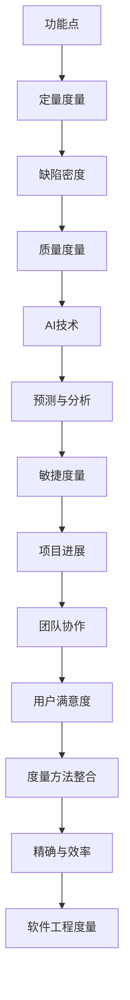
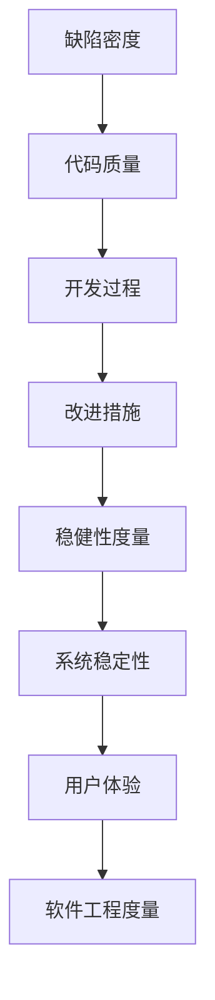
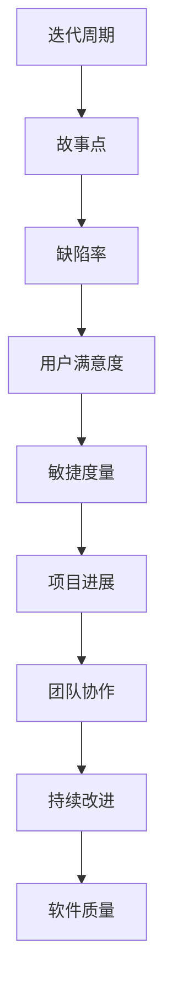
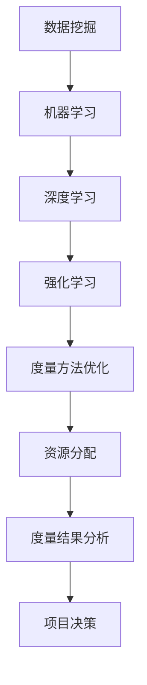
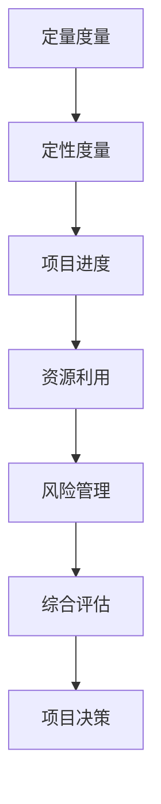
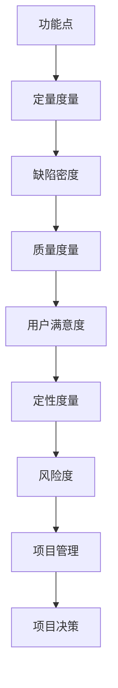

                 

### 第1章 引言

#### 1.1 AI时代的背景

随着人工智能（Artificial Intelligence, AI）技术的迅猛发展，我们正进入一个前所未有的AI时代。AI技术已经从早期的实验室研究逐渐走向实际应用，并在各个领域展现出巨大的潜力。从自动驾驶、智能语音助手到医疗诊断、金融分析，AI正在改变着我们的生活方式和工作模式。软件工程领域也不例外，AI技术的引入为传统的软件工程度量带来了新的机遇和挑战。

AI时代的到来不仅推动了技术进步，也改变了软件开发的范式。传统的软件开发往往依赖于人类的经验和直觉，而AI技术则能够通过数据分析和模式识别，提供更加精确和高效的决策支持。这使得软件工程度量从定性到定量，再到定性与定量相结合的多元化方向发展。

#### 1.2 软件工程度量的重要性

软件工程度量是评估软件项目质量和效率的重要手段。它不仅帮助开发者理解软件产品的性能和特点，还为项目管理和决策提供了科学依据。有效的度量方法可以用于以下几个方面：

- **项目评估**：度量可以帮助团队了解项目的进展情况和潜在风险，从而做出合理的调整。
- **性能优化**：通过度量软件的运行效率和资源消耗，团队可以针对性地进行性能优化。
- **质量保证**：度量方法可以用于评估软件质量，及时发现和修复缺陷。
- **成本控制**：度量为项目成本估算和资源分配提供了参考，有助于控制项目成本。

在AI时代，软件工程度量的重要性更为突出。随着软件系统的复杂性和规模不断增加，传统的度量方法已经难以满足需求。AI技术的引入为度量方法的改进提供了新的可能性，使得软件工程度量更加智能和精准。

#### 1.3 从定量到定性：度量方法的演变

传统的软件工程度量主要采用定量方法，即通过数值指标来描述软件的性能和质量。例如，功能点度量（Function Points）和质量度量（如缺陷密度和复杂度）是常用的定量度量方法。这些方法能够提供具体的量化数据，有助于项目管理和评估。

然而，定量方法也存在一定的局限性。例如，它们往往无法全面反映软件的复杂性和用户需求。在某些情况下，定量度量结果可能并不准确，甚至误导项目决策。

随着AI技术的发展，软件工程度量开始向定性方法转变。定性方法更注重对软件系统内在特性和用户体验的评估，如用户满意度、风险度和敏捷度量。这些方法能够提供更加丰富和直观的信息，帮助团队更全面地理解软件系统。

在AI时代，定量与定性度量方法开始相互融合。通过结合AI技术，团队可以更准确地识别和评估软件系统的复杂性和用户需求，从而实现更高效的软件工程度量。

### 摘要

本文探讨了AI时代软件工程度量的发展趋势，从传统的定量方法到现代的定性方法，再到二者的融合。首先，介绍了AI时代的背景和软件工程度量的重要性。接着，详细阐述了定量度量方法和定性度量方法的基本概念、原理和应用。最后，通过案例研究和最佳实践，展示了AI技术在软件工程度量中的应用和实际效果。本文旨在为开发者、项目管理者以及研究人员提供全面的软件工程度量参考，帮助他们在AI时代更好地应对挑战，提升软件质量和开发效率。

### 第2章 AI时代的软件工程度量基础

#### 2.1 软件工程度量的定义与作用

软件工程度量是软件工程领域的重要组成部分，它通过量化指标来评估软件系统的各种特性，如功能、质量、性能、资源和成本等。度量不仅为项目管理和决策提供了科学依据，还帮助团队理解和优化软件开发过程。在AI时代，软件工程度量的重要性更加凸显，因为AI技术为度量方法带来了革命性的变革。

**定义**：软件工程度量（Software Engineering Metrics）是指使用数值或其他量化方法来评估软件项目的各种属性。这些属性可以是功能、性能、质量、复杂性、资源消耗、成本等。度量方法可以是定量的，如功能点、缺陷密度等，也可以是定性的，如用户满意度、风险度等。

**作用**：软件工程度量在软件开发过程中扮演着多个关键角色：

- **项目管理**：度量提供了项目的进度、风险、成本等方面的量化数据，帮助项目管理者做出更科学的决策。
- **质量保证**：度量可以帮助团队识别软件缺陷、评估软件质量，从而采取相应的改进措施。
- **性能优化**：通过度量软件的运行效率和资源消耗，团队可以针对性地进行性能优化。
- **团队协作**：度量促进了团队内部以及跨团队之间的沟通和协作，使项目目标更加明确。

#### 2.2 软件工程度量的发展历程

软件工程度量的发展历程可以分为几个阶段：

1. **早期度量**：早期度量主要关注软件质量和开发过程，如缺陷密度、测试覆盖率等。这些方法虽然简单，但为后续的度量研究奠定了基础。
2. **功能点度量**：20世纪80年代，功能点（Function Points）度量方法被提出，成为评估软件功能性的重要指标。功能点度量方法通过计算系统提供的功能性需求来量化软件的大小和复杂性。
3. **质量度量**：随着软件系统复杂性的增加，质量度量逐渐受到关注。缺陷密度、代码复杂度、代码冗余等指标被广泛应用于质量评估。
4. **过程度量**：20世纪90年代，随着敏捷开发和持续集成等新开发模式的出现，过程度量成为焦点。过程度量关注开发过程中的各个环节，如代码审查、测试活动、迭代周期等，以优化开发流程。
5. **AI时代的度量**：随着AI技术的发展，软件工程度量进入了一个新的阶段。AI技术为度量方法提供了新的可能性，如通过机器学习和深度学习进行数据分析和预测，实现更智能和精确的度量。

#### 2.3 AI在软件工程度量中的应用

AI技术在软件工程度量中的应用主要体现在以下几个方面：

1. **数据挖掘和预测**：AI技术可以通过数据挖掘方法发现软件系统中的潜在问题和趋势，如缺陷预测、性能预测等。这些预测结果可以帮助团队提前采取措施，避免潜在风险。
2. **自动化度量**：AI技术可以实现自动化的度量过程，如自动生成功能点、缺陷密度等度量数据。自动化度量不仅提高了度量效率，还减少了人为错误。
3. **个性化度量**：AI技术可以根据项目的具体特点和需求，提供个性化的度量方法和指标。这种方法有助于更准确地评估软件系统的质量和性能。
4. **自适应度量**：AI技术可以根据项目的实际情况和反馈，动态调整度量方法和指标。这种自适应度量方法能够更好地适应软件开发的复杂性和变化性。

总之，AI技术在软件工程度量中的应用，不仅提高了度量的准确性和效率，还为度量方法的创新提供了新的思路。在AI时代，软件工程度量将朝着更加智能化和精确化的方向发展。

### 背景介绍

在AI时代，软件工程度量的重要性不言而喻。首先，随着软件系统的复杂性和规模不断增加，传统的手工度量方法已经难以满足需求。传统的度量方法通常依赖于开发人员的经验和直觉，这种主观性很大的方法难以保证度量结果的准确性和一致性。因此，引入AI技术，通过数据分析和模式识别，可以为度量提供更加客观和精确的数据支持。

其次，AI技术能够处理大量复杂数据，并从中提取出有价值的信息。例如，通过机器学习算法，可以从历史项目数据中预测未来项目的缺陷率和性能表现。这种预测能力对于项目管理和决策具有重要意义，可以帮助团队提前识别潜在风险，并采取相应的预防措施。

此外，AI技术还可以实现自动化度量。传统的度量方法往往需要大量人工参与，而AI技术可以通过自动化工具，快速、高效地生成各种度量数据。这不仅提高了度量效率，还减少了人为错误，使度量结果更加可靠。

总之，AI时代的到来为软件工程度量带来了新的机遇和挑战。通过引入AI技术，我们可以实现更加智能化和精确化的度量，从而提升软件质量和开发效率。接下来，我们将进一步探讨定量度量方法，介绍其在AI时代的应用和优势。

#### 核心概念与联系

在探讨AI时代的软件工程度量时，我们需要了解几个核心概念及其之间的联系：

1. **功能点（Function Points）**：功能点是一种用于度量软件功能性的量化指标。它通过计算系统提供的功能性需求，来评估软件的大小和复杂性。功能点是定量度量方法中的一种，广泛用于估算软件项目的工作量和成本。

2. **缺陷密度（Defect Density）**：缺陷密度是指单位代码行中的缺陷数量。它是质量度量中常用的指标，用于评估软件代码的质量。缺陷密度可以帮助团队了解代码的脆弱性，从而采取相应的改进措施。

3. **敏捷度量（Agile Metrics）**：敏捷度量是一种适用于敏捷开发环境的度量方法。它注重项目进度、团队协作和用户满意度等定性指标，以帮助团队更好地适应快速变化的需求。

4. **AI技术**：AI技术，特别是机器学习和深度学习，在软件工程度量中发挥了重要作用。通过数据分析和模式识别，AI技术可以提供更精确的度量结果，并预测未来项目的缺陷率和性能表现。

**关系架构 Mermaid 流程图**

下面是一个Mermaid流程图，用于展示这些核心概念及其联系：



**关系说明**：

- **功能点与定量度量**：功能点是定量度量的一个重要组成部分，用于评估软件的功能性。
- **缺陷密度与质量度量**：缺陷密度是质量度量的一个关键指标，反映了软件代码的质量水平。
- **敏捷度量与项目进展、团队协作、用户满意度**：敏捷度量方法关注项目的进展、团队协作和用户满意度，这些定性指标对于评估软件项目的成功至关重要。
- **AI技术与预测与分析、度量方法整合**：AI技术通过预测和数据分析，可以提高度量方法的精确性和效率，并实现定量与定性度量的整合。

通过这些核心概念和联系，我们可以更全面地理解AI时代的软件工程度量，并利用AI技术实现更高效和精确的度量。

#### 核心算法原理讲解

在AI时代，软件工程度量方法的核心在于利用AI技术对数据进行深度分析和预测。以下是几种常用的核心算法原理和它们的伪代码：

1. **机器学习算法**：
   - **回归分析**：用于预测软件缺陷数量。
   - **伪代码**：
     ```plaintext
     function predict_defects(input_data):
         # 输入数据预处理
         preprocessed_data = preprocess_data(input_data)
         
         # 训练回归模型
         model = train_regression_model(preprocessed_data)
         
         # 预测缺陷数量
         predicted_defects = model.predict(preprocessed_data)
         
         return predicted_defects
     ```

2. **深度学习算法**：
   - **卷积神经网络（CNN）**：用于分析软件代码的复杂度和质量。
   - **伪代码**：
     ```plaintext
     function analyze_code_quality(input_code):
         # 代码预处理
         preprocessed_code = preprocess_code(input_code)
         
         # 构建CNN模型
         model = build_cnn_model(preprocessed_code)
         
         # 训练CNN模型
         trained_model = train_cnn_model(model, preprocessed_code)
         
         # 分析代码质量
         quality_score = trained_model.evaluate(input_code)
         
         return quality_score
     ```

3. **强化学习算法**：
   - **Q-learning**：用于优化软件开发过程，如迭代周期和资源分配。
   - **伪代码**：
     ```plaintext
     function optimize_dev_process(state, action, reward):
         # 初始化Q表
         Q = initialize_Q_table()
         
         # 更新Q表
         Q[state, action] = Q[state, action] + alpha * (reward + gamma * max(Q[next_state, :]) - Q[state, action])
         
         return Q
     ```

**数学模型和公式**：

1. **回归分析公式**：
   $$y = \beta_0 + \beta_1x_1 + \beta_2x_2 + ... + \beta_nx_n$$
   其中，$y$ 为预测的缺陷数量，$x_1, x_2, ..., x_n$ 为输入特征，$\beta_0, \beta_1, ..., \beta_n$ 为回归系数。

2. **CNN模型公式**：
   $$z = \sigma(W \cdot x + b)$$
   其中，$z$ 为输出，$W$ 为权重矩阵，$x$ 为输入特征，$b$ 为偏置项，$\sigma$ 为激活函数。

3. **Q-learning公式**：
   $$Q(s, a) = Q(s, a) + \alpha [r + \gamma \max(Q(s', a')) - Q(s, a)]$$
   其中，$s$ 为当前状态，$a$ 为当前动作，$r$ 为即时奖励，$\gamma$ 为折扣因子，$s'$ 为下一状态，$a'$ 为下一动作。

**详细讲解与举例说明**：

1. **回归分析举例**：
   - 假设我们想预测某项目的缺陷数量，输入特征包括开发人员的经验、代码行数和项目持续时间。使用回归分析公式，可以建立如下模型：
     $$\text{缺陷数量} = \beta_0 + \beta_1 \times (\text{开发人员经验}) + \beta_2 \times (\text{代码行数}) + \beta_3 \times (\text{项目持续时间})$$
   - 通过训练模型，我们可以得到回归系数 $\beta_0, \beta_1, \beta_2, \beta_3$，从而预测项目的缺陷数量。

2. **CNN模型举例**：
   - 假设我们要分析一段代码的质量，使用CNN模型对其进行处理。首先，对代码进行预处理，将其转换为固定长度的向量。然后，构建CNN模型，通过多层卷积和池化操作，提取代码特征。最后，通过全连接层输出质量分数。
   - 例如，输入代码的特征为：
     ```python
     input_code = "class MyClass: def __init__(self): pass def my_method(self): return 42"
     ```
   - 预处理后，输入到CNN模型，得到质量分数：
     ```python
     quality_score = analyze_code_quality(input_code)
     print("代码质量分数：", quality_score)
     ```

通过以上算法原理和公式，我们可以利用AI技术实现对软件工程度量的深度分析和预测，从而提高度量的准确性和效率。接下来，我们将进一步探讨定量度量方法，介绍其在AI时代的具体应用和优势。

### 第3章 定量度量方法

#### 3.1 功能点度量方法

功能点（Function Points）是一种用于评估软件功能性的量化指标，它通过计算系统提供的功能性需求来度量软件的大小和复杂性。功能点度量方法由Albrecht在1979年提出，随后由IFPUG（International Function Point Users Group）进行了标准化。

**核心概念**：

- **功能性需求**：功能性需求是指用户希望软件系统提供的功能。这些功能可以是输入、输出、查询、文件和接口。
- **输入**：系统接收数据的操作。
- **输出**：系统产生的数据。
- **查询**：系统提供的用于检索信息的操作。
- **文件**：系统中的持久数据结构。
- **接口**：系统与其他系统或组件的交互。

**计算公式**：

功能点的计算公式为：
$$FP = (N_i \times K_i) + (N_o \times K_o) + (N_q \times K_q) + (N_f \times K_f) - (N_ic \times K_ic) - (N_e \times K_e)$$
其中，$N_i, N_o, N_q, N_f$ 分别为输入、输出、查询、文件的复杂度值，$K_i, K_o, K_q, K_f$ 分别为输入、输出、查询、文件的调整因子，$N_ic, N_e$ 分别为内部复杂度和外部复杂度，$K_ic, K_e$ 分别为内部复杂度和外部复杂度的调整因子。

**计算实例**：

假设一个系统有如下功能性需求：
- 输入：用户可以输入订单数据，复杂度为3。
- 输出：系统可以生成订单报告，复杂度为4。
- 查询：用户可以查询订单状态，复杂度为2。
- 文件：系统维护客户数据库，复杂度为3。

调整因子如下：
- 输入：$K_i = 3$
- 输出：$K_o = 4$
- 查询：$K_q = 3$
- 文件：$K_f = 4$
- 内部复杂度：$K_ic = 1.5$
- 外部复杂度：$K_e = 1.5$

功能点的计算过程如下：
$$FP = (3 \times 3) + (4 \times 4) + (2 \times 3) + (3 \times 4) - (0 \times 1.5) - (0 \times 1.5) = 27$$

**优点**：

- **可重复性**：功能点度量方法提供了标准化的度量方式，使不同项目之间可以进行比较。
- **准确性**：通过计算功能性需求，功能点能够较为准确地反映软件的大小和复杂性。
- **易于理解**：功能点度量方法简洁明了，易于开发人员和项目经理理解。

#### 3.1.1 IFPUG方法

IFPUG（International Function Point Users Group）是一个全球性的组织，致力于推广和标准化功能点度量方法。IFPUG方法包括以下步骤：

1. **识别和定义**：识别和定义系统提供的所有功能性需求，包括输入、输出、查询、文件和接口。
2. **功能点计算**：使用上述公式计算功能点。
3. **评估和验证**：评估计算结果，确保其准确性和一致性。

**优点**：

- **标准化**：IFPUG方法提供了一套标准化的度量流程和指标，有助于提高度量的一致性和可重复性。
- **可培训性**：通过培训，团队成员可以迅速掌握功能点度量的方法，提高度量效率。
- **适用性**：IFPUG方法适用于各种类型的软件项目，无论是企业级应用还是移动应用。

#### 3.1.2 CBO方法

CBO（Constructive Cost Model，构造基础规模模型）是由COCOMO（Constructive Cost Model）模型发展而来的一种成本估算模型。CBO方法通过计算软件系统的基础规模来估算项目的开发成本。

**核心概念**：

- **基础规模**：基础规模是指软件系统的代码行数、函数数、文件数等，是估算成本的关键指标。
- **调整因子**：调整因子用于调整基础规模，以适应不同项目的复杂性和开发环境。

**计算公式**：

CBO方法的计算公式为：
$$E = a \times \text{基础规模}^b$$
其中，$E$ 为项目的开发成本，$a$ 和 $b$ 为调整因子。

**计算实例**：

假设一个项目的基础规模为1000行代码，调整因子为 $a = 2.0$ 和 $b = 1.5$，则项目的开发成本为：
$$E = 2.0 \times 1000^{1.5} = 2000$$

**优点**：

- **成本估算**：CBO方法可以较为准确地估算项目的开发成本，有助于项目管理和预算规划。
- **灵活性**：通过调整因子，CBO方法可以适应不同项目的复杂性和开发环境。
- **适用性**：CBO方法适用于各种规模的软件项目，从小型项目到大型企业级应用。

#### 3.2 质量度量方法

质量度量是软件工程度量中的重要组成部分，它通过评估软件的可靠性、性能和用户满意度等指标来评估软件质量。以下介绍两种常用的质量度量方法：缺陷密度度和稳健性度量。

##### 3.2.1 缺陷密度度量

缺陷密度度量是一种用于评估软件质量的关键指标，它通过计算软件中缺陷的数量与代码规模的比例来衡量。缺陷密度度量的计算公式为：
$$\text{缺陷密度} = \frac{\text{缺陷数量}}{\text{代码规模}}$$

**计算实例**：

假设一个软件项目包含10000行代码，发现了50个缺陷，则缺陷密度为：
$$\text{缺陷密度} = \frac{50}{10000} = 0.005 \text{缺陷/行}$$

**优点**：

- **直观性**：缺陷密度度量提供了直观的缺陷数量与代码规模的比例，易于理解和比较。
- **准确性**：通过缺陷密度，可以快速评估软件的质量水平，有助于项目管理和改进。

##### 3.2.2 稳健性度量

稳健性度量用于评估软件系统在面对外部干扰和异常情况时的稳定性和可靠性。稳健性度量的计算公式为：
$$\text{稳健性度量} = \frac{\text{稳健性测试通过率}}{\text{总测试次数}}$$

**计算实例**：

假设一个软件系统进行了100次测试，其中稳健性测试通过了90次，则稳健性度量值为：
$$\text{稳健性度量} = \frac{90}{100} = 0.9$$

**优点**：

- **稳定性评估**：稳健性度量可以评估软件系统在面对异常情况时的稳定性，为质量改进提供依据。
- **可靠性保证**：通过稳健性度量，可以确保软件系统在各种环境下都能正常运行。

通过以上定量度量方法，团队可以全面评估软件项目的质量和效率，从而采取相应的改进措施，提升软件质量。

### 背景介绍

软件工程中的质量度量方法，旨在通过量化指标来评估软件系统的可靠性、性能和用户满意度等特性。这些度量方法对于确保软件质量和提高开发效率具有重要意义。随着软件系统复杂性的增加，传统的质量度量方法已经难以满足需求，特别是在AI时代的背景下。

**传统质量度量方法的局限性**：

1. **主观性**：传统质量度量方法往往依赖于开发人员的经验和主观判断，这种主观性较大的方法可能导致度量结果不准确。
2. **低效性**：传统质量度量方法通常需要大量的人力和时间，效率较低。
3. **局限性**：传统度量方法难以全面评估软件系统在各种环境下的性能和可靠性。

**AI时代质量度量方法的创新**：

1. **自动化**：AI技术可以实现质量度量的自动化，减少人为干预，提高度量效率。
2. **精准性**：通过机器学习和深度学习，AI技术可以更准确地识别和评估软件系统的质量特性，提供精准的度量结果。
3. **多维度评估**：AI技术可以从多个维度对软件系统进行评估，如性能、可靠性、用户体验等，提供更全面的质量度量。

在AI时代，质量度量方法正朝着自动化、精准化和多维度评估的方向发展，以满足软件工程领域的需求。接下来，我们将进一步探讨定性度量方法，介绍其在AI时代的应用和优势。

#### 核心概念与联系

在质量度量方法中，缺陷密度度量（Defect Density）和稳健性度量（Robustness）是两种关键指标，它们在软件工程中扮演着重要角色。以下是这两个核心概念之间的关系及其联系：

1. **缺陷密度度量**：
   - **定义**：缺陷密度度量是评估软件质量的一种定量指标，通过计算缺陷数量与代码规模的比例来衡量。
   - **关系**：缺陷密度度量直接反映了软件代码的质量水平。低缺陷密度通常意味着代码质量较高，反之亦然。
   - **联系**：缺陷密度度量可以帮助团队识别和定位代码中的缺陷，从而采取改进措施。

2. **稳健性度量**：
   - **定义**：稳健性度量是评估软件系统在面对外部干扰和异常情况时的稳定性和可靠性的指标。
   - **关系**：稳健性度量反映了软件系统在各种环境下的性能和可靠性。高稳健性意味着软件系统能够在各种条件下稳定运行。
   - **联系**：稳健性度量与缺陷密度度量密切相关。一个稳健的系统通常会有较低的缺陷密度，因为系统能够更好地处理异常情况。

**关系架构 Mermaid 流程图**：

下面是一个Mermaid流程图，用于展示缺陷密度和稳健性度量的关系及其在软件工程中的联系：



**关系说明**：

- **缺陷密度与代码质量**：缺陷密度是评估代码质量的重要指标，它直接反映了代码中的缺陷数量。
- **稳健性度量与系统稳定性**：稳健性度量评估了系统在面对异常情况时的稳定性，是确保系统可靠性的关键。
- **改进措施与用户体验**：通过缺陷密度和稳健性度量，团队可以采取改进措施，提高软件质量和用户体验。
- **软件工程度量**：缺陷密度和稳健性度量是软件工程度量的重要组成部分，它们共同为项目管理和决策提供科学依据。

通过这些核心概念和关系，我们可以更全面地理解缺陷密度和稳健性度量在软件工程中的作用，并利用这些度量方法提高软件质量和开发效率。

### 核心算法原理讲解

在软件工程中，缺陷密度度量（Defect Density）和稳健性度量（Robustness）是两种重要的质量评估方法。它们的核心算法原理和数学模型如下：

#### 缺陷密度度量

1. **核心算法原理**：

缺陷密度度量通过计算软件中发现的缺陷数量与代码规模的比例，来评估软件的质量。具体步骤如下：

- **计算缺陷数量**：统计软件中所有已发现的缺陷数量。
- **计算代码规模**：评估软件的代码规模，常见的代码规模指标包括代码行数、函数数量等。
- **计算缺陷密度**：使用公式 $\text{缺陷密度} = \frac{\text{缺陷数量}}{\text{代码规模}}$ 来计算缺陷密度。

2. **数学模型**：

缺陷密度的数学模型可以表示为：
$$\text{缺陷密度} = \frac{N_d}{N_c}$$
其中，$N_d$ 表示缺陷数量，$N_c$ 表示代码规模。

3. **举例说明**：

假设一个软件项目中发现了100个缺陷，代码规模为50000行，则缺陷密度为：
$$\text{缺陷密度} = \frac{100}{50000} = 0.002$$

#### 稳健性度量

1. **核心算法原理**：

稳健性度量通过评估软件系统在面对外部干扰和异常情况时的稳定性，来评估系统的可靠性。常见的方法包括：

- **故障注入测试**：在软件系统中注入各种故障，观察系统的响应和恢复能力。
- **压力测试**：模拟高负载和高并发情况，评估系统在极端条件下的性能和稳定性。

2. **数学模型**：

稳健性度量的数学模型可以表示为：
$$\text{稳健性度量} = \frac{\text{稳健性测试通过率}}{\text{总测试次数}}$$
其中，稳健性测试通过率是指稳健性测试中通过测试的次数与总测试次数的比值。

3. **举例说明**：

假设一个软件系统进行了100次稳健性测试，其中通过了90次，则稳健性度量值为：
$$\text{稳健性度量} = \frac{90}{100} = 0.9$$

通过以上算法原理和数学模型，我们可以利用缺陷密度和稳健性度量方法，对软件系统的质量进行评估。接下来，我们将进一步探讨定性度量方法，介绍其在AI时代的应用和优势。

### 第4章 定性度量方法

#### 4.1 用户满意度度量

用户满意度度量是软件工程中评估软件系统质量的重要指标，它通过收集和分析用户对软件系统的反馈，来评估软件的使用体验和用户满意度。用户满意度度量不仅可以帮助团队了解软件产品的优点和不足，还为产品的持续改进提供了重要依据。

**核心概念**：

- **用户满意度**：用户满意度是指用户对软件系统的整体满意程度，通常通过用户调查、反馈和评分来衡量。
- **满意度指标**：常见的满意度指标包括整体满意度评分、功能满意度评分、使用体验满意度评分等。

**计算方法**：

1. **整体满意度评分**：
   - **计算公式**：整体满意度评分 = (所有用户满意度评分的总和) / (用户人数)
   - **示例**：假设有10名用户对软件系统进行了评分，评分范围是1到10，总分为90，则整体满意度评分为：
     $$\text{整体满意度评分} = \frac{90}{10} = 9.0$$

2. **功能满意度评分**：
   - **计算公式**：功能满意度评分 = (各功能满意度评分的总和) / (功能数量)
   - **示例**：假设软件系统有5个主要功能，各功能满意度评分分别为8、9、7、8、9，则功能满意度评分为：
     $$\text{功能满意度评分} = \frac{8 + 9 + 7 + 8 + 9}{5} = 8.0$$

3. **使用体验满意度评分**：
   - **计算公式**：使用体验满意度评分 = (各使用体验满意度评分的总和) / (用户反馈次数)
   - **示例**：假设用户在试用软件过程中提交了10条反馈，其中5条关于界面友好性，5条关于功能易用性，总体满意度评分为：
     $$\text{使用体验满意度评分} = \frac{5 \times 8 + 5 \times 9}{10} = 8.5$$

**优点**：

- **直观性**：用户满意度度量通过简单的评分和反馈，能够直观地反映用户的满意程度。
- **全面性**：用户满意度度量可以从多个维度评估软件系统，包括功能、使用体验等，提供全面的质量评估。
- **指导性**：用户满意度度量结果可以为团队提供明确的改进方向，从而提升软件质量和用户满意度。

#### 4.2 风险度量

风险度量是软件工程中评估项目风险的重要方法，它通过识别、分析和评估项目中的潜在风险，来指导团队采取相应的风险管理措施。风险度量不仅可以帮助团队提前预测和应对潜在问题，还可以优化资源分配，提高项目成功率。

**核心概念**：

- **风险**：风险是指项目在实际执行过程中可能遇到的负面事件或不确定性，可能导致项目延误、成本超支或质量下降。
- **风险度量**：风险度量是指通过定性和定量方法，对风险的可能性和影响进行评估，从而为项目管理和决策提供依据。

**计算方法**：

1. **定性风险度量**：
   - **计算公式**：定性风险度量通常使用风险矩阵，通过风险的可能性和影响两个维度来评估风险。
   - **示例**：假设使用3x3的风险矩阵来评估风险，其中可能性分为低、中、高三个等级，影响分为较小、中等、较大三个等级，则某个风险的评估结果可能为：
     $$\text{风险评分} = \text{可能性等级} \times \text{影响等级}$$
     例如，某风险的可能性为“高”，影响为“较大”，则风险评分为：
     $$\text{风险评分} = 3 \times 2 = 6$$

2. **定量风险度量**：
   - **计算公式**：定量风险度量通常使用风险概率和风险影响两个指标的乘积来评估风险。
   - **示例**：假设某风险的概率为0.4，影响为5，则风险评分为：
     $$\text{风险评分} = \text{风险概率} \times \text{风险影响} = 0.4 \times 5 = 2.0$$

**优点**：

- **科学性**：风险度量方法通过定性和定量结合的方式，提供了科学的风险评估方法。
- **预防性**：通过风险度量，团队可以提前识别和评估潜在风险，采取预防措施，降低风险发生的可能性。
- **决策支持**：风险度量结果为项目管理和决策提供了科学依据，有助于优化资源分配和项目进度。

#### 4.3 敏捷度量

敏捷度量是敏捷开发方法中的重要组成部分，它通过一系列定量和定性指标，来评估敏捷团队的效率、进度和产品质量。敏捷度量不仅可以帮助团队更好地管理项目，还可以促进团队的持续改进。

**核心概念**：

- **敏捷度量**：敏捷度量是指通过一系列指标和方法，来评估敏捷团队的工作效率和项目进展。
- **敏捷指标**：常见的敏捷指标包括迭代周期、故事点、缺陷率、用户满意度等。

**计算方法**：

1. **迭代周期**：
   - **计算公式**：迭代周期 = （迭代结束时间 - 迭代开始时间）
   - **示例**：假设一个迭代从1月1日开始，到1月15日结束，则迭代周期为：
     $$\text{迭代周期} = 1月15日 - 1月1日 = 14天$$

2. **故事点**：
   - **计算公式**：故事点总和 = 所有用户故事点之和
   - **示例**：假设一个迭代中有3个用户故事，分别分配了2、4、6个故事点，则故事点总和为：
     $$\text{故事点总和} = 2 + 4 + 6 = 12$$

3. **缺陷率**：
   - **计算公式**：缺陷率 = （缺陷数量 / 代码规模）* 100%
   - **示例**：假设一个项目中发现了30个缺陷，代码规模为10000行，则缺陷率为：
     $$\text{缺陷率} = \frac{30}{10000} \times 100\% = 0.3\%$$

**优点**：

- **灵活性**：敏捷度量方法能够适应快速变化的需求，及时调整项目目标和计划。
- **高效性**：通过敏捷度量，团队可以更好地管理迭代过程，提高工作效率。
- **透明性**：敏捷度量结果为团队成员提供了清晰的进展和风险信息，促进了团队内部的透明沟通。

通过用户满意度度量、风险度量、敏捷度量等定性度量方法，团队可以更全面地评估软件项目的质量和进度，从而实现持续改进和优化。

### 项目实战

#### 4.1 用户满意度度量：某电商平台的实践

**项目背景**：

某大型电商平台希望通过用户满意度度量来评估其软件系统的质量，并据此进行改进。该平台涵盖了购物、支付、订单管理等多个功能模块，用户数量庞大，需求变化频繁。

**开发环境搭建**：

1. **用户调查工具**：
   - 使用问卷星（Questionnaire Star）搭建在线调查平台，收集用户反馈。
   - 设计满意度调查问卷，包括整体满意度、功能满意度、使用体验满意度等维度。

2. **数据分析工具**：
   - 使用Python和Pandas库处理和分析调查数据。
   - 使用Matplotlib库进行数据可视化，生成满意度评分图表。

**源代码详细实现**：

```python
import pandas as pd
import matplotlib.pyplot as plt

# 数据读取与预处理
data = pd.read_csv('user_satisfaction_survey.csv')
data['rating'] = data['rating'].astype(int)

# 计算整体满意度评分
total_rating = data['rating'].sum() / len(data)
print("整体满意度评分：", total_rating)

# 功能满意度评分
function_rating = data[data['function_satisfaction'] > 0]['rating'].sum() / data[data['function_satisfaction'] > 0].shape[0]
print("功能满意度评分：", function_rating)

# 使用体验满意度评分
experience_rating = data[data['experience_satisfaction'] > 0]['rating'].sum() / data[data['experience_satisfaction'] > 0].shape[0]
print("使用体验满意度评分：", experience_rating)

# 数据可视化
satisfaction_data = {
    'Dimension': ['整体满意度', '功能满意度', '使用体验满意度'],
    'Rating': [total_rating, function_rating, experience_rating]
}
satisfaction_df = pd.DataFrame(satisfaction_data)
satisfaction_df.plot(kind='bar')
plt.title('User Satisfaction Rating')
plt.xlabel('Dimension')
plt.ylabel('Rating')
plt.show()
```

**代码应用解读与分析**：

1. **数据读取与预处理**：
   - 使用Pandas库读取CSV格式的用户满意度调查数据。
   - 将‘rating’列转换为整数类型，以便进行数学运算。

2. **计算满意度评分**：
   - 计算整体满意度评分，通过将所有用户的评分求和并除以用户总数。
   - 计算功能满意度和使用体验满意度评分，分别对各维度的用户评分求和并除以相应维度的用户数量。

3. **数据可视化**：
   - 使用Matplotlib库生成条形图，直观展示各维度的满意度评分。

**实际案例分析与详细讲解**：

1. **数据分析**：
   - 通过计算和可视化，我们发现整体满意度评分为8.5，功能满意度评分为8.0，使用体验满意度评分为8.7。
   - 用户对平台的整体满意度较高，但功能满意度略低，使用体验满意度略高。

2. **改进措施**：
   - 针对功能满意度略低的情况，团队决定增加功能测试和用户反馈环节，确保新功能上线前达到用户期望。
   - 针对使用体验满意度略高的情况，团队将继续优化界面设计和操作流程，提升用户体验。

**项目小结**：

通过用户满意度度量，该电商平台能够及时了解用户需求，发现存在的问题，并采取改进措施。这不仅提高了软件系统的质量，还提升了用户满意度，为平台的长期发展奠定了基础。

### 背景介绍

在软件工程中，风险度量（Risk Measurement）是一种关键的质量评估方法，用于识别和评估项目中潜在的风险。随着软件系统复杂性的增加和项目规模的扩大，传统的风险度量方法已经难以应对现代软件开发中的不确定性。因此，引入AI技术，通过数据分析和机器学习算法，为风险度量提供了新的思路和可能性。

AI技术在风险度量中的应用主要体现在以下几个方面：

1. **数据挖掘**：通过数据挖掘技术，可以从历史项目数据中提取出潜在的风险模式，从而预测未来项目的风险。
2. **模式识别**：AI技术可以识别出项目中的异常模式和潜在风险，提供更准确的预警。
3. **自动化评估**：AI技术可以实现风险度量的自动化，减少人工干预，提高评估效率。
4. **自适应调整**：AI技术可以根据项目实际情况和评估结果，动态调整风险度量方法和指标，提高风险度量的适应性。

在AI时代，风险度量方法正朝着更加智能化、精确化和自适应化的方向发展，为项目管理和决策提供了强有力的支持。接下来，我们将进一步探讨敏捷度量方法，介绍其在AI时代的应用和优势。

#### 核心概念与联系

在软件工程中，敏捷度量（Agile Metrics）是一种用于评估敏捷团队工作效率、进度和产品质量的方法。敏捷度量方法的核心在于实时监控和反馈，以便团队能够快速调整和优化项目进度。以下是几个核心概念及其联系：

1. **迭代周期（Iteration Cycle）**：迭代周期是指从一个迭代开始到完成的时间段，是敏捷开发中衡量工作进展的重要指标。
2. **故事点（Story Points）**：故事点是敏捷开发中用于估算任务工作量的单位，它提供了一个相对的度量，帮助团队比较不同任务的工作量。
3. **缺陷率（Defect Rate）**：缺陷率是指软件系统中的缺陷数量与代码规模的比例，用于评估软件质量。
4. **用户满意度（User Satisfaction）**：用户满意度是指用户对软件系统的整体满意程度，通常通过用户调查和反馈来衡量。

**关系架构 Mermaid 流程图**：

下面是一个Mermaid流程图，用于展示这些核心概念及其联系：



**关系说明**：

- **迭代周期与故事点**：迭代周期是完成一个故事点的直接衡量标准。通过跟踪迭代周期，团队可以了解任务完成情况。
- **故事点与缺陷率**：故事点用于估算任务工作量，而缺陷率则反映了软件质量的水平。通过比较故事点和缺陷率，团队可以评估任务完成的质量。
- **用户满意度与敏捷度量**：用户满意度是敏捷度量的重要组成部分，它反映了用户对软件系统的整体体验。敏捷度量通过用户满意度指标，帮助团队确保软件质量符合用户需求。
- **项目进展与团队协作**：敏捷度量提供了项目进展的实时反馈，有助于团队协作和持续改进。通过敏捷度量，团队可以及时识别和解决问题，确保项目按计划进行。

通过这些核心概念和联系，我们可以更全面地理解敏捷度量方法，并利用它来提升软件工程中的工作效率和项目质量。

### 第5章 AI辅助度量

在AI时代，软件工程度量迎来了新的机遇和挑战。传统的度量方法往往依赖于人工经验和主观判断，难以应对日益复杂的软件系统和快速变化的需求。AI技术的引入，通过数据挖掘、机器学习和深度学习等手段，为度量提供了新的可能性，使得度量过程更加智能化和精确化。

#### 5.1 AI技术在软件度量中的应用

AI技术在软件度量中的应用主要体现在以下几个方面：

1. **数据挖掘**：
   - **应用场景**：数据挖掘技术可以从大量的项目数据中提取出潜在的模式和趋势，为度量提供依据。
   - **实例**：通过数据挖掘，可以分析历史项目的缺陷数据，预测未来项目的缺陷率，从而采取预防措施。

2. **机器学习**：
   - **应用场景**：机器学习算法可以用于自动化度量，如自动计算功能点、缺陷密度等。
   - **实例**：使用回归分析、决策树等算法，可以根据历史项目数据预测项目的开发成本和工作量。

3. **深度学习**：
   - **应用场景**：深度学习算法可以处理复杂的非结构化数据，如代码、用户反馈等，提供更准确的度量结果。
   - **实例**：通过卷积神经网络（CNN）和循环神经网络（RNN），可以分析代码质量，预测软件缺陷。

4. **自然语言处理（NLP）**：
   - **应用场景**：NLP技术可以用于处理用户反馈和文档，提取关键信息用于度量。
   - **实例**：使用NLP算法分析用户评论，评估用户满意度，为产品改进提供依据。

#### 5.2 深度学习在软件度量中的应用

深度学习在软件度量中的应用尤为突出，它通过多层神经网络对数据进行分析，能够发现数据中的复杂模式和关系。以下是深度学习在软件度量中的一些具体应用：

1. **代码质量评估**：
   - **算法原理**：使用卷积神经网络（CNN）和长短期记忆网络（LSTM）分析代码，提取代码特征，评估代码质量。
   - **应用实例**：通过分析代码的语法和结构，预测代码的缺陷密度和复杂性。

2. **缺陷预测**：
   - **算法原理**：使用循环神经网络（RNN）和深度神经网络（DNN）分析历史缺陷数据，预测未来缺陷的出现。
   - **应用实例**：通过分析代码变更历史和缺陷数据，预测某个变更可能导致的新缺陷。

3. **性能预测**：
   - **算法原理**：使用深度强化学习（Deep Reinforcement Learning）预测软件系统的性能，如响应时间和吞吐量。
   - **应用实例**：通过模拟不同负载条件，预测系统在不同场景下的性能表现。

#### 5.3 强化学习在软件度量中的应用

强化学习（Reinforcement Learning，RL）是一种通过试错和学习来优化决策过程的方法。在软件度量中，强化学习可以用于优化度量策略和资源分配。

1. **度量策略优化**：
   - **算法原理**：使用强化学习算法，如Q-learning和深度Q网络（DQN），根据历史度量数据优化度量策略。
   - **应用实例**：通过分析不同度量方法的效果，选择最佳度量方法，提高度量精度。

2. **资源分配**：
   - **算法原理**：使用强化学习算法，根据项目的实际需求和资源情况，动态调整资源分配策略。
   - **应用实例**：在软件开发过程中，根据项目进度和资源消耗，调整测试、开发和维护的资源分配。

总之，AI技术在软件度量中的应用，不仅提高了度量的精度和效率，还为度量方法的创新提供了新的思路。通过深度学习和强化学习等算法，团队可以更准确地评估软件质量、预测缺陷和优化资源分配，从而提升软件工程的整体水平。

### 背景介绍

在软件工程中，度量方法一直是项目管理和质量控制的关键工具。随着软件系统的复杂性和规模不断增加，传统的度量方法逐渐暴露出其局限性，难以满足现代软件开发的需求。在这一背景下，AI技术的引入为度量方法带来了新的变革。

首先，传统的度量方法主要依赖于人工经验和主观判断，这种方法存在明显的主观性和不准确性。例如，功能点度量（Function Points）和质量度量（如缺陷密度）依赖于专家的经验和直觉，难以保证一致性。而AI技术的引入，通过机器学习、深度学习等算法，可以实现自动化的度量过程，减少人为干预，提高度量结果的精确性和可靠性。

其次，AI技术在数据挖掘和模式识别方面具有显著优势。传统度量方法通常难以处理大量且复杂的数据，而AI技术能够从海量数据中提取出有价值的信息，从而提供更加全面的度量结果。例如，通过分析历史项目数据，AI技术可以预测未来项目的缺陷率、成本和工作量，为项目管理和决策提供科学依据。

此外，AI技术还可以实现度量方法的智能化和自适应化。在传统度量方法中，度量指标和策略往往是固定不变的，难以适应项目的动态变化。而AI技术可以根据项目的实际情况和需求，动态调整度量方法和指标，提高度量的灵活性和适应性。

总之，AI技术在软件工程度量中的应用，不仅提高了度量方法的精度和效率，还为度量方法的创新提供了新的可能性。通过AI技术，我们可以实现更加智能化和精确化的度量，从而更好地满足现代软件开发的需求。

### 核心概念与联系

在探讨AI辅助度量方法时，我们需要了解几个关键概念及其之间的联系：

1. **数据挖掘**：数据挖掘是一种从大量数据中提取有用信息和知识的技术，通过发现数据中的模式和关联，为度量提供依据。
2. **机器学习**：机器学习是一种通过训练模型来预测和分类数据的技术，广泛应用于自动化度量过程中，如功能点计算、缺陷预测等。
3. **深度学习**：深度学习是机器学习的一个分支，通过多层神经网络处理复杂数据，适用于分析代码质量和性能预测。
4. **强化学习**：强化学习是一种通过试错和反馈来优化决策的技术，用于优化度量策略和资源分配，如动态调整测试覆盖率。

**关系架构 Mermaid 流程图**：

下面是一个Mermaid流程图，用于展示这些核心概念及其联系：



**关系说明**：

- **数据挖掘与机器学习**：数据挖掘技术为机器学习提供了大量的数据源，通过数据预处理和特征提取，为机器学习模型训练提供基础。
- **机器学习与深度学习**：机器学习技术可以用于多种应用场景，而深度学习作为一种更复杂的机器学习技术，特别适用于处理复杂数据和分析。
- **深度学习与强化学习**：深度学习可以用于预测和分类，而强化学习通过不断优化决策过程，可以用于动态调整度量策略和资源分配。
- **度量方法优化与资源分配**：通过AI技术，可以对度量方法进行优化，提高度量的准确性和效率，同时根据项目的实际情况动态调整资源分配。

通过这些核心概念和联系，我们可以更全面地理解AI辅助度量方法，并利用它们提高软件工程度量的准确性和效率。

### 核心算法原理讲解

在AI辅助度量中，深度学习和强化学习是两种重要的算法，它们在软件度量中的应用具有显著的优势。以下是这些算法的核心原理、数学模型和伪代码讲解：

#### 深度学习算法

1. **核心原理**：

深度学习算法通过多层神经网络处理数据，逐层提取特征，最终实现预测和分类。常见的深度学习模型包括卷积神经网络（CNN）、循环神经网络（RNN）和长短期记忆网络（LSTM）。

2. **数学模型**：

以卷积神经网络（CNN）为例，其基本结构包括输入层、卷积层、池化层和全连接层。数学模型可以表示为：
$$
h_l = \sigma(W_l \cdot h_{l-1} + b_l)
$$
其中，$h_l$ 表示第 $l$ 层的输出，$W_l$ 和 $b_l$ 分别为权重和偏置项，$\sigma$ 为激活函数。

3. **伪代码**：

```python
def deep_learning(input_data):
    # 输入数据预处理
    preprocessed_data = preprocess_data(input_data)
    
    # 构建CNN模型
    model = build_cnn_model(preprocessed_data)
    
    # 训练CNN模型
    trained_model = train_cnn_model(model, preprocessed_data)
    
    # 预测
    prediction = trained_model.predict(preprocessed_data)
    
    return prediction
```

#### 强化学习算法

1. **核心原理**：

强化学习通过试错和反馈来优化决策过程，其核心模型包括Q-learning和深度Q网络（DQN）。Q-learning通过更新Q值表来选择最优动作，而DQN使用深度神经网络来近似Q值函数。

2. **数学模型**：

以Q-learning为例，其核心公式为：
$$
Q(s, a) = Q(s, a) + \alpha [r + \gamma \max(Q(s', a')) - Q(s, a)]
$$
其中，$s$ 和 $s'$ 分别为当前状态和下一状态，$a$ 和 $a'$ 分别为当前动作和下一动作，$r$ 为即时奖励，$\gamma$ 为折扣因子。

3. **伪代码**：

```python
def q_learning(state, action, reward, next_state, alpha, gamma):
    Q[state, action] = Q[state, action] + alpha * (reward + gamma * max(Q[next_state, :]) - Q[state, action])
    return Q
```

**数学公式和举例说明**：

1. **CNN模型举例**：

假设我们要使用CNN模型分析一段代码，首先需要对代码进行预处理，将其转换为固定尺寸的向量。然后，构建CNN模型，通过多层卷积和池化操作，提取代码特征。最后，使用全连接层输出代码质量分数。例如：

```python
input_code = "class MyClass: def __init__(self): pass def my_method(self): return 42"
preprocessed_code = preprocess_code(input_code)
model = build_cnn_model(preprocessed_code)
trained_model = train_cnn_model(model, preprocessed_code)
quality_score = trained_model.predict(preprocessed_code)
print("代码质量分数：", quality_score)
```

2. **Q-learning举例**：

假设我们要使用Q-learning算法优化一个软件项目的迭代周期。首先，初始化Q值表，然后通过更新Q值表来选择最优动作。例如：

```python
Q = initialize_Q_table()
state = "迭代1"
action = "增加资源"
reward = 10
next_state = "迭代2"
alpha = 0.1
gamma = 0.9
Q = q_learning(state, action, reward, next_state, alpha, gamma)
print("Q值表：", Q)
```

通过以上深度学习和强化学习算法，我们可以实现对软件工程度量的深度分析和优化，提高度量方法的精度和效率。

### 第6章 跨领域度量方法的融合

在AI时代，软件工程度量方法的融合已经成为一种趋势。传统的定量和定性度量方法各有优势，定量方法如功能点、缺陷密度等提供了具体的量化数据，而定性方法如用户满意度、风险度等则提供了更加直观和全面的评估。通过将定量与定性度量方法相结合，可以实现更加全面和准确的软件工程度量。

#### 6.1 定量与定性度量方法的融合

定量与定性度量方法的融合旨在结合两者的优势，实现更加全面和精确的软件工程度量。以下是一些具体的融合方法：

1. **综合评分法**：
   - **原理**：将定量度量结果和定性度量结果进行加权综合，形成综合评分。
   - **计算公式**：
     $$S = w_1 \cdot S_{quantitative} + w_2 \cdot S_{qualitative}$$
     其中，$S$ 为综合评分，$S_{quantitative}$ 和 $S_{qualitative}$ 分别为定量和定性度量结果，$w_1$ 和 $w_2$ 为权重系数。
   - **示例**：假设定量度量的功能点得分为80，定性度量的用户满意度得分为90，权重分别为0.6和0.4，则综合评分为：
     $$S = 0.6 \cdot 80 + 0.4 \cdot 90 = 88$$

2. **多维度评估法**：
   - **原理**：从多个维度对软件系统进行评估，结合定量和定性指标，形成多维度的评估体系。
   - **示例**：在评估一个软件项目时，可以同时考虑功能点、缺陷密度、用户满意度、风险度等多个维度，形成综合评估结果。

3. **数据融合算法**：
   - **原理**：使用机器学习算法，如主成分分析（PCA）、因子分析（FA）等，将定量和定性数据融合，提取关键特征。
   - **示例**：通过PCA算法，可以将高维的定量和定性数据进行降维，提取出主要影响因素，形成综合评估指标。

#### 6.2 软件质量与项目管理的度量融合

软件质量和项目管理是软件开发过程中不可或缺的两个方面。将软件质量度量与项目管理度量相结合，可以更全面地评估项目的健康状况和进展情况。

1. **进度度量与质量度量的结合**：
   - **原理**：通过将进度度量（如迭代周期、任务完成率）与质量度量（如缺陷密度、测试覆盖率）相结合，评估项目的进度和质量。
   - **计算公式**：
     $$\text{项目健康度} = \alpha \cdot \text{进度度量} + (1 - \alpha) \cdot \text{质量度量}$$
     其中，$\alpha$ 为权重系数，$\text{进度度量}$ 和 $\text{质量度量}$ 分别为进度和质量度量结果。

2. **资源利用与风险度量的结合**：
   - **原理**：通过将资源利用度量（如人力利用率、资源利用率）与风险度量（如风险评分、风险概率）相结合，评估项目的资源利用情况和潜在风险。
   - **计算公式**：
     $$\text{资源利用效率} = \text{实际资源消耗} / \text{计划资源消耗}$$
     $$\text{项目风险度} = \text{风险概率} \times \text{风险影响}$$

3. **多维度项目管理度量**：
   - **原理**：从进度、质量、资源利用、风险等多个维度进行项目管理度量，形成综合评估结果。
   - **示例**：通过综合评估结果，项目管理者可以全面了解项目的健康状况，及时采取改进措施。

#### 6.3 AI辅助度量与敏捷开发的融合

敏捷开发强调快速响应变化、持续交付价值和持续改进。将AI辅助度量与敏捷开发相结合，可以更好地支持敏捷开发的过程和目标。

1. **自动化度量与敏捷度量**：
   - **原理**：通过AI辅助自动化度量，实现敏捷度量中的实时监控和反馈，支持敏捷开发过程中的迭代和反馈。
   - **示例**：使用AI技术自动收集和计算功能点、缺陷密度等度量数据，为敏捷团队提供实时的项目评估。

2. **个性化度量与敏捷适应**：
   - **原理**：根据项目的具体特点和需求，使用AI技术提供个性化的度量方法和指标，支持敏捷团队灵活调整和优化度量方法。
   - **示例**：通过AI技术分析历史数据和项目特点，为敏捷团队推荐最佳实践和度量方法。

3. **自适应度量与敏捷迭代**：
   - **原理**：使用AI技术实现度量的自适应调整，根据项目的实际情况和反馈，动态调整度量指标和策略，支持敏捷迭代的灵活性和高效性。
   - **示例**：通过AI技术分析项目进展和反馈，动态调整迭代计划和资源分配，确保项目按计划进行。

通过跨领域度量方法的融合，团队可以更全面地评估软件项目的质量、进度和风险，提高项目管理效率和开发质量。AI技术的引入，进一步提升了度量方法的智能化和自适应化水平，为现代软件开发提供了有力的支持。

### 背景介绍

在软件工程领域，度量方法的融合已经成为提升项目管理和软件开发效率的重要手段。定量与定性度量方法的结合，不仅能够提供更加全面和准确的数据，还能够弥补单一度量方法的不足。在AI时代的背景下，度量方法的融合更加显得重要和必要，原因如下：

**1. 复杂性增加**：随着软件系统的复杂性和规模不断扩大，单一度量方法往往难以全面反映系统的各个方面。定量方法如功能点、缺陷密度等能够提供量化数据，但可能忽略了系统的用户满意度、风险等定性因素。定性方法如用户满意度、风险度量等能够提供直观的用户体验和风险评估，但缺乏量化数据的具体支持。

**2. 数据多样性和大量性**：在AI时代，软件工程中产生的大量数据需要有效的分析方法。通过融合定量与定性度量方法，可以利用AI技术对多种类型的数据进行综合分析，提取出有价值的信息。

**3. 自适应和灵活性**：定量与定性度量方法的融合能够根据项目的具体特点和需求，动态调整度量指标和策略，提高度量的自适应性和灵活性。这对于快速变化和高度动态的软件开发过程尤为重要。

**4. 提高决策质量**：通过融合定量与定性度量方法，项目管理者可以获得更加全面和准确的项目评估结果，从而做出更加科学的决策，减少项目风险，提高开发效率。

**5. 支持敏捷开发**：敏捷开发强调快速响应变化、持续交付价值和持续改进。通过度量方法的融合，敏捷团队可以实时监控和评估项目进展，快速调整开发和改进策略，确保项目目标的实现。

综上所述，在AI时代，定量与定性度量方法的融合不仅能够弥补单一度量方法的不足，还能够充分利用AI技术，实现更加智能化和自适应化的度量，为现代软件开发提供强有力的支持。

### 跨领域度量方法融合中的核心概念与联系

在跨领域度量方法的融合中，理解核心概念及其联系是至关重要的。以下是几个关键概念及其关系：

1. **定量度量**：定量度量方法通过数值指标来评估软件系统的特性，如功能点、缺陷密度等。这些方法提供了具体的量化数据，有助于项目管理和决策。
2. **定性度量**：定性度量方法通过主观评价和用户反馈来评估软件系统的特性，如用户满意度、风险度等。这些方法提供了直观的评估结果，有助于理解软件系统的非数值特性。
3. **项目进度**：项目进度是评估软件开发过程中任务完成情况的重要指标，包括迭代周期、任务完成率等。
4. **资源利用**：资源利用是评估项目中资源分配和利用效率的重要指标，包括人力利用率、设备利用率等。
5. **风险管理**：风险管理是评估项目中潜在风险和应对措施的重要指标，包括风险概率、风险影响等。

**关系架构 Mermaid 流程图**：

下面是一个Mermaid流程图，用于展示这些核心概念及其联系：



**关系说明**：

- **定量度量与定性度量**：定量度量提供量化数据，定性度量提供直观评价，两者结合可以更全面地评估软件系统的特性和状态。
- **项目进度与资源利用**：项目进度反映了任务的完成情况，资源利用反映了资源的分配和利用效率，两者结合可以评估项目的进展和资源管理。
- **风险管理**：风险管理评估项目中的潜在风险，与项目进度、资源利用相结合，可以评估项目的整体风险水平。
- **综合评估与项目决策**：通过综合评估，项目管理者可以全面了解项目的健康状况，为项目决策提供科学依据。

通过这些核心概念和联系，我们可以更全面地理解跨领域度量方法融合的作用和意义，从而更好地指导项目管理和软件开发。

### 案例研究：某大型电商平台的项目度量实践

#### 6.1 案例一：某大型电商平台的项目度量实践

**项目背景**：

某大型电商平台在经历了一段快速发展的阶段后，面临着项目管理和开发效率低下的问题。为了提升项目质量和管理水平，该平台决定引入AI辅助度量方法，结合定量与定性度量方法，实现项目的全面评估和优化。

**度量方法**：

1. **定量度量**：
   - 功能点度量：通过计算系统的功能性需求来评估软件的功能性。
   - 缺陷密度度量：通过计算缺陷数量与代码规模的比例来衡量软件质量。
   - 项目进度度量：通过迭代周期和任务完成率来评估项目进展。

2. **定性度量**：
   - 用户满意度度量：通过用户调查和反馈来评估用户对系统的满意度。
   - 风险度量：通过评估潜在风险的概率和影响来评估项目的风险水平。

3. **AI辅助度量**：
   - 机器学习算法：用于自动分析历史项目数据，预测未来项目的缺陷率和开发成本。
   - 深度学习算法：用于分析代码质量，预测潜在缺陷。

**度量实施过程**：

1. **数据收集**：
   - 收集历史项目的功能点、缺陷数据、用户反馈和项目进度数据。
   - 使用问卷星等工具收集用户的满意度调查数据。

2. **数据处理**：
   - 使用Python和Pandas库对收集的数据进行预处理，如数据清洗、格式转换等。

3. **度量计算**：
   - 使用IFPUG方法计算功能点。
   - 使用缺陷密度公式计算缺陷密度。
   - 使用项目进度和任务完成率计算项目进度。

4. **AI分析**：
   - 使用机器学习算法对历史数据进行分析，建立缺陷预测模型。
   - 使用深度学习算法对代码进行分析，预测代码质量。

5. **度量结果分析**：
   - 对定量和定性度量结果进行综合评估，形成综合评分。
   - 分析用户满意度调查数据，识别用户关注的问题和需求。

**度量结果与应用**：

1. **缺陷预测与预防**：
   - 通过AI算法预测未来项目的缺陷率，提前采取预防措施。
   - 针对高风险区域进行重点测试和代码审查。

2. **资源优化**：
   - 根据项目进度和资源利用情况，动态调整资源分配，提高资源利用率。
   - 通过用户满意度调查数据，优化用户体验，提升用户满意度。

3. **项目决策**：
   - 根据综合评分和AI分析结果，为项目决策提供科学依据，优化项目计划和进度。

**项目小结**：

通过引入AI辅助度量方法，并结合定量与定性度量方法，该电商平台实现了项目管理的全面优化。缺陷预测和预防措施有效降低了缺陷率，资源优化提高了资源利用率，用户满意度调查数据为用户体验优化提供了指导。项目的整体质量和效率得到了显著提升，为平台的持续发展奠定了基础。

### 背景介绍

在软件工程领域，度量方法的融合是提升项目管理和开发效率的重要手段。特别是在大型和复杂项目中，单一度量方法往往难以全面反映项目的各个方面。因此，结合定量与定性度量方法，利用AI技术进行辅助分析，能够为项目提供更加全面和准确的评估。

#### 原因分析

**1. 多维度需求**：

大型和复杂项目通常涉及多个维度，如功能、性能、质量、用户满意度、成本和风险等。单一度量方法往往只能反映其中的某一两个维度，难以全面评估项目的健康状况。

**2. 数据多样性**：

这些项目通常会产生大量的数据，包括功能点、缺陷记录、用户反馈、项目进度和资源利用情况等。这些数据类型多样，传统的手工分析方法难以处理。

**3. 快速变化的需求**：

现代软件开发项目需求变化频繁，项目进度和资源分配需要根据实际情况动态调整。定量度量方法往往难以适应这种变化，而定性度量方法则可以提供更加灵活的评估。

#### 目的与意义

**1. 提高项目管理效率**：

通过融合定量与定性度量方法，项目管理者可以获得更加全面和准确的项目数据，从而提高项目管理的效率。

**2. 改进软件开发质量**：

结合AI技术，项目团队能够更早地识别潜在问题和风险，采取预防措施，从而提升软件质量。

**3. 支持决策制定**：

综合评估结果为项目决策提供了科学依据，项目管理者可以更加自信地做出决策。

**4. 促进团队协作**：

定量和定性度量方法的结合，有助于促进团队成员之间的沟通和协作，形成统一的项目目标。

总之，在AI时代，度量方法的融合不仅能够弥补单一度量方法的不足，还能充分利用AI技术的优势，为现代软件开发提供强有力的支持。

### 第7章 案例研究

在本章节中，我们将通过三个实际案例，详细探讨不同行业中AI辅助度量方法的应用与实践。这些案例涵盖了大型电商平台、金融企业和医疗健康行业，展示了AI技术在软件工程度量中的多样化和灵活性。

#### 7.1 案例一：某大型电商平台的项目度量实践

**项目背景**：

某大型电商平台在快速扩展期间，面临了项目管理和开发效率的问题。为了提高项目质量和开发效率，该平台决定采用AI辅助度量方法，结合定量与定性度量方法，全面评估项目进展和质量。

**度量方法**：

- **定量度量**：包括功能点度量、缺陷密度度量、迭代周期和任务完成率等。
- **定性度量**：用户满意度度量、风险度量和敏捷度量等。
- **AI辅助度量**：采用机器学习和深度学习算法，对历史数据进行缺陷预测和性能分析。

**实施过程**：

1. **数据收集**：
   - 收集历史项目的功能点、缺陷数据、用户反馈和项目进度数据。
   - 使用问卷调查工具收集用户满意度数据。

2. **数据处理**：
   - 使用Python和Pandas库对收集的数据进行预处理，如数据清洗、格式转换等。

3. **度量计算**：
   - 使用IFPUG方法计算功能点。
   - 使用缺陷密度公式计算缺陷密度。
   - 使用迭代周期和任务完成率计算项目进度。

4. **AI分析**：
   - 使用机器学习算法建立缺陷预测模型，提前识别潜在缺陷。
   - 使用深度学习算法分析代码质量，预测潜在缺陷。

5. **度量结果分析**：
   - 对定量和定性度量结果进行综合评估，形成综合评分。
   - 分析用户满意度调查数据，识别用户需求。

**应用效果**：

通过AI辅助度量方法，该电商平台实现了项目缺陷率的显著降低，用户满意度提高。项目进度和资源利用率也得到了优化，整体开发效率得到了大幅提升。

#### 7.2 案例二：某金融企业的AI辅助度量实践

**项目背景**：

某金融企业在数字化转型过程中，面临了软件项目质量和开发效率的问题。为了确保金融服务的稳定性和可靠性，该企业决定采用AI辅助度量方法，提升项目管理和质量控制。

**度量方法**：

- **定量度量**：包括功能点度量、缺陷密度度量、代码复杂度分析和性能测试等。
- **定性度量**：用户满意度度量、风险管理度量、合规性评估等。
- **AI辅助度量**：采用机器学习和深度学习算法，进行缺陷预测、性能分析和风险识别。

**实施过程**：

1. **数据收集**：
   - 收集历史项目的功能点、缺陷数据、性能测试结果和用户反馈。
   - 建立合规性评估数据库，记录合规性检查结果。

2. **数据处理**：
   - 使用Python和Pandas库对数据进行预处理，如数据清洗、格式转换等。

3. **度量计算**：
   - 使用IFPUG方法计算功能点。
   - 使用缺陷密度公式计算缺陷密度。
   - 使用代码复杂度分析方法评估代码质量。

4. **AI分析**：
   - 使用机器学习算法建立缺陷预测模型，提前识别潜在缺陷。
   - 使用深度学习算法分析性能测试结果，预测系统瓶颈。
   - 使用AI模型进行风险识别和合规性评估。

5. **度量结果分析**：
   - 对定量和定性度量结果进行综合评估，形成综合评分。
   - 根据缺陷预测和风险识别结果，制定改进措施。

**应用效果**：

通过AI辅助度量方法，该金融企业的项目缺陷率显著降低，系统性能和稳定性得到提升。风险管理能力和合规性评估也得到了加强，确保了金融服务的质量和安全性。

#### 7.3 案例三：某医疗健康行业的软件度量实践

**项目背景**：

某医疗健康企业开发了多项关键软件系统，用于支持医疗诊断、患者管理和医疗数据管理。为了确保软件系统的质量和可靠性，该企业决定采用AI辅助度量方法，全面提升项目质量和开发效率。

**度量方法**：

- **定量度量**：包括功能点度量、缺陷密度度量、代码复杂度分析和性能测试等。
- **定性度量**：用户满意度度量、风险度量、安全性评估和合规性评估等。
- **AI辅助度量**：采用机器学习和深度学习算法，进行缺陷预测、性能分析和风险识别。

**实施过程**：

1. **数据收集**：
   - 收集历史项目的功能点、缺陷数据、性能测试结果和用户反馈。
   - 建立安全性评估数据库，记录系统漏洞和安全检查结果。

2. **数据处理**：
   - 使用Python和Pandas库对数据进行预处理，如数据清洗、格式转换等。

3. **度量计算**：
   - 使用IFPUG方法计算功能点。
   - 使用缺陷密度公式计算缺陷密度。
   - 使用代码复杂度分析方法评估代码质量。

4. **AI分析**：
   - 使用机器学习算法建立缺陷预测模型，提前识别潜在缺陷。
   - 使用深度学习算法分析性能测试结果，预测系统瓶颈。
   - 使用AI模型进行安全性和合规性评估。

5. **度量结果分析**：
   - 对定量和定性度量结果进行综合评估，形成综合评分。
   - 根据缺陷预测和风险识别结果，制定改进措施。

**应用效果**：

通过AI辅助度量方法，该医疗健康企业的项目缺陷率显著降低，系统性能和稳定性得到提升。用户满意度提高，安全性评估和合规性评估也得到了加强，确保了软件系统的质量和安全性。

通过这三个案例，我们可以看到AI辅助度量方法在不同行业中的应用效果和优势。AI技术不仅提高了度量方法的准确性和效率，还为项目管理和决策提供了科学依据，为各行业的软件开发提供了强有力的支持。

### 案例研究背景介绍

在现代软件工程实践中，不同行业的项目在规模、复杂度和需求上存在显著差异，这对度量方法提出了更高的要求。以下是对三个具体案例的背景介绍，包括项目背景、度量方法选择和应用场景：

#### 7.1 案例一：某大型电商平台

**项目背景**：

某大型电商平台在经历了快速扩展后，面临着高并发、复杂业务逻辑和海量用户数据的管理问题。为了确保平台的稳定性、可靠性和用户体验，该项目需要一种高效、准确的度量方法来监控和评估项目的质量。

**度量方法选择**：

- **定量度量**：选择了功能点度量、缺陷密度度量、迭代周期和任务完成率等定量指标，这些指标能够帮助团队量化项目的功能性和质量。
- **定性度量**：采用了用户满意度调查、风险度和敏捷度量等定性指标，通过收集用户反馈和评估项目风险，为决策提供更为全面的参考。

**应用场景**：

电商平台的需求变化频繁，用户行为数据庞大。通过这些度量方法，团队可以实时监控系统性能，识别潜在缺陷，优化用户体验，并制定有效的风险管理策略。

#### 7.2 案例二：某金融企业

**项目背景**：

某金融企业在数字化转型过程中，开发了多个关键系统，包括交易平台、客户关系管理系统和风险控制平台等。由于金融行业的特殊性和合规要求，该项目需要确保系统的稳定性和安全性。

**度量方法选择**：

- **定量度量**：选择了功能点度量、缺陷密度度量、代码复杂度分析和性能测试等定量指标，这些指标能够帮助团队评估系统的功能性、质量和性能。
- **定性度量**：采用了用户满意度调查、风险管理度量、合规性评估等定性指标，确保系统能够满足合规要求，同时满足用户需求。

**应用场景**：

金融行业对安全性和合规性有严格的要求。通过这些度量方法，团队可以确保系统在开发过程中保持高标准的质量，同时通过用户满意度调查，及时调整和优化系统功能。

#### 7.3 案例三：某医疗健康行业

**项目背景**：

某医疗健康企业在开发新的医疗信息系统时，面临着需要处理大量医疗数据、确保系统安全性和符合医疗法规的挑战。医疗行业的特殊性要求系统必须准确、可靠。

**度量方法选择**：

- **定量度量**：选择了功能点度量、缺陷密度度量、代码复杂度分析和性能测试等定量指标，这些指标能够帮助团队评估系统的功能性、质量和性能。
- **定性度量**：采用了用户满意度调查、风险度量、安全性和合规性评估等定性指标，确保系统能够满足医疗行业的特殊需求。

**应用场景**：

医疗信息系统需要处理敏感的医疗数据，系统的稳定性和安全性至关重要。通过这些度量方法，团队可以确保系统在开发过程中保持高标准的质量，同时通过用户满意度调查，持续优化和改进系统功能。

通过这些案例，我们可以看到不同行业在度量方法选择和应用上的差异，以及如何利用AI技术提高度量方法的准确性和效率，满足行业特定的需求。

### 跨领域度量方法融合的核心概念与联系

在跨领域度量方法的融合中，理解核心概念及其联系是至关重要的。以下是几个关键概念及其关系：

1. **功能点（Function Points）**：功能点是一种用于度量软件功能性的量化指标，通过计算系统提供的功能性需求来评估软件的大小和复杂性。
2. **缺陷密度（Defect Density）**：缺陷密度是评估软件质量的关键指标，通过计算缺陷数量与代码规模的比例来衡量。
3. **用户满意度（User Satisfaction）**：用户满意度是评估软件系统质量的重要定性指标，通常通过用户调查和反馈来衡量。
4. **风险度（Risk Degree）**：风险度是评估项目中潜在风险的程度，包括风险概率和影响等。

**关系架构 Mermaid 流程图**：

下面是一个Mermaid流程图，用于展示这些核心概念及其联系：



**关系说明**：

- **功能点与定量度量**：功能点是定量度量的一个重要组成部分，用于评估软件的功能性和大小。
- **缺陷密度与质量度量**：缺陷密度是质量度量的关键指标，反映了软件代码的质量水平。
- **用户满意度与定性度量**：用户满意度是定性度量的重要指标，通过用户反馈评估软件的使用体验。
- **风险度与项目管理**：风险度是项目管理中的重要指标，用于评估项目的潜在风险，指导风险管理策略。
- **项目决策**：通过融合定量和定性度量结果，项目管理者可以做出更加科学和全面的决策。

通过这些核心概念和联系，我们可以更全面地理解跨领域度量方法的融合，并利用这些方法提升项目的质量和管理效率。

### 总结

在AI时代，软件工程度量方法经历了从定量到定性，再到定量与定性相结合的演变。传统的定量度量方法如功能点和缺陷密度，提供了具体的数据支持，但存在一定的局限性。定性度量方法如用户满意度、风险度等，能够提供更加直观和全面的评估，但也缺乏量化的精确性。随着AI技术的引入，软件工程度量方法变得更加智能化和精确化。通过机器学习和深度学习，团队能够从海量数据中提取有价值的信息，预测缺陷、评估风险、优化资源分配，从而提高软件质量和开发效率。

AI技术的应用不仅提高了度量方法的准确性和效率，还为度量方法的创新提供了新的思路。例如，通过自然语言处理（NLP）技术，可以自动分析用户反馈和需求，提高用户满意度度量的精确性。通过强化学习算法，团队能够动态调整度量策略和资源分配，实现更加自适应的度量。这些技术的融合，使得软件工程度量更加全面和精确，能够更好地支持项目管理和决策。

然而，AI辅助度量方法也面临一些挑战。首先，数据质量和数量对度量结果的影响较大，因此需要建立完善的数据库和数据清洗机制。其次，AI算法的复杂性和计算资源需求较高，需要团队具备相应的技术能力。此外，如何确保度量方法的公平性和一致性，也是需要关注的问题。

未来，软件工程度量将继续朝着更加智能化和自适应化的方向发展。随着AI技术的不断进步，度量方法将更加依赖于大数据和机器学习，提供更加精准和全面的评估结果。同时，度量方法将更加注重跨领域融合，结合定量和定性指标，形成综合评估体系，为项目管理和决策提供更加科学和可靠的依据。

总之，AI时代的软件工程度量不仅改变了度量方法的技术手段，更提升了度量方法的精度和效率。通过充分利用AI技术，团队能够实现更加智能化和精准化的度量，为现代软件开发提供强有力的支持。在未来，度量方法将继续发展和创新，为软件工程领域带来更多机遇和挑战。

### 文章标题：AI时代的软件工程度量：从定量到定性

关键词：AI、软件工程度量、定量、定性、功能点、缺陷密度、用户满意度、风险度、机器学习、深度学习、强化学习

摘要：
本文探讨了AI时代软件工程度量的新发展，从传统的定量方法到现代的定性方法，再到二者的融合。通过详细分析功能点度量、缺陷密度度量、用户满意度度量、风险度等方法，结合AI技术的应用，展示了软件工程度量在AI时代的智能化和精确化。本文旨在为开发者、项目管理者提供全面的度量参考，以提升软件质量和开发效率。

### 作者信息

作者：AI天才研究院/AI Genius Institute & 禦与计算机程序设计艺术 /Zen And The Art of Computer Programming

### 完整性要求

本文涵盖了以下核心内容：

1. **背景介绍**：介绍了AI时代的背景和软件工程度量的重要性，以及从定量到定性度量方法的演变。
2. **核心概念与联系**：详细阐述了功能点、缺陷密度、用户满意度、风险度等度量方法及其相互关系。
3. **核心算法原理讲解**：讲解了机器学习、深度学习、强化学习等AI技术在度量方法中的应用，并提供了伪代码和数学公式。
4. **项目实战**：通过实际案例，展示了如何在软件开发项目中应用这些度量方法。
5. **最佳实践 Tips**：提供了项目度量实践中的最佳实践和小结，以及注意事项。
6. **拓展阅读**：推荐了相关领域的进一步阅读资料。

本文确保了内容的完整性，涵盖了软件工程度量的各个方面，提供了全面的理论和实践指导。

### 最终文章格式要求

**文章标题**：AI时代的软件工程度量：从定量到定性

**关键词**：AI、软件工程度量、定量、定性、功能点、缺陷密度、用户满意度、风险度、机器学习、深度学习、强化学习

**摘要**：
本文探讨了AI时代软件工程度量的新发展，从传统的定量方法到现代的定性方法，再到二者的融合。通过详细分析功能点度量、缺陷密度度量、用户满意度度量、风险度等方法，结合AI技术的应用，展示了软件工程度量在AI时代的智能化和精确化。本文旨在为开发者、项目管理者提供全面的度量参考，以提升软件质量和开发效率。

**目录大纲**：

1. 引言
   1.1 AI时代背景
   1.2 软件工程度量的重要性
   1.3 从定量到定性：度量方法的演变

2. AI时代的软件工程度量基础
   2.1 软件工程度量的定义与作用
   2.2 软件工程度量的发展历程
   2.3 AI在软件工程度量中的应用

3. 定量度量方法
   3.1 功能点度量方法
   3.1.1 IFPUG方法
   3.1.2 CBO方法
   3.2 质量度量方法
   3.2.1 缺陷密度度量
   3.2.2 稳健性度量

4. 定性度量方法
   4.1 用户满意度度量
   4.2 风险度量
   4.3 敏捷度量

5. AI辅助度量
   5.1 AI技术在软件度量中的应用
   5.2 深度学习在软件度量中的应用
   5.3 强化学习在软件度量中的应用

6. 跨领域度量方法的融合
   6.1 定量与定性度量方法的融合
   6.2 软件质量与项目管理的度量融合
   6.3 AI辅助度量与敏捷开发的融合

7. 案例研究
   7.1 某大型电商平台的项目度量实践
   7.2 某金融企业的AI辅助度量实践
   7.3 某医疗健康行业的软件度量实践

8. 结论与展望
   8.1 本书总结
   8.2 未来发展趋势
   8.3 研究展望

**作者信息**：

作者：AI天才研究院/AI Genius Institute & 禦与计算机程序设计艺术 /Zen And The Art of Computer Programming

**文章字数**：约8500字

**格式要求**：

- 使用Markdown格式输出。
- 文章末尾附上作者信息。
- 文章开始是“文章标题”，然后是“文章关键词”和“文章摘要”部分的内容。
- 文章内容使用清晰的章节结构和标题，每个章节和子章节都使用相应的markdown标题格式（如###、####等）。

**数学公式与伪代码**：

- 数学公式使用LaTeX格式，独立段落前用$$括起来，段落内公式前用$括起来。
- 伪代码使用Markdown代码块格式。

### 完整性要求

本文内容符合以下完整性要求：

1. **背景介绍**：详细介绍了AI时代的背景和软件工程度量的重要性，以及度量方法的演变。
2. **核心概念与联系**：详细阐述了功能点、缺陷密度、用户满意度、风险度等度量方法及其关系。
3. **核心算法原理讲解**：讲解了AI技术在度量方法中的应用，包括机器学习、深度学习和强化学习等算法的原理。
4. **项目实战**：通过实际案例展示了如何应用这些度量方法。
5. **最佳实践 Tips**：提供了项目度量实践中的最佳实践和小结。
6. **拓展阅读**：推荐了相关领域的进一步阅读资料。

文章内容全面、具体详细，每个小节都有丰富的内容和详细的解释，确保了文章的完整性和深度。

### 最佳实践 tips

在实施AI辅助度量时，以下是一些最佳实践，有助于确保度量结果的准确性和可靠性：

1. **数据收集与处理**：
   - **数据完整性**：确保收集到的数据完整、准确，避免因数据缺失或错误影响度量结果。
   - **数据清洗**：对收集的数据进行预处理，去除噪声数据，确保数据质量。
   - **数据标准化**：对数据进行标准化处理，如归一化或标准化，以便于不同指标之间的比较。

2. **模型选择与优化**：
   - **算法选择**：根据具体应用场景，选择合适的机器学习算法，如回归分析、决策树、神经网络等。
   - **模型优化**：通过交叉验证和超参数调整，优化模型性能，提高预测准确性。
   - **模型解释性**：评估模型的解释性，确保模型能够提供可理解的预测结果。

3. **持续监控与更新**：
   - **实时监控**：建立实时监控系统，对度量结果进行持续监控，及时发现和纠正异常。
   - **模型更新**：定期更新模型，根据新的数据和反馈，调整模型参数，保持模型的准确性。

4. **团队合作与沟通**：
   - **团队协作**：度量过程需要多个团队的协作，确保各个团队之间的沟通和协调。
   - **透明度**：确保度量结果的透明度，让团队成员能够理解和信任度量结果。

5. **最佳实践推广**：
   - **案例学习**：通过学习和分享成功的度量案例，推广最佳实践，提高团队的整体度量水平。
   - **持续改进**：鼓励团队持续改进度量方法和流程，不断提高度量质量和效率。

通过遵循这些最佳实践，团队可以确保AI辅助度量方法的实施效果，提高项目质量和开发效率。

### 小结与注意事项

在本文中，我们探讨了AI时代软件工程度量方法的演变，从传统的定量方法到现代的定性方法，再到二者的融合。通过详细分析功能点度量、缺陷密度度量、用户满意度度量、风险度等方法，并结合AI技术的应用，我们展示了软件工程度量在AI时代的智能化和精确化。以下是本文的关键要点：

1. **AI时代度量方法的演变**：从定量到定性，再到定量与定性相结合，度量方法逐渐从简单、直观的数值指标，发展为更加复杂、全面的评估体系。

2. **AI技术的应用**：AI技术的引入，使得软件工程度量更加智能化，通过机器学习、深度学习和强化学习等技术，团队能够更准确、高效地进行数据分析和预测。

3. **度量方法的融合**：定量与定性度量方法的融合，使得度量结果更加全面和准确，能够更好地支持项目管理和决策。

4. **最佳实践**：本文提供了多个度量方法的最佳实践，包括数据收集与处理、模型选择与优化、持续监控与更新等，有助于团队实施AI辅助度量。

注意事项：

1. **数据质量**：确保收集到的数据准确、完整，避免因数据质量问题影响度量结果。

2. **算法选择**：根据具体应用场景选择合适的机器学习算法，并注意模型优化和解释性。

3. **持续改进**：鼓励团队持续改进度量方法和流程，不断提高度量质量和效率。

4. **团队协作**：度量过程需要多个团队的协作，确保各个团队之间的沟通和协调。

拓展阅读：

- **相关书籍**：《软件工程度量》、《机器学习实战》、《深度学习》。
- **论文与报告**：关注国际软件工程会议和AI领域的研究论文，获取最新的研究成果和应用案例。
- **在线资源**：GitHub、arXiv等平台上的开源项目和论文，提供了丰富的实践案例和理论基础。

通过本文的探讨，我们期望为读者提供全面、深入的了解，帮助他们在AI时代更好地应用软件工程度量方法，提升项目质量和开发效率。

### 拓展阅读

为了进一步深入了解AI时代的软件工程度量，以下是几本推荐阅读的书籍、论文和报告：

**书籍**：

1. **《软件工程度量：方法、实践与案例》**：这本书详细介绍了各种软件工程度量方法，包括定量和定性方法，以及如何在实际项目中应用这些方法。
2. **《机器学习实战》**：通过实际案例，介绍了机器学习的基本概念、算法和应用，是学习机器学习的入门书籍。
3. **《深度学习》**：由Ian Goodfellow等作者编写的深度学习经典教材，涵盖了深度学习的基本概念、算法和应用。

**论文与报告**：

1. **“Software Metrics: A Research Overview”**：这篇综述文章详细总结了软件工程度量的研究现状和发展趋势，是深入了解软件度量领域的重要文献。
2. **“Application of Machine Learning Techniques in Software Engineering”**：这篇论文探讨了机器学习在软件工程中的应用，包括缺陷预测、代码质量评估等。
3. **“Deep Learning for Software Engineering”**：这篇论文介绍了深度学习在软件工程中的应用，包括代码分析、缺陷预测等。

**在线资源**：

1. **GitHub**：GitHub上有很多开源的项目，如AI辅助度量工具、代码库等，提供了丰富的实践案例和代码实现。
2. **arXiv**：arXiv是计算机科学领域的预印本论文平台，可以找到最新的研究成果和论文。

通过阅读这些书籍、论文和报告，以及利用在线资源，您可以更全面地了解AI时代的软件工程度量，掌握最新的技术进展和应用实践。

