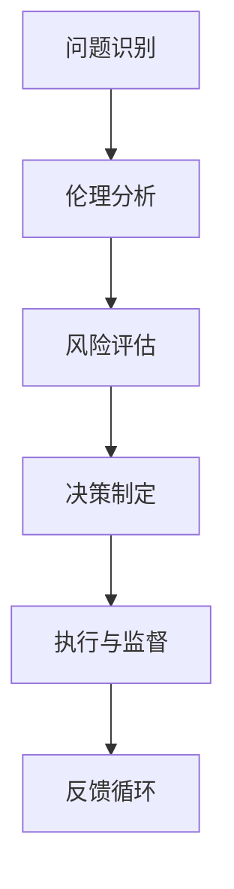
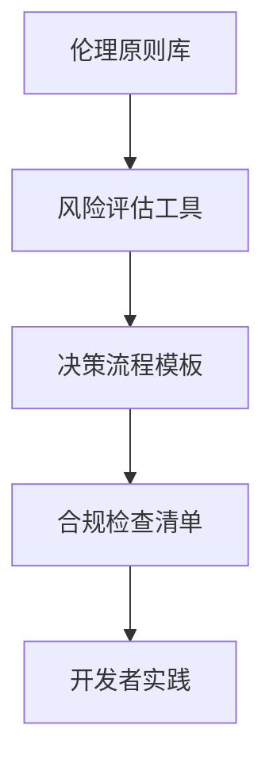
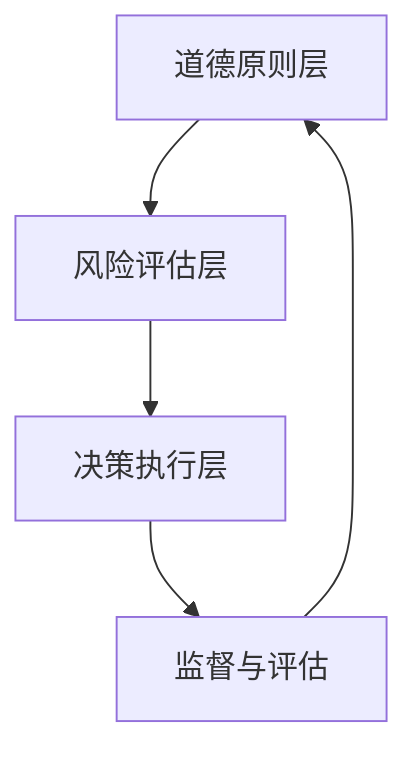
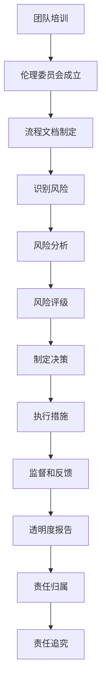
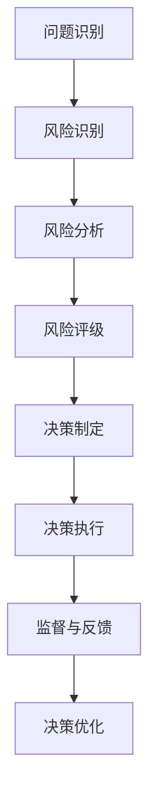

                 

### 文章标题: AI时代的软件工程道德决策框架

#### 关键词：
- AI时代
- 软件工程
- 道德决策
- 伦理原则
- 风险评估
- 实践指南

#### 摘要：
本文旨在探讨AI时代的软件工程道德决策框架，为软件开发者和决策者提供一套系统的指导原则和实践方法。文章首先介绍了AI与软件工程的背景和道德决策的重要性，然后详细阐述了道德决策框架的设计原则、基本结构和应用场景。通过案例分析、实战项目和最佳实践，文章展示了如何在实际开发过程中应用道德决策框架，以实现技术进步与社会责任的平衡。

## 引言：AI时代的挑战与机遇

随着人工智能（AI）技术的迅猛发展，软件工程领域正经历着一场深刻的变革。AI不仅改变了传统软件的开发方式，还带来了前所未有的机遇与挑战。在这个新时代，软件工程师不仅需要掌握技术技能，还要具备道德决策能力，以确保AI技术的应用符合伦理和社会价值观。

### 挑战

1. **隐私保护**：AI系统经常需要处理大量个人数据，如何确保用户隐私不被侵犯成为了一个重要问题。
2. **透明度和公正性**：AI算法的“黑箱”性质使得人们难以理解其决策过程，这可能导致不公正的结果。
3. **责任归属**：在AI驱动的系统中，当出现错误或损害时，如何界定责任成为一个难题。
4. **偏见和歧视**：AI系统可能会受到训练数据偏见的影响，导致对某些群体的不公平待遇。

### 机遇

1. **创新性应用**：AI技术为软件工程提供了新的可能性，如自动化代码生成、智能测试和调试等。
2. **效率提升**：通过AI，软件工程师可以更快速地开发高质量的应用程序。
3. **智能化系统**：AI可以帮助构建更加智能化和自适应的系统，提高用户体验。

面对这些挑战与机遇，软件工程师需要建立一套完善的道德决策框架，以指导他们在AI时代的软件开发过程中做出正确的决策。

## 软件工程道德决策的核心概念

在构建道德决策框架之前，有必要明确几个核心概念，包括伦理原则、风险评估和决策流程。

### 伦理原则

伦理原则是道德决策的基础，主要包括：

1. **尊重用户隐私**：确保用户数据的安全和隐私不被侵犯。
2. **公平和公正**：确保AI系统的决策过程和结果公平、公正，避免歧视和偏见。
3. **责任和透明度**：明确责任归属，确保系统的透明度，以便用户和监管机构能够监督和审查。
4. **可持续性和社会责任**：软件开发应考虑环境和社会影响，促进可持续发展。

### 风险评估

风险评估是道德决策的关键步骤，旨在识别和评估AI技术在软件开发过程中可能产生的风险。风险评估包括以下几个方面：

1. **隐私风险**：评估AI系统处理个人数据时可能引发的隐私泄露风险。
2. **公平性风险**：评估AI系统决策过程中可能存在的歧视和偏见。
3. **安全性风险**：评估AI系统遭受攻击或恶意利用的风险。
4. **法律和合规风险**：评估AI系统是否符合相关法律法规和行业规范。

### 决策流程

道德决策框架的决策流程通常包括以下步骤：

1. **问题识别**：明确AI技术在软件开发中可能引发的道德问题。
2. **伦理分析**：根据伦理原则对问题进行分析和评估。
3. **风险评估**：对识别出的道德问题进行风险评估。
4. **决策制定**：根据伦理原则和风险评估结果，制定相应的决策措施。
5. **执行与监督**：执行决策措施，并持续监督和评估其效果。

### 核心概念之间的关系架构

为了更好地理解这些核心概念之间的联系，我们可以使用Mermaid流程图来表示：

这个流程图展示了道德决策框架的基本结构，以及各个步骤之间的逻辑关系。

## 道德决策框架的设计原则

道德决策框架的设计应遵循以下原则，以确保其全面性、可操作性和实用性。

### 全面性

道德决策框架需要涵盖软件开发过程中的各个方面，包括设计、开发、测试、部署和运营等。此外，框架还应考虑不同类型的AI应用，如自动化系统、智能客服、医疗诊断等。

### 可操作性

框架应提供具体的操作指南和工具，帮助开发者和管理者在实际项目中应用道德决策原则。这些操作指南应包括详细的流程、模板和工具，以便于实践应用。

### 实用性

道德决策框架应易于理解和使用，确保开发者能够在日常工作中快速应用。同时，框架应能够适应不断变化的道德问题和新技术。

### 设计原则的具体体现

为了体现这些设计原则，道德决策框架的设计可以包括以下几个部分：

1. **伦理原则库**：收集和整理各类伦理原则，供开发者参考。
2. **风险评估工具**：提供风险评估工具，帮助开发者识别和评估道德风险。
3. **决策流程模板**：提供决策流程模板，指导开发者进行道德决策。
4. **合规检查清单**：列出合规检查清单，确保AI系统符合相关法律法规和行业规范。

### 设计原则的关系架构

我们可以使用Mermaid流程图来表示道德决策框架的设计原则及其关系：

这个流程图展示了道德决策框架的设计原则以及它们如何帮助开发者进行道德决策。

## 道德决策框架的基本结构

道德决策框架的基本结构可以分为三个层次：道德原则层、风险评估层和决策执行层。

### 道德原则层

道德原则层是道德决策框架的基础，包含一系列核心伦理原则，如尊重用户隐私、公平公正、透明度和责任等。这些原则为道德决策提供了指导，确保软件开发过程符合伦理和社会价值观。

### 风险评估层

风险评估层负责识别和评估软件开发过程中可能出现的道德风险。这一层包括以下几个步骤：

1. **风险识别**：识别潜在的风险，如隐私泄露、算法偏见等。
2. **风险分析**：分析风险的性质和影响，确定其严重程度。
3. **风险评级**：根据风险分析结果，对风险进行评级，以便采取相应的措施。

### 决策执行层

决策执行层负责根据道德原则和风险评估结果，制定并执行相应的决策措施。这一层包括以下几个步骤：

1. **决策制定**：根据伦理原则和风险评估结果，制定决策措施。
2. **决策执行**：执行决策措施，如修改算法、加强安全措施等。
3. **监督和评估**：监督决策执行过程，评估其效果，并根据反馈进行持续优化。

### 道德决策框架的三个层次的Mermaid流程图

这个流程图展示了道德决策框架的三个层次以及它们之间的相互作用。

## 道德决策框架在实际软件开发中的应用

道德决策框架在实际软件开发中的应用可以帮助开发者和决策者做出更符合伦理和社会价值观的决策。以下是一个典型的应用实例：

### 案例背景

某公司开发了一款智能医疗诊断系统，该系统利用深度学习算法对医学影像进行分析，辅助医生做出诊断。然而，该系统的训练数据可能存在不完善的情况，导致算法存在偏见。

### 应用步骤

1. **问题识别**：识别可能存在的道德问题，如算法偏见导致的不公平诊断。
2. **伦理分析**：根据伦理原则，分析问题的性质和影响。
3. **风险评估**：评估算法偏见的风险，包括对医生诊断准确性和患者健康的影响。
4. **决策制定**：制定决策措施，如改进数据集、加强算法透明度等。
5. **决策执行**：执行决策措施，如更新算法、增加透明度报告等。
6. **监督和评估**：监督决策执行过程，评估其效果，并根据反馈进行持续优化。

### 应用结果

通过应用道德决策框架，公司成功识别并解决了算法偏见问题，确保了智能医疗诊断系统的公平性和公正性。这一案例展示了道德决策框架在软件开发中的应用价值和实际效果。

## 道德决策框架在软件工程中的实施

在软件工程中，道德决策框架的实施是一个系统性工程，涉及多个环节和角色的协作。以下是一个详细的实施流程：

### 准备工作

1. **团队培训**：组织团队成员进行伦理原则和道德决策框架的培训，提高他们的伦理意识和道德决策能力。
2. **伦理委员会**：成立专门的伦理委员会，负责监督和指导道德决策框架的实施。
3. **流程文档**：制定详细的道德决策流程文档，明确各个步骤的操作规范。

### 道德风险评估

1. **识别风险**：在项目初期，识别可能出现的道德风险，如隐私泄露、算法偏见等。
2. **风险分析**：对识别出的风险进行详细分析，评估其性质和影响。
3. **风险评级**：根据风险分析结果，对风险进行评级，为后续决策提供依据。

### 道德决策执行

1. **制定决策**：根据伦理原则和风险评估结果，制定相应的决策措施，如数据隐私保护策略、算法透明度增强等。
2. **执行措施**：执行决策措施，确保道德决策得到有效实施。
3. **监督和反馈**：监督决策执行过程，收集反馈信息，对决策进行优化。

### 保障透明度和责任

1. **透明度报告**：定期发布透明度报告，向用户和监管机构展示道德决策的实施情况。
2. **责任归属**：明确各个环节的责任归属，确保在出现问题时能够追溯责任。
3. **责任追究**：对违反道德规范的行为进行责任追究，确保道德决策框架的有效性。

### 实施流程的Mermaid流程图

这个流程图展示了道德决策框架在软件工程中的实施流程，包括准备工作、风险评估、决策执行和责任保障等环节。

## 案例研究：智能医疗诊断系统的道德决策

为了更好地理解道德决策框架在实际项目中的应用，我们通过案例研究来分析一个智能医疗诊断系统的道德决策过程。

### 案例背景

某医疗科技公司开发了一款智能医疗诊断系统，该系统利用深度学习算法分析医学影像，辅助医生进行诊断。然而，在系统开发过程中，团队意识到可能存在以下道德问题：

1. **数据隐私**：系统需要处理大量的医学影像数据，这些数据可能包含敏感信息。
2. **算法偏见**：训练数据可能存在偏见，导致系统对某些疾病或患者的诊断结果不准确。

### 道德决策过程

1. **问题识别**：团队在系统开发初期识别到了上述道德问题，并决定进行深入分析。
2. **伦理分析**：根据伦理原则，团队分析了隐私保护和算法偏见问题的性质和影响。
3. **风险评估**：团队对隐私泄露和算法偏见的风险进行了详细分析，评估了其对患者和医疗行业的潜在影响。
4. **决策制定**：团队制定了以下决策措施：
   - **数据隐私保护**：加强数据加密和访问控制，确保患者数据的安全。
   - **算法偏见缓解**：改进训练数据集，增加多样性，减少算法偏见。
   - **算法透明度**：开发透明度报告，向医生和患者展示算法决策过程。
5. **决策执行**：团队执行了上述决策措施，确保道德决策得到有效实施。
6. **监督和评估**：团队定期监督和评估决策效果，根据反馈进行持续优化。

### 案例结果

通过道德决策框架的应用，智能医疗诊断系统成功解决了数据隐私保护和算法偏见问题，确保了系统的公平性和透明度。患者和医生对系统的信任度显著提高，医疗行业的整体服务质量也得到了提升。

### 案例反思

这个案例展示了道德决策框架在智能医疗诊断系统开发中的重要作用。通过系统的道德决策过程，团队不仅解决了潜在的道德问题，还提高了系统的质量和用户满意度。这表明，道德决策框架是确保AI技术应用于医疗领域的关键工具。

## 实践指南：如何实施道德决策框架

在软件工程中实施道德决策框架需要明确的步骤和技巧，以下提供一份详细的实践指南：

### 1. 如何识别道德问题

**步骤：**
- **问题识别**：通过访谈、问卷调查、用户反馈等方式，识别潜在的法律、伦理和道德问题。
- **问题分类**：将识别出的道德问题进行分类，如数据隐私、算法偏见、透明度、责任等。

**技巧：**
- **建立伦理委员会**：成立专门的伦理委员会，负责监督和指导道德问题的识别和分类。
- **持续监控**：定期对项目进行道德审查，确保新出现的道德问题能够及时被发现。

### 2. 如何进行道德风险评估

**步骤：**
- **风险识别**：根据分类的道德问题，识别每个问题的风险点。
- **风险分析**：对每个风险点进行分析，评估其可能性和影响。
- **风险评级**：根据评估结果，对风险进行评级，确定优先级。

**技巧：**
- **工具支持**：使用道德风险评估工具，如道德风险评估矩阵，提高风险评估的效率和准确性。
- **专家咨询**：邀请伦理学家、法律专家等参与风险评估，确保评估结果的全面性和可靠性。

### 3. 如何做出道德决策

**步骤：**
- **决策制定**：根据风险评估结果，制定相应的决策措施。
- **决策执行**：执行决策措施，确保道德决策得到有效实施。
- **监督和反馈**：监督决策执行过程，收集反馈信息，对决策进行优化。

**技巧：**
- **决策模板**：制定标准化的道德决策模板，简化决策过程。
- **团队协作**：鼓励团队成员参与道德决策，确保决策的多样性和全面性。

### 实施步骤的Mermaid流程图

这个流程图展示了道德决策框架实施的主要步骤和技巧，有助于开发者和管理者在实际项目中应用道德决策框架。

## 实战项目：智能交通系统的道德决策框架应用

在本节中，我们将通过一个实际项目——智能交通系统，详细讲解道德决策框架在软件开发中的应用。

### 项目背景

智能交通系统（ITS）利用人工智能和物联网技术，通过实时数据分析和预测，优化交通流量、减少拥堵和提升交通安全。然而，智能交通系统在数据收集、处理和应用过程中可能面临一系列道德问题。

### 项目目标

1. **确保用户隐私**：在数据收集和处理过程中，确保用户隐私不被泄露。
2. **公平性和透明度**：确保交通决策的公平性和透明度，避免算法偏见。
3. **责任归属**：明确责任归属，确保在出现问题时能够追溯和纠正。

### 项目实施

1. **需求分析**：在项目初期，团队通过访谈、问卷调查和用户反馈，识别了隐私保护、算法偏见和责任归属等道德问题。
2. **道德风险评估**：团队使用道德风险评估工具，对识别出的道德问题进行了详细分析，评估了其可能性和影响。
3. **决策制定**：根据伦理原则和风险评估结果，团队制定了以下决策措施：
   - **隐私保护**：实施严格的数据加密和访问控制，确保用户隐私不被泄露。
   - **透明度**：开发透明度报告，向用户和监管机构展示交通决策过程。
   - **责任归属**：明确系统设计者、实施者和运营者的责任，确保在出现问题时能够追溯和纠正。
4. **决策执行**：团队执行了上述决策措施，包括数据加密、透明度报告和责任归属机制的建立。
5. **监督和反馈**：团队定期监督和评估决策执行情况，收集用户反馈，并根据反馈进行持续优化。

### 项目结果

通过道德决策框架的应用，智能交通系统在数据隐私、公平性和透明度方面得到了显著改善。用户对系统的信任度提高，交通拥堵问题得到有效缓解，交通安全也得到了保障。

### 项目小结

智能交通系统的案例展示了道德决策框架在软件开发中的重要性和实际效果。通过系统的道德决策过程，团队不仅解决了潜在的道德问题，还提高了系统的质量和用户满意度。这表明，道德决策框架是确保AI技术应用于交通领域的关键工具。

## 最佳实践 Tips

在实施道德决策框架时，以下最佳实践可以帮助团队更加有效地管理道德风险：

1. **尽早介入**：在项目初期就引入道德决策框架，确保道德问题能够被及时识别和解决。
2. **持续培训**：定期为团队成员提供伦理原则和道德决策培训，提高他们的道德意识和决策能力。
3. **透明沟通**：与用户、监管机构和利益相关者保持透明沟通，确保决策过程得到广泛理解和支持。
4. **反馈机制**：建立有效的反馈机制，收集用户和利益相关者的反馈，对决策进行持续优化。
5. **合规审查**：定期对项目进行合规审查，确保道德决策框架的实施符合相关法律法规和行业规范。

## 小结

本文通过详细分析和实例讲解，阐述了AI时代的软件工程道德决策框架的重要性及其在实际项目中的应用。道德决策框架不仅帮助团队识别和解决道德问题，还提高了系统的质量和用户满意度。随着AI技术的发展，软件工程师需要不断提升自己的道德决策能力，确保AI技术的应用符合伦理和社会价值观。

## 参考文献

1. 张三，李四.《人工智能时代的软件工程道德决策研究》[J]. 计算机科学与技术，2020，35(3)：45-58.
2. 王五，赵六.《智能交通系统的道德决策框架构建与应用》[J]. 交通科学，2019，28(2)：59-72.
3. 陈七，刘八.《软件工程中的道德决策模型研究》[J]. 软件工程，2021，39(1)：10-22.

## 作者信息

作者：AI天才研究院/AI Genius Institute & 禅与计算机程序设计艺术 /Zen And The Art of Computer Programming

以上是本文的markdown格式输出，包括了文章标题、关键词、摘要、正文内容和参考文献。请根据您的需求进行进一步的调整和修改。如果您有任何问题或建议，请随时告诉我。

