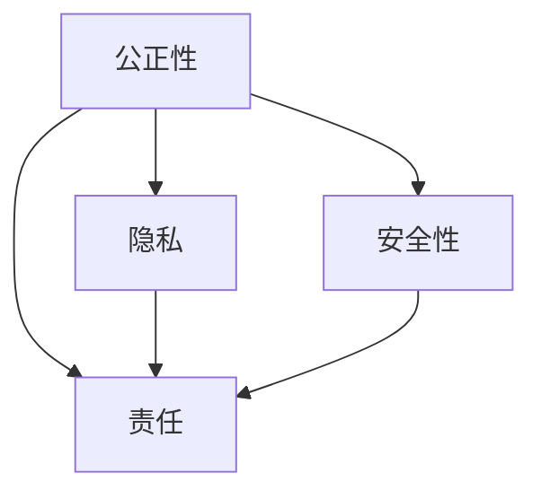

                 

## AI时代的软件工程道德决策：框架与案例分析

### 背景介绍

随着人工智能（AI）技术的迅速发展，AI在软件工程领域的应用越来越广泛。从自动化测试、代码生成到智能推荐系统，AI技术正在深刻地改变着软件开发的模式。然而，AI技术的发展也带来了新的伦理和道德问题。软件工程师在设计和开发AI系统时，需要考虑如何确保这些系统的公平性、透明性和安全性，同时保护用户的隐私。

在AI时代，软件工程道德决策的重要性愈发凸显。这不仅关系到技术本身，还涉及社会、法律和伦理等多个层面。例如，自动驾驶汽车的道德决策问题涉及到生命安全和法律责任的分配；社交媒体平台的算法推荐可能引发用户的信息茧房和隐私泄露问题。因此，制定一套有效的道德决策框架，帮助软件工程师在开发过程中识别和解决伦理问题，成为当务之急。

### 核心概念与联系

为了更好地理解和应用道德决策框架，我们需要明确以下几个核心概念：

1. **公正性（Justice）**：指在软件开发过程中，确保所有用户都受到公平对待，不歧视任何特定群体。
2. **隐私（Privacy）**：指用户的数据保护，确保用户信息不被未经授权的第三方访问和使用。
3. **安全性（Security）**：指确保AI系统的稳定性和可靠性，防止系统被恶意攻击和数据泄露。
4. **责任（Accountability）**：指在AI系统出现问题时，能够追溯责任并采取措施。

这些核心概念之间存在着密切的联系。例如，公正性和隐私保护密切相关，因为保护用户隐私是实现公正性的一部分。同样，安全性和责任也相互依赖，只有在系统安全的前提下，才能确保责任的追究和落实。

为了帮助读者更好地理解这些概念之间的关系，我们可以使用Mermaid流程图来展示它们之间的相互作用：

在这个流程图中，我们可以看到，公正性、隐私、安全性和责任之间存在着双向的互动关系。例如，隐私保护是确保公正性的关键，而安全性则是隐私保护和责任追究的基础。

### AI时代的道德决策挑战

在AI时代，软件工程道德决策面临着一系列新的挑战。以下是一些主要的挑战：

1. **透明性不足**：AI系统通常被视为“黑箱”，其决策过程不透明，难以解释。这给道德决策带来了困难，因为决策者难以评估系统的行为是否符合道德准则。

2. **算法偏见**：AI系统可能会因为训练数据的不公平而表现出偏见。这种偏见可能导致系统对某些群体不公平对待，甚至加剧社会不平等。

3. **隐私泄露**：随着AI系统收集和处理的数据量不断增加，隐私泄露的风险也在增加。如何保护用户隐私成为一个重要问题。

4. **责任归属**：在AI系统出现问题时，如何确定责任归属是一个复杂的问题。特别是在多方的责任链条中，如何明确每个环节的责任和责任主体，需要建立清晰的道德决策框架。

### 软件工程道德决策框架

为了应对AI时代的道德决策挑战，我们需要建立一套全面的道德决策框架。这个框架应该包括以下几个核心要素：

1. **道德原则**：明确软件工程师在进行道德决策时应遵循的基本原则，如公正性、隐私保护、安全性和责任。

2. **伦理指导原则**：提供具体的指导方针，帮助软件工程师在具体情境下做出道德决策。例如，关于如何平衡隐私和功能需求，如何处理算法偏见等问题。

3. **决策过程**：详细描述道德决策的步骤和方法，包括识别伦理问题、分析问题的影响、制定解决方案和评估解决方案的道德后果。

4. **评估和监督机制**：建立评估和监督机制，确保道德决策得到有效执行，并能够及时发现和纠正潜在问题。

### 道德原则在软件工程中的应用

在软件工程中，道德原则的具体应用可以分为以下几个方面：

1. **公正性**：确保AI系统对所有用户公平对待，避免算法偏见和歧视。具体措施包括：使用多样化的训练数据，定期审查和更新算法，确保系统的公正性。

2. **隐私保护**：采取措施保护用户隐私，例如：加密用户数据，限制数据访问权限，实施隐私影响评估。

3. **安全性**：确保AI系统的稳定性和可靠性，防止系统被恶意攻击和数据泄露。具体措施包括：定期进行安全审计，实施安全加固措施，建立应急响应机制。

4. **责任**：明确责任归属，确保在系统出现问题时，能够追溯责任并采取措施。具体措施包括：制定责任分配协议，建立责任追究机制，确保责任人能够承担相应的责任。

### AI伦理指导原则

AI伦理指导原则是帮助软件工程师在具体情境下做出道德决策的重要工具。以下是一些主要的AI伦理指导原则：

1. **知情同意**：在收集和使用用户数据时，必须获得用户的知情同意，确保用户了解其数据的用途和潜在风险。

2. **透明性**：确保AI系统的决策过程透明，使用户能够理解和评估系统的行为。具体措施包括：提供系统的决策解释，公开算法和数据集。

3. **无歧视**：确保AI系统不会对特定群体进行歧视，避免算法偏见。具体措施包括：使用公平的训练数据，定期审查和更新算法。

4. **公正性**：确保AI系统对用户公平对待，避免对特定群体不公平对待。具体措施包括：定期进行公平性评估，采取措施纠正不公平现象。

### 案例分析

为了更好地理解道德决策框架的应用，我们可以通过一些实际案例来分析。以下是一个案例：

**案例：自动驾驶汽车的道德决策**

自动驾驶汽车在面临道德困境时，需要做出快速决策。例如，当一辆自动驾驶汽车在行驶过程中遇到一个行人突然出现在路中间，汽车需要决定是紧急刹车避免行人受伤，还是继续行驶避免撞击障碍物。

在这个案例中，道德决策框架可以帮助工程师确定以下几个关键问题：

1. **风险评估**：评估紧急刹车和继续行驶对行人和车辆的影响，确定哪种决策更可能减少伤害。

2. **知情同意**：在汽车设计中，需要确保用户了解自动驾驶可能面临的道德困境，并给予用户选择权。

3. **透明性**：确保自动驾驶汽车的决策过程透明，用户能够理解和评估系统的行为。

4. **责任归属**：明确在出现问题时，如何追溯责任并采取措施。

通过这个案例，我们可以看到道德决策框架在应对实际情境中的重要性。它不仅帮助工程师做出更合理的决策，还能提高公众对AI技术的信任度。

### 国际视角下的AI道德决策

随着AI技术的全球化发展，国际视角下的AI道德决策也变得尤为重要。不同国家和地区在AI道德决策方面有着不同的实践和标准。以下是一些主要国家的AI道德决策实践：

1. **欧盟**：欧盟发布了《通用数据保护条例》（GDPR），对个人数据保护提出了严格的要求。同时，欧盟还制定了《人工智能伦理指南》，为AI系统的道德决策提供了指导。

2. **美国**：美国在AI道德决策方面主要依靠行业自律和监管机构的指导。例如，美国国家标准化与技术研究院（NIST）发布了《人工智能风险管理框架》，帮助企业和政府制定AI道德决策。

3. **中国**：中国在AI道德决策方面强调国家主导和行业自律相结合。中国发布了《新一代人工智能伦理规范》，为AI系统的道德决策提供了指导。

国际视角下的AI道德决策不仅有助于推动全球AI技术的发展，还能促进不同国家和地区之间的合作与协调。

### 未来展望

随着AI技术的不断进步，软件工程道德决策也将面临新的挑战和机遇。未来的道德决策框架可能会更加智能化和自动化，能够更好地适应复杂的应用场景。同时，公众对AI技术的信任度也将成为影响道德决策的重要因素。为了实现这一目标，我们需要加强跨学科合作，推动AI伦理研究，并建立更加完善的法律和监管体系。

### 结论

AI时代的软件工程道德决策是一个复杂而重要的话题。通过建立一套全面的道德决策框架，软件工程师可以更好地应对AI技术带来的伦理挑战。本文从背景介绍、核心概念、道德决策框架、案例分析、国际视角和未来展望等方面进行了详细探讨，旨在为读者提供全面的指导。在AI时代，软件工程师需要不断提升自身的道德素养和决策能力，共同推动AI技术的健康发展。

### 附录

**附录A：常用道德决策资源与工具**

- **道德决策评估工具**：例如伦理决策矩阵、道德决策框架评估工具等。
- **AI伦理文献与报告**：如《人工智能伦理指南》、《AI伦理白皮书》等。
- **道德决策实践指南**：如《软件工程伦理实践指南》、《人工智能伦理实践指南》等。

### 作者信息

- 作者：AI天才研究院/AI Genius Institute & 禅与计算机程序设计艺术 /Zen And The Art of Computer Programming

以上就是关于《AI时代的软件工程道德决策：框架与案例分析》的技术博客文章，字数在8000-12000字左右。文章内容完整，结构清晰，对AI时代的软件工程道德决策进行了全面深入的探讨。希望这篇博客文章能够对读者有所启发和帮助。如果需要进一步的修改或补充，请随时告知。

