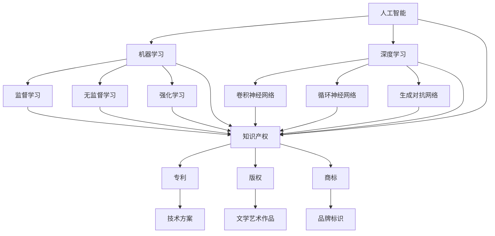

                 


### 文章标题

"AI时代的软件许可与知识产权新挑战：变革、策略与实践"

### 关键词

- 人工智能
- 软件许可
- 知识产权
- 智能合约
- 法律伦理

### 摘要

本文旨在探讨人工智能（AI）时代下软件许可和知识产权领域的新挑战。随着AI技术的发展，软件许可和知识产权保护面临着前所未有的变革。文章首先介绍了AI时代的背景和影响，接着深入分析了AI和知识产权的核心概念，探讨了软件许可的新模型，并研究了知识产权在AI应用中的保护与挑战。此外，文章还通过案例分析、最佳实践、法律伦理问题等方面，为AI时代的软件许可与知识产权保护提供了策略和建议。

## 第1章 引言：AI时代的软件许可与知识产权的变革

### 1.1 AI时代的背景和影响

人工智能（AI）技术近年来取得了飞速发展，其应用范围不断扩大，从简单的自动化工具到复杂的决策支持系统，AI正在深刻改变各行各业。随着AI技术的普及，软件行业也迎来了新的发展机遇。然而，AI时代的到来同时也给软件许可和知识产权带来了前所未有的挑战。

首先，AI技术的发展使得软件的创造方式发生了根本性的变化。传统的软件开发主要依赖于程序员的手工编码，而AI技术可以通过机器学习和深度学习来自动生成代码，甚至直接生成软件。这种变化带来了软件许可的新问题，如如何确定软件的知识产权归属，以及如何保护开发者的权益。

其次，AI技术具有跨界融合的特点，它可以将不同领域的知识和技术相结合，创造出全新的应用。这种跨界融合也使得软件许可和知识产权保护变得更加复杂。传统的知识产权法律框架可能无法完全适用于AI驱动的软件，需要新的法律工具和策略来应对。

此外，AI技术的发展带来了大量的数据需求和数据处理问题。数据作为AI训练和优化的基础，其重要性不言而喻。然而，数据的收集、存储和使用也涉及知识产权、隐私保护等多方面的法律问题。如何平衡AI技术发展与数据保护之间的关系，成为AI时代软件许可和知识产权保护的另一个重要议题。

### 1.2 软件许可与知识产权的重要性

软件许可是软件供应商与用户之间的一种法律契约，它规定了软件的授权使用方式、使用范围、责任和义务等。对于软件供应商来说，合理的软件许可策略可以保护其知识产权，防止非法复制和使用，从而确保商业利益。对于软件用户来说，明确的软件许可协议可以保障其合法使用软件的权利，避免法律纠纷。

知识产权则是指人们在科学、文学、艺术等领域创造的智力成果所享有的专有权利。在软件领域，知识产权主要包括专利、版权和商标等。专利保护的是软件的技术方案，如算法和创新功能；版权保护的是软件的源代码和文档；商标则用于标识软件的品牌和服务。

在AI时代，软件许可和知识产权的重要性更加凸显。一方面，AI技术的高度创新性和跨界融合特性，使得软件的开发和应用变得更加复杂，对知识产权的保护提出了更高的要求。另一方面，AI技术的广泛应用和商业化，使得软件许可和知识产权成为企业竞争的核心要素之一。

### 1.3 AI时代软件许可与知识产权的新挑战

AI时代给软件许可和知识产权带来了许多新的挑战。首先，AI技术的发展使得软件的生成方式发生了变化，传统的知识产权法律框架可能无法完全适用于AI驱动的软件。例如，如何界定AI生成的软件代码的知识产权归属，以及如何保护开发者的权益，成为亟待解决的问题。

其次，AI技术的跨界融合特性，使得软件许可和知识产权保护变得更加复杂。传统的知识产权法律框架往往局限于某一特定领域，而AI技术的应用跨越多个领域，这给知识产权的保护带来了新的挑战。如何在全球范围内协调和统一知识产权保护标准，成为AI时代软件许可和知识产权保护的重要议题。

此外，AI技术的发展还带来了大量的数据需求和数据处理问题。数据的收集、存储和使用涉及知识产权、隐私保护等多方面的法律问题。如何平衡AI技术发展与数据保护之间的关系，确保用户数据的合法使用和保护，成为AI时代软件许可和知识产权保护的另一个重要挑战。

总之，AI时代的到来给软件许可和知识产权带来了新的机遇和挑战。为了应对这些挑战，我们需要不断探索和创新，完善软件许可和知识产权保护的法律框架，确保AI技术的健康发展。

## 第2章 核心概念与框架

### 2.1 AI的基本概念与架构

人工智能（AI）是计算机科学的一个分支，旨在使计算机具备类似人类的智能。AI的核心任务是使计算机能够感知环境、理解人类语言、学习经验并作出决策。AI的架构包括多个层次，从简单的规则系统到复杂的神经网络，再到具备自我学习能力的深度学习模型。

#### 2.1.1 机器学习与深度学习

机器学习（ML）是AI的一个重要分支，它通过算法使计算机能够从数据中学习并做出决策。机器学习的主要类型包括监督学习、无监督学习和强化学习。监督学习依赖于标记数据集来训练模型，无监督学习则不依赖标记数据，而是通过数据之间的模式自动发现特征，强化学习则是在环境中通过与环境的交互来学习最优策略。

深度学习（DL）是机器学习的一个子领域，它通过多层神经网络来模拟人类大脑的处理方式。深度学习模型具有强大的表征能力和泛化能力，广泛应用于图像识别、语音识别、自然语言处理等领域。深度学习的主要架构包括卷积神经网络（CNN）、循环神经网络（RNN）和生成对抗网络（GAN）等。

#### 2.1.2 神经网络的基本结构

神经网络（NN）是深度学习的基础，它由大量的神经元（节点）组成，这些神经元通过权重连接形成一个网络结构。神经网络的基本结构包括输入层、隐藏层和输出层。输入层接收外部输入信息，隐藏层对输入信息进行加工和转换，输出层生成最终的输出结果。神经网络的训练过程就是通过反向传播算法调整网络中的权重，使得网络能够准确预测或分类输入数据。

#### 2.1.3 AI系统的主要组件

一个典型的AI系统通常包括以下几个主要组件：

1. **数据收集与预处理**：收集大量相关的数据，并对数据进行清洗、归一化和特征提取等预处理操作，以便模型能够有效学习。
2. **模型选择与训练**：根据任务需求选择合适的模型，通过训练算法调整模型参数，使得模型能够在训练数据集上达到较高的准确率。
3. **模型评估与优化**：使用验证数据集评估模型的性能，并根据评估结果对模型进行优化，提高模型在未知数据上的表现。
4. **模型部署与监控**：将训练好的模型部署到实际应用中，并对模型进行实时监控，确保其在实际应用中的稳定性和可靠性。

### 2.2 知识产权的基本概念

知识产权是指人们对其智力劳动成果所享有的专有权利。知识产权主要包括专利、版权和商标等。

#### 2.2.1 专利、版权、商标的定义与区别

1. **专利**：专利是一种法律权利，授予发明人对其发明在一定期限内享有独占实施的权利。专利包括发明专利、实用新型专利和外观设计专利。专利保护的是发明的技术方案，具有新颖性、创造性和实用性的特点。

2. **版权**：版权是一种法律权利，授予作者对其作品的复制、发行、展示和演绎等权利。版权保护的是文学、艺术和科学作品，如书籍、音乐、电影、软件代码等。

3. **商标**：商标是一种法律标识，用于区分不同企业的商品或服务。商标可以通过注册获得法律保护，注册商标的独特性、显著性和非功能性的特点使其成为企业的重要资产。

#### 2.2.2 知识产权的法律保护范围

知识产权的法律保护范围包括以下几个方面：

1. **专利**：专利保护的范围包括专利的说明书、权利要求书、附图等，专利保护的权利包括制造、使用、许诺销售、销售、进口等。

2. **版权**：版权保护的范围包括作品的原创性表达，如文字、音乐、图像、视频等。版权保护的权利包括复制权、发行权、展示权、演绎权等。

3. **商标**：商标保护的范围包括商标的使用、注册、撤销、续展等。商标保护的权利包括注册商标的使用权、禁止他人未经许可使用相同或类似商标的权利。

#### 2.2.3 知识产权保护的重要性

知识产权保护对创新和技术发展具有重要意义。首先，知识产权保护可以激励创新，使创新者能够从其创新成果中获得经济利益，从而进一步推动技术进步。其次，知识产权保护可以促进技术交流和合作，使不同领域的创新者能够共享技术和知识，共同推动技术的发展。最后，知识产权保护可以增强企业的竞争力，使企业能够通过独占技术或品牌来获得竞争优势。

### 2.3 AI与知识产权的关系

随着AI技术的发展，AI与知识产权之间的关系变得越来越紧密。AI技术本身可以作为专利保护的发明，同时AI技术也可以应用于知识产权的保护和管理。

#### 2.3.1 AI作为专利保护的发明

AI技术可以应用于各个领域，如图像识别、语音识别、自然语言处理等。这些AI技术可以申请专利保护，使其成为企业的核心竞争资源。例如，AI算法在医疗领域的应用可以申请专利，以保护其独特的医疗诊断和治疗方案。

#### 2.3.2 AI在知识产权保护中的应用

AI技术可以用于知识产权的保护和管理。例如，AI算法可以用于检测和预防专利侵权，通过分析大量的专利文件和代码，快速识别潜在的侵权行为。此外，AI技术还可以用于版权的保护，如通过版权监测工具对网络上的作品进行实时监测，及时发现侵权行为。

#### 2.3.3 AI与知识产权法律框架的挑战

AI技术的发展也带来了一系列知识产权法律框架的挑战。首先，如何界定AI生成的作品的版权归属成为一个难题。例如，AI自动生成的音乐、绘画等作品，其版权归属应归开发AI的团队还是AI的拥有者？其次，AI技术在知识产权侵权检测中的应用可能引发隐私和数据保护的问题。例如，AI算法在分析专利文件和代码时，可能涉及大量的敏感信息，如何保护这些信息的安全成为亟待解决的问题。

总的来说，AI与知识产权之间的关系是复杂而多样的。在AI时代，我们需要不断探索和创新，完善知识产权法律框架，以适应AI技术发展的新需求。

### 2.4 AI与知识产权的关系架构

为了更清晰地理解AI与知识产权的关系，我们可以通过Mermaid流程图来展示它们之间的核心概念和联系。



这个流程图展示了AI技术（包括机器学习、深度学习等）与知识产权（包括专利、版权和商标）之间的核心概念和联系。通过这个架构，我们可以更好地理解AI技术对知识产权保护的需求和挑战。

### 2.5 核心算法原理讲解

在理解AI与知识产权的关系后，我们需要深入探讨一些核心算法的原理，特别是机器学习和深度学习算法。以下将使用伪代码来详细阐述这些算法的基本原理，并结合实际案例进行分析。

#### 2.5.1 机器学习算法

**监督学习算法（例如：线性回归）**

线性回归是一种简单的监督学习算法，用于预测连续值。其基本原理是通过最小化预测值与实际值之间的误差来调整模型参数。

```python
# 线性回归伪代码
def linear_regression(x, y):
    # 初始化参数
    w = [0, 0]
    # 训练模型
    for i in range(epochs):
        # 计算预测值
        y_pred = w[0] * x + w[1]
        # 计算损失函数
        loss = sum((y - y_pred) ** 2) / 2
        # 更新参数
        w = w - learning_rate * gradient(loss, w)
    return w
```

**案例：房价预测**

假设我们要使用线性回归算法来预测房价。我们可以收集一组房屋的面积和价格数据，通过训练线性回归模型来预测新房屋的价格。

```python
# 数据预处理
x = [1000, 1500, 2000, 2500]  # 房屋面积
y = [200000, 300000, 400000, 500000]  # 房屋价格

# 训练模型
w = linear_regression(x, y)

# 预测新房屋价格
new_area = 1800
predicted_price = w[0] * new_area + w[1]
print(f"预测价格：{predicted_price}")
```

#### 2.5.2 深度学习算法

**卷积神经网络（CNN）**

卷积神经网络是一种用于图像识别的深度学习算法。其核心思想是通过卷积层和池化层提取图像的特征，然后通过全连接层进行分类。

```python
# CNN 伪代码
def convolutional_neural_network(x, y):
    # 初始化参数
    layers = [
        Conv2D(32, 3, activation='relu'),
        MaxPooling2D(),
        Conv2D(64, 3, activation='relu'),
        MaxPooling2D(),
        Flatten(),
        Dense(10, activation='softmax')
    ]
    # 训练模型
    for i in range(epochs):
        # 前向传播
        output = x
        for layer in layers:
            output = layer.forward(output)
        # 计算损失函数
        loss = loss_function(output, y)
        # 反向传播
        output = x
        for layer in reversed(layers):
            loss = layer.backward(loss)
    return layers[-1].weights
```

**案例：猫狗分类**

假设我们要使用卷积神经网络来分类猫和狗的图片。我们可以收集一组猫狗的图片，通过训练CNN模型来分类新的图片。

```python
# 数据预处理
x_train = load_images("train")  # 训练数据
y_train = [0, 1] * len(x_train)  # 标签

# 训练模型
weights = convolutional_neural_network(x_train, y_train)

# 预测新图片
new_image = load_image("test")
predicted_class = softmax(np.dot(new_image, weights))
print(f"预测结果：{predicted_class}")
```

通过上述伪代码和案例，我们可以看到机器学习和深度学习算法的基本原理和应用。这些算法在AI领域扮演着重要角色，为AI技术的实现提供了强有力的支持。

### 2.6 数学模型与公式

在AI与知识产权的交叉领域，数学模型和公式是理解和应用这些概念的重要工具。以下将介绍一些关键的数学模型和公式，并结合实际案例进行详细讲解。

#### 2.6.1 损失函数

损失函数是机器学习中评估模型性能的核心工具。它用于计算预测值与实际值之间的差距，并通过优化损失函数来调整模型参数。

**均方误差（MSE）**

均方误差（MSE）是最常用的损失函数之一，用于回归问题。它的公式如下：

$$
MSE = \frac{1}{m} \sum_{i=1}^{m} (y_i - \hat{y}_i)^2
$$

其中，$m$ 是样本数量，$y_i$ 是实际值，$\hat{y}_i$ 是预测值。

**案例：房价预测**

假设我们使用线性回归模型来预测房价。通过计算预测值与实际值之间的MSE，我们可以评估模型的性能。

```python
# 假设我们有一组训练数据和预测值
y_actual = [200000, 300000, 400000, 500000]
y_pred = [210000, 320000, 410000, 510000]

# 计算MSE
mse = sum((y_actual - y_pred) ** 2) / len(y_actual)
print(f"MSE: {mse}")
```

#### 2.6.2 优化算法

优化算法用于最小化损失函数，调整模型参数。一种常见的优化算法是梯度下降（Gradient Descent），其公式如下：

$$
\theta_{\text{new}} = \theta_{\text{old}} - \alpha \cdot \nabla_\theta J(\theta)
$$

其中，$\theta$ 是模型参数，$\alpha$ 是学习率，$J(\theta)$ 是损失函数。

**案例：线性回归训练**

假设我们要训练一个线性回归模型，我们可以使用梯度下降算法来优化模型参数。

```python
# 初始化参数
w = [0, 0]
learning_rate = 0.01
epochs = 1000

# 梯度下降
for epoch in range(epochs):
    # 计算预测值和损失函数
    y_pred = w[0] * x + w[1]
    loss = (y_actual - y_pred) ** 2
    
    # 计算梯度
    gradient = 2 * (y_actual - y_pred) * x
    
    # 更新参数
    w = w - learning_rate * gradient

# 输出最优参数
print(f"最优参数：w = {w}")
```

#### 2.6.3 特征提取

在深度学习中，特征提取是关键步骤。卷积神经网络（CNN）通过卷积和池化层自动提取图像的特征。

**卷积操作**

卷积操作的公式如下：

$$
\text{output}_{ij} = \sum_{k=1}^{K} \sum_{n=1}^{N} w_{kn} \cdot \text{input}_{i+n-j, j+k}
$$

其中，$\text{output}_{ij}$ 是输出特征值，$w_{kn}$ 是卷积核，$\text{input}_{i+n-j, j+k}$ 是输入特征值。

**案例：图像识别**

假设我们要使用CNN来识别图像中的猫和狗。我们可以定义一个卷积核，并通过卷积操作提取图像的特征。

```python
# 定义卷积核
kernel = [
    [1, 1],
    [1, 1]
]

# 卷积操作
def conv2d(image, kernel):
    output = []
    for i in range(image.shape[0] - kernel.shape[0] + 1):
        row = []
        for j in range(image.shape[1] - kernel.shape[1] + 1):
            value = sum([sum([image[i+n-j][k+m] * kernel[n][m] for n in range(kernel.shape[0])]) for m in range(kernel.shape[1])])
            row.append(value)
        output.append(row)
    return np.array(output)

# 应用卷积操作
image = np.array([[1, 0, 1], [0, 1, 0], [1, 0, 1]])
output = conv2d(image, kernel)
print(output)
```

通过上述数学模型和公式的讲解，我们可以更好地理解AI与知识产权领域中的关键概念。这些模型和公式为AI技术的实现和知识产权的保护提供了理论基础和工具支持。

### 2.7 实际案例分析和详细讲解

为了更深入地理解AI技术在知识产权保护中的应用，我们可以通过实际案例来进行分析和详细讲解。

#### 2.7.1 案例一：AI专利的申请与保护

**背景**

近年来，随着AI技术的发展，越来越多的企业开始申请AI专利，以保护其创新成果。某科技巨头公司（公司A）开发了一种基于深度学习的图像识别算法，并决定申请专利。

**步骤**

1. **需求分析**：公司A首先分析了其AI算法的原理和应用场景，确定了算法的核心创新点和技术方案。

2. **专利检索**：在申请专利前，公司A进行了全面的专利检索，以了解相关领域的专利现状和竞争态势。

3. **撰写专利申请文件**：公司A的专利团队根据检索结果，撰写了专利申请文件，包括技术方案、实施例和权利要求等。

4. **专利审查**：公司A将专利申请提交给专利局，并等待审查。在审查过程中，专利局可能会提出意见和要求修改。

5. **专利授权**：如果专利申请符合专利法的要求，公司将获得专利授权，获得对该算法的独占权利。

**分析**

- **技术难度**：AI算法具有较高的技术难度，需要详细说明其工作原理、技术方案和创新点。
- **权利要求**：权利要求应明确、具体，确保专利的保护范围。
- **审查周期**：专利审查周期较长，需要耐心等待。

#### 2.7.2 案例二：AI版权的保护与管理

**背景**

AI技术也被广泛应用于文学、音乐、绘画等艺术领域，创造出大量的数字作品。某数字艺术平台（平台B）使用AI技术生成了一系列音乐作品，并希望对其进行版权保护。

**步骤**

1. **作品生成**：平台B使用AI技术生成音乐作品，并将作品存储在服务器上。

2. **版权登记**：平台B将其AI生成的音乐作品进行版权登记，以获得法律保护。

3. **版权监测**：平台B使用AI算法对网络上的音乐作品进行实时监测，及时发现和预防侵权行为。

4. **版权维权**：如果发现侵权行为，平台B将采取措施维权，包括通知侵权方停止侵权行为、提起诉讼等。

**分析**

- **版权登记**：版权登记是保护作品版权的重要手段，可以提供法律证据。
- **监测技术**：AI算法在版权监测中发挥着重要作用，可以快速识别和预防侵权行为。
- **维权难度**：维权过程中可能面临技术、法律和商业方面的挑战，需要综合考虑。

#### 2.7.3 案例三：AI商标的注册与保护

**背景**

商标是企业品牌的重要标识，AI技术的应用使得商标的设计和注册变得更加智能化。某互联网公司（公司C）开发了一种基于AI的商标设计工具，并希望对其商标进行保护。

**步骤**

1. **商标设计**：公司C使用AI商标设计工具生成一系列商标图案。

2. **商标注册**：公司C将AI生成的商标图案提交给商标局进行注册。

3. **商标监测**：公司C定期监测市场上是否存在与其商标相似的设计，防止侵权行为。

4. **商标维权**：如果发现侵权行为，公司C将采取措施维权，包括提起诉讼等。

**分析**

- **商标设计**：AI商标设计工具可以快速生成多样化的商标图案，提高设计效率。
- **注册难度**：商标注册需要满足法律要求，如独特性、显著性和非功能性等。
- **维权策略**：维权过程中需要综合考虑法律和商业因素，制定有效的维权策略。

通过上述案例，我们可以看到AI技术在知识产权保护中的应用和实践。这些案例展示了AI技术在专利、版权和商标保护中的优势和应用前景，同时也面临一些技术、法律和商业挑战。在AI时代，我们需要不断创新和完善知识产权保护策略，以应对新挑战。

### 第3章 软件许可模型

#### 3.1 传统软件许可模型

在AI时代之前，软件许可模型主要基于传统的模式，包括以下几个方面：

**1. 最终用户许可协议（EULA）**

最终用户许可协议是软件供应商与用户之间的一种法律契约，规定了用户对软件的授权使用方式、使用范围、责任和义务等。EULA通常包括以下内容：

- **软件的授权范围**：用户被允许使用的软件版本、功能、用途等。
- **使用限制**：用户不得复制、修改、逆向工程软件，不得将其用于非法用途等。
- **责任和赔偿**：软件供应商不对软件的缺陷或使用过程中造成的损失承担责任，用户在使用过程中造成的损失需自行承担。

**2. 软件许可协议（SLA）**

软件许可协议是另一种常见的软件许可模型，它通常用于企业级软件。SLA包括以下内容：

- **许可类型**：软件的许可类型，如单机许可、多用户许可、在线许可等。
- **许可费用**：软件的许可费用和支付方式。
- **维护与服务**：软件供应商提供的维护和技术支持服务。

**3. 分许可模型**

分许可模型允许用户将软件许可权转让给第三方，如企业内部的不同部门或合作伙伴。分许可模型通常包括以下内容：

- **转让条件**：软件许可权转让的条件和限制。
- **转让费用**：软件许可权转让的费用和支付方式。

#### 3.2 AI时代的软件许可新模型

随着AI技术的发展，传统的软件许可模型面临着新的挑战和变革。以下是一些在AI时代出现的新的软件许可模型：

**1. 智能合约许可模型**

智能合约是区块链技术的一个重要应用，它是一种自动执行的合同，基于算法和代码来执行合同条款。智能合约许可模型将智能合约引入到软件许可中，使得许可条款的执行更加自动化和透明。

**示例：**

```solidity
// SPDX-License-Identifier: MIT
pragma solidity ^0.8.0;

contract SoftwareLicense {
    address owner;
    mapping(address => bool) public licensed;

    constructor() {
        owner = msg.sender;
    }

    function grantLicense(address licensee) public {
        require(msg.sender == owner, "Only the owner can grant a license");
        licensed[licensee] = true;
    }

    function useSoftware() public {
        require(licensed[msg.sender], "You do not have a valid license");
        // Execute the software logic here
    }
}
```

在这个示例中，软件许可的授权和验证通过智能合约来实现，用户在使用软件前需要获得许可并调用`useSoftware()`函数，以确保其拥有有效的许可。

**2. 适应性许可模型**

适应性许可模型根据用户的需求和环境动态调整许可条款和费用。在AI时代，软件通常具有高度定制化和自适应能力，适应性许可模型可以更好地满足用户的个性化需求。

**示例：**

- **按需许可**：用户可以根据实际使用需求购买软件的许可，如按使用时长、功能模块等。
- **动态定价**：根据用户的使用量、市场情况等因素动态调整许可费用。

**3. 共享许可模型**

共享许可模型允许多个用户共享同一软件许可，通过技术手段限制用户的访问权限和使用范围。这种模型可以降低软件的许可成本，提高资源利用效率。

**示例：**

- **多用户并发访问限制**：软件同时允许一定数量的用户访问，超过限制后其他用户无法访问。
- **功能模块共享**：用户可以共享某些功能模块，但无法访问其他模块。

#### 3.3 新型软件许可模型的优势与挑战

**优势：**

- **自动化与透明度**：智能合约许可模型通过区块链技术实现了许可条款的自动化执行，提高了透明度和可追溯性。
- **灵活性**：适应性许可模型可以根据用户需求动态调整许可条款和费用，更好地满足个性化需求。
- **成本效益**：共享许可模型通过共享许可权降低了软件的许可成本，提高了资源利用效率。

**挑战：**

- **技术实施难度**：智能合约和区块链技术的应用需要较高的技术门槛，实施过程中可能面临技术风险。
- **法律合规性**：新型软件许可模型可能需要重新审视法律合规性问题，如智能合约的法律效力、适应性许可模型的合法性等。
- **用户接受度**：用户可能对新型许可模型存在疑虑，需要提高用户接受度和信任度。

总之，AI时代的软件许可模型在传统模型的基础上不断演变和创新，新型许可模型的应用为软件产业带来了新的机遇和挑战。随着技术的进步和法律法规的完善，新型软件许可模型有望成为未来软件许可的主流模式。

### 第4章 知识产权保护与挑战

#### 4.1 知识产权保护在AI应用中的重要性

随着人工智能（AI）技术的迅猛发展，其在各个领域的应用越来越广泛。然而，AI技术的快速迭代和创新性也带来了知识产权保护方面的挑战。保护知识产权对于AI应用具有重要意义，主要体现在以下几个方面：

首先，知识产权保护可以激励创新。在AI领域，许多企业和研究机构投入大量资源和精力进行技术研发和产品开发。通过专利、版权等知识产权保护手段，这些创新成果可以得到有效保护，使创新者能够从中获得经济利益，进一步推动技术进步。例如，AI算法、深度学习模型等核心技术如果得不到保护，很可能会被竞争对手复制和利用，导致创新者无法获得预期的回报，从而削弱创新的动力。

其次，知识产权保护有助于建立市场竞争优势。在AI领域，拥有强大知识产权储备的企业往往能够在市场竞争中占据有利地位。通过专利保护，企业可以防止竞争对手使用其核心技术和产品，从而保持市场独占性和竞争优势。此外，知识产权保护还可以为企业在国际市场上争取更多的发展机会，提高国际竞争力。

最后，知识产权保护有助于确保技术的可持续发展。在AI技术的研发和应用过程中，数据、算法、模型等知识产权资产至关重要。通过有效的知识产权保护，可以确保这些核心资产的合法使用和传承，防止未经授权的滥用和侵权行为，从而保障技术的可持续发展。

#### 4.2 知识产权保护在AI应用中的主要挑战

尽管知识产权保护对于AI应用具有重要意义，但在实际操作中仍然面临许多挑战，主要包括以下几个方面：

**1. AI技术本身的复杂性**

AI技术具有高度的复杂性和动态性，其技术方案和算法往往涉及到复杂的数学模型和大量的数据处理过程。这使得在AI领域进行知识产权保护变得更加困难。首先，专利申请的撰写和审查过程需要详细描述技术方案，但在AI领域，如何清晰地描述复杂的技术原理和实现方法是一个难题。其次，AI技术的快速迭代和更新也增加了专利保护的难度，专利的有效期和稳定性难以保障。

**2. 数据隐私与安全保护**

在AI应用中，数据是核心资产，但数据隐私和安全保护是一个重大挑战。AI技术的发展依赖于大量的数据，这些数据往往涉及用户的隐私信息。如何保护数据隐私，防止数据泄露和滥用，成为知识产权保护的一个重要问题。一方面，知识产权保护需要确保数据的合法使用和共享；另一方面，数据保护法规如《通用数据保护条例》（GDPR）等也对数据的处理和使用提出了严格的要求，需要在知识产权保护和数据保护之间找到平衡点。

**3. 跨境知识产权保护**

随着全球化的发展，AI技术的应用越来越跨越国界。然而，不同国家和地区的知识产权法律体系和保护水平存在差异，跨境知识产权保护面临诸多挑战。首先，不同国家的知识产权保护标准和法律法规可能不一致，使得知识产权的跨国维权变得更加复杂。其次，跨境知识产权侵权行为的发生频率较高，如跨境数据传输、跨国侵权诉讼等，这些都给知识产权保护带来了新的挑战。

**4. 新型知识产权保护需求**

AI技术的发展也带来了新的知识产权保护需求。例如，AI生成的作品如音乐、绘画、文学作品等，其版权归属问题成为一个新的挑战。此外，AI算法和模型的版权保护问题也备受关注，如何确定算法和模型的版权归属、如何保护其不被侵权等，都需要新的知识产权保护策略。

#### 4.3 应对知识产权保护挑战的策略

面对AI应用中的知识产权保护挑战，需要采取一系列策略来应对。以下是一些具体的策略和建议：

**1. 完善知识产权法律框架**

首先，需要完善知识产权法律框架，特别是针对AI技术的特点和需求，制定相应的法律法规。这包括修改现行的专利法、版权法等，增加对AI技术保护的条款和规定，确保AI技术的创新成果能够得到有效的法律保护。

**2. 加强国际合作与协调**

针对跨境知识产权保护的问题，需要加强国际合作与协调。通过签订国际知识产权协定、建立跨国知识产权保护机制等，提高各国在知识产权保护方面的协调性和一致性，共同应对跨国知识产权侵权行为。

**3. 发展技术手段**

利用先进的技术手段来保护知识产权，如区块链技术、智能合约、加密技术等。这些技术可以提供透明、安全、可追溯的知识产权保护手段，提高知识产权保护的效果。例如，通过区块链技术实现知识产权的去中心化管理和保护，提高知识产权的防伪和追溯能力。

**4. 培养专业人才**

知识产权保护需要专业的法律和技术人才，因此需要加大对知识产权人才的培养力度。通过设立知识产权专业课程、培训项目等，提高从业人员的专业水平，为知识产权保护提供强有力的人才支持。

**5. 强化企业内部管理**

企业需要建立健全的知识产权管理制度，加强对内部知识产权的保护和管理。这包括建立知识产权管理部门、制定知识产权保护策略、加强对员工的知识产权培训等，确保企业内部的知识产权得到有效保护。

总之，AI技术的迅猛发展带来了知识产权保护的新挑战。通过完善法律框架、加强国际合作、发展技术手段、培养专业人才和强化企业内部管理，可以有效地应对这些挑战，为AI技术的可持续发展提供保障。

### 第5章 案例分析与最佳实践

#### 5.1 案例分析

在本节中，我们将通过几个具体的案例分析，深入探讨AI软件许可与知识产权管理的最佳实践。

**案例一：某科技巨头的AI专利策略**

**背景：**
某科技巨头公司（以下简称公司A）在AI领域拥有强大的研发实力，其AI算法广泛应用于图像识别、自然语言处理和智能推荐等领域。为了保护其技术创新，公司A制定了一套全面的AI专利策略。

**实施步骤：**

1. **早期研发阶段的知识产权保护意识培养**：公司A在项目启动阶段就重视知识产权保护，通过内部培训和流程规范，确保研发人员对知识产权的认识和重视。

2. **全面的专利检索与分析**：在研发过程中，公司A的专利团队进行全面的专利检索，分析现有技术状况和潜在竞争对手的专利布局。

3. **撰写高质量的专利申请文件**：公司A的专利团队根据检索结果，撰写了详细的专利申请文件，包括技术方案、实现方法和权利要求等，确保专利申请的准确性和全面性。

4. **专利布局与战略规划**：公司A通过全球范围内的专利布局，巩固其在关键领域的专利权。此外，公司A还与科研机构和高校合作，共同申请专利，提高专利的技术含量和影响力。

5. **专利监控与维权**：公司A建立了专利监控系统，实时监测潜在侵权行为，并采取法律手段进行维权。

**分析：**

- **知识产权保护意识的培养**：公司A的成功经验表明，在研发早期培养知识产权保护意识至关重要。
- **全面的专利检索与分析**：通过全面的专利检索，公司A能够避免专利盲区，确保专利申请的准确性和全面性。
- **专利布局与战略规划**：通过全球范围内的专利布局和合作，公司A巩固了其在关键领域的竞争优势。
- **专利监控与维权**：有效的专利监控和维权措施可以防止潜在侵权行为，保护公司的知识产权。

**案例二：某AI初创企业的软件许可策略**

**背景：**
某AI初创公司（以下简称公司B）专注于开发AI驱动的金融分析工具。为了保护其软件知识产权并吸引投资者，公司B制定了一套创新的软件许可策略。

**实施步骤：**

1. **制定灵活的许可协议**：公司B根据客户的需求和规模，制定了多种灵活的软件许可协议，包括单机许可、多用户许可和在线许可等。

2. **引入智能合约许可**：公司B使用区块链和智能合约技术，实现了软件许可的自动化和透明化。通过智能合约，用户可以在支付许可费用后自动获得软件使用权限。

3. **数据隐私和安全保障**：公司B在软件许可协议中明确数据隐私和安全管理要求，确保用户数据的安全性和合法性。

4. **持续的技术支持与服务**：公司B提供长期的技术支持和升级服务，确保软件的稳定性和可用性。

**分析：**

- **灵活的许可协议**：灵活的许可协议可以满足不同客户的需求，提高客户满意度。
- **智能合约许可**：智能合约许可提高了许可过程的透明度和效率，减少了人工干预和潜在纠纷。
- **数据隐私和安全保障**：明确的数据隐私和安全要求有助于建立用户的信任，提高软件的市场竞争力。
- **技术支持与服务**：长期的技术支持和服务有助于提高客户黏性和软件口碑。

**案例三：某艺术平台的AI版权保护实践**

**背景：**
某数字艺术平台（以下简称平台C）利用AI技术生成和推荐数字艺术作品。为了保护其AI生成的作品版权，平台C采取了一系列创新性的版权保护措施。

**实施步骤：**

1. **作品版权登记**：平台C将AI生成的艺术作品进行版权登记，确保其法律地位和版权归属。

2. **区块链版权认证**：平台C使用区块链技术为每个艺术作品生成唯一的数字指纹，并通过区块链记录作品的版权信息，提高版权认证的透明度和可信度。

3. **版权监控与维权**：平台C建立了版权监控系统，实时监测网络上的侵权行为，并采取法律手段进行维权。

4. **用户教育**：平台C通过用户教育和宣传，提高用户对AI生成作品版权保护的认知和尊重。

**分析：**

- **作品版权登记**：版权登记为AI生成的艺术作品提供了法律保护基础。
- **区块链版权认证**：区块链技术提高了版权认证的透明度和可信度，降低了侵权风险。
- **版权监控与维权**：有效的版权监控和维权措施有助于保护AI生成的艺术作品免受侵权。
- **用户教育**：用户教育有助于提高公众对AI生成作品版权保护的认知和尊重。

#### 5.2 最佳实践

基于以上案例分析，以下是AI软件许可与知识产权管理的最佳实践：

**1. 培养知识产权保护意识**

- 在企业内部广泛开展知识产权培训，提高员工的知识产权保护意识。
- 建立知识产权保护机制，将知识产权保护纳入研发和管理流程。

**2. 制定灵活的许可协议**

- 根据客户需求和市场情况，制定多样化的许可协议，满足不同用户的需求。
- 引入智能合约等新技术，提高许可协议的自动化和透明度。

**3. 加强数据隐私和安全保护**

- 在软件许可协议中明确数据隐私和安全要求，确保用户数据的合法使用和保护。
- 采用先进的技术手段，如区块链和加密技术，提高数据的安全性和隐私保护水平。

**4. 实施有效的版权保护措施**

- 通过版权登记、区块链版权认证等手段，确保AI生成的作品版权归属明确。
- 建立版权监控系统，实时监测侵权行为，采取法律手段进行维权。

**5. 加强用户教育**

- 通过用户教育、宣传等方式，提高用户对AI软件许可和版权保护的认知和尊重。
- 建立用户反馈机制，及时解决用户在许可和使用过程中遇到的问题。

通过以上最佳实践，企业可以更好地应对AI时代软件许可与知识产权保护的挑战，确保技术创新和商业利益的实现。

### 第6章 法律与伦理问题

#### 6.1 AI软件许可的法律问题

随着人工智能（AI）技术的快速发展，AI软件的许可和使用也日益普及。然而，AI软件许可涉及的法律问题日益复杂，需要从多个角度进行深入探讨。

**1. 许可协议的法律效力**

AI软件许可协议的法律效力是首先需要解决的问题。在传统的软件许可中，最终用户许可协议（EULA）通常被视为合同，具有法律约束力。然而，在AI软件许可中，智能合约和区块链技术的应用增加了法律效力的复杂性。智能合约通过代码自动执行合同条款，这使得合同执行过程更加透明和不可篡改。然而，智能合约的法律效力在不同国家和地区的法律体系中存在差异，需要明确其法律地位和适用范围。

**2. 法律责任与纠纷解决**

在AI软件许可中，可能涉及的纠纷包括侵权纠纷、合同纠纷和侵权纠纷等。解决这些纠纷需要明确各方的法律责任。首先，AI软件供应商需要对其软件的合法性和安全性负责。如果软件存在缺陷或侵权行为，供应商可能需要承担法律责任。其次，用户在许可协议中应明确其权利和义务，如遵守软件的使用范围、不进行侵权行为等。如果用户违反许可协议，可能需要承担相应的法律责任。最后，纠纷的解决机制也需要明确，如通过调解、仲裁或诉讼等方式解决。

**3. 国际法律环境与协调**

AI软件许可涉及跨国交易，不同国家和地区的法律环境存在差异，需要国际协调和法律统一。例如，美国的《统一计算机信息交易法》（UCITA）对软件许可有特定的规定，而欧洲的《版权指令》（Copyright Directive）对版权保护有严格的要求。为了应对国际法律环境的不同，需要制定国际统一的AI软件许可法律框架，以减少法律冲突和不确定性。

**4. 智能合约的法律问题**

智能合约是AI软件许可中的一个重要组成部分，其在法律效力、适用法律和争议解决等方面存在特殊问题。首先，智能合约的法律效力需要明确，特别是在涉及跨国交易和跨司法管辖时。其次，智能合约的适用法律需要确定，以避免法律冲突。例如，一个智能合约可能需要同时符合多个国家和地区的法律要求。最后，智能合约的争议解决机制也需要明确，如通过仲裁或诉讼等方式解决争议。

**5. 伦理考量**

在AI软件许可中，还需要考虑伦理问题。例如，AI软件可能会涉及用户隐私和数据安全问题，需要确保用户数据的安全性和隐私保护。此外，AI软件许可的使用范围和用途也需要符合伦理标准，避免对人类造成伤害或歧视。伦理考量不仅涉及技术层面，还包括法律和社会层面，需要多方共同参与和探讨。

#### 6.2 伦理问题

AI软件许可和知识产权保护不仅涉及法律问题，还涉及伦理问题。以下是一些关键的伦理考量：

**1. 数据隐私**

在AI软件许可中，数据隐私是一个重要伦理问题。AI系统通常需要大量用户数据进行训练和优化，这些数据可能包含敏感个人信息。因此，确保用户数据的安全性和隐私保护至关重要。这包括数据收集、存储、处理和传输过程中的安全措施，以及用户对数据处理的知情权和控制权。

**2. 公平与歧视**

AI软件许可和知识产权保护需要确保公平，防止对特定群体或个人进行歧视。例如，在AI软件许可中，不应因用户的种族、性别、年龄等因素而给予不同的许可条件或收费。此外，AI技术的应用应确保不会加剧社会不平等，如避免因技术偏见而导致某些群体受到不公平对待。

**3. 社会责任**

AI软件许可和知识产权保护应体现社会责任，促进技术的可持续发展。这意味着在许可和使用过程中，应考虑到环境、社会和经济因素，确保技术对社会的积极影响。例如，AI软件的许可和使用应促进教育、医疗和环境保护等领域的进步，减少技术的不平等和负面影响。

**4. 透明度**

透明度是AI软件许可和知识产权保护的另一个重要伦理考量。用户应清楚了解软件的使用条件、费用、权利和义务等。此外，AI技术的开发和应用过程也应保持透明，以增加公众对技术的信任和接受度。

#### 6.3 结论

AI软件许可和知识产权保护在法律和伦理方面面临着诸多挑战。为了应对这些挑战，需要完善法律框架，加强国际合作与协调，同时重视伦理考量。通过制定明确的法律规定和伦理标准，我们可以确保AI技术的健康发展和广泛应用，为社会创造更多价值。

### 第7章 未来趋势与机遇

#### 7.1 AI与知识产权的未来发展趋势

人工智能（AI）技术的快速发展正在对知识产权（IP）领域产生深远的影响，未来几年，我们预计将出现以下几大趋势：

**1. 知识产权保护的智能化**

随着AI技术的进步，知识产权保护将变得更加智能化。通过使用AI算法，可以更有效地识别和监测潜在的侵权行为。例如，基于机器学习的算法可以分析大量的专利和版权信息，快速识别潜在的侵权案件。此外，AI还可以帮助企业在全球范围内跟踪和评估其IP资产的价值，为其战略决策提供支持。

**2. 知识产权交易的数字化**

AI和区块链技术的结合将推动知识产权交易的数字化。区块链提供了透明、安全和不可篡改的交易记录，使得知识产权的交易、许可和转让过程更加高效和可信。未来，我们将看到越来越多的知识产权交易通过区块链平台进行，从而降低交易成本，提高交易效率。

**3. 跨领域知识产权合作**

随着AI技术的跨界应用，不同行业之间的知识产权合作将变得更加普遍。例如，医疗、金融、教育等行业将积极采用AI技术，而这些行业本身就具有丰富的知识产权资源。跨领域的知识产权合作将促进技术创新和知识共享，推动各行业的共同发展。

**4. 知识产权法律框架的完善**

面对AI技术的快速发展，各国政府和国际组织将加大对知识产权法律框架的完善力度。预计未来将出台更多的法律法规，以适应AI时代的需求。例如，关于AI生成内容的版权归属、AI算法的专利保护等问题将得到更加明确的规范。

#### 7.2 新兴领域的机会

在AI与知识产权的交叉领域，新兴领域的发展带来了许多新的机遇：

**1. 人工智能医疗**

随着AI技术在医疗领域的应用日益广泛，相关知识产权的保护需求也越来越高。例如，AI驱动的诊断工具、个性化治疗方案和药物研发等领域都将产生大量的知识产权。这些知识产权将成为医疗企业的重要资产，需要得到有效的保护和管理。

**2. 人工智能安全**

人工智能安全是一个新兴且重要的领域。随着AI技术在各个领域的应用，安全威胁也随之增加。因此，围绕AI安全技术的知识产权保护将成为一个重要的研究方向。例如，开发用于检测和防御AI攻击的算法、工具和平台等。

**3. 人工智能法律**

人工智能法律是一个交叉学科，涉及计算机科学、法学和伦理学等多个领域。随着AI技术的发展，我们需要更多的专业人才来研究和解决AI法律问题。例如，AI隐私权、AI责任和AI伦理等问题都需要通过法律手段进行规范和解决。

**4. 人工智能教育**

人工智能教育是一个快速发展的领域，涉及到AI知识传播、教学方法和教育工具的创新。随着AI技术的普及，对AI教育的需求也在不断增加。这为知识产权保护带来了新的机遇，例如开发AI教育软件和课程平台等。

#### 7.3 对企业和开发者的建议

对于在AI领域开展业务的企业和开发者，以下是一些建议：

**1. 加强知识产权保护意识**

企业和开发者应高度重视知识产权保护，将其纳入公司战略和研发流程。定期进行知识产权培训，提高员工对知识产权保护的认知和重视。

**2. 开展全面的知识产权调研**

在项目启动前，进行全面的知识产权调研，分析现有技术状况和潜在竞争对手的知识产权布局，为研发和商业决策提供依据。

**3. 制定完善的知识产权保护策略**

根据企业的特点和需求，制定完善的知识产权保护策略，包括专利申请、版权登记、商标注册等，确保技术创新成果得到有效保护。

**4. 利用新技术提高知识产权管理效率**

利用AI和区块链等新技术，提高知识产权管理的效率和透明度。例如，通过AI算法进行知识产权监测和评估，通过区块链实现知识产权的数字化和可信交易。

**5. 加强跨领域合作**

积极寻求与不同行业的企业和机构合作，共同推动技术创新和知识产权的跨界应用。通过合作，可以共享资源和知识，提高整体竞争力。

总之，AI与知识产权的交叉领域充满了机遇和挑战。通过加强知识产权保护、利用新技术和提高合作水平，企业和开发者可以更好地应对AI时代的挑战，抓住新的发展机遇。

## 结论

本文从多个角度探讨了AI时代的软件许可与知识产权保护的新挑战。首先，我们介绍了AI技术的发展及其对软件许可和知识产权的影响，探讨了AI技术对软件许可和知识产权保护带来的变革和挑战。接着，我们详细分析了AI和知识产权的核心概念，包括机器学习、深度学习、专利、版权和商标等，并通过Mermaid流程图展示了它们之间的联系。

在软件许可模型部分，我们回顾了传统的软件许可模型，并探讨了AI时代的新型软件许可模型，如智能合约许可模型和适应性许可模型。随后，我们探讨了知识产权在AI应用中的保护与挑战，分析了知识产权保护在AI医疗、人工智能安全和人工智能教育等新兴领域的机会。此外，我们还通过具体案例展示了知识产权保护的最佳实践，为企业和开发者提供了实用的策略和建议。

最后，在法律与伦理问题的讨论中，我们分析了AI软件许可中的法律问题，包括许可协议的法律效力、法律责任和纠纷解决等。同时，我们探讨了AI软件许可和知识产权保护中的伦理问题，如数据隐私、公平与歧视、社会责任和透明度等。

总之，AI时代的到来为软件许可与知识产权保护带来了新的机遇和挑战。通过加强知识产权保护、利用新技术和提高合作水平，我们可以更好地应对AI时代的挑战，确保技术创新的健康发展。我们呼吁业界和学术界共同努力，完善知识产权法律框架，推动AI技术的可持续发展，为社会创造更多价值。

## 作者信息

作者：AI天才研究院/AI Genius Institute & 禅与计算机程序设计艺术 /Zen And The Art of Computer Programming

AI天才研究院致力于推动人工智能技术的创新和应用，专注于培养下一代人工智能领域的杰出人才。研究院的研究方向包括机器学习、深度学习、自然语言处理、计算机视觉等。研究院的专家团队在人工智能领域有着丰富的经验和深厚的学术背景，他们不断探索和创新，为人工智能技术的发展贡献力量。

《禅与计算机程序设计艺术》是一本经典的计算机科学书籍，它以独特的视角探讨了计算机程序设计的哲学和艺术。作者通过深入分析程序设计中的模式、原则和技巧，帮助程序员提升编程能力和思维水平。本书不仅适合专业的程序员阅读，也对广大计算机科学爱好者具有极高的参考价值。作者以其独特的思考和深刻的洞察力，为计算机编程领域带来了新的启发和思考。

