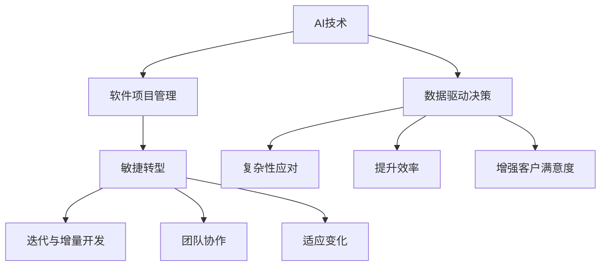

                 

### 引言

在当今快速发展的信息技术时代，人工智能（AI）已经成为推动各行各业变革的核心动力。AI技术的迅猛发展，不仅深刻改变了我们的生活方式，也对软件项目管理提出了新的挑战和机遇。面对这种变革，传统的软件项目管理方法逐渐暴露出其局限性，尤其是在应对复杂、动态和高度不确定性的项目时，其效率和质量都难以满足需求。因此，实现软件项目管理的敏捷转型已成为业界的热门话题和迫切需求。

本文旨在探讨AI时代的软件项目管理敏捷转型策略。我们将从多个维度出发，详细分析AI技术如何影响软件项目管理，敏捷转型的背景与核心概念，以及如何通过敏捷转型实现高效的AI时代软件项目管理。具体来说，文章将分为五个主要部分：

- **第1部分：背景与核心概念**：介绍AI时代的软件项目管理现状，以及敏捷转型的背景与原理。
- **第2部分：敏捷转型理论与实践**：深入探讨敏捷转型的过程模型、团队组织与管理、项目管理工具与技术。
- **第3部分：AI在项目管理中的应用**：阐述AI技术在需求分析、项目计划与跟踪、风险评估与管理中的应用。
- **第4部分：敏捷转型策略**：提出敏捷转型的战略规划、组织变革、文化塑造等策略。
- **第5部分：实战案例与经验分享**：分享国内外的敏捷转型实践，分析成功经验和挑战。

通过这一系列的探讨，我们希望能够为软件项目管理者提供一套切实可行的敏捷转型策略，助力他们在AI时代实现高效的软件项目管理。

关键词：AI时代、软件项目管理、敏捷转型、需求分析、项目计划、风险评估、战略规划、文化塑造

摘要：本文详细探讨了AI时代的软件项目管理面临的挑战与机遇，通过敏捷转型的理论与实践，提出了实现高效软件项目管理的策略。本文首先介绍了AI时代的背景和敏捷转型的核心概念，然后深入分析了AI技术在项目管理中的应用，最后通过实战案例和经验分享，为软件项目管理者提供了实用的指导。

### 第1部分：背景与核心概念

#### AI时代的软件项目管理现状

随着人工智能技术的不断进步，软件项目管理也迎来了全新的时代。AI技术不仅极大地提升了软件开发的效率，还改变了软件项目的管理和组织方式。在AI时代，软件项目管理面临着一系列新的挑战：

1. **复杂性和不确定性**：AI技术使得软件项目变得更加复杂，涉及的技术领域广泛，项目需求的变更频率也显著提高，这使得项目管理的难度和不确定性增加。
2. **数据驱动的决策**：传统的项目管理更多依赖于经验和直觉，而AI时代的管理更加依赖于大数据和智能算法，要求管理者具备数据分析和处理的能力。
3. **协作与沟通**：AI技术的发展使得团队成员之间的协作变得更加紧密，同时也增加了沟通的复杂性，如何在高效协作的同时保持信息的透明性和及时性成为一大挑战。

#### 敏捷转型的背景与原理

敏捷转型是应对AI时代软件项目管理挑战的重要策略。敏捷开发最早起源于20世纪90年代末，其核心理念是应对快速变化的需求和复杂的项目环境。随着AI技术的广泛应用，敏捷转型在软件项目管理中的应用也变得越来越重要。

1. **敏捷开发的核心原则**：
   - **客户价值优先**：以客户需求为导向，优先完成对客户最有价值的功能。
   - **迭代与增量开发**：通过短周期的迭代，逐步交付可用的软件产品。
   - **团队协作**：鼓励团队成员之间的紧密协作，共同解决问题。
   - **适应变化**：快速响应需求变化，保持项目灵活性。

2. **敏捷转型的必要性**：
   - **应对复杂性**：敏捷开发通过迭代和增量开发，能够更好地应对项目的复杂性和不确定性。
   - **提升效率**：敏捷方法强调持续交付和持续改进，能够显著提高项目开发效率。
   - **增强客户满意度**：敏捷开发注重客户参与和反馈，能够更好地满足客户需求。

#### AI的核心概念与技术

AI技术是推动软件项目管理敏捷转型的重要驱动力。以下是AI的一些核心概念和技术：

1. **机器学习**：通过训练模型，使计算机能够从数据中学习和提取规律。
2. **深度学习**：基于多层神经网络的机器学习方法，能够处理大规模和高维度的数据。
3. **自然语言处理（NLP）**：使计算机能够理解和生成自然语言，包括文本分析和语义理解。
4. **计算机视觉**：使计算机能够理解和处理图像和视频数据。

#### 核心概念之间的联系架构

为了更好地理解AI时代软件项目管理中的核心概念，我们可以通过以下Mermaid流程图来展示它们之间的关系：



在这个流程图中，AI技术（A）是推动软件项目管理（B）的核心，而敏捷转型（C）则是在AI技术支持下实现项目高效管理的关键途径。迭代与增量开发（D）、团队协作（E）、适应变化（F）是敏捷转型的核心原则，这些原则共同作用于提升项目管理效率（I）、应对复杂性（H）和增强客户满意度（J）。

通过这一部分的内容，我们为后续的深入探讨奠定了基础。接下来，我们将进一步探讨敏捷转型的理论与实践，以及AI在项目管理中的应用。

### 第2部分：敏捷转型理论与实践

#### 敏捷转型的过程模型

敏捷转型不仅仅是方法的改变，更是一种文化和组织方式的革新。为了实现有效的敏捷转型，我们需要理解敏捷开发的过程模型，并基于此模型进行实践。以下是一种常见的敏捷过程模型——Scrum。

1. **Scrum的核心组件**：
   - **产品待办列表（Product Backlog）**：包含了所有待完成的用户故事和任务，按照优先级排序。
   - **冲刺待办列表（Sprint Backlog）**：在冲刺（Sprint）开始前，团队从产品待办列表中选取的任务，并制定详细的计划。
   - **每日站会（Daily Stand-up）**：团队每日举行简短的会议，讨论进展、问题和计划。
   - **冲刺回顾（Sprint Review）**：在冲刺结束时，团队与利益相关者展示已完成的工作，并收集反馈。
   - **冲刺迭代（Sprint）**：通常是2-4周的时间周期，团队在此期间集中开发特定的功能集。

2. **Scrum的具体流程**：
   - **产品待办列表**：产品负责人（Product Owner）负责维护和更新产品待办列表，确保任务按照业务价值排序。
   - **冲刺计划会议**：在冲刺开始前，团队与产品负责人共同讨论并确定冲刺待办列表，并制定详细的计划。
   - **每日站会**：团队成员轮流分享当天的工作进展，讨论遇到的问题和解决方案。
   - **冲刺迭代**：团队在冲刺期间集中精力完成待办列表中的任务，每天进行站会，确保项目进展顺利。
   - **冲刺回顾**：在冲刺结束时，团队回顾项目的执行情况，评估过程中的成功和不足，并提出改进措施。

#### 敏捷团队的组织与管理

敏捷团队的成功转型离不开有效的组织与管理。以下是敏捷团队组织与管理的关键要素：

1. **小而全的团队**：敏捷团队通常由5-9人组成，涵盖开发、测试、设计和运维等各个角色，以减少沟通成本和增强团队协作。
2. **跨职能团队**：团队中的每个成员都应该具备完成项目所需的多项技能，减少依赖外部资源的可能性。
3. **自组织团队**：团队成员有权自主决定如何完成任务，团队内部通过协作和沟通解决问题。
4. **透明的沟通**：团队内部保持开放和透明的沟通环境，确保信息流畅和决策高效。

5. **关键角色**：
   - **Scrum Master**：负责确保团队遵循敏捷实践，消除障碍，促进团队协作。
   - **产品负责人（Product Owner）**：代表利益相关者，负责制定产品待办列表，确保团队专注于最高优先级的任务。
   - **团队成员**：各成员积极参与团队决策，共同完成项目目标。

#### 敏捷项目管理工具与技术

敏捷项目管理需要有效的工具来支持团队协作和项目进度跟踪。以下是一些常用的敏捷项目管理工具：

1. **JIRA**：一款功能强大的敏捷项目管理工具，支持任务跟踪、版本控制和进度可视化。
2. **Trello**：简单直观的看板工具，通过卡片和列表的形式管理任务和项目进度。
3. **Asana**：全面的敏捷项目管理工具，支持任务分配、进度跟踪和团队协作。
4. **Slack**：即时通讯工具，用于团队内部沟通和协作。
5. **Confluence**：知识共享平台，用于记录会议纪要、文档和项目资料。

#### 实践与应用

在实际项目中，敏捷转型的实践需要结合具体情境进行调整。以下是一个简单的敏捷转型实践案例：

- **项目背景**：某互联网公司计划开发一款社交应用，功能复杂，需求频繁变更。
- **敏捷转型过程**：
  - **阶段1：评估与规划**：团队评估当前的项目管理方法，识别存在的问题，并制定敏捷转型计划。
  - **阶段2：培训与推广**：组织团队成员参加敏捷开发培训，提高团队对敏捷理念和实践的理解。
  - **阶段3：实施与调整**：开始实施敏捷开发，通过短周期的冲刺迭代逐步交付产品，并在每次冲刺结束后进行回顾和调整。

通过敏捷转型，该公司显著提升了项目开发效率，缩短了产品交付周期，并获得了客户的高度满意度。

#### 总结

敏捷转型不仅是软件项目管理的一种方法，更是一种文化和组织方式的革新。通过Scrum过程模型、敏捷团队的组织与管理以及敏捷项目管理工具的应用，团队能够更好地应对AI时代带来的复杂性和不确定性。接下来，我们将进一步探讨AI在项目管理中的应用，以实现更加高效的软件项目管理。

### 第3部分：AI在项目管理中的应用

在AI时代的软件项目管理中，人工智能技术已经不仅仅是一种辅助工具，而是成为推动项目高效运行的核心驱动力。AI的应用不仅提升了项目管理的效率和准确性，还改变了项目管理的模式和思维方式。以下是AI在项目管理中几个关键领域的具体应用：

#### AI在需求分析中的应用

需求分析是软件项目管理的首要任务，其准确性和全面性直接影响到项目的成功与否。AI技术，特别是机器学习和自然语言处理（NLP），在需求分析中发挥着重要作用。

1. **需求收集与分析**：
   - **机器学习技术**：通过机器学习算法，对历史项目需求进行分析，识别出常见的需求模式，为当前项目提供参考。
   - **NLP技术**：利用NLP技术，可以自动从用户反馈、需求文档等非结构化数据中提取关键需求信息，提高需求分析的准确性。

2. **需求预测与优先级排序**：
   - **机器学习模型**：通过分析历史数据和项目特征，构建需求预测模型，预测未来需求的变化趋势，并依据预测结果对需求进行优先级排序。
   - **NLP技术**：结合语义分析技术，对用户需求进行深入理解，识别出高价值需求，从而提高需求管理的效率。

#### AI在项目计划与跟踪中的应用

项目计划与跟踪是项目管理的重要组成部分，AI技术在这一过程中同样发挥了显著作用。

1. **项目计划**：
   - **数据驱动**：利用大数据和机器学习算法，对项目历史数据进行深度分析，预测项目的完成时间和资源需求，制定更准确的项目计划。
   - **优化算法**：通过优化算法，如遗传算法和模拟退火算法，对项目任务进行合理的分配和调度，以最小化资源浪费和时间延误。

2. **项目跟踪**：
   - **实时监控**：利用AI技术，实时监控项目进展，通过数据分析和预测模型，及时发现潜在的风险和问题。
   - **自动化反馈**：系统自动分析项目进度数据，识别出偏差和风险，并生成相应的预警信息，供项目经理决策。

#### AI在风险评估与管理中的应用

在复杂多变的AI时代，项目风险评估和管理变得尤为重要。AI技术为这一领域提供了新的工具和方法。

1. **风险评估**：
   - **数据挖掘与预测**：利用数据挖掘技术，从历史项目数据中提取风险特征，建立风险预测模型，提前识别潜在的风险。
   - **算法分析**：通过算法分析，对项目中的各个环节进行风险评估，评估风险的可能性和影响程度。

2. **风险管理**：
   - **自动化处理**：利用机器学习模型，对已识别的风险进行分类和处理，自动化生成相应的风险应对策略。
   - **动态调整**：根据项目的实际情况和新的数据，动态调整风险管理策略，确保项目能够应对不断变化的风险环境。

#### 核心算法原理与实现

为了更深入地理解AI在项目管理中的应用，以下是几个核心算法的原理和实现方法：

1. **需求预测模型**：
   - **原理**：需求预测模型基于时间序列分析和回归分析，通过分析历史需求数据，预测未来的需求趋势。
   - **实现**：
     ```python
     # 假设我们已经有了需求数据的需求量序列d
     d = [10, 20, 30, 40, 50]
     # 使用线性回归模型进行预测
     from sklearn.linear_model import LinearRegression
     model = LinearRegression()
     model.fit(d[:-1].reshape(-1, 1), d[1:])
     next_demand = model.predict([[d[-1]]])
     print("预测下一个需求量：", next_demand)
     ```

2. **项目进度预测**：
   - **原理**：项目进度预测通常采用时间序列预测模型，如ARIMA（自回归积分滑动平均模型）。
   - **实现**：
     ```python
     # 假设我们已经有了项目进度数据的时间序列p
     p = [1, 2, 3, 4, 5]
     # 使用ARIMA模型进行预测
     from statsmodels.tsa.arima.model import ARIMA
     model = ARIMA(p, 1, 1)
     model_fit = model.fit(p)
     next_progress = model_fit.forecast(steps=1)[0]
     print("预测下一个进度：", next_progress)
     ```

3. **风险评估模型**：
   - **原理**：风险评估模型通常基于贝叶斯网络或决策树，通过构建风险模型，评估不同风险的概率和影响。
   - **实现**：
     ```python
     # 假设我们已经有了风险因素及其概率和影响的数据
     from sklearn.naive_bayes import GaussianNB
     # 构建贝叶斯网络模型
     X = [[0.5, 0.2], [0.3, 0.8], [0.6, 0.1]]  # 风险因素
     y = [1, 0, 1]  # 风险结果
     model = GaussianNB()
     model.fit(X, y)
     # 预测新的风险
     new_risk = model.predict([[0.7, 0.3]])
     print("预测新的风险：", new_risk)
     ```

通过这些核心算法的应用，AI在项目管理中的角色得到了进一步强化，为项目管理者提供了强大的工具和方法，帮助他们更好地应对复杂多变的项目环境。

### 第4部分：敏捷转型策略

在AI时代，实现软件项目管理的敏捷转型不仅需要理解敏捷转型的核心概念和实践，还需要制定和执行具体的转型策略。敏捷转型策略涉及多个方面，包括战略规划、组织变革、文化塑造等。以下是实现敏捷转型的关键策略：

#### 战略规划

战略规划是实现敏捷转型的第一步，它需要明确转型目标、路径和方法。以下是战略规划的关键要素：

1. **明确转型目标**：
   - **提升项目交付效率**：通过敏捷开发，缩短项目交付周期，提高交付质量。
   - **增强团队协作**：建立跨职能团队，促进团队成员之间的紧密协作。
   - **适应市场需求**：快速响应市场变化，保持项目的灵活性和适应性。

2. **制定转型路径**：
   - **分阶段实施**：将转型过程分为若干阶段，逐步推进，确保每个阶段的成功。
   - **试点项目**：选择部分项目作为试点，通过试点项目的实践，总结经验教训，为全面转型提供参考。
   - **全员参与**：鼓励全体员工参与转型过程，提高他们的认同感和参与度。

3. **确定转型方法**：
   - **培训与指导**：为团队成员提供敏捷开发培训，指导他们掌握敏捷开发的方法和实践。
   - **工具支持**：引入敏捷项目管理工具，如JIRA、Trello等，支持团队的协作和项目管理。
   - **持续改进**：建立反馈机制，不断评估和优化转型过程，确保持续改进。

#### 组织变革

组织变革是实现敏捷转型的关键，它需要调整组织结构、流程和文化，以支持敏捷开发。以下是组织变革的关键策略：

1. **调整组织结构**：
   - **跨职能团队**：建立跨职能团队，使团队成员具备多种技能，减少依赖外部资源的可能性。
   - **扁平化组织**：减少管理层级，提高组织的响应速度和决策效率。

2. **优化工作流程**：
   - **简化流程**：消除冗余和低效的流程，简化项目管理流程，提高工作效率。
   - **敏捷流程**：引入敏捷开发流程，如Scrum和Kanban，支持短周期、迭代和增量开发。

3. **变革管理**：
   - **领导支持**：高层领导的支持和参与是变革成功的关键，他们需要明确变革的目标和方向，并推动变革的实施。
   - **沟通与培训**：加强与员工的沟通，解释变革的原因和目标，提供必要的培训和指导，帮助员工适应新的工作方式和流程。

#### 文化塑造

文化塑造是实现敏捷转型的关键，它需要建立以敏捷为核心的文化，鼓励团队成员自主学习和创新。以下是文化塑造的关键策略：

1. **价值观**：
   - **客户至上**：以客户需求为导向，确保团队能够快速响应和满足客户需求。
   - **团队合作**：强调团队合作和跨职能协作，鼓励团队成员共同解决问题。
   - **持续改进**：鼓励团队成员不断反思和改进，追求卓越和卓越。

2. **领导力**：
   - **教练型领导**：领导者应具备教练能力，引导团队成员学习和成长，而不是仅仅下达指令。
   - **以身作则**：领导者应通过自己的行为树立榜样，推动团队文化建设。

3. **激励机制**：
   - **绩效评估**：建立基于敏捷开发绩效评估体系，鼓励团队成员追求卓越。
   - **奖励机制**：通过奖励机制，激励团队成员积极参与敏捷转型和文化建设。

#### 实施与监控

实现敏捷转型需要系统的规划和执行，以下是实施和监控的关键步骤：

1. **实施步骤**：
   - **评估现状**：评估当前的组织结构、流程和文化，识别存在的问题和改进空间。
   - **制定转型计划**：根据评估结果，制定详细的转型计划，包括目标、路径、方法和时间表。
   - **培训与推广**：为团队成员提供必要的培训和指导，帮助他们掌握敏捷开发的方法和实践。
   - **试点实施**：选择部分项目作为试点，通过试点项目的实践，总结经验教训，为全面转型提供参考。
   - **全面推广**：在试点项目成功的基础上，将敏捷转型经验推广到其他项目，实现全面转型。

2. **监控与反馈**：
   - **建立监控体系**：建立监控体系，实时跟踪转型过程，确保各项任务按计划执行。
   - **定期评估**：定期对转型过程进行评估，识别存在的问题和改进空间。
   - **持续改进**：根据评估结果，调整转型策略和计划，确保转型能够持续改进和优化。

通过以上策略，组织可以成功地实现敏捷转型，提高项目管理的效率和灵活性，更好地适应AI时代的挑战和机遇。

### 第5部分：实战案例与经验分享

#### 国内企业敏捷转型的实践

在我国的科技行业中，许多企业已经开始了敏捷转型的实践，并取得了显著的成效。以下是一些典型的案例和成功经验：

**案例1：某大型互联网公司**

这家互联网公司在面临快速增长的市场需求时，传统的项目管理方法已经无法满足其快速迭代和灵活响应的要求。为了应对这一挑战，公司决定全面实施敏捷转型。

- **转型过程**：公司首先对现有的项目管理流程进行了评估和优化，确定了敏捷转型的目标和路径。随后，公司为团队成员提供了系统的敏捷开发培训，并引入了JIRA等敏捷项目管理工具。

- **成功经验**：通过敏捷转型，公司显著提升了项目的交付速度和产品质量，团队之间的协作也变得更加紧密和高效。此外，客户反馈的及时性和响应速度也得到了大幅提升。

**案例2：某知名电子商务平台**

该电子商务平台在用户数量和交易量持续增长的情况下，项目管理面临着巨大的挑战。为了提升运营效率，公司决定实施敏捷转型。

- **转型过程**：公司采取了分阶段实施的策略，首先在部分团队中进行试点，积累经验后再逐步推广。同时，公司建立了敏捷文化，鼓励团队成员自主学习和创新。

- **成功经验**：敏捷转型后，公司的项目交付周期显著缩短，运营效率大幅提升。团队成员的参与度和满意度也显著提高，企业的市场竞争力得到了增强。

#### 国外企业敏捷转型的实践

在国外的科技行业中，敏捷转型同样得到了广泛应用，许多企业通过敏捷方法实现了高效的项目管理。以下是一些国外的成功案例：

**案例1：某国际知名软件公司**

这家软件公司在面对复杂的项目管理和全球分布式团队的情况下，决定进行敏捷转型。

- **转型过程**：公司采用了Scrum框架，通过短周期的冲刺迭代来管理项目。同时，公司注重跨团队的协作和沟通，通过敏捷看板（Agile Board）来可视化项目进度。

- **成功经验**：敏捷转型使得项目的交付速度和质量得到了显著提升，团队能够更好地应对复杂性和不确定性。此外，公司的客户满意度也显著提高。

**案例2：某全球领先的技术服务公司**

这家技术服务公司在为客户提供定制化解决方案时，面临着不断变化的需求和复杂的项目环境。为了提升服务质量，公司决定实施敏捷转型。

- **转型过程**：公司通过引入敏捷框架和工具，如JIRA和Confluence，来管理项目。同时，公司还建立了敏捷培训计划，确保团队成员掌握敏捷方法。

- **成功经验**：敏捷转型使得公司的项目交付速度和质量得到了显著提升，客户满意度也得到了显著提高。公司还通过敏捷文化塑造，增强了团队的凝聚力和创新力。

#### AI与敏捷转型的融合案例

随着AI技术的不断发展，许多企业在敏捷转型中开始尝试将AI技术与敏捷方法相结合，以实现更加高效的项目管理。以下是一个融合AI与敏捷转型的成功案例：

**案例：某人工智能初创公司**

这家初创公司在开发人工智能产品时，面临着复杂的需求和高度的不确定性。为了实现高效的项目管理，公司决定将AI技术与敏捷方法相结合。

- **转型过程**：公司首先对项目需求进行机器学习分析，利用AI技术识别出关键需求和潜在风险。然后，公司采用了Scrum框架，通过短周期的迭代来管理项目。

- **成功经验**：通过AI技术的应用，公司能够更准确地预测项目需求和风险，从而提高了项目的规划和管理效率。同时，敏捷方法的实施使得团队能够快速响应变化，缩短了产品交付周期。公司还通过AI技术对项目进展进行实时监控，确保项目能够按计划进行。

通过以上国内外企业以及AI与敏捷融合的实战案例，我们可以看到敏捷转型在提升项目管理效率、增强团队协作和适应市场需求方面具有显著的优势。这些成功经验为其他企业提供了宝贵的参考和启示。

### 结论与展望

本文探讨了AI时代的软件项目管理敏捷转型策略，详细分析了AI技术在项目管理中的应用、敏捷转型的核心概念与理论、敏捷转型策略的制定与实施，以及国内外企业的敏捷转型实践。通过这些探讨，我们认识到：

1. **AI技术的应用**：AI技术不仅提升了项目管理的效率和准确性，还改变了项目管理的模式和思维方式，为敏捷转型提供了强有力的支持。
2. **敏捷转型的必要性**：敏捷转型是应对AI时代项目管理挑战的有效策略，通过迭代与增量开发、跨职能团队协作、数据驱动决策等方式，显著提高了项目的交付速度和灵活性。
3. **敏捷转型策略**：制定和实施有效的敏捷转型策略，包括战略规划、组织变革、文化塑造等，是实现高效软件项目管理的关键。
4. **实践与经验分享**：通过国内外企业的实战案例，我们看到了敏捷转型的成功经验和挑战，为其他企业提供了宝贵的参考。

未来，随着AI技术的不断发展和应用，软件项目管理将迎来更多的变革和机遇。以下是一些展望：

1. **AI与敏捷的深度融合**：进一步探索AI技术与敏捷方法的深度融合，开发出更加智能化、自动化的项目管理工具和方法。
2. **持续改进与优化**：在敏捷转型的过程中，持续改进和优化是关键，通过反馈机制和持续学习，不断提升项目管理的效率和效果。
3. **跨行业应用**：敏捷转型不仅适用于IT行业，还可以广泛应用于其他行业，助力企业实现数字化转型和高效管理。

总之，AI时代的软件项目管理敏捷转型是一项系统工程，需要我们不断探索和实践，以实现高效、灵活和可持续的项目管理。作者：AI天才研究院/AI Genius Institute & 禅与计算机程序设计艺术 /Zen And The Art of Computer Programming。

